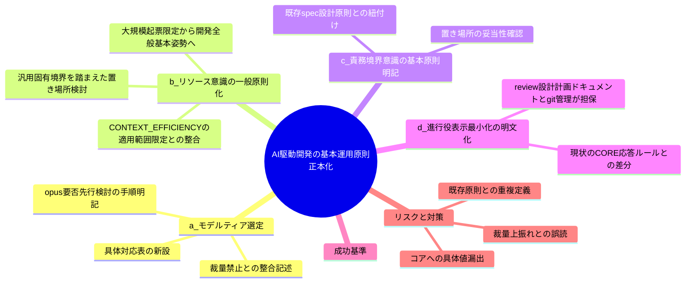
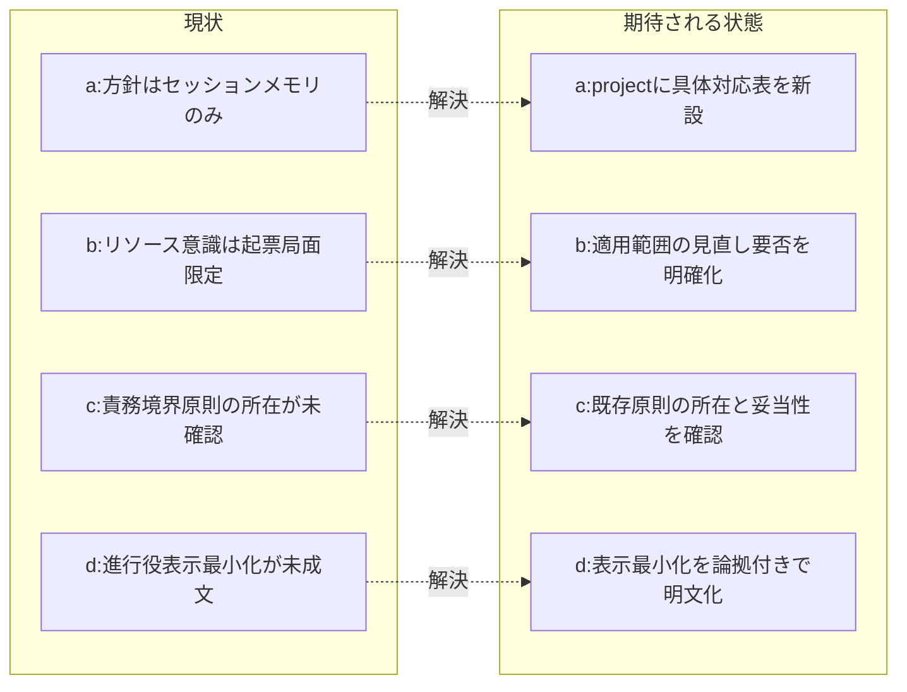

# 要求定義書: AI駆動システム開発の基本運用原則の正本化（モデルティア選定・リソース意識・責務境界・進行役表示）

**プロジェクト名**: AI駆動システム開発の基本運用原則の正本化（モデルティア選定・リソース意識・責務境界・進行役表示）  
**作成日**: 2026 年 07 月 12 日  
**最終更新**: 2026 年 07 月 12 日

> **重要**:
>
> - 要求定義書は、プロジェクトの全体像を把握するためのものです。詳細な技術仕様や実装方法は要件定義書以降で記載します。必要最低限の情報に収めることを心掛けてください。
> - **このドキュメントは常に更新**: 要求の変更や追加があった場合は、即座にこのドキュメントを更新してください。ドキュメントは「生きているドキュメント」として扱い、実装内容と常に同期させます。
> - **必須項目**: 以下の「必須」と明記した項目は空欄・抽象語のみ（例: 「{説明}」のまま）で提出しないこと。判定可能な形（目的は1文・成功基準は○/×で判定できる記載等）で記入すること。
>
> **用語**: [.agent-skill-chain/source/CONCEPTS.md §用語規約](../../../../.agent-skill-chain/source/CONCEPTS.md#用語規約) を参照。

---

## 要求定義の全体像

**注意**:

- 上記の「プロジェクト名」は例です。実際のプロジェクト名に置き換えてください。
- マインドマップは全体像を把握するためのものです。主要なセクション名程度に留め、詳細は記載しないでください。

---

## 1. 目的・背景

### 1.1 目的（必須）

AI駆動システム開発の4基本運用原則（モデルティア選定・リソース意識・責務境界・進行役表示）を正本化する。

### 1.2 背景

- **現状の課題**:
  - **(a) モデルティア選定**: サブ委譲時のモデルティア選定方針が、正本化された固有ファイルではなく**セッションメモリ（自動メモリ）にのみ**存在している（例: `feedback_model-tier-story8.md`「ストーリー8以降 fable 禁止。監査/設計=opus、実装=sonnet」）。コア `MODEL_SELECTION.md §汎用/固有境界` は「具体ティア対応表・モデル名は `.agent-skill-chain/project/` に置く」と定めるが、該当ファイルが存在しない（`grep` 実測で `.agent-skill-chain/project/` 配下にモデルティア言及ファイル 0 件を確認）。
  - **(b) リソース（トークン・コンテキスト）意識**: 現行 `CONTEXT_EFFICIENCY.md` は「大規模一括issue起票時のコンテキスト肥大防止」という**局面限定**の原理として書かれている（`CONTEXT_EFFICIENCY.md:7`「大規模一括起票時のコンテキスト肥大を防ぐ汎用原理」、`§適用のスケーリング`「単一/少数 issue」「大規模一括起票」の 2 区分のみ）。しかしユーザーは、AIを使ったシステム開発中のトークン・コンテキスト意識は**局面を問わない当たり前の基本姿勢**であるべきという認識を示しており、現状の適用範囲限定との間に**認識のずれ**が確認された。
  - **(c) 責務・境界意識**: 「責務と境界を意識すること」はどんな作業でも当たり前の基本原則であるべきだが、この原則がどこに・どの粒度で明記されているかが本セッションで問われた。調査の結果、`spec/01_設計原則.md §単一責務・§明確な境界`および`spec/06_設計判断の優先順位.md`（「再利用のために責務を曖昧にしてはならない」等）に**既に存在する**ことを確認した（`evidence_source: existing_code`）。既存原則が「どんな作業でも当たり前の基本原則」という位置づけとして十分な粒度・置き場所になっているかは論点として残る。
  - **(d) 進行役表示の最小化**: 進行役（オーケストレータ）自身の応答・表示は、ユーザーが進捗を確認できる程度の最小限でよい、という方針が本セッションで示された。詳細は review（04_review 等）・設計/計画ドキュメント（00〜03）に残り、かつ git 管理されているため情報は失われない、という論拠に基づく。調査の結果、`AGENT_CONDUCT.md §1 結論先行` はサブエージェントの報告スタイルに関する規定であり（`AGENT_CONDUCT.md:5`「サブエージェント行動規範」）、`boot/CORE.md §応答ルール` は進行役が説明すべき**手順の型**（phase判定→command選択→run_command→結果確認）を定めるのみで、**進行役自身のコンテキスト肥大化防止を目的とした表示最小化**を明文化した規定は**存在しない**（`evidence_source: existing_code`、grep 調査で確認済みのギャップ）。

- **必要性**:
  - (a) は `MODEL_SELECTION.md §2 ティア明記義務`（根拠 1 行明記・根拠の無い指定は不可）を履行するために正本対応表が必要。
  - (b) はコンテキスト効率原則の適用漏れ（局面限定によりissue起票以外の開発全般でコンテキスト意識が緩む）を防ぐために、位置づけの見直し要否を検討する必要がある。
  - (c) は既存原則の所在確認は取れたが、「基本原則」としての強度・参照のされやすさが十分かを検証し、必要なら強化する必要がある。
  - (d) は進行役自身の表示肥大化を抑止する根拠が未成文であるため、正当化の論拠（review/設計/計画ドキュメント＋git管理による情報担保）とともに明文化する必要がある。

### 1.3 期待される効果（必須: 1 件以上）

- **効果 1（a）**: `.agent-skill-chain/project/` に役割→ティアの具体対応表が実在し、サブ委譲時に「該当行」を根拠 1 行として引用できる状態になる（対応表ファイルの存在と該当行の引用可否で ○/× 判定可能）。
- **効果 2（b）**: リソース（トークン・コンテキスト）意識が「大規模一括issue起票時」限定ではなく、AI駆動システム開発全般の基本姿勢として位置づけ直されているか、または現状維持が妥当と判断された場合はその判断根拠が記録されている（位置づけの記述または判断根拠の記載有無で ○/× 判定可能）。
- **効果 3（c）**: 責務・境界意識が基本原則として明記されている箇所（既存 spec/01_設計原則.md 等）が要求定義中に特定され、その粒度・置き場所の妥当性が確認されている（特定・確認の記載有無で ○/× 判定可能）。
- **効果 4（d）**: 進行役自身の報告・表示を最小化してよいことの明文化案（論拠＝review/設計/計画ドキュメント＋git管理による情報担保を含む）が要求定義に記載されている（記載有無で ○/× 判定可能）。

**現状と期待される状態の比較**:

---

## 2. 機能要件

### 2.1 既存機能の維持（該当する場合）

- コア `MODEL_SELECTION.md`・`CONTEXT_EFFICIENCY.md`・`AGENT_CONDUCT.md`・`spec/01_設計原則.md` の既存の抽象原則本文は、本 issue で不必要に改変・重複定義しない（汎用/固有境界の維持）。本 issue はコア本文の直接改変ではなく、**正本化ギャップの特定と、置き場所・記述内容の要求整理**を主目的とする（実際の改変内容・改変先ファイルは 02_設計で確定する）。

### 2.2 新規機能要件

以下 4 論点それぞれについて、要求として整理する（配置・改変方式の具体は 02_設計で確定する）。

**(a) モデルティア選定手順の正本化**

- **選定手順（先行必須ステップ）**: 実装着手前に、まず「opus で実装させるべきか」を必ず検討する。opus 不要と判断できた場合に**限り** sonnet へ委譲する（sonnet をデフォルトにして複雑な時だけ格上げする、ではない順序）。
- **役割 → ティア対応表**（今回のセッション合意を正本化する候補）:
  - 設計・レビュー・監査 = opus
  - 実装 = 原則 sonnet。ただしオーケストレータが複雑と判断した箇所は opus へ格上げ可
  - 書記（ログ記録専任）= haiku（`evidence_source: existing_code` — `.agent-skill-chain/runtime/templates/agents/scribe_claude.md:11` に `model: haiku` と既に明記されている実例）
  - fable への委譲は原則禁止。ユーザーが個別 issue を「最重要」と明示指定した場合のみ都度例外
- **品質最優先の明記**: コストは重要だが二次的な判断材料であり、品質ゲートを下げる理由にしない（コア `§3 品質ゲート最上位固定` と整合）。
- **裁量禁止との整合の明記**: 「opus 要否を先に検討必須」は、エージェントの自由裁量ではなく**ユーザーが明示的に定めた対応表の選定手順そのもの**である。矛盾ではなく「対応表の該当行の決め方」として位置づける（詳細は §7 の ADR-1）。

**(b) リソース（トークン・コンテキスト）意識の基本原則としての位置づけ直し**

- 「AIを使ったシステム開発中のトークン・コンテキストを意識すること」を、issue 一括起票という特定局面に限定せず、AI駆動システム開発全般に適用される基本姿勢として位置づける要求を整理する。
- 現行 `CONTEXT_EFFICIENCY.md` は責務として「issue 起票時のコンテキスト効率（ISSUE_CREATION）の正本」（`CONTEXT_EFFICIENCY.md:5`）と限定しており、本文（issue-persist 境界・仕様inventory索引化・fresh サブハンドオフ）も起票局面に特化した具体機構である。よって「基本原則としての一般化」と「起票局面特化の具体機構」は**性質が異なる**ため、既存ファイルの本文を単純に汎化するのではなく、**一般原則の記述をどこに置くか**（例: 上位の基本原則層に短い一文を追加し、`CONTEXT_EFFICIENCY.md` は「起票局面での具体適用」として位置づけ直す、等）を論点として 02_設計で検討する要求として明記する。
- 汎用/固有境界（コアに具体値を混入させない）を踏まえ、コアに置くのは「基本姿勢である」という抽象原則の一文に留め、具体的な閾値・機構は既存 `CONTEXT_EFFICIENCY.md`／`.agent-skill-chain/project/` の役割分担を維持する方向で検討する。

**(c) 責務・境界意識の基本原則としての明記**

- 「責務と境界を意識すること」はどんな作業でも当たり前の基本原則であるという位置づけを要求として整理する。
- 既存の所在確認: `spec/01_設計原則.md §単一責務・§明確な境界`、`spec/06_設計判断の優先順位.md`（`evidence_source: existing_code`）。これらは設計判断時の原則として書かれており、**設計フェーズに限定されない全工程の基本姿勢**として十分読めるか（例: 実装・レビュー・issue 起票等でも同様に適用されるという明記があるか）を 02_設計で確認する要求として整理する。
- 既存原則で足りると判断される場合は「新規追加不要、既存箇所への参照強化のみ」を選択肢に含める（過剰な重複定義を避ける）。

**(d) 進行役自身の報告・表示最小化の明文化**

- 進行役（オーケストレータ）自身の応答・表示は、ユーザーが進捗を確認できる程度に留めてよいことを明文化する要求を整理する。
- 論拠: 詳細情報は review（04_review 等）・設計/計画ドキュメント（00〜03）に残る前提であり、かつ git 管理下にあるため情報は失われない。
- 既存差分の確認: `AGENT_CONDUCT.md §1 結論先行` はサブエージェントの報告スタイル規定（`AGENT_CONDUCT.md:5`）であり、進行役自身の表示最小化を対象としない。`boot/CORE.md §応答ルール` は進行役の説明の**型**を定めるのみで、コンテキスト肥大化防止を目的とした**表示量の最小化**は明文化されていない（`evidence_source: existing_code`、調査で確認したギャップ）。この差分を埋める明文化の要求として整理する（置き場所は `boot/CORE.md` かその他かを 02_設計で確定する）。

---

## 3. 非機能要件

### 3.1 パフォーマンス

- (a) 対応表の参照は該当行 1 行の引用で完了する軽量手順とする。
- (b)(d) いずれも、正本化の目的が「コンテキスト・トークン消費の抑制」であるため、正本化後の記述自体が冗長化し新たな肥大化要因にならないこと。

### 3.2 セキュリティ

- 本 issue はドキュメント（運用原則の正本化）整備であり、機密・認証情報を扱わない。特段のセキュリティ要件はない。

### 3.3 互換性

- 既存コアファイル（`MODEL_SELECTION.md`・`CONTEXT_EFFICIENCY.md`・`AGENT_CONDUCT.md`・`spec/01_設計原則.md`・`boot/CORE.md`）の抽象原則と後方互換であること。既存原則を上書き・矛盾させる改変は避け、拡張・接続を基本方針とする。
- ティア選択の概念が存在しない対象外環境（コア §1）では (a) は発火せず、そのランタイムのデフォルト動作に従うこと。

### 3.4 保守性

- (a) モデルティアの具体は `.agent-skill-chain/project/` に単一情報源を置く（コアと二重化しない）。
- (b)(c)(d) はいずれも既存コアファイルとの**重複定義を避け**、参照でつなぐことを優先する（`spec/06_設計判断の優先順位.md`「docs と実装の不整合を放置してはならない」と整合）。

---

## 4. 制約条件

### 4.1 技術的制約

- コア `MODEL_SELECTION.md §汎用/固有境界` により、(a) の具体ティア対応表・モデル名はコアに置かず `.agent-skill-chain/project/` に置く。
- `.agent-skill-chain/project/README.md §優先順位` により、project 配下のルールが `.agent-skill-chain/source/` より優先される。
- (b)(c)(d) は「コアに置く抽象原則」と「project/具体機構に置く詳細」の役割分担（汎用/固有境界の思想）を踏まえて検討すること。安易にコアへ具体値・局面限定の運用細則を持ち込まない。

### 4.2 既存システムとの互換性

- 既存の project ファイル（`自己拡張ワークフロー.md`・`COVERAGE_EXCEPTIONS.md`・`README.md`）と目的が競合しないこと。
- (a) のモデルティアに言及する既存 project ファイルは現状 0 件のため、新規の固有ファイルとして追加するか既存ファイルに節を設けるかは 02_設計で判断する。
- (b)(c)(d) は既存コアファイル（`CONTEXT_EFFICIENCY.md`・`spec/01_設計原則.md`・`AGENT_CONDUCT.md`・`boot/CORE.md`）への追記・接続か、新規ファイル新設かを 02_設計で判断する。

### 4.3 移行期間・スケジュール

- 段階移行は不要（正本化のため）。正本化完了後はセッションメモリの当該記述を「正本は project／source」とする位置づけに切り替える（メモリの削除可否は本 issue の対象外）。

---

## 5. 除外要件

- **コア各ファイルの抜本的な再構成・リライト**は行わない。既存の抽象原則を維持しつつ、ギャップの追記・接続に限定する。
- **(a) 下振れ（降格）の計測閾値・承認フロー・対応表更新手順**の具体設計は本 issue のスコープ外とする（品質最優先・コスト二次、fable 原則禁止＋最重要時のみ都度例外、までを対象とする）。
- **(b) `CONTEXT_EFFICIENCY.md` の具体機構（仕様inventory索引化・fresh サブハンドオフ等）自体の再設計**は対象外。位置づけ（適用範囲の記述）の見直し要否の検討に限定する。
- **02_設計・03_実装計画・実装・レビュー**は本 issue の後続フェーズで別途扱う（本ドキュメントは 00 要求定義・01 要件定義まで）。
- **セッション自動メモリの削除・改変**は対象外。

---

## 6. 成功基準（必須: 1 件以上）

- **SC1（a）**: `.agent-skill-chain/project/` 配下に、役割（設計/レビュー/監査・実装・書記）→ ティア（opus/sonnet/haiku）の対応表が正本として存在する（ファイルの存在と各行の記載を目視で ○/× 判定）。
- **SC2（a）**: 対応表に「実装着手前に opus 要否を先に検討する」先行必須ステップが明記され、opus 不要判断時に限り sonnet へ委譲する順序として読める（記載の有無で ○/× 判定）。
- **SC3（a）**: fable 原則禁止・最重要指定時のみ都度例外、が対応表に明記されている（記載の有無で ○/× 判定）。
- **SC4（a）**: 「opus 要否先行検討」が `MODEL_SELECTION.md §裁量の禁止と形骸化防止` の裁量上振れ／裁量下振れ禁止と矛盾しない旨が、要求定義（本書 §7 ADR-1）に記述されている（記述の有無で ○/× 判定）。
- **SC5（a）**: 書記 = haiku の根拠が実在実例（`scribe_claude.md:11`）に基づいて記載されている（`evidence_source: existing_code` の付記有無で ○/× 判定）。
- **SC6（b）**: リソース（トークン・コンテキスト）意識の適用範囲について、「AI駆動システム開発全般の基本姿勢として位置づけ直す」か「現状の局面限定を維持する」かの検討結果・判断根拠が要求定義（§7 ADR-2）に記述されている（記述の有無で ○/× 判定）。
- **SC7（c）**: 責務・境界意識を基本原則として明記している既存箇所（`spec/01_設計原則.md` 等）が特定され、その粒度・置き場所が「どんな作業でも当たり前の基本原則」として十分かの評価が記述されている（記述の有無で ○/× 判定）。
- **SC8（d）**: 進行役自身の報告・表示最小化の明文化案が、論拠（review/設計/計画ドキュメント＋git管理による情報担保）とともに要求定義（§7 ADR-4）に記述されている（記述の有無で ○/× 判定）。

---

## 7. リスクと対策

### 7.1 技術的リスク

- **リスク**: 「opus 要否を先に検討必須」が、`§裁量の禁止と形骸化防止` の「迷ったら上位＝裁量上振れの禁止」と衝突するように誤読される。
  - **対策（ADR-1）**:
    1. **コンテキスト**: ユーザーは「実装着手前にまず opus で実装させるべきかを必ず検討する」プロセスを要求した。一方コア §裁量の禁止は「迷ったら上位」という裁量上振れ・コスト都合の裁量下振れを禁じている。両者の関係を要求定義で確定する必要がある。
    2. **検討した選択肢**: (i) 選定手順を「エージェントの裁量判断」として記述する（§裁量の禁止と衝突しうる）／(ii) 選定手順を「ユーザーが明示的に定めた対応表の該当行の決め方（非裁量ルール）」として記述する。
    3. **決定**: (ii) を採用する。「opus 要否先行検討」は対応表の**選定手順そのもの**であり、エージェントが迷って上位を選ぶ裁量上振れではない。
    4. **根拠**: `evidence_source: human_decision`（プロジェクトオーナーが本セッションで明示した方針）。コア `MODEL_SELECTION.md §2`（根拠＝対応表の該当行を 1 行明記）および `§裁量の禁止 1`（迷った場合も対応表の該当行に基づいて選ぶ）と整合する。
    5. **帰結**: 選定は非裁量のまま維持され、opus 要否先行検討は対応表運用の一部として位置づく。コスト都合の裁量下振れ（降格）は引き続き §裁量の禁止 2 の手続きを要し、本 issue はそれを緩和しない。

- **リスク**: リソース意識の一般原則化が、`CONTEXT_EFFICIENCY.md` の既存の局面限定設計（適用のスケーリング＝軽量運用と大規模一括起票の 2 区分）を無自覚に破棄し、過剰適用（軽量作業にまで全機構を強制）を招く。
  - **対策（ADR-2）**:
    1. **コンテキスト**: ユーザーは「トークン・コンテキスト意識は開発全般の基本姿勢であるべき」と述べたが、`CONTEXT_EFFICIENCY.md` は起票局面限定の具体機構（仕様inventory索引化・fresh サブハンドオフ等）として設計されている。両者をどう両立させるかが論点。
    2. **検討した選択肢**: (i) `CONTEXT_EFFICIENCY.md` 本文を全面汎化し具体機構も開発全般に適用する／(ii) `CONTEXT_EFFICIENCY.md` は「起票局面での具体適用例」として現状維持し、より上位の基本原則層（例: `AGENT_CONDUCT.md` 相当の基本姿勢を述べる箇所）に「リソース意識は開発全般の基本姿勢である」という**抽象原則の一文**を追加し、`CONTEXT_EFFICIENCY.md` からはその一文を参照する形にする。
    3. **決定**: (ii) の方向性を採用候補とする（確定は 02_設計で行う）。抽象原則（基本姿勢である旨）と具体機構（起票時の索引化等）の役割分担を維持し、`CONTEXT_EFFICIENCY.md §適用のスケーリング`（過剰適用回避の思想）を壊さない。
    4. **根拠**: `evidence_source: human_decision`（ユーザー方針）＋ `evidence_source: existing_code`（`CONTEXT_EFFICIENCY.md:7,57-64` の既存責務・スケーリング設計の確認）。
    5. **帰結**: 02_設計で置き場所・文言を確定する。既存の起票局面向け具体機構は維持し、二重定義を避ける。

- **リスク**: 責務・境界意識の「基本原則としての明記」を新規に追加しようとして、既に存在する `spec/01_設計原則.md` と重複定義してしまう。
  - **対策（ADR-3 の前段）**: 本要求定義の執筆時点で既存箇所（`spec/01_設計原則.md §単一責務・§明確な境界`、`spec/06_設計判断の優先順位.md`）を特定済み（`evidence_source: existing_code`）。02_設計では「新規追加」ではなく「既存箇所への参照強化・適用範囲の明確化（設計フェーズに限らない旨の明記）」を優先案として検討する。

- **リスク**: 進行役自身の表示最小化の明文化が、`AGENT_CONDUCT.md §1 結論先行`（サブエージェント向け）と混同され、二重定義または矛盾する記述になる。
  - **対策（ADR-4）**:
    1. **コンテキスト**: ユーザーは「進行役自身の表示・報告は最低限でよい」と述べた。既存 `AGENT_CONDUCT.md` はサブエージェント向け規範（`AGENT_CONDUCT.md:5`）であり対象が異なる。`boot/CORE.md §応答ルール` は進行役の説明の型を定めるが表示量の最小化には触れない。
    2. **検討した選択肢**: (i) `AGENT_CONDUCT.md` に進行役向け条項を追加する（責務混在のリスク）／(ii) `boot/CORE.md §応答ルール` に「進行役自身の表示は最小限でよい（詳細は 00〜04・git 管理で担保）」を追記する（進行役の応答仕様を扱う既存箇所と責務が一致）。
    3. **決定**: (ii) の方向性を採用候補とする（確定は 02_設計）。`AGENT_CONDUCT.md` はサブエージェント向けという既存の責務分離（`AGENT_CONDUCT.md:5`）を壊さない。
    4. **根拠**: `evidence_source: human_decision`（ユーザー方針、論拠＝review/設計/計画ドキュメントとgit管理による情報担保）＋ `evidence_source: existing_code`（`AGENT_CONDUCT.md:5`・`boot/CORE.md §応答ルール` の対象範囲確認）。
    5. **帰結**: 進行役自身の表示最小化は `boot/CORE.md` 側の既存「応答ルール」の拡張として位置づけ、サブエージェント規範（`AGENT_CONDUCT.md`）とは責務を分離したまま整合させる。

### 7.2 スケジュールリスク

- **リスク**: 4 論点（a〜d）を 1 つの要求定義に統合したことで、後続の 02_設計が単一 issue として肥大化する。
  - **対策**: 02_設計では論点ごとに設計判断（配置先・改変方式）を独立して記述してよいものとし、実装計画（03）も論点単位でタスク分割してよい（1 issue 内でのサブタスク分割であり、新規サブ issue の起票は本要求の対象外）。

---

## 8. 参考資料

### プロジェクトドキュメント

- 既存プロジェクトの場合は `00_システム理解.md`（システム理解）を参照するが、本 issue では該当ファイルは未作成のため参照なし。

### その他の参考資料

- [.agent-skill-chain/source/MODEL_SELECTION.md](../../../../.agent-skill-chain/source/MODEL_SELECTION.md) - (a) モデルティア選定の抽象原則
- [.agent-skill-chain/source/CONTEXT_EFFICIENCY.md](../../../../.agent-skill-chain/source/CONTEXT_EFFICIENCY.md) - (b) 現行のissue起票局面限定のコンテキスト効率原則
- [.agent-skill-chain/source/spec/01_設計原則.md](../../../../.agent-skill-chain/source/spec/01_設計原則.md) §単一責務・§明確な境界 - (c) 既存の責務・境界原則
- [.agent-skill-chain/source/spec/06_設計判断の優先順位.md](../../../../.agent-skill-chain/source/spec/06_設計判断の優先順位.md) - (c) 責務の明確さに関する判断優先順位
- [.agent-skill-chain/source/AGENT_CONDUCT.md](../../../../.agent-skill-chain/source/AGENT_CONDUCT.md) §1 結論先行 - (d) サブエージェント向け報告規範（対比対象）
- [.agent-skill-chain/source/boot/CORE.md](../../../../.agent-skill-chain/source/boot/CORE.md) §応答ルール - (d) 進行役の応答の型（表示量の明文化は未存在）
- [.agent-skill-chain/project/自己拡張ワークフロー.md](../../../../.agent-skill-chain/project/自己拡張ワークフロー.md) - issue 作成場所の上書き（本 issue の配置根拠）
- [.agent-skill-chain/project/README.md](../../../../.agent-skill-chain/project/README.md) §優先順位 - project が source に優先
- `.agent-skill-chain/runtime/templates/agents/scribe_claude.md:11`（`model: haiku`）- (a) 書記 = haiku の実在実例（`evidence_source: existing_code`）
- [.agent-skill-chain/source/CONCEPTS.md §外部根拠の必須化](../../../../.agent-skill-chain/source/CONCEPTS.md#外部根拠の必須化external-anchor) - evidence_source 6 分類の正本
- セッション自動メモリ `feedback_model-tier-story8.md`（正本化前の暫定運用の記録。`evidence_source: human_decision`）

---

## 9. 次のステップ

この要求定義書の承認後、以下のドキュメントを作成します：

- **次**: [`01_要件定義.md`](./01_要件定義.md) - 要件定義フェーズ
