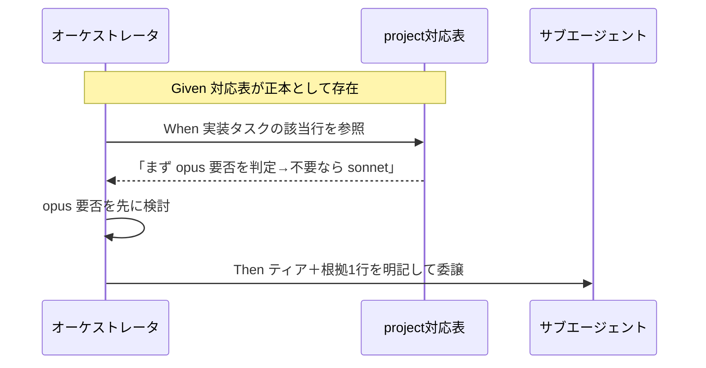

# 要件定義書: AI駆動システム開発の基本運用原則の正本化（モデルティア選定・リソース意識・責務境界・進行役表示）

**プロジェクト名**: AI駆動システム開発の基本運用原則の正本化（モデルティア選定・リソース意識・責務境界・進行役表示）  
**作成日**: 2026 年 07 月 12 日  
**最終更新**: 2026 年 07 月 12 日

> **重要**: **このドキュメントは常に更新**: 要件の変更や追加があった場合は、即座にこのドキュメントを更新してください。ドキュメントは「生きているドキュメント」として扱い、実装内容と常に同期させます。
>
> **用語**: [.agent-skill-chain/source/CONCEPTS.md §用語規約](../../../../.agent-skill-chain/source/CONCEPTS.md#用語規約) を参照。

---

## 1. 概要

### 1.1 システム概要

サブ委譲時のモデルティア選定（a）に加え、AI駆動システム開発の基本運用原則として、リソース（トークン・コンテキスト）意識の一般原則化（b）、責務・境界意識の基本原則としての明記（c）、進行役自身の報告・表示最小化の明文化（d）の 4 論点を、コア `.agent-skill-chain/source/` の抽象原則と `.agent-skill-chain/project/` の具体機構の役割分担を踏まえて正本化する。オーケストレータは `MODEL_SELECTION.md §2` が要求する「根拠＝対応表の該当行」を実在する行から引用できるようになり（a）、リソース意識・責務境界意識が局面や工程を問わない基本姿勢として参照可能になり（b・c）、進行役自身の応答は review/設計/計画ドキュメントと git 管理による情報担保のもとで最小化してよいことが明文化される（d）。

### 1.2 用語集

| 用語 | 説明 |
| -------- | ------ |
| ティア | サブ委譲時に選択するモデルの階層（opus / sonnet / haiku / fable）。コア `MODEL_SELECTION.md` の用語 |
| 対応表 | 役割 → ティアの割り当てと選定手順を定義した、project 配下の正本テーブル |
| 該当行 | ティア指定の根拠として引用する対応表の 1 行（`MODEL_SELECTION.md §2` の「根拠 1 行明記」の参照先） |
| opus 要否先行検討 | 実装着手前にまず「opus で実装させるべきか」を必ず判定し、不要と確定した場合に限り sonnet へ委譲する選定手順 |
| 裁量上振れ | 「迷ったら上位ティア」という裁量による格上げ。コア §裁量の禁止 1 で禁止 |
| 裁量下振れ | コスト都合による裁量的な降格。コア §裁量の禁止 2 で計測＋承認＋対応表更新を経ない限り禁止 |
| 対象外環境 | ティア選択の概念が存在しないランタイム。コア §1 により本対応表は発火せずデフォルト動作に従う |
| リソース意識の一般原則化 | トークン・コンテキスト消費への配慮を、issue 一括起票局面に限定せず AI 駆動システム開発全般の基本姿勢として位置づけること（本要件の論点 b） |
| 責務・境界意識 | 1 モジュール・1 ドキュメント・1 判断が単一の責務を持ち、境界が明確であるべきという原則。既存 `spec/01_設計原則.md` に定義済み（論点 c） |
| 進行役表示最小化 | オーケストレータ自身の応答・表示を、ユーザーが進捗確認できる程度に留めてよいという方針（論点 d） |

---

## 2. 機能要件

### 2.1 ユーザーストーリー

#### ストーリー 1: 該当行を根拠にティアを指定する（a）

- **As a** オーケストレータ（進行役）
- **I want to** サブ委譲時に `.agent-skill-chain/project/` の対応表から役割に対応する該当行を引用してティアを指定したい
- **So that** `MODEL_SELECTION.md §2 ティア明記義務`（根拠 1 行明記・根拠の無い指定は不可）を、実在する該当行に基づいて履行できる

**受け入れ基準**:

- 対応表に「設計・レビュー・監査 = opus」「実装 = 原則 sonnet（複雑箇所は opus 格上げ可）」「書記 = haiku」の行が存在する（00 §6 SC1）。
- 各行はそのまま委譲パケットの根拠 1 行として引用できる粒度で書かれている。

#### ストーリー 2: 実装前に opus 要否を先に検討する（a）

- **As a** オーケストレータ（進行役）
- **I want to** 実装を委譲する前に、まず「opus で実装させるべきか」を先に検討する手順を対応表に従って踏みたい
- **So that** opus 不要と確定した場合に限り sonnet へ委譲でき、品質を最優先しつつ選定を非裁量に保てる

**受け入れ基準**:

- 対応表の「実装」行が「まず opus 要否を判定 → 不要と確定した場合のみ sonnet」の順序で読める（00 §6 SC2）。
- 「sonnet をデフォルトにして複雑な時だけ格上げ」という逆順の記述になっていない。

#### ストーリー 3: fable 委譲を原則禁止にする（a）

- **As a** プロジェクトオーナー
- **I want to** fable への委譲を原則禁止とし、個別 issue を「最重要」と明示指定した場合のみ都度例外としたい
- **So that** 品質ゲートを保ちつつ、例外を日常運用化させない

**受け入れ基準**:

- 対応表に「fable 原則禁止／最重要明示指定時のみ都度例外」が明記されている（00 §6 SC3）。

#### ストーリー 4: 裁量禁止との整合が明文化されている（a）

- **As a** レビュワー（監査）
- **I want to** 「opus 要否先行検討」が `§裁量の禁止と形骸化防止` と矛盾しないことを要求定義で確認したい
- **So that** 選定手順が裁量上振れ／裁量下振れと誤読されず、非裁量ルールとして運用される

**受け入れ基準**:

- 00 §7 ADR-1 に、opus 要否先行検討が「対応表の該当行の決め方（非裁量）」であり裁量上振れではない旨が記述されている（00 §6 SC4）。
- 書記 = haiku の根拠が実在実例（`scribe_claude.md:11`）に基づき `evidence_source: existing_code` 付きで記載されている（00 §6 SC5）。

#### ストーリー 5: リソース意識を開発全般の基本姿勢として参照できる（b）

- **As a** サブエージェント（issue 起票以外の作業に従事する場合を含む）
- **I want to** トークン・コンテキストへの配慮を、issue 一括起票時に限らず、あらゆる作業局面で参照できる基本原則として持ちたい
- **So that** 局面限定の誤解（起票以外ではコンテキスト意識が不要という誤読）を避け、常に不要な文脈肥大化を避けられる

**受け入れ基準**:

- リソース意識の適用範囲について「開発全般の基本姿勢として位置づけ直す」か「現状の局面限定を維持する」かの検討結果・判断根拠が 00 §7 ADR-2 に記述されている（00 §6 SC6）。
- `CONTEXT_EFFICIENCY.md` の既存の具体機構（issue-persist 境界・仕様inventory索引化等）と、一般原則の記述が二重定義にならない方針が示されている。

#### ストーリー 6: 責務・境界意識の既存原則の所在と妥当性を確認する（c）

- **As a** 設計・実装を担当するサブエージェント
- **I want to** 「責務と境界を意識すること」がどんな作業でも当たり前の基本原則として、どこに・どの粒度で定義されているかを確認したい
- **So that** 重複定義を避けつつ、既存原則を全工程の基本姿勢として参照できる

**受け入れ基準**:

- 責務・境界意識を明記している既存箇所（`spec/01_設計原則.md §単一責務・§明確な境界`、`spec/06_設計判断の優先順位.md`）が特定されている（00 §6 SC7）。
- 既存原則が設計フェーズに限定されない基本姿勢として十分かの評価（新規追加要否の判断）が記述されている。

#### ストーリー 7: 進行役自身の表示を最小化してよいことが明文化されている（d）

- **As a** オーケストレータ（進行役）
- **I want to** 自身の応答・表示をユーザーが進捗確認できる程度に留めてよいという方針を、根拠付きで参照したい
- **So that** 詳細は review/設計/計画ドキュメントと git 管理に委ね、進行役自身の応答によるコンテキスト肥大化を避けられる

**受け入れ基準**:

- 進行役自身の報告・表示最小化の明文化案が、論拠（review/設計/計画ドキュメント＋git管理による情報担保）とともに 00 §7 ADR-4 に記述されている（00 §6 SC8）。
- 既存の `AGENT_CONDUCT.md §1 結論先行`（サブエージェント向け）との対象範囲の違いが明記され、混同・二重定義になっていない。

### 2.2 BDD ユースケース

#### ユースケース 1: サブ委譲時のティア選定（a）

対応表を正本として、オーケストレータが役割に応じたティアを非裁量で選定し、根拠を明記する。

**シナリオ 1: 実装委譲で opus 要否を先に検討する**

```gherkin
Feature: サブ委譲時のモデルティア選定
  Scenario: 実装タスクを委譲する
    Given .agent-skill-chain/project/ に役割→ティアの対応表が正本として存在する
    And 対応表の「実装」行は「まず opus 要否を判定し、不要と確定した場合のみ sonnet」と定義されている
    When オーケストレータが実装タスクをサブへ委譲しようとする
    Then まず opus で実装させるべきかを検討する
    And opus 不要と確定した場合に限り sonnet を指定する
    And 委譲パケットに選定ティアと根拠（対応表の該当行）を 1 行で明記する
```

**処理フロー**:



**シナリオ 2: 書記はメモリ非依存で haiku を選定する**

```gherkin
Feature: サブ委譲時のモデルティア選定
  Scenario: 書記（ログ記録専任）を委譲する
    Given 対応表に「書記 = haiku」が実在実例（scribe_claude.md:11）を根拠に記載されている
    When オーケストレータが書記タスクを委譲する
    Then セッションメモリを参照せずに対応表のみから haiku を選定できる
    And 根拠 1 行として「書記 = haiku」の該当行を引用する
```

#### ユースケース 2: 裁量禁止との整合確認（a）

**シナリオ 1: opus 要否先行検討が裁量上振れでないことを監査する**

```gherkin
Feature: 裁量の禁止と形骸化防止との整合
  Scenario: 選定手順の位置づけを監査する
    Given 00 §7 ADR-1 に opus 要否先行検討の位置づけが記述されている
    When 監査が §裁量の禁止と形骸化防止 との整合を確認する
    Then opus 要否先行検討が「対応表の該当行の決め方（非裁量）」であると確認できる
    And 「迷ったら上位」という裁量上振れではないと確認できる
    And コスト都合の裁量下振れ（降格）は §裁量の禁止 2 の手続きを引き続き要すると確認できる
```

#### ユースケース 3: リソース意識の基本原則化（b）

**シナリオ 1: issue 起票以外の作業でもリソース意識を参照する**

```gherkin
Feature: リソース（トークン・コンテキスト）意識の一般原則化
  Scenario: 起票以外の作業（例: 設計・実装）でコンテキスト効率を検討する
    Given リソース意識の適用範囲の検討結果が 00 §7 ADR-2 に記述されている
    When サブエージェントが issue 一括起票以外の作業（設計・実装等）に従事する
    Then 局面を問わずトークン・コンテキストへの配慮が基本姿勢として参照できる
    And CONTEXT_EFFICIENCY.md の起票局面向け具体機構とは役割が分離されている
```

**シナリオ 2: 過剰適用を招かないことを確認する**

```gherkin
Feature: リソース（トークン・コンテキスト）意識の一般原則化
  Scenario: 軽量作業に全機構が強制されないことを確認する
    Given CONTEXT_EFFICIENCY.md §適用のスケーリング が単一/少数issueの軽量運用を維持している
    When 一般原則が追加される
    Then 軽量作業（単一issue等）に仕様inventory索引化等の全機構が新たに強制されない
    And 一般原則は抽象原則の一文に留まり具体機構は既存ファイルの役割分担を維持する
```

#### ユースケース 4: 責務・境界意識の基本原則確認（c）

**シナリオ 1: 既存原則の所在を確認し重複を避ける**

```gherkin
Feature: 責務・境界意識の基本原則としての明記
  Scenario: 既存spec原則の妥当性を評価する
    Given spec/01_設計原則.md §単一責務・§明確な境界 が既に存在する
    When 「責務と境界を意識すること」を基本原則として明記する要求を整理する
    Then 既存箇所が特定され evidence_source: existing_code として記録される
    And 新規追加ではなく既存箇所への参照強化を優先案として検討する
```

#### ユースケース 5: 進行役自身の表示最小化（d）

**シナリオ 1: 進行役の応答を最小化してよいことを確認する**

```gherkin
Feature: 進行役自身の報告・表示最小化の明文化
  Scenario: 進行役が簡潔な応答で完了報告する
    Given 詳細情報は review（04_review等）・設計/計画ドキュメント（00〜03）に残り git 管理されている
    When オーケストレータが完了報告を行う
    Then ユーザーが進捗を確認できる程度の最小限の表示に留めてよい
    And 詳細はドキュメント参照に委ね応答本文に転記しない
```

**シナリオ 2: サブエージェント規範との混同を避ける**

```gherkin
Feature: 進行役自身の報告・表示最小化の明文化
  Scenario: AGENT_CONDUCT.md との対象範囲の違いを確認する
    Given AGENT_CONDUCT.md §1 結論先行 はサブエージェント向け報告規範である
    When 進行役自身の表示最小化ルールを追加する
    Then 追加先が boot/CORE.md 等の進行役向け箇所であり AGENT_CONDUCT.md とは責務が分離されている
    And 両者が矛盾・二重定義していないことを確認できる
```

### 2.3 ビジネスルール

- 具体ティア対応表・モデル名・選定手順は `.agent-skill-chain/project/` 配下にのみ置く（コア `MODEL_SELECTION.md` は改変しない。PF 中立性）。
- 品質ゲート（レビュー・テスト・受け入れ基準）を最上位に固定する。コストは二次的判断材料であり、品質ゲートを下げる理由にしない。
- ティア指定は根拠（対応表の該当行）1 行明記を必須とし、根拠の無い指定は不可とする。
- ティア選択の概念が存在しない対象外環境では本対応表は発火せず、ランタイムのデフォルト動作に従う。
- リソース意識・責務境界意識の一般原則化は、コアに具体値・局面限定の運用細則を持ち込まず、抽象原則と project/具体機構の役割分担を維持する。
- 進行役自身の表示最小化ルールは、サブエージェント向け規範（`AGENT_CONDUCT.md`）とは責務を分離し、進行役向け箇所（`boot/CORE.md` 等）に位置づける。

---

## 3. 非機能要件

### 3.1 パフォーマンス要件

- 対応表の参照は該当行 1 行の引用で完了する軽量手順とし、委譲判断を過度に重くしないこと（a）。
- 一般原則の記述自体が冗長化し新たな肥大化要因にならないこと（b・d）。

### 3.2 セキュリティ要件

- 本件はドキュメント（方針）整備であり、機密・認証情報を扱わない。特段のセキュリティ要件はない。

### 3.3 ユーザビリティ要件

- 対応表は役割 → ティアの対応が一目で分かる表形式とし、根拠 1 行として引用しやすい粒度で記述すること（a）。
- リソース意識・責務境界意識の一般原則は、既存原則への参照リンクで簡潔に辿れること（b・c）。

### 3.4 可用性要件

- 選定根拠がセッションメモリ非依存で再現できること（`.agent-skill-chain/project/` のみで完結する）（a）。
- 進行役表示最小化の論拠（review/設計/計画ドキュメント＋git管理）により、情報がセッションを跨いでも失われないこと（d）。

---

## 4. 外部インターフェース要件

### 4.1 API 要件

- 本件にプログラム API 要件はない（規約ドキュメントの整備）。委譲パケットの「ティア明記＋根拠 1 行」という既存インターフェース（`MODEL_SELECTION.md §2`）に適合すること（a）。

### 4.2 データ形式要件

- 成果物は Markdown。frontmatter に `document_id`（UUID）を付与すること（`workflow/TEMPLATES.md` の全ドキュメント document_id 必須）。

---

## 5. 制約事項

- コア `MODEL_SELECTION.md §汎用/固有境界`: 具体ティア対応表・モデル名はコアに置かず `.agent-skill-chain/project/` に置く（a）。
- `.agent-skill-chain/project/README.md §優先順位`: project 配下は source に優先。同名・同目的は project を採用。
- 下振れ（降格）の計測閾値・承認フロー・対応表更新手順の具体設計は本 issue のスコープ外（00 §5 除外要件）（a）。
- `CONTEXT_EFFICIENCY.md` の具体機構自体の再設計は対象外。位置づけの見直し要否の検討に限定する（b）。
- 責務・境界意識は既存 `spec/01_設計原則.md` 等との重複定義を避ける（c）。
- 進行役表示最小化は `AGENT_CONDUCT.md`（サブエージェント向け）と責務を分離する（d）。
- 本 issue は 00 要求定義・01 要件定義まで。02 設計・03 実装計画・実装・レビューは後続フェーズ。

---

## 6. 参考資料

### プロジェクトドキュメント

- [`00_要求定義.md`](./00_要求定義.md) - 要求定義

### その他の参考資料

- [.agent-skill-chain/source/MODEL_SELECTION.md](../../../../.agent-skill-chain/source/MODEL_SELECTION.md) - (a) モデルティア選定の抽象原則
- [.agent-skill-chain/source/CONTEXT_EFFICIENCY.md](../../../../.agent-skill-chain/source/CONTEXT_EFFICIENCY.md) - (b) 現行のissue起票局面限定のコンテキスト効率原則
- [.agent-skill-chain/source/spec/01_設計原則.md](../../../../.agent-skill-chain/source/spec/01_設計原則.md) §単一責務・§明確な境界 - (c) 既存の責務・境界原則
- [.agent-skill-chain/source/AGENT_CONDUCT.md](../../../../.agent-skill-chain/source/AGENT_CONDUCT.md) §1 結論先行 - (d) サブエージェント向け報告規範（対比対象）
- [.agent-skill-chain/source/boot/CORE.md](../../../../.agent-skill-chain/source/boot/CORE.md) §応答ルール - (d) 進行役の応答の型
- [.agent-skill-chain/project/自己拡張ワークフロー.md](../../../../.agent-skill-chain/project/自己拡張ワークフロー.md) - issue 作成場所の上書き
- [.agent-skill-chain/project/README.md](../../../../.agent-skill-chain/project/README.md) §優先順位
- `.agent-skill-chain/runtime/templates/agents/scribe_claude.md:11`（`model: haiku`）- (a) 書記 = haiku の実在実例
- [.agent-skill-chain/source/CONCEPTS.md §外部根拠の必須化](../../../../.agent-skill-chain/source/CONCEPTS.md#外部根拠の必須化external-anchor) - evidence_source 6 分類の正本

---

## 7. 前のステップ

この要件定義書は、以下のドキュメントを基に作成されています：

- **前**: [`00_要求定義.md`](./00_要求定義.md) - 要求定義フェーズ

---

## 8. 次のステップ

この要件定義書の承認後、以下のドキュメントを作成します：

- **次**: [`02_設計.md`](./02_設計.md) - 設計フェーズ
