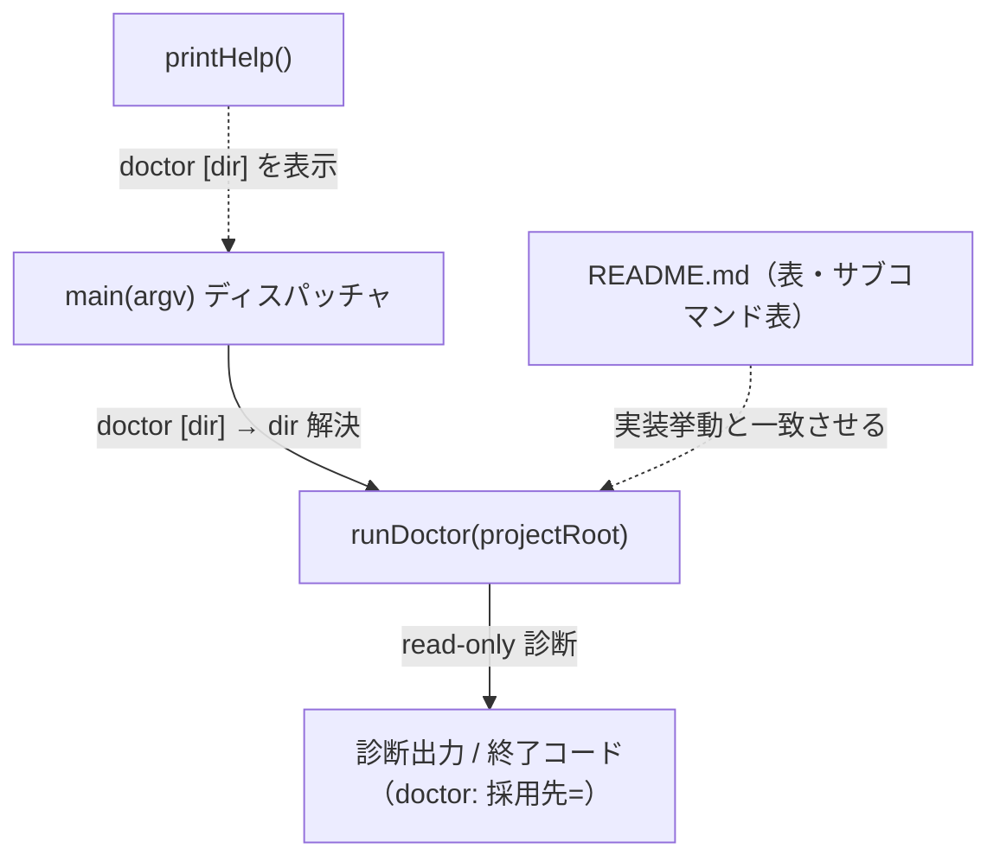

# 設計書: README 配備手順の実装・テスト不整合修正

**プロジェクト名**: README 配備手順の実装・テスト不整合修正
**作成日**: 2026 年 07 月 12 日
**最終更新**: 2026 年 07 月 12 日

> **重要**: **このドキュメントは常に更新**: 設計の変更や追加があった場合は、即座にこのドキュメントを更新してください。ドキュメントは「生きているドキュメント」として扱い、実装内容と常に同期させます。
>
> **用語**: [.agent-skill-chain/source/CONCEPTS.md §用語規約](../../../../.agent-skill-chain/source/CONCEPTS.md#用語規約) を参照。
>
> **本設計書の性質**: 本 issue は「ドキュメント整合（事実 A）」と「小規模な CLI 引数処理の是正（事実 B）」の 2 件からなる。新規のデータモデル・UI・API サーバ設計は発生しないため、テンプレートの §4 データ設計・§5 API（HTTP）・§7 UI・§8 セキュリティ・§9 非機能は「該当なし」とし、責務・境界（§2.1）・横断設計判断 ADR（§2.5）・機能設計（§3）・テスト戦略（§6）に記述を集中させる。
>
> **実装は別セッション**: 本セッションでは 02/03 の作成までを行う。実装（README 実修正・`src/agents-md.ts` 改修）は別セッション・別ブランチで実施する。本ドキュメントはゼロコンテキストの担当者が読んでそのまま実装に着手できる粒度（該当ファイルパス・行番号・変更前後の具体テキスト案）で記述している。行番号は起票時点（ブランチ `feature/package-adapter`）のものであり、実装時にずれる可能性があるため識別子（関数名・変数名・文言）でも突合すること。

---

## 1. 設計概要

**必須**: 設計方針・原則は [.agent-skill-chain/source/spec/01\_設計原則.md](../../../../.agent-skill-chain/source/spec/01_設計原則.md) を先に参照した上で、本プロジェクトに適用するものを選び記載する。

### 1.1 設計方針

「実装・自動テストを正とし、ドキュメント（README）・CLI 引数仕様側を実態に一致させる」ことを一貫方針とする。事実 A はドキュメント（README のテキスト）の是正のみ。事実 B は CLI 引数処理の是正（`doctor` を他コマンドと同じ `[dir]` 受理規約に揃える）＋ ドキュメント追随とする。既存の正しい挙動（既定 uninstall の project/ 保持・引数なし doctor の cwd 診断）は後方互換として維持する。

### 1.2 設計原則（本プロジェクトで適用するもの）

- **単一責務**: `runDoctor()` の責務は「与えられた対象ディレクトリの配備前提・証跡健全性を診断する」ことである。診断対象の決定（cwd か明示 dir か）は呼び出し側（`main()` のディスパッチャ）の責務に属する。事実 B ではこの責務分離に沿って「対象ディレクトリ解決を `main()` に集約し、`runDoctor` は与えられた対象を診断するだけ」に整える。
- **明確な境界**: CLI サブコマンド群の「引数解決規約（`argv[3]` / 非フラグ引数の解釈）」という境界を、`doctor` にも一貫適用する。`doctor` のみがこの境界の外にいる現状（非対称性）を解消する。
- **仕様との整合性（spec/06 優先順位 3）／構造の一貫性**: 「docs と実装の不整合を放置してはならない」（spec/06）に直接従い、README・help・実装・自動テストの整合を回復する。
- **AIフレンドリー設計**: 変更は小さく局所的（README の 1 表 ＋ `src/agents-md.ts` の 2 箇所）に留め、意図が分かる形にする。

---

## 2. アーキテクチャ設計

### 2.1 責務・境界・参照関係

#### 2.1.1 責務一覧

| コンポーネント | 責務（1 文） |
| -------------- | ------------ |
| `README.md`（リポジトリルート・アンインストール節の表 ＋ サブコマンド表） | 利用者に uninstall / `--purge` の破壊範囲と各サブコマンドの引数を、実装挙動と矛盾なく提示する。 |
| `src/agents-md.ts` `main(argv)` ディスパッチャ（`case "doctor"`） | サブコマンドと引数を解釈し、`doctor` の診断対象ディレクトリを解決して `runDoctor` に渡す。 |
| `src/agents-md.ts` `runDoctor(projectRoot)` | 与えられた対象ディレクトリの配備前提・enforcement 配線・証跡健全性を read-only で診断する。 |
| `src/agents-md.ts` `printHelp()` | CLI の使い方（`doctor [dir]` を含む）を実態どおり表示する。 |
| `test/test-cli-audit-doctor.sh` | `doctor` の挙動（証跡健全性 ＋ `[dir]` 受理）を自己テストで担保する。 |

#### 2.1.2 境界

- **入力**: 事実 A = 修正後 README テキスト。事実 B = `argv`（`node bin/agents-md.js doctor [dir]`）。
- **出力**: 事実 A = README の正しい表・注記。事実 B = `runDoctor` の診断出力（`doctor: 採用先=<解決した dir>` を含む）と終了コード。
- **他責務との境界（本 issue の範囲外）**: 保持・上書き契約の**正本**は `.agent-skill-chain/source/SETUP.md` にある。README はこれを再記述せず参照に留める（本 issue で SETUP.md 本体は変更しない）。`doctor` の診断ロジック本体（hash チェーン・integrity 検査）の内容は変更しない（対象ディレクトリの解決のみ変える）。apm / marketplace 導線の未リリース状態はスコープ外。

#### 2.1.3 参照関係

- `main()`（`case "doctor"`）→ `runDoctor(projectRoot)`。依存の向きは一方向でこれまでと不変。循環参照なし。
- 事実 B の変更は既存の `case "audit"` / `case "export"`（`argv.slice(3).find((a) => !a.startsWith("-"))` による dir 解決。1253〜1258 行目・1260〜1265 行目）と同一パターンに揃える。`runDoctor` から他コンポーネントへの参照は不変。

### 2.2 システムアーキテクチャ

- **採用パターン**: 既存の「単一 CLI エントリ（`main` ディスパッチャ）＋ サブコマンド関数」構成をそのまま踏襲する（新パターンは導入しない）。
- **根拠**: spec/06 の優先順位「構造の一貫性」「変更容易性」に従い、既存の `case "audit"` / `case "export"` と同じ引数解決規約を `doctor` に適用するのが最小かつ一貫。

#### 2.2.1 CQRS（Command/Query 分離）

- 本 issue に状態変更（Command）の新設はない。`doctor` は read-only の Query であり、その性質は維持する（`--purge` 等の破壊的 Command は変更しない）。

#### 2.2.2 アーキテクチャ図（本プロジェクトの構成で記載）



### 2.3 コンポーネント構成

上記 2.1.1 のとおり。新規モジュール・新規ファイルは作らない。変更対象は既存 3 ファイル（`README.md`・`src/agents-md.ts`・`test/test-cli-audit-doctor.sh`）に閉じる。各変更は単一責務（README=説明、ディスパッチャ=引数解決、runDoctor=診断、テスト=検証）を保つ。

### 2.4 データフロー

本 issue で新規に発行するドメインイベントはない（ドキュメント整合と CLI 引数処理）。`doctor` の read-only 診断フロー（対象決定 → 前提確認 → 証跡健全性 → 出力）は既存どおりで、入口の「対象決定」だけが `cwd 固定` から `dir 解決（引数優先・省略時 cwd）` に変わる。

### 2.5 横断設計判断（ADR）

#### ADR-1: 事実 B（`doctor` の `[dir]` 引数）は「方針 (a): `doctor [dir]` を受理させる」を採用する

- **コンテキスト**: `doctor` は現状 `[dir]` 引数を黙って無視し、常に `process.cwd()` を診断する（`main()` の `case "doctor": return runDoctor();`、1251〜1252 行目。`runDoctor()` 373 行目 `const projectRoot = process.cwd();`）。他方 `init` / `upgrade`（1221〜1227 行目）・`uninstall`（1228〜1239 行目）・`enforce`（1240〜1250 行目）・`audit`（1253〜1258 行目）・`export`（1260〜1265 行目）はいずれも `[dir]` を受理する。利用者・委譲先 AI が「特定 dir を診断しているつもりで無関係な cwd を診断する」静かな誤診断が起こりうる（実測: 隔離 tmp のパスを渡したのに本番リポジトリ本体が診断された）。01_要件定義は方針 (a)（受理させる）／方針 (b)（受理しない仕様のまま明記のみ）の両論を許容している。
- **検討した選択肢**:
  - **方針 (a)**: `doctor [dir]` を受理し、渡した dir を診断対象にする。引数なしは従来どおり cwd 診断（後方互換）。`runDoctor` が対象を引数で受け取り、`main()` の `case "doctor"` が `audit` / `export` と同一の非フラグ引数解決で dir を渡す。README サブコマンド表・help も `doctor [dir]` に更新する。
  - **方針 (b)**: `[dir]` を受理しない仕様を維持し、README・help・実行時出力で「`doctor` は他コマンドと異なり `[dir]` を受け付けず常に cwd を診断する」旨と非対称性を明記する（ドキュメント／注記のみ）。
- **決定**: **方針 (a)** を採用する。
- **根拠**:
  - **根本原因の除去**: 誤診断リスク（01 基準 2）は「引数を渡しても無視される」という挙動そのものが原因である。方針 (a) は原因を除去し、方針 (b) は注記で回避を促すのみで footgun 自体は残る（利用者・AI が注記を読まず path を渡す限り誤診断は再現しうる）。可読性・仕様整合を優先する spec/06 に照らし、原因除去が上位。（evidence_source: existing_code — `src/agents-md.ts` 372〜373・1251〜1252 行目を確認）
  - **構造の一貫性（スコープ規律を満たす）**: `doctor` は `[dir]` を取り得る全 6 サブコマンド（init/upgrade/uninstall/enforce/audit/export）の中で唯一の例外である。とりわけ `audit` / `export` は `doctor` と同じ read-only 診断系でありながら `[dir]` を受理する。したがって「read-only だから引数不要」という区別は既存設計に存在せず、`doctor` の非受理は意図された仕様ではなく単なる不揃いと判断できる。方針 (a) は**特例を 1 つ減らして規約に合流させる**変更であり、AGENT_CONDUCT §4「要求以上の機能追加をしない」に反する新機能の追加ではない（01 基準 2 を満たす最小の根本修正）。（evidence_source: existing_code — 1253〜1265 行目 `case "audit"` / `case "export"` の dir 解決パターンを確認）
  - **最小・後方互換・低リスク**: 変更は `runDoctor` にオプション引数を追加し（既定 `process.cwd()`）、`case "doctor"` を `audit` / `export` と同一形に整えるのみ（差分は実質数行）。既存の doctor 自己テストはいずれも `cd <対象> && node "$BIN" doctor`（引数なし・cwd ベース）で書かれており（`test/test-cli-audit-doctor.sh` の `cd "$H"` 83 行目・`cd "$T"` 100 行目・`cd "$D"` 119 行目）、引数なし挙動を変えないため既存テストは無改変で通過する。（evidence_source: existing_code / test_output — 当該テストの呼び出し形を確認）
- **帰結**:
  - `runDoctor` のシグネチャが `runDoctor(projectRoot: string = process.cwd()): number` になる。診断対象は呼び出し側で解決され、`runDoctor` は「与えられた対象を診断する」単一責務になる。
  - README サブコマンド表（94 行目）と help（117 行目）を `doctor [dir]` に更新する必要が生じる（§3.2）。
  - `doctor [dir]` の受理を検証する自己テストを 1 件追加する（§6・03 タスク 3）。
  - 引数なし `doctor`（cwd 診断）は不変＝後方互換維持。破壊的操作は増えない（read-only のまま）。

---

## 3. 機能設計

> 以下 §3.1（事実 A）・§3.2（事実 B）は、別セッションのゼロコンテキスト担当者が**そのまま適用できる**よう、変更前後の具体テキスト案・対象行を明記する。行番号は起票時点のもの。適用時は必ず識別子（表ヘッダ文言・関数名）で対象を再特定すること。

### 3.1 機能 1: 事実 A — README アンインストール表の `--purge` 記載を実装・テストに一致させる

#### 3.1.1 概要

`README.md`（リポジトリルート）の「アンインストール（つけ外し）」節の表が、`--purge --yes` 時に `.agent-skill-chain/project/` を含む統合ルート `.agent-skill-chain/` が完全削除される実装挙動と矛盾している。実装（`PURGE_ARTIFACTS` 807〜810 行目・`finalizeAscRoot` 818〜826 行目）・自動テスト（`test/e2e-install-uninstall.sh` `test_uninstall_purge` 152〜172 行目）・help（`src/agents-md.ts` 129 行目）はいずれも正しい。**README のこの表のみが誤り**。README テキストを是正する。

#### 3.1.2 変更対象と変更前後（README.md）

**(1) 表「保持するユーザー資産」行の `--purge` 列（130 行目・最優先の是正点）**

- **変更前**（130 行目・`--purge` 列）:
  - `左に同じ（\`workflow.db\` は削除）`
  - → project/ 等が `--purge` でも保持され、追加削除は workflow.db のみ、と読める（**誤り**）。
- **変更後**（案）:
  - `.agent-skill-chain/project/ を含め **すべて削除**（統合ルート .agent-skill-chain/ ごと完全削除）`

**(2) 表「除去する配備物」行の `--purge` 列（129 行目）**

- **変更前**（129 行目・`--purge` 列）: `同左`
- **変更後**（案）: `同左 ＋ .agent-skill-chain/project/・.agent-skill-chain/runtime/（issue 履歴・workflow.db を含む）` を追加除去（結果として統合ルート `.agent-skill-chain/` ごと削除）

**(3) 表「保持するユーザー資産」行ラベルの読み替え（推奨・任意）**

- 「保持するユーザー資産」という行名のままだと `--purge` 列に「すべて削除」と書くと行名と矛盾して見える。行の意味が「既定 uninstall では保持されるユーザー資産」であることが本文で伝わるよう、表直後に 1 文の注記を補ってもよい（実装担当の裁量。最小修正としては (1)(2) のみで整合は取れる）。
  - 注記案: 「> **注意**: `--purge --yes` は上記『保持するユーザー資産』を含め `.agent-skill-chain/` を丸ごと削除する。project 固有ルールも失われるため、必要な資産は事前に退避すること。」

**(4) 補足文（133 行目）の限定（推奨）**

- **変更前**（133 行目・抜粋）: 「**project 固有ルールは `.agent-skill-chain/project/` に置くこと**を推奨する（再インストール・upgrade・uninstall で保持される）。」
- 論点: この「uninstall で保持される」は**既定 uninstall のみ**の事実で、`--purge` では削除される。無限定だと (1) の是正と読者の理解が食い違う恐れがある。
- **変更後**（案・抜粋）: 「…（再インストール・upgrade・**既定の** uninstall で保持される。ただし `--purge` では削除される）。」

> **正本非重複の遵守**: 上記いずれも README ローカルの説明の是正であり、保持・上書き契約の**正本**（`.agent-skill-chain/source/SETUP.md`）の再記述を増やさない。既存の正本参照リンク（133 行目末尾）は維持する。

#### 3.1.3 変更しないもの（後方互換・正しい記載）

- 「除去する配備物」行の**既定 uninstall 列**（129 行目）・「保持するユーザー資産」行の**既定 uninstall 列**（130 行目）は正しいため変更しない。
- help 文言（`src/agents-md.ts` 129 行目 `--purge  project/・runtime/…も削除し統合ルートごと除去する（既定は保持）`）は正しいため変更しない。
- 実装（`PURGE_ARTIFACTS` / `finalizeAscRoot`）・E2E テスト（`test_uninstall_purge`）は変更しない（正しい挙動の裏づけとして維持）。

#### 3.1.4 エラーハンドリング

- 該当なし（テキスト是正のため実行時分岐は増減しない）。

### 3.2 機能 2: 事実 B — `doctor [dir]` を受理させる（ADR-1: 方針 (a)）

#### 3.2.1 概要

`doctor` に `[dir]` を受理させ、`init` / `uninstall` / `audit` / `export` と同じ引数解決規約に揃える。引数なしは従来どおり cwd 診断（後方互換）。

#### 3.2.2 変更対象と変更前後（src/agents-md.ts）

**(1) `runDoctor` のシグネチャ（372〜373 行目付近）**

- **変更前**:
  ```ts
  function runDoctor(): number {
    const projectRoot = process.cwd();
  ```
- **変更後**（案）:
  ```ts
  function runDoctor(projectRoot: string = process.cwd()): number {
  ```
  - 373 行目の `const projectRoot = process.cwd();` を削除し、引数 `projectRoot`（既定 `process.cwd()`）に置き換える。`runDoctor` 本体は既に一貫して変数 `projectRoot` を参照している（384・392・393・403・448・454 行目等）ため、本体の他所は無改変でよい。

**(2) `main()` の `case "doctor"`（1251〜1252 行目）**

- **変更前**:
  ```ts
  case "doctor":
    return runDoctor();
  ```
- **変更後**（案・`case "audit"` 1253〜1258 行目と同一パターン）:
  ```ts
  case "doctor": {
    // doctor [dir]。dir 省略時は cwd。init/uninstall/audit/export と同じ引数解決規約。
    const dirArg = argv.slice(3).find((a) => !a.startsWith("-"));
    let dir = process.cwd();
    if (dirArg) dir = dirArg.startsWith("/") ? dirArg : join(process.cwd(), dirArg);
    return runDoctor(dir);
  }
  ```
  - `join` は既に import 済み（`case "init"` 等で使用）。新規 import 不要。

**(3) `printHelp()` の doctor 行（117〜118 行目）**

- **変更前**（117 行目）: `  doctor                配備に必要な前提（setup.sh・bash・sqlite3 等）の有無 ＋ 証跡健全性`
- **変更後**（案）: `  doctor [dir]          配備に必要な前提（setup.sh・bash・sqlite3 等）の有無 ＋ 証跡健全性`
  - 118 行目の折り返し継続行（`（workflow.db の hash チェーン…）`）はインデント整合のみ調整（機能変更なし）。

**(4) README サブコマンド表の doctor 行（94 行目）**

- **変更前**（94 行目）: `| \`doctor\` | 配備に必要な前提（\`setup.sh\`・\`bash\`・\`sqlite3\` 等）の有無を確認する。enforcement 配線の on/off も表示する |`
- **変更後**（案）: `| \`doctor [dir]\` | 採用先（既定: カレントディレクトリ）の配備前提の有無を確認する。enforcement 配線の on/off・証跡健全性も表示する |`

#### 3.2.3 入力・出力

- **入力**: `node bin/agents-md.js doctor [dir]`。`dir` は絶対パス（`/` 始まり）ならそのまま、相対なら `join(process.cwd(), dir)`。
- **出力**: `runDoctor` は解決した `projectRoot` を対象に既存どおり診断し、`doctor: 採用先=<projectRoot>`（384 行目）を出力する。`[dir]` を渡した場合はその dir が「採用先」に表示される。

#### 3.2.4 エラーハンドリング

- 存在しない dir を渡した場合は、`runDoctor` の各 `existsSync` チェックが `[NG]`（例: `AGENTS.md` 未配備）を返し、既存の非配備時の挙動と同じく終了コードで失敗を返す。新規の例外送出は追加しない（既存の read-only 診断の枠内）。

---

## 4. データ設計

該当なし（新規テーブル・データモデルなし。`doctor` は `workflow.db` を read-only で参照するのみで、スキーマ・書き込みは変更しない）。

---

## 5. API 設計

HTTP API は該当なし。CLI インターフェースの変更のみ（§3.2）：`doctor` サブコマンドが `[dir]` 引数を受理する（`init` / `uninstall` / `audit` / `export` と同一の引数解決規約）。

---

## 6. テスト戦略

テスト観点の定義は [RULES.md のテスト戦略必須要件](../../../../.agent-skill-chain/source/RULES.md#テスト戦略必須要件)、BDD 形式は [TEST_BDD_FORMAT.md](../../../../.agent-skill-chain/source/TEST_BDD_FORMAT.md) を参照。本節では対象ごとのテスト割当のみ記載する。

### 6.1 対象ごとのテスト割り当て

| 対象 | 単体 | 結合/CLI | E2E | クリティカル観点 | バリデーション観点 | 未達理由/補足 |
| ---- | ---- | -------- | --- | ---------------- | ------------------ | ------------- |
| 事実 A: `--purge` の実削除挙動（回帰） | × | × | ○ | project/ を含め統合ルートが完全削除される | 未配備 dir では中止（既存安全策） | 既存 `test/e2e-install-uninstall.sh` `test_uninstall_purge`（152〜172 行目）で担保済み。本 issue で挙動は変えないため回帰として維持。 |
| 事実 A: README テキストと実装の整合 | × | △（静的 grep 近似） | × | 「保持」列に project/ を残したまま「workflow.db のみ削除」と読める記載が解消されている | — | 自然言語整合の完全自動判定は困難。**review-docs（実装前ドキュメントレビュー）＋ 人手レビュー**で担保し、実装裏づけは上段 E2E に委ねる。任意で「README に `--purge` × `project` 削除を表す語が存在する／旧誤記が消えている」ことの grep 静的チェックを補助的に置く（03 タスク 1 補足）。 |
| 事実 B: `doctor [dir]` が渡した dir を診断 | × | ○（CLI 自己テスト） | × | `[dir]` を渡すと「採用先=<dir>」が出力され、cwd ではなく dir が診断される | 相対/絶対パス両方で dir が解決される | `test/test-cli-audit-doctor.sh` に新規ケースを追加（03 タスク 3）。 |
| 事実 B: 引数なし `doctor`（後方互換） | × | ○（既存 CLI 自己テスト） | × | 引数なしは従来どおり cwd を診断する | — | 既存 `doctor_healthy` 等（`cd <対象> && node "$BIN" doctor`、`cd "$H"` 83 行目・`cd "$T"` 100 行目・`cd "$D"` 119 行目）が無改変で通過することで担保。 |

### 6.2 監査・レビューでの確認（証跡）

- 03_実装計画のタスク別テスト観点・BDD と本 §6.1 の割当が対応していることを確認する。
- 事実 A の「テキスト整合」は E2E で自動判定できない旨と、その代替（review-docs ＋ 実装裏づけ E2E ＋ 任意の grep 静的チェック）を 03/04 に明記する（01 の受け入れ基準・§2.2 ユースケース 1 の注記と整合）。
- 事実 B の CLI 自己テストは、実装後のレビュー（verify-and-close / 04_review）時に再実行し結果を記載する。

---

## 7. UI 設計

該当なし（CLI・ドキュメントのみ）。

---

## 8. セキュリティ設計

新規の認証・認可・データ保護設計はない。ただし本 issue の主眼は「破壊的操作（`--purge`）の説明を実挙動に一致させ、利用者の意図しないデータ喪失（project 固有ルールの誤削除）を防ぐ」ことであり、事実 A の是正がこの安全性向上に直接寄与する（2026-07-11 の誤削除インシデント再発防止）。

---

## 9. 非機能要件への対応

- **パフォーマンス**: 影響なし（テキスト是正 ＋ CLI 引数分岐 1 箇所）。
- **可用性**: 影響なし（read-only 診断・ドキュメント整合）。
- **後方互換**: 引数なし `doctor`（cwd 診断）・既定 uninstall（project/ 保持）を維持。

---

## 10. 参考資料

### プロジェクトドキュメント

- [`00_要求定義.md`](./00_要求定義.md) - 要求定義
- [`01_要件定義.md`](./01_要件定義.md) - 要件定義
- 実装対象: `README.md`（94 行目サブコマンド表・112〜133 行目アンインストール節）、`src/agents-md.ts`（`printHelp` 117 行目・`runDoctor` 372 行目・`PURGE_ARTIFACTS` 807 行目・`finalizeAscRoot` 818 行目・`main` の `case "doctor"` 1251 行目・参照パターン `case "audit"` 1253 行目 / `case "export"` 1260 行目）
- 自動テスト: `test/e2e-install-uninstall.sh`（`test_uninstall_purge` 152〜172 行目）、`test/test-cli-audit-doctor.sh`（doctor 証跡健全性 71〜125 行目）
- 保持・上書き契約の正本: [`.agent-skill-chain/source/SETUP.md`](../../../../.agent-skill-chain/source/SETUP.md)

### その他の参考資料

- [EVIDENCE_POLICY.md](../../../../.agent-skill-chain/source/EVIDENCE_POLICY.md) - ADR 形式・evidence_source
- spec/06 設計判断の優先順位「docs と実装の不整合を放置してはならない」

---

## 11. 前のステップ

この設計書は、以下のドキュメントを基に作成されています：

- **前**: [`01_要件定義.md`](./01_要件定義.md) - 要件定義フェーズ

---

## 12. 次のステップ

この設計書の承認後、以下のドキュメントを作成します：

- **次**: [`03_実装計画.md`](./03_実装計画.md) - 実装計画フェーズ
