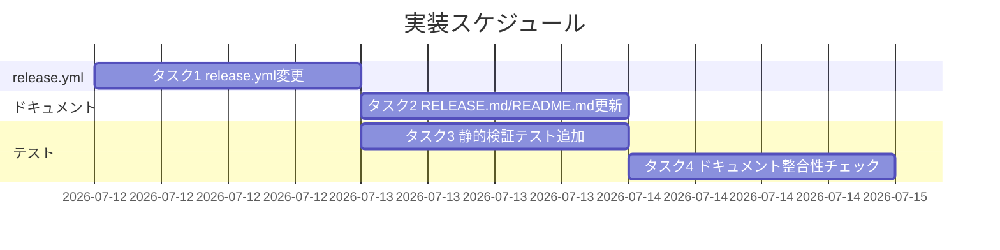
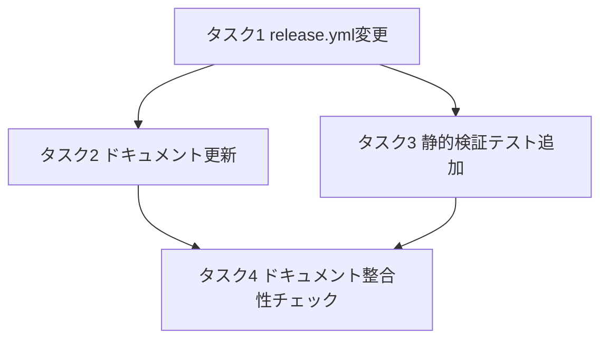

# 実装計画書: release 自動発火（push 化）

**プロジェクト名**: release 自動発火（push 化）
**作成日**: 2026 年 07 月 12 日
**最終更新**: 2026 年 07 月 12 日

> **重要**: **このドキュメントは常に更新**: 実装計画の変更、進捗状況の更新、バグの記録などがあった場合は、即座にこのドキュメントを更新してください。ドキュメントは「生きているドキュメント」として扱い、実装内容と常に同期させます。
>
> **用語**: [.agent-skill-chain/source/CONCEPTS.md §用語規約](../../../.agent-skill-chain/source/CONCEPTS.md#用語規約) を参照。

---

## 1. 実装概要

### 1.1 実装方針（必須）

`02_設計.md` の ADR-1〜ADR-5 に従い、`.github/workflows/release.yml` の `on:`／`if:` 条件式とコメントを変更し、`docs/maintainer/RELEASE.md`・`README.md` を新運用に合わせて書き換える。3 ジョブの処理内容は一切変更しない。あわせて、GitHub Actions ランタイム依存で直接検証できない部分（`paths` フィルタの一致判定・`RELEASE_ENABLED` の意味論）を静的にシミュレーション検証するテストスクリプトを `test/` 配下に追加する。

### 1.2 実装順序（必須: 1 件以上）

1. タスク 1: `release.yml` のトリガー・ゲート条件変更
2. タスク 2: `RELEASE.md`／`README.md` のドキュメント更新
3. タスク 3: `paths` フィルタ・`RELEASE_ENABLED` 意味論の静的検証テスト追加
4. タスク 4: ドキュメント整合性チェック（grep ベース）の実施と記録



---

## 2. タスク分解

**用語**: [.agent-skill-chain/source/CONCEPTS.md §用語規約](../../../.agent-skill-chain/source/CONCEPTS.md#用語規約) を参照。

### 2.1 タスク 1: `release.yml` のトリガー・ゲート条件変更

#### 2.1.1 概要（必須）

`release.yml` の `on:` を `push`（`main`・ADR-1 の `paths`）と `workflow_dispatch`（ADR-2）の併存に変更し、3 ジョブの `if:` 条件を `vars.RELEASE_ENABLED != 'false'`（ADR-3）へ変更し、無限ループ防止ガード（ADR-4）が push トリガー化後も機能する旨をコメントで明記する。

#### 2.1.2 実装内容（必須: 1 件以上）

- `release.yml` 25〜27 行目の `on: workflow_dispatch:` を以下に変更する。
  ```yaml
  on:
    push:
      branches: [main]
      paths:
        - ".agent-skill-chain/source/**"
        - "package.json"
        - ".claude-plugin/marketplace.json"
    workflow_dispatch:
  ```
- 41・148・251 行目の `if: github.actor != 'github-actions[bot]' && vars.RELEASE_ENABLED == 'true'` を `if: github.actor != 'github-actions[bot]' && vars.RELEASE_ENABLED != 'false'` へ変更する（3 箇所すべて）。
- 冒頭コメント（1〜17 行目）を、push トリガー化・`paths` フィルタ・`RELEASE_ENABLED` の新意味論（緊急停止スイッチ・既定 ON）に合わせて更新する。無限ループ防止ガード（主防御・補助防御 3 点）が push トリガー化後も機能する旨（ADR-4）を明記する。
- 3 ジョブの `if:` 行のコメント（40・147・250 行目付近）を「`RELEASE_ENABLED` が `'false'`（緊急停止）以外のときに実行する」という趣旨に更新する。

#### 2.1.3 テスト観点（必須）

**参照**: 観点の定義は [02\_設計 §6](./02_設計.md) および [RULES のテスト戦略・TEST_BDD_FORMAT](../../../.agent-skill-chain/source/RULES.md#テスト戦略必須要件) を参照。以下には本タスクの具体ケースのみ記載する。

##### 単体（本タスクの具体ケース・必須 1 件以上）

- YAML として構文的に妥当であること（`python3 -c "import yaml; yaml.safe_load(open('.github/workflows/release.yml'))"` が例外なく完了する）。
- `on.push.branches` が `["main"]` のみであること（他ブランチへの push では発火しない）。
- `on.push.paths` に ADR-1 で確定した 3 パターンが過不足なく含まれること。
- `on.workflow_dispatch` キーが存在すること（ADR-2）。
- 3 ジョブすべての `if:` 文字列が `vars.RELEASE_ENABLED != 'false'` を含み、旧条件 `== 'true'` を含まないこと。

##### 結合/API（本タスクの具体ケース・該当時は必須 1 件以上）

- 該当なし（GitHub Actions ランタイムでの実結合テストは本番 push でのみ可能。§4 参照）。

##### E2E/受け入れ（本タスクの具体ケース・未達時は理由記載）

- 未達（理由: `on.push` の実発火・`paths` 実評価は GitHub Actions ランタイム依存であり、ローカル・CI 双方でシミュレーションを超える確認ができない。マージ後の実 push 結果を運用時に目視確認する運用とする＝02\_設計 §6 の制約）。

##### バリデーション（該当する場合の具体ケース）

- `RELEASE_ENABLED` が未設定・`'true'`・`'false'`・任意文字列（例 `'flase'`）の 4 パターンで、意味論シミュレーション（タスク 3）の結果が「未設定→実行」「`'true'`→実行」「`'false'`→skip」「任意文字列→実行（fail-open。ADR-3 の帰結）」と一致すること。

#### 2.1.4 単体テスト仕様（BDD）（必須）

```gherkin
Feature: release.yml のトリガー・ゲート条件変更
  Scenario: push トリガーと paths フィルタが定義されている
    Given 変更後の .github/workflows/release.yml
    When on 節を読む
    Then push.branches が ["main"] である
    And push.paths に .agent-skill-chain/source/**・package.json・.claude-plugin/marketplace.json が含まれる
    And workflow_dispatch キーが存在する

  Scenario: 3 ジョブの if 条件が RELEASE_ENABLED != 'false' になっている
    Given 変更後の .github/workflows/release.yml
    When version-bump・release-marketplace・apm-release の if 条件を読む
    Then いずれも "vars.RELEASE_ENABLED != 'false'" を含む
    And いずれも "vars.RELEASE_ENABLED == 'true'" を含まない
```

```bash
# Given: 変更後の release.yml
# When: yaml をパースし on/if の内容を検査する
# Then: 期待どおりの構造であることを assert する（実装イメージ。実コードはタスク3のテストスクリプトに実装する）
python3 - <<'PY'
import yaml
doc = yaml.safe_load(open(".github/workflows/release.yml"))
assert doc["on"]["push"]["branches"] == ["main"]
assert "workflow_dispatch" in doc["on"]
PY
```

#### 2.1.5 依存関係

- なし（最初に着手するタスク）。

#### 2.1.6 見積もり

- **工数**: 0.5h
- **優先度**: 高

---

### 2.2 タスク 2: `RELEASE.md`／`README.md` のドキュメント更新

#### 2.2.1 概要（必須）

ADR-5 の方針に従い、`docs/maintainer/RELEASE.md` の承認前提ブロック・§2 リリース実行手順、および `README.md` §リリース手順（メンテナ向け）の要約を、push 契機・`RELEASE_ENABLED` 緊急停止スイッチという新運用に合わせて書き換える。

#### 2.2.2 実装内容（必須: 1 件以上）

- `RELEASE.md` 5〜9 行目の「重要（リリース発火はユーザー承認前提）」ブロックを、「PR レビュー承認（branch protection・1 件以上）をもって人間承認済みとみなし、承認された変更が main へマージされた時点で `paths` に一致すれば自動発火する。追加の起動操作・追加承認は不要。緊急停止はリポジトリ変数 `RELEASE_ENABLED=false` で行う」という趣旨に書き換える。
- `RELEASE.md` §2 リリース実行手順（46〜59 行目）の「`workflow_dispatch` を手動起動し `RELEASE_ENABLED=true` を設定する」という記述を、「配布影響パス（`.agent-skill-chain/source/**`・`package.json`・`.claude-plugin/marketplace.json`）を含む変更が main へマージされると自動発火する。`RELEASE_ENABLED` は既定で有効（未設定時も動作）であり、緊急停止時のみ `false` を設定する」という記述に書き換える。
- `RELEASE.md` §0 前提の「認可」行を、`RELEASE_ENABLED` の設定権限（停止操作のみに必要）に更新する。
- `RELEASE.md` に、`workflow_dispatch` を緊急時の手動代替発火手段として残す旨（ADR-2）と、手動起動時は `paths` フィルタが適用されない（GitHub Actions 仕様）旨を明記する。通常運用は push 自動発火であり手動起動は補助手段である位置づけを明確にする。
- `README.md` §リリース手順（メンテナ向け）の要約（161〜163 行目付近）を、上記変更と矛盾しない記述に更新する（詳細は `RELEASE.md` へのリンクのみを保つ。重複記載しない）。

#### 2.2.3 テスト観点（必須）

##### 単体（本タスクの具体ケース・必須 1 件以上）

- `RELEASE.md` に文字列「`workflow_dispatch` を手動起動」という単独の起動必須手順の記述が残っていないこと（push 自動発火が主手順として記載されていること）。
- `RELEASE.md` に「緊急停止」または同義の記述と `RELEASE_ENABLED=false` の操作手順が記載されていること。

##### 結合/API（本タスクの具体ケース・該当時は必須 1 件以上）

- 該当なし。

##### E2E/受け入れ（本タスクの具体ケース・未達時は理由記載）

- 未達（理由: ドキュメント記述の「わかりやすさ」は自動判定できないため、タスク 4 の目視レビューで代替する）。

##### バリデーション（該当する場合の具体ケース）

- 該当なし。

#### 2.2.4 単体テスト仕様（BDD）（必須）

```gherkin
Feature: RELEASE.md が新しい運用を正しく説明する
  Scenario: RELEASE.md の記述が push 契機の運用と矛盾しない
    Given 修正後の docs/maintainer/RELEASE.md
    When 「リリース発火は必ずユーザーの明示承認を得てから行う」に相当する節を読む
    Then push（main への配布影響変更マージ）が発火契機であることが明記されている
    And RELEASE_ENABLED が緊急停止スイッチである旨とその既定値・操作手順が明記されている
```

```bash
# Given: 修正後の RELEASE.md
# When: 主要キーワードの存在を grep で確認する
# Then: 期待するキーワードが揃っている（実装イメージ。厳密な自然文検証はタスク4の目視で行う）
grep -q "push" docs/maintainer/RELEASE.md
grep -q "RELEASE_ENABLED" docs/maintainer/RELEASE.md
grep -q "緊急停止" docs/maintainer/RELEASE.md
```

#### 2.2.5 依存関係

- タスク 1（`release.yml` の実装内容が確定してから記述する）

#### 2.2.6 見積もり

- **工数**: 0.5h
- **優先度**: 高

---

### 2.3 タスク 3: `paths` フィルタ・`RELEASE_ENABLED` 意味論の静的検証テスト追加

#### 2.3.1 概要（必須）

`release.yml` は GitHub Actions ランタイム上でしか実発火を検証できないため、`paths` フィルタの一致判定ロジックと `RELEASE_ENABLED` の意味論を、既存 `test/` 配下のスタイル（tmp 隔離・PASS/FAIL カウンタ・BDD インラインコメント。`test/test-package-manifest-parity.sh` 等を参考）を踏襲したシェルスクリプトでシミュレーション検証する。

#### 2.3.2 実装内容（必須: 1 件以上）

- `test/test-release-workflow-trigger.sh` を新規作成する。
- シナリオ A: `release.yml` の YAML 構文検証（`python3 -c "import yaml; yaml.safe_load(...)"`。python3/PyYAML 不在時は当該シナリオのみ**インライン SKIP**〈`[SKIP]` 出力・カウントのみ〉とし、スクリプト全体は exit 2 にしない〈下記のとおり C は bash のみで実行できるため〉）。
- シナリオ B: `on.push.paths` に列挙されたパターンを読み取り、代表的なファイルパス（`.agent-skill-chain/source/skills/x.md` は一致・`docs/maintainer/workflow/x/00_要求定義.md` は不一致・`package.json` は一致・`README.md` は不一致・`.claude-plugin/marketplace.json` は一致・`src/agents-md.ts` は不一致）に対し `fnmatch` 相当のパターンマッチ（Python `fnmatch` または `pathlib.PurePath.match` を用いた近似実装。GitHub Actions の `paths` glob エンジンと完全同一ではない近似検証である旨をスクリプトのコメントに明記する）で期待どおりに一致/不一致するかを検証する。**シナリオ B は python3 に依存する**ため、python3 不在時は A と同様に当該シナリオのみインライン SKIP とする。
- シナリオ C: `RELEASE_ENABLED` の値パターン（未設定・`"true"`・`"false"`・`"flase"`）に対し、`[[ "$v" != "false" ]]` と同等の bash 条件式で実行可否を判定し、期待結果（未設定→実行・`"true"`→実行・`"false"`→skip・`"flase"`→実行）と一致するかを検証する。
- `test/run-all.sh` の `TESTS` 一覧（既定 `default_tests()`）に `test-release-workflow-trigger|test-release-workflow-trigger.sh|bash` の 1 行を追加する。**必須依存は `bash` のみ**とする。理由: `run-all.sh` は宣言依存が 1 つでも欠けるとテスト全体を SKIP する実装〈run-all.sh の missing_dep 事前確認〉であり、`python3` を必須依存に含めると python3 不在環境で**シナリオ C（bash のみで実行可能な緊急停止意味論検証）まで一括 SKIP**され、緊急停止機能の回帰検知が失われる。依存関係は以下のとおり。
  - **シナリオ A・B は python3 に依存**する（A=PyYAML パース、B=Python `fnmatch`/`pathlib`）。python3（B は加えて PyYAML 不要・python3 のみ、A は PyYAML も必要）が不在のときは、当該シナリオを**インライン SKIP**（`[SKIP]` 出力・カウントのみ）とし、スクリプト全体を exit 2 にはしない。
  - **シナリオ C は bash のみ**（`[[ "$v" != "false" ]]`）で常に実行する。python3 不在でも C は必ず走り、C が PASS ならスクリプトは exit 0（PASS）を返す。
  - すなわち python3 が揃う CI では A・B・C すべてを実行し、python3 不在環境でも C（最優先の緊急停止意味論）は必ず検証される。

#### 2.3.3 テスト観点（必須）

##### 単体（本タスクの具体ケース・必須 1 件以上）

- シナリオ B: `.agent-skill-chain/source/skills/architecture/x.md` は `paths` に一致すると判定される。
- シナリオ B: `docs/maintainer/workflow/xxx/00_要求定義.md` は `paths` に一致しないと判定される。
- シナリオ C: `RELEASE_ENABLED` 未設定（空文字列）のとき「実行」と判定される。
- シナリオ C: `RELEASE_ENABLED="false"` のとき「skip」と判定される。

##### 結合/API（本タスクの具体ケース・該当時は必須 1 件以上）

- 該当なし（本テストスクリプト自体が `release.yml` の記述内容を読み取って検証する準結合テストであり、別途の結合対象を持たない）。

##### E2E/受け入れ（本タスクの具体ケース・未達時は理由記載）

- 未達（理由: 実際の GitHub Actions `paths` glob エンジンとの完全一致は本番 push でのみ確認可能。近似シミュレーションであることをスクリプトのコメントとテスト結果メッセージに明記し、限界を利用者に伝える）。

##### バリデーション（該当する場合の具体ケース）

- `RELEASE_ENABLED="flase"`（誤字）のとき「実行」（fail-open）と判定されることを明示的にテストし、ADR-3 の帰結（誤字時に停止したつもりが実行される仕様上のリスク）を回帰検知する。

#### 2.3.4 単体テスト仕様（BDD）（必須）

```gherkin
Feature: paths フィルタの一致判定シミュレーション
  Scenario: 配布影響パスは一致すると判定される
    Given release.yml の on.push.paths リスト
    When ".agent-skill-chain/source/skills/architecture/x.md" を評価する
    Then 一致と判定される

  Scenario: ドキュメントのみの変更は一致しないと判定される
    Given release.yml の on.push.paths リスト
    When "docs/maintainer/workflow/xxx/00_要求定義.md" を評価する
    Then 不一致と判定される

Feature: RELEASE_ENABLED の意味論シミュレーション
  Scenario: 未設定時は実行と判定される
    Given RELEASE_ENABLED が未設定（空文字列）
    When 条件式 "$v" != "false" を評価する
    Then 実行と判定される

  Scenario: false 設定時は skip と判定される
    Given RELEASE_ENABLED が "false"
    When 条件式 "$v" != "false" を評価する
    Then skip と判定される
```

```bash
#!/usr/bin/env bash
# test/test-release-workflow-trigger.sh（実装イメージ。実ファイルはタスク3で作成する）
# シナリオ: RELEASE_ENABLED の意味論シミュレーション
check_enabled() {
  local v="$1"
  # Given: 環境から渡された RELEASE_ENABLED 相当の値 $v
  # When: release.yml の if 条件と同一の比較式を評価する
  if [[ "$v" != "false" ]]; then
    # Then: 実行
    echo "run"
  else
    # Then: skip
    echo "skip"
  fi
}
# Given: 未設定 / When: 評価 / Then: run
[[ "$(check_enabled "")" == "run" ]] && echo "[PASS] 未設定時 -> run"
# Given: "false" / When: 評価 / Then: skip
[[ "$(check_enabled "false")" == "skip" ]] && echo "[PASS] false -> skip"
```

#### 2.3.5 依存関係

- タスク 1（`release.yml` の `paths`／`if:` 条件が確定してから、その内容を読み取るテストを書く）



#### 2.3.6 見積もり

- **工数**: 1.5h
- **優先度**: 中

---

### 2.4 タスク 4: ドキュメント整合性チェック（grep ベース）の実施と記録

#### 2.4.1 概要（必須）

`RELEASE.md`・`README.md` の記述が `release.yml` の実装（`on.push.paths`・`vars.RELEASE_ENABLED` 判定）と矛盾しないことを、grep による突合と目視レビューの手順として実施し、`04_review.md`（verify-and-close フェーズ）で確認できる形の手順書として本タスクに残す。

#### 2.4.2 実装内容（必須: 1 件以上）

- 手順 1: `grep -n "paths" .github/workflows/release.yml` と `grep -n "配布影響パス\|paths" docs/maintainer/RELEASE.md` を実行し、`RELEASE.md` に記載された配布影響パスの列挙が `release.yml` の `paths:` と一致することを確認する。
- 手順 2: `grep -n "RELEASE_ENABLED" .github/workflows/release.yml docs/maintainer/RELEASE.md README.md` を実行し、3 ファイルすべてで `RELEASE_ENABLED` の役割説明（緊急停止スイッチ）が矛盾しないことを目視確認する。
- 手順 3: `docs/maintainer/RELEASE.md` §2 と `README.md` §リリース手順の要約を並べて読み、要約が詳細正本と矛盾しないことを確認する。
- 上記 3 手順の実施結果を `verify-and-close` フェーズの `04_review.md`（本タスクの後続フェーズ）に記録する（本タスク自体は手順の実施と記録の下書きまでを担当する）。

#### 2.4.3 テスト観点（必須）

##### 単体（本タスクの具体ケース・必須 1 件以上）

- `grep -n "paths" .github/workflows/release.yml` の出力に含まれる 3 パターンが `RELEASE.md` の該当箇所に過不足なく記載されていること。

##### 結合/API（本タスクの具体ケース・該当時は必須 1 件以上）

- 該当なし。

##### E2E/受け入れ（本タスクの具体ケース・未達時は理由記載）

- 該当なし（本タスク自体がドキュメント整合の E2E 相当の確認手順である）。

##### バリデーション（該当する場合の具体ケース）

- 該当なし。

#### 2.4.4 単体テスト仕様（BDD）（必須）

```gherkin
Feature: RELEASE.md と release.yml の整合
  Scenario: 記載内容が release.yml の実装と矛盾しない
    Given 修正後の docs/maintainer/RELEASE.md と .github/workflows/release.yml
    When 両ファイルの paths・RELEASE_ENABLED に関する記述を grep で突合する
    Then RELEASE.md に記載された paths パターンが release.yml の on.push.paths と一致する
    And RELEASE_ENABLED の役割説明が矛盾しない
```

```bash
# Given: 修正後の release.yml と RELEASE.md
# When: paths パターンを両ファイルから抽出する
# Then: 集合として一致する（実装イメージ。実行はタスク4の手順として行う）
diff \
  <(grep -A5 "paths:" .github/workflows/release.yml | grep '^\s*- "' | sed 's/^\s*- "//; s/"$//' | sort) \
  <(grep -oE '"\.[a-zA-Z0-9_./*-]+"' docs/maintainer/RELEASE.md | tr -d '"' | sort -u)
```

#### 2.4.5 依存関係

- タスク 1・タスク 2（両方の変更が完了してから整合性を確認する）

#### 2.4.6 見積もり

- **工数**: 0.5h
- **優先度**: 中

---

## テスト観点

本実装計画全体のテスト観点は、02\_設計 §6.1 の割当表（YAML 構文・`paths` 一致判定・`RELEASE_ENABLED` 意味論・ドキュメント整合・無限ループ防止ガードの 5 対象）に対応する。各タスクの §2.x.3 に具体ケースを記載した。GitHub Actions ランタイム依存の実発火確認（E2E）は本 issue のスコープでは未達とし、静的シミュレーション（タスク 3）とドキュメント整合チェック（タスク 4）で代替する。

---

## 単体テスト

`test/test-release-workflow-trigger.sh`（タスク 3 で新規作成）が本実装計画の単体テストの中心である。`test/run-all.sh` 経由で `npm test` に組み込む。

---

## BDD

各タスクの §2.x.4 に記載した BDD シナリオは、01\_要件定義.md の BDD ユースケースと以下のとおり対応する。

| 01 のユースケース／シナリオ | 03 の対応タスク・BDD |
| --- | --- |
| ユースケース1 シナリオ1（配布影響パスへの push で自動発火） | タスク1 BDD「push トリガーと paths フィルタが定義されている」、タスク3 BDD「配布影響パスは一致すると判定される」 |
| ユースケース1 シナリオ2（docs のみの変更では発火しない） | タスク3 BDD「ドキュメントのみの変更は一致しないと判定される」 |
| ユースケース2 シナリオ1（RELEASE_ENABLED 停止でジョブ実行されない） | タスク1 BDD「3 ジョブの if 条件が RELEASE_ENABLED != 'false' になっている」、タスク3 BDD「false 設定時は skip と判定される」 |
| ユースケース2 シナリオ2（既定値の確定） | 02\_設計 ADR-3（決定記録）、タスク3 BDD「未設定時は実行と判定される」 |
| ユースケース3 シナリオ1（RELEASE.md が新しい運用を正しく説明する） | タスク2 BDD、タスク4 BDD |
| ユースケース4 シナリオ1（無限ループ防止ガードの維持） | 02\_設計 ADR-4（設計上の確認記録。実装変更を伴わないため専用の新規テストは追加せず、タスク1 の冒頭コメント更新とレビューで担保） |

---

## 3. 実装スケジュール

### 3.1 マイルストーン

| マイルストーン | 期日 | 成果物 |
| --- | --- | --- |
| 設計完了 | 2026-07-12 | `02_設計.md`・`03_実装計画.md` |
| 実装完了 | 実装フェーズ着手日 | `release.yml`・`RELEASE.md`・`README.md`・`test/test-release-workflow-trigger.sh` の変更 |

### 3.2 実装フェーズ

#### フェーズ 1: `release.yml`・ドキュメント・テストの変更

- **期間**: 1 日以内（変更範囲が限定的なため）
- **タスク**: タスク 1〜4

---

## 4. テスト計画

テスト観点・レベル・BDD 形式の定義は 02\_設計 §6 および RULES のテスト戦略・TEST_BDD_FORMAT を参照。本実装計画では各タスクの §2.x.3（テスト観点）にタスクごとの具体ケースを記載し、§2.x.4 に BDD 仕様を記載した。

### 4.1 テストの優先順位

- `RELEASE_ENABLED` の意味論（タスク3 シナリオ C）は緊急停止機能の実効性に直結するため最優先で検証する。
- `paths` フィルタの一致判定（タスク3 シナリオ B）は過剰発火／発火漏れの両方向のリスクがあるため次点で検証する。
- ドキュメント整合（タスク4）は自動化困難なため目視レビューを主とし、grep は補助的に用いる。

---

## 5. リスク管理

### 5.1 実装リスク

- **リスク**: `RELEASE_ENABLED` の意味論を `!= 'false'` にした結果、誤字（例 `'flase'`）を設定しても停止しない（fail-open）。
  - **対策**: タスク3 のバリデーションケースで誤字パターンを明示的にテストし、`RELEASE.md` に「正確に文字列 `false` を設定すること」と明記する（タスク2）。
- **リスク**: `paths` フィルタの範囲確定（ADR-1）が将来の構成変更（例: npm 公開導線の追加）に追随できず、発火漏れが生じる。
  - **対策**: 02\_設計 ADR-1 の帰結に「`src/**` を npm 公開する運用に変更する場合は本 ADR を見直す」旨を明記済み。将来の構成変更時に ADR 見直しを促すコメントを `release.yml` にも残す（タスク1）。

---

## 6. 参考資料

### プロジェクトドキュメント

- [`02_設計.md`](./02_設計.md) - 設計

### その他の参考資料

- `test/test-package-manifest-parity.sh` - 本実装計画のテストスクリプトが踏襲するスタイル（tmp 隔離・PASS/FAIL カウンタ・BDD インラインコメント）の参考実装
- `test/run-all.sh` - テスト一覧の正本（タスク3 で `test-release-workflow-trigger.sh` を追記する対象）

---

## 7. 前のステップ

この実装計画書は、以下のドキュメントを基に作成されています：

- **前**: [`02_設計.md`](./02_設計.md) - 設計フェーズ

---

## 8. 次のステップ

この実装計画書の承認後、以下のいずれかのステップに進みます：

- **プロジェクトが 1 つの issue（またはタスク）である場合**: 実装フェーズ（execution）に直接進む（本 issue はサブ issue 分割を行わない。90\_issues.md は作成しない）。

**用語**: [.agent-skill-chain/source/CONCEPTS.md §用語規約](../../../.agent-skill-chain/source/CONCEPTS.md#用語規約) を参照。
