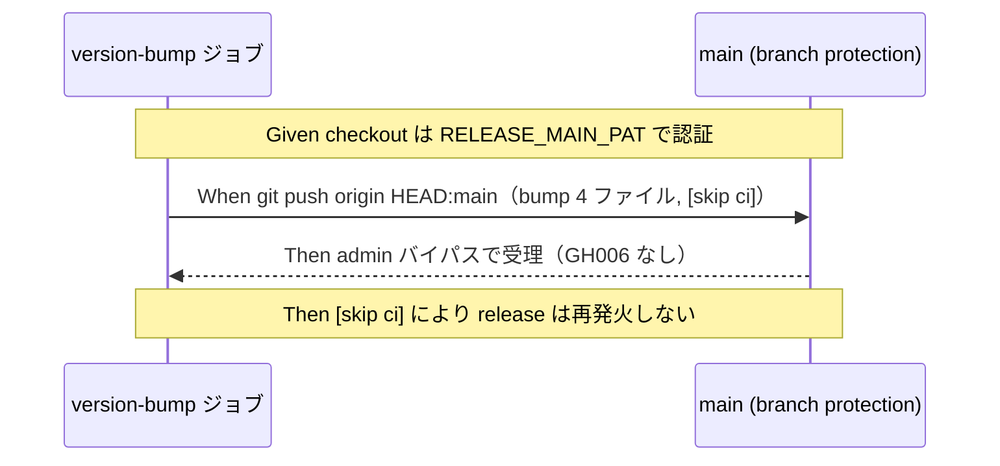

# 要件定義書: release.yml の main 直接 push 認証を PAT 化する

**プロジェクト名**: release.yml の main 直接 push 認証を PAT 化する
**作成日**: 2026 年 07 月 12 日
**最終更新**: 2026 年 07 月 12 日

> **重要**: **このドキュメントは常に更新**: 要件の変更や追加があった場合は、即座にこのドキュメントを更新してください。ドキュメントは「生きているドキュメント」として扱い、実装内容と常に同期させます。
>
> **用語**: [.agent-skill-chain/source/CONCEPTS.md §用語規約](../../../../.agent-skill-chain/source/CONCEPTS.md#用語規約) を参照。

---

## 1. 概要

### 1.1 システム概要

`.github/workflows/release.yml` の `version-bump` ジョブは、bump した 4 ファイル（`package.json`・`package-lock.json`・`plugin.json`・`apm.yml`）を main へ直接 push して配布 version を確定する。この push が既定 `GITHUB_TOKEN`（`github-actions[bot]`）で行われるため、main の branch protection（PR 必須・レビュー承認 1 件以上・`self-enforce` 必須・`enforce_admins: false`）に `GH006: Protected branch update failed` で拒否される。本要件は、当該ジョブの checkout/push 認証を admin 発行の fine-grained PAT（secret `RELEASE_MAIN_PAT`）へ切り替え、branch protection を維持したまま書き戻しを通す変更を定義する。

### 1.2 用語集

| 用語 | 説明 |
| ---- | ---- |
| `RELEASE_MAIN_PAT` | admin ユーザー（adachi-tatsuru）が発行した fine-grained PAT を格納したリポジトリ secret。対象リポジトリ `techbeansjp-free/AGENTS.md` 限定・権限は Contents: Read and write のみ。実トークン値は本成果物に記載しない。 |
| `enforce_admins: false` | branch protection の設定。admin 権限を持つ主体は保護をバイパスできる。PAT の実行主体は admin ユーザーのためこの経路でバイパス可能。 |
| GH006 | Protected branch update failed。保護ブランチへの非準拠 push が拒否されるときの GitHub エラー。 |
| `[skip ci]` | コミットメッセージに含めると当該 push に対する GitHub Actions 実行をスキップさせるトークン。PAT push による再発火防止の主防御。 |

---

## 2. 機能要件

### 2.1 ユーザーストーリー

#### ストーリー 1: bump 書き戻しを branch protection 維持のまま通す

- **As a** リリース CI（`version-bump` ジョブ）
- **I want to** admin 発行 PAT（`RELEASE_MAIN_PAT`）で main へ bump 結果を書き戻す
- **So that** branch protection 設定を変更せずに書き戻し push を成功させ、配布 version を確定できる

**受け入れ基準**:

- `version-bump` ジョブの checkout ステップが `token: ${{ secrets.RELEASE_MAIN_PAT }}` を用いる。
- 後続の `git push origin HEAD:main`（および non-fast-forward 再試行の push）が PAT 認証で実行される。
- 変更は `version-bump` ジョブの checkout/push 認証に限定され、他ステップ・他ジョブの認証は変更されない。

#### ストーリー 2: branch protection を変更しない

- **As a** リポジトリメンテナ
- **I want to** branch protection 設定（PR 必須・レビュー 1 件・`self-enforce` 必須・`enforce_admins: false`・force push/削除禁止）を変更せずに本修正を適用する
- **So that** 保護を弱めずに CI の書き戻しだけを通せる

**受け入れ基準**:

- 変更前後で `gh api repos/{owner}/{repo}/branches/main/protection` の設定が同一。
- release.yml 以外（branch protection・Ruleset 等）への変更が発生しない。

#### ストーリー 3: 無限ループを起こさない

- **As a** リリース CI
- **I want to** PAT による main push が release ワークフローを再発火させないこと
- **So that** bump → push → 再発火 → bump … の無限ループを避けられる

**受け入れ基準**:

- bump 書き戻しコミットメッセージに `[skip ci]` が維持されている。
- PAT push は既定 `GITHUB_TOKEN` と異なり on:push を再トリガしうるため、`[skip ci]` が再発火防止の主防御として機能する設計であることが release.yml のコメントまたは RELEASE.md に明記されている。
- `concurrency: group: release` による直列化が維持されている。

#### ストーリー 4: PAT 実値を露出しない

- **As a** セキュリティ観点のレビュアー
- **I want to** PAT の実トークン値がコード・ログ・issue 成果物に残らないこと
- **So that** トークン漏洩リスクを負わない

**受け入れ基準**:

- release.yml・00/01/02/03/04・memo・ログのいずれにも PAT 実値が含まれず、参照は secret 名 `RELEASE_MAIN_PAT` のみ。

#### ストーリー 5: docs と実装の整合

- **As a** メンテナ
- **I want to** RELEASE.md（必要なら README.md）の認証記述を実装に合わせて更新する
- **So that** 「既定 GITHUB_TOKEN のみを使用」という現行記述と実装の不整合を残さない

**受け入れ基準**:

- RELEASE.md の該当記述（63 行目付近「main への書き戻し push・…は既定 `GITHUB_TOKEN` のみを使用する（PAT／deploy key を使わない）」）が、bump 書き戻しのみ PAT を使う実装と矛盾しない内容へ更新されている。
- 更新要否・範囲は 02 設計で確定し、更新する場合は 03 実装計画のタスクに含める。

### 2.2 BDD ユースケース

#### ユースケース 1: bump 書き戻し push

**シナリオ 1: PAT 認証で書き戻しが成功する**

```gherkin
Feature: version-bump の main 書き戻し認証
  Scenario: RELEASE_MAIN_PAT で書き戻し push が成功する
    Given release.yml の version-bump ジョブの checkout が token に secrets.RELEASE_MAIN_PAT を用いている
    And main の branch protection は enforce_admins:false のまま変更されていない
    When version-bump ジョブが bump 4 ファイルを git push origin HEAD:main で書き戻す
    Then push は admin 主体としてバイパス経路に乗り GH006 で拒否されず成功する
```

**シナリオ 2: branch protection は据え置き**

```gherkin
Feature: branch protection の不変更
  Scenario: 修正後も保護設定が変わらない
    Given 本修正を適用した release.yml
    When gh api repos/{owner}/{repo}/branches/main/protection を変更前後で比較する
    Then 設定は同一であり保護は弱められていない
```

#### ユースケース 2: 無限ループ防止

**シナリオ 3: PAT push が再発火しない**

```gherkin
Feature: 無限ループ防止
  Scenario: bump 書き戻しの [skip ci] で release が再発火しない
    Given bump 書き戻しコミットメッセージに [skip ci] が含まれる
    When PAT による push が main へ反映される
    Then on:push は [skip ci] によりスキップされ release ワークフローは再起動しない
```

**処理フロー**:



#### ユースケース 3: PAT 実値の非露出

**シナリオ 4: 参照は secret 名のみ**

```gherkin
Feature: PAT 実値の非露出
  Scenario: 成果物・コードに実トークンが残らない
    Given 本 issue の全成果物と release.yml
    When PAT に関する記述を確認する
    Then 参照は secrets.RELEASE_MAIN_PAT のみでトークン実値は一切含まれない
```

### 2.3 ビジネスルール

- 修正は `version-bump` ジョブの checkout/push 認証のみに限定する（他ジョブ・他設計判断・branch protection には触れない）。
- PAT の使用範囲は main への直接 push が必要な `version-bump` に限る。`release-marketplace`・`apm-release`（`release/*` ブランチ push・タグ付与）と Release 作成は既定 `GITHUB_TOKEN` のまま据え置く。
- PAT 実トークン値をいかなる成果物・ログ・コミットにも書かない。

---

## 3. 非機能要件

### 3.1 パフォーマンス要件

- 認証方式の変更のみで、ジョブ実行時間・CI 頻度への有意な影響はない。

### 3.2 セキュリティ要件

- PAT は対象リポジトリ限定・Contents: Read and write の最小権限。secret `RELEASE_MAIN_PAT` として保管し、参照は secret 名のみ。
- ブラスト半径を最小化するため、PAT を使うのは main 直接 push が要る `version-bump` の checkout/push のみに限る。

### 3.3 ユーザビリティ要件

- 通常運用でメンテナの追加操作は不要（secret 登録済み）。PAT 失効時のみ再登録が必要という運用を RELEASE.md 等に必要に応じ明記する。

### 3.4 可用性要件

- PAT 失効・権限不足時の失敗（GH006 とは異なる 401/403 等）を切り分けられるよう、02/03 で失敗観測の指針を示す。

---

## 4. 外部インターフェース要件

### 4.1 API 要件

- GitHub Actions `actions/checkout` の `token` 入力に `secrets.RELEASE_MAIN_PAT` を渡す（checkout が persist-credentials により後続 git 操作の認証情報を設定する既定挙動を利用する）。
- `git push origin HEAD:main` は checkout が設定した認証情報を用いる（push ステップ側で明示的にトークンを埋め込む方式にするかは 02 設計で確定する）。

### 4.2 データ形式要件

- secret 参照は `${{ secrets.RELEASE_MAIN_PAT }}` の形式のみ。

---

## 5. 制約事項

- 修正対象は `.github/workflows/release.yml` の `version-bump` ジョブ checkout/push 認証、および `docs/maintainer/RELEASE.md`（必要なら README.md）の認証記述に限定する。
- main branch protection（PR 必須・レビュー 1 件・`self-enforce` 必須・`enforce_admins: false`・force push/削除禁止）は変更しない。
- GitHub Ruleset への移行案は不採用（ブラスト半径が大きいため）。
- PAT 化で `actor != 'github-actions[bot]'` ガードが bump 書き戻し push を弾けなくなるため、無限ループ防止は `[skip ci]` に依存する。`[skip ci]` を維持し、その役割を release.yml コメントまたは RELEASE.md に明記する（新規ガード追加は最小限）。

---

## 6. 参考資料

### プロジェクトドキュメント

- [`00_要求定義.md`](./00_要求定義.md) - 要求定義
- [`.github/workflows/release.yml`](../../../../.github/workflows/release.yml) - 現行ワークフロー（version-bump checkout 58〜61 行目・push 97〜111 行目）
- [`docs/maintainer/RELEASE.md`](../../../../docs/maintainer/RELEASE.md) - リリース手順正本（認証記述 63 行目付近が更新候補）
- [`docs/maintainer/workflow/20260712_143913_release自動発火push化/00_要求定義.md`](../20260712_143913_release自動発火push化/00_要求定義.md) - 直前 issue（push 契機化）

### その他の参考資料

- fine-grained PAT と branch protection（`enforce_admins`）バイパスの関係（GitHub 公式仕様）。

---

## 7. 前のステップ

この要件定義書は、以下のドキュメントを基に作成されています：

- **前**: [`00_要求定義.md`](./00_要求定義.md) - 要求定義フェーズ

---

## 8. 次のステップ

この要件定義書の承認後、以下のドキュメントを作成します：

- **次**: [`02_設計.md`](./02_設計.md) - 設計フェーズ
</content>
</invoke>
