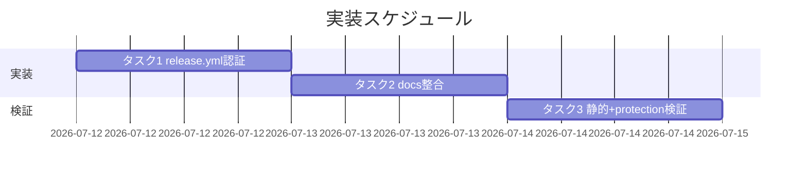

# 実装計画書: release.yml の main 直接 push 認証を PAT 化する

**プロジェクト名**: release.yml の main 直接 push 認証を PAT 化する
**作成日**: 2026 年 07 月 12 日
**最終更新**: 2026 年 07 月 12 日

> **重要**: **このドキュメントは常に更新**: 実装計画の変更、進捗状況の更新、バグの記録などがあった場合は、即座にこのドキュメントを更新してください。
>
> **用語**: [.agent-skill-chain/source/CONCEPTS.md §用語規約](../../../../.agent-skill-chain/source/CONCEPTS.md#用語規約) を参照。

---

## 1. 実装概要

### 1.1 実装方針

02_設計に従い、`.github/workflows/release.yml` の `version-bump` ジョブ Checkout ステップに `token: ${{ secrets.RELEASE_MAIN_PAT }}` を追加し、無限ループ防止コメントを `[skip ci]` 主防御へ訂正する。併せて `docs/maintainer/RELEASE.md` の認証記述を実装に一致させ、`README.md` §リリース手順に矛盾がないことを確認する。push コマンド・他ジョブ・branch protection・paths フィルタ・`RELEASE_ENABLED`・`concurrency` は変更しない。

### 1.2 実装順序

1. **タスク 1**: release.yml の `version-bump` Checkout に PAT を追加し、無限ループ防止コメントを訂正する。
2. **タスク 2**: RELEASE.md の認証記述を更新し、README を確認（矛盾なければ無改変）する。
3. **タスク 3**: 静的検査・branch protection 不変・PAT 実値非露出の検証（実 push 確認は検証フェーズへ引き継ぐ）。



---

## 2. タスク分解

### 2.1 タスク 1: version-bump Checkout に PAT を追加しコメントを訂正する

#### 2.1.1 概要

`version-bump` ジョブの Checkout ステップに `token: ${{ secrets.RELEASE_MAIN_PAT }}` を追加し、後続 push を admin 主体で認証させる。併せて無限ループ防止コメントを `[skip ci]` 主防御へ訂正する。

#### 2.1.2 実装内容

- `release.yml` `version-bump` ジョブ Checkout ステップ（58–61 行目付近）の `with:` に `token: ${{ secrets.RELEASE_MAIN_PAT }}` を追加する（`fetch-depth: 0` は維持）。
- 冒頭コメント（16–21 行目）の「主防御: 既定 GITHUB_TOKEN による push は workflow を再トリガしない／PAT・deploy key は使わない」を、「`version-bump` の main 書き戻しは admin PAT（`RELEASE_MAIN_PAT`）で認証し branch protection をバイパスする。PAT push は `on: push` を再トリガしうるため無限ループ防止の**主防御は `[skip ci]`**。`concurrency: group: release` は直列化のセーフティネット。他ジョブ・タグ・Release は既定 `GITHUB_TOKEN` 据え置き」へ訂正する。
- push ステップ直前コメント（94 行目付近）の「既定 GITHUB_TOKEN による push は workflow を再トリガしない（主防御）」を、「Checkout が持たせた `RELEASE_MAIN_PAT` で push。再発火防止の主防御はコミットメッセージの `[skip ci]`」へ訂正する。
- Commit & push ステップの `git push origin HEAD:main`（non-fast-forward 再試行含む）・commit メッセージ `chore(release): v${version} [skip ci]` は**改変しない**。
- 既存 `if: github.actor != 'github-actions[bot]'` ガードは据え置く（残存ガードであり bump 書き戻しの実効防御ではない旨はコメント/RELEASE.md 側で説明）。

#### 2.1.3 テスト観点

**参照**: 観点定義は [02_設計 §6](./02_設計.md) および [RULES のテスト戦略・TEST_BDD_FORMAT](../../../../.agent-skill-chain/source/RULES.md#テスト戦略必須要件) を参照。

##### 単体（本タスクの具体ケース）

- `version-bump` ジョブの Checkout ステップに `token: ${{ secrets.RELEASE_MAIN_PAT }}` が 1 件存在する。
- `release-marketplace`・`apm-release` の Checkout には `token:` が追加されていない（他ジョブ無改変）。
- Commit & push ステップの commit メッセージに `[skip ci]` が残存する。
- release.yml が YAML/ワークフローとして妥当（`actionlint` 等でパースエラーなし）。

##### 結合/API

- 該当なし（GitHub Actions ランタイムでの実行は E2E/検証フェーズで扱う）。

##### E2E/受け入れ

- 実 push による GH006 回避は実運用の release 実行で確認する（設計・実装時点では実行不能）。実行前は静的検査＋branch protection 不変（タスク 3）で代替する。

##### バリデーション

- トークン様文字列（`ghp_`・`github_pat_` 等）が release.yml に 0 件（参照は secret 名のみ）。

#### 2.1.4 単体テスト仕様（BDD）

```gherkin
Feature: version-bump の Checkout 認証
  Scenario: Checkout に RELEASE_MAIN_PAT が渡り他ジョブは無改変
    Given .github/workflows/release.yml
    When version-bump ジョブの Checkout ステップの with を確認する
    Then token: ${{ secrets.RELEASE_MAIN_PAT }} が存在する
    And release-marketplace と apm-release の Checkout には token 追加がない
    And commit メッセージには [skip ci] が残っている
```

```bash
# Given: 改修後の release.yml
f=.github/workflows/release.yml
# When: version-bump の Checkout with に token 行があるか（awk で version-bump ブロックを対象化）
# Then: token 参照が secret 名のみで存在し、実トークン値は含まれない
grep -q 'token: ${{ secrets.RELEASE_MAIN_PAT }}' "$f"   # Then: PAT 参照が存在
! grep -Eq 'ghp_[A-Za-z0-9]|github_pat_[A-Za-z0-9]' "$f" # Then: 実トークン値なし
grep -q '\[skip ci\]' "$f"                              # Then: [skip ci] 残存
```

#### 2.1.5 依存関係

- なし（本 issue の起点タスク）。

#### 2.1.6 見積もり

- **工数**: 0.5h
- **優先度**: 高

### 2.2 タスク 2: RELEASE.md の認証記述更新と README 確認

#### 2.2.1 概要

`RELEASE.md`（63 行目付近）の「main への書き戻し push …は既定 `GITHUB_TOKEN` のみを使用する（PAT／deploy key を使わない）。既定トークンによる push は再トリガしない（無限ループ防止）」を実装に一致させ、README §リリース手順に矛盾がないことを確認する。

#### 2.2.2 実装内容

- `RELEASE.md` の該当引用ブロックを、「`version-bump` の main 書き戻し push のみ admin PAT（`RELEASE_MAIN_PAT`）で認証し、branch protection（`enforce_admins: false`）をバイパスして通す。PAT push は `on: push` を再トリガしうるため、無限ループ防止の**主防御はコミットメッセージの `[skip ci]`**（`concurrency: group: release` は直列化のセーフティネット）。リリースブランチ push・タグ付与・GitHub Release 作成は引き続き既定 `GITHUB_TOKEN`（`contents: write`）を使用する」旨へ書き換える。
- 必要に応じ PAT 失効時の切り分け（GH006 と 401/403 の区別）・復旧（secret 再登録）を短く追記する。
- `README.md` §リリース手順（163 行目付近）を確認する。現状は認証機構に言及がないため矛盾なし＝**無改変**（確認結果を検証で証跡化）。

#### 2.2.3 テスト観点

##### 単体（本タスクの具体ケース）

- RELEASE.md に「既定 GITHUB_TOKEN のみを使用する（PAT／deploy key を使わない）」旧記述が残っていない。
- RELEASE.md に `RELEASE_MAIN_PAT` と `[skip ci]` を主防御とする記述が存在する。
- README §リリース手順に GITHUB_TOKEN 専用を断定する記述がなく矛盾がない。

##### 結合/API・E2E・バリデーション

- 該当なし（ドキュメント整合の静的確認）。

#### 2.2.4 単体テスト仕様（BDD）

```gherkin
Feature: docs と実装の整合
  Scenario: RELEASE.md が PAT 化と [skip ci] 主防御に一致する
    Given docs/maintainer/RELEASE.md
    When 認証記述（63 行目付近）を確認する
    Then 「既定 GITHUB_TOKEN のみ・PAT を使わない」旧記述が存在しない
    And RELEASE_MAIN_PAT と [skip ci] 主防御の記述が存在する
    And README §リリース手順と矛盾しない
```

```bash
# Given: 更新後の RELEASE.md と README.md
# When/Then: 旧記述が消え新記述が入り、README に矛盾がないこと
! grep -q 'PAT／deploy key を使わない' docs/maintainer/RELEASE.md   # Then: 旧記述なし
grep -q 'RELEASE_MAIN_PAT' docs/maintainer/RELEASE.md               # Then: PAT 記述あり
grep -q 'skip ci' docs/maintainer/RELEASE.md                        # Then: 主防御記述あり
! grep -q 'GITHUB_TOKEN のみ' README.md                            # Then: README に断定矛盾なし
```

#### 2.2.5 依存関係

- タスク 1（実装の実態が確定してから記述を一致させる）。

#### 2.2.6 見積もり

- **工数**: 0.5h
- **優先度**: 高

### 2.3 タスク 3: 静的検査・branch protection 不変・PAT 非露出の検証

#### 2.3.1 概要

実 push を伴わない範囲で成功基準を検証し、実 push による GH006 回避は検証フェーズへ引き継ぐ。

#### 2.3.2 実装内容

- release.yml の静的検査（`actionlint` 等でパース。タスク 1 の grep 群を実行）。
- **branch protection 不変の実測**: 変更前後で `gh api repos/techbeansjp-free/AGENTS.md/branches/main/protection` の出力が同一であることを確認する（本 issue は release.yml/docs のみ変更するため、この API 出力は変わらないことの実測確認）。
- PAT 実値の非露出（全成果物・release.yml に対しトークン様文字列 grep が 0 件）。
- 実 push による GH006 回避は、本 PR マージ後の初回 release 実行ログで確認する旨を残す（設計・実装時点では実行しない）。

#### 2.3.3 テスト観点

##### 単体

- release.yml がパース可能・タスク 1/2 の grep がすべて期待どおり。

##### 結合/API

- `gh api …/branches/main/protection` の出力が変更前後で同一（JSON 差分 0）。

##### E2E/受け入れ

- 実 push での GH006 回避は検証フェーズ（実 release 実行）で確認。実行前は静的検査＋protection 不変で代替（未達理由を明記）。

##### バリデーション

- 成果物・release.yml にトークン様文字列 0 件。

#### 2.3.4 単体テスト仕様（BDD）

```gherkin
Feature: branch protection の不変更
  Scenario: 修正前後で保護設定が同一
    Given main の branch protection 設定
    When gh api repos/techbeansjp-free/AGENTS.md/branches/main/protection を変更前後で取得し比較する
    Then 2 つの出力は同一であり保護は弱められていない
```

```bash
# Given: 変更前に保護設定を退避
gh api repos/techbeansjp-free/AGENTS.md/branches/main/protection > /tmp/prot_before.json  # Given
# When: 変更適用後に再取得
gh api repos/techbeansjp-free/AGENTS.md/branches/main/protection > /tmp/prot_after.json    # When
# Then: 差分ゼロ
diff /tmp/prot_before.json /tmp/prot_after.json && echo "OK: protection unchanged"         # Then
```

#### 2.3.5 依存関係

- タスク 1・タスク 2。

#### 2.3.6 見積もり

- **工数**: 0.5h
- **優先度**: 高

---

## テスト観点

- **認証差し替え**: `version-bump` の Checkout に `token: ${{ secrets.RELEASE_MAIN_PAT }}` があり、他ジョブ・push コマンドは無改変（01 ストーリー 1・UC1 シナリオ 1 に対応）。
- **branch protection 不変**: `gh api …/protection` が変更前後で同一（01 ストーリー 2・UC1 シナリオ 2 に対応）。
- **無限ループ防止**: `[skip ci]` が commit メッセージに残り、主防御である旨がコメント/RELEASE.md に明記（01 ストーリー 3・UC2 シナリオ 3 に対応）。
- **PAT 非露出**: 参照は secret 名のみ・トークン実値 0 件（01 ストーリー 4・UC3 シナリオ 4 に対応）。
- **docs 整合**: RELEASE.md が実装に一致・README 矛盾なし（01 ストーリー 5 に対応）。

## 単体テスト

- 本 issue の「単体」は CI ワークフロー YAML とドキュメントに対する**静的検査**（grep/パース）で構成する。ランタイム実行（実 push）は E2E/検証フェーズで扱う。各タスク §2.x.4 の bash スニペットが単体検査の実体。

## BDD

- タスク 1 §2.1.4（Checkout 認証）、タスク 2 §2.2.4（docs 整合）、タスク 3 §2.3.4（branch protection 不変）。いずれも 01_要件定義 §2.2 の BDD ユースケース（UC1 シナリオ 1・2、UC2 シナリオ 3、UC3 シナリオ 4）と対応する。

---

## 3. 実装スケジュール

### 3.1 マイルストーン

| マイルストーン | 期日 | 成果物 |
| -------------- | ---- | ------ |
| 認証差し替え完了 | 2026-07-12 | 改修済み release.yml |
| docs 整合完了 | 2026-07-12 | 更新済み RELEASE.md（README 確認済み） |
| 検証完了 | 2026-07-12 | 静的検査・protection 不変の証跡 |

### 3.2 実装フェーズ

#### フェーズ 1: 認証と docs

- **期間**: 当日
- **タスク**: タスク 1・タスク 2

#### フェーズ 2: 検証

- **期間**: 当日
- **タスク**: タスク 3（実 push 確認は後続の実 release 実行へ引き継ぎ）

---

## 4. テスト計画

- テスト観点・レベル・BDD 形式の定義は 02_設計 §6 および RULES のテスト戦略・TEST_BDD_FORMAT を参照。
- 実 push による GH006 回避は実運用の release 実行でのみ確認可能なため、実装前は静的検査＋branch protection 不変で代替し、E2E は検証フェーズに引き継ぐ。

### 4.1 テストの優先順位

- クリティカル: 認証差し替え（Checkout token）・`[skip ci]` 主防御維持・branch protection 不変。
- 回帰: 他ジョブ（`release-marketplace`・`apm-release`）・push コマンド・タグ/Release 作成が無改変であること。

---

## 5. リスク管理

### 5.1 実装リスク

- **リスク**: `[skip ci]` が万一効かず、bump 書き戻し（`package.json` 変更で paths 一致）が PAT push により再発火し無限ループ化する。
  - **対策**: `[skip ci]` は GitHub 公式のスキップ機構（run を作成しない）で信頼性が高い（02 ADR-2・evidence_source: external_spec）。commit メッセージからの `[skip ci]` 除去を禁止事項として明記し、`concurrency: group: release` を直列化セーフティネットとして維持する。新規ガードは追加しない（スコープ規律）。
- **リスク**: PAT 失効・権限不足で push が 401/403 で失敗する。
  - **対策**: GH006 と 401/403 をログで切り分ける指針（02 §3.1.4）を残し、復旧は secret `RELEASE_MAIN_PAT` の再登録とする。
- **リスク**: Checkout の `token` 追加漏れや他ジョブへの誤適用。
  - **対策**: タスク 1/3 の grep 検査で `version-bump` のみに token があることを機械確認する。

---

## 6. 参考資料

### プロジェクトドキュメント

- [`02_設計.md`](./02_設計.md) - 設計
- [`01_要件定義.md`](./01_要件定義.md) - 要件定義
- [`.github/workflows/release.yml`](../../../../.github/workflows/release.yml) - 改修対象
- [`docs/maintainer/RELEASE.md`](../../../../docs/maintainer/RELEASE.md) - 認証記述更新対象
- [`README.md`](../../../../README.md) §リリース手順 - 矛盾確認対象（無改変見込み）

### その他の参考資料

- GitHub Docs「Skipping workflow runs」・「Triggering a workflow」、actions/checkout README（02 §10 参照）

---

## 7. 前のステップ

この実装計画書は、以下のドキュメントを基に作成されています：

- **前**: [`02_設計.md`](./02_設計.md) - 設計フェーズ

---

## 8. 次のステップ

- 本 issue は単一 issue であり、実装フェーズ（execution）へ直接進む。
- **ただし実装着手前に review-docs（実装前ドキュメントレビュー）が必須ゲート**である（design-feature 完了と implement-feature 着手の間・免除なし）。review-docs 完了後に implement-feature を委譲する。
