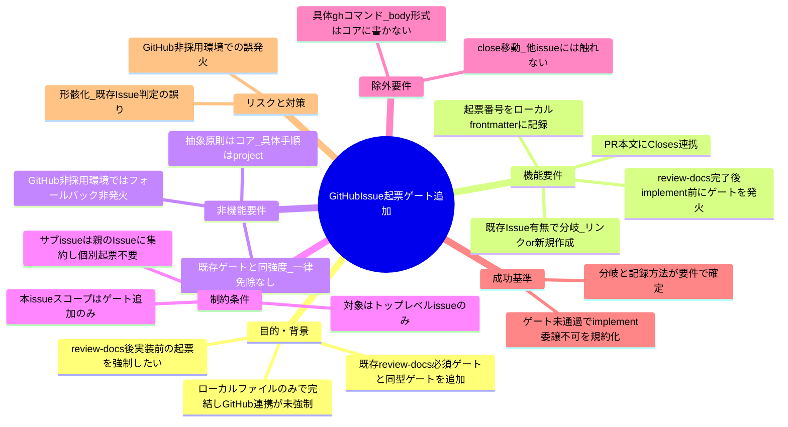
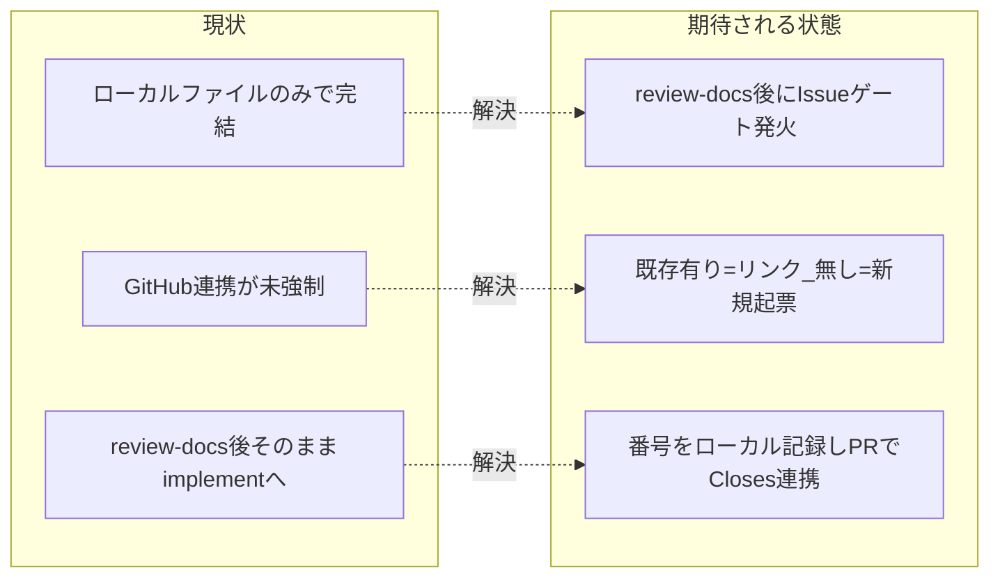

# 要求定義書: review-docs 完了後の GitHub Issue 起票ゲート追加

**プロジェクト名**: review-docs 完了後の GitHub Issue 起票ゲート追加
**作成日**: 2026 年 07 月 12 日
**最終更新**: 2026 年 07 月 12 日

> **重要**:
>
> - 要求定義書は、プロジェクトの全体像を把握するためのものです。詳細な技術仕様や実装方法は要件定義書以降で記載します。必要最低限の情報に収めることを心掛けてください。
> - **このドキュメントは常に更新**: 要求の変更や追加があった場合は、即座にこのドキュメントを更新してください。ドキュメントは「生きているドキュメント」として扱い、実装内容と常に同期させます。
> - **必須項目**: 以下の「必須」と明記した項目は空欄・抽象語のみ（例: 「{説明}」のまま）で提出しないこと。判定可能な形（目的は1文・成功基準は○/×で判定できる記載等）で記入すること。
>
> **用語**: [.agent-skill-chain/source/CONCEPTS.md §用語規約](../../../../.agent-skill-chain/source/CONCEPTS.md#用語規約) を参照。

---

## 要求定義の全体像

**注意**:

- 上記の「プロジェクト名」は例です。実際のプロジェクト名に置き換えてください。
- マインドマップは全体像を把握するためのものです。主要なセクション名程度に留め、詳細は記載しないでください。

---

## 1. 目的・背景

### 1.1 目的（必須）

review-docs 完了後・implement 着手前に GitHub Issue の存在（リンク or 新規起票）を必須化する。

### 1.2 背景

- **現状の課題**:
  - 本フレームワークのワークフローは「00_要求定義 → 01_要件定義 → 02_設計 → 03_実装計画 →（review-docs 必須ゲート）→ 実装 → verify-and-close」を、すべて**ローカルファイル**（`docs/maintainer/workflow/{issue}/00〜04_*.md`）と `workflow.db` の証跡で完結させており、**GitHub Issues との連携が一切強制されていない**。実装に入る前に GitHub 側へ課題が可視化されないため、外部からの追跡・PR との自動クローズ連携・進捗共有ができない。
  - 既存の「実装着手前の review-docs 必須ゲート（絶対強制）」は [.agent-skill-chain/source/skills/agent/run_command.md §Constraints](../../../../.agent-skill-chain/source/skills/agent/run_command.md)（47 行目）・[.agent-skill-chain/source/commands/implement-feature.md §実行時の注意](../../../../.agent-skill-chain/source/commands/implement-feature.md)（64 行目）・[.agent-skill-chain/source/workflow/PHASES.md §レビュー成果物の配置ルール](../../../../.agent-skill-chain/source/workflow/PHASES.md)（65 行目）で規定され、未実行は enforcement #32（[.agent-skill-chain/source/enforcement/README.md](../../../../.agent-skill-chain/source/enforcement/README.md) §失敗条件と差し戻し）で FAIL する。**GitHub Issue 起票ゲートは、この review-docs ゲートと同一構造・同一強度のゲートを 1 段追加するもの**であり、位置づけは「review-docs 完了の**後**・implement-feature 委譲の**前**」である（evidence_source: 上記コアファイルの現行記述を実読して確認。`repo_file`）。

- **必要性**:
  - ユーザー（本フレームワークの開発者）から明示要求: **「実装前 review（review-docs）と指摘対応の反復が終わった後に、必ず issue を GitHub 側に起票してから実装に入るように強制するべき」**。現状はローカル完結のため、この強制が存在しない。
  - ただし GitHub Issue は**ローカルワークフロー開始前に既に起票されているケースがある**（例: ユーザーが先に GitHub 上で issue を立て、それを起点にローカルの 00_要求定義 を書き始める）。「review-docs 完了後に必ず新規作成する」という一律前提はこのケースで**重複起票**を生む。したがってゲートは「**既存 GitHub Issue があればリンク、無ければ新規作成**」の分岐を持つ必要がある。

### 1.3 期待される効果（必須: 1 件以上）

- **効果 1**: review-docs 完了後・implement 着手前に「対応する GitHub Issue が存在し、その番号がローカルに記録されている」ことが必須になる（○/×判定: ゲート未通過のまま implement-feature を委譲する経路が規約上禁止され、未通過検知の失敗条件が enforcement に定義されることを確認できる）。
- **効果 2**: 既に GitHub Issue が起票済みの場合は重複起票せずリンクで済ませられる（○/×判定: 「既存 Issue あり → リンク／無し → 新規作成」の分岐が要件・設計で定義され、判定手順が示されることを確認できる）。
- **効果 3**: 実装 PR がマージされると対応 GitHub Issue が自動クローズされる（○/×判定: PR 本文に `Closes #<番号>` を含める運用が要件化され、マージ時の自動クローズが期待動作として定義されることを確認できる）。

**現状と期待される状態の比較**:

---

## 2. 機能要件

### 2.1 既存機能の維持（該当する場合）

- 既存フェーズ順（00 → 01 → 02 → 03 → review-docs → 実装 → verify-and-close）と、既存の review-docs 必須ゲート（絶対強制）の挙動は変更しない。本 issue は review-docs ゲートの**直後に 1 段ゲートを追加する**ものであり、既存ゲートを置換・弱化しない。
- ローカルファイル（00〜04）・`workflow.db` 証跡・書記（write-workflow-log）委譲の仕組みは維持する。

### 2.2 新規機能要件

- **GitHub Issue 起票ゲート**を、review-docs 完了（指摘 0 件収束＋書記記録）後・implement-feature 委譲前の**必須ゲート**として追加する（トップレベル issue 一律）。
- ゲート内で**既存 GitHub Issue の有無を判定**し、
  - 既存あり: その Issue にリンクし、番号を記録する（新規起票しない）。
  - 既存なし: この段階で GitHub Issue を新規起票し、番号を記録する。
- 起票（またはリンクした）**GitHub Issue 番号をローカルに記録**する（00_要求定義.md の frontmatter を想定。キー名・形式は 02 設計で確定）。
- 実装完了時の PR 本文に `Closes #<番号>` を含め、マージ時に対応 Issue が自動クローズされる運用を要件化する。

---

## 3. 非機能要件

### 3.1 パフォーマンス

- ゲートは 1 issue あたり 1 回（新規起票 or 既存リンク確認）であり、ワークフロー実行時間への有意な影響はない。

### 3.2 セキュリティ

- 起票に用いる認証（`gh` CLI のトークン等）はランタイム環境の既存認証に従い、トークン実値を成果物・ログに残さない。

### 3.3 互換性

- **GitHub Issues を採用していない・使えない環境ではゲートを発動させない**（フォールバック）。[.agent-skill-chain/source/MODEL_SELECTION.md §1 適用条件](../../../../.agent-skill-chain/source/MODEL_SELECTION.md) と同型の「対象外環境では発火しない」思想を踏襲する。
- 既存の enforcement 失敗条件（#32 等）と非交差になるよう、本ゲートの失敗条件は独立した番号で定義する（番号割当は 02/03 で確定）。

### 3.4 保守性

- 抽象原則（ゲートの存在・タイミング・適用条件・分岐の存在）は**コア**（`.agent-skill-chain/source/`）に、具体手順（`gh issue create` の具体コマンド・title/body 形式・frontmatter 記録形式）は `.agent-skill-chain/project/自己拡張ワークフロー.md` に置く。既存の汎用/固有境界パターン（MODEL_SELECTION.md §汎用/固有境界 等）を踏襲し、コアに具体コマンドを持ち込まない。

---

## 4. 制約条件

### 4.1 技術的制約

- ゲートの位置は「review-docs 完了後・implement-feature 委譲前」に固定する。review-docs 完了の定義は [.agent-skill-chain/source/workflow/PHASES.md §レビュー成果物の配置ルール](../../../../.agent-skill-chain/source/workflow/PHASES.md)（memo 作成＋指摘収束＋書記委譲）を正本とし、本 issue で再定義しない。
- 既存 review-docs 必須ゲートと**同型・同強度**（絶対強制・全 issue 一律・規模比例の免除なし）とする。
- コア／`.agent-skill-chain/project/` の**配置境界**を越えない。具体コマンド・body/title・frontmatter 形式はコアに書かない。

### 4.2 既存システムとの互換性

- 既存の enforcement（audit.sh・subagent-guard 等）・`workflow.db` スキーマと整合させる。本ゲートの機械検知可否（CI 強制 or AI 自律判断）は 02/03 で判断する（GitHub Issue の存在は git 差分に痕跡を残しにくいため、frontmatter 記録の有無で近似検知する案を 02 で検討する）。

### 4.3 移行期間・スケジュール

- 発効日（grandfather 境界）の扱いは既存 #32 の `REVIEWDOCS_GATE_EFFECTIVE_FROM` と同型に、発効日より前の既存 issue には遡及適用しない方針を 02/03 で確定する。

---

## 5. 除外要件

- **具体手順のコア記載は対象外**: `gh issue create` の具体コマンド・title/body テンプレート・frontmatter の具体キー名/形式は**コアに書かない**。これらは `.agent-skill-chain/project/自己拡張ワークフロー.md` に置く（配置境界の申し送りとして 02 設計へ引き継ぐ）。
- **サブ issue（90_issues 配下）への個別 GitHub Issue 起票は対象外**（推奨方針）。サブ issue（PR 指摘対応等）は親 issue の GitHub Issue 上のチェックリスト/コメントに集約し、個別の GitHub Issue 起票は不要とする方向で 01 に要件化する。理由: サブ issue ごとに GitHub Issue を量産すると Issue トラッカーが細分化し、親課題単位の追跡性が下がるため（ブラスト半径・ノイズの最小化）。
- 完了 issue の close 移動・他 issue（release PAT・モデルティア・README 修正 issue 等）には触れない。
- 実際のコア/`project` ファイルの**実装・編集は本 issue（要求・要件フェーズ）では行わない**。実装は後続フェーズ（design-feature → review-docs → implement-feature）で行う。

---

## 6. 成功基準（必須: 1 件以上）

- review-docs 完了後・implement-feature 委譲前に「対応 GitHub Issue の存在（リンク or 新規起票）と番号のローカル記録」を必須とするゲートが、要件（01）として○/×判定可能な受け入れ基準の形で定義されている。
- 「既存 GitHub Issue あり → リンク／無し → 新規作成」の分岐と、その**判定方法**（例: 00_要求定義 の背景欄・frontmatter の GitHub Issue URL 記載有無、ユーザーへの確認等）が要件として確定している。
- 起票/リンクした GitHub Issue 番号の**ローカル記録方法**（00 frontmatter のキー等）が要件として確定している。
- 実装完了時 PR に `Closes #<番号>` を含める運用が要件化されている。
- 適用範囲（トップレベル issue のみ・サブ issue は親へ集約）と、GitHub 非採用環境での非発火（フォールバック）が要件として明記されている。
- 抽象原則＝コア／具体手順＝`.agent-skill-chain/project/` の配置境界が、02 設計への申し送りとして 00 に明記されている。

---

## 7. リスクと対策

### 7.1 技術的リスク

- **リスク**: 既存 GitHub Issue 有無の判定を誤り、重複起票（既存があるのに新規作成）または無起票（無いのにリンク前提でスキップ）が起きる。
  - **対策**: 判定手順を単一情報源（例: 00 frontmatter の `github_issue` キーの有無、無ければゲート内でユーザー確認 or `gh issue list` 照合）に定め、02 設計で分岐フローを一意に確定する。曖昧な自動推測に依存しない。
- **リスク**: ゲートが形骸化し「起票したことにして実装へ進む」運用が常態化する。
  - **対策**: frontmatter への番号記録を必須とし、未記録を近似検知する失敗条件を enforcement に追加する（既存 #32 と同型・非交差の番号で）。機械検知が困難な範囲は AI 自律判断＋人手監査に委ねる旨を明記する（既存 #22–#24 と同じ扱い）。
- **リスク**: GitHub Issues 非採用環境で誤発火し、実行不能になる（過去に enforce on が Agent ツール名未対応でロックアウトした事例と同種の硬直リスク）。
  - **対策**: MODEL_SELECTION.md §1 適用条件と同型の「対象外環境では発火しない」フォールバックを要件・設計に組み込む。

### 7.2 スケジュールリスク

- **リスク**: 特になし（変更範囲はコアのゲート規約追加・`.agent-skill-chain/project/` の具体手順追加・enforcement 失敗条件 1 件の追加に限定される見込み）。
  - **対策**: 該当なし。

---

## 8. 参考資料

### プロジェクトドキュメント

- [`.agent-skill-chain/source/skills/agent/run_command.md`](../../../../.agent-skill-chain/source/skills/agent/run_command.md) — §Constraints「実装着手前の review-docs 必須ゲート（絶対強制）」（47 行目）。本ゲートの同型テンプレート。
- [`.agent-skill-chain/source/commands/implement-feature.md`](../../../../.agent-skill-chain/source/commands/implement-feature.md) — §実行時の注意「実装着手の前提（絶対強制）」（64 行目）。
- [`.agent-skill-chain/source/workflow/PHASES.md`](../../../../.agent-skill-chain/source/workflow/PHASES.md) — §レビュー成果物の配置ルール（review-docs 完了の定義・65 行目の必須ゲート注記）。
- [`.agent-skill-chain/source/enforcement/README.md`](../../../../.agent-skill-chain/source/enforcement/README.md) — §失敗条件と差し戻し #32（review-docs 未実行検知）。本ゲートの失敗条件はこれと同型・非交差で新設する。
- [`.agent-skill-chain/source/MODEL_SELECTION.md`](../../../../.agent-skill-chain/source/MODEL_SELECTION.md) — §1 適用条件・§汎用/固有境界。フォールバック思想と配置境界パターンの参照元。
- [`.agent-skill-chain/project/自己拡張ワークフロー.md`](../../../../.agent-skill-chain/project/自己拡張ワークフロー.md) — 具体手順（`gh issue create` コマンド・title/body・frontmatter 形式）の配置先。

### その他の参考資料

- GitHub の PR 本文キーワード（`Closes #N` 等）によるマージ時 Issue 自動クローズ仕様（GitHub 公式）。

---

## 9. 次のステップ

この要求定義書の承認後、以下のドキュメントを作成します：

- **次**: [`01_要件定義.md`](./01_要件定義.md) - 要件定義フェーズ
