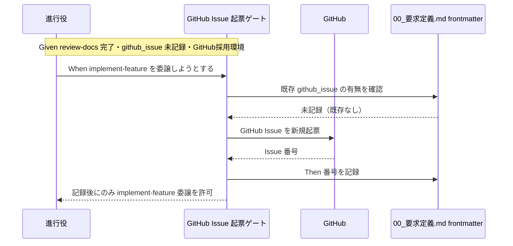

# 要件定義書: review-docs 完了後の GitHub Issue 起票ゲート追加

**プロジェクト名**: review-docs 完了後の GitHub Issue 起票ゲート追加
**作成日**: 2026 年 07 月 12 日
**最終更新**: 2026 年 07 月 13 日

> **重要**: **このドキュメントは常に更新**: 要件の変更や追加があった場合は、即座にこのドキュメントを更新してください。ドキュメントは「生きているドキュメント」として扱い、実装内容と常に同期させます。
>
> **用語**: [.agent-skill-chain/source/CONCEPTS.md §用語規約](../../../../.agent-skill-chain/source/CONCEPTS.md#用語規約) を参照。

---

## 1. 概要

### 1.1 システム概要

本要件は、agent-skill-chain フレームワークのフェーズ進行に**新しい必須ゲート「GitHub Issue 起票ゲート」を 1 段追加**する。位置は「review-docs（実装前ドキュメントレビュー）完了後・implement-feature 委譲前」であり、既存の review-docs 必須ゲートと**同型（5 点セットの写像）**である。ただし**強度は異なる**: review-docs ゲートは「一律・免除なし」だが、本ゲートは「**デフォルト起票＋理由付き記録による代替経路あり**」とする。ゲートは「対応する GitHub Issue が存在しその番号がローカル（00_要求定義.md の frontmatter）に記録されている、**または** 意図的に起票しない決定とその理由がローカルに記録されている」ことを implement-feature 委譲の前提条件とする。**デフォルトは起票**であり、ゲート内でユーザーへ起票するか確認する。起票する場合は既存 GitHub Issue があればリンク、無ければ新規起票する分岐を持つ。起票しない場合は理由を記録する（免除ではなく代替記録＝記録なし・理由なしのスキップは不可）。

抽象原則（ゲートの存在・タイミング・適用条件・分岐の存在・記録の必要性・declined 記録のバリデーション必要性）はコア（`.agent-skill-chain/source/`）に、具体手順（`gh issue create` の具体コマンド・title/body 形式・frontmatter の具体キー/値形式・declined 記録形式）は `.agent-skill-chain/project/自己拡張ワークフロー.md` に置く（配置境界。実装は後続フェーズで行い、本 issue では要件までを確定する）。

### 1.2 用語集

| 用語 | 説明 |
| -------- | ------ |
| GitHub Issue 起票ゲート | review-docs 完了後・implement-feature 委譲前の必須ゲート。デフォルトは起票し、GitHub Issue の存在（リンク or 新規起票）と番号のローカル記録、または意図的に起票しない決定と理由のローカル記録を implement の前提とする。 |
| declined 記録 | 意図的に GitHub Issue を起票しないと決定した場合に、その決定と理由を記録した値。`github_issue` に `"declined: <理由>"` 形式で記録する。理由が空/空白のみは無効（未通過）。免除ではなく代替記録。 |
| review-docs 完了 | 実装前ドキュメントレビューが memo 証跡＋指摘収束＋書記委譲まで至った状態。定義の正本は [PHASES.md §レビュー成果物の配置ルール](../../../../.agent-skill-chain/source/workflow/PHASES.md)。 |
| トップレベル issue | `docs/maintainer/workflow/<issue>/` 直下の issue。`90_issues/` 配下のサブ issue と区別する。 |
| サブ issue | 親 issue の `90_issues/{ディレクトリ名}/` 配下の派生 issue（PR 指摘対応等）。 |
| 対象外環境 | GitHub Issues を採用していない・`gh` 等で GitHub にアクセスできない実行環境。本ゲートは発火しない。 |
| github_issue（frontmatter キー） | 00_要求定義.md の frontmatter に、対応 GitHub Issue 番号/URL（起票時）または起票しない決定の理由付き記録（declined）を記録するキー（キーの役割・記録場所は 02 設計、具体キー名・値の形式は .agent-skill-chain/project/ で確定。本 issue では記録場所を frontmatter とする方針まで確定）。 |

---

## 2. 機能要件

### 2.1 ユーザーストーリー

#### ストーリー 1: review-docs 後にデフォルトで GitHub Issue 起票を促し記録を必須化する

- **As a** フレームワークの進行役（オーケストレーター）
- **I want to** review-docs 完了後・implement-feature 委譲前に、デフォルトでは GitHub Issue の起票と番号のローカル記録を行い、意図的に起票しない場合はその理由のローカル記録を必須ゲートとして課したい
- **So that** GitHub 側に課題が可視化されないまま無記録で実装へ進むことを防ぎつつ、issue 化が不要なケースでは理由を残して進める（PR との自動クローズ連携の起点も確保できる）

**受け入れ基準**:

- review-docs 完了後・implement-feature 委譲前に本ゲートが発火することが、コア（run_command.md §Constraints・implement-feature.md §実行時の注意・PHASES.md）に既存 review-docs ゲートと同型（5 点セット）で明記される。強度は「デフォルト起票＋理由付き記録による代替経路あり」であり、review-docs ゲートの「一律・免除なし」とは異なることが明記される。
- ゲート未通過（実 Issue の記録も理由付き declined の記録も無い、または理由なしの declined）のまま implement-feature を委譲する経路が規約上禁止される。
- 未通過を近似検知する失敗条件が enforcement（§失敗条件と差し戻し）に、既存 #32 と非交差の独立番号で定義される（番号割当は 02/03 で確定）。当該失敗条件は「実 Issue 記録あり」または「理由付き declined 記録あり」なら PASS、null/空/理由なし declined なら FAIL とする。

#### ストーリー 2: 既存 Issue はリンク・無ければ新規作成する

- **As a** 進行役
- **I want to** 既に GitHub Issue が起票済みの場合はそれにリンクし、無い場合のみ新規起票したい
- **So that** ローカル着手前にユーザーが立てた Issue との重複起票を避けつつ、常に対応 Issue が 1 件確保される

**受け入れ基準**:

- 「既存あり → リンク／無し → 新規作成」の分岐が要件・設計に定義される。
- 既存有無の**判定方法**が単一情報源に基づいて定義される（第一情報源: 00_要求定義.md frontmatter の `github_issue` キーの有無。未記載時のフォールバック: ゲート内でユーザーへ確認、または `gh issue list` 等での照合）。曖昧な自動推測に依存しない。
- 既存ありと判定された場合、新規起票は行わず、既存 Issue 番号を記録するのみとする。

#### ストーリー 3: GitHub Issue 番号をローカルに記録する

- **As a** 進行役
- **I want to** 起票（またはリンク）した GitHub Issue 番号をローカルの 00_要求定義.md frontmatter に記録したい
- **So that** 以降のフェーズ・監査・PR 作成が対応 Issue 番号を単一情報源から参照でき、ゲート通過を近似検知できる

**受け入れ基準**:

- 記録場所は 00_要求定義.md の frontmatter とする（キーの役割は 02 設計、具体キー名・値の形式は .agent-skill-chain/project/ で確定。ADR-2・ADR-5・ADR-7 の配置境界）。
- 番号（起票時）または理由付き declined（起票しない時）が記録されていることがゲート通過の必要条件になる。
- 記録の具体形式（キー名・番号 or URL・declined 形式）は `.agent-skill-chain/project/自己拡張ワークフロー.md` 側の具体手順で定める（コアには記録が必要という原則と、declined のバリデーション＝理由なしは未通過、のみを置く）。

#### ストーリー 7: 意図的に起票しないと決定し理由付きで記録する

- **As a** 進行役
- **I want to** issue 化する必要がないとユーザーが判断した場合に、GitHub Issue を起票せず、その決定と理由を 00_要求定義.md frontmatter に記録して implement へ進みたい
- **So that** 全 issue に一律の起票を強いることなく、かつ「なぜ起票しないのか」を契約的に残して無記録スキップ（空虚なバイパス）を防げる

**受け入れ基準**:

- ゲート内でユーザーへ「起票するか」を確認する手順が要件・設計に定義される。起票不要と判断された場合は理由の記録へ進む。
- 起票しない決定は `github_issue` に `"declined: <理由>"` 形式で記録する（具体形式は .agent-skill-chain/project/）。理由が空/空白のみの場合はゲート未通過とし、audit.sh が最低限バリデーションする（`declined:` のみ・空白のみの理由は FAIL）。
- 理由付き declined が記録されていれば implement-feature の委譲が許可される（免除ではなく代替記録＝記録なし・理由なしのスキップは不可）。
- declined と記録した issue は起票していないため、PR 本文に `Closes #<番号>` は含めない（含める対象外）。

#### ストーリー 4: 実装 PR で Issue を自動クローズする

- **As a** 進行役
- **I want to** 実装完了時の PR 本文に `Closes #<番号>` を含めたい
- **So that** PR マージ時に対応 GitHub Issue が自動クローズされ、手動クローズの取りこぼしを防げる

**受け入れ基準**:

- 実装完了時 PR 本文に `Closes #<番号>` を含める運用が要件化される（`<番号>` はストーリー 3 で記録した番号）。
- PR マージ時に対応 Issue が自動クローズされることを期待動作として定義する。
- PR 本文への具体的な文言埋め込み手順は `.agent-skill-chain/project/` 側（CLOSEOUT の具体値・PR トレーラ等）に委ねる。

#### ストーリー 5: 適用範囲をトップレベル issue に限定しサブ issue は親へ集約する

- **As a** 進行役
- **I want to** 本ゲートをトップレベル issue にのみ適用し、サブ issue（90_issues 配下）は個別の GitHub Issue を起票せず親 Issue のチェックリスト/コメントに集約したい
- **So that** Issue トラッカーの細分化・ノイズを避け、親課題単位の追跡性を保てる

**受け入れ基準**:

- 適用範囲がトップレベル issue のみであることが要件・設計に明記される。
- サブ issue は個別の GitHub Issue を起票せず、親 issue の GitHub Issue 上のチェックリスト/コメントに集約する方針と、その理由（Issue トラッカー細分化・ノイズ回避）が明記される。
- サブ issue に対して本ゲートの未通過失敗条件が発火しないことが担保される（既存 #32 の close/templates SKIP と同型の除外設計）。

#### ストーリー 6: GitHub 非採用環境ではゲートを発火させない

- **As a** GitHub Issues を採用していない消費者ランタイムのユーザー
- **I want to** GitHub にアクセスできない環境では本ゲートが発火しないでほしい
- **So that** GitHub 前提のゲートで実行がロックアウトされず、既存フローがそのまま回る

**受け入れ基準**:

- 対象外環境（GitHub Issues 非採用・`gh` 等で GitHub にアクセス不能）では本ゲートが発火しないフォールバックが要件・設計に定義される。
- フォールバックの記述は [MODEL_SELECTION.md §1 適用条件](../../../../.agent-skill-chain/source/MODEL_SELECTION.md) と同型（「ティア選択の概念が存在しない対象外環境では発火しない」）の思想に沿う。
- 対象外環境の判定・非発火が enforcement の SKIP 条件（既存 #32 の「DB 非採用は SKIP」等と同型）としても整合する。

#### ストーリー 8: プロジェクト全体で本ゲートを無効化する

- **As a** GitHub は使っているが Issue 運用自体を採用しないプロジェクトの進行役
- **I want to** issue ごとに declined 記録をさせるのではなく、プロジェクト全体で GitHub Issue 起票ゲート自体を明示的に無効化したい
- **So that** Issue トラッカーを運用方針として使わないプロジェクトで、無意味な確認・記録の反復を避けつつ、既存の enforcement 全体の opt-in（`enforce on/off`）を巻き込まずに済む

**受け入れ基準**:

- ストーリー6（GitHub 非採用環境フォールバック）とは別軸の要件として、GitHub は採用しているが Issue 運用を使わないプロジェクト向けの無効化トグルが要件・設計に定義される。
- 無効化トグルは本ゲート単体（#34）に閉じたものであり、既存の enforcement 機構全体の opt-in である `enforce on/off` とは独立している（`enforce off` を流用しない）。
- 無効化トグルの既定値は「有効（ゲートは発火する）」であり、明示的に無効化操作を行わない限り従来どおり動作する。
- 無効化トグルが有効化（＝ゲート無効化）されている場合、本ゲートの未通過検知（enforcement 失敗条件）は他のどの SKIP 条件（対象外環境・grandfather・サブ issue 集約）よりも先に評価され SKIP される。
- 具体の env 名・設定値は 02 設計で確定する（既存 `GITHUB_ISSUE_GATE_EFFECTIVE_FROM` 等の命名パターンと整合させる）。

### 2.2 BDD ユースケース

#### ユースケース 1: 既存 GitHub Issue が無い状態で review-docs を完了する

review-docs 完了後、ゲートが GitHub Issue の存在を確認し、無ければ新規起票して番号を記録する。

**シナリオ 1: 既存 Issue 無し → 新規起票して implement へ進める**

```gherkin
Feature: GitHub Issue 起票ゲート
  Scenario: 既存 Issue が無く新規起票する
    Given トップレベル issue の review-docs が完了している（memo 証跡＋指摘収束＋書記委譲済み）
    And 00_要求定義.md frontmatter に github_issue が記録されていない
    And 実行環境が GitHub Issues を採用している
    When 進行役が implement-feature を委譲しようとする
    Then GitHub Issue 起票ゲートが発火する
    And ゲートは GitHub Issue を新規起票し番号を取得する
    And 取得した番号を 00_要求定義.md frontmatter に記録する
    And 記録後にのみ implement-feature の委譲が許可される
```

**シナリオ 2: 既存 Issue 無し・未起票かつ理由記録も無いまま implement を委譲しようとする**

```gherkin
Feature: GitHub Issue 起票ゲート
  Scenario: ゲート未通過での implement 委譲は禁止される
    Given トップレベル issue の review-docs が完了している
    And 00_要求定義.md frontmatter の github_issue が null/欠落、または理由なしの declined である
    When 進行役が起票・記録も理由付き declined 記録も経ずに implement-feature を委譲しようとする
    Then 規約上その委譲は禁止される
    And enforcement は本ゲート未通過の失敗条件（既存 #32 と非交差の独立番号）で FAIL とする
```

**シナリオ 3: 意図的に起票しないと決定し理由付きで記録して implement へ進める**

```gherkin
Feature: GitHub Issue 起票ゲート
  Scenario: 起票不要と判断し理由を記録して通過する
    Given トップレベル issue の review-docs が完了している
    And 00_要求定義.md frontmatter に github_issue が記録されていない
    When 進行役がユーザーへ起票するか確認する
    And ユーザーが「issue 化は不要」と判断する
    Then 進行役は GitHub Issue を起票しない
    And 起票しない決定の理由を github_issue に "declined: <理由>" 形式で記録する
    And 理由付き declined が記録された場合にのみ implement-feature の委譲が許可される

  Scenario: 理由なしの declined は未通過として弾かれる
    Given 00_要求定義.md frontmatter の github_issue が "declined:"（理由なし）または空白のみの理由である
    When 進行役が implement-feature を委譲しようとする
    Then enforcement は本ゲート未通過の失敗条件で FAIL とする（空虚なバイパスを防ぐ）
```

**処理フロー**:



#### ユースケース 2: 既存 GitHub Issue が有る状態で review-docs を完了する

ローカル着手前にユーザーが既に GitHub Issue を立てているケース。重複起票せずリンクする。

**シナリオ 1: 既存 Issue 有り → リンクのみで implement へ進める**

```gherkin
Feature: GitHub Issue 起票ゲート
  Scenario: 既存 Issue にリンクし新規起票しない
    Given トップレベル issue の review-docs が完了している
    And 00_要求定義.md の背景欄または frontmatter に既存 GitHub Issue の参照がある
    When 進行役が implement-feature を委譲しようとする
    Then ゲートは既存 Issue を検出し新規起票を行わない
    And 既存 Issue 番号を 00_要求定義.md frontmatter に記録する（未記録の場合）
    And 記録済みであれば implement-feature の委譲が許可される
```

#### ユースケース 3: 適用範囲と対象外環境

**シナリオ 1: サブ issue にはゲートを適用しない**

```gherkin
Feature: GitHub Issue 起票ゲート
  Scenario: サブ issue は個別起票せず親 Issue に集約する
    Given 90_issues 配下のサブ issue（PR 指摘対応等）が処理されている
    When そのサブ issue の implement を委譲する
    Then 本ゲートは発火せず個別の GitHub Issue 起票を要求しない
    And サブ issue の内容は親 issue の GitHub Issue のチェックリスト/コメントに集約される
```

**シナリオ 2: GitHub 非採用環境ではゲートが発火しない**

```gherkin
Feature: GitHub Issue 起票ゲート
  Scenario: 対象外環境ではフォールバックして発火しない
    Given 実行環境が GitHub Issues を採用していない、または GitHub にアクセスできない
    And トップレベル issue の review-docs が完了している
    When 進行役が implement-feature を委譲する
    Then 本ゲートは発火しない
    And GitHub Issue の起票・記録を要求せず既存フローがそのまま進む
    And enforcement は対象外環境を SKIP 条件として扱う
```

**シナリオ 3: プロジェクト全体でゲートを無効化している場合は発火しない**

```gherkin
Feature: GitHub Issue 起票ゲート
  Scenario: プロジェクト全体の無効化トグルが立っている場合は発火しない
    Given GitHub は採用しているが Issue 運用自体を使わないプロジェクトである
    And プロジェクト全体でのゲート無効化トグルが有効化されている
    And トップレベル issue の review-docs が完了している
    When 進行役が implement-feature を委譲する
    Then 本ゲートは他のどの判定（対象外環境・grandfather・サブ issue 集約等）よりも先に発火せず SKIP する
    And GitHub Issue の起票・記録・declined 記録のいずれも要求せず既存フローがそのまま進む
```

**シナリオ 4: 無効化トグルが既定（未設定）の場合は従来どおり動作する**

```gherkin
Feature: GitHub Issue 起票ゲート
  Scenario: 無効化トグル未設定時は従来どおりゲートが機能する
    Given プロジェクト全体でのゲート無効化トグルが未設定（既定）である
    And トップレベル issue の review-docs が完了している
    And 00_要求定義.md frontmatter の github_issue が null/欠落である
    When 進行役が implement-feature を委譲しようとする
    Then 本ゲートは従来どおり発火し、記録が無ければ規約上禁止される
```

#### ユースケース 4: 実装完了 PR での自動クローズ

**シナリオ 1: PR 本文に Closes を含めマージで自動クローズする**

```gherkin
Feature: GitHub Issue 自動クローズ連携
  Scenario: 実装 PR マージで対応 Issue が自動クローズされる
    Given 対応 GitHub Issue 番号が 00_要求定義.md frontmatter に記録されている
    And 実装が完了し PR を作成する
    When PR 本文に Closes #<番号> を含める
    And その PR がマージされる
    Then 対応する GitHub Issue が自動的にクローズされる
```

### 2.3 ビジネスルール

- 本ゲートは review-docs 完了の**後**・implement-feature 委譲の**前**に位置し、既存 review-docs ゲートと同型（5 点セットの写像）とする。ただし強度は「**デフォルト起票＋理由付き記録による代替経路あり**」であり、review-docs ゲートの「一律・免除なし」とは異なる（代替経路は免除ではなく、記録なし・理由なしのスキップは不可）。
- デフォルトは起票。ゲート内でユーザーへ起票するか確認し、起票不要と判断された場合は理由を記録する。
- 既存有無の判定は単一情報源（第一: 00 frontmatter の `github_issue`）に基づき、曖昧な自動推測に依存しない。
- 実 GitHub Issue 番号（起票時）または理由付き declined（起票しない時）をローカル 00 frontmatter に記録し、記録（かつ declined は理由が非空であること）がゲート通過の必要条件とする。
- 適用範囲はトップレベル issue のみ。サブ issue は親 Issue に集約し個別起票しない。
- GitHub Issues 非採用・アクセス不能環境ではゲートを発火させない（フォールバック）。
- **プロジェクト全体でのゲート無効化トグル**（既定は有効）が立っている場合、本ゲートは他のどの判定よりも先に発火せず SKIP する。無効化トグルは本ゲート単体に閉じており、既存の enforcement 全体の opt-in（`enforce on/off`）とは独立する。
- 抽象原則はコア、具体手順（`gh` コマンド・title/body・frontmatter 形式・PR トレーラ・無効化トグルの運用）は `.agent-skill-chain/project/` に置く（配置境界を越えない）。

---

## 3. 非機能要件

### 3.1 パフォーマンス要件

- ゲートは 1 トップレベル issue あたり最大 1 回（新規起票 or 既存リンク確認）であり、ワークフロー全体の実行時間に有意な影響を与えない。

### 3.2 セキュリティ要件

- 起票に用いる認証（`gh` の GitHub トークン等）は実行環境の既存認証に従い、トークン実値を成果物・memo・`workflow.db`・ログのいずれにも残さない。

### 3.3 ユーザビリティ要件

- 既存 GitHub Issue がある場合に重複起票を強いないこと（ユーザーが先に立てた Issue を尊重する）。
- 対象外環境で実行不能にならないこと（フォールバックで既存フローがそのまま回る）。

### 3.4 可用性要件

- GitHub API 一時障害・認証失効等でゲートが起票できない場合の扱い（リトライ／エスカレーション／対象外環境と区別した失敗提示）を 02 設計で定義する。ロックアウトを避ける（過去に enforce on が Agent ツール名未対応で進行役を完全ロックアウトした事例の再発防止）。

---

## 4. 外部インターフェース要件

### 4.1 API 要件

- GitHub Issues への起票・照会は `gh` CLI（`gh issue create` / `gh issue list` 等）を想定する。ただし**具体コマンドはコアに記載せず** `.agent-skill-chain/project/自己拡張ワークフロー.md` に置く（配置境界）。
- PR との連携は PR 本文の `Closes #<番号>` キーワード（GitHub 公式のマージ時自動クローズ仕様）を用いる。

### 4.2 データ形式要件

- GitHub Issue 番号（起票時）または起票しない決定の理由付き記録（declined）のローカル記録は 00_要求定義.md の frontmatter に置く。具体キー名（例: `github_issue`）・値の形式（番号 or URL・`"declined: <理由>"`）は 02 設計および `.agent-skill-chain/project/` の具体手順で確定する。declined の理由なしを弾くバリデーションはコア audit.sh が担う。

---

## 5. 制約事項

- 位置は「review-docs 完了後・implement-feature 委譲前」に固定（既存 review-docs 完了定義は PHASES.md を正本とし再定義しない）。
- 抽象原則＝コア／具体手順＝`.agent-skill-chain/project/` の配置境界を越えない（`gh` コマンド・title/body・frontmatter 形式・PR トレーラをコアに書かない）。
- 本ゲートの失敗条件は既存 enforcement #32 と非交差の独立番号で新設する。
- 発効日（grandfather）境界は既存 #32 の `REVIEWDOCS_GATE_EFFECTIVE_FROM` と同型に扱い、発効日前の既存 issue へは遡及適用しない（具体の env 名・既定値は 02/03 で確定）。
- プロジェクト全体でのゲート無効化トグルの env 名は、既存の `GITHUB_ISSUE_GATE_EFFECTIVE_FROM` と同一の接頭辞（`GITHUB_ISSUE_GATE_` 系）に揃える（具体名・既定値・優先順位は 02/03 で確定）。既存の enforcement 全体 opt-in（`enforce on/off`）とは別の仕組みとする。
- 本 issue（要求・要件フェーズ）ではコア/`project`/enforcement の実ファイルを編集しない。実装は後続フェーズで行う。
- 対象は GitHub Issue 起票ゲートの追加（デフォルト起票・理由付き代替経路・プロジェクト全体無効化トグルを含む）のみ。close 移動・他 issue には触れない。

---

## 6. 参考資料

### プロジェクトドキュメント

- [`00_要求定義.md`](./00_要求定義.md) - 要求定義
- [`.agent-skill-chain/source/skills/agent/run_command.md`](../../../../.agent-skill-chain/source/skills/agent/run_command.md) - 既存 review-docs 必須ゲート（§Constraints）。本ゲートの同型テンプレート。
- [`.agent-skill-chain/source/commands/implement-feature.md`](../../../../.agent-skill-chain/source/commands/implement-feature.md) - §実行時の注意「実装着手の前提（絶対強制）」。
- [`.agent-skill-chain/source/workflow/PHASES.md`](../../../../.agent-skill-chain/source/workflow/PHASES.md) - §レビュー成果物の配置ルール（review-docs 完了の定義・必須ゲート注記）。
- [`.agent-skill-chain/source/enforcement/README.md`](../../../../.agent-skill-chain/source/enforcement/README.md) - §失敗条件と差し戻し #32（同型・非交差で新設）。
- [`.agent-skill-chain/source/MODEL_SELECTION.md`](../../../../.agent-skill-chain/source/MODEL_SELECTION.md) - §1 適用条件（フォールバック思想）・§汎用/固有境界（配置境界）。

### その他の参考資料

- GitHub の PR 本文キーワード（`Closes #N`）によるマージ時 Issue 自動クローズ仕様（GitHub 公式）。

---

## 7. 前のステップ

この要件定義書は、以下のドキュメントを基に作成されています：

- **前**: [`00_要求定義.md`](./00_要求定義.md) - 要求定義フェーズ

---

## 8. 次のステップ

この要件定義書の承認後、以下のドキュメントを作成します：

- **次**: [`02_設計.md`](./02_設計.md) - 設計フェーズ
