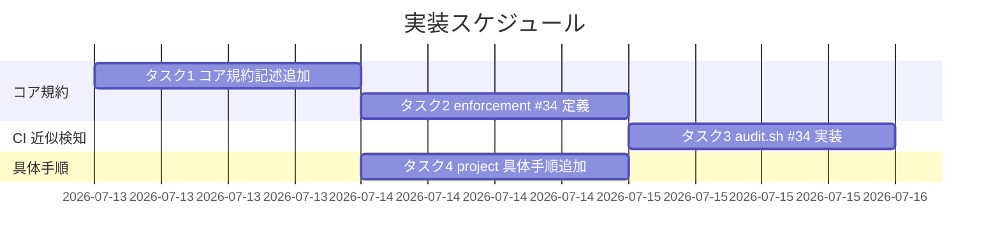

# 実装計画書: review-docs 完了後の GitHub Issue 起票ゲート追加

**プロジェクト名**: review-docs 完了後の GitHub Issue 起票ゲート追加
**作成日**: 2026 年 07 月 12 日
**最終更新**: 2026 年 07 月 13 日

> **重要**: **このドキュメントは常に更新**: 実装計画の変更、進捗状況の更新、バグの記録などがあった場合は、即座にこのドキュメントを更新してください。
> **必須項目**: 「必須」欄は空欄・抽象語のみで提出しない。テスト観点・BDD 仕様は具体ケースを 1 件以上記載する。
>
> **用語**: [.agent-skill-chain/source/CONCEPTS.md §用語規約](../../../../.agent-skill-chain/source/CONCEPTS.md#用語規約) を参照。
>
> **注記**: 本 03 は計画のみ。実装着手前に review-docs（実装前ドキュメントレビュー）を必ず経ること（既存 review-docs ゲート #32 は全 issue 一律・免除なし。本 issue が追加する GitHub Issue 起票ゲートの強度とは別物で、後者は [02\_設計.md](./02_設計.md) ADR-1 のとおり「デフォルト起票＋理由付き代替経路」）。

---

## 1. 実装概要

### 1.1 実装方針（必須）

既存 review-docs 必須ゲート（#32）の 5 点セット（コア Constraints ＋ implement 前提注記＋ PHASES 位置づけ＋ enforcement 失敗条件＋ audit.sh 近似検知）を**構造として**写像し、GitHub Issue 起票ゲートを 1 段追加する（[02\_設計.md](./02_設計.md) ADR-1）。ただし**強度は「デフォルト起票＋理由付き記録による代替経路あり」**であり、review-docs ゲートの「一律・免除なし」とは異なる。ゲート通過は「実 Issue 記録」または「理由付き declined 記録」の二値で、記録なし・理由なし declined は未通過（ADR-1・ADR-7）。抽象原則＝コア、具体手順＝`.agent-skill-chain/project/` の配置境界を越えない（ADR-5）。ただし declined のバリデーション（理由なしは FAIL）はコア audit.sh #34 が担う（ADR-7）。

### 1.2 実装順序（必須: 1 件以上）



- タスク 1（コア規約記述）→ タスク 2（enforcement #34 定義）→ タスク 3（audit.sh #34 実装）の順。タスク 4（project 具体手順）はタスク 1 完了後に並行可。

---

## 2. タスク分解

**必須**: 各タスクに「テスト観点」（2.x.3）と「単体テスト仕様（BDD）」（2.x.4）を記載する。観点の定義は [02\_設計 §6](./02_設計.md) および [RULES のテスト戦略・TEST_BDD_FORMAT](../../../../.agent-skill-chain/source/RULES.md#テスト戦略必須要件) を参照。

### 2.1 タスク 1: コア規約記述の追加（ゲートの存在・位置・強度・分岐・記録の必要性）

#### 2.1.1 概要（必須）

review-docs ゲートの直後・implement 前に「GitHub Issue 起票ゲート（デフォルト起票・トップレベル対象・意図的スキップは理由記録）」を、コアの 3 ファイルへ既存 #32 と同型構造で追記する。強度は「デフォルト起票＋理由付き記録による代替経路あり」。

#### 2.1.2 実装内容（必須: 1 件以上）

- `.agent-skill-chain/source/skills/agent/run_command.md §Constraints` に「実装着手前の GitHub Issue 起票ゲート（デフォルト起票）」を review-docs ゲート項の直後へ 1 項追加（位置＝review-docs 完了後・implement 委譲前、デフォルトは起票、ユーザーへ起票するか確認、既存あり→リンク/無し→新規、起票しない→理由を declined 記録、番号 or 理由付き declined を 00 frontmatter へ記録、対象＝トップレベルのみ、対象外環境は非発火、**プロジェクト全体でのゲート無効化トグル `GITHUB_ISSUE_GATE_ENABLED`（既定 `true`）に言及**、未通過（記録なし・理由なし declined）は #34 で FAIL、具体手順は project 参照）。
- `.agent-skill-chain/source/commands/implement-feature.md §実行時の注意` の「実装着手の前提」に「対応 GitHub Issue の記録（実 Issue 番号 or 理由付き declined）」を追記し #34 を参照。
- `.agent-skill-chain/source/workflow/PHASES.md §レビュー成果物の配置ルール` に、review-docs 完了後・implement 前の必須ゲートとして GitHub Issue 起票ゲートを位置づける注記を追加（review-docs 完了定義は再定義しない）。
- 抽象原則のみ記述し、`gh`/title/body/frontmatter 具体形式（`"#<番号>"`・`"declined: <理由>"`）は project 参照に委ねる（ADR-5）。ただし declined バリデーション（理由なしは FAIL）はコア audit.sh の責務である旨を #34 側に記す。

#### 2.1.3 テスト観点（必須）

##### 単体（本タスクの具体ケース・必須 1 件以上）

- run_command.md に「GitHub Issue 起票ゲート」項が review-docs ゲート項の直後に存在し、「デフォルト起票」「トップレベルのみ」「対象外環境は非発火」「既存あり→リンク/無し→新規」「起票しない→理由を declined 記録」「00 frontmatter へ記録」「`GITHUB_ISSUE_GATE_ENABLED` 無効化トグルへの言及」「#34 参照」の要素を含む（grep + レビュー）。「絶対強制・一律・免除なし」の表現を含まない（review-docs ゲートとの強度差）。
- implement-feature.md §実行時の注意に「対応 GitHub Issue の記録（実 Issue 番号 or 理由付き declined）」を前提とする文と #34 参照がある。
- PHASES.md にゲート位置づけ注記があり、review-docs 完了定義を再定義していない（重複記述なし）。

##### 結合/API（本タスクの具体ケース・該当時は必須 1 件以上）

- 該当なし（規約記述のみ。相互参照リンクの解決検証は §2.1.3 E2E で扱う）。

##### E2E/受け入れ（本タスクの具体ケース・未達時は理由記載）

- 追記した相互参照リンク（#34・PHASES・project）がすべて実在先へ解決する（未解決 0 件を grep で検証）。

##### バリデーション（該当する場合の具体ケース）

- 具体コマンド（`gh issue create` 等）がコア 3 ファイルに混入していないこと（配置境界違反の grep 検査）。

#### 2.1.4 単体テスト仕様（BDD）（必須）

**対応する 01 シナリオ**: UC1 シナリオ 1（新規起票して implement へ）・UC2 シナリオ 1（既存リンク）・UC4 シナリオ 1（PR Closes）の**規約面**。

```gherkin
Feature: GitHub Issue 起票ゲートのコア規約記述
  Scenario: ゲートが review-docs 直後・implement 前の必須項として記述される
    Given run_command.md の §Constraints に review-docs 必須ゲート項がある
    When GitHub Issue 起票ゲート項を追記する
    Then review-docs ゲート項の直後に「デフォルト起票・トップレベルのみ・対象外環境は非発火・既存あり→リンク/無し→新規・起票しない→理由を declined 記録・00 frontmatter へ記録・#34 参照」を含む項が存在する
    And gh の具体コマンドはコアに含まれず project 参照になっている
```

```bash
# Given: コア 3 ファイルを対象にする
# When: grep で追記要素を検査する
# Then: 6 要素すべてが run_command.md に存在し、gh 具体コマンドはコアに無い
grep -q "GitHub Issue 起票ゲート" .agent-skill-chain/source/skills/agent/run_command.md            # 項の存在
grep -q "#34" .agent-skill-chain/source/commands/implement-feature.md                               # 前提注記の #34 参照
! grep -RnE "gh issue create" .agent-skill-chain/source/skills .agent-skill-chain/source/commands .agent-skill-chain/source/workflow  # 配置境界: 具体コマンド混入なし
```

#### 2.1.5 依存関係

- なし（先頭タスク）。タスク 2・3・4 が本タスクを参照する。

#### 2.1.6 見積もり

- **工数**: 2h / **優先度**: 高

### 2.2 タスク 2: enforcement/README.md に失敗条件 #34 を定義

#### 2.2.1 概要（必須）

本ゲート未通過の近似検知失敗条件 #34 を、既存 #32 と非交差の独立番号で、失敗条件表・対応表・差し戻し先に追加する。

#### 2.2.2 実装内容（必須: 1 件以上）

- `enforcement/README.md §失敗条件と差し戻し` の「失敗とみなす条件一覧」に #34「実装前 GitHub Issue 起票ゲート未通過」を追加（説明＝workflow.db 採用・implement ログ 1 件以上・トップレベル・GitHub 採用環境・発効日以降なのに 00 frontmatter の `github_issue` が null/欠落なら FAIL。#32 とは検知対象（review-docs ログ vs github_issue 記録）で非交差。SKIP＝DB 非採用・close/templates・`90_issues/` 配下・grandfather・GitHub 非採用環境）。
- 「失敗条件 → 実装の所在 → 強制レベル 対応表」に #34 行（実装＝audit.sh `check_github_issue_before_implement`／強制レベル＝CI FAIL、各 SKIP 条件付き）を追加。
- 「差し戻し先の固定」表に #34 の差し戻し（起票/リンクして 00 frontmatter へ記録し implement を再実行）を追加。
- `audit.sh が実施する必須チェック` の列挙にも #34 を追記。

#### 2.2.3 テスト観点（必須）

##### 単体（本タスクの具体ケース・必須 1 件以上）

- #34 が失敗条件一覧・対応表・差し戻し先の 3 箇所に一貫した番号・説明で追加されている。
- #34 の説明が #32 と非交差である旨（検知対象が github_issue 記録欠落であること）を明記している。

##### 結合/API（本タスクの具体ケース・該当時は必須 1 件以上）

- 該当なし。

##### E2E/受け入れ（本タスクの具体ケース・未達時は理由記載）

- #34 の SKIP 条件（DB 非採用・close/templates・90_issues・grandfather・GitHub 非採用）が README とタスク 3 の実装で一致している（相互整合レビュー）。

##### バリデーション（該当する場合の具体ケース）

- 番号衝突がないこと（既存の最大番号は #32。直後の #33 は並行する別 issue（close 移動監査強制）が使用中のため、番号の非交差を保つべく本 issue は #34 を採る。#34 は未使用）。

#### 2.2.4 単体テスト仕様（BDD）（必須）

**対応する 01 シナリオ**: UC1 シナリオ 2（ゲート未通過での implement 委譲は禁止／enforcement で FAIL）。

```gherkin
Feature: enforcement 失敗条件 #34 の定義
  Scenario: 未通過を独立番号で FAIL 定義する
    Given enforcement/README.md の失敗条件が #32 まで定義されている（#33 は並行する別 issue が採番済み）
    When GitHub Issue 起票ゲート未通過の失敗条件を追加する
    Then #34 が失敗条件一覧・対応表・差し戻し先の 3 箇所に一貫して存在する
    And #34 の検知対象は github_issue 記録欠落であり #32（review-docs ログ）と非交差である
```

```bash
# Given: enforcement/README.md
# When: #34 の追加を検査
# Then: 3 箇所に #34 があり、非交差の記述を含む
grep -c "#34" .agent-skill-chain/source/enforcement/README.md   # 3 箇所以上
grep -q "非交差" .agent-skill-chain/source/enforcement/README.md # #32 との非交差記述
```

#### 2.2.5 依存関係

- タスク 1（規約記述の #34 参照先を実体化する）。

#### 2.2.6 見積もり

- **工数**: 1.5h / **優先度**: 高

### 2.3 タスク 3: audit.sh に `check_github_issue_before_implement`（#34）を実装

#### 2.3.1 概要（必須）

workflow.db 採用・GitHub 採用環境で「トップレベル issue に implement-feature ログが 1 件以上あるのに 00 frontmatter の `github_issue` が有効な記録でない（null/空/`~`、または理由なしの declined）」を近似検知して FAIL する関数を、既存 `check_reviewdocs_before_implement`（#32）を実装モデルに追加する。実 Issue 参照または理由付き declined なら PASS（ADR-7）。**関数冒頭にプロジェクト全体でのゲート無効化トグル `GITHUB_ISSUE_GATE_ENABLED`（既定 `true`）のガードを最優先で置き、無効化時は他のどの判定よりも先に SKIP する（ADR-8）。**

#### 2.3.2 実装内容（必須: 1 件以上）

- `enforcement/ci/audit.sh` に `check_github_issue_before_implement()` を追加し、末尾の呼び出し列（`check_reviewdocs_before_implement` の後）に追加する。
- **0番目のガード（最優先・ADR-8）**: 関数の最初の行で `GITHUB_ISSUE_GATE_ENABLED`（既定 `true`）を評価し、値が `false`/`0`/`no`/`off`（大小文字非区別）なら即 `return 0`（SKIP）。この判定は sqlite3/DB 存在確認より前に置き、他のどのガード（DB 採用・GitHub 採用環境・grandfather・サブ issue 集約・declined 判定）よりも先に評価する。
- SKIP 条件: sqlite3/DB/workflow_log 不在（return 0）／`git remote -v` に github.com を含まない（return 0・fail-open）／走査ファイルパスに `/templates/`・`/close/`・`/90_issues/` を含む（continue）／basename の `YYYYMMDD_HHMMSS_` プレフィックスが `GITHUB_ISSUE_GATE_EFFECTIVE_FROM`（既定 `20260712_000000`・env 上書き可）未満（continue・grandfather）。
- 走査対象は `00_要求定義.md`（frontmatter を読む目印。#32 の 03_実装計画.md 走査と同型・unbounded find・maxdepth を付けない）。
- 判定: implement-feature ログが 1 件以上（issue_path 前方一致＋basename 末尾一致・#32 と同型）かつ 00 frontmatter の `github_issue` が「有効な記録でない」なら `EXIT_CODE=1` で FAIL。「有効な記録でない」＝(i) 空/`null`/`~`、または (ii) `declined:` で始まるが後続の理由が空/空白のみ（ADR-7）。それ以外（実 Issue 参照 or 理由付き declined）は PASS。
- frontmatter 読み取りは frontmatter ブロック（先頭 `---`〜`---`）内の `github_issue:` 行を抽出し、値の前後空白・囲みクオートを除去する（コメント行 `#` は除外）。値が空/`null`/`~` なら未記録。値が `declined:` で始まる場合は後続文字列を前後空白トリムし、長さ 0 なら未通過（理由なし declined＝空虚バイパス防止）。

#### 2.3.3 テスト観点（必須）

**参照**: 観点定義は [02\_設計 §6](./02_設計.md)。以下は本タスクの具体ケース。

##### 単体（本タスクの具体ケース・必須 1 件以上）

- 一時 DB に implement-feature ログ 1 件＋00 frontmatter `github_issue: null` の issue → FAIL（EXIT_CODE=1）。
- 一時 DB に implement-feature ログ 1 件＋`github_issue: "#123"`（実 Issue 参照）の issue → PASS。
- 一時 DB に implement-feature ログ 1 件＋`github_issue: "declined: 設定値の軽微な修正で追跡不要"`（理由付き declined）の issue → PASS。
- 一時 DB に implement-feature ログ 1 件＋`github_issue: "declined:"`（理由なし declined）または `"declined:   "`（空白のみ）の issue → FAIL（空虚バイパス防止）。
- implement-feature ログ 0 件 → SKIP（#29 の領域であり #34 は非干渉）。
- `GITHUB_ISSUE_GATE_ENABLED=false` を設定した状態で、implement-feature ログ 1 件＋`github_issue: null`（本来なら FAIL するはずの状態）の issue → SKIP（無効化トグルが最優先で発火・ADR-8）。
- `GITHUB_ISSUE_GATE_ENABLED` を未設定（既定）または `true` にした場合は、上記の FAIL/PASS 判定が従来どおり機能する（回帰なし）。

##### 結合/API（本タスクの具体ケース・該当時は必須 1 件以上）

- audit.sh 全体実行時に #34 が既存チェック（#29/#32 等）と共存し、他チェックの結果を壊さない（回帰）。

##### E2E/受け入れ（本タスクの具体ケース・未達時は理由記載）

- `git remote` を github.com 無しにした一時ツリー → #34 は SKIP（対象外環境フォールバック）。
- `/90_issues/` 配下の issue（`github_issue` 欠落・implement ログ有）→ #34 は FAIL しない（SKIP）。
- basename プレフィックスが `GITHUB_ISSUE_GATE_EFFECTIVE_FROM` 未満の issue → SKIP（grandfather）。

##### バリデーション（該当する場合の具体ケース）

- frontmatter が規約外命名の issue はプレフィックス判定不能として素通り（誤 FAIL を出さない・安全側）。
- 検証は `mktemp -d` ＋ 一時 DB で隔離実行し、本リポの `workflow.db`・本番 issue を変更しない（[.agent-skill-chain/project/自己拡張ワークフロー.md §テストの tmp 隔離](../../../../.agent-skill-chain/project/自己拡張ワークフロー.md)）。

#### 2.3.4 単体テスト仕様（BDD）（必須）

**対応する 01 シナリオ**: UC1 シナリオ 2（未起票で FAIL）・UC3 シナリオ 1（サブ issue SKIP）・UC3 シナリオ 2（GitHub 非採用 SKIP）・UC3 シナリオ 3/4（無効化トグル ON/OFF）。

```gherkin
Feature: audit.sh #34 GitHub Issue 起票ゲート近似検知
  Scenario: 起票番号未記録で FAIL する
    Given workflow.db にトップレベル issue の implement-feature ログが 1 件ある
    And その issue の 00_要求定義.md frontmatter の github_issue が null である
    And git remote に github.com が含まれる
    When audit.sh の check_github_issue_before_implement を実行する
    Then FAIL（EXIT_CODE=1）となり差し戻しメッセージを出力する

  Scenario: プロジェクト全体でゲートを無効化している場合は最優先で SKIP する
    Given workflow.db にトップレベル issue の implement-feature ログが 1 件ある
    And その issue の 00_要求定義.md frontmatter の github_issue が null である（本来なら FAIL するはずの状態）
    And 環境変数 GITHUB_ISSUE_GATE_ENABLED が false である
    When check_github_issue_before_implement を実行する
    Then 他のどの判定よりも先に SKIP（return 0）となり FAIL しない

  Scenario: 無効化トグルが既定（未設定）の場合は従来どおり動作する
    Given workflow.db にトップレベル issue の implement-feature ログが 1 件ある
    And その issue の 00_要求定義.md frontmatter の github_issue が null である
    And 環境変数 GITHUB_ISSUE_GATE_ENABLED が未設定である
    When check_github_issue_before_implement を実行する
    Then FAIL（EXIT_CODE=1）となる（回帰なし）

  Scenario: 理由付き declined は通過する（PASS）
    Given トップレベル issue に implement-feature ログが 1 件ある
    And github_issue が "declined: <非空の理由>" である
    When check_github_issue_before_implement を実行する
    Then FAIL しない（起票しない決定が理由付きで記録されている）

  Scenario: 理由なしの declined は弾かれる（FAIL）
    Given トップレベル issue に implement-feature ログが 1 件ある
    And github_issue が "declined:"（理由なし）または空白のみの理由である
    When check_github_issue_before_implement を実行する
    Then FAIL（EXIT_CODE=1）となる（空虚なバイパスを防ぐ）

  Scenario: サブ issue はゲート対象外
    Given 90_issues 配下のサブ issue に implement-feature ログがあり github_issue が欠落している
    When check_github_issue_before_implement を実行する
    Then 当該サブ issue では FAIL しない（SKIP）

  Scenario: GitHub 非採用環境では発火しない
    Given git remote に github.com が含まれない
    When check_github_issue_before_implement を実行する
    Then SKIP（return 0）となり FAIL しない
```

```bash
# Given: mktemp 隔離ツリーに一時 DB と 00_要求定義.md を用意（github_issue: null・implement ログ 1 件）
# When: audit.sh を隔離ツリーで実行
# Then: EXIT_CODE=1（FAIL）を確認。github_issue に番号を入れると PASS になることも確認
tmp=$(mktemp -d); trap 'rm -rf "$tmp"' EXIT
# ... 一時 issue ツリー・workflow.db を構築（implement-feature ログ INSERT）...
# Then: 未記録で FAIL
( cd "$tmp" && bash audit.sh . ); [ $? -ne 0 ] || echo "expected FAIL"
```

#### 2.3.5 依存関係

- タスク 2（#34 の失敗条件定義と SKIP 条件を README と一致させる）。

#### 2.3.6 見積もり

- **工数**: 4h / **優先度**: 高

### 2.4 タスク 4: `.agent-skill-chain/project/自己拡張ワークフロー.md` に具体手順を追加

#### 2.4.1 概要（必須）

コアが抽象で委ねた具体手順（起票要否のユーザー確認・既存 Issue 判定・`gh` コマンド・title/body・frontmatter キー/値形式・declined 記録形式・PR トレーラ・GitHub 採用/到達性判定・API 障害時運用・無効化トグルの運用）を project 固有ファイルへ追加する。

#### 2.4.2 実装内容（必須: 1 件以上）

- 起票要否のユーザー確認手順（既存が無い場合、デフォルトは起票。ユーザーへ起票するかを確認し、起票不要と判断された場合は declined 記録へ分岐する）。
- 既存 Issue 有無の具体判定手順（第一＝00 frontmatter `github_issue`、null 時＝`gh issue list` 照合 or ユーザー確認）。
- 新規起票コマンド（`gh issue create` の title/body の具体形式）と、取得番号の 00 frontmatter `github_issue` への記録形式（`"#<番号>"` の確定）。
- 起票しない決定の理由記録手順（`github_issue` へ `"declined: <理由>"` 形式で記録。理由は非空で issue 化不要と判断した根拠を書く。空虚な declined は audit #34 が弾く旨を明記）。
- PR 本文への `Closes #<番号>` 埋め込み手順（起票した場合のみ・CLOSEOUT の具体値・PR トレーラ）。
- GitHub 採用/到達性の具体判定（`gh` 可用性・認証・`git remote`）と、対象外環境での非発火。
- API 一時障害・認証失効時のリトライ回数・エスカレーション手順（対象外環境と区別。ロックアウトも黙認通過もしない）。**この障害時運用は [02\_設計.md](./02_設計.md) ADR-4 で inference_only を含むため、実装時にユーザー確認（要人間確認）を行う。**
- **プロジェクト全体でのゲート無効化トグル（`GITHUB_ISSUE_GATE_ENABLED`）の使い方**を追記する: 既定 `true`（有効）・`false`/`0`/`no`/`off` で無効化・既存 `enforce on/off` とは独立した本ゲート単体のトグルである旨・**本リポジトリでは有効のままにする**旨（本リポジトリは GitHub Issue 運用を採用しているため）（ADR-8）。

#### 2.4.3 テスト観点（必須）

##### 単体（本タスクの具体ケース・必須 1 件以上）

- project ファイルに「起票要否のユーザー確認」「既存あり→リンク／無し→新規」の具体判定と `gh issue create`・`github_issue` 記録形式（`"#<番号>"`）・declined 記録形式（`"declined: <理由>"`）・`Closes #<番号>`・**無効化トグル `GITHUB_ISSUE_GATE_ENABLED` の使い方（本リポジトリでは有効のままにする旨を含む）**の各手順が記載されている。
- トークン実値を記載例・手順に残さない（セキュリティ・01 §3.2）。

##### 結合/API（本タスクの具体ケース・該当時は必須 1 件以上）

- コア（抽象）と project（具体）の記述が矛盾しない（配置境界レビュー：コアに具体なし・project に抽象の再定義なし）。

##### E2E/受け入れ（本タスクの具体ケース・未達時は理由記載）

- 具体手順に沿って（隔離環境で）既存 Issue リンク／新規起票／frontmatter 記録／PR Closes までの一連が説明として成立する（手順の実行可能性レビュー。実 GitHub への書き込みは高リスク操作のためユーザー確認後のみ）。

##### バリデーション（該当する場合の具体ケース）

- API 障害時運用がリトライ→エスカレーションで、ロックアウト・黙認通過のいずれにもならない記述である。

#### 2.4.4 単体テスト仕様（BDD）（必須）

**対応する 01 シナリオ**: UC2 シナリオ 1（既存リンク）・UC4 シナリオ 1（PR Closes 自動クローズ）・UC3 シナリオ 2（対象外環境判定の具体）・UC3 シナリオ 3（無効化トグルの具体運用）。

```gherkin
Feature: project 具体手順（GitHub Issue 起票ゲート）
  Scenario: 既存 Issue があればリンクし新規起票しない
    Given 00 frontmatter に github_issue の参照がある
    When project 手順で既存有無を判定する
    Then 新規起票せず既存番号を記録する手順が示される

  Scenario: 起票不要と判断したら理由を declined 記録する
    Given 既存 Issue が無く、ユーザーが起票不要と判断する
    When project 手順に従う
    Then github_issue へ "declined: <理由>" を記録する手順が示され、理由なしは audit #34 で弾かれる旨が明記される

  Scenario: PR 本文に Closes を埋め込む
    Given 対応 Issue 番号が frontmatter に記録されている（起票した場合）
    When PR を作成する手順に従う
    Then PR 本文に Closes #<番号> を含める具体手順が示される

  Scenario: プロジェクト全体でゲートを無効化する運用が示される
    Given GitHub は使うが Issue 運用自体を使わないプロジェクトである
    When project 手順で無効化トグルの節を確認する
    Then GITHUB_ISSUE_GATE_ENABLED=false の設定方法と、本リポジトリでは有効のままにする旨が示される
```

```markdown
<!-- Given: project ファイルの GitHub Issue 起票ゲート具体手順節 -->
<!-- When: 既存判定・起票・記録・PR Closes・無効化トグルの手順を確認 -->
<!-- Then: 各手順が記載され、gh のトークン実値は例示に含まれない -->
```

#### 2.4.5 依存関係

- タスク 1（コアの project 参照先を実体化する）。

#### 2.4.6 見積もり

- **工数**: 2.5h / **優先度**: 中

---

## テスト観点

本実装計画全体のテスト観点は、01 の 6 ユーザーストーリー／4 ユースケースを (a) コア規約記述の存在確認（タスク 1・2・4 のレビュー/grep）と (b) `audit.sh #34` の shell 関数テスト（タスク 3）へ写像する。ドキュメント/CI 変更が主のため、コードテスト不可の対象は監査（verify-and-close）＋リンク解決検証で担保する（[02\_設計 §6](./02_設計.md)）。

### 01 BDD シナリオ ↔ テスト観点 対応表

| 01 シナリオ | 対応タスク | テスト観点の所在 |
| ----------- | ---------- | ---------------- |
| UC1-S1 既存無し→新規起票して implement へ | T1（規約）・T3（記録済で PASS）・T4（起票具体） | §2.1.4・§2.3.4・§2.4.4 |
| UC1-S2 ゲート未通過（記録なし・理由なし declined）での implement 委譲禁止 | T2（#34 定義）・T3（未記録・理由なし declined で FAIL） | §2.2.4・§2.3.4 |
| UC1-S3 起票不要と判断し理由付き declined で通過 | T1（規約の declined 分岐）・T3（理由付き declined で PASS/理由なしで FAIL）・T4（declined 記録具体） | §2.1.4・§2.3.4・§2.4.4 |
| UC2-S1 既存有り→リンクのみ | T1（分岐規約）・T4（判定具体） | §2.1.4・§2.4.4 |
| UC3-S1 サブ issue はゲート適用外 | T3（90_issues SKIP） | §2.3.4 |
| UC3-S2 GitHub 非採用環境は非発火 | T3（github 非採用 SKIP）・T4（runtime 判定） | §2.3.4・§2.4.4 |
| UC3-S3 プロジェクト全体の無効化トグルで非発火 | T1（規約の無効化トグル言及）・T3（`GITHUB_ISSUE_GATE_ENABLED=false` で最優先 SKIP）・T4（無効化トグルの運用具体） | §2.1.4・§2.3.4・§2.4.4 |
| UC3-S4 無効化トグル既定（未設定）は従来どおり | T3（未設定/true で従来どおり FAIL・回帰なし） | §2.3.4 |
| UC4-S1 PR Closes で自動クローズ | T1（規約）・T4（PR トレーラ具体） | §2.1.4・§2.4.4 |

---

## 単体テスト

`audit.sh #34` を対象に、一時 DB＋一時 issue ツリー（`mktemp -d` 隔離）で「未記録→FAIL／実 Issue 記録済→PASS／理由付き declined→PASS／理由なし declined→FAIL／implement 0 件→SKIP／90_issues→SKIP／github 非採用→SKIP／grandfather→SKIP／`GITHUB_ISSUE_GATE_ENABLED=false`→SKIP（最優先）／同未設定or`true`→従来どおり」を検証する。本リポの `workflow.db`・本番 issue は変更しない（tmp 隔離必須）。コア規約記述は grep + レビューで存在・非交差・配置境界を検証する。

---

## BDD

各タスクの §2.x.4 に Given/When/Then を記載（[TEST_BDD_FORMAT.md](../../../../.agent-skill-chain/source/TEST_BDD_FORMAT.md) 準拠）。01 の 4 ユースケース／6 シナリオとの対応は上記「01 BDD シナリオ ↔ テスト観点 対応表」で網羅する。

---

## 3. 実装スケジュール

### 3.1 マイルストーン

| マイルストーン | 期日 | 成果物 |
| -------------- | ---- | ------ |
| M1 コア規約・失敗条件定義 | T1・T2 完了 | run_command/implement-feature/PHASES/enforcement README の #34 追記 |
| M2 CI 近似検知 | T3 完了 | audit.sh `check_github_issue_before_implement` |
| M3 具体手順 | T4 完了 | project 自己拡張ワークフロー.md の具体手順節 |

### 3.2 実装フェーズ

#### フェーズ 1: コア＋CI

- **タスク**: T1 → T2 → T3

#### フェーズ 2: 具体手順

- **タスク**: T4（T1 後に並行可）

---

## 4. テスト計画

テスト観点・レベル・BDD 形式の定義は [02\_設計 §6](./02_設計.md) および RULES のテスト戦略・TEST_BDD_FORMAT を参照。各タスク §2.x.3 に具体ケース、§2.x.4 に BDD 仕様を記載済み。

### 4.1 テストの優先順位

- クリティカル: `audit.sh #34`（誤 FAIL/誤 SKIP はワークフローを止める/ゲートを骨抜きにするため厚くテスト）。
- 回帰: audit.sh 全体実行で既存 #29/#32 等と共存することを必ず確認。

---

## 5. リスク管理

### 5.1 実装リスク

- **リスク**: #34 の SKIP 条件不足で GitHub 非採用消費者を誤ロックアウトする（過去の enforce on ロックアウト事例と同種）。
  - **対策**: `git remote` に github.com が無い場合は必ず SKIP（fail-open）。DB 非採用・close/templates・90_issues・grandfather も SKIP。隔離テストで SKIP を実証（§2.3.4）。
- **リスク**: 既存 Issue 判定の誤りで重複起票/無起票（01 §7.1）。
  - **対策**: 単一情報源（00 frontmatter `github_issue`）優先。曖昧時のみフォールバック（照合/確認）。自動推測に依存しない（ADR-2）。
- **リスク**: 配置境界違反（`gh` 具体コマンドがコアへ混入）。
  - **対策**: T1 のバリデーション grep で混入 0 を検査（§2.1.3）。
- **リスク**: API 障害時運用が inference_only を含む（ADR-4）。
  - **対策**: T4 実装時にユーザー確認（要人間確認）を必須とする。
- **リスク**: プロジェクト全体でのゲート無効化トグル（`GITHUB_ISSUE_GATE_ENABLED`）が既存の `enforce on/off` と混同され、GitHub Issue ゲート以外のチェック（#29・#32 等）まで意図せず無効化される。
  - **対策**: 無効化トグルは本ゲート単体（#34）に閉じた専用 env とし、`enforce on/off` の実装・判定ロジックとは完全に独立させる（他のチェック関数を変更しない）。コア文書（run_command.md・enforcement/README.md）に両者の違いを明記する（ADR-8）。

---

## 6. 参考資料

### プロジェクトドキュメント

- [`02_設計.md`](./02_設計.md) - 設計（ADR-1〜8・#34 設計）
- [`01_要件定義.md`](./01_要件定義.md) - 要件定義（BDD シナリオ）
- [`.agent-skill-chain/source/enforcement/ci/audit.sh`](../../../../.agent-skill-chain/source/enforcement/ci/audit.sh) - `check_reviewdocs_before_implement`（#32 実装モデル）
- [`.agent-skill-chain/project/自己拡張ワークフロー.md`](../../../../.agent-skill-chain/project/自己拡張ワークフロー.md) - 具体手順の配置先・tmp 隔離テスト規約

### その他の参考資料

- GitHub の PR 本文キーワード（`Closes #N`）によるマージ時 Issue 自動クローズ仕様（GitHub 公式）。

---

## 7. 前のステップ

この実装計画書は、以下のドキュメントを基に作成されています：

- **前**: [`02_設計.md`](./02_設計.md) - 設計フェーズ

---

## 8. 次のステップ

この実装計画書の承認後、以下のステップに進みます：

- **本 issue は 1 つの issue（サブ分割なし）** のため、90_issues.md は作成しない。
- **次（必須ゲート）**: 実装着手前に review-docs（実装前ドキュメントレビュー）を経てから implement-feature に進む（既存 review-docs ゲート #32 は全 issue 一律・免除なし）。加えて本 issue が追加する GitHub Issue 起票ゲート（[02\_設計.md](./02_設計.md) ADR-1・デフォルト起票＋理由付き代替経路）にも従う。

**用語**: [.agent-skill-chain/source/CONCEPTS.md §用語規約](../../../../.agent-skill-chain/source/CONCEPTS.md#用語規約) を参照。
