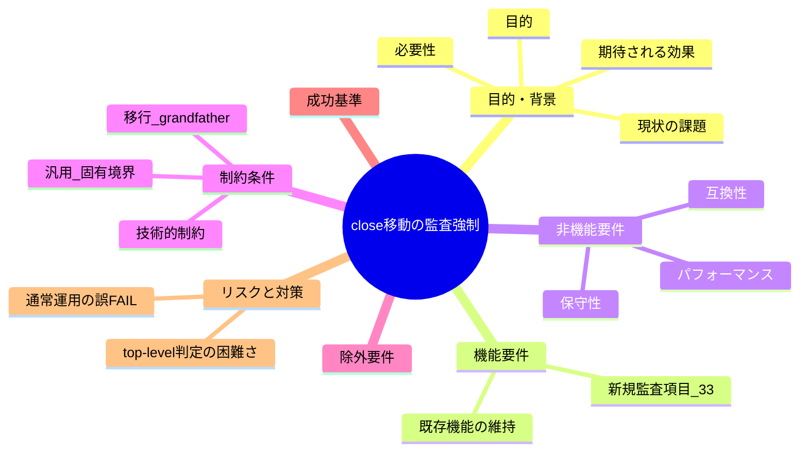
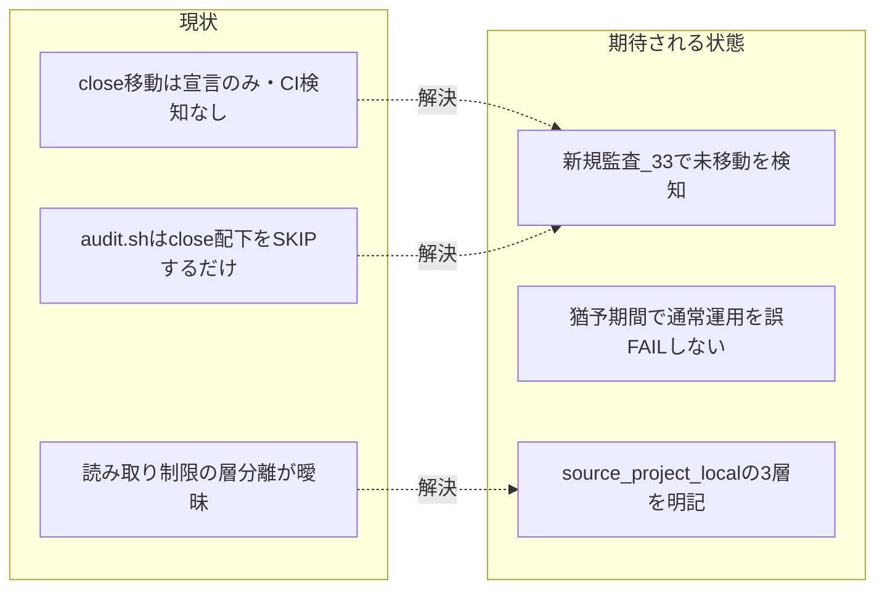

# 要求定義書: close 移動の監査強制と制約分離明記

**プロジェクト名**: close 移動の監査強制（audit.sh enforcement）と消費者/ドッグフーディング制約の分離明記
**作成日**: 2026 年 07 月 12 日
**最終更新**: 2026 年 07 月 12 日

> **重要**:
>
> - 本ドキュメントは全体像の把握用。詳細仕様・実装方法は 01 以降で扱う。
> - 要求の変更・追加時は即座に本ドキュメントを更新する（生きているドキュメント）。
>
> **用語**: [.agent-skill-chain/source/CONCEPTS.md §用語規約](../../../.agent-skill-chain/source/CONCEPTS.md#用語規約) を参照。

---

## 要求定義の全体像

**注意**: マインドマップは全体像の把握用。詳細は各節を参照。

---

## 1. 目的・背景

### 1.1 目的（必須）

verify-and-close 完了 issue が close/ へ移動されないことを audit.sh で検知可能にする。

### 1.2 背景

- **現状の課題**:
  - 完了したトップレベル issue を `close/` へ移動する規約は [boot/CORE.md §完了 issue の close 分離](../../../.agent-skill-chain/source/boot/CORE.md)・[workflow/PHASES.md §完了 issue の close 移動](../../../.agent-skill-chain/source/workflow/PHASES.md) に**宣言**されているが、実効的な CI 強制（検知）が皆無である。
  - `enforcement/ci/audit.sh` を調査した結果、`close/` 配下は各種監査（#2b 90_issues 必須・#3 04_review 必須・#7 TODO 残存・#9 証跡対応・#17 verify 親検査・#20 document_id・#29 実装前 04・#31 システム仕様書レビュー・#32 実装前 review-docs）の**対象外（SKIP）として除外されているだけ**であり、逆方向、すなわち「verify-and-close 完了（04_review 作成 ＋ workflow.db 証跡記録）が揃っているのに、当該 issue が `close/` 配下へ移動されていない」ことを検知する監査項目が**一切存在しない**（audit.sh 全 940 行を確認。close の出現箇所はすべて SKIP ガード）。
  - 結果として、close 移動は「すべき」と宣言されるだけの努力目標であり、忘れても CI をすり抜ける。
  - 加えて、フレームワーク側の制約（配布物）と本リポジトリのローカル開発環境固有の設定（`.claude/settings.json` の `close/` 配下 Read/Grep/Glob deny 等）が、運用ドキュメント上で明確に層分離されておらず、誤って「フレームワーク利用者全員が同じ読み取り制限に遭遇する」と一般化される懸念がある。

- **必要性**:
  - 宣言された規約に実効性（CI 検知）を与え、close 分離の一貫性を保つ。
  - 消費者（`.agent-skill-chain/source/` を使う全利用者）向けの汎用原則・汎用監査ロジックと、本リポジトリのドッグフーディング開発者向けの具体閾値・具体パス・ローカル運用上の注意を、既存の「汎用/固有境界」パターンに沿って正しく 2 層へ分離する。

### 1.3 期待される効果（必須: 1 件以上）

- **効果 1**: verify-and-close 完了かつ close/ 未移動の issue を audit.sh が検知できる（新規監査項目 #33 の追加により、当該状態で FAIL または WARN が出力される、で ○/× 判定可能）。
- **効果 2**: 通常運用（verify-and-close と close 移動が別コミット/別 PR で行われる正常ケース）を誤 FAIL しない（猶予期間内の未移動が FAIL しない、で ○/× 判定可能）。
- **効果 3**: 消費者向け原則（source 側）とドッグフーディング向け具体（project 側）が別ファイルに分離記載され、`.claude/settings.json` 由来の読み取り制限が「本リポジトリのローカル環境固有」であることが誤解なく明記される（各記載の有無で ○/× 判定可能）。

**現状と期待される状態の比較**:

---

## 2. 機能要件

### 2.1 既存機能の維持（該当する場合）

- 既存の audit.sh 監査項目（#1〜#32）はそのまま維持する。`close/` 配下を SKIP する既存ガード（#2b/#3/#7/#9/#17/#20/#29/#31/#32）は改変せず、非交差の新規番号（例: #33）を追加する。
- close 移動のトリガー・完了定義（CORE / PHASES 宣言）自体は変更しない。本 issue は「検知（enforcement）」と「制約の層分離明記」を追加するのみ。

### 2.2 新規機能要件

1. **新規監査項目 #33（close 移動未実施検知）**: workflow.db に当該 issue（issue_path）の verify-and-close 証跡が存在するにもかかわらず、当該 issue ディレクトリが `close/` 配下に存在しない場合を検知する。既存 #32 の grandfather 機構（issue ディレクトリ名 `YYYYMMDD_HHMMSS_` プレフィックスと `*_EFFECTIVE_FROM` 発効日 env の比較）を踏襲し、発効日前の issue は遡及適用しない。判定の強度（即 FAIL / 猶予付き FAIL / WARN）と閾値は §4・01 で確定する。
2. **消費者向け原則（source 側）**: 「verify-and-close 完了 issue は妥当な期間内に close/ へ移動されるべきであり、CI で検知可能にする」旨を汎用原則として明記し、汎用監査ロジックの骨格（発効日・猶予を env で受ける）を audit.sh に置く。具体の猶予閾値・具体パスはコアに書かず `.agent-skill-chain/project/` へ委ねる。
3. **ドッグフーディング向け具体（project 側）**: 本リポジトリの具体パス（`docs/maintainer/workflow/close/<issue>/`）・具体閾値を記載する。加えて、close 移動時の読み取り制限（ローカル環境の deny rule 等）が起こりうる**開発運用上の注意**として「移動前検証」の原則を、別対応（後述の chore/close-completed-issues）と**重複させず参照リンクで接続**する形で明記する。

---

## 3. 非機能要件

### 3.1 パフォーマンス

- 新規監査は既存 #29/#32 と同型の unbounded `find` ＋ sqlite3 クエリで実装し、監査全体の実行時間に体感差が出ない範囲に収める。

### 3.2 セキュリティ

- 該当なし（ローカル/CI 監査スクリプトの拡張のみ。外部通信・機密情報の取り扱いなし）。

### 3.3 互換性

- sqlite3 不在・workflow.db 非採用の環境では既存項目と同様に SKIP（fail-open）し、既存の消費者ランタイムを壊さない。
- 既存の失敗条件番号・対応表（enforcement/README.md）と番号衝突しない新規番号を採る。

### 3.4 保守性

- 1 ファイル 1 責務・重複禁止（spec/06 の優先順位に従う）。宣言は CORE、ライフサイクルは PHASES、具体は project、検知は audit.sh、と責務境界を維持する。

---

## 4. 制約条件

### 4.1 技術的制約

- 判定は workflow.db の verify-and-close 証跡の有無 ＋ ディレクトリの `close/` 配下在籍の有無で行う。厳密な時刻順序は監査しない（#32 と同型の存在監査）。
- **タイミングの課題（要確定）**: verify-and-close 完了と実際の close 移動は別々の PR/コミットで行われることが正常運用でありうる（本セッションの実例そのもの）。即 FAIL は通常運用を阻害するため採らない。**猶予期間（発効日 env、または一定コミット数・日数の猶予）付きの検知**とし、猶予超過後に FAIL（WARN 代替の可否は 01・設計で確定）。grandfather 発効日を設け、発効日前 issue は遡及適用しない。
- **top-level 判定の困難さ（設計で詰める重要論点）**: close 移動はトップレベル issue 完了時のみで、サブ issue 単独完了では移動しない（CORE/PHASES 規約）。CI がトップレベル完了を完全機械判定するのは困難なため、機械判定可能な近似（例: `90_issues/` 配下のサブ issue は検知対象外とし、ワークフロールート直下の issue のみ対象）を設計で確定する。

### 4.2 既存システムとの互換性

- 既存 #32 の `REVIEWDOCS_GATE_EFFECTIVE_FROM` と同型の env（例: `CLOSE_MOVE_GATE_EFFECTIVE_FROM`・命名は設計で確定）で発効日・猶予を受ける。DB 非採用・close/templates 配下・プレフィックス非準拠命名は SKIP（安全側）。

### 4.3 移行期間・スケジュール

- grandfather 発効日により既存の未移動 issue を一斉 FAIL させない。発効日既定値は設計で確定（#32 の `20260712_000000` を参考）。

---

## 5. 除外要件

- **GitHub Issue 起票ゲート追加**（別 issue `docs/maintainer/workflow/20260712_175901_GitHubIssue起票ゲート追加`・ブランチ `docs/github-issue-gate`）は対象外。参照リンクのみで接続する。
- **close 移動手順そのものの「移動前検証」化**（別ブランチ `chore/close-completed-issues`・コミット `af90d4e`「close 移動手順を移動前検証方式へ修正し完了済み 4issue を close 移動」で対応済み・**未マージ**）は対象外。本 issue では重複させず参照で接続する（§背景・申し送り参照）。
- close 移動の自動実行（CI が自動で `git mv` する等）は対象外。本 issue は**検知**までに留める。

---

## 6. 成功基準（必須: 1 件以上）

- **基準 1**: audit.sh に新規監査項目（#33 相当・既存 #32 と非交差の新番号）が追加され、「verify-and-close 証跡あり ＋ close/ 未移動 ＋ 猶予/発効日条件成立」で FAIL（または WARN）を出力する（テストで再現できる）。
- **基準 2**: 猶予期間内・発効日前・DB 非採用・close 配下・templates 配下・プレフィックス非準拠命名では検知しない（誤 FAIL しない）ことがテストで確認できる。
- **基準 3**: source 側に汎用原則、project 側に具体閾値・具体パスがそれぞれ記載され、`.claude/settings.json` 由来の読み取り制限が「本リポジトリのローカル環境固有（gitignore 対象・配布物非含有）」である旨が明記される。
- **基準 4**: enforcement/README.md の失敗条件一覧・対応表に新規番号の行が追加され、既存番号と衝突しない。

---

## 7. リスクと対策

### 7.1 技術的リスク

- **リスク**: 即 FAIL 化により、verify-and-close 直後・close 移動前の正常な中間状態を誤 FAIL する。
  - **対策**: 猶予期間 ＋ grandfather 発効日を必須とする（§4.1）。閾値はコアに書かず project に委ねる。
- **リスク**: top-level 完了の機械判定が不正確で、サブ issue 単独完了を誤検知する。
  - **対策**: 検知対象を機械判定可能な近似（ワークフロールート直下 issue のみ・`90_issues/` 配下除外）に限定する方針を設計で確定する。

### 7.2 スケジュールリスク

- **リスク**: `chore/close-completed-issues`（移動前検証化・未マージ）と本 issue の実装が同じ PHASES.md/project override を編集し、マージ順序でコンフリクトする。
  - **対策**: 本 issue は close 移動手順本文を編集せず、参照リンクで接続する設計とする。実装着手時に当該ブランチのマージ状況を確認する旨を申し送る。

---

## 8. 参考資料

### プロジェクトドキュメント

- [boot/CORE.md §完了 issue の close 分離](../../../.agent-skill-chain/source/boot/CORE.md)
- [workflow/PHASES.md §完了 issue の close 移動](../../../.agent-skill-chain/source/workflow/PHASES.md)
- [.agent-skill-chain/project/自己拡張ワークフロー.md §完了 issue の close 移動・§close 移動時の相対リンク補正](../../../.agent-skill-chain/project/自己拡張ワークフロー.md)
- [enforcement/ci/audit.sh](../../../.agent-skill-chain/source/enforcement/ci/audit.sh)（#29/#32 実装・grandfather 機構）
- [enforcement/README.md §失敗条件と差し戻し](../../../.agent-skill-chain/source/enforcement/README.md)
- [spec/06_設計判断の優先順位.md](../../../.agent-skill-chain/source/spec/06_設計判断の優先順位.md)

### その他の参考資料

- 別 issue（除外・参照のみ）: `docs/maintainer/workflow/20260712_175901_GitHubIssue起票ゲート追加`（ブランチ `docs/github-issue-gate`）
- 別ブランチ（除外・参照のみ）: `chore/close-completed-issues`（コミット `af90d4e`・close 移動の移動前検証化・**未マージ**）

---

## 9. 次のステップ

この要求定義書の承認後、以下を作成します：

- **次**: [`01_要件定義.md`](./01_要件定義.md) - 要件定義フェーズ
