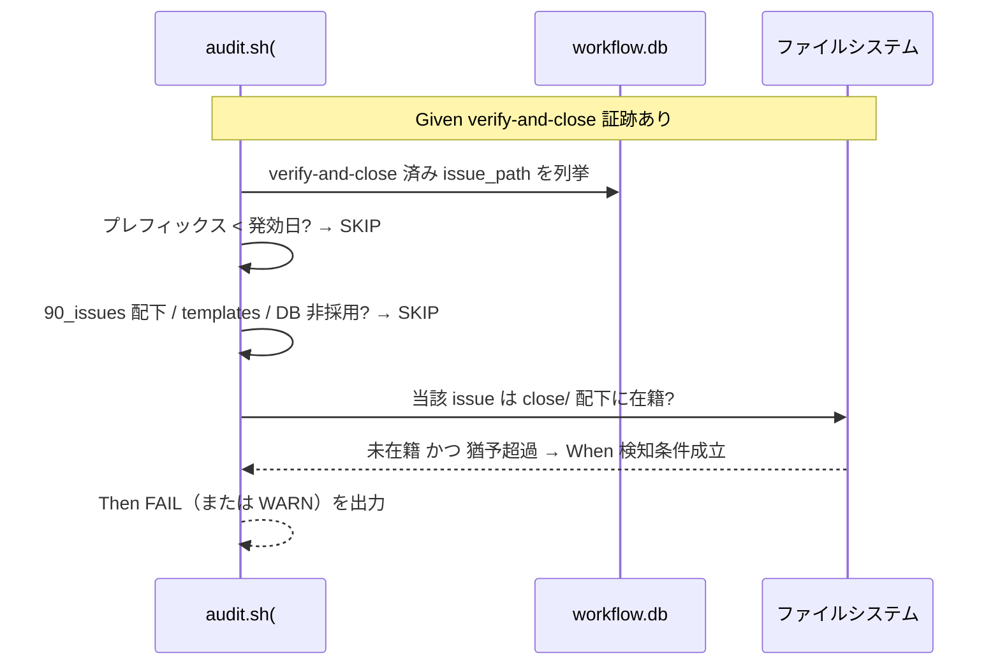

# 要件定義書: close 移動の監査強制と制約分離明記

**プロジェクト名**: close 移動の監査強制（audit.sh enforcement）と消費者/ドッグフーディング制約の分離明記
**作成日**: 2026 年 07 月 12 日
**最終更新**: 2026 年 07 月 13 日

> **重要**: 本ドキュメントは常に更新（生きているドキュメント）。要件の変更・追加時は即座に更新する。
>
> **用語**: [.agent-skill-chain/source/CONCEPTS.md §用語規約](../../../.agent-skill-chain/source/CONCEPTS.md#用語規約) を参照。

---

## 1. 概要

### 1.1 システム概要

`enforcement/ci/audit.sh` に、「verify-and-close 完了（04_review 作成 ＋ workflow.db 証跡記録）が揃っているのに、当該トップレベル issue が `close/` 配下へ移動されていない」ことを検知する新規監査項目（#33 相当）を追加する。あわせて、close 移動に関する制約を 3 層（消費者向け汎用原則＝source、ドッグフーディング向け具体＝project、ローカル環境固有＝`.claude/settings.json`）へ正しく分離し、誤解のない形で明記する。close 移動の**トリガー・完了定義そのもの**（CORE/PHASES 宣言）と、close 移動手順の「移動前検証」化（別ブランチ `chore/close-completed-issues` で対応済み・main にマージ済み＝PR #11・本作業ブランチ取り込み済み＝HEAD `67709a2`）には手を入れず、検知と層分離明記のみを扱う。

### 1.2 用語集

| 用語 | 説明 |
| ---- | ---- |
| close 移動 | 完了したトップレベル issue ディレクトリ（配下サブ issue 含む）を `close/` 配下へ移す規約操作。トリガー・完了定義は CORE/PHASES に定義。 |
| verify-and-close 証跡 | workflow.db の `workflow_log` に `command='verify-and-close'` として記録された行（04_review 作成の書記記録）。 |
| grandfather 発効日 | issue ディレクトリ名の `YYYYMMDD_HHMMSS_` プレフィックスが env（例 `*_EFFECTIVE_FROM`）未満なら遡及適用しない仕組み。既存 #32 で実装済み。 |
| 猶予期間 | verify-and-close 完了から close 移動までに許容する未移動の猶予（発効日・コミット数・日数のいずれか）。閾値は project 側で確定。 |
| 3 層分離 | 消費者向け汎用（source）／ドッグフーディング向け具体（project）／ローカル環境固有（`.claude/settings.json`）の制約の層。 |

---

## 2. 機能要件

### 2.1 ユーザーストーリー

#### ストーリー 1: close 移動忘れの CI 検知

- **As a** フレームワーク保守者（ドッグフーディング開発者）
- **I want to** verify-and-close 完了後に close/ へ移動し忘れた issue を CI（audit.sh）で検知したい
- **So that** 「close 分離」規約が努力目標ではなく実効性を持ち、アクティブ/完了 issue の分離が保たれる

**受け入れ基準**:

- audit.sh に新規監査項目（#33 相当・既存 #32 と非交差の新番号）が追加されている。
- workflow.db に当該 issue の verify-and-close 証跡があり、かつ当該 issue ディレクトリが `close/` 配下に無い場合に、猶予/発効日条件成立時に FAIL（または WARN）を出力する。
- 既存 #32 と番号・走査対象で交差しない（#32 は 03_実装計画.md 走査・実装前 review-docs、#33 は close 未移動検知）。

#### ストーリー 2: 通常運用を誤 FAIL しない

- **As a** フレームワーク保守者
- **I want to** verify-and-close と close 移動を別コミット/別 PR で行う正常運用を誤 FAIL されたくない
- **So that** 段階的なワークフロー（レビュー PR → close 移動 PR）を阻害されない

**受け入れ基準**:

- 猶予期間内（閾値未超過）の未移動は FAIL しない。
- grandfather 発効日より前のプレフィックスを持つ issue は SKIP（遡及適用しない）。
- workflow.db 非採用・sqlite3 不在・`close/` 配下・`templates/` 配下・プレフィックス非準拠命名の issue は SKIP。
- サブ issue 単独完了（`90_issues/` 配下等）は検知対象外（親未完了なら移動しない規約と整合）。

#### ストーリー 3: 制約の 3 層分離明記

- **As a** フレームワーク利用者（消費者）／ドッグフーディング開発者
- **I want to** close 移動に関する制約が「汎用原則（source）」「本リポ具体（project）」「ローカル環境固有（settings.json）」に正しく分離して書かれていてほしい
- **So that** ローカル環境固有の読み取り制限を「フレームワーク全利用者の制約」と誤解しない

**受け入れ基準**:

- source 側（例: PHASES.md §完了 issue の close 移動 または enforcement 系）に「verify-and-close 完了 issue は妥当な期間内に close/ へ移動されるべきで、CI で検知可能にする」旨の汎用原則が記載される。具体閾値・具体パスはコアに書かず project へ委ねる（既存の汎用/固有境界パターン踏襲）。
- project 側（`.agent-skill-chain/project/自己拡張ワークフロー.md`）に本リポの具体パス（`docs/maintainer/workflow/close/<issue>/`）・具体閾値・env 既定値が記載される。
- `.claude/settings.json` の `close/` 配下 Read/Grep/Glob deny は「本リポジトリのローカル開発環境固有（gitignore 対象・追跡外・配布パッケージ `build-adapters.sh` にも非含有）」であり、他の消費者に自動継承されないことが誤解なく明記される（過度な一般化をしない）。

#### ストーリー 4: 移動前検証運用への参照接続（重複回避）

- **As a** ドッグフーディング開発者
- **I want to** 「close 移動時は移動前に検証を完了させる」開発運用注意が、別対応（chore/close-completed-issues）と重複せず参照で接続されていてほしい
- **So that** 記録・手順の二重管理を避けつつ、読み取り制限に起因する移動後検証の破綻を防げる

**受け入れ基準**:

- 「移動前検証」の手順本文を本 issue で新規に重複記載しない。
- 別ブランチ `chore/close-completed-issues`（コミット `af90d4e`）が PHASES.md §完了 issue の close 移動・project override §close 移動時の相対リンク補正 を「移動前検証」化しており、**main にマージ済み（PR #11＝`c9873a7`）**である事実を、本 issue の背景・申し送りに正確に記す。本作業ブランチ `docs/close-move-enforcement`（当初 `e3b9fc4` 基点）も main を取り込み済み（HEAD `67709a2`）である点も明記する。
- 本 issue の成果物からは参照リンクで接続する（main 取り込み済みのため、リンク先は既に「移動前検証」化された内容で解決する）。

### 2.2 BDD ユースケース

#### ユースケース 1: close 移動未実施の検知

**シナリオ 1: 猶予超過・発効日以降の未移動 → FAIL**

```gherkin
Feature: close 移動未実施検知（#33）
  Scenario: verify-and-close 済みだが close 未移動で猶予超過
    Given workflow.db に issue A の verify-and-close 証跡が存在する
    And issue A のディレクトリ名プレフィックスが発効日以降である
    And issue A のディレクトリが close/ 配下に存在しない
    And 猶予期間の閾値を超過している
    When audit.sh を実行する
    Then #33 が当該 issue を検知し FAIL（または WARN）を出力する
```

**シナリオ 2: 猶予期間内の未移動 → 検知しない**

```gherkin
Feature: close 移動未実施検知（#33）
  Scenario: verify-and-close 直後・猶予内で close 未移動
    Given workflow.db に issue B の verify-and-close 証跡が存在する
    And issue B のディレクトリが close/ 配下に存在しない
    And 猶予期間の閾値を超過していない
    When audit.sh を実行する
    Then #33 は issue B を検知しない（FAIL しない）
```

**シナリオ 3: 発効日前 issue → grandfather で SKIP**

```gherkin
Feature: close 移動未実施検知（#33）
  Scenario: 発効日前プレフィックスの未移動 issue
    Given workflow.db に issue C の verify-and-close 証跡が存在する
    And issue C のディレクトリ名プレフィックスが発効日未満である
    And issue C のディレクトリが close/ 配下に存在しない
    When audit.sh を実行する
    Then #33 は issue C を SKIP する（遡及適用しない）
```

**シナリオ 4: 既に close 済み → 検知しない**

```gherkin
Feature: close 移動未実施検知（#33）
  Scenario: close 済み issue
    Given workflow.db に issue D の verify-and-close 証跡が存在する
    And issue D のディレクトリが close/ 配下に存在する
    When audit.sh を実行する
    Then #33 は issue D を検知しない（FAIL しない）
```

**シナリオ 5: DB 非採用・sqlite3 不在 → SKIP（fail-open）**

```gherkin
Feature: close 移動未実施検知（#33）
  Scenario: workflow.db 非採用環境
    Given workflow.db が存在しない、または sqlite3 が利用不可
    When audit.sh を実行する
    Then #33 は SKIP し、既存の消費者ランタイムを壊さない
```

**シナリオ 6: サブ issue 単独完了 → 検知対象外**

```gherkin
Feature: close 移動未実施検知（#33）
  Scenario: 90_issues 配下のサブ issue が完了
    Given workflow.db にサブ issue E（90_issues 配下）の verify-and-close 証跡が存在する
    And 親トップレベル issue はまだ完了していない
    When audit.sh を実行する
    Then #33 はサブ issue E を検知しない（親未完了なら移動しない規約と整合）
```

#### ユースケース 2: 制約の層分離明記の検証

**シナリオ 7: settings.json の読み取り制限がローカル固有と明記されている**

```gherkin
Feature: 制約の 3 層分離明記
  Scenario: 読み取り制限の帰属が誤解なく書かれている
    Given close 移動に関する運用ドキュメントを読む
    When settings.json の close/ deny rule の記述を確認する
    Then それが本リポジトリのローカル環境固有（gitignore 対象・配布物非含有）である旨が明記されている
    And 「フレームワーク利用者全員が同じ制限に遭遇する」という一般化がされていない
```

**処理フロー（#33 判定の概略）**:



### 2.3 ビジネスルール

- close 移動のトリガー・完了定義は CORE/PHASES を正本とし、本 issue で再定義・改変しない。
- 検知は存在監査（証跡の有無 ＋ 在籍の有無）に限定し、厳密な時刻順序は監査しない（#32 と同型）。
- 具体閾値・具体パス・env 既定値はコア（source）に書かず project へ委ねる（1 ファイル 1 責務・汎用/固有境界パターン）。
- 「移動前検証」手順は本 issue で重複記載せず参照で接続する。

---

## 3. 非機能要件

### 3.1 パフォーマンス要件

- 既存 #29/#32 と同型の unbounded `find` ＋ sqlite3 クエリで実装し、監査全体の実行時間に体感差を出さない。

### 3.2 セキュリティ要件

- 監査スクリプト拡張のみ。外部通信・機密情報の取り扱いはない。

### 3.3 ユーザビリティ要件

- FAIL/WARN メッセージに ROLLBACK 案内（どのファイル/操作で是正するか＝close/ へ移動する手順）を含め、既存 `ROLLBACK_MSG` 系と一貫した文体にする。

### 3.4 可用性要件

- DB 非採用・sqlite3 不在時は fail-open（SKIP）で既存ランタイムを壊さない。

---

## 4. 外部インターフェース要件

### 4.1 API 要件

- 環境変数（設計で命名確定・例 `CLOSE_MOVE_GATE_EFFECTIVE_FROM`）で発効日、必要なら別 env で猶予閾値を受ける。既存 `REVIEWDOCS_GATE_EFFECTIVE_FROM` の I/F を踏襲する。

### 4.2 データ形式要件

- 判定は `workflow_log`（`command='verify-and-close'`, `issue_path`）と実ファイルシステムのディレクトリ在籍で行う。issue_path は close 移動前パス（close を含まない）でありうる点に留意し、既存 #17 のパスコンポーネント照合ガードを参考にする。

---

## 5. 制約事項

- 対象は「close 移動の検知（enforcement）」と「制約の 3 層分離明記」のみ。close 移動の自動実行・トリガー/完了定義の変更・GitHub Issue 起票ゲート（別 issue）・移動前検証手順の新規記載（別ブランチ `chore/close-completed-issues` で対応済み・main にマージ済み＝PR #11・本作業ブランチ取り込み済み＝HEAD `67709a2`）は対象外。
- 既存監査項目・失敗条件番号と衝突しない新規番号を採る。
- `.claude/settings.json`（gitignore 対象・追跡外・`build-adapters.sh` 非含有）はローカル環境固有であり、配布物・他消費者に自動継承されない（本 issue で確認済みの事実）。

---

## 6. 参考資料

### プロジェクトドキュメント

- [`00_要求定義.md`](./00_要求定義.md) - 要求定義
- [boot/CORE.md §完了 issue の close 分離](../../../.agent-skill-chain/source/boot/CORE.md)
- [workflow/PHASES.md §完了 issue の close 移動](../../../.agent-skill-chain/source/workflow/PHASES.md)
- [.agent-skill-chain/project/自己拡張ワークフロー.md](../../../.agent-skill-chain/project/自己拡張ワークフロー.md)
- [enforcement/ci/audit.sh](../../../.agent-skill-chain/source/enforcement/ci/audit.sh)（#29/#32・grandfather 機構・`ROLLBACK_MSG`）
- [enforcement/README.md §失敗条件と差し戻し](../../../.agent-skill-chain/source/enforcement/README.md)

### その他の参考資料

- 別 issue（除外・参照のみ）: `docs/maintainer/workflow/20260712_175901_GitHubIssue起票ゲート追加`
- 別ブランチ（除外・参照のみ）: `chore/close-completed-issues`（コミット `af90d4e`・移動前検証化・main にマージ済み＝PR #11・本作業ブランチ取り込み済み＝HEAD `67709a2`）

---

## 7. 前のステップ

- **前**: [`00_要求定義.md`](./00_要求定義.md) - 要求定義フェーズ

---

## 8. 次のステップ

この要件定義書の承認後、以下を作成します：

- **次**: [`02_設計.md`](./02_設計.md) - 設計フェーズ（#33 の判定強度＝猶予付き FAIL/WARN の最終確定、env 命名・猶予閾値の実装形式、top-level 近似判定の確定、source/project の記載差し込み位置を詰める）
