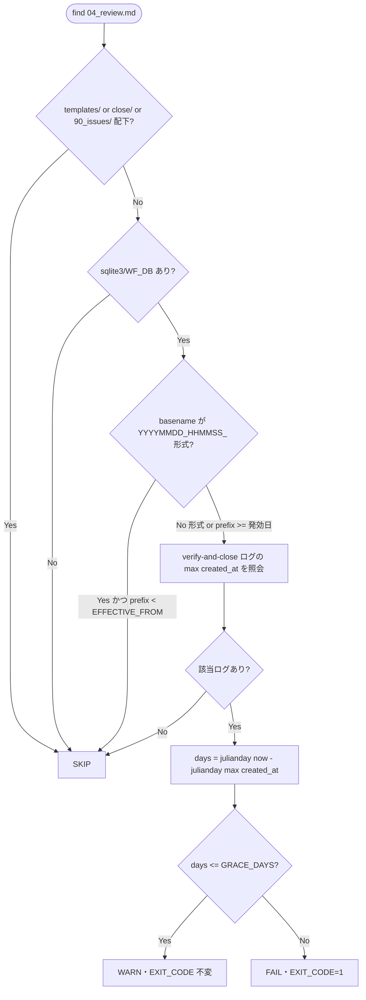

# 設計書: close 移動の監査強制と制約分離明記

**プロジェクト名**: close 移動の監査強制（audit.sh enforcement #33）と消費者/ドッグフーディング制約の分離明記
**作成日**: 2026 年 07 月 12 日
**最終更新**: 2026 年 07 月 12 日

> **重要**: **このドキュメントは常に更新**（生きているドキュメント）。設計の変更・追加があれば即座に更新する。
>
> **用語**: [.agent-skill-chain/source/CONCEPTS.md §用語規約](../../../.agent-skill-chain/source/CONCEPTS.md#用語規約) を参照。

---

## 1. 設計概要

### 1.1 設計方針

既存 audit.sh の #29/#32 と**同型の存在監査**（filesystem 走査 ＋ workflow.db 前方一致クエリ ＋ grandfather 発効日）を踏襲し、「verify-and-close 完了だが `close/` 未移動」を検知する新規監査項目 #33 を**非交差の新規番号**で追加する。汎用ロジック（走査・SKIP ガード・env 受け）はコア（source）に置き、具体閾値・具体パス・env 既定値の**正**は project 側に置く（汎用/固有境界パターン）。宣言（CORE）・ライフサイクル（PHASES）・具体（project）・検知（audit.sh）の責務境界を維持する。

### 1.2 設計原則（本プロジェクトで適用するもの）

- **単一責務**: 検知ロジックは audit.sh の 1 関数（`check_close_move_pending`）に閉じる。宣言・ライフサイクル・具体閾値は各々の正本ファイルに委ね、重複させない（spec/06 の 1 ファイル 1 責務・重複禁止）。
- **明確な境界**: 「検知（enforcement）」と「トリガー・完了定義（CORE/PHASES）」「close 移動手順（PHASES/project 移動前検証）」を混在させない。本 issue は検知と層分離明記のみ。
- **AIフレンドリー設計**: 既存 #29/#32 と同じ関数構造・命名・SKIP ガード順序を踏襲し、差分読解コストを最小化する。

---

## 2. アーキテクチャ設計

### 2.1 責務・境界・参照関係

#### 2.1.1 責務一覧

| コンポーネント | 責務（1 文） |
| --- | --- |
| `enforcement/ci/audit.sh` `check_close_move_pending`（新規 #33） | verify-and-close 証跡ありで `close/` 未移動かつ発効日以降・スコープ内の issue を、猶予内は WARN・猶予超過は FAIL として検知する。 |
| `workflow/PHASES.md` §完了 issue の close 移動（追記 1 文） | 「close 移動忘れは CI 監査（#33）で検知可能にする」旨を汎用原則として宣言する（具体閾値は project へ委譲）。 |
| `enforcement/README.md`（追記） | #33 を必須チェック一覧・失敗条件対応表・差し戻し先表に登録する（番号・所在・強制レベルの単一対応づけ）。 |
| `.agent-skill-chain/project/自己拡張ワークフロー.md` §close 移動の監査検知（#33）（新規節） | 本リポの具体パス（`docs/maintainer/workflow/close/<issue>/`）・env 既定値・猶予閾値・`.claude/settings.json` 由来制限のローカル固有性を明記する。 |

#### 2.1.2 境界

- **入力**: `PROJECT_ROOT`（$1）、`WORKFLOW_SCAN_DIRS`（既存の走査基点）、`WF_DB`（workflow.db）、env `CLOSE_MOVE_GATE_EFFECTIVE_FROM`・`CLOSE_MOVE_GRACE_DAYS`。
- **出力**: WARN 行（stderr・EXIT_CODE 不変）または FAIL 行（stderr ＋ `EXIT_CODE=1`）。
- **他責務との境界**: close 移動の**トリガー・完了定義**は CORE/PHASES を正本とし本 issue で改変しない。close 移動**手順**（移動前検証・相対リンク補正）は別ブランチ `chore/close-completed-issues`（既に main へマージ済み）が正本であり、本 issue は参照で接続するのみ。close 移動の**自動実行**は対象外（検知に留める）。

#### 2.1.3 参照関係

- `check_close_move_pending` は `WF_DB`（sqlite3）を参照する（読み取りのみ）。
- `check_close_move_pending` は `WORKFLOW_SCAN_DIRS` 配下の `04_review.md` を `find` で参照する。
- `PHASES.md` §完了 issue の close 移動 は `project/自己拡張ワークフロー.md` §close 移動の監査検知（#33）を参照する（具体委譲）。
- `enforcement/README.md` は audit.sh `check_close_move_pending` を参照する（所在対応づけ）。
- 循環参照なし。#33 は既存 #1〜#32 の関数を呼ばず、独立関数として末尾の呼び出し列に 1 行追加する。

### 2.2 システムアーキテクチャ

- **採用パターン**: 既存 audit.sh の**チェック関数プラグイン方式**（1 チェック＝1 関数、末尾で順次呼び出し、`EXIT_CODE` 集約）。
- **根拠**: spec/06 の「既存資産の変更方針は最小差分・パターン踏襲」。#29/#31/#32 と同一構造で追加でき、回帰リスクを局所化できる（evidence_source: existing_code＝audit.sh:792-928）。

#### 2.2.1 CQRS（Command/Query 分離）

- **Query（本 #33 が該当）**: workflow.db とファイルシステムの**状態取得のみ**。DB・ファイルへの書き込みはしない。
- **Command**: 該当なし（#33 は状態を変更しない）。

#### 2.2.2 判定フロー図



### 2.3 コンポーネント構成

- **検知層（source・汎用）**: `check_close_move_pending`。走査基点・SKIP ガード・env 受け・WARN/FAIL 出力を担う。既定値は fail-safe フォールバックのみ保持（ADR-3）。
- **宣言層（source・汎用）**: PHASES.md 追記 1 文。
- **登録層（source・汎用）**: enforcement/README.md 追記。
- **具体層（project・固有）**: 自己拡張ワークフロー.md 新規節。env 既定値・閾値・パス・settings.json 由来制限のローカル固有性の**正**。

### 2.4 データフロー

```mermaid
sequenceDiagram
    participant CI as audit.sh(check_close_move_pending #33)
    participant FS as find(04_review.md)
    participant DB as workflow.db(sqlite3)

    CI->>FS: WORKFLOW_SCAN_DIRS 配下の 04_review.md を列挙
    FS-->>CI: 各 issue_dir（未移動＝close/ 外に残る）
    CI->>CI: templates/ close/ 90_issues/ 除外・prefix<発効日 除外
    CI->>DB: SELECT max(created_at) WHERE command='verify-and-close' AND 前方一致
    DB-->>CI: max created_at（無ければ空＝SKIP）
    CI->>CI: days=julianday(now)-julianday(max); days<=grace?WARN:FAIL
```

### 2.5 横断設計判断（ADR）

#### ADR-1: #33 の走査方向＝filesystem-driven（DB 列挙ではなく 04_review.md 走査）

- **コンテキスト**: 「verify-and-close 済みだが close 未移動」を検知するには、DB のログ側から列挙する案と、ファイルシステムの成果物側から列挙する案がある。
- **検討した選択肢**:
  1. **DB-driven**: workflow.db の verify-and-close 行を列挙し、各 issue_path のディレクトリが close/ にあるか FS 照合。
  2. **filesystem-driven**: `04_review.md` を `find` で列挙し、各 issue に verify-and-close 証跡があるか DB 照合（#29/#32 と同型）。
- **決定**: 選択肢 2（filesystem-driven）。
- **根拠**: 未移動 issue の `04_review.md` は working tree の元位置（close/ 外）に必ず残っており、移動後は close/ 配下となって既存 SKIP ガード（`*"/close/"*`）で自然に除外される。DB-driven は「移動によって記録時 issue_path と現在パスが乖離する」問題（audit.sh:801-803 のコメントが明記）に直面し、close 済みを未移動と誤判定しうる。filesystem-driven なら既存 #29/#32 の走査・SKIP ガード・前方一致述語をそのまま再利用でき差分が最小（evidence_source: existing_code＝audit.sh:792-820・898-926）。
- **帰結**: 走査対象は `04_review.md`（verify-and-close の出力）。close/ への移動が「検知対象からの離脱」として機能する。#33 は既存 SKIP ガードの資産を流用する。

#### ADR-2: 猶予の実装形式＝日数猶予（created_at 基準）＋ grandfather 発効日、WARN→FAIL 段階化

- **コンテキスト**: verify-and-close と close 移動は別 PR/別コミットで行うのが正常運用（本セッションの PR#9/#10 → PR#11 が実例）。即 FAIL は正常運用を阻害するため採れない。猶予をどう実装するか。
- **検討した選択肢**:
  1. **env 発効日のみ（#32 同型）**: prefix ≥ 発効日なら即 FAIL。→ verify-and-close 直後（レビュー PR の CI）で必ず誤 FAIL する。却下。
  2. **日数猶予（created_at 基準）**: verify-and-close ログの `created_at` から経過日数を算出し、閾値内は WARN・超過で FAIL。加えて prefix 発効日で遡及を防ぐ。
  3. **コミット数猶予**: verify-and-close 以降のコミット数で判定。→ ログとコミットの対応付けが必要で脆弱・実装複雑。却下。
- **決定**: 選択肢 2（日数猶予 ＋ grandfather 発効日、WARN/FAIL 段階化）。
- **根拠**: `workflow_log.created_at` は NOT NULL の ISO8601（`YYYY-MM-DDTHH:MM:SSZ`）であり、`sqlite3` の `julianday()` が当該形式を正しく解釈することを実測で確認済み（今日のログで `julianday('now')-julianday(created_at)=0`。evidence_source: observed_runtime＝`.agent-skill-chain/runtime/workflow.db` 431 行に対する実行）。日数猶予はレビュー PR 直後（days=0）を WARN に留め、長期放置（days>閾値）のみ FAIL にでき、要求の「誤 FAIL しない」と「実効性（FAIL）」を両立する。grandfather 発効日は既存 #32 と同じ prefix 比較で遡及を防ぐ（evidence_source: existing_code＝audit.sh:896・908-916）。
- **帰結**: env は 2 本（発効日・猶予日数）。判定は「grandfather → 証跡照会 → 日数比較 → WARN/FAIL」。閾値の具体値（既定 7 日）の**正**は project（ADR-3）。

#### ADR-3: env 既定値の source/project 分離＝source は fail-safe フォールバックのみ、正は project

- **コンテキスト**: 要求は「具体閾値・env 既定値をコア（source）に書かず project へ委ねる」。一方、既存 #32 は `${REVIEWDOCS_GATE_EFFECTIVE_FROM:-20260712_000000}` と**フォールバック既定を source に埋め込み**、env 未設定の消費者でも安全に動くようにしている。両者は表面的に矛盾する。
- **検討した選択肢**:
  1. source に既定値を一切書かず、未設定時は SKIP（fail-open）。→ 消費者が env を設定し忘れると #33 が常に無効化され、実効性を失う。
  2. source に fail-safe フォールバック（`:-7`・`:-20260712_000000`）を埋め、**調整可能な正の値と根拠は project に記載**、CI は project の方針に従い env を設定する（#32 の実パターンと一致）。
- **決定**: 選択肢 2。
- **根拠**: #32 の既存実装が「source フォールバック ＋ 意味論は README/project」という形を既に採っており、消費者ランタイムを壊さない原則（fail-open だが無効化しすぎない）と両立する先例がある（evidence_source: existing_code＝audit.sh:896・enforcement/README.md:294）。要求の「コアに具体閾値を書かない」は「**調整対象の正**を project に置く」ことで満たし、source は**壊れない既定**のみを持つ、と解釈を確定する。
- **帰結**: source: `local cutoff="${CLOSE_MOVE_GATE_EFFECTIVE_FROM:-20260712_000000}"`, `local grace="${CLOSE_MOVE_GRACE_DAYS:-7}"`。project: 既定 `20260712_000000`／`7 日` とその根拠・具体パスを明記。

#### ADR-4: top-level 近似判定＝`90_issues/` 配下を機械除外し、ワークフロールート直下のみ対象

- **コンテキスト**: close 移動はトップレベル issue 完了時のみで、サブ issue 単独完了では移動しない（PHASES §トリガー）。CI がトップレベル完了を厳密機械判定するのは困難。
- **検討した選択肢**:
  1. 親 issue の全サブ完了を DB で厳密判定してからトップレベル移動要否を導出。→ 「トップレベル完了」自体が人手判断（残タスク無し）を含み機械化不能。却下。
  2. `04_review.md` のパスに `90_issues/` を含むものを除外し、ワークフロールート直下の issue のみ #33 の対象とする近似。
- **決定**: 選択肢 2。
- **根拠**: トップレベル issue の `04_review.md` は `.../workflow/{ts}_{title}/04_review.md`（直下）、サブ issue は `.../{parent}/90_issues/{sub}/04_review.md` に置かれる。`90_issues/` 除外で「親未完了で移動しない」サブを機械的に対象外にでき、close 移動は親ディレクトリ丸ごと（配下サブ含む）を動かす規約と整合する。親のルート直下 `04_review.md` が close/ 外に残っていれば「親が完了扱いで verify-and-close 済みなのに未移動」を捉えられる（evidence_source: existing_code＝PHASES.md:73-77、inference_only＝近似の十分性は運用で確認要）。
- **帰結**: SKIP ガードに `[[ "$f" == *"/90_issues/"* ]] && continue` を追加。サブ issue 単独完了は誤検知しない。

#### ADR-5: 存在監査のみ・厳密な時刻順序は監査しない（#32 ADR-3 踏襲）

- **コンテキスト**: 「verify-and-close の後に close 移動」という順序を厳密検証すべきか。
- **決定**: 存在監査（証跡の有無 ＋ close/ 在籍の有無 ＋ 経過日数）に限定し、イベントの厳密な時刻前後は監査しない。
- **根拠**: 前方一致＋basename 末尾一致の安全側述語（#29/#32 と同型）で誤 FAIL を避ける方針と一致。厳密順序監査は偽陽性を招きやすい（evidence_source: existing_code＝audit.sh:889-890）。
- **帰結**: クエリは `command='verify-and-close'` 行の `max(created_at)` のみ用いる。

#### ADR-6: `.claude/settings.json` 由来制限のローカル固有性を 3 層分離で明記

- **コンテキスト**: close/ 配下の Read/Grep/Glob deny が「フレームワーク全利用者の制約」と誤解される懸念。
- **決定**: 制約を 3 層（汎用原則＝source／本リポ具体＝project／ローカル環境固有＝`.claude/settings.json`）に分離し、settings.json 由来制限は本リポのローカル固有である旨を project に明記する。
- **根拠**: `.claude/settings.json` は gitignore 対象（`git check-ignore` が一致・`git ls-files` に不在）で、配布パッケージ生成 `build-adapters.sh` にも close deny の記述が無いことを確認済み（evidence_source: existing_code＝`git check-ignore .claude/settings.json` 一致・`grep 'settings.json\|close' build-adapters.sh` 無出力）。よって他消費者に自動継承されない。
- **帰結**: project 節に「settings.json の close deny はローカル固有（追跡外・配布物非含有）」と明記し、過度な一般化をしない。

---

## 3. 機能設計

### 3.1 機能 1: check_close_move_pending（#33）

#### 3.1.1 概要

verify-and-close 証跡がありつつ `close/` 未移動・スコープ内・発効日以降の issue を、猶予内は WARN・超過は FAIL として検知する。

#### 3.1.2 処理フロー

1. SKIP ガード: `sqlite3` 不在 or `WF_DB` 不在 or `workflow_log` テーブル不在 or `WORKFLOW_SCAN_DIRS` 空 → `return 0`。
2. `find "$PROJECT_ROOT/$_wfd" -name "04_review.md" -type f -print0`（unbounded・#29/#32 同型）。
3. 各ファイルで `*"/templates/"*` / `*"/close/"*` / `*"/90_issues/"*` を含むパスは `continue`。
4. grandfather: basename が `^([0-9]{8})_([0-9]{6})_` かつ `ts < cutoff` なら `continue`。プレフィックス非準拠命名は素通り（誤 FAIL 回避）。
5. verify-and-close 証跡照会: `SELECT CAST(julianday('now') - julianday(MAX(created_at)) AS INTEGER) FROM workflow_log WHERE command='verify-and-close' AND (前方一致＋basename 末尾一致)`。結果が空 → `continue`（未完了扱い）。
6. `days <= grace` → WARN（`EXIT_CODE` 不変）。`days > grace` → `FAIL` ＋ `EXIT_CODE=1` ＋ `ROLLBACK_MSG`。

#### 3.1.3 入力・出力

- **入力**: `WF_DB`, `WORKFLOW_SCAN_DIRS`, `PROJECT_ROOT`, env `CLOSE_MOVE_GATE_EFFECTIVE_FROM`（既定 `20260712_000000`）, `CLOSE_MOVE_GRACE_DAYS`（既定 `7`）。
- **出力（WARN）**: `WARN: verify-and-close 済みだが close/ 未移動（猶予 N 日内・情報）: <dir>`（EXIT_CODE 不変）。
- **出力（FAIL）**: `FAIL: verify-and-close 済みだが close/ 未移動（猶予 N 日超過）: <dir>` ＋ `ROLLBACK_MSG` ＋ `EXIT_CODE=1`。

#### 3.1.4 エラーハンドリング

- `sqlite3` クエリは `2>/dev/null || true` で握り、`created_at` 列を持たない DB・破損時は空結果＝SKIP（fail-open）。
- `days` が整数でない・空・負（時計スキュー）の場合は WARN 側（安全側）に倒し FAIL しない。

### 3.2 機能 2: 3 層分離明記（ドキュメント）

PHASES に汎用原則 1 文、project に具体（env 既定値・パス・settings.json ローカル固有性）を記載し、README に #33 を登録する。手順本文の重複記載はしない（移動前検証は既に main の PHASES/project にあり参照で接続）。

---

## 4. データ設計

### 4.1 データモデル

新規テーブル・カラムの追加は**なし**。既存 `workflow_log`（[ledger/schema.sql](../../../.agent-skill-chain/source/ledger/schema.sql)）の以下を読み取りのみで利用する。

| カラム | 型 | 用途 |
| --- | --- | --- |
| command | TEXT | `'verify-and-close'` の絞り込み |
| issue_path | TEXT | 前方一致＋basename 末尾一致（記録時＝close 前パス） |
| created_at | TEXT(ISO8601) | `julianday()` で経過日数算出（猶予判定） |

### 4.2 クエリ仕様（正）

```sql
SELECT CAST(julianday('now') - julianday(MAX(created_at)) AS INTEGER)
FROM workflow_log
WHERE command='verify-and-close'
  AND (issue_path = '<dir>' OR issue_path = '<dir>/' OR issue_path LIKE '<dir>/%'
       OR issue_path LIKE '%/<base>' OR issue_path LIKE '%/<base>/%');
```

`<dir>`＝`issue_dir` の PROJECT_ROOT 相対、`<base>`＝basename。いずれも `'` を `''` にエスケープ（既存 `dir_esc`/`base_esc` と同型）。`MAX` はゼロ行時に NULL（sqlite3 出力は空行）→ 空判定で SKIP。

---

## 5. API 設計

### 5.1 環境変数インターフェース

| 変数 | 既定（source フォールバック） | 説明 |
| --- | --- | --- |
| `CLOSE_MOVE_GATE_EFFECTIVE_FROM` | `20260712_000000` | grandfather 発効日。issue basename プレフィックス（`YYYYMMDD_HHMMSS`）がこれ未満なら SKIP。 |
| `CLOSE_MOVE_GRACE_DAYS` | `7` | 猶予日数。verify-and-close の `created_at` からの経過が閾値内は WARN・超過は FAIL。 |

- 命名は既存 `REVIEWDOCS_GATE_EFFECTIVE_FROM`（#32）の `*_GATE_EFFECTIVE_FROM` 規則を踏襲。既定値の**正**は project（ADR-3）。

### 5.2 関数シグネチャ

- `check_close_move_pending()` — 引数なし。グローバル `WF_DB`/`WORKFLOW_SCAN_DIRS`/`PROJECT_ROOT`/`EXIT_CODE`/`ROLLBACK_MSG` を参照。末尾の呼び出し列に `check_close_move_pending` を 1 行追加。

---

## 6. テスト戦略

テスト観点の定義は [RULES.md §テスト戦略必須要件](../../../.agent-skill-chain/source/RULES.md#テスト戦略必須要件)、BDD 形式は [TEST_BDD_FORMAT.md](../../../.agent-skill-chain/source/TEST_BDD_FORMAT.md) を参照。既存 `test/test-audit.sh` の #32 ブロック（`make_min_tree` ＋ tmp 隔離 ＋ `sqlite3` シード）を踏襲する。

### 6.1 対象ごとのテスト割り当て

| 対象 | 単体 | 結合/API | E2E | クリティカル観点 | バリデーション観点 | 未達理由/補足 |
| --- | --- | --- | --- | --- | --- | --- |
| check_close_move_pending（#33） | ○ | × | × | 猶予超過 FAIL／猶予内 WARN／grandfather・close・90_issues・DB 非採用 SKIP の誤 FAIL ゼロ | プレフィックス非準拠・created_at 欠落列で SKIP | 単体（test-audit.sh）で網羅。E2E 不要（CI スクリプト単体） |
| ドキュメント 3 層分離明記 | × | × | × | grep で「ローカル固有」明記・過度な一般化不在を確認 | — | 文言検査（03 §2.7） |

### 6.2 監査・レビューでの確認（証跡）

01 の BDD シナリオ 1〜7 と 03 のタスク別テスト観点が 1:1 対応することを review-docs で確認する。#33 が既存 #29/#32 と非交差（走査対象・番号・検知条件）であることを回帰テストで担保する。

---

## 9. 非機能要件への対応

### 9.1 パフォーマンス

既存 #29/#31/#32 と同型の unbounded `find` ＋ issue 数分の軽量 `sqlite3` クエリ。監査全体の実行時間に体感差を出さない。

### 9.2 可用性

`sqlite3`/`WF_DB`/`created_at` 列いずれか不在で SKIP（fail-open）。既存の消費者ランタイムを壊さない。

---

## 10. 参考資料

### プロジェクトドキュメント

- [`01_要件定義.md`](./01_要件定義.md) - 要件定義
- [`00_要求定義.md`](./00_要求定義.md) - 要求定義
- [enforcement/ci/audit.sh](../../../.agent-skill-chain/source/enforcement/ci/audit.sh)（#29:792/#31:831/#32:891・grandfather・ROLLBACK_MSG）
- [enforcement/README.md §失敗条件と差し戻し](../../../.agent-skill-chain/source/enforcement/README.md)
- [workflow/PHASES.md §完了 issue の close 移動](../../../.agent-skill-chain/source/workflow/PHASES.md)
- [.agent-skill-chain/project/自己拡張ワークフロー.md](../../../.agent-skill-chain/project/自己拡張ワークフロー.md)
- [ledger/schema.sql](../../../.agent-skill-chain/source/ledger/schema.sql)
- [EVIDENCE_POLICY.md](../../../.agent-skill-chain/source/EVIDENCE_POLICY.md)

### その他の参考資料

- 別ブランチ（既に main へマージ済み・参照のみ）: `chore/close-completed-issues`（close 移動手順の移動前検証化）。本 issue は手順本文を重複記載せず参照で接続する。

---

## 11. 前のステップ

- **前**: [`01_要件定義.md`](./01_要件定義.md) - 要件定義フェーズ

---

## 12. 次のステップ

- **次**: [`03_実装計画.md`](./03_実装計画.md) - 実装計画フェーズ
- **必須ゲート**: 本 02/03 完了後、implement-feature 着手前に **review-docs（実装前ドキュメントレビュー）を必ず経る**（design-feature DoD・enforcement #32）。
