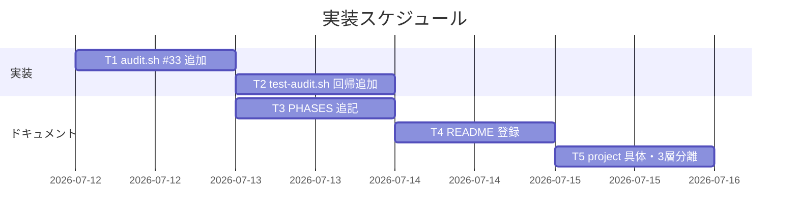

# 実装計画書: close 移動の監査強制と制約分離明記

**プロジェクト名**: close 移動の監査強制（audit.sh enforcement #33）と消費者/ドッグフーディング制約の分離明記
**作成日**: 2026 年 07 月 12 日
**最終更新**: 2026 年 07 月 12 日

> **重要**: **このドキュメントは常に更新**（生きているドキュメント）。
> **必須項目**: 「必須」欄は空欄・抽象語のみで提出しない。BDD は具体ケースを 1 件以上記載する。
>
> **用語**: [.agent-skill-chain/source/CONCEPTS.md §用語規約](../../../.agent-skill-chain/source/CONCEPTS.md#用語規約) を参照。

---

## 1. 実装概要

### 1.1 実装方針

[02_設計](./02_設計.md) に従い、audit.sh に #33（`check_close_move_pending`）を既存 #29/#32 と同型で追加し、`test/test-audit.sh` に回帰テストを追加、PHASES/README/project の 3 ドキュメントに宣言・登録・具体を最小差分で追記する。既存 #1〜#32 の関数・番号・走査対象は改変しない（非交差）。

### 1.2 実装順序（必須）



- T1: audit.sh 検知関数追加 → T2: テスト → T3: PHASES 宣言 → T4: README 登録 → T5: project 具体・3 層分離。T1 完了後 T3〜T5 は並行可。

---

## 2. タスク分解

**必須**: 各タスクに「テスト観点」（2.x.3）と「BDD」（2.x.4）を記載する。

### 2.1 タスク 1: audit.sh に #33 `check_close_move_pending` を追加

#### 2.1.1 概要（必須）

verify-and-close 証跡ありで close/ 未移動・スコープ内・発効日以降の issue を、猶予内 WARN・超過 FAIL で検知する関数を追加し、末尾の呼び出し列に登録する。

#### 2.1.2 実装内容（必須）

- `check_close_move_pending()` を #32（audit.sh:891-928）の直後に追加。構造は #32 を踏襲:
  - SKIP ガード: `command -v sqlite3` 不在 / `[[ ! -f "$WF_DB" ]]` / `workflow_log` テーブル不在 / `WORKFLOW_SCAN_DIRS` 空 → `return 0`。
  - `local cutoff="${CLOSE_MOVE_GATE_EFFECTIVE_FROM:-20260712_000000}"`、`local grace="${CLOSE_MOVE_GRACE_DAYS:-7}"`。
  - `find "$PROJECT_ROOT/$_wfd" -name "04_review.md" -type f -print0` でループ。
  - `*"/templates/"*`・`*"/close/"*`・`*"/90_issues/"*` を含むパスは `continue`（ADR-4）。
  - grandfather: `[[ "$base" =~ ^([0-9]{8})_([0-9]{6})_ ]]` かつ `[[ "$ts" < "$cutoff" ]]` で `continue`。
  - 証跡＋日数照会（02 §4.2 の SQL）。結果 `days` が空 → `continue`。
  - `days` が整数か検査（`^-?[0-9]+$`）。非整数は安全側で `continue`。
  - `(( days <= grace ))` → `echo "WARN: verify-and-close 済みだが close/ 未移動（猶予 ${grace} 日内・情報）: $dir" >&2`（EXIT_CODE 不変）。
  - else → `echo "FAIL: verify-and-close 済みだが close/ 未移動（猶予 ${grace} 日超過）: $dir" >&2; echo "$ROLLBACK_MSG" >&2; EXIT_CODE=1`。
  - `echo "[audit] checking close-move-pending (#33)" >&2` を関数冒頭に置く。
- 末尾（audit.sh:935 の `check_reviewdocs_before_implement` の後）に `check_close_move_pending` を 1 行追加。
- 関数ヘッダコメントに #33 の趣旨・SKIP 条件・grandfather・非交差（#29/#32 と走査対象は同じ 04_review.md だが検知条件が排他: #29=impl/verify 0 件、#33=verify-and-close 1 件以上かつ未移動）を記載。

#### 2.1.3 テスト観点（必須）

**参照**: 定義は [02_設計 §6](./02_設計.md) と [RULES §テスト戦略必須要件](../../../.agent-skill-chain/source/RULES.md#テスト戦略必須要件)。以下は本タスクの具体ケース。

##### 単体（必須 1 件以上）

- 猶予超過（created_at を 30 日前にシード）＋発効日以降＋close/ 外＋verify-and-close 証跡あり → FAIL 行が出る。
- 猶予内（created_at を現在にシード）＋同条件 → FAIL しない（WARN 可）。
- 発効日前プレフィックス（`20260101_...`）→ FAIL しない（grandfather SKIP）。
- close/ 配下 issue → FAIL しない（既存 SKIP ガード）。
- `90_issues/` 配下サブ issue → FAIL しない（ADR-4 除外）。
- verify-and-close 証跡なし（design/implement ログのみ）→ FAIL しない。
- `sqlite3`/`WF_DB` 不在 → SKIP（FAIL しない）。

##### 結合/API

- 該当なし（audit.sh 単体スクリプト。CI ワークフローからの呼び出しは既存 audit.yml が担い変更なし）。

##### E2E/受け入れ

- 該当なし（CI スクリプト単体で完結。E2E 対象の実行系がない）。

##### バリデーション

- `created_at` 列を持たない旧テストスキーマの DB に対して #33 のクエリがエラー→空結果→SKIP になり、既存 #17/#32 テストを誤 FAIL させない（回帰）。

#### 2.1.4 単体テスト仕様（BDD）（必須）

```gherkin
Feature: close 移動未実施検知（#33 check_close_move_pending）
  Scenario: 猶予超過・発効日以降・未移動 → FAIL
    Given tmp 隔離ツリーに issue A（basename 20260801_000000_ng・04_review.md あり）を置く
    And workflow.db に issue A の verify-and-close ログを created_at=30 日前で挿入する
    And CLOSE_MOVE_GRACE_DAYS=7 とする
    When audit.sh <tmp> を実行する
    Then "close/ 未移動（猶予 7 日超過)" の FAIL 行が出力される

  Scenario: 猶予内 → FAIL しない
    Given issue B の verify-and-close ログを created_at=現在で挿入する
    When audit.sh <tmp> を実行する
    Then close 未移動の FAIL 行が出ない

  Scenario: 発効日前 → grandfather SKIP
    Given issue C の basename が 20260101_000000_old で verify-and-close ログを 30 日前で挿入する
    When audit.sh <tmp> を実行する
    Then close 未移動の FAIL 行が出ない

  Scenario: 90_issues 配下サブ issue → 対象外
    Given issue P/90_issues/S の 04_review.md と S の verify-and-close ログ（30 日前）を置く
    When audit.sh <tmp> を実行する
    Then S に対する close 未移動の FAIL 行が出ない
```

**テストコード例（bash・test-audit.sh 追加分。Given/When/Then インラインコメント必須）**

```bash
# Given: 発効日以降・close 外・verify-and-close ログ(30日前)を持つ issue A
S33_1_TREE="$(make_min_tree)"
S33_1_ISS="docs/maintainer/workflow/20260801_000000_ng"
mkdir -p "$S33_1_TREE/$S33_1_ISS"
cat > "$S33_1_TREE/$S33_1_ISS/04_review.md" <<'EOF'
# 04_review
## 敵対的観点
- ダミー
## must-preserve（不変条件）
- ダミー
EOF
S33_1_DB="$S33_1_TREE/.agent-skill-chain/runtime/workflow.db"
sqlite3 "$S33_1_DB" "CREATE TABLE workflow_log (entry_id TEXT PRIMARY KEY, parent_entry_id TEXT NULL, command TEXT NOT NULL, issue_path TEXT NULL, created_at TEXT NULL);"
sqlite3 "$S33_1_DB" "INSERT INTO workflow_log VALUES ('e1', NULL, 'verify-and-close', '$S33_1_ISS/', datetime('now','-30 days'));"
# When: 猶予 7 日で audit を実行
S33_1_OUT="$(CLOSE_MOVE_GRACE_DAYS=7 bash "$AUDIT" "$S33_1_TREE" 2>&1)"
# Then: close 未移動の FAIL が出る
if grep -q "close/ 未移動" <<< "$S33_1_OUT"; then ok "#33 猶予超過で FAIL"; else ng "#33 見逃し: $S33_1_OUT"; fi
```

#### 2.1.5 依存関係

- なし（既存関数を呼ばない独立関数）。T2 は T1 に依存。

#### 2.1.6 見積もり

- **工数**: 1.5h ・ **優先度**: 高

### 2.2 タスク 2: test-audit.sh に #33 回帰テストを追加

#### 2.2.1 概要（必須）

2.1.4 の全シナリオ（FAIL／WARN／grandfather／close／90_issues／証跡なし／DB 非採用）を tmp 隔離で検証するブロックを `test/test-audit.sh` に追加する。

#### 2.2.2 実装内容（必須）

- `== #33 close 移動未実施検知 ==` セクションを #32 ブロック（test-audit.sh:398-）の後に追加。
- テスト用 `workflow_log` スキーマに `created_at TEXT NULL` を含める（#33 が参照するため）。
- 冒頭 `unset ... CLOSE_MOVE_GATE_EFFECTIVE_FROM CLOSE_MOVE_GRACE_DAYS` を既存 unset 行（test-audit.sh:28）に追加し、外部 env の混入を防ぐ。
- 各シナリオで `grep -q "close/ 未移動"` により FAIL 有無を判定。

#### 2.2.3 テスト観点（必須）

##### 単体（必須 1 件以上）

- 2.1.3 の 7 ケースが `ok`/`ng` で判定される。
- 既存 #17 close ガード回帰（test-audit.sh:130-）と #32 全ケースが #33 追加後も緑のまま（`created_at` 無しスキーマで #33 が SKIP する回帰）。

##### 結合/API・E2E・バリデーション

- 該当なし（既存 `test/run-all.sh` の一部として実行）。

#### 2.2.4 単体テスト仕様（BDD）

```gherkin
Feature: #33 回帰テストスイート
  Scenario: 追加後も既存テストが緑
    Given #33 ブロックを test-audit.sh に追加する
    When bash test/test-audit.sh を実行する
    Then 既存 #17/#32 を含む全アサーションが pass する
    And #33 の 7 ケースが期待どおり ok になる
```

```bash
# Given: #33 を含む test-audit.sh
# When: 全テスト実行
bash test/test-audit.sh
# Then: 終了コード 0（全 ok）
```

#### 2.2.5 依存関係

- T1（audit.sh #33）に依存。

#### 2.2.6 見積もり

- **工数**: 1h ・ **優先度**: 高

### 2.3 タスク 3: PHASES.md に汎用原則 1 文を追記

#### 2.3.1 概要（必須）

`workflow/PHASES.md` §完了 issue の close 移動 に「close 移動忘れは CI 監査（#33）で検知可能にする。具体閾値・パスは project へ委ねる」旨を 1 文追記する。

#### 2.3.2 実装内容（必須）

- PHASES.md:81（具体手順の委譲）付近に箇条書き 1 項を追加。手順本文（移動前検証）は既に main にあり重複記載しない。#33 の具体は project 参照。

#### 2.3.3 テスト観点（必須）

##### 単体

- `grep -q "監査\|#33" PHASES.md` で追記の存在を確認。既存 close 節の他項目が改変されていない（diff が追記のみ）。

##### 結合/API・E2E・バリデーション

- 該当なし（ドキュメント）。self-enforce 検知（コメント/README のドキュメント名直書き規約）に抵触しない表現にする。

#### 2.3.4 単体テスト仕様（BDD）

```gherkin
Feature: PHASES 汎用原則追記
  Scenario: close 節に監査検知の宣言がある
    Given PHASES.md §完了 issue の close 移動 を読む
    When 追記行を確認する
    Then close 移動忘れが CI 監査で検知可能である旨が 1 文で書かれている
    And 具体閾値・パスは project へ委譲する旨が書かれている
```

#### 2.3.5 依存関係 / 2.3.6 見積もり

- 依存なし（T1 と並行可）。工数 0.3h・優先度 中。

### 2.4 タスク 4: enforcement/README.md に #33 を登録

#### 2.4.1 概要（必須）

必須チェック一覧（:145）・失敗条件対応表（:242-244 付近）・失敗条件表（:294 付近）・差し戻し先表（:329 付近）に #33 の行を追加する。

#### 2.4.2 実装内容（必須）

- 必須チェック列挙に `(33) close 移動未実施検知（...WARN/FAIL・SKIP 条件）` を追加。
- 対応表: `| #33 close 移動未実施 | audit.sh check_close_move_pending | CI FAIL（猶予内は WARN。DB 不採用・発効日前・close/templates/90_issues 配下は SKIP。#29/#32 と非交差） |`。
- 失敗条件表・差し戻し先表に #33 の説明と是正手順（close/ へ移動し直す or 猶予内なら移動を実施）を追加。既存番号は変更しない。

#### 2.4.3 テスト観点（必須）

##### 単体

- `grep -c "#33\|check_close_move_pending" README.md` が対応表・一覧に現れる。既存 #32 行が無改変。番号衝突なし（#33 が既存に不在であることを事前 grep で確認済み）。

##### 結合/API・E2E・バリデーション

- 該当なし。

#### 2.4.4 単体テスト仕様（BDD）

```gherkin
Feature: README #33 登録
  Scenario: 失敗条件対応表に #33 行がある
    Given enforcement/README.md を読む
    When 失敗条件 → 実装の所在 → 強制レベル 対応表を確認する
    Then #33 の行（check_close_move_pending・CI FAIL/WARN・SKIP 条件）が存在する
```

#### 2.4.5 依存関係 / 2.4.6 見積もり

- T3 の後が望ましい。工数 0.5h・優先度 中。

### 2.5 タスク 5: project 自己拡張ワークフロー.md に具体・3 層分離を追記

#### 2.5.1 概要（必須）

`.agent-skill-chain/project/自己拡張ワークフロー.md` に §close 移動の監査検知（#33）を新設し、具体パス・env 既定値・猶予閾値、および `.claude/settings.json` 由来制限のローカル固有性（3 層分離）を明記する。

#### 2.5.2 実装内容（必須）

- 新節: `## close 移動の監査検知（#33）（具体閾値・上書き）`。
  - 具体パス: `docs/maintainer/workflow/close/<issue>/`。
  - env 既定値の正: `CLOSE_MOVE_GATE_EFFECTIVE_FROM=20260712_000000`、`CLOSE_MOVE_GRACE_DAYS=7`（根拠: verify-and-close PR と close 移動 PR を別 PR で行う運用で 7 日は十分な猶予）。
  - 3 層分離: 「`.claude/settings.json` の close/ 配下 Read/Grep/Glob deny は**本リポのローカル開発環境固有**（gitignore 対象・追跡外・`build-adapters.sh` 非含有）であり、他消費者に自動継承されない」旨を明記。過度な一般化をしない。
  - 移動前検証（既に main の §close 移動時の相対リンク補正 にある）へは参照リンクで接続し重複記載しない。

#### 2.5.3 テスト観点（必須）

##### 単体

- `grep -q "CLOSE_MOVE_GRACE_DAYS\|ローカル\|固有" 自己拡張ワークフロー.md` で具体閾値と 3 層分離明記の存在を確認。
- `.claude/settings.json` について「フレームワーク利用者全員が同じ制限」等の過度な一般化表現が**無い**ことを確認。

##### 結合/API・E2E・バリデーション

- 該当なし。

#### 2.5.4 単体テスト仕様（BDD）

```gherkin
Feature: project 具体・3 層分離明記（ストーリー 3・シナリオ 7）
  Scenario: settings.json 制限がローカル固有と書かれている
    Given 自己拡張ワークフロー.md の §close 移動の監査検知（#33）を読む
    When settings.json の close/ deny の記述を確認する
    Then それが本リポのローカル環境固有（gitignore 対象・配布物非含有）である旨が明記されている
    And env 既定値（EFFECTIVE_FROM・GRACE_DAYS）と具体パスが記載されている
```

#### 2.5.5 依存関係 / 2.5.6 見積もり

- T3/T4 の後が望ましい。工数 0.7h・優先度 中。

---

## テスト観点

- **クリティカル**: #33 が「猶予超過・未移動・発効日以降」で確実に FAIL し、正常運用（猶予内・別 PR 移動）を誤 FAIL しない。既存 #29/#32/#17 と非交差で回帰を出さない。
- **バリデーション**: grandfather・close・90_issues・DB 非採用・created_at 欠落列で SKIP（fail-open）。
- **ドキュメント**: 3 層分離明記・過度な一般化不在・番号非衝突。

## 単体テスト

- `test/test-audit.sh` に #33 ブロックを追加（2.1.4/2.2.4 の全シナリオ）。`test/run-all.sh` で既存全テストが緑であることを確認。

## BDD

- 上記 2.x.4 の gherkin が 01 の BDD シナリオ 1〜7 と 1:1 対応する（シナリオ 1→T1 FAIL、2→T1 WARN、3→grandfather、4→close SKIP、5→DB 非採用、6→90_issues、7→project 3 層分離）。

---

## 5. リスク管理

### 5.1 実装リスク

- **リスク**: 既存テストの `workflow_log` テストスキーマに `created_at` 列が無く、#33 クエリがエラーになり誤 FAIL する。
  - **対策**: `2>/dev/null || true` で空結果→SKIP に倒す（fail-open）。#33 テストは `created_at` 付きスキーマでシードする。回帰テスト（2.2.3）で既存 #17/#32 が緑を確認。
- **リスク**: WARN が CI ログのノイズになる。
  - **対策**: WARN は `EXIT_CODE` 不変（ブロックしない）。閾値（GRACE_DAYS）は project で調整可能。
- **リスク**: self-enforce 検知（コメント/README でのドキュメント名直書き規約）に PHASES/README 追記が抵触。
  - **対策**: 直近コミット 055c944 の前例に倣い、ドキュメント名の直書きを避けた表現で追記する。

---

## 6. 参考資料

### プロジェクトドキュメント

- [`02_設計.md`](./02_設計.md) - 設計（ADR-1〜6・クエリ仕様 §4.2・env §5.1）
- [`01_要件定義.md`](./01_要件定義.md) - 要件（BDD シナリオ 1〜7）
- [enforcement/ci/audit.sh](../../../.agent-skill-chain/source/enforcement/ci/audit.sh)・[test/test-audit.sh](../../../test/test-audit.sh)

### その他の参考資料

- 別ブランチ（既に main へマージ済み・参照のみ）: `chore/close-completed-issues`（移動前検証化）。

---

## 7. 前のステップ

- **前**: [`02_設計.md`](./02_設計.md) - 設計フェーズ

---

## 8. 次のステップ

- 本 issue は 1 issue で完結（サブ issue 分割なし＝90_issues.md 不要）。
- **必須ゲート**: implement-feature 着手前に **review-docs（実装前ドキュメントレビュー）を必ず経る**（design-feature DoD・enforcement #32）。
