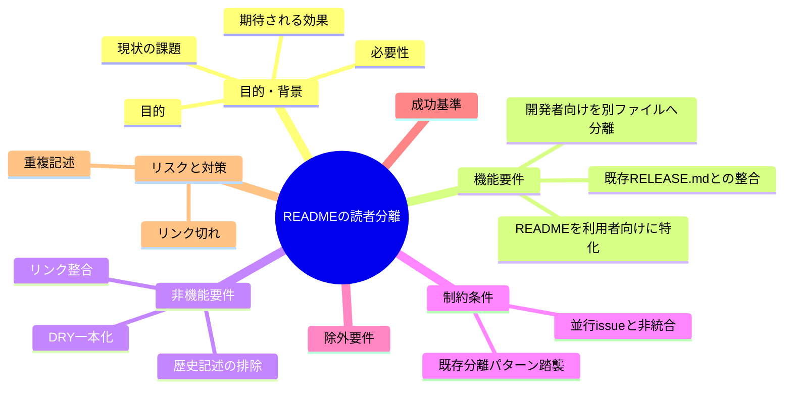
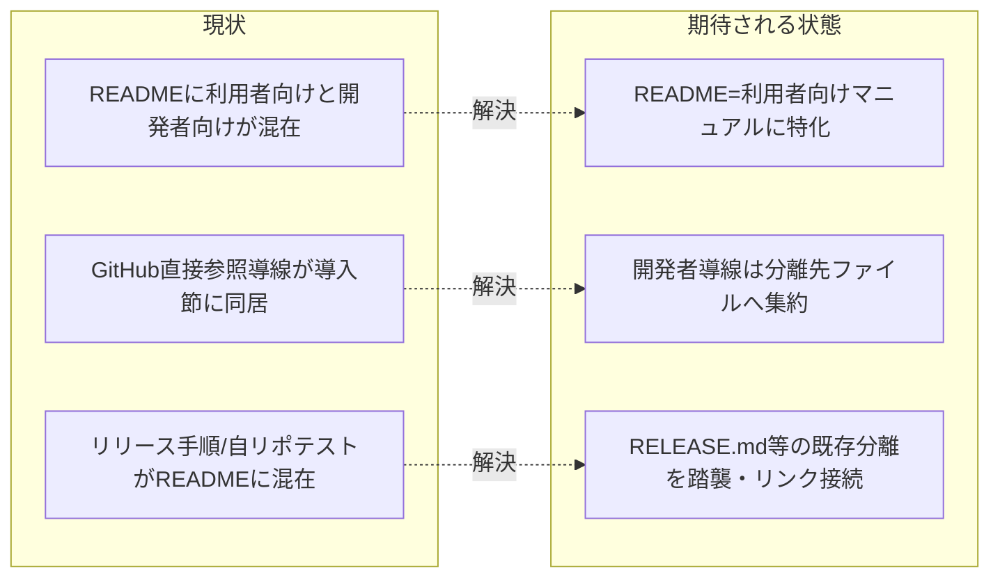

# 要求定義書: README.md の読者分離（利用者向けマニュアル／開発者・メンテナ向けドキュメントの分割）

**プロジェクト名**: README.md の読者分離
**作成日**: 2026 年 07 月 12 日
**最終更新**: 2026 年 07 月 12 日

> **重要**:
>
> - 要求定義書は、プロジェクトの全体像を把握するためのものです。詳細な技術仕様や実装方法は要件定義書以降で記載します。必要最低限の情報に収めることを心掛けてください。
> - **このドキュメントは常に更新**: 要求の変更や追加があった場合は、即座にこのドキュメントを更新してください。
>
> **用語**: [.agent-skill-chain/source/CONCEPTS.md §用語規約](../../../../.agent-skill-chain/source/CONCEPTS.md#用語規約) を参照。

---

## 要求定義の全体像

**注意**:

- マインドマップは全体像の把握用であり、主要セクション名程度に留める。

---

## 1. 目的・背景

### 1.1 目的（必須）

README.md を利用者向けマニュアルに特化し、開発者向け情報を別ファイルへ分離する。

### 1.2 背景

- **現状の課題**:
  - `README.md` は「一般利用者向けの導入・操作手順」と「開発者・メンテナ向けの情報」が同一セクション構成に混在している。混在は精読した実内容で確認済み。具体例:
    - `README.md` §71「### 1. GitHub 直接参照（開発者・自己拡張向けの補助導線。npm レジストリは経由しない）」— 見出し自体が「開発者・自己拡張向け」と明記しているのに、一般導入手順（§0 apm・§2 marketplace）と同じ「## 導入」直下に同居している。
    - `README.md` §163「#### リリース手順（メンテナ向け）」— 見出しが「メンテナ向け」と明記しているが README 本体（marketplace 経由導線の配下）に同居している。
    - `README.md` §179-187「動作確認」節の後半「本リポジトリ（パッケージ正本／自己拡張）でテストを回す場合」（`npm test` / `bash test/run-all.sh`）— 採用先の利用者ではなく本リポジトリを開発する者向けの内容が、利用者向けの動作確認手順に混在している。
  - 一方で、メンテナ向け文書を分離する前例（`docs/maintainer/RELEASE.md`）が既に存在し、README §163 は要約リンクのみを持ち詳細を `docs/maintainer/RELEASE.md` に一本化する運用が確立している（`docs/maintainer/RELEASE.md` 冒頭「README §リリース手順は入口リンクと要約のみを持ち、詳細はここに一本化する」で明言）。README 内の他の開発者向け記述はこの前例に倣った分離ができていない。

- **必要性**:
  - 本フレームワークの開発者（ユーザー）から明確な要求がある:「README についてはシステムの概要とインストールやアンインストール、操作マニュアルにしておくべきで、このシステムを拡張する開発者用は別途ファイルに記載するべき」。
  - 利用者は導入・操作に必要な情報だけを、開発者は拡張・自己拡張・リリースに必要な情報だけを、それぞれ迷わず参照できる状態にする必要がある。

### 1.3 期待される効果（必須: 1 件以上）

- **効果 1**: README.md の全セクションが「利用者向け（概要・導入・アンインストール・操作マニュアル）」のみで構成される（開発者・メンテナ限定の見出しが README 本体から無くなることを○/×で判定できる）。
- **効果 2**: 開発者・自己拡張・メンテナ向け情報が単一の分離先ファイルから辿れる（分離先ファイルが存在し、README から 1 リンクで到達できることを○/×で判定できる）。
- **効果 3**: 分割後もリポジトリ内の全 markdown リンク・参照が解決する（リンク切れ 0 件であることを○/×で判定できる）。

**現状と期待される状態の比較**:

---

## 2. 機能要件

### 2.1 既存機能の維持（該当する場合）

- README.md が持つ利用者向け情報（システム概要・「何がどこに置かれるか」・.agents 構成・apm 導入・marketplace 導入・ローカル配備・アンインストール（つけ外し）・enforcement opt-in・動作確認（採用先向け）・入口と参照・その他）は README.md に残し、内容を維持する。
- 既に分離済みの `docs/maintainer/RELEASE.md`（メンテナ向けリリース詳細正本）はそのまま維持し、二重管理しない。README/分離先からは要約＋リンクで接続する既存パターンを踏襲する。

### 2.2 新規機能要件

- README.md を「システムの概要・インストール・アンインストール・基本操作マニュアル」（一般利用者向け）に特化させる。
- 開発者・自己拡張・メンテナ向けの情報（GitHub 直接参照導線、本リポジトリのテスト実行、リリース手順の入口）を README.md から**分離先ファイルへ移設**する。
- 分離先ファイルの具体は**要件定義（01）で確定**する。第一候補はリポジトリルートの新設 `CONTRIBUTING.md`（開発者・貢献者向けの入口。GitHub 慣習により発見性が高い）とし、`docs/maintainer/` 配下の既存詳細文書（`RELEASE.md`・`adapters.md`・`apm-package.md`・`claude-hook-e2e.md` 等）へリンクで委譲して重複を作らない構成を推奨する。
- 移動対象セクションの利用者向け／開発者向けの切り分けは 01 に一覧化する（§本書 2.3 に切り分けの現状分析を先行して記載）。

### 2.3 移動対象の切り分け（精読に基づく現状分析・確定は 01）

README.md（全 207 行）を精読した結果の分類。行番号は現状のもの。

| 見出し（行） | 内容 | 読者 | 措置（案） |
|---|---|---|---|
| L1 タイトル・概要 | フレームワークの説明・配備と強制力の考え方 | 利用者 | README 残置 |
| L11 「## 何がどこに置かれるか」 | 配置概要 | 利用者 | README 残置 |
| L19 「## .agents 配下の構成」 | 構成表・索引 | 利用者 | README 残置 |
| L47 「## 導入」 | 導入節の親見出し | 利用者 | README 残置 |
| L53 「### 0. apm 経由（推奨）」 | 一次配布導線 | 利用者 | README 残置 |
| **L71 「### 1. GitHub 直接参照（開発者・自己拡張向けの補助導線）」導線本体（L71〜86）** | `npx github:… init` の開発者向け直接参照導線 | **開発者** | **分離先へ移設** |
| L87〜98 サブコマンド表（init/upgrade/uninstall/doctor/enforce/version/help） | CLI サブコマンドの一覧 | 利用者（操作） | README 残置候補（現在 §1 配下にネスト。§1 から親を切り離し操作マニュアルとして残す。※ 現行コマンド例が `npx github:…` 形式である点は設計で解消） |
| L99〜111 版のピン留め・アップグレード | ピン留め・upgrade・doctor | 利用者（操作） | README 残置候補（同上・要設計判断） |
| L112〜135 アンインストール（つけ外し） | uninstall / --purge の操作・保持資産表 | 利用者（操作） | README 残置 |
| L137〜150 enforcement の opt-in | enforce on/off/status | 利用者（操作・ドッグフーディング寄り） | README 残置候補（要設計判断） |
| L152 「### 2. Claude marketplace 経由（副導線）」 | marketplace 導入 | 利用者 | README 残置 |
| **L163 「#### リリース手順（メンテナ向け）」** | リリース発火の要約＋RELEASE.md への入口 | **メンテナ** | **分離先へ移設**（RELEASE.md への要約リンクは維持） |
| L167 「### 3. ローカル配備」 | `setup.sh` 直接配備 | 利用者 | README 残置 |
| L175 「### 動作確認」前半（L175〜177） | 採用先での配備確認 | 利用者 | README 残置 |
| **L179〜187 動作確認・後半「本リポジトリでテストを回す」** | `npm test` / `bash test/run-all.sh` | **開発者** | **分離先へ移設** |
| L190 「## 入口と参照」 | 索引 | 利用者 | README 残置 |
| L204 「## その他」 | 補足 | 利用者 | README 残置 |

**構造上の論点（設計で解消）**: サブコマンド表・版のピン留め・アンインストール・enforcement opt-in（L87〜150）は**操作マニュアル（利用者向け）**でありながら、現状は「### 1. GitHub 直接参照（開発者・自己拡張向け）」の見出し配下に物理的にネストしている。分離時にはこれらを開発者向け導線の見出しから切り離し、利用者向けの独立した「操作」節として README に残す再構成が必要。コマンド例が `npx github:…` 形式になっている箇所は、apm 導入を主推奨とする現状に合わせるか併記するかを設計で判断する。要求段階では「操作マニュアルは README に残す／開発者向け導線のみ分離する」を方針として確定する。

---

## 3. 非機能要件

### 3.1 パフォーマンス

- 該当なし（ドキュメント再編のみ。ランタイム性能への影響なし）。

### 3.2 セキュリティ

- 該当なし。

### 3.3 互換性

- 既存の外部参照リンク（`.agent-skill-chain/source/SETUP.md`・`docs/maintainer/claude-hook-e2e.md` から `../../README.md#導入プロジェクトへ配備するとき` への 2 リンク）が指す README §導入 の見出しテキスト・アンカーを変更しない（利用者向けとして残置するため維持可能）。

### 3.4 保守性

- 分離先ファイルと既存 `docs/maintainer/` 詳細文書（RELEASE.md 等）で内容を重複させない（DRY）。詳細は既存文書に一本化し、分離先はリンクで委譲する。
- 歴史的経緯（「README から移した」等の説明）を README・分離先・コメントに残さない（現在の事実のみ記述。プロジェクト方針「README/コメントは現在の事実のみ」に従う）。

---

## 4. 制約条件

### 4.1 技術的制約

- 成果物は markdown ドキュメントの再編（README.md の縮小、分離先ファイルの新設、既存文書からのリンク補正）に限る。CLI・スクリプト・enforcement ロジックは変更しない。

### 4.2 既存システムとの互換性

- 既存の分離前例（README 要約＋`docs/maintainer/RELEASE.md` 詳細）を踏襲し、同型の「要約＋リンク」で接続する。RELEASE.md 冒頭の「README §リリース手順は入口リンクと要約のみを持ち…」の後方参照は、リリース手順の要約が README から分離先へ移る場合に整合するよう更新対象に含める。
- `.agent-skill-chain/project/自己拡張ワークフロー.md` の名前空間・git 追跡ルールに従う（本 issue 成果は `docs/maintainer/workflow/` 配下・追跡対象）。

### 4.3 移行期間・スケジュール

- 単一 issue として要求→要件→設計→実装計画→実装→レビューの標準フローで進める。段階リリース不要。

---

## 5. 除外要件

- README 以外の実行契約ファイル（`.agent-skill-chain/source/` 配下）の読者分離は対象外。
- 並行して別ブランチで進行中の 2 issue の内容は本 issue に統合しない（参照のみ）:
  - `docs/maintainer/workflow/20260712_175901_GitHubIssue起票ゲート追加/`（ブランチ `docs/github-issue-gate`）
  - `docs/maintainer/workflow/20260712_181917_close移動監査強制/`（ブランチ `docs/close-move-enforcement`）
- **今後の展望（本 issue スコープ外）**: 本 issue が新設する開発者向けファイル（例: `CONTRIBUTING.md`）には、将来的に上記 2 issue の開発者向け具体手順（GitHub issue 起票ゲートの手順、close 移動の手順）を集約できる余地がある。ただし本 issue では READMEの読者分離のみを扱い、これらの集約は行わない。

---

## 6. 成功基準（必須: 1 件以上）

- README.md 内に「開発者・自己拡張向け」「メンテナ向け」と読者を限定する見出し（現 §1・§163 相当）が存在しない（○/×）。
- 開発者・メンテナ向け情報が単一の分離先ファイルに集約され、README から 1 リンクで到達できる（○/×）。
- リポジトリ内の全 markdown リンク・参照（特に `../../README.md#導入プロジェクトへ配備するとき` の 2 箇所、RELEASE.md の後方参照、README 内から `docs/maintainer/*.md` への各リンク）が分割後も解決する＝リンク切れ 0 件（○/×）。
- README・分離先・コメントに歴史的経緯の記述がない（○/×）。
- 既存 `docs/maintainer/RELEASE.md` の内容が重複コピーされていない（○/×）。

---

## 7. リスクと対策

### 7.1 技術的リスク

- **リスク**: 見出しアンカーへのリンク（`#導入プロジェクトへ配備するとき`）が、見出しテキスト変更でリンク切れになる。
  - **対策**: §導入 は利用者向けとして README に残置し、見出しテキスト・アンカーを変更しない。変更が避けられない場合はフラグメント無しリンクへ切替。
- **リスク**: 分離先ファイルに詳細を書き写して `docs/maintainer/RELEASE.md` 等と重複する。
  - **対策**: 分離先は要約＋リンクとし、詳細は既存文書に一本化（既存 RELEASE 分離パターンの踏襲を要件化）。

### 7.2 スケジュールリスク

- **リスク**: 並行 2 issue と編集範囲（README/CONTRIBUTING 想定）が競合する。
  - **対策**: 独立ブランチ `docs/readme-audience-split` で作業。並行 issue は参照のみで統合しない旨を除外要件・申し送りに明記。

---

## 8. 参考資料

### プロジェクトドキュメント

- [`01_要件定義.md`](./01_要件定義.md) - 要件定義
- 対象: リポジトリルート `README.md`（全 207 行）
- 既存分離前例: [`docs/maintainer/RELEASE.md`](../../RELEASE.md)
- 名前空間・git 追跡: [`.agent-skill-chain/project/自己拡張ワークフロー.md`](../../../../.agent-skill-chain/project/自己拡張ワークフロー.md)

### その他の参考資料

- ユーザー要求（原文）:「README についてはシステムの概要とインストールやアンインストール、操作マニュアルにしておくべきで、このシステムを拡張する開発者用は別途ファイルに記載するべき」

---

## 9. 次のステップ

この要求定義書の承認後、以下のドキュメントを作成します：

- **次**: [`01_要件定義.md`](./01_要件定義.md) - 要件定義フェーズ
