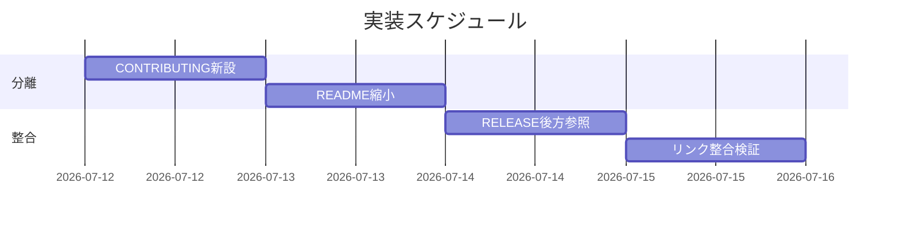
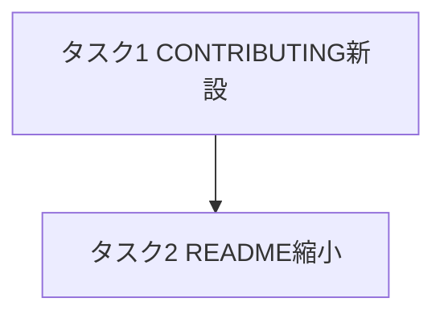
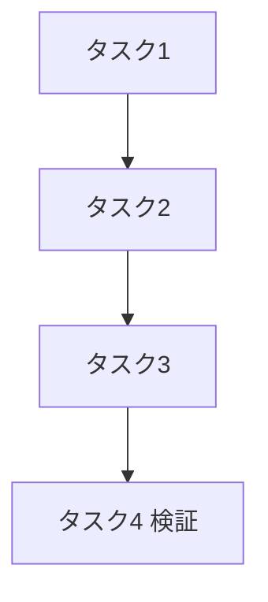

# 実装計画書: README.md の読者分離

**プロジェクト名**: README.md の読者分離
**作成日**: 2026 年 07 月 12 日
**最終更新**: 2026 年 07 月 12 日

> **重要**: **このドキュメントは常に更新**: 実装計画の変更・進捗・バグがあれば即座に更新すること。
> **必須項目**: 「必須」欄は空欄・抽象語のみで提出しない。
>
> **用語**: [.agent-skill-chain/source/CONCEPTS.md §用語規約](../../../../.agent-skill-chain/source/CONCEPTS.md#用語規約) を参照。

---

## 1. 実装概要

### 1.1 実装方針（必須）

02_設計に従い、markdown 3 ファイル（`README.md` 縮小・`CONTRIBUTING.md` 新設・`docs/maintainer/RELEASE.md` 後方参照更新）のみを編集する。移設は本文を書き換えず切り出し、詳細は既存 `docs/maintainer/*` へ要約リンクで委譲する（DRY）。CLI・スクリプト・enforcement は変更しない。

### 1.2 実装順序（必須: 1 件以上）

1. **タスク 1**: CONTRIBUTING.md 新設（移設先を先に用意）— 優先度: 高
2. **タスク 2**: README.md 縮小・再構成 — 優先度: 高
3. **タスク 3**: RELEASE.md 後方参照の整合更新 — 優先度: 中
4. **タスク 4**: リンク整合・受け入れ検証（grep）— 優先度: 高



---

## 2. タスク分解

**必須**: 各タスクに「テスト観点」（2.x.3）と「単体テスト仕様（BDD）」（2.x.4）を記載。観点定義は 02 §6 と [RULES §テスト戦略必須要件](../../../../.agent-skill-chain/source/RULES.md#テスト戦略必須要件)・[TEST_BDD_FORMAT.md](../../../../.agent-skill-chain/source/TEST_BDD_FORMAT.md) を参照。

### 2.1 タスク 1: CONTRIBUTING.md 新設

#### 2.1.1 概要（必須）

ルート `CONTRIBUTING.md` を新設し、開発者・自己拡張・メンテナ向けの単一入口とする（02 §2.2.2 の見出しツリー）。

#### 2.1.2 実装内容（必須: 1 件以上）

- ルート `CONTRIBUTING.md` を新規作成。見出し: `## GitHub 直接参照での配備（開発者・自己拡張向け）`／`## 本リポジトリでテストを回す`／`## リリース（メンテナ向け）`／`## さらに詳しく（詳細正本）`。
- 現 README L71-86（`npx github:… init` と展開内容）を §GitHub 直接参照配備 へ本文保持で移設。
- 現 README L179-187（`npm test`/`bash test/run-all.sh`）を §本リポジトリでテストを回す へ移設し、個別実行・前提マトリクス・SKIP 規約は `.agent-skill-chain/source/SETUP.md` §テスト実行 へリンク委譲。
- 現 README L163-165（リリース要約）を §リリース へ移設し、詳細は `docs/maintainer/RELEASE.md` へリンク委譲。
- §さらに詳しく に `docs/maintainer/RELEASE.md`・`adapters.md`・`apm-package.md`・`claude-hook-e2e.md` の一覧リンクを置く（本文複製なし）。
- 歴史的経緯（「README から移した」等）を書かない。

#### 2.1.3 テスト観点（必須）

**参照**: 観点定義は 02 §6・RULES・TEST_BDD_FORMAT。以下は本タスクの具体ケース。

##### 単体（本タスクの具体ケース・必須 1 件以上）

- ルートに `CONTRIBUTING.md` が存在する（`test -f CONTRIBUTING.md`）。
- CONTRIBUTING に `npx github:techbeansjp-free/AGENTS.md init`・`npm test`・リリース要約の 3 ブロックが各 1 回以上含まれる（grep）。
- CONTRIBUTING から `docs/maintainer/RELEASE.md`・`adapters.md`・`apm-package.md`・`claude-hook-e2e.md` への相対リンクが実在ファイルを指す（各リンク先 `test -f`）。
- 異常系（境界）: RELEASE.md 本文（例: 「version-bump」ジョブ手順）が CONTRIBUTING に複製されていない（grep で不在）。

##### 結合/API（本タスクの具体ケース・該当時は必須 1 件以上）

- 該当なし（API なし）。

##### E2E/受け入れ（本タスクの具体ケース・未達時は理由記載）

- review-docs にて、開発者が CONTRIBUTING 1 ファイルから GitHub 直接参照・テスト・リリースへ辿れることを人手確認（自動 E2E なし＝ドキュメントのため）。

##### バリデーション（該当する場合の具体ケース）

- 該当なし。

#### 2.1.4 単体テスト仕様（BDD）（必須）

```gherkin
Feature: CONTRIBUTING.md の新設（開発者・メンテナ入口）
  Scenario: 移設3ブロックと委譲リンクが揃う
    Given README から GitHub直接参照・自リポテスト・リリース要約を切り出した
    When ルート CONTRIBUTING.md を新設する
    Then CONTRIBUTING.md に3ブロックが存在する
    And docs/maintainer/* への委譲リンクが解決し、RELEASE.md 本文は複製されていない
```

```bash
# Given: CONTRIBUTING.md を新設した後のリポジトリルートで検証する
# When: 移設ブロックと委譲リンク・非複製を静的検査する
# Then: 3ブロック存在・リンク解決・RELEASE本文非複製を確認する
test -f CONTRIBUTING.md
grep -q "npx github:techbeansjp-free/AGENTS.md init" CONTRIBUTING.md
grep -q "npm test" CONTRIBUTING.md
for f in RELEASE adapters apm-package claude-hook-e2e; do test -f "docs/maintainer/$f.md"; done
! grep -q "version-bump" CONTRIBUTING.md   # RELEASE 詳細本文の非複製
```

#### 2.1.5 依存関係

- なし（先頭タスク。移設先を先に用意する）。

#### 2.1.6 見積もり

- **工数**: 0.5h ／ **優先度**: 高

### 2.2 タスク 2: README.md 縮小・再構成

#### 2.2.1 概要（必須）

README から開発者・メンテナ限定の 3 ブロックを除去し、利用者向け操作を独立トップレベル節へ再配置する（02 §2.2.1）。

#### 2.2.2 実装内容（必須: 1 件以上）

- 現 §71「### 1. GitHub 直接参照（開発者・自己拡張向け…）」見出し＋ init 導入 lede（L71-86）を削除（内容はタスク 1 で移設済み）。
- 現 L87-150（サブコマンド表・版のピン留め・アンインストール・enforcement opt-in）を独立トップレベル `## 配備後の管理（CLI）` へ再配置。本文は保持、ネストのみ解消（`npx github:…` 形式は ADR-2 により維持）。
- 現 §163「#### リリース手順（メンテナ向け）」（L163-165）を削除（要約はタスク 1 で移設済み）。
- 現 §動作確認 後半 L179-187（self-repo テスト）を削除（移設済み）。前半（採用先配備確認）は残置。
- 導入配下の数字接頭辞を除去（ADR-3）: `### apm 経由（推奨）`／`### Claude marketplace 経由`／`### ローカル配備`。
- **`## 導入（プロジェクトへ配備するとき）` 見出しは一字も変更しない**（アンカー保全）。
- §導入 lede に「開発者・自己拡張向けの GitHub 直接参照配備は [CONTRIBUTING.md] を参照」を追記。§入口と参照 表に CONTRIBUTING.md 行を追加。

#### 2.2.3 テスト観点（必須）

##### 単体（本タスクの具体ケース・必須 1 件以上）

- README に「GitHub 直接参照（開発者・自己拡張向け」および「リリース手順（メンテナ向け）」の見出しが存在しない（grep 不在）。
- README に `## 配備後の管理` 見出しが存在し、その配下にサブコマンド表（`init [dir]` 等の行）と `enforce on` が含まれる（grep）。
- `## 導入（プロジェクトへ配備するとき）` が完全一致で残存する（アンカー保全、grep 完全一致）。
- README に `npm test` / `bash test/run-all.sh` が残っていない（self-repo テストの除去、grep 不在）。
- README から CONTRIBUTING.md への到達リンクが 1 つ以上ある（grep）。
- 異常系（境界）: 数字接頭辞 `### 0.`・`### 1.`・`### 3.` が導入配下に残らない（grep 不在）。

##### 結合/API（本タスクの具体ケース・該当時は必須 1 件以上）

- 該当なし。

##### E2E/受け入れ（本タスクの具体ケース・未達時は理由記載）

- review-docs にて、利用者が README のみで概要・導入・配備後管理・アンインストール・動作確認を完結できることを人手確認。

##### バリデーション（該当する場合の具体ケース）

- 該当なし。

#### 2.2.4 単体テスト仕様（BDD）（必須）

```gherkin
Feature: README の読者分離（利用者向け特化）
  Scenario: 開発者・メンテナ限定見出しの除去と操作節の独立化
    Given README に開発者・メンテナ限定見出しと、その配下にネストした利用者向け操作がある
    When 読者分離の再構成を適用する
    Then 読者を限定する見出しが README から消える
    And 利用者向け操作は独立節「配備後の管理（CLI）」に存在する
    And 「導入（プロジェクトへ配備するとき）」見出しは不変でアンカーが保たれる
```

```bash
# Given: 再構成後のリポジトリルートで README を検証する
# When: 見出しの不在/存在とアンカー保全を静的検査する
# Then: 限定見出し除去・操作節独立・アンカー不変・self-repoテスト除去を確認する
! grep -qE "GitHub 直接参照（開発者・自己拡張向け|リリース手順（メンテナ向け）" README.md
grep -q "^## 配備後の管理" README.md
grep -qF "## 導入（プロジェクトへ配備するとき）" README.md   # アンカー保全
! grep -qE "npm test|bash test/run-all.sh" README.md          # self-repo テスト除去
grep -q "CONTRIBUTING.md" README.md
```

#### 2.2.5 依存関係

- タスク 1（移設先 CONTRIBUTING.md を先に用意）。



#### 2.2.6 見積もり

- **工数**: 1h ／ **優先度**: 高

### 2.3 タスク 3: RELEASE.md 後方参照の整合更新

#### 2.3.1 概要（必須）

`docs/maintainer/RELEASE.md` のリリース入口の所在記述（2 箇所）を README → CONTRIBUTING へ更新する。詳細本文は不変。

#### 2.3.2 実装内容（必須: 1 件以上）

- L3: 「README §リリース手順は入口リンクと要約のみを持ち…」→「CONTRIBUTING.md §リリース は入口リンクと要約のみを持ち…」。
- L84: 参照行を `[`CONTRIBUTING.md`](../../CONTRIBUTING.md) §リリース — 入口リンク・要約` に更新。
- 相対パス `../../CONTRIBUTING.md` がリポジトリルートの CONTRIBUTING.md を指すことを確認。

#### 2.3.3 テスト観点（必須）

##### 単体（本タスクの具体ケース・必須 1 件以上）

- RELEASE.md 冒頭・参照節が README ではなく CONTRIBUTING.md を入口として指す（grep）。
- `docs/maintainer/RELEASE.md` から `../../CONTRIBUTING.md` が実在ファイルへ解決する（`test -f`）。
- 異常系: RELEASE.md にリリース手順の詳細本文が引き続き存在する（削除・重複移設していない、grep で `version-bump` 等の存在確認）。

##### 結合/API（該当時は必須 1 件以上）

- 該当なし。

##### E2E/受け入れ（未達時は理由記載）

- review-docs にて、RELEASE.md 詳細正本の位置づけが保たれ、入口が CONTRIBUTING に整合していることを人手確認。

##### バリデーション（該当する場合）

- 該当なし。

#### 2.3.4 単体テスト仕様（BDD）（必須）

```gherkin
Feature: RELEASE.md 後方参照の整合
  Scenario: リリース入口の所在を CONTRIBUTING へ更新
    Given RELEASE.md 冒頭が "README §リリース手順は入口…" と記述している
    When リリース要約の入口を CONTRIBUTING.md へ移す
    Then RELEASE.md の後方参照が CONTRIBUTING.md を指す
    And RELEASE.md の詳細本文は残り、重複コピーもされていない
```

```bash
# Given: RELEASE.md を更新した後の docs/maintainer で検証する
# When: 後方参照の指す先と詳細本文の残存を静的検査する
# Then: 入口が CONTRIBUTING・パス解決・詳細本文残存を確認する
grep -q "CONTRIBUTING.md" docs/maintainer/RELEASE.md
test -f docs/maintainer/../../CONTRIBUTING.md
grep -q "version-bump" docs/maintainer/RELEASE.md   # 詳細正本は RELEASE.md に残る
```

#### 2.3.5 依存関係

- タスク 1（CONTRIBUTING.md §リリース の存在が前提）。

#### 2.3.6 見積もり

- **工数**: 0.25h ／ **優先度**: 中

### 2.4 タスク 4: リンク整合・受け入れ検証

#### 2.4.1 概要（必須）

分割後にリポジトリ内リンク・アンカー・受け入れ基準が満たされることを grep ベースで検証し、既存テストスイートの非回帰を確認する。

#### 2.4.2 実装内容（必須: 1 件以上）

- 外部参照 2 箇所（`.agent-skill-chain/source/SETUP.md:191`・`docs/maintainer/claude-hook-e2e.md:14`）の `README.md#導入プロジェクトへ配備するとき` が §導入 見出しへ解決することを確認（見出し不変で保証）。
- README・CONTRIBUTING から `docs/maintainer/*` への全リンクが実在ファイルへ解決することを確認。
- README・CONTRIBUTING・RELEASE.md に歴史的経緯の記述が無いことを確認。
- `bash test/run-all.sh` を実行し、本変更で FAIL を増やさないこと（特に `test-check-comment-refs.sh` を markdown リンクで誤発火させないこと）を確認。

#### 2.4.3 テスト観点（必須）

##### 単体（本タスクの具体ケース・必須 1 件以上）

- `grep -rn "README.md#導入プロジェクトへ配備するとき"` の全ヒットが解決可能（§導入 見出しが完全一致で存在）。
- README・CONTRIBUTING 内 `docs/maintainer/xxx.md` リンクの各先が `test -f` を満たす。
- 異常系: README・CONTRIBUTING・RELEASE に「移した」「かつては」等の歴史記述が無い（grep 不在）。

##### 結合/API（該当時は必須 1 件以上）

- `bash test/run-all.sh` の末尾サマリで FAIL が本変更前と同数以下（test_output で証跡化）。

##### E2E/受け入れ（未達時は理由記載）

- 受け入れ基準（00 §6・01 §2.1）全 5 項目を review-docs で ○/× 判定。自動 E2E は無し（ドキュメント再編のため）。

##### バリデーション（該当する場合）

- 該当なし。

#### 2.4.4 単体テスト仕様（BDD）（必須）

```gherkin
Feature: 分割後のリンク整合と非回帰
  Scenario: 外部アンカー保全・リンク解決・既存テスト非回帰
    Given SETUP.md と claude-hook-e2e.md が README §導入 アンカーを参照している
    When 読者分離の実装が完了する
    Then 当該アンカーが解決し、docs/maintainer への全リンクも解決する
    And bash test/run-all.sh が本変更で FAIL を増やさない
```

```bash
# Given: 実装完了後のリポジトリルートで横断検証する
# When: アンカー解決・全リンク解決・既存テスト実行を行う
# Then: リンク切れ0件・テスト非回帰を確認する
grep -qF "## 導入（プロジェクトへ配備するとき）" README.md   # 参照先アンカーの実在
grep -rn "README.md#導入プロジェクトへ配備するとき" .agent-skill-chain/source/SETUP.md docs/maintainer/claude-hook-e2e.md
bash test/run-all.sh   # 末尾サマリ 合計/PASS/FAIL/SKIP と exit code を確認
```

#### 2.4.5 依存関係

- タスク 1・2・3 完了後。



#### 2.4.6 見積もり

- **工数**: 0.5h ／ **優先度**: 高

---

## テスト観点

- **リンク整合**: §導入 アンカー保全、README/CONTRIBUTING→docs/maintainer リンク解決、README/RELEASE→CONTRIBUTING リンク解決（リンク切れ 0 件）。
- **読者分離**: 開発者・メンテナ限定見出しの README 不在、利用者向け操作の独立節化、self-repo テストの README 不在。
- **DRY・履歴排除**: RELEASE.md 詳細本文の CONTRIBUTING 非複製、歴史記述の不在。
- **非回帰**: `bash test/run-all.sh` の FAIL 非増加。

## 単体テスト

各タスク §2.x.4 の BDD・シェル検証で担保（ドキュメント再編のため grep/test -f ベースの静的検証を単体テストと位置づける）。

## BDD

- タスク 1: CONTRIBUTING 新設（移設 3 ブロック＋委譲リンク）。
- タスク 2: README 読者分離（限定見出し除去・操作節独立・アンカー保全）。
- タスク 3: RELEASE.md 後方参照整合。
- タスク 4: リンク整合・非回帰。
- 01 §2.2 の 4 シナリオ（開発者見出し除去／利用者操作残置／README §導入 外部参照維持／RELEASE 後方参照整合）と対応。

---

## 3. 実装スケジュール

### 3.1 マイルストーン

| マイルストーン | 期日 | 成果物 |
| ---- | ---- | ---- |
| 分離先の用意 | 2026-07-12 | CONTRIBUTING.md |
| README 縮小 | 2026-07-12 | README.md（利用者向け） |
| 整合・検証 | 2026-07-12 | RELEASE.md 更新・検証ログ |

### 3.2 実装フェーズ

#### フェーズ 1: 分離

- **タスク**: タスク 1・2

#### フェーズ 2: 整合

- **タスク**: タスク 3・4

---

## 4. テスト計画

観点・BDD 形式の定義は 02 §6・RULES・TEST_BDD_FORMAT を参照。本計画では各タスク §2.x.3 に具体ケース、§2.x.4 に BDD を記載済み。

### 4.1 テストの優先順位

- リンク整合（外部アンカー保全）とREADME 見出し不在を最優先で検証（受け入れ基準の中核）。
- `bash test/run-all.sh` を回帰確認に必ず含める。

---

## 5. リスク管理

### 5.1 実装リスク

- **リスク**: §導入 見出しを誤って変更しアンカーが切れる。
  - **対策**: タスク 2 で見出し完全一致 grep を必須チェックに含める（`grep -qF "## 導入（プロジェクトへ配備するとき）"`）。
- **リスク**: 移設時に RELEASE.md 詳細を CONTRIBUTING へ書き写し重複が生じる。
  - **対策**: CONTRIBUTING は要約＋リンクのみ。タスク 1・3 で `version-bump` 等の詳細語の非複製を grep 検証。
- **リスク**: `npx github:…` 例を apm へ誤置換し事実と乖離（apm は CLI bin を導入しない）。
  - **対策**: ADR-2 に従い管理 CLI は `npx github:…` を維持。

---

## 6. 参考資料

### プロジェクトドキュメント

- [`02_設計.md`](./02_設計.md) - 設計
- [`00_要求定義.md`](./00_要求定義.md) / [`01_要件定義.md`](./01_要件定義.md)

### その他の参考資料

- 既存テストスイート: `test/run-all.sh`（`test-check-comment-refs.sh` はコード**コメント**外部参照を対象とし markdown リンクは対象外）

---

## 7. 前のステップ

- **前**: [`02_設計.md`](./02_設計.md) - 設計フェーズ

---

## 8. 次のステップ

- 本 issue は 1 issue で完結（サブ issue 分割なし）。**implement-feature 着手前に review-docs（実装前ドキュメントレビュー）を必須ゲートとして経る**。
