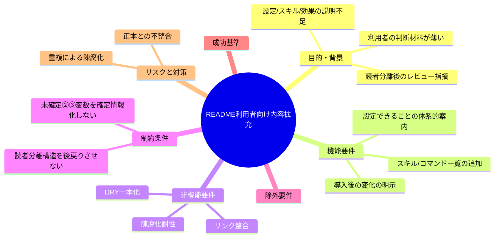
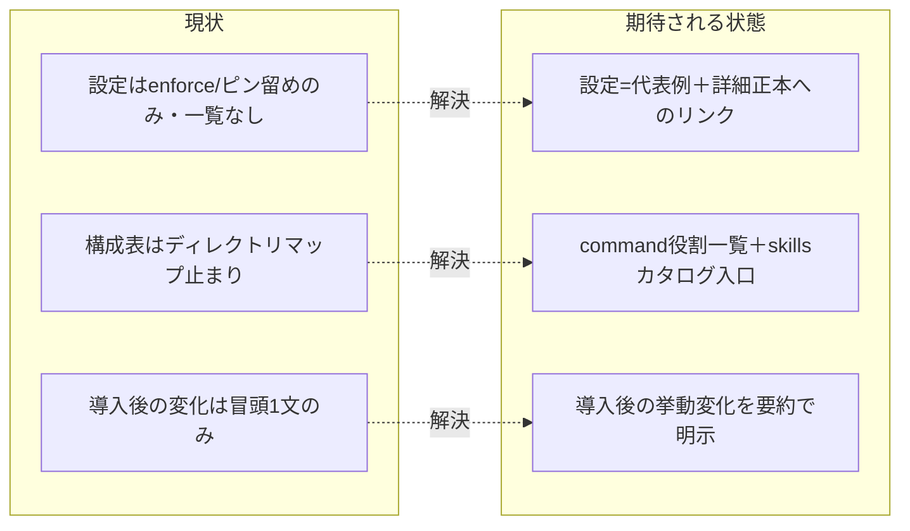

# 要求定義書: README 利用者向け内容の拡充（設定一覧・スキル/コマンド一覧・導入後の変化）

**プロジェクト名**: README 利用者向け内容の拡充
**作成日**: 2026 年 07 月 13 日
**最終更新**: 2026 年 07 月 13 日

> **重要**:
>
> - 要求定義書は、プロジェクトの全体像を把握するためのものです。詳細な技術仕様や実装方法は要件定義書以降で記載します。必要最低限の情報に収めることを心掛けてください。
> - **このドキュメントは常に更新**: 要求の変更や追加があった場合は、即座にこのドキュメントを更新してください。
>
> **用語**: [.agent-skill-chain/source/CONCEPTS.md §用語規約](../../../../.agent-skill-chain/source/CONCEPTS.md#用語規約) を参照。

---

## 要求定義の全体像

**注意**:

- マインドマップは全体像の把握用であり、主要セクション名程度に留める。

---

## 1. 目的・背景

### 1.1 目的（必須）

README の利用者向けセクションに設定・スキル・導入効果の説明を拡充する。

### 1.2 背景

- **現状の課題**（別 issue「README 読者分離」完了・commit `78b3517` の成果物を精読して確認）:
  - **設定できること**: 部分的。`enforce on/off`（enforcement opt-in・README §「enforcement の opt-in（既定 off）」）と版のピン留め（README §「配備後の管理（CLI）」）は記載されているが、**利用者が触れる設定項目（環境変数等）の体系的な一覧・入口が README に無い**。実際には正本 [.agent-skill-chain/source/enforcement/README.md](../../../../.agent-skill-chain/source/enforcement/README.md) に `WORKFLOW_DIRS`（audit 走査スコープ）・監査ゲートの発効日プレフィックス等、利用者が調整しうる設定が存在するが、README からその入口が案内されていない。
  - **アーキテクチャ・スキル一覧**: 弱い。README §「.agents 配下の構成」（README 現行の構成表）は**ディレクトリマップ止まり**で、`skills/` 配下の実際の能力一覧（7 ドメイン・14 capability）や、各 command（`requirement-discovery` / `design-feature` / `implement-feature` / `verify-and-close` / `review-docs` / `create-pr-review-issue` の 6 種）が**何をするか**の説明が無い。「導入すると何が使えるか」が利用者に伝わらない。
  - **導入すると何が変わるか**: 弱い。README 冒頭 1 文（「AI に『.agents に従って』と指示すると、フェーズ（要求→要件→設計→実装計画→実装→レビュー）に沿って動く」）のみで、**AI の挙動が具体的にどう変わるか**（進行役＝orchestrator が実作業を必ずサブに委譲する、phase gate に沿って command を回す、enforcement 有効時に何が制約されるか、証跡が workflow.db に残る等）が説明されていない。導入判断に必要な「導入後の姿」が伝わらない。
- **必要性**:
  - 「README 読者分離」issue の成果物をユーザーがレビューした結果、次の要求が出された（原文）:「readme で、設定できることはなにか？インストール方法は？アンインストール方法は？アーキテクチャやスキル一覧は？などなど利用者向けにこれがどんなものでどう導入し、導入するとどうなるのかを明示している？」。インストール／アンインストール方法は読者分離で充実済みだが、**設定・スキル/アーキテクチャ・導入後の変化**の 3 点は不足しており補う必要がある。
  - 利用者が「これがどんなもので、導入すると何が使え、AI がどう動くようになるか」を README 単体で判断できる状態にする必要がある。

### 1.3 期待される効果（必須: 1 件以上）

- **効果 1**: README の利用者が「設定できること」の全体像と詳細正本への入口を得られる（README に設定項目の代表例＋詳細正本 [enforcement/README.md](../../../../.agent-skill-chain/source/enforcement/README.md) 等へのリンクが存在することを○/×で判定できる）。
- **効果 2**: README の利用者が「導入すると何が使えるか」（command の一覧と各 command の役割、skills の能力群）を把握できる（README に 6 command の役割一覧と skills カタログ入口が存在することを○/×で判定できる）。
- **効果 3**: README の利用者が「導入すると AI の挙動がどう変わるか」を把握できる（README に phase 進行・サブ委譲・enforcement 有効時の制約・証跡の残り方の要約が存在することを○/×で判定できる）。

**現状と期待される状態の比較**:

---

## 2. 機能要件

### 2.1 既存機能の維持（該当する場合）

- 「README 読者分離」issue（commit `78b3517`）で確立した**読者分離構造を維持する**: README = 利用者向けマニュアル、[CONTRIBUTING.md](../../../../CONTRIBUTING.md) = 開発者・自己拡張・メンテナ向け、[docs/maintainer/RELEASE.md](../../RELEASE.md) = リリース詳細正本。本 issue はこの分離を後戻りさせず、**README の利用者向けセクションの内容のみを拡充**する。
- README に既にある利用者向け情報（システム概要・「何がどこに置かれるか」・.agents 構成表・apm 導入・marketplace 導入・ローカル配備・アンインストール・enforcement opt-in・CLI サブコマンド表・版ピン留め・入口と参照）はそのまま維持する。

### 2.2 新規機能要件

3 つの拡充対象を README の利用者向けセクションに追加する。いずれも**「README には代表例＋要約、詳細は既存正本へリンク」**方針（DRY・既存の「要約＋リンク」パターン踏襲）を軸とする。

1. **設定できること（設定一覧）の案内**: 利用者が触れる設定を README に体系的に案内する。README には (a) enforcement opt-in（`enforce on/off` 既定 off・既に記載あり）、(b) 版のピン留め（既に記載あり）、(c) その他の調整可能な設定（audit 走査スコープ等の環境変数群）の**代表例＋カテゴリ**を示し、**全カタログは詳細正本 [enforcement/README.md](../../../../.agent-skill-chain/source/enforcement/README.md) 等へリンクで委譲**する。個別の環境変数を README 本体に全列挙しない（下記 §5・§7 の陳腐化回避）。
2. **スキル一覧・アーキテクチャ説明の追加**: ディレクトリマップ止まりの構成表を補い、(a) **command の役割一覧**（`requirement-discovery` / `design-feature` / `implement-feature` / `verify-and-close` / `review-docs` / `create-pr-review-issue` が各々何をするか、各 1 行）と、(b) **skills（能力）のドメイン群**（requirements / architecture / implementation / testing / review / logging / agent）の概要を README に載せる。個別 capability の詳細カタログは正本 [.agent-skill-chain/source/README.md](../../../../.agent-skill-chain/source/README.md) の索引へリンクで委譲する。
3. **導入すると何が変わるかの明示**: 「AI に .agents に従わせると挙動がどう変わるか」を README に要約で載せる。含める観点は (a) 進行役（orchestrator）が実作業を必ずサブに委譲する、(b) phase gate に沿って要求→要件→設計→実装計画→実装→レビューを command で回す、(c) enforcement を opt-in すると orchestrator の直接 Write/Edit/Bash 等が制約される、(d) 証跡が workflow.db に残る。**思想は新規に書き起こさず**、既存正本 [.agent-skill-chain/source/CONCEPTS.md](../../../../.agent-skill-chain/source/CONCEPTS.md)・[.agent-skill-chain/source/GETTING_STARTED.md](../../../../.agent-skill-chain/source/GETTING_STARTED.md) の説明を要約し、詳細はそれらへリンクで委譲する。

### 2.3 拡充対象の切り分け（精読に基づく現状分析・確定は 01）

| 拡充対象 | README 現状 | 材料となる正本（リンク委譲先） | 措置（方針） |
|---|---|---|---|
| **① 設定できること** | `enforce on/off`・版ピン留めのみ。環境変数等の一覧なし | [enforcement/README.md](../../../../.agent-skill-chain/source/enforcement/README.md)（強制設定・ツール別強制力・監査ゲート／走査スコープ等の設定の正本） | 代表例＋カテゴリを README に、全カタログは正本へリンク |
| **② スキル/コマンド一覧・アーキテクチャ** | 構成表はディレクトリマップ止まり | [.agent-skill-chain/source/README.md](../../../../.agent-skill-chain/source/README.md)（skills/commands 索引）、[commands/](../../../../.agent-skill-chain/source/commands/) 配下 6 ファイル | command 役割一覧＋skills ドメイン概要を README に、詳細は正本索引へリンク |
| **③ 導入後の変化** | 冒頭 1 文のみ | [CONCEPTS.md](../../../../.agent-skill-chain/source/CONCEPTS.md)、[GETTING_STARTED.md](../../../../.agent-skill-chain/source/GETTING_STARTED.md) | 挙動変化の要約を README に、思想詳細は正本へリンク |

---

## 3. 非機能要件

### 3.1 パフォーマンス

- 該当なし（ドキュメント拡充のみ。ランタイム性能への影響なし）。

### 3.2 セキュリティ

- 該当なし。

### 3.3 互換性

- 「README 読者分離」で残置・新設した見出し・アンカーおよび外部からの参照リンクを壊さない（拡充は既存見出しへの追記または新規節の追加で行い、既存アンカーを維持する）。

### 3.4 保守性

- **DRY**: 設定の全カタログ・思想・スキル詳細を README にコピーせず、既存正本（enforcement/README.md・source/README.md・CONCEPTS.md・GETTING_STARTED.md）に一本化し、README は要約＋リンクで接続する。
- **陳腐化耐性**: 並行 issue ②③（close 移動監査強制・GitHub Issue 起票ゲート追加）が追加中の環境変数・設定は流動的である。README 本体に個別変数名を全列挙すると ②③ の実装が進むたびに陳腐化する。README は「設定のカテゴリ＋代表例＋正本リンク」に留め、個別変数の網羅は正本側に委ねる。
- **歴史記述の排除**: README・正本に「拡充した」「以前は無かった」等の経緯を残さない（現在の事実のみ。プロジェクト方針「README/コメントは現在の事実のみ」に従う）。

---

## 4. 制約条件

### 4.1 技術的制約

- 成果物は markdown ドキュメントの拡充に限る（README.md への追記・新規節、必要に応じたリンク補正）。CLI・スクリプト・enforcement ロジック・実行契約（`.agent-skill-chain/source/` の仕様本体）は変更しない。

### 4.2 既存システムとの互換性

- 「README 読者分離」（commit `78b3517`・本 worktree の分岐元）の分離構造（README＝利用者向け／CONTRIBUTING＝開発者向け／RELEASE.md＝リリース詳細）を後戻りさせない。開発者・メンテナ向け内容を README に戻さない。
- `.agent-skill-chain/project/自己拡張ワークフロー.md` の名前空間・git 追跡ルールに従う（本 issue 成果は `docs/maintainer/workflow/` 配下・追跡対象）。

### 4.3 移行期間・スケジュール

- 単一 issue として要求→要件→設計→実装計画→実装→レビューの標準フローで進める。段階リリース不要。

---

## 5. 除外要件

- **本 issue は requirement-discovery（00・01）までを範囲とする**。設計（02）・実装計画（03）・実装には進まない。
- 並行して別ブランチで進行中の 2 issue が追加する**個別の環境変数名・設定名を確定情報として 00/01 に書き込まない**（陳腐化回避。README では「将来追加されうる設定群をどう体系的に案内するか」という一般要件として扱う）:
  - `docs/maintainer/workflow/20260712_181917_close移動監査強制/`（close 移動監査強制。`CLOSE_MOVE_*` 相当の環境変数を追加中）
  - `docs/maintainer/workflow/20260712_175901_GitHubIssue起票ゲート追加/`（GitHub Issue 起票ゲート。`GITHUB_ISSUE_GATE_*` 相当・プロジェクト全体でゲート無効化する設定を追加中）
- インストール方法・アンインストール方法の記述は「README 読者分離」で充実済みのため**本 issue の拡充対象外**（変更不要）。
- README 以外の利用者向け文書（CONTRIBUTING.md 等）の内容拡充は対象外。

---

## 6. 成功基準（必須: 1 件以上）

- README の利用者向けセクションに、設定項目の**代表例＋カテゴリ**と、詳細正本（[enforcement/README.md](../../../../.agent-skill-chain/source/enforcement/README.md) 等）への**入口リンク**が存在する（○/×）。
- README に **6 つの command の役割一覧**（各 command が何をするか）が存在する（○/×）。
- README に **skills のドメイン群の概要**と、詳細カタログ正本（[.agent-skill-chain/source/README.md](../../../../.agent-skill-chain/source/README.md)）への入口リンクが存在する（○/×）。
- README に「導入すると AI の挙動がどう変わるか」の要約（phase 進行・サブ委譲・enforcement 有効時の制約・証跡）が存在する（○/×）。
- 個別の環境変数の全列挙が README 本体に無く、詳細正本へのリンクで委譲されている＝②③ の実装進行で README が陳腐化しない構造である（○/×）。
- README・正本に歴史的経緯の記述がなく、既存正本の内容が重複コピーされていない（○/×）。
- 「README 読者分離」の分離構造（README＝利用者向け／CONTRIBUTING＝開発者向け）が維持され、開発者向け内容が README に戻っていない（○/×）。

---

## 7. リスクと対策

### 7.1 技術的リスク

- **リスク**: 設定・スキル・思想を README に書き写し、正本（enforcement/README.md・source/README.md・CONCEPTS.md 等）と重複して二重管理・陳腐化する。
  - **対策**: README は要約＋リンクに徹し、詳細は既存正本に一本化する（既存の「要約＋リンク」パターン踏襲を要件化）。
- **リスク**: 未確定の ②③ の環境変数名を README/00/01 に確定情報として書き、実装確定時にリンク切れ・不整合になる。
  - **対策**: 個別変数名を書かず「設定カテゴリ＋代表例＋正本リンク」に留める。全カタログの網羅は正本側に委ねる。

### 7.2 スケジュールリスク

- **リスク**: 並行 issue ②③ と README の編集範囲が競合する。
  - **対策**: 独立ブランチ `docs/readme-user-content-enrichment` で作業。README には個別変数を書かず正本リンクに委譲するため、②③ の正本更新と競合しにくい構造にする。

---

## 8. 参考資料

### プロジェクトドキュメント

- [`01_要件定義.md`](./01_要件定義.md) - 要件定義
- 対象: リポジトリルート [`README.md`](../../../../README.md)
- 分岐元 issue: [`docs/maintainer/workflow/20260712_182212_READMEの読者分離/`](../20260712_182212_READMEの読者分離/00_要求定義.md)（commit `78b3517`）
- 材料正本: [enforcement/README.md](../../../../.agent-skill-chain/source/enforcement/README.md)、[.agent-skill-chain/source/README.md](../../../../.agent-skill-chain/source/README.md)、[CONCEPTS.md](../../../../.agent-skill-chain/source/CONCEPTS.md)、[GETTING_STARTED.md](../../../../.agent-skill-chain/source/GETTING_STARTED.md)
- 名前空間・git 追跡: [`.agent-skill-chain/project/自己拡張ワークフロー.md`](../../../../.agent-skill-chain/project/自己拡張ワークフロー.md)

### その他の参考資料

- ユーザー要求（原文）:「readme で、設定できることはなにか？インストール方法は？アンインストール方法は？アーキテクチャやスキル一覧は？などなど利用者向けにこれがどんなものでどう導入し、導入するとどうなるのかを明示している？」

---

## 9. 次のステップ

この要求定義書の承認後、以下のドキュメントを作成します：

- **次**: [`01_要件定義.md`](./01_要件定義.md) - 要件定義フェーズ
