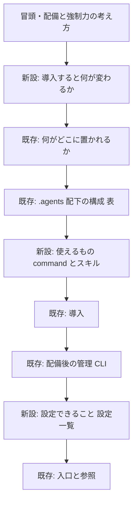

# 設計書: README 利用者向け内容の拡充（設定一覧・スキル/コマンド一覧・導入後の変化）

**プロジェクト名**: README 利用者向け内容の拡充
**作成日**: 2026 年 07 月 13 日
**最終更新**: 2026 年 07 月 13 日

> **重要**: **このドキュメントは常に更新**: 設計の変更や追加があった場合は、即座にこのドキュメントを更新してください。実装内容と常に同期させます。
>
> **用語**: [.agent-skill-chain/source/CONCEPTS.md §用語規約](../../../../.agent-skill-chain/source/CONCEPTS.md#用語規約) を参照。

---

## 1. 設計概要

**必須**: 設計方針・原則は [.agent-skill-chain/source/spec/01\_設計原則.md](../../../../.agent-skill-chain/source/spec/01_設計原則.md) を先に参照した上で、本プロジェクトに適用するものを選び記載する。

### 1.1 設計方針

[`README.md`](../../../../README.md) の利用者向けセクションに、01 の 3 ストーリー（①設定一覧・②スキル/コマンド一覧・③導入後の変化）を**「要約＋代表例、詳細は既存正本へリンク」**方針で追記する。詳細（設定の全カタログ・skills 詳細・思想）は README に書き写さず、既存正本 1 か所に一本化したまま入口リンクで接続する。

加えて、01 ストーリー 4（追加スコープ④）に基づき、**導入先へ配布される** [`.agent-skill-chain/source/SETUP.md`](../../../../.agent-skill-chain/source/SETUP.md)・[`AGENTS.md`](../../../../AGENTS.md)・[`CLAUDE.md`](../../../../CLAUDE.md) に、`init`/`upgrade`/`enforce`/`uninstall` の実行コマンド自体とその導線を追加する。README.md は配布されないため、SETUP.md 側は README を前提とせず自己完結させる（README のコマンド例と内容整合させつつ、SETUP.md 内にも実体を持たせる）。

### 1.2 設計原則（本プロジェクトで適用するもの）

- **UNIX哲学**: README は「利用者向けの入口」という 1 つのことをうまくやる。詳細正本を組み合わせて参照させる。
- **単一責務**: 設定の全カタログ・思想・skills 詳細の正本は既存ファイルに 1 か所。README は要約＋リンクに徹し二重管理を作らない。
- **AIフレンドリー設計**: 見出しは意図が分かる日本語、追記は既存の表・要約＋リンクの書式に整合させる。

---

## 2. アーキテクチャ設計

### 2.1 責務・境界・参照関係

#### 2.1.1 責務一覧

| コンポーネント | 責務（1 文） |
| -------------- | ------------ |
| README.md（本 issue 追記部） | 利用者に設定・使えるもの・導入後の変化を要約で示し、詳細正本への入口を張る |
| enforcement/README.md（正本・変更しない） | 強制設定・監査ゲート・走査スコープ等の設定カタログの正本 |
| source/README.md（正本・変更しない） | skills / commands の索引の正本 |
| CONCEPTS.md・GETTING_STARTED.md（正本・変更しない） | 思想・メイン/サブの役割・1 issue の回し方の正本 |
| SETUP.md（本 issue 追記部・④） | 配布先で `init`/`upgrade`/`enforce`/`uninstall` の実行コマンド自体を提示する（配布物単体で完結） |
| AGENTS.md・CLAUDE.md（本 issue 追記部・④） | 配布先から SETUP.md の実行コマンド節への導線を提供する |

#### 2.1.2 境界

- **入力**: 既存正本（enforcement/README.md・source/README.md・CONCEPTS.md・GETTING_STARTED.md・commands/ 配下 6 ファイル）の記述。
- **出力**: README.md への追記 3 節（設定・command とスキル・導入後の変化）。
- **他責務との境界**: 正本ファイル本体は変更しない（README からのリンク委譲のみ）。CONTRIBUTING.md・RELEASE.md（開発者・メンテナ向け）には触れない。並行 issue ②③ が追加中の個別環境変数名は確定情報化しない。

#### 2.1.3 参照関係

- README.md（追記部）→ enforcement/README.md（設定カタログ）
- README.md（追記部）→ .agent-skill-chain/source/README.md（skills/commands 索引）
- README.md（追記部）→ CONCEPTS.md / GETTING_STARTED.md（思想）
- 依存の向きは README → 正本の一方向のみ。循環参照なし。

### 2.2 システムアーキテクチャ

- **採用パターン**: ドキュメントの「要約＋リンク（DRY 委譲）」パターン。既存の README §配備後の管理→[docs/maintainer/RELEASE.md](../../RELEASE.md) 分離・§入口と参照で確立済みのパターンを踏襲する。
- **根拠**: spec/01\_設計原則 の単一責務・KISS/YAGNI に基づき、正本の重複コピーを避け陳腐化耐性を確保する（evidence_source: existing_code＝既存 README の分離構造）。

#### 2.2.1 追記構成（README への挿入位置）

既存見出し・アンカーを壊さず、下記 3 節を新設する。挿入位置は利用者の読み順（何であるか → 導入すると何が変わるか → 何がどこに → 使えるもの → 導入手順 → 設定）に沿う。

### 2.3 コンポーネント構成（追記 3 節の具体設計）

#### 追記 A: `## 導入すると何が変わるか`（挿入位置: 冒頭ブロックの直後・「## 何がどこに置かれるか」の前）

冒頭 1 文しか無い「導入後の変化」を、4 観点の箇条書き要約に拡充する。思想は書き起こさず CONCEPTS.md・GETTING_STARTED.md へリンク委譲する。含める 4 観点:

- 進行役（orchestrator）が実作業を必ずサブに委譲する。
- phase gate に沿って 要求 → 要件 → 設計 → 実装計画 → 実装 → レビュー を command で回す。
- enforcement を opt-in（`enforce on`・既定 off）すると orchestrator の直接 Write/Edit/Bash 等が制約される（§配備後の管理（CLI）へ内部リンク）。
- 証跡が workflow.db に残り、監査で検証できる。

#### 追記 B: `## 使えるもの（command とスキル）`（挿入位置: 「## .agents 配下の構成」表の直後）

ディレクトリマップ止まりの構成表を補完する。既存の構成表は変更しない。2 つのサブ表を置く。

- **command（skill chain）表**: 6 command の役割を各 1 行。`requirement-discovery`＝要求/要件と BDD、`design-feature`＝設計と実装計画、`implement-feature`＝実装と単体テスト・証跡、`verify-and-close`＝検証/レビュー/クローズ（04_review）、`review-docs`＝実装前ドキュメントレビュー（実装着手の必須ゲート）、`create-pr-review-issue`＝PR 指摘対応 issue の起票。
- **skills（能力）表**: 7 ドメイン（requirements / architecture / implementation / testing / review / logging / agent）の概要を各 1 行。個別 capability の詳細カタログは [.agent-skill-chain/source/README.md](../../../../.agent-skill-chain/source/README.md) の索引へリンク委譲する。

#### 追記 C: `## 設定できること（設定一覧）`（挿入位置: 「## 配備後の管理（CLI）」節の直後・「## 入口と参照」の前）

設定を 3 カテゴリで示すカテゴリ表を置く。各カテゴリは代表例 1 つと詳細正本リンクのみ。全カタログは列挙しない。

- **enforcement の opt-in**: 代表例 `enforce on/off`（既定 off）。詳細は本 README §配備後の管理（CLI）＋ [enforcement/README.md](../../../../.agent-skill-chain/source/enforcement/README.md)。
- **版のピン留め・アップグレード**: 代表例 `#<tag-or-branch>` での git ref 固定。詳細は本 README §配備後の管理（CLI）。
- **監査・走査スコープ等の環境変数**: 代表例 走査対象ディレクトリ（`WORKFLOW_DIRS`）。全カタログは [enforcement/README.md](../../../../.agent-skill-chain/source/enforcement/README.md)。
- 並行 issue ②③ の個別環境変数名（`CLOSE_MOVE_*` / `GITHUB_ISSUE_GATE_*` 相当）は書かない（陳腐化回避）。

#### 追記 D: SETUP.md への実行コマンド節 ＋ AGENTS.md/CLAUDE.md からの導線（挿入位置は下記 3 箇所）

**SETUP.md**（挿入位置: 「## init / upgrade / uninstall の保持・上書き契約（正本）」見出し直下・結論段落の直後、「### 所有区分」の前）に、次の実行コマンドを README.md §配備後の管理（CLI）と整合する内容で追加する。

- 初回導入（バージョンピン留め含む）: `npx github:techbeansjp-free/AGENTS.md#<tag-or-branch> init`
- アップグレード: `npx github:techbeansjp-free/AGENTS.md upgrade`
- 配備前提の健全性確認: `npx github:techbeansjp-free/AGENTS.md doctor`

また「## enforcement の opt-in（既定 off）」節（既存の `agents-md enforce on/off/status` 表の直後）に、npx 実行形の例を追加する: `npx github:techbeansjp-free/AGENTS.md enforce status|on|off`。

`uninstall` は SETUP.md に既存の「## アンインストール（つけ外し）」節で実行コマンドが既に記載済みのため変更不要。

**AGENTS.md**（挿入位置: 既存「## 変更マップ」表の「コピー対象・セットアップ詳細」行）: 行のラベルに「アップデート（upgrade）」を明示し、SETUP.md の実行コマンド節へ到達しやすくする。

**CLAUDE.md**（挿入位置: 冒頭の箇条書き群。既存は AGENTS.md・.agent-skill-chain/source/・boot/CORE.md への参照のみで SETUP.md への参照が無い）: SETUP.md（セットアップ・アップデートの実行コマンド）への参照を 1 行追加する。

### 2.5 横断設計判断（ADR）

#### ADR-1: 個別環境変数を README に全列挙せずカテゴリ＋代表例＋正本リンクに留める

- **コンテキスト**: 並行 issue ②③ が環境変数・設定を追加中で、README 本体に全列挙すると実装進行のたびに陳腐化する。
- **検討した選択肢**: (a) README に全設定を一覧化する。(b) カテゴリ＋代表例＋正本リンクに留める。
- **決定**: (b) を採用。
- **根拠**: 単一責務・DRY・陳腐化耐性。設定カタログの正本は enforcement/README.md に一本化されており、README が二重管理を作らない（evidence_source: existing_code＝enforcement/README.md の走査スコープ設定記述）。
- **帰結**: ②③ の実装が進んでも README 本体は個別変数を持たないため陳腐化しない。全カタログの網羅責務は正本側が持つ。

#### ADR-2: SETUP.md にも実行コマンドの実体を持たせる（README への参照のみで済ませない）

- **コンテキスト**: README.md は導入先へ配布されないため、導入済みプロジェクトの利用者は SETUP.md・AGENTS.md・CLAUDE.md からしか情報を得られない。ADR-1 の「詳細は正本 1 か所に一本化」原則をそのまま適用すると、SETUP.md は README.md への参照のみを持ち実コマンドを書かない選択肢もあり得る。
- **検討した選択肢**: (a) SETUP.md は README.md への参照リンクのみを持つ（実コマンドは書かない）。(b) SETUP.md 自身にも実行コマンドの実体を記載する。
- **決定**: (b) を採用。
- **根拠**: README.md は配布物ではないため、(a) では配布物だけを持つ利用者が実コマンドに到達できない（本 issue の直接の発端）。「配布物は自己完結させる」（01 §2.3 ビジネスルール）を優先し、既存の「## アンインストール（つけ外し）」節が既に同様のパターン（SETUP.md にも実コマンドを保持しつつ README.md へ相互参照）を採っていることと整合させる（evidence_source: existing_code＝SETUP.md 現行の アンインストール節）。
- **帰結**: `init`/`upgrade`/`enforce` コマンド例は README.md と SETUP.md の 2 箇所に実体を持つ（意図的な例外。DRY の「正本 1 か所」は保持・上書き**契約**の記述側で満たし、利用者向けの**実行コマンド例**は配布境界をまたぐため双方に置く）。

---

## 3. 機能設計

### 3.1 機能 1: README 3 節の追記

#### 3.1.1 概要

README.md の利用者向けセクションに追記 A・B・C を挿入する（既存見出し・アンカーは不変）。

#### 3.1.2 処理フロー

追記 A → B → C の順に既存見出しの前後へ挿入し、全 markdown リンクの解決を検証する。

#### 3.1.3 入力・出力

- **入力**: 既存正本の記述（要約元）。
- **出力**: 追記済み README.md。

#### 3.1.4 エラーハンドリング

- リンク切れが出た場合は挿入位置・相対パスを修正して再検証する。

### 3.2 機能 2: SETUP.md 実行コマンド節 ＋ AGENTS.md/CLAUDE.md 導線の追加

#### 3.2.1 概要

配布物（SETUP.md・AGENTS.md・CLAUDE.md）だけで `init`/`upgrade`/`enforce`/`uninstall` の実行コマンドに到達できるようにする（追記 D）。

#### 3.2.2 処理フロー

SETUP.md に実行コマンド節を追加 → AGENTS.md の変更マップ行を更新 → CLAUDE.md に参照行を追加 → 全 markdown リンクの解決を検証する。

#### 3.2.3 入力・出力

- **入力**: README.md §配備後の管理（CLI）の既存コマンド例。
- **出力**: 追記済み SETUP.md・AGENTS.md・CLAUDE.md。

#### 3.2.4 エラーハンドリング

- README.md のコマンド例と SETUP.md の記載が乖離した場合は README.md 側を正として SETUP.md を合わせる。

---

## 4. データ設計

- 該当なし（データモデル・DB 変更なし。ドキュメント追記のみ）。

---

## 5. API 設計

- 該当なし（CLI・スクリプト・実行契約本体は変更しない）。

---

## 6. テスト戦略

テスト戦略の観点定義は [RULES.md のテスト戦略必須要件](../../../../.agent-skill-chain/source/RULES.md#テスト戦略必須要件) を参照。本 issue はドキュメント追記のため、テストは既存テストスイートの非回帰と markdown リンク解決の検証を割り当てる。

### 6.1 対象ごとのテスト割り当て

| 対象 | 単体 | 結合/API | E2E | クリティカル観点 | バリデーション観点 | 未達理由/補足 |
| ---- | ---- | -------- | --- | ---------------- | ------------------ | ------------- |
| README 追記部 | × | × | × | 3 節が受け入れ基準どおり存在する（目視） | 追記部の相対リンクが全解決（リンク切れ 0 件） | コード変更なし。単体/結合/E2E 非該当 |
| SETUP.md/AGENTS.md/CLAUDE.md 追記部 | × | × | × | 実行コマンド節・導線が受け入れ基準どおり存在する（目視） | 追記部の相対リンクが全解決（リンク切れ 0 件） | コード変更なし。単体/結合/E2E 非該当 |
| 既存テストスイート | ○ | - | - | `bash test/run-all.sh` が非回帰 | - | ドキュメント追記が既存挙動を壊さないことの担保 |

### 6.2 監査・レビューでの確認（証跡）

03_実装計画 §2 のタスク別テスト観点と本 §6.1 の割当が対応していることを確認する。実装前に review-docs ゲートを通す。

---

## 7. UI 設計

- 該当なし。

---

## 8. セキュリティ設計

- 該当なし。

---

## 9. 非機能要件への対応

### 9.1 パフォーマンス

- 該当なし（ドキュメント追記のみ）。

### 9.2 可用性

- 拡充後もリポジトリ内の全 markdown リンクが解決する（リンク切れ 0 件）。既存見出しアンカー・外部参照リンクを壊さない。

---

## 10. 参考資料

### プロジェクトドキュメント

- [`01_要件定義.md`](./01_要件定義.md) - 要件定義
- 対象: [`README.md`](../../../../README.md)、[`.agent-skill-chain/source/SETUP.md`](../../../../.agent-skill-chain/source/SETUP.md)、[`AGENTS.md`](../../../../AGENTS.md)、[`CLAUDE.md`](../../../../CLAUDE.md)

### その他の参考資料

- 材料正本: [enforcement/README.md](../../../../.agent-skill-chain/source/enforcement/README.md)、[.agent-skill-chain/source/README.md](../../../../.agent-skill-chain/source/README.md)、[CONCEPTS.md](../../../../.agent-skill-chain/source/CONCEPTS.md)、[GETTING_STARTED.md](../../../../.agent-skill-chain/source/GETTING_STARTED.md)

---

## 11. 前のステップ

- **前**: [`01_要件定義.md`](./01_要件定義.md) - 要件定義フェーズ

---

## 12. 次のステップ

- **次**: [`03_実装計画.md`](./03_実装計画.md) - 実装計画フェーズ
