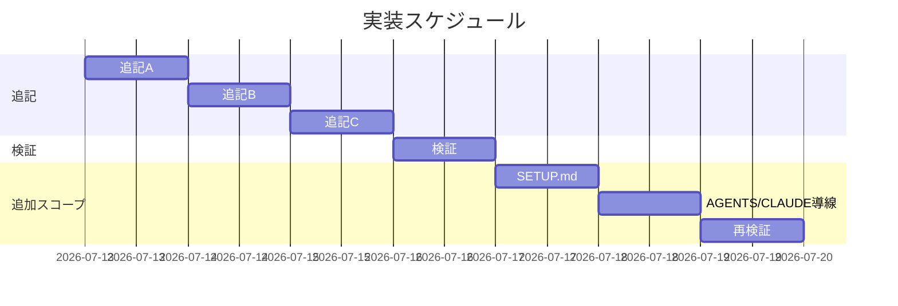

# 実装計画書: README 利用者向け内容の拡充（設定一覧・スキル/コマンド一覧・導入後の変化）

**プロジェクト名**: README 利用者向け内容の拡充
**作成日**: 2026 年 07 月 13 日
**最終更新**: 2026 年 07 月 13 日

> **重要**: **このドキュメントは常に更新**: 実装計画の変更・進捗があった場合は即座に更新すること。
> **必須項目**: テスト観点・BDD 仕様は具体ケースを 1 件以上記載する。
>
> **用語**: [.agent-skill-chain/source/CONCEPTS.md §用語規約](../../../../.agent-skill-chain/source/CONCEPTS.md#用語規約) を参照。

---

## 1. 実装概要

### 1.1 実装方針

02_設計に従い、README.md の利用者向けセクションに追記 A（導入すると何が変わるか）・B（使えるもの＝command とスキル）・C（設定できること）を、既存見出し・アンカーを壊さず挿入する。加えて追記 D として、配布先へ届く SETUP.md・AGENTS.md・CLAUDE.md に `init`/`upgrade`/`enforce` の実行コマンドと導線を追加する。全編「要約＋代表例＋正本リンク」方針。正本ファイル本体・CLI・スクリプトは変更しない。

### 1.2 実装順序

1. タスク 1: 追記 A（導入すると何が変わるか）
2. タスク 2: 追記 B（使えるもの＝command とスキル）
3. タスク 3: 追記 C（設定できること）
4. タスク 4: リンク解決検証＋非回帰テスト（`bash test/run-all.sh`）
5. タスク 5: 追記 D-1（SETUP.md に実行コマンド節を追加）
6. タスク 6: 追記 D-2（AGENTS.md・CLAUDE.md から SETUP.md への導線を追加）



---

## 2. タスク分解

### 2.1 タスク 1: 追記 A「導入すると何が変わるか」

#### 2.1.1 概要

冒頭 1 文のみだった導入後の変化を 4 観点の要約に拡充し、思想は正本へリンク委譲する。

#### 2.1.2 実装内容

- README の冒頭ブロック直後（「## 何がどこに置かれるか」の前）に `## 導入すると何が変わるか` を新設する。
- 4 観点を箇条書きで記載: (a) 進行役がサブに委譲、(b) phase gate で 要求→…→レビュー を command で回す、(c) enforcement opt-in で orchestrator の直接 Write/Edit/Bash 等が制約（§配備後の管理（CLI）へ内部リンク）、(d) 証跡が workflow.db に残る。
- 思想詳細は [CONCEPTS.md](../../../../.agent-skill-chain/source/CONCEPTS.md)・[GETTING_STARTED.md](../../../../.agent-skill-chain/source/GETTING_STARTED.md) へリンク委譲。

#### 2.1.3 テスト観点

##### 単体（具体ケース）

- 該当なし（コード変更なし）。目視で 4 観点すべてが記載されていることを確認する。

##### 結合/API

- 該当なし。

##### E2E/受け入れ

- README を読んだ利用者が「導入後の AI 挙動」を 4 観点で把握できる（受け入れ基準 01 ストーリー 3）。

##### バリデーション

- 追記部の相対リンク（CONCEPTS.md・GETTING_STARTED.md・内部アンカー）が解決する。

#### 2.1.4 単体テスト仕様（BDD）

```gherkin
Feature: 導入すると何が変わるか
  Scenario: 導入後の挙動変化の要約が README にある
    Given 導入後の変化が冒頭 1 文のみの README.md
    When 追記 A を適用する
    Then サブ委譲・phase 進行・enforcement 制約・証跡の 4 観点が記載される
    And 思想の詳細は CONCEPTS.md・GETTING_STARTED.md へのリンクで委譲される
    And 思想が新規に書き起こされていない
```

#### 2.1.5 依存関係

- なし（先頭タスク）。

#### 2.1.6 見積もり

- **工数**: 0.5h / **優先度**: 高

### 2.2 タスク 2: 追記 B「使えるもの（command とスキル）」

#### 2.2.1 概要

ディレクトリマップ止まりの構成表を補完し、6 command の役割一覧と 7 ドメインの skills 概要を追加する。

#### 2.2.2 実装内容

- 「## .agents 配下の構成」表の直後に `## 使えるもの（command とスキル）` を新設する（既存構成表は変更しない）。
- command 表（6 行）: requirement-discovery / design-feature / implement-feature / verify-and-close / review-docs / create-pr-review-issue の役割を各 1 行。
- skills 表（7 行）: requirements / architecture / implementation / testing / review / logging / agent の概要を各 1 行。
- 個別 capability の詳細は [.agent-skill-chain/source/README.md](../../../../.agent-skill-chain/source/README.md) の索引へリンク委譲。

#### 2.2.3 テスト観点

##### 単体（具体ケース）

- 該当なし（コード変更なし）。目視で command 表が 6 行、skills 表が 7 ドメインあることを確認する。

##### 結合/API

- 該当なし。

##### E2E/受け入れ

- README を読んだ利用者が「使える command と skills」を把握できる（受け入れ基準 01 ストーリー 2）。

##### バリデーション

- 追記部の source/README.md へのリンクが解決する。既存「.agents 配下の構成」表が維持されている。

#### 2.2.4 単体テスト仕様（BDD）

```gherkin
Feature: スキル/コマンド一覧とアーキテクチャ説明
  Scenario: command 役割一覧と skills 概要が README にある
    Given ディレクトリマップ止まりの構成表を持つ README.md
    When 追記 B を適用する
    Then 6 つの command の役割一覧が各 1 行で記載される
    And skills の 7 ドメインの概要が記載される
    And 個別 capability の詳細カタログは source/README.md 索引へのリンクで委譲される
    And 既存の「.agents 配下の構成」表は維持される
```

#### 2.2.5 依存関係

- タスク 1 の後（同一 README への追記のため順序化）。

#### 2.2.6 見積もり

- **工数**: 0.5h / **優先度**: 高

### 2.3 タスク 3: 追記 C「設定できること（設定一覧）」

#### 2.3.1 概要

設定を 3 カテゴリ（enforcement opt-in・版ピン留め・監査/走査スコープ等の環境変数）で示し、全カタログは正本へリンク委譲する。

#### 2.3.2 実装内容

- 「## 配備後の管理（CLI）」節の直後（「## 入口と参照」の前）に `## 設定できること（設定一覧）` を新設する。
- カテゴリ表（3 行）: 各カテゴリに代表例 1 つ＋詳細正本リンク。全列挙しない。
- 監査/走査スコープの代表例は `WORKFLOW_DIRS`、全カタログは [enforcement/README.md](../../../../.agent-skill-chain/source/enforcement/README.md)。
- 並行 issue ②③ の個別環境変数名（`CLOSE_MOVE_*` / `GITHUB_ISSUE_GATE_*` 相当）は書かない。

#### 2.3.3 テスト観点

##### 単体（具体ケース）

- 該当なし（コード変更なし）。目視でカテゴリ＋代表例＋正本リンクがあり、②③ の未確定変数名が無いことを確認する。

##### 結合/API

- 該当なし。

##### E2E/受け入れ

- README を読んだ利用者が「設定できること」の全体像と詳細への入口を得られる（受け入れ基準 01 ストーリー 1）。

##### バリデーション

- 追記部の enforcement/README.md へのリンクが解決する。個別環境変数の全列挙が README 本体に無い。

#### 2.3.4 単体テスト仕様（BDD）

```gherkin
Feature: 設定できることの案内
  Scenario: 設定の代表例＋正本リンクが README にある
    Given README 読者分離済みの README.md
    When 追記 C を適用する
    Then 設定のカテゴリと代表例（enforce opt-in・版ピン留め・調整可能な環境変数群）が記載される
    And 設定の全カタログは enforcement/README.md 等へのリンクで委譲される
    And 並行 issue ②③ の個別環境変数名は確定情報として書かれない
```

#### 2.3.5 依存関係

- タスク 2 の後。

#### 2.3.6 見積もり

- **工数**: 0.5h / **優先度**: 高

### 2.4 タスク 4: リンク解決検証＋非回帰テスト

#### 2.4.1 概要

追記後の README の全 markdown リンクが解決することと、既存テストスイートが非回帰であることを確認する。

#### 2.4.2 実装内容

- 追記部の相対リンク（`../../../../` ではなく README はルート直下なので `.agent-skill-chain/source/...`）の実在を確認する。
- 既存見出しアンカー・外部参照が壊れていないことを確認する。
- `bash test/run-all.sh` を実行し非回帰を確認する。

#### 2.4.3 テスト観点

##### 単体（具体ケース）

- 該当なし。

##### 結合/API

- 該当なし。

##### E2E/受け入れ

- `bash test/run-all.sh` が成功する（非回帰）。

##### バリデーション

- README 追記部のリンク切れ 0 件。読者分離構造が後退していない（開発者向け内容が README に戻っていない）。

#### 2.4.4 単体テスト仕様（BDD）

```gherkin
Feature: DRY・非回帰・読者分離の担保
  Scenario: 追記が既存挙動と分離構造を壊さない
    Given 追記 A・B・C を適用した README.md
    When bash test/run-all.sh を実行する
    Then テストが非回帰で成功する
    And README 追記部の markdown リンクが全解決する
    And 開発者・メンテナ向け内容が README に戻っていない
```

#### 2.4.5 依存関係

- タスク 1・2・3 の後。

#### 2.4.6 見積もり

- **工数**: 0.5h / **優先度**: 高

### 2.5 タスク 5: 追記 D-1「SETUP.md に実行コマンド節を追加」

#### 2.5.1 概要

配布される SETUP.md に、`init`（バージョンピン留め含む）・`upgrade`・`enforce on/off/status` の実行コマンド自体を追加する（`uninstall` は既存の「## アンインストール（つけ外し）」節に実コマンドが既にあるため対象外）。

#### 2.5.2 実装内容

- 「## init / upgrade / uninstall の保持・上書き契約（正本）」見出し直下・結論段落の直後（「### 所有区分」の前）に、`npx github:techbeansjp-free/AGENTS.md#<tag-or-branch> init`・`npx github:techbeansjp-free/AGENTS.md upgrade`・`npx github:techbeansjp-free/AGENTS.md doctor` を bash コードブロックで追加する。
- 「## enforcement の opt-in（既定 off）」節の既存 `agents-md enforce on/off/status` 表の直後に、`npx github:techbeansjp-free/AGENTS.md enforce status|on|off` の実行例を追加する。
- README.md §配備後の管理（CLI）の記載内容と整合させる。

#### 2.5.3 テスト観点

##### 単体（具体ケース）

- 該当なし（コード変更なし）。目視で `init`/`upgrade`/`enforce` の実行コマンドが SETUP.md に記載されていることを確認する。

##### 結合/API

- 該当なし。

##### E2E/受け入れ

- SETUP.md だけを読んだ利用者が `upgrade` の実行コマンドに到達できる（受け入れ基準 01 ストーリー 4）。

##### バリデーション

- 追記部に README.md と矛盾するコマンド例が無い。

#### 2.5.4 単体テスト仕様（BDD）

```gherkin
Feature: 配布物からのアップデート方法の可視化
  Scenario: 導入済みプロジェクトの利用者が SETUP.md だけで upgrade コマンドを知る
    Given 保持・上書き契約は詳しいが実行コマンド自体が uninstall 以外記載されていない SETUP.md
    When 追記 D-1 を適用する
    Then init（バージョンピン留め含む）・upgrade・enforce on/off/status の実行コマンド自体が SETUP.md に記載される
    And README.md §配備後の管理（CLI）の実コマンド例と整合する
```

#### 2.5.5 依存関係

- タスク 4 の後。

#### 2.5.6 見積もり

- **工数**: 0.5h / **優先度**: 高

### 2.6 タスク 6: 追記 D-2「AGENTS.md・CLAUDE.md から SETUP.md への導線を追加」

#### 2.6.1 概要

配布される AGENTS.md・CLAUDE.md から SETUP.md の実行コマンド節へ辿れる導線を追加する。

#### 2.6.2 実装内容

- AGENTS.md の既存「## 変更マップ」表の「コピー対象・セットアップ詳細」行のラベルを「コピー対象・セットアップ・アップデート（upgrade）詳細」に更新する（リンク先 SETUP.md は既存のまま）。
- CLAUDE.md の冒頭箇条書きに、SETUP.md（セットアップ・アップデートの実行コマンド）への参照行を 1 行追加する。

#### 2.6.3 テスト観点

##### 単体（具体ケース）

- 該当なし（コード変更なし）。目視で AGENTS.md・CLAUDE.md の双方に SETUP.md への言及があることを確認する。

##### 結合/API

- 該当なし。

##### E2E/受け入れ

- AGENTS.md・CLAUDE.md のいずれかを読んだ利用者が SETUP.md（実行コマンド節）へ辿り着ける（受け入れ基準 01 ストーリー 4）。

##### バリデーション

- 追記部の SETUP.md へのリンクが解決する。

#### 2.6.4 単体テスト仕様（BDD）

```gherkin
Feature: 配布物間の導線
  Scenario: 利用者が AGENTS.md・CLAUDE.md から SETUP.md のコマンド節へ辿れる
    Given SETUP.md に実行コマンド節を追加した状態
    When 追記 D-2 を適用する
    Then AGENTS.md から SETUP.md（コマンド節を含む）へのリンクが存在する
    And CLAUDE.md から SETUP.md へのリンクが存在する
```

#### 2.6.5 依存関係

- タスク 5 の後。

#### 2.6.6 見積もり

- **工数**: 0.3h / **優先度**: 高

---

## テスト観点

- 3 節（A/B/C）が 01 の受け入れ基準どおり存在するか（目視）。
- 追記部の markdown リンクが全解決するか（リンク切れ 0 件）。
- 個別環境変数が README 本体に全列挙されず正本リンクに委譲されているか。
- `bash test/run-all.sh` が非回帰か。
- 読者分離構造（README＝利用者向け／CONTRIBUTING＝開発者向け）が維持されているか。
- SETUP.md に `init`/`upgrade`/`enforce` の実行コマンド自体が記載されているか（追記 D）。
- AGENTS.md・CLAUDE.md から SETUP.md の実行コマンド節へ導線があるか（追記 D）。

---

## 単体テスト

- コード変更が無いため新規単体テストは追加しない。既存テストスイートの非回帰（`bash test/run-all.sh`）で担保する。

---

## BDD

- 各タスク §2.x.4 の Gherkin を参照。01 の 5 ユースケース（設定一覧・スキル/コマンド一覧・導入後の変化・DRY/非後退・配布物からのアップデート方法可視化）と対応する。

---

## 3. 実装スケジュール

### 3.1 マイルストーン

| マイルストーン | 期日 | 成果物 |
| -------------- | ---- | ------ |
| 追記完了 | 2026-07-13 | 追記 A/B/C 反映済み README.md |
| 検証完了 | 2026-07-13 | リンク解決＋`run-all.sh` 非回帰の確認 |
| 追加スコープ完了 | 2026-07-13 | 追記 D 反映済み SETUP.md/AGENTS.md/CLAUDE.md ＋ 再検証 |

### 3.2 実装フェーズ

#### フェーズ 1: 追記

- **タスク**: タスク 1・2・3

#### フェーズ 2: 検証

- **タスク**: タスク 4

#### フェーズ 3: 追加スコープ（配布物のアップデート方法可視化）

- **タスク**: タスク 5・6

---

## 4. テスト計画

### 4.1 テストの優先順位

- リンク解決検証と `bash test/run-all.sh` の非回帰を必須とする。
- 読者分離の非後退（開発者向け内容が README に戻らない）を目視で確認する。

---

## 5. リスク管理

### 5.1 実装リスク

- **リスク**: 既存見出しアンカーの破壊・リンク切れ。
  - **対策**: 既存見出しは変更せず新設節のみ追加。追記後に全リンクの実在を検証する。
- **リスク**: 正本の重複コピーによる陳腐化。
  - **対策**: 要約＋代表例＋正本リンクに徹し、②③ の個別変数名を書かない。
- **リスク**: README.md と SETUP.md の実行コマンド例が乖離する（追記 D は意図的に 2 箇所に実体を持つため）。
  - **対策**: SETUP.md 追記時に README.md §配備後の管理（CLI）の記載と突き合わせて整合させる（02 ADR-2）。

---

## 6. 参考資料

### プロジェクトドキュメント

- [`02_設計.md`](./02_設計.md) - 設計

### その他の参考資料

- 対象: [`README.md`](../../../../README.md)、[`.agent-skill-chain/source/SETUP.md`](../../../../.agent-skill-chain/source/SETUP.md)、[`AGENTS.md`](../../../../AGENTS.md)、[`CLAUDE.md`](../../../../CLAUDE.md)
- 材料正本: [enforcement/README.md](../../../../.agent-skill-chain/source/enforcement/README.md)、[.agent-skill-chain/source/README.md](../../../../.agent-skill-chain/source/README.md)、[CONCEPTS.md](../../../../.agent-skill-chain/source/CONCEPTS.md)、[GETTING_STARTED.md](../../../../.agent-skill-chain/source/GETTING_STARTED.md)

---

## 7. 前のステップ

- **前**: [`02_設計.md`](./02_設計.md) - 設計フェーズ

---

## 8. 次のステップ

- 本 issue は 1 つの issue として実装フェーズ（execution）へ直接進む（サブ issue 分割なし）。実装着手前に review-docs ゲートを通す。
