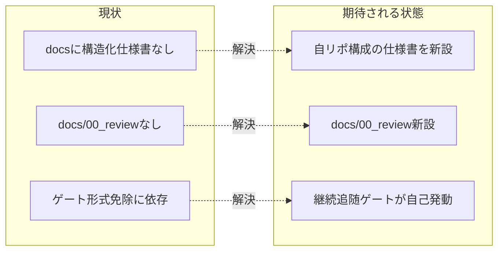

# 要求定義書: 本リポジトリのシステム仕様書整備（自己ドッグフーディングの一貫性回復）

**プロジェクト名**: 本リポジトリのシステム仕様書整備
**作成日**: 2026 年 07 月 13 日
**最終更新**: 2026 年 07 月 13 日

> **重要**:
>
> - 要求定義書は、プロジェクトの全体像を把握するためのものです。詳細な技術仕様や実装方法は要件定義書以降で記載します。必要最低限の情報に収めることを心掛けてください。
> - **このドキュメントは常に更新**: 要求の変更や追加があった場合は、即座にこのドキュメントを更新してください。
> - 本 issue は **requirement-discovery（要求定義〜要件定義）** の範囲であり、実際の `docs/` システム仕様書の作成（設計・実装）は本 issue の範囲外である（[§5 除外要件](#5-除外要件)）。
>
> **用語**: [.agent-skill-chain/source/CONCEPTS.md §用語規約](../../../../.agent-skill-chain/source/CONCEPTS.md#用語規約) を参照。

---

## 要求定義の全体像

```mermaid
mindmap
  root((本リポのシステム仕様書整備))
    目的・背景
      ドッグフーディングの一貫性欠如
      docsゲート形式免除への依存
      自リポの構成を説明する仕様書が不在
    機能要件
      docs構造化仕様書の新設
      docs/00_reviewの新設
      継続追随ゲートの実発動
    非機能要件
      DRY正本一元化
      ノイズ排除規約遵守
      保守性
    制約条件
      DOCS_RULES/DOCS_NOISE_RULES準拠
      名前空間規約準拠
      文書化対象=自リポのソフトウェア
    除外要件
      framework定義の再文書化
      過去close issueの遡及同期
      実装(02/03)着手
    成功基準
    リスクと対策
```

**注意**: マインドマップは全体像把握用であり、詳細は各セクション本文に記載する。

---

## 1. 目的・背景

### 1.1 目的（必須）

本リポジトリ自身のソフトウェア構成を `docs/` に構造化文書化し自己適用の一貫性を回復する。

### 1.2 背景

- **現状の課題**:
  - 本リポジトリは「AI 実行契約・ワークフロー仕様パッケージ」を**配布する側**であり、かつ自分自身にもその仕組みを適用する**自己拡張（ドッグフーディング）**を行う二役を担う（[.agent-skill-chain/project/自己拡張ワークフロー.md](../../../../.agent-skill-chain/project/自己拡張ワークフロー.md)）。
  - このフレームワークは消費者プロジェクトに対し、システム仕様書（`docs/`）の運用ルール（[.agent-skill-chain/source/DOCS_RULES.md](../../../../.agent-skill-chain/source/DOCS_RULES.md)）と、実装変更を伴う issue の close 前に必須の**継続追随ゲート**（as-built 同期レビュー、指摘 0 件までの反復、`docs/00_review/` への記録）を定めている。
  - しかし**本リポジトリ自身の `docs/` には `AI_CI_CD_VISION.md` と `maintainer/`（開発プロセス文書・issue 記録）しかなく**、`01_システム概要`・`02_画面設計`・`03_データ設計`・`04_機能設計` 等の構造化システム仕様書も、継続追随ゲートの記録先である `docs/00_review/` も存在しない（実確認済み）。
  - `.agent-skill-chain/source/`（フレームワーク定義そのもの）は充実しているが、**本リポジトリがソフトウェアとしてどう構成されているか**（CLI＝`src/agents-md.ts`、`enforcement/ci/audit.sh` の監査項目群、`workflow.db`（ledger）のデータモデル、リリース CI（`.github/workflows/release.yml`）、`build-adapters.sh` によるマルチプラットフォーム生成の仕組み等）を俯瞰説明するシステム仕様書が不在である。

- **必要性**:
  - [DOCS_RULES.md §継続追随ゲート 6.（不発動の範囲）](../../../../.agent-skill-chain/source/DOCS_RULES.md) の「`docs/` を採用していないプロジェクトでは本ゲートは発動しない」により、本リポジトリは形式的にはゲートを免除されている。しかしこれは「ドッグフーディングしているのに自分自身にはシステム仕様書を求めていない」という**一貫性の欠如**であり、配布する契約に対する自己適用上の空白である。
  - 配布物（`.agent-skill-chain/source/`）の設計思想は各 README に正本があるが、**本リポジトリをソフトウェアとして初見で理解する**（新規保守者・監査者向けの）俯瞰仕様書が無く、構成要素（CLI コマンド体系・スクリプト群・enforcement 機構・DB・CI パイプライン）の全体像が散在している。

### 1.3 期待される効果（必須: 1 件以上）

- **効果 1（自己適用の一貫性回復）**: 本リポジトリが `docs/` を正式採用し、`docs/00_review/` が実在する状態になる（○/×: `docs/01_システム概要/` 等の構造化仕様書と `docs/00_review/` が存在するかで判定可能）。
- **効果 2（俯瞰可能性の獲得）**: 保守者・監査者が、CLI・スクリプト群・enforcement・workflow.db・CI パイプラインの全体像を `docs/` から辿れる（○/×: 5 構成要素が仕様書のいずれかのセクションから参照到達可能かで判定可能）。
- **効果 3（継続追随ゲートの自己発動）**: `docs/` 採用後、以後の実装変更 issue の close 時に [DOCS_RULES.md §継続追随ゲート](../../../../.agent-skill-chain/source/DOCS_RULES.md) が実発動し、audit.sh #31/#32 の SKIP 条件から外れる（○/×: docs/ 採用後の issue で `docs/00_review/` 記録が生成されるかで判定可能）。

**現状と期待される状態の比較**:



---

## 2. 機能要件

> 本 issue は requirement-discovery であり、以下は「何を実現するか」の要求レベルの記載に留める。具体的な章立て・記述内容の設計は後続フェーズ（02_設計）で確定する。

### 2.1 既存機能の維持（該当する場合）

- 既存の `docs/AI_CI_CD_VISION.md`・`docs/maintainer/`（開発プロセス文書・issue 記録）はそのまま維持する。本 issue はこれらを削除・移動しない。
- 配布物正本（`.agent-skill-chain/source/` 配下の各 README・DESIGN・schema）の内容は移設・複製せず、正本のまま維持する。

### 2.2 新規機能要件

- **構造化システム仕様書の新設**: `.agent-skill-chain/runtime/templates/docs/` のテンプレート構造（`01_システム概要`・`02_画面設計`・`03_データ設計`・`04_機能設計`・`05_エラー処理と外部通知`・`99_ID命名規則と管理`・`00_review`）に沿って、**本リポジトリ自身のソフトウェア構成**を文書化する枠組みを `docs/` に導入する。
- **文書化対象（スコープ）**: 本リポジトリの**ソフトウェアとしての構成要素**を対象とする。すなわち CLI（`src/agents-md.ts`＝配布 bin `agents-md`）、スクリプト群（`.agent-skill-chain/source/scripts/`）、enforcement 機構（`.agent-skill-chain/source/enforcement/`）、証跡 DB（`.agent-skill-chain/source/ledger/` 定義の `workflow.db`）、CI パイプライン（`.github/workflows/release.yml`・`self-enforce.yml`）、マルチプラットフォーム生成（`build-adapters.sh`・`.agent-skill-chain/source/platforms/`）。
- **`docs/00_review/` の新設**: 継続追随ゲートのレビュー記録先ディレクトリを新設する。
- **DRY・正本参照方式**: 既に正本が存在する内容（enforcement/README、ledger/schema.md、各 DESIGN 等）は複製せず、**要約＋正本への `§節参照`／`#見出しアンカー`** で接続する（[DOCS_NOISE_RULES.md §(iii) 正本重複](../../../../.agent-skill-chain/source/DOCS_NOISE_RULES.md) 準拠）。

---

## 3. 非機能要件

### 3.1 パフォーマンス

- 該当なし（本 issue は文書整備であり実行時パフォーマンス要件を持たない）。

### 3.2 セキュリティ

- システム仕様書に秘密情報（トークン・PAT 等の値）を記載しない。CI 上の秘密（`RELEASE_MAIN_PAT` 等）は名称・役割の記載に留める。

### 3.3 互換性

- 配布物（npm パッケージ `files` allowlist）に `docs/` 配下のシステム仕様書が混入しないこと。`docs/maintainer/` と同様、`docs/` の自リポ仕様書は**非配布**（保守者向け）である前提を維持する。

### 3.4 保守性

- [DOCS_NOISE_RULES.md 禁止パターン 4 種](../../../../.agent-skill-chain/source/DOCS_NOISE_RULES.md)（実装矛盾・陳腐化・正本重複・壊れやすい参照）を作らない。行番号直リンク（`<file>.md:NNN`）を新規使用しない（[DOCS_RULES.md §行番号直リンク禁止](../../../../.agent-skill-chain/source/DOCS_RULES.md)）。

---

## 4. 制約条件

### 4.1 技術的制約

- **文書化ルール準拠**: [DOCS_RULES.md](../../../../.agent-skill-chain/source/DOCS_RULES.md)・[DOCS_NOISE_RULES.md](../../../../.agent-skill-chain/source/DOCS_NOISE_RULES.md) に準拠する。テンプレート構造は [.agent-skill-chain/runtime/templates/docs/](../../../../.agent-skill-chain/runtime/templates/docs/) の見出し・セクション構成に従う。
- **名前空間規約準拠**: 本 issue 自体は [.agent-skill-chain/project/自己拡張ワークフロー.md](../../../../.agent-skill-chain/project/自己拡張ワークフロー.md) の上書き規約に従い `docs/maintainer/workflow/<timestamp>_<title>/` に置く。文書化対象と生成物の区別（何が git 追跡対象で何が生成物か）を同ファイルの名前空間役割分担表に従って正しく扱う。
- **配布物非汚染**: 新設する `docs/` システム仕様書は `.agent-skill-chain/source/`（配布正本）に混ぜない。

### 4.2 既存システムとの互換性

- 既存の `docs/maintainer/`・`docs/AI_CI_CD_VISION.md` の位置づけと矛盾しない構成にする。
- audit.sh の走査スコープ（`WORKFLOW_DIRS` 既定に `docs/maintainer/workflow` を含む）や #28（issue ドキュメント誤配置検知）と整合する配置にする。

### 4.3 移行期間・スケジュール

- **過去 close 分は対象外（遡及しない）**: 既に close 済みの issue（`docs/maintainer/workflow/close/` 配下）については、遡及的なシステム仕様書同期を求めない。継続追随ゲートの実発動は `docs/` 採用**以後**の実装変更 issue に対してのみ適用する（audit.sh #32 の `REVIEWDOCS_GATE_EFFECTIVE_FROM` grandfather 方針と同型の非遡及運用）。

---

## 5. 除外要件

- **フレームワーク定義自体の再文書化**: `.agent-skill-chain/source/`（フレームワークの仕様定義そのもの）は既に各 README・DESIGN・spec で文書化済みであり、本 issue の文書化対象**外**とする（それらを `docs/` に複製しない。正本参照に留める）。
- **過去 close 済み issue の遡及同期**: [§4.3](#43-移行期間スケジュール) のとおり対象外。
- **実装・設計フェーズ（02/03）**: 実際の `docs/` システム仕様書ドラフトの執筆・設計は本 issue の範囲外。本 issue は 00・01（要求・要件の言語化）までで完了する。
- **enforcement 未実装機構（系統 A/C/D/E 等）の新規実装**: 本 issue は既存構成の文書化であり、抽象仕様のみの未実装機構を実装しない。

---

## 6. 成功基準（必須: 1 件以上）

- **SC-1**: 文書化対象スコープ（自リポのソフトウェア構成＝CLI・スクリプト群・enforcement・workflow.db・CI/マルチプラットフォーム生成）が 00/01 に**判定可能な粒度で確定**している（○/×: 5 構成要素が列挙され、各々の正本パスが明記されているか）。
- **SC-2**: 除外範囲（framework 定義の再文書化・過去 close の遡及同期・実装着手）が 00 に明記されている（○/×）。
- **SC-3**: `docs/` 正式採用に伴う**継続追随ゲートの実発動**が要件として 01 に明記されている（○/×: 以後の実装変更 issue の close 時に DOCS_RULES §継続追随ゲートが発動し audit.sh #31/#32 の SKIP から外れることが記載されているか）。
- **SC-4**: DRY 方針（既存正本を複製せず要約＋参照でつなぐ）が受け入れ基準として 01 に落ちている（○/×）。
- **SC-5**: 本 issue の 00・01 が [DOCS_NOISE_RULES.md 4 種](../../../../.agent-skill-chain/source/DOCS_NOISE_RULES.md) に違反しない（行番号直リンク不使用・正本重複なし）（○/×: grep 等で `.md:NNN` パターン不在を確認可能）。
- **SC-6**: 00・01 それぞれが書記（write-workflow-log）により workflow.db へ記録されている（○/×: entry 2 件）。

---

## 7. リスクと対策

### 7.1 技術的リスク

- **リスク**: 文書化対象が広く、既存正本（各 README・schema・DESIGN）との重複により陳腐化・二重管理が生じる。
  - **対策**: DRY を厳守し、正本のある内容は要約＋参照 1 行に留める（[DOCS_NOISE_RULES.md §(iii)](../../../../.agent-skill-chain/source/DOCS_NOISE_RULES.md)）。02_設計で「どこまで書きどこから参照するか」の線引きを確定する。
- **リスク**: `docs/` 採用で継続追随ゲートが実発動し、以後の実装変更 issue の close 手順が重くなる（運用負荷）。
  - **対策**: [DOCS_RULES.md §継続追随ゲート 5.（軽量パス）](../../../../.agent-skill-chain/source/DOCS_RULES.md) の「根拠付き更新不要判定 1 件」を活用し、規模比例で運用する。要件として 01 に明記し想定内とする。

### 7.2 スケジュールリスク

- **リスク**: 実装（02/03）まで一気に進めようとするとスコープが膨らむ。
  - **対策**: 本 issue は 00・01 で確定停止する（[§5 除外要件](#5-除外要件)）。実装は後続 issue に分離する。

---

## 8. 参考資料

### プロジェクトドキュメント

- [.agent-skill-chain/source/DOCS_RULES.md](../../../../.agent-skill-chain/source/DOCS_RULES.md) — システム仕様書の作成・更新ルール（継続追随ゲート正本）
- [.agent-skill-chain/source/DOCS_NOISE_RULES.md](../../../../.agent-skill-chain/source/DOCS_NOISE_RULES.md) — システム仕様書のノイズ排除規約
- [.agent-skill-chain/project/自己拡張ワークフロー.md](../../../../.agent-skill-chain/project/自己拡張ワークフロー.md) — 自己拡張の名前空間規約（最優先）
- [.agent-skill-chain/runtime/templates/docs/README.md](../../../../.agent-skill-chain/runtime/templates/docs/README.md) — システム仕様書テンプレート構成

### その他の参考資料

- 文書化対象の正本: `src/agents-md.ts`（CLI）、[.agent-skill-chain/source/enforcement/README.md](../../../../.agent-skill-chain/source/enforcement/README.md)、[.agent-skill-chain/source/ledger/schema.md](../../../../.agent-skill-chain/source/ledger/schema.md)、[.github/workflows/release.yml](../../../../.github/workflows/release.yml)

---

## 9. 次のステップ

この要求定義書の承認後、以下のドキュメントを作成します：

- **次**: [`01_要件定義.md`](./01_要件定義.md) - 要件定義フェーズ
