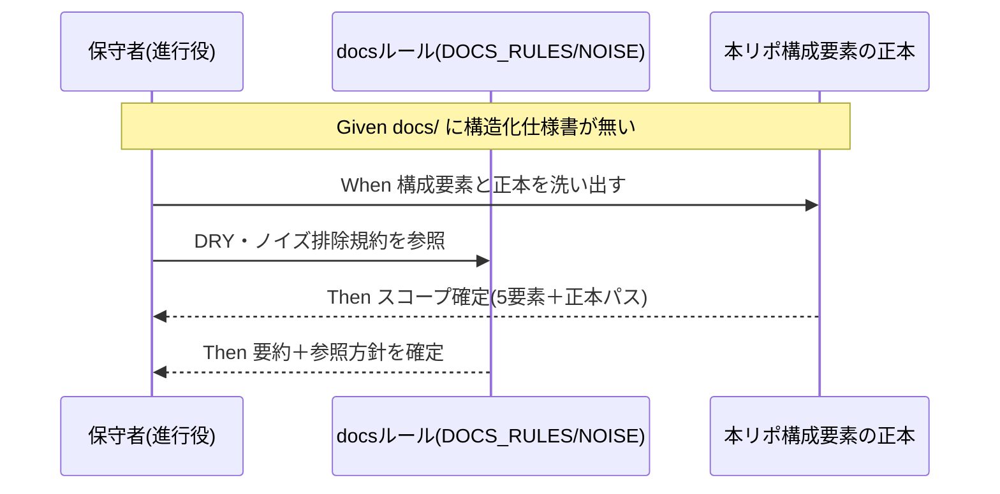

# 要件定義書: 本リポジトリのシステム仕様書整備（自己ドッグフーディングの一貫性回復）

**プロジェクト名**: 本リポジトリのシステム仕様書整備
**作成日**: 2026 年 07 月 13 日
**最終更新**: 2026 年 07 月 13 日

> **重要**: **このドキュメントは常に更新**: 要件の変更や追加があった場合は、即座に更新してください。
>
> 本 issue の範囲は requirement-discovery（00・01）まで。実際の `docs/` システム仕様書ドラフトの執筆・設計（02/03）は範囲外（[00_要求定義.md §5](./00_要求定義.md)）。
>
> **用語**: [.agent-skill-chain/source/CONCEPTS.md §用語規約](../../../../.agent-skill-chain/source/CONCEPTS.md#用語規約) を参照。

---

## 1. 概要

### 1.1 システム概要

本 issue は、本リポジトリ（AI 実行契約・ワークフロー仕様パッケージ）が「配布者」かつ「自己拡張する消費者」の二役を担うにもかかわらず、**自分自身の `docs/` に構造化システム仕様書と `docs/00_review/` を持たない**という自己適用上の一貫性欠如を、要求・要件として言語化するものである。文書化の**対象は本リポジトリのソフトウェアとしての構成**（CLI・スクリプト群・enforcement 機構・証跡 DB・CI/マルチプラットフォーム生成）であり、フレームワーク定義そのもの（`.agent-skill-chain/source/`）の再文書化は対象外とする。実際の仕様書執筆は後続 issue に委ねる。

構成要素の正本所在（文書化時に参照する対象。複製せず要約＋参照でつなぐ）:

| 構成要素 | 実体 | 正本（参照先） |
|----------|------|----------------|
| CLI | `src/agents-md.ts`（ビルド後 `bin/agents-md.js`、コマンド: `init`/`upgrade`/`uninstall`/`enforce`/`doctor`/`audit`/`export`/`version`/`help`） | `src/agents-md.ts`・`README.md` |
| スクリプト群 | `.agent-skill-chain/source/scripts/`（setup.sh・build-adapters.sh・build-plugin-claude.sh・sync-version.sh・write-workflow-log.sh・export-ndjson.sh・gen-entry-hash.sh・verify-npm-pack.sh 等） | 各スクリプト・`.agent-skill-chain/source/SETUP.md` |
| enforcement 機構 | `.agent-skill-chain/source/enforcement/`（4 層強制・audit.sh 監査項目群・PreToolUse/PostToolUse・agents-core.mdc） | [enforcement/README.md](../../../../.agent-skill-chain/source/enforcement/README.md)・enforcement/DESIGN.md |
| 証跡 DB（ledger） | `workflow.db`（単一テーブル `workflow_log`＋索引 7 件） | [ledger/schema.md](../../../../.agent-skill-chain/source/ledger/schema.md)・ledger/schema.sql |
| CI パイプライン | `.github/workflows/release.yml`（version-bump→release-marketplace→apm-release）・`self-enforce.yml`（自己強制 Layer4） | 各 workflow ファイル |
| マルチプラットフォーム生成 | `build-adapters.sh`・`.agent-skill-chain/source/platforms/`（claude・apm） | build-adapters.sh・platforms/README.md |

### 1.2 用語集

| 用語 | 説明 |
| ---- | ---- |
| 継続追随ゲート | 実装変更を伴う issue の close 前に必須の、システム仕様書と as-built の同期レビュー（指摘 0 件まで反復）を課す [DOCS_RULES.md](../../../../.agent-skill-chain/source/DOCS_RULES.md) の手順。 |
| ドッグフーディング | 配布するフレームワークを、配布者自身が自リポにも適用すること（自己拡張）。 |
| 正本参照方式（DRY） | 既に正本のある内容を複製せず、要約＋`§節参照`/`#見出しアンカー` の参照 1 行でつなぐ方針（[DOCS_NOISE_RULES.md §(iii)](../../../../.agent-skill-chain/source/DOCS_NOISE_RULES.md)）。 |
| as-built 同期 | 実装→仕様の向きで、仕様書を実装の現状に合わせて追随させること。 |

---

## 2. 機能要件

### 2.1 ユーザーストーリー

#### ストーリー 1: 文書化スコープの確定

- **As a** 本リポジトリの保守者（進行役）
- **I want to** 「何を `docs/` システム仕様書として文書化するか」の対象と除外を判定可能な粒度で確定したい
- **So that** 後続の設計・実装 issue が過不足なく（framework 定義の再文書化や過剰重複を避けて）着手できる

**受け入れ基準**:

- 文書化対象が「本リポジトリのソフトウェア構成」= CLI・スクリプト群・enforcement・workflow.db・CI/マルチプラットフォーム生成の 5 要素として列挙され、各正本パスが [§1.1](#11-システム概要) の表に明記されている（対応: [00 SC-1](./00_要求定義.md)）。
- 除外範囲（`.agent-skill-chain/source/` 定義の再文書化・過去 close の遡及同期・実装着手）が [00_要求定義.md §5](./00_要求定義.md) に明記されている（対応: [00 SC-2](./00_要求定義.md)）。

#### ストーリー 2: DRY を守った文書化方針の確定

- **As a** 本リポジトリの保守者
- **I want to** 既存正本（各 README・schema・DESIGN）を複製せず、要約＋参照でつなぐ方針を要件として固定したい
- **So that** システム仕様書が二重管理・陳腐化（[DOCS_NOISE_RULES.md](../../../../.agent-skill-chain/source/DOCS_NOISE_RULES.md) 禁止パターン）に陥らない

**受け入れ基準**:

- 「正本のある内容は要約＋`§節参照`/`#見出しアンカー` に留める」方針が要件として明記されている（対応: [00 SC-4](./00_要求定義.md)）。
- 本 issue の 00・01 自体が行番号直リンク（`.md:NNN`）を新規使用しておらず、正本重複が無い（対応: [00 SC-5](./00_要求定義.md)）。

#### ストーリー 3: 継続追随ゲートの自己発動を要件化

- **As a** 本リポジトリの保守者・監査者
- **I want to** `docs/` 正式採用後、以後の実装変更 issue の close 時に継続追随ゲートが実発動する運用を要件として合意したい
- **So that** 配布している契約を自リポにも一貫適用し、audit の SKIP に依存しない状態になる

**受け入れ基準**:

- `docs/` 採用後、実装変更を伴う issue の close 時に [DOCS_RULES.md §継続追随ゲート](../../../../.agent-skill-chain/source/DOCS_RULES.md) が発動し、`docs/00_review/YYYYMMDD_HHMMSS_review.md` に記録が残る運用が明記されている（対応: [00 SC-3](./00_要求定義.md)）。
- 継続追随ゲート発動により audit.sh #31（システム仕様書レビュー証跡欠落）・#32（実装前 review-docs 未実行）の SKIP 条件（`docs/` 非採用）から外れることが記載されている。
- 運用負荷は [DOCS_RULES.md §継続追随ゲート 5.（軽量パス）](../../../../.agent-skill-chain/source/DOCS_RULES.md) の「根拠付き更新不要判定 1 件」で規模比例に抑える方針が明記されている。

#### ストーリー 4: 過去 close 分を遡及対象外とする

- **As a** 本リポジトリの保守者
- **I want to** 既に close 済みの issue（`docs/maintainer/workflow/close/` 配下）に遡及的な仕様書同期を求めない方針を確定したい
- **So that** 移行コストを抑え、ゲートの実発動を採用以後の変更に限定できる

**受け入れ基準**:

- 過去 close 済み issue は遡及同期の対象外であることが [00_要求定義.md §4.3](./00_要求定義.md) に明記されている。
- 非遡及運用が audit.sh #32 の `REVIEWDOCS_GATE_EFFECTIVE_FROM`（grandfather）と同型であることが記載されている。

### 2.2 BDD ユースケース

#### ユースケース 1: 文書化スコープの確定と検証

**シナリオ 1: スコープが判定可能な粒度で確定している**

```gherkin
Feature: 文書化スコープの確定
  Scenario: 5構成要素と正本が列挙されている
    Given 本リポジトリは配布者かつ自己拡張する消費者である
    And docs/ には構造化システム仕様書と docs/00_review/ が存在しない
    When 00/01 を requirement-discovery として作成する
    Then 文書化対象が CLI・スクリプト群・enforcement・workflow.db・CI/マルチプラットフォーム生成の5要素として列挙される
    And 各構成要素の正本パスが明記される
    And framework 定義（.agent-skill-chain/source/）の再文書化は除外要件に入る
```

**シナリオ 2: DRY 違反・ノイズを作らない**

```gherkin
Feature: ノイズ排除の遵守
  Scenario: 正本重複と壊れやすい参照を作らない
    Given DOCS_NOISE_RULES.md が禁止パターン4種を定義している
    When 00/01 を記述する
    Then 既存正本の内容は要約＋§節参照/#見出しアンカーで接続される
    And 行番号直リンク（.md:NNN）を新規使用しない
```

**処理フロー**:



#### ユースケース 2: 継続追随ゲートの自己発動と非遡及

**シナリオ 1: 採用以後の実装変更 issue で発動する**

```gherkin
Feature: 継続追随ゲートの自己発動
  Scenario: docs/ 採用後の実装変更 issue の close でゲートが発動
    Given docs/ が正式採用され docs/00_review/ が存在する
    And ある issue が実装変更を伴い close 直前である
    When verify-and-close の継続追随ゲートを通過する
    Then システム仕様書と実装の as-built 同期レビューを指摘0件まで反復する
    And 結果を docs/00_review/YYYYMMDD_HHMMSS_review.md に記録する
    And audit.sh #31/#32 の docs/非採用 SKIP から外れる
```

**シナリオ 2: 過去 close 分は遡及しない**

```gherkin
Feature: 非遡及運用
  Scenario: close 済み issue には遡及同期を求めない
    Given docs/maintainer/workflow/close/ 配下に close 済み issue がある
    When docs/ を新規採用する
    Then close 済み issue に対する遡及的な仕様書同期は要求されない
    And ゲートの実発動は採用以後の実装変更 issue にのみ適用される
```

### 2.3 ビジネスルール

- 文書化対象は**本リポジトリのソフトウェア構成**に限る。フレームワーク定義（`.agent-skill-chain/source/`）の再文書化は行わない（正本参照のみ）。
- 既に正本のある内容は複製しない（DRY・[DOCS_NOISE_RULES.md §(iii)](../../../../.agent-skill-chain/source/DOCS_NOISE_RULES.md)）。
- 継続追随ゲートの実発動は `docs/` 採用**以後**の実装変更 issue にのみ適用（非遡及）。
- 本 issue のスコープは 00・01 まで。実装（02/03）には進まない。

---

## 3. 非機能要件

### 3.1 パフォーマンス要件

- 該当なし（文書整備であり実行時性能要件を持たない）。

### 3.2 セキュリティ要件

- システム仕様書に秘密情報の値を記載しない。CI シークレット（`RELEASE_MAIN_PAT` 等）は名称・役割の記載に留める。

### 3.3 ユーザビリティ要件

- 保守者・監査者が 5 構成要素の全体像を `docs/` から正本へ辿れる（俯瞰可能性）。

### 3.4 可用性要件

- 該当なし。

---

## 4. 外部インターフェース要件

### 4.1 API 要件

- 該当なし（新規 API を定義しない）。文書化対象の CLI コマンド体系（`agents-md init/upgrade/uninstall/enforce/doctor/audit/export`）は既存仕様であり、本 issue では変更しない。

### 4.2 データ形式要件

- 証跡 DB（`workflow.db` の `workflow_log`）のデータモデルは [ledger/schema.md](../../../../.agent-skill-chain/source/ledger/schema.md)・schema.sql を正本とし、文書化時も複製せず参照する。

---

## 5. 制約事項

- [DOCS_RULES.md](../../../../.agent-skill-chain/source/DOCS_RULES.md)・[DOCS_NOISE_RULES.md](../../../../.agent-skill-chain/source/DOCS_NOISE_RULES.md) 準拠。
- テンプレート構造は [.agent-skill-chain/runtime/templates/docs/](../../../../.agent-skill-chain/runtime/templates/docs/) に従う。
- 名前空間規約は [.agent-skill-chain/project/自己拡張ワークフロー.md](../../../../.agent-skill-chain/project/自己拡張ワークフロー.md)（最優先）に従い、配布物・生成物・追跡対象の区別を守る。
- 新設する `docs/` システム仕様書は配布物（npm `files` allowlist）に混入させない（保守者向け・非配布）。
- 本 issue は 00・01 で確定停止する（実装・設計・docs ドラフト執筆に進まない）。

---

## 6. 参考資料

### プロジェクトドキュメント

- [`00_要求定義.md`](./00_要求定義.md) - 要求定義
- [.agent-skill-chain/source/DOCS_RULES.md](../../../../.agent-skill-chain/source/DOCS_RULES.md) - 継続追随ゲート正本
- [.agent-skill-chain/source/DOCS_NOISE_RULES.md](../../../../.agent-skill-chain/source/DOCS_NOISE_RULES.md) - ノイズ排除規約
- [.agent-skill-chain/source/enforcement/README.md](../../../../.agent-skill-chain/source/enforcement/README.md) - enforcement 機構正本
- [.agent-skill-chain/source/ledger/schema.md](../../../../.agent-skill-chain/source/ledger/schema.md) - workflow.db データモデル正本

### その他の参考資料

- [.agent-skill-chain/project/自己拡張ワークフロー.md](../../../../.agent-skill-chain/project/自己拡張ワークフロー.md) - 自己拡張の名前空間規約

---

## 7. 前のステップ

この要件定義書は、以下のドキュメントを基に作成されています：

- **前**: [`00_要求定義.md`](./00_要求定義.md) - 要求定義フェーズ

---

## 8. 次のステップ

本 issue は requirement-discovery（00・01）で完了する。実際の `docs/` システム仕様書の設計・執筆は**後続 issue**（02_設計 以降）に委ねる（本 issue では 02 に進まない）。
