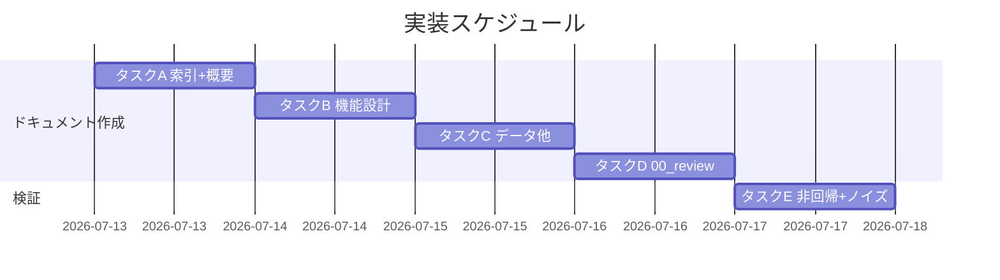

# 実装計画書: 本リポジトリのシステム仕様書整備（自己ドッグフーディングの一貫性回復）

**プロジェクト名**: 本リポジトリのシステム仕様書整備
**作成日**: 2026 年 07 月 13 日
**最終更新**: 2026 年 07 月 13 日

> **重要**: **このドキュメントは常に更新**: 実装計画の変更、進捗状況の更新、バグの記録などがあった場合は、即座に更新してください。
> **必須項目**: 「必須」と明記した欄は空欄・抽象語のみで提出しないこと。
>
> 本 issue は**ドキュメント整備**であり、成果物は `docs/` 配下のシステム仕様書（[02_設計.md §2.1.1](./02_設計.md#211-責務一覧作成する-docs-ファイル) の 18 ファイル）である。実行時ロジックを持たないため「テスト観点」はドキュメント検証観点（正本整合・ノイズ排除・非回帰）として記載する。
>
> **用語**: [.agent-skill-chain/source/CONCEPTS.md §用語規約](../../../../.agent-skill-chain/source/CONCEPTS.md#用語規約) を参照。

---

## 1. 実装概要

### 1.1 実装方針（必須）

[02_設計.md](./02_設計.md) の責務一覧に従い、テンプレート構造を踏襲して `docs/` 配下へ俯瞰仕様書 18 ファイルを新設する。各ファイルは**要約＋正本リンク**に徹し（DRY）、詳細仕様は既存正本へ委譲する。作成後に `bash test/run-all.sh` で非回帰を、grep でノイズ排除（行番号直リンク不使用）を確認する。

### 1.2 実装順序（必須: 1 件以上）

1. **タスク A**: 索引層＋概要（`docs/README.md`・`docs/01_システム概要/` 一式）
2. **タスク B**: 機能設計（`docs/04_機能設計/` の索引＋ CLI・スクリプト群・enforcement・CI・マルチプラットフォーム生成の 5 機能）
3. **タスク C**: データ設計・画面設計・エラー処理・ID 管理（`docs/03_`・`docs/02_`・`docs/05_`・`docs/99_`）
4. **タスク D**: 継続追随ゲート記録先（`docs/00_review/README.md`）の新設
5. **タスク E**: 非回帰・ノイズ排除の検証（`bash test/run-all.sh`・grep）



---

## 2. タスク分解

**必須**: 各タスクには「テスト観点」（2.x.3）と「検証仕様（BDD）」（2.x.4）を記載する。本 issue はドキュメント整備のため、テスト観点は**ドキュメント検証観点**として記述する。

### 2.1 タスク A: 索引層＋システム概要の作成

#### 2.1.1 概要（必須）

トップ索引と `01_システム概要` 一式（概要索引・プロジェクト概要・ステークホルダー・アーキテクチャ・ディレクトリ構成・規約）を作成する。

#### 2.1.2 実装内容（必須: 1 件以上）

- `docs/README.md`（トップ索引・構成一覧・更新履歴の初版行）
- `docs/01_システム概要/README.md`（サブドキュメント一覧）
- `docs/01_システム概要/01_プロジェクト概要/README.md`（目的・スコープ・成果物＝npm パッケージ・二役）
- `docs/01_システム概要/02_ステークホルダー/README.md`（保守者・消費者プロジェクト・監査者・CI）
- `docs/01_システム概要/03_アーキテクチャ/README.md`（5 構成要素の全体構成図・技術スタック Node/TS/bash/SQLite/GitHub Actions）
- `docs/01_システム概要/04_ディレクトリ構成/README.md`（`src/`・`.agent-skill-chain/source/`・`.github/`・`test/`・`docs/` 等の役割）
- `docs/01_システム概要/05_規約/README.md`（AGENTS.md・RULES.md・DOCS_RULES.md 等の正本リンク索引）

#### 2.1.3 テスト観点（必須）

**参照**: 観点定義は [02_設計 §6](./02_設計.md#6-テスト戦略) を参照。以下は本タスクの具体ケース。

##### 単体（ドキュメント検証・必須 1 件以上）

- 各ファイルの frontmatter に一意な `document_id`（8-4-4-4-12）が設定されている。
- アーキテクチャ図の 5 構成要素（CLI・スクリプト群・enforcement・workflow.db・CI/マルチプラットフォーム生成）が全て図または表に現れる（[00 SC-1](./00_要求定義.md#6-成功基準必須-1-件以上)）。

##### 結合/API（該当時は必須 1 件以上）

- 該当なし（実行時契約を持たない）。

##### E2E/受け入れ（未達時は理由記載）

- 保守者が `docs/README.md` から 5 構成要素の正本へ 2 ホップ以内で到達できる（俯瞰可能性・[00 効果 2](./00_要求定義.md#13-期待される効果必須-1-件以上)）。

##### バリデーション（該当する場合）

- 相対リンク深度が階層と一致する（`docs/01_システム概要/01_プロジェクト概要/`＝3 階層下→`../../../`）。

#### 2.1.4 検証仕様（BDD）（必須）

```gherkin
Feature: システム概要からの俯瞰到達性
  Scenario: 5構成要素が概要に列挙され正本へ到達できる
    Given docs/01_システム概要/03_アーキテクチャ/README.md が作成されている
    When 保守者がアーキテクチャ図と正本リンクを参照する
    Then CLI・スクリプト群・enforcement・workflow.db・CI/マルチプラットフォーム生成の5要素が確認できる
    And 各要素の正本パスへのリンクが解決する
```

```text
# Given: docs/01_システム概要/ 一式が作成済み
# When: docs/README.md の索引から各サブドキュメントを辿る
# Then: 5 構成要素とその正本リンクに到達でき、リンク切れ・行番号直リンクが無い
```

#### 2.1.5 依存関係

- なし（最初のタスク）。

#### 2.1.6 見積もり

- **工数**: 小 / **優先度**: 高

### 2.2 タスク B: 機能設計（5 構成要素）の作成

#### 2.2.1 概要（必須）

`04_機能設計` の索引と、5 構成要素の機能別サブドキュメントを作成する。各々は俯瞰＋正本参照に徹する。

#### 2.2.2 実装内容（必須: 1 件以上）

- `docs/04_機能設計/README.md`（機能単位一覧・ID 索引）
- `docs/04_機能設計/CLI/README.md`（`agents-md` の 9 コマンド。正本 `src/agents-md.ts`・README.md）
- `docs/04_機能設計/スクリプト群/README.md`（setup.sh・build-adapters.sh・sync-version.sh・write-workflow-log.sh・export-ndjson.sh・gen-entry-hash.sh・verify-npm-pack.sh 等。正本 SETUP.md）
- `docs/04_機能設計/enforcement/README.md`（4 層強制・audit.sh 監査項目群。正本 enforcement/README.md・DESIGN.md）
- `docs/04_機能設計/CI_リリースパイプライン/README.md`（release.yml の version-bump→release-marketplace→apm-release、self-enforce.yml。正本 各 workflow）
- `docs/04_機能設計/マルチプラットフォーム生成/README.md`（build-adapters.sh・platforms/claude・apm。正本 platforms/README.md）

#### 2.2.3 テスト観点（必須）

##### 単体（ドキュメント検証・必須 1 件以上）

- CLI 説明のコマンド名が `src/agents-md.ts` の実 `case` ラベルと一致する（init/upgrade/uninstall/enforce/doctor/audit/export/version/help）。
- enforcement 説明の「4 層」が正本の Layer1〜Layer4 と一致する。

##### 結合/API（該当時は必須 1 件以上）

- 該当なし。

##### E2E/受け入れ（未達時は理由記載）

- 監査者が各機能ドキュメントから対応する正本（スクリプト/workflow/README）へ到達できる。

##### バリデーション（該当する場合）

- 未実装機構（enforcement 系統 A/C/E 等）を「実装済み」と誤記しない（正本の現状表記に合わせる）。

#### 2.2.4 検証仕様（BDD）（必須）

```gherkin
Feature: CLI コマンド体系の正本整合
  Scenario: 記載コマンドが実装と一致する
    Given docs/04_機能設計/CLI/README.md が作成されている
    When src/agents-md.ts の case ラベルと突合する
    Then 記載された全コマンドが実装に存在し、実装にあるコマンドの記載漏れが無い
```

```text
# Given: docs/04_機能設計/CLI/README.md 作成済み
# When: src/agents-md.ts のサブコマンド一覧と照合
# Then: init/upgrade/uninstall/enforce/doctor/audit/export/version/help が一致（矛盾なし）
```

#### 2.2.5 依存関係

- タスク A（概要のアーキテクチャ図と整合させる）。

#### 2.2.6 見積もり

- **工数**: 中 / **優先度**: 高

### 2.3 タスク C: データ設計・画面設計・エラー処理・ID 管理の作成

#### 2.3.1 概要（必須）

残るテンプレートセクション（データ設計・画面設計・エラー処理・ID 管理）を作成する。

#### 2.3.2 実装内容（必須: 1 件以上）

- `docs/03_データ設計/README.md`（`workflow_log` 単一テーブル＋索引 7 件の俯瞰。正本 ledger/schema.md・schema.sql）
- `docs/02_画面設計/README.md`（CLI/非 GUI のため「該当なし」＋根拠。[02 ADR-1](./02_設計.md#adr-1-02_画面設計-を該当なしとし削除しない)）
- `docs/05_エラー処理と外部通知/README.md`（CLI/スクリプトの exit code・fail-fast、CI reject・enforcement 失敗条件の方針）
- `docs/99_ID命名規則と管理/README.md`（本仕様書群の ID 台帳＝全数採番）

#### 2.3.3 テスト観点（必須）

##### 単体（ドキュメント検証・必須 1 件以上）

- `03_データ設計` に CREATE TABLE 全文を複製していない（DRY・[02 ADR-2](./02_設計.md#adr-2-workflowdb-を新規データ設計ではなく既存正本の俯瞰として扱う)）。
- `99_ID命名規則と管理` の台帳に、本仕様書群で実際に採番した ID（T=テーブル・F=機能フロー等）が漏れなく登録されている。

##### 結合/API（該当時は必須 1 件以上）

- 該当なし。

##### E2E/受け入れ（未達時は理由記載）

- `03_データ設計` から ledger/schema.md へ到達し、テーブル定義の詳細が正本で確認できる。

##### バリデーション（該当する場合）

- `02_画面設計` の「該当なし」に根拠（GUI 不在）が付されている。

#### 2.3.4 検証仕様（BDD）（必須）

```gherkin
Feature: データ設計の DRY 遵守
  Scenario: workflow_log を複製せず俯瞰＋参照で記述する
    Given docs/03_データ設計/README.md が作成されている
    When ledger/schema.sql の CREATE TABLE と比較する
    Then docs 側は CREATE TABLE 全文を複製しておらず、正本への参照リンクを持つ
```

```text
# Given: docs/03_データ設計/README.md 作成済み
# When: schema.sql の CREATE TABLE 定義と照合
# Then: docs 側はテーブル一覧・主要カラム意味・正本リンクのみ（SQL 実体の複製なし）
```

#### 2.3.5 依存関係

- タスク A（99_ID 台帳は全ドキュメントの ID 確定後に整合させる）。

#### 2.3.6 見積もり

- **工数**: 中 / **優先度**: 中

### 2.4 タスク D: 継続追随ゲート記録先（docs/00_review/）の新設

#### 2.4.1 概要（必須）

`docs/00_review/README.md`（レビュー記録索引）を新設する。実レビュー記録は採用以後の運用で追記する（本 issue では作成しない・非遡及）。

#### 2.4.2 実装内容（必須: 1 件以上）

- `docs/00_review/README.md`（索引・継続追随ゲートの記録方針・非遡及の明記）

#### 2.4.3 テスト観点（必須）

##### 単体（ドキュメント検証・必須 1 件以上）

- `docs/00_review/` が実在する（[00 効果 1](./00_要求定義.md#13-期待される効果必須-1-件以上)）。
- 非遡及（過去 close は対象外）が記載されている（[00 §4.3](./00_要求定義.md#43-移行期間スケジュール)）。

##### 結合/API（該当時は必須 1 件以上）

- 該当なし。

##### E2E/受け入れ（未達時は理由記載）

- `docs/` 採用後、以後の実装変更 issue で `docs/00_review/YYYYMMDD_HHMMSS_review.md` を追記する運用に接続できる（本 issue では枠のみ）。

##### バリデーション（該当する場合）

- 該当なし。

#### 2.4.4 検証仕様（BDD）（必須）

```gherkin
Feature: 継続追随ゲート記録先の新設
  Scenario: docs/00_review/ が存在し記録方針が示される
    Given docs/ を正式採用する
    When docs/00_review/README.md を作成する
    Then 継続追随ゲートの記録先が実在し、非遡及運用が明記される
```

```text
# Given: docs/ 採用
# When: docs/00_review/README.md を新設
# Then: レビュー記録索引が存在し、audit.sh #31/#32 の docs/非採用 SKIP から外れる土台ができる
```

#### 2.4.5 依存関係

- なし（独立）。

#### 2.4.6 見積もり

- **工数**: 小 / **優先度**: 高

### 2.5 タスク E: 非回帰・ノイズ排除の検証

#### 2.5.1 概要（必須）

`docs/` 追加が既存挙動を壊さないこと、およびノイズ排除規約の遵守を検証する。

#### 2.5.2 実装内容（必須: 1 件以上）

- `bash test/run-all.sh` を実行し全 PASS（または既知 SKIP のみ）を確認する。
- `docs/` 配下に行番号直リンク（`.md:NNN`）が無いことを grep で確認する。
- `docs/` が `package.json` の `files` allowlist に混入していないことを確認する。

#### 2.5.3 テスト観点（必須）

##### 単体（ドキュメント検証・必須 1 件以上）

- `grep -rEn '\.md:[0-9]+' docs/` が新規追加ファイルで 0 件。

##### 結合/API（該当時は必須 1 件以上）

- `bash test/run-all.sh` の全体終了コードが 0。

##### E2E/受け入れ（未達時は理由記載）

- 既存テスト群が `docs/` 追加後も回帰しない（`test/run-all.sh` が集約する全テスト）。

##### バリデーション（該当する場合）

- `files` allowlist に `docs/` エントリが無い。

#### 2.5.4 検証仕様（BDD）（必須）

```gherkin
Feature: 非回帰とノイズ排除
  Scenario: docs 追加後もテストが通りノイズが無い
    Given docs/ 配下に俯瞰仕様書が作成されている
    When bash test/run-all.sh と grep によるノイズ検査を実行する
    Then テストは全 PASS（既知 SKIP を除く）であり、行番号直リンクは 0 件である
```

```text
# Given: docs/ 18 ファイル作成済み
# When: bash test/run-all.sh を実行 / grep -rEn '\.md:[0-9]+' docs/
# Then: 終了コード 0（全 PASS）かつ行番号直リンク検出 0 件
```

#### 2.5.5 依存関係

- タスク A〜D 完了後。

#### 2.5.6 見積もり

- **工数**: 小 / **優先度**: 高

---

## テスト観点

本実装計画全体のテスト観点は、(a) 正本整合（要約が実装/正本と矛盾しない）、(b) ノイズ排除（行番号直リンク不使用・正本重複なし）、(c) 非回帰（`bash test/run-all.sh` 全 PASS）、(d) 到達性（`docs/README.md` から 5 構成要素の正本へ到達可能）の 4 点。各タスクの §2.x.3 に具体ケースを記載した。

---

## 単体テスト

実行時ロジックを持たないため自動単体テストは新設しない。ドキュメント検証（frontmatter の document_id 一意性・リンク解決・正本整合）を各タスクの §2.x.3 で担保し、機械検証は grep（行番号直リンク検出）で行う。

---

## BDD

各タスク §2.x.4 の Gherkin を参照。Given/When/Then 形式は [TEST_BDD_FORMAT.md](../../../../.agent-skill-chain/source/TEST_BDD_FORMAT.md) に従う。

---

## 3. 実装スケジュール

### 3.1 マイルストーン

| マイルストーン | 期日 | 成果物 |
|----------------|------|--------|
| 索引＋概要完成 | Day1 | docs/README.md・docs/01_システム概要/ |
| 機能設計完成 | Day2 | docs/04_機能設計/ 一式 |
| 残セクション＋00_review 完成 | Day3 | docs/02・03・05・99・00_review |
| 検証完了 | Day4 | run-all.sh 全 PASS・ノイズ 0 |

### 3.2 実装フェーズ

#### フェーズ 1: ドキュメント作成

- **タスク**: A・B・C・D

#### フェーズ 2: 検証

- **タスク**: E

---

## 4. テスト計画

観点定義は [02_設計 §6](./02_設計.md#6-テスト戦略) を参照。本計画では各タスク §2.x.3 に具体ケース、§2.x.4 に BDD を記載した。

### 4.1 テストの優先順位

- 正本整合（誤記防止）とノイズ排除を最優先で検査する。
- 非回帰（`test/run-all.sh`）は全タスク完了後に必ず実行する。

---

## 5. リスク管理

### 5.1 実装リスク

- **リスク**: 俯瞰記述が正本と乖離し陳腐化する（[00 §7.1](./00_要求定義.md#71-技術的リスク)）。
  - **対策**: DRY を厳守し、詳細は正本リンクへ委譲。review-docs で指摘 0 件まで反復。
- **リスク**: `docs/` が npm 配布物に混入する。
  - **対策**: `package.json` の `files` allowlist を変更しない。タスク E で混入不在を確認。

---

## 6. 参考資料

### プロジェクトドキュメント

- [`02_設計.md`](./02_設計.md) - 設計
- [`01_要件定義.md`](./01_要件定義.md) - 要件定義
- [.agent-skill-chain/runtime/templates/docs/](../../../../.agent-skill-chain/runtime/templates/docs/) - テンプレート構成

### その他の参考資料

- [.agent-skill-chain/source/DOCS_NOISE_RULES.md](../../../../.agent-skill-chain/source/DOCS_NOISE_RULES.md) - ノイズ排除規約

---

## 7. 前のステップ

この実装計画書は、以下のドキュメントを基に作成されています：

- **前**: [`02_設計.md`](./02_設計.md) - 設計フェーズ

---

## 8. 次のステップ

この実装計画書の承認後、以下のステップに進みます：

- **実装着手前**: [review-docs（実装前ドキュメントレビュー）](../../../../.agent-skill-chain/source/commands/review-docs.md) を必須ゲートとして通過する。
- **実装フェーズ**: 本 issue は 1 issue で完結するため、implement-feature で `docs/` 配下へ俯瞰仕様書を作成する。
