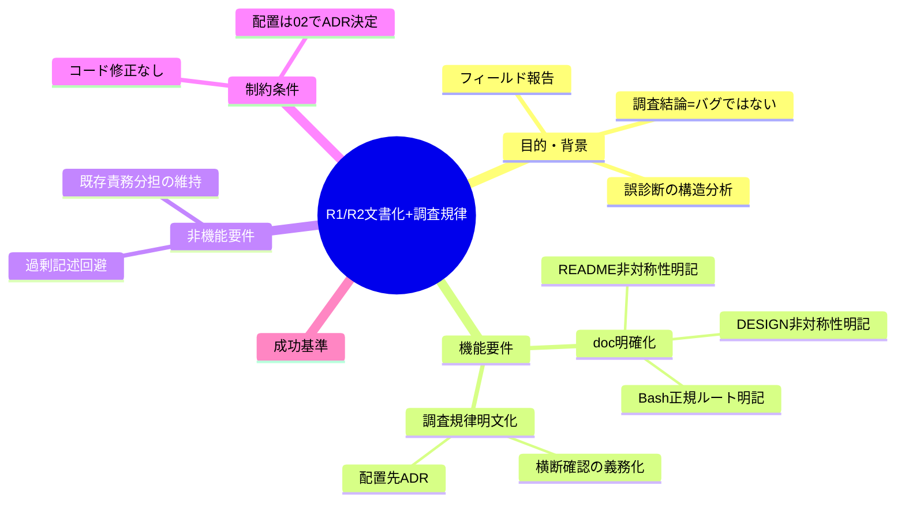
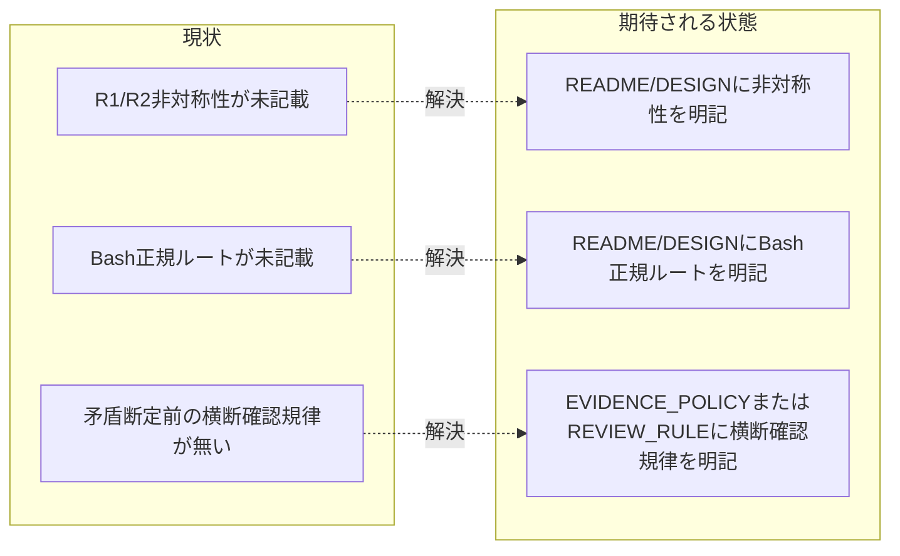

# 要求定義書: PreToolUse R1/R2 非対称性の文書化と誤診断防止の調査規律明文化

**プロジェクト名**: PreToolUse R1 挙動のドキュメント明確化＋汎用調査規律の明文化
**作成日**: 2026 年 07 月 13 日
**最終更新**: 2026 年 07 月 13 日

> **重要**:
>
> - 本 issue は当初「PreToolUse R1 がサブエージェントを誤ブロックするバグ」の調査として開始したが、**一次情報調査の結果バグではなく意図的設計と判明**した（§1.4・結論）。**コード（PreToolUse.sh 等）の修正は不要**であり、以降は行わない。
> - **スコープ拡大（ユーザー決定）**: 上記結論を踏まえ、以下 2 点を統合した issue として進める。
>   1. **ドキュメント明確化**: enforcement/README.md・DESIGN.md に R1（path 軸・全 ROLE 一律禁止）と R2（role 軸・subagent 除外）の非対称性、および Bash 経由が subagent の runtime/ 書き込み正規ルートである旨を明記する。
>   2. **汎用的な調査規律の明文化（新規スコープ）**: 今回の誤診断の構造（R1 だけを読み、R2 の IS_SUBAGENT 除外や R3(b) の Bash 許可を確認せず「矛盾＝バグ」と結論づけた）は、本件に限らず AI エージェントが「バグ/矛盾」と断定する前に踏むべき一般的な調査規律の欠如に起因する。EVIDENCE_POLICY.md または REVIEW_RULE.md（配置は design-feature で ADR 決定）にこの規律を明文化する。
> - 本 issue は **requirement-discovery（要求定義〜要件定義）** の範囲。設計（02）・実装計画（03）・実装（implement-feature）は後続 command で進める。
>
> **用語**: [.agent-skill-chain/source/CONCEPTS.md §用語規約](../../../../.agent-skill-chain/source/CONCEPTS.md#用語規約) を参照。

---

## 要求定義の全体像

---

## 1. 目的・背景

### 1.1 目的（必須）

R1/R2非対称性の文書化と誤診断防止の調査規律明文化。

### 1.2 背景

- **現状の課題**:
  - **課題 1（ドキュメント未記載）**: PreToolUse.sh の R1（path 軸・全 ROLE 一律禁止）と R2（role 軸・subagent 除外）は意図的に非対称な設計だが、enforcement/README.md・DESIGN.md にはこの非対称性の理由（timestamp memo 保護等）も、subagent が runtime/ へ書く正規ルート（Bash 経由）も明記されていない（evidence_source: `.agent-skill-chain/source/enforcement/README.md`・`DESIGN.md` の grep で該当記述なし）。
  - **課題 2（調査規律の欠如・汎用課題）**: 今回の誤診断は「R1（L167-172）だけを読み、同一ファイル内の R2（L182・IS_SUBAGENT 除外）・R3(b)（L250-253・Bash 許可）という関連ルールを横断確認せずに『矛盾＝バグ』と結論づけた」という構造だった。これは本ファイル固有ではなく、AI エージェントが「バグ/矛盾」と断定する一般的な作業（コードレビュー・要求定義の根本原因調査等）で再発しうる構造的な調査不足である。

- **必要性**:
  - **必要性 1**: 同種の非対称設計を持つ他の仕組みについても、将来の調査者（AI・人間）が「矛盾＝バグ」と誤診断しないよう、意図を明記する。
  - **必要性 2**: 「バグ/矛盾」と結論づける前に、同一ファイル・同一機構内の関連ルール（分岐条件・例外コメント等）を横断確認する調査規律を明文化し、EVIDENCE_POLICY.md（上流フェーズの重要判断の evidence 充足基準を所管）または REVIEW_RULE.md（レビュー観点の補助）のいずれかに位置づけることで、再発を防ぐ。

### 1.3 期待される効果（必須: 1 件以上）

- **効果 1**: enforcement/README.md・DESIGN.md を読んだ第三者が、R1（path 軸・全 ROLE）と R2（role 軸・subagent 除外）の非対称性を「意図的設計」と理解でき、同種の矛盾誤認が生じない（記述の有無で判定可能）。
- **効果 2**: EVIDENCE_POLICY.md または REVIEW_RULE.md に調査規律が明文化され、以後「バグ/矛盾」と断定する重要判断において、関連ルールの横断確認が要求事項として存在する（記述の有無で判定可能）。

**現状と期待される状態の比較**:

---

### 1.4 根本原因調査結果（requirement-discovery 前段の結論・変更なし）

> 本節は既存調査（結論に変更なし）の要約。詳細な evidence_source・行番号引用は `.agent-skill-chain/source/enforcement/claude/PreToolUse.sh`・`DESIGN.md`・`README.md` の実読に基づく。

- R1（L167-172）は runtime/ 配下の直接 Edit/Write を **全 ROLE 一律 block**。コメントに「（全 ROLE）」と明示。
- R2（L182）は `IS_SUBAGENT != "1"` を条件に加え、subagent worker を明示除外（role 軸）。
- R3(b)（L250-253）は subagent worker の Bash を allow。
- **R1 と R2 の非対称は意図的**: R1 は path 軸（runtime/ だけ全 ROLE 禁止・Bash 経由のみ許可）、R2 は role 軸（orchestrator 禁止・subagent 除外）という**目的の異なる独立ガード**。R1+R3(b) の合成で「subagent は runtime/ へ Bash 経由で書く」が**正規ルート**。
- **R1 全 ROLE の正当理由**: runtime/ には timestamp をシステム時計に固定すべき memo（DESIGN.md L43）・書記のみ書ける workflow.db が含まれる。R1 が subagent を除外すると、この保護が worker 経路で破れる。
- **結論**: バグではない。意図的設計。**コード修正は不要**。

---

## 2. 機能要件

### 2.1 既存機能の維持

- 既存の PreToolUse.sh 判定ロジック（R1〜R6）は**変更しない**（§1.4 の結論どおり）。
- EVIDENCE_POLICY.md・REVIEW_RULE.md の既存の責務分担（EVIDENCE_POLICY.md＝上流フェーズの重要判断の evidence 充足基準、REVIEW_RULE.md＝04_review 実施時の補助チェックリスト・正本は RULES.md）を維持し、重複記載を避ける。

### 2.2 新規機能要件

- **機能 A（ドキュメント明確化）**: `enforcement/README.md`・`DESIGN.md` に、R1（path 軸・全 ROLE 一律禁止）と R2（role 軸・subagent 除外）の非対称性が意図的である旨、および subagent の runtime/ 書き込み正規ルートが Bash 経由（heredoc/cp/new-workflow-memo.sh）である旨を追記する。
- **機能 B（調査規律の明文化）**: 「バグ/矛盾」と結論づける前に、同一ファイル・同一機構内の関連ルール（分岐条件・例外コメント等）を横断的に確認し、意図的な非対称性を示す記述（例:「全 ROLE」「対象外」等の明示コメント）の有無を確認してから断定すること、部分的な読みでの結論を禁止することを、EVIDENCE_POLICY.md または REVIEW_RULE.md のいずれか（design-feature で ADR 決定）に明文化する。

---

## 3. 非機能要件

### 3.1 パフォーマンス

- 該当なし（ドキュメント追記のみ・実行時挙動に影響しない）。

### 3.2 セキュリティ

- 該当なし（PreToolUse.sh の判定ロジックは変更しない）。

### 3.3 互換性

- 既存の EVIDENCE_POLICY.md・REVIEW_RULE.md の責務分担・正本参照構造（REVIEW_RULE.md の正本は RULES.md 等）を崩さないこと。

### 3.4 保守性

- 過剰記述化を避ける（CONTEXT_EFFICIENCY.md の規模比例思想と整合）。追記は要点のみとし、既存節の重複再定義をしない。

---

## 4. 制約条件

### 4.1 技術的制約

- コード（PreToolUse.sh・audit.sh 等）の修正は行わない。ドキュメント（enforcement/README.md・DESIGN.md・EVIDENCE_POLICY.md または REVIEW_RULE.md）の追記のみ。
- 調査規律の配置先（EVIDENCE_POLICY.md / REVIEW_RULE.md / 両方）は本 00/01 では確定せず、design-feature（02_設計.md）で ADR 形式により決定する。

### 4.2 既存システムとの互換性

- 既存の判定ロジック・監査ロジック（audit.sh 等）は変更しないため、後方互換に影響しない。

### 4.3 移行期間・スケジュール

- なし（ドキュメント追記の単発 issue）。design-feature 完了後、実装前 review-docs を経て implement-feature（ドキュメント追記の実施）まで進める想定。

---

## 5. 除外要件

- コード（PreToolUse.sh・audit.sh・enforcement スクリプト）の修正。
- 本開発リポの配備済み hook（旧版）のリフレッシュ（別関心事・§1.4 に付随事実として既出）。
- Claude Code 公式 hook API における agent_id 注入仕様の独立再検証（要人間確認事項として 01 に記載）。

---

## 6. 成功基準（必須: 1 件以上）

- enforcement/README.md・DESIGN.md に、R1（path 軸・全 ROLE）と R2（role 軸・subagent 除外）の非対称性が意図的である旨が明記されている（○/×）。
- 同ドキュメントに、subagent の runtime/ 書き込み正規ルート（Bash 経由）が明記されている（○/×）。
- EVIDENCE_POLICY.md または REVIEW_RULE.md（design-feature の ADR で決定した配置先）に、「バグ/矛盾」断定前の関連ルール横断確認規律が明記されている（○/×）。
- 02_設計.md に配置先の ADR（コンテキスト・選択肢・決定・根拠[evidence_source 付き]・帰結）が記載されている（○/×）。
- 追記が要点のみで、既存節の重複再定義になっていない（○/×・レビューで確認）。

---

## 7. リスクと対策

### 7.1 技術的リスク

- **リスク**: 調査規律をどちらのファイルに書くか誤ると、既存の責務分担（EVIDENCE_POLICY.md＝process/上流、REVIEW_RULE.md＝review 観点・正本は RULES.md）と重複・矛盾する。
  - **対策**: design-feature で両ファイルの既存責務を確認したうえで ADR 決定する（02_設計.md §2.5 横断設計判断）。

### 7.2 スケジュールリスク

- **リスク**: ドキュメント追記のみだが、review-docs の反復（指摘 0 件まで）に時間がかかりうる。
  - **対策**: 00/01/02/03 それぞれの review-docs サイクルで要点を絞り、過剰記述を避ける。

---

## 8. 参考資料

### プロジェクトドキュメント

- [`01_要件定義.md`](./01_要件定義.md) - 要件定義

### その他の参考資料

- `.agent-skill-chain/source/enforcement/claude/PreToolUse.sh`（R1: L167-172、R2: L182、R3: L250-253、IS_SUBAGENT 確定: L142-144）
- `.agent-skill-chain/source/enforcement/DESIGN.md`（§worker と main の識別 L47-51、timestamp memo L43、§Orchestrator 逸脱の検知 L40）
- `.agent-skill-chain/source/enforcement/README.md`（対応表 L245、timestamp memo 経路固定 L208）
- `.agent-skill-chain/source/EVIDENCE_POLICY.md`（上流フェーズの重要判断・evidence_source の process 側正本）
- `.agent-skill-chain/source/REVIEW_RULE.md`（レビュー実施時の観点・補助。正本は RULES.md）
- `.agent-skill-chain/source/CONCEPTS.md` §外部根拠の必須化（evidence_source 6 分類の正本）

---

## 9. 次のステップ

この要求定義書の承認後、以下のドキュメントを作成します：

- **次**: [`01_要件定義.md`](./01_要件定義.md) - 要件定義フェーズ
