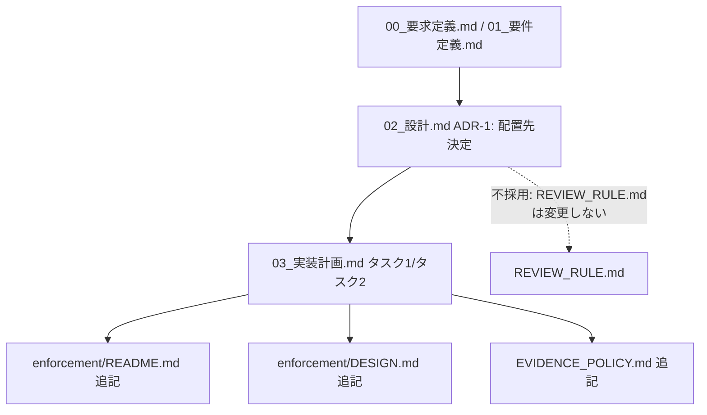
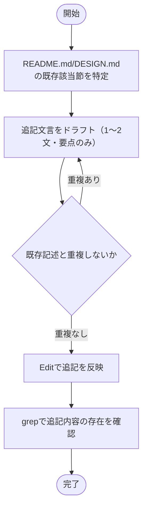

# 設計書: PreToolUse R1/R2 非対称性の文書化と汎用調査規律の明文化

**プロジェクト名**: PreToolUse R1 挙動のドキュメント明確化＋汎用調査規律の明文化
**作成日**: 2026 年 07 月 13 日
**最終更新**: 2026 年 07 月 13 日

> **重要**: **このドキュメントは常に更新**: 設計の変更や追加があった場合は、即座にこのドキュメントを更新してください。ドキュメントは「生きているドキュメント」として扱い、実装内容と常に同期させます。
>
> **用語**: [.agent-skill-chain/source/CONCEPTS.md §用語規約](../../../../.agent-skill-chain/source/CONCEPTS.md#用語規約) を参照。

---

## 1. 設計概要

**必須**: 設計方針・原則は [.agent-skill-chain/source/spec/01_設計原則.md](../../../../.agent-skill-chain/source/spec/01_設計原則.md) を先に参照した。

### 1.1 設計方針

本 issue はソフトウェアのコード変更を伴わない**ドキュメント追記のみ**の変更である。既存 4 ファイル（enforcement/README.md・DESIGN.md・EVIDENCE_POLICY.md・REVIEW_RULE.md）の既存の責務分担を維持したまま、新規ファイルを作らず、必要最小限の追記に留める。

### 1.2 設計原則（本プロジェクトで適用するもの）

- **単一責務**: 適用する。EVIDENCE_POLICY.md（process 側＝上流フェーズ執筆時の evidence 充足基準）と REVIEW_RULE.md（review 観点の補助・正本は RULES.md）という既存の単一責務分担を尊重し、新規の調査規律は**どちらか一方**の責務にのみ帰属させる（§2.5 ADR-1）。
- **明確な境界**: 適用する。ADR-1 で EVIDENCE_POLICY.md と REVIEW_RULE.md の境界（上流フェーズの process vs 実装後レビューの補助チェックリスト）を再確認し、重複させない。
- 他の原則（CQRS・イベント駆動・AI フレンドリー設計・UNIX 哲学の各詳細観点）は、本 issue がドキュメント追記のみでありコンポーネント・モジュール設計を伴わないため**該当なし**。

---

## 2. アーキテクチャ設計

### 2.1 責務・境界・参照関係

#### 2.1.1 責務一覧

| コンポーネント（ドキュメント） | 責務（1 文） |
| -------------------- | -------------------- |
| `enforcement/README.md` | Layer2 hook の強制力マトリクス・失敗条件対応表の正本。今回は R1/R2 非対称性の注記を追加する対象。 |
| `enforcement/DESIGN.md` | 強制の 4 層設計・worker/main 識別（ADR-2 等）の正本。今回は §worker と main の識別 節に非対称性の補足を追加する対象。 |
| `EVIDENCE_POLICY.md` | 上流フェーズ（requirement-discovery/design-feature）の重要判断の evidence 充足基準・process 側正本。**ADR-1 の決定によりここに調査規律ノードを追加する**。 |
| `REVIEW_RULE.md` | レビュー実施時の観点・補助（正本は RULES.md）。**ADR-1 の決定により今回は変更しない**。 |

#### 2.1.2 境界

- **入力**: [`00_要求定義.md`](./00_要求定義.md)・[`01_要件定義.md`](./01_要件定義.md) の要求・要件。
- **出力**: `enforcement/README.md`・`enforcement/DESIGN.md`・`EVIDENCE_POLICY.md` への追記（3 ファイル）。
- **他責務との境界**: `PreToolUse.sh`・`audit.sh` 等のコード変更は**本 issue の範囲外**（00 §1.4 の結論どおりバグではなく修正不要のため）。`REVIEW_RULE.md` への追記も範囲外（ADR-1）。

#### 2.1.3 参照関係

- ドキュメント追記のみであり、コード上の呼び出し関係・依存グラフへの影響は**無い**。既存の参照関係（README.md/DESIGN.md 間の相互参照、EVIDENCE_POLICY.md → CONCEPTS.md の参照）は変更しない。循環参照は発生しない。

### 2.2 システムアーキテクチャ

- 本 issue はソフトウェアアーキテクチャパターンの新規採用を伴わない（ドキュメント追記のみ）ため、**該当なし**。

#### 2.2.1 CQRS（Command/Query 分離）

- 該当なし。

#### 2.2.2 変更対象ファイルの関係図

### 2.3 コンポーネント構成

- `enforcement/README.md`・`DESIGN.md`: 既存の「強制の 4 層」「worker と main の識別」節に、非対称性が意図的である旨・Bash 正規ルートである旨を **1〜2 文程度の補足**として追加する（新規節は作らない）。
- `EVIDENCE_POLICY.md`: 既存の「節1: 上流フェーズの義務」の子項目として、調査規律（横断確認）を追加する（新規節番号は既存節 2〜5 の番号をずらさないよう、節1 の内側に収める）。

### 2.4 データフロー

- 該当なし（ドキュメント追記のみで実行時のデータフロー・イベント発行を伴わない）。

### 2.5 横断設計判断（ADR）

本プロジェクトの重要判断は [EVIDENCE_POLICY.md](../../../../.agent-skill-chain/source/EVIDENCE_POLICY.md) の ADR 形式で記録する。

#### ADR-1: 調査規律（「バグ/矛盾」断定前の関連ルール横断確認）の配置先

- **コンテキスト**: 今回の PreToolUse R1 誤診断（00 §1.4）は、「R1 だけを読み、同一ファイル内の R2・R3(b) という関連ルールを横断確認せずに『矛盾＝バグ』と結論づけた」という構造だった。この一般的な調査規律を明文化する必要があるが、既存の `EVIDENCE_POLICY.md`・`REVIEW_RULE.md` のどちらに書くべきかを、両ファイルの既存責務を確認したうえで決定する。

- **検討した選択肢**:
  1. **EVIDENCE_POLICY.md に追加**: 上流フェーズ（requirement-discovery/design-feature）の重要判断における evidence 充足基準を所管するファイル。
  2. **REVIEW_RULE.md に追加**: レビュー実施時（04_review・実装完了後）の観点・監査チェックリストを担うファイル。
  3. **両方に追加**: 冗長だが取りこぼしを防げる。

- **決定**: **選択肢 1（EVIDENCE_POLICY.md に追加）を採用する。** `REVIEW_RULE.md` は変更しない。

- **根拠（evidence_source: existing_code — 両ファイルの実読）**:
  - `EVIDENCE_POLICY.md` §節1「上流フェーズの義務」は「requirement-discovery / design-feature を実行するサブエージェントは、執筆対象に**重要判断**が含まれる場合、その判断について一次情報でフィジビリティを確認し…evidence_source を付記すること」と規定する。今回の「バグ/矛盾」の断定は、成果物（00）の構造・後続フェーズを左右する**重要判断**そのもの（EVIDENCE_POLICY.md §節3 の定義に合致）であり、かつ発生したのは requirement-discovery フェーズ中である。したがって EVIDENCE_POLICY.md の既存スコープの**精緻化**として自然に位置づけられる。
  - `REVIEW_RULE.md` L3 は「**This file is a supplementary guide; the definitive rules live in RULES.md.**」「正本は RULES.md であり、本ファイルは補助資料」と明記し、自らを新規の規範を立てる場ではないと位置づけている。
  - `REVIEW_RULE.md` L9-16（§レビュー成果物の配置）は対象スコープを「04_review は実装フェーズ完了後のレビューフェーズ（verify-and-close 実行時）」に明示的に限定している。今回の誤診断は requirement-discovery 段階（00 の執筆時）で発生しており、REVIEW_RULE.md の対象スコープの外側にある。
  - 選択肢 3（両方）は、EVIDENCE_POLICY.md 自体が随所で「本ファイルでは再定義しない」「重複させない」という編集方針（例: 節1 冒頭・節4 の process/event 役割分担の記述）を貫いていることと矛盾する。00/01 の非機能要件（過剰記述回避・CONTEXT_EFFICIENCY.md の規模比例思想）とも整合しない。

- **帰結**:
  - `EVIDENCE_POLICY.md` §節1「上流フェーズの義務」の末尾（節番号は変更せず、既存箇条書きへの追加または節1 直下の新規段落として追加。節2〜5 の番号はずらさない）に、以下の趣旨を追記する:
    1. 「バグ/矛盾」と結論づける前に、同一ファイル・同一機構内の関連ルール（分岐条件・例外コメント等）を横断的に確認すること。
    2. 意図的な非対称性を示す記述（例:「全 ROLE」「対象外」等の明示コメント）の有無を確認してから断定すること。
    3. 部分的な読みでの結論を禁止すること。
  - `REVIEW_RULE.md` は変更しない。
  - 03_実装計画.md のタスクは 2 つに分解される: タスク 1（README.md・DESIGN.md への R1/R2 非対称性・Bash 正規ルート明記）、タスク 2（EVIDENCE_POLICY.md への調査規律明記）。

---

## 3. 機能設計

### 3.1 機能 1: enforcement/README.md・DESIGN.md への R1/R2 非対称性明記

#### 3.1.1 概要

R1（path 軸・全 ROLE 一律禁止）と R2（role 軸・subagent 除外）の非対称性が意図的である旨、および subagent の runtime/ 書き込み正規ルートが Bash 経由である旨を、既存節への補足として追記する。

#### 3.1.2 処理フロー

#### 3.1.3 入力・出力

- **入力**: 00 §1.4・02 §2.5 ADR-1 で確定した追記内容の要点。既存の `README.md`・`DESIGN.md`。
- **出力**: 非対称性・Bash 正規ルートの説明が追加された `README.md`・`DESIGN.md`。

#### 3.1.4 エラーハンドリング

- ドキュメント追記のため実行時エラーハンドリングは該当なし。誤字・リンク切れ・重複記述は review-docs サイクル 2（実装前ドキュメントレビュー）で検知し修正する。

### 3.2 機能 2: EVIDENCE_POLICY.md への調査規律明記

#### 3.2.1 概要

「バグ/矛盾」と結論づける前の関連ルール横断確認規律を、EVIDENCE_POLICY.md §節1 に追記する（ADR-1 の決定に基づく）。

#### 3.2.2 処理フロー

3.1.2 と同様の処理フロー（既存節の特定 → ドラフト → 重複確認 → 反映 → 検証）を EVIDENCE_POLICY.md に対して適用する。

#### 3.2.3 入力・出力

- **入力**: 02 §2.5 ADR-1 の帰結（追記文言の要点）。既存の `EVIDENCE_POLICY.md`。
- **出力**: 調査規律が追記された `EVIDENCE_POLICY.md`。

#### 3.2.4 エラーハンドリング

- 同上（review-docs サイクル 2 で検知・修正）。

---

## 4. データ設計

- 該当なし（データモデル・テーブルを伴わない）。

---

## 5. API 設計

- 該当なし（API を伴わない）。

---

## 6. テスト戦略

テスト戦略の観点の定義は [RULES.md のテスト戦略必須要件](../../../../.agent-skill-chain/source/RULES.md#テスト戦略必須要件) を参照。本ドキュメントでは、ドキュメント追記という性質上、単体/結合/E2E に代えて「ドキュメントレビュー（review-docs）」と「grep による内容存在確認」をテストレベルとして割り当てる。

### 6.1 対象ごとのテスト割り当て

| 対象 | 単体（grep 存在確認） | 結合/API | E2E（review-docs） | クリティカル観点 | バリデーション観点 | 未達理由/補足 |
| --------------------------- | ----- | -------- | ----- | ---------------- | ------------------ | ------------- |
| enforcement/README.md・DESIGN.md 追記 | ○ | 該当なし | ○ | 非対称性の意図・Bash 正規ルートが明記されているか | 既存節の重複再定義がないか | ドキュメントのためコードテスト対象外。grep 確認＋review-docs で担保 |
| EVIDENCE_POLICY.md 追記 | ○ | 該当なし | ○ | 横断確認規律が節1配下に自然に接続されているか | REVIEW_RULE.md・既存 evidence_source 定義と重複しないか | 同上 |

### 6.2 監査・レビューでの確認（証跡）

review-docs サイクル 2（02/03 対象・design-feature 完了後の必須ゲート）と、implement-feature 実施後の review-docs（または簡易確認）で、上記割当表と 03_実装計画のタスク別テスト観点が揃っていることを確認する。

---

## 7. UI 設計

- 該当なし（UI を伴わない）。

---

## 8. セキュリティ設計

### 8.1 認証・認可

- 該当なし（PreToolUse.sh の判定ロジック・偽装耐性は変更しない。00 §3.2 のとおり）。

### 8.2 データ保護

- 該当なし。

---

## 9. 非機能要件への対応

### 9.1 パフォーマンス

- 該当なし（ドキュメント追記のみ・実行時挙動に影響しない）。

### 9.2 可用性

- 該当なし（既存 R1〜R6 の判定順・挙動を一切変更しない）。

---

## 10. 参考資料

### プロジェクトドキュメント

- [`01_要件定義.md`](./01_要件定義.md) - 要件定義
- [`00_要求定義.md`](./00_要求定義.md) - 要求定義（根本原因調査の結論）

### その他の参考資料

- `.agent-skill-chain/source/EVIDENCE_POLICY.md` §節1 上流フェーズの義務
- `.agent-skill-chain/source/REVIEW_RULE.md` L3（正本は RULES.md）・L9-16（対象スコープ）
- `.agent-skill-chain/source/enforcement/README.md`・`DESIGN.md`

---

## 11. 前のステップ

この設計書は、以下のドキュメントを基に作成されています：

- **前**: [`01_要件定義.md`](./01_要件定義.md) - 要件定義フェーズ

---

## 12. 次のステップ

この設計書の承認後、以下のドキュメントを作成します：

- **次**: [`03_実装計画.md`](./03_実装計画.md) - 実装計画フェーズ
