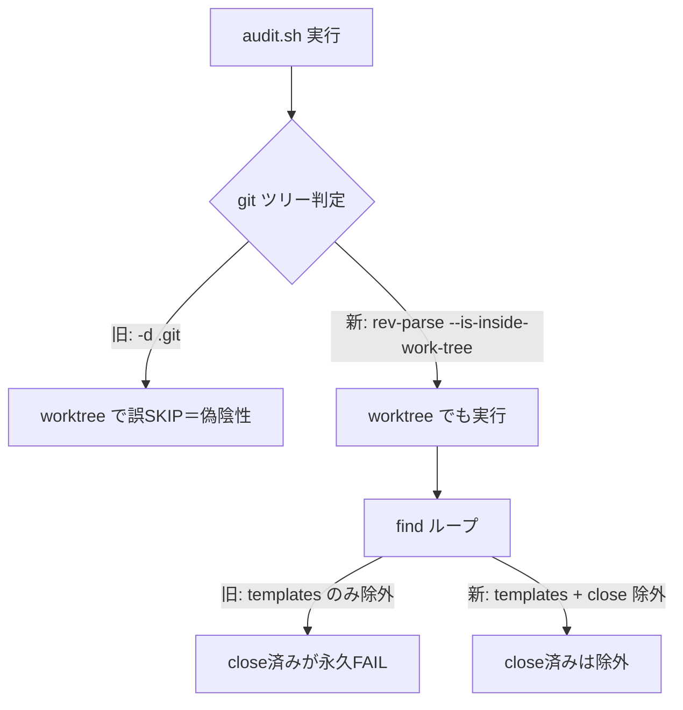

# 設計書: audit.sh の worktree 誤 SKIP と close 除外漏れの既存バグ修正

**プロジェクト名**: audit.sh worktree 誤 SKIP・close 除外漏れ修正
**作成日**: 2026 年 07 月 13 日
**最終更新**: 2026 年 07 月 13 日

> **重要**: このドキュメントは「生きているドキュメント」として扱い、実装内容と常に同期させる。

---

## 1. 設計概要

### 1.1 設計方針

既存の正しい修正パターン（同一ファイル内の #28:769・#29/#31/#32 のガード表現）に統一収束させることで、`-d .git` に依存する worktree 誤 SKIP を除去し、close 済み issue を #4/#5 から除外する。新しい抽象は導入せず、既存の慣用形へ揃える最小差分とする。

### 1.2 設計原則（本プロジェクトで適用するもの）

- **UNIX 哲学**: 小さく直す。監査 1 スクリプト内の局所修正に閉じ、外部依存や新機能を足さない。
- **単一責務**: 各監査関数の責務（何を検出するか）は不変のまま、「実 git ツリー判定」「走査対象の除外」という前提部分のみ正す。
- **AI フレンドリー設計**: 判定表現を単一の慣用形（`git rev-parse --is-inside-work-tree` / `[[ "$f" == *"/close/"* ]] && continue`）へ揃え、意図が読み取れる形にする。

---

## 2. アーキテクチャ設計

### 2.1 責務・境界・参照関係

#### 2.1.1 責務一覧

| コンポーネント | 責務（1 文） |
| -------------- | ------------ |
| audit.sh #10 check_sqlite_sidecar | worktree でも sidecar 追跡禁止を検査できるよう git ツリー判定を正す |
| audit.sh #18 check_review_file_has_verify_log | worktree でも 04 変更↔verify ログ対応を検査できるよう判定を正す |
| audit.sh #19 check_artifact_change_has_implement_log | worktree でも成果物変更↔実装ログ対応を検査できるよう判定を正す |
| audit.sh #25 check_25_main_did_real_work | worktree でもメイン直接作業検知を実行できるよう判定を正す |
| audit.sh #27 check_review_dual_lists | worktree でも 04 両リスト検査を実行できるよう判定を正す |
| audit.sh #28 check_issue_doc_in_gitignored_path | 先行する冗長・誤りの `-d .git` ガードを除去し worktree 誤 SKIP を止める |
| audit.sh #4 テスト観点未記載チェック | close 済み 03 を走査対象から除外する |
| audit.sh #5 docs 更新要否未記載チェック | close 済み 04 を走査対象から除外する |
| test/test-audit.sh | worktree 再現・close 除外の回帰シナリオを追加する |

#### 2.1.2 境界

- **入力**: `audit.sh <PROJECT_ROOT> [GIT_RANGE]`（既存 I/F 不変）。
- **出力**: 既存の `FAIL:` / `[audit] ...` / `Audit passed.` 形式（不変）。
- **他責務との境界**: verify-and-close（04 作成）・#33/#34 の導入は範囲外。既存 #29/#31/#32 のロジックは不変（参照のみ）。

#### 2.1.3 参照関係

- 各監査関数 → git（`git -C "$PROJECT_ROOT" rev-parse --is-inside-work-tree`）。循環参照なし。
- test-audit.sh → audit.sh（隔離ツリーを引数に実行）。

### 2.2 システムアーキテクチャ

- **採用パターン**: 手続き的シェルスクリプトの局所パッチ（既存構造を踏襲）。
- **根拠**: 対象は単一スクリプト内のガード式のみ。新パターン導入は過剰（spec §設計判断の優先順位＝規模比例・最小変更）。evidence_source: existing_code（audit.sh の既存 #28/#29/#31/#32 が同一慣用形を採用済み）。

#### 2.2.2 アーキテクチャ図（本プロジェクトの構成で記載）

### 2.3 コンポーネント構成

- 変更は `.agent-skill-chain/source/enforcement/ci/audit.sh` と `test/test-audit.sh` の 2 ファイルに限定する。境界: 監査ロジック（source）と自己テスト（test/・非配布）を分離したまま扱う。

### 2.4 データフロー

- audit.sh は PROJECT_ROOT を受け取り、git 判定 → find 走査 → チェックの順に処理する。本 issue は「git 判定」と「find 走査の除外条件」のみを正す。イベント発行は無い。

### 2.5 横断設計判断（ADR）

#### ADR-1: `-d .git` を `git rev-parse --is-inside-work-tree` に置換する（バグ A）

- **コンテキスト**: worktree では `$PROJECT_ROOT/.git` がファイルのため `[[ ! -d .git ]]` が真になり、監査が fail-open で SKIP される。
- **検討した選択肢**:
  1. `[[ ! -e "$PROJECT_ROOT/.git" ]]`（存在チェックに緩める）。
  2. `git -C "$PROJECT_ROOT" rev-parse --is-inside-work-tree`（git 自身に判定させる）。
- **決定**: 選択肢 2 を採用。
- **根拠**: 選択肢 1 は submodule/親子 worktree など `.git` の実体差を吸収しきれない。選択肢 2 は同ファイル内 #28:769 および #33/#34（別ブランチ）が既に採用する正準形であり、worktree・通常リポ・非 git ツリーを一貫して正しく判定する。evidence_source: existing_code（audit.sh:769 の #28 が同表現を使用）。
- **帰結**: 対象 5 関数（#10/#18/#19/#25/#27）の先頭ガードが統一される。#18/#19/#25/#27 は直後の `rev-parse HEAD` ガード（コミット無しリポ対策）を維持する。

#### ADR-2: #28 の先行 `-d .git` ガード（audit.sh:768）も除去する（バグ A の同型・追加発見）

- **コンテキスト**: #28 は 768 行に `[[ ! -d .git ]] && return 0`、769 行に正しい `is-inside-work-tree` ガードを持つ。worktree では 768 が先に真となり 769 に到達せず SKIP する（同型バグ）。
- **検討した選択肢**:
  1. 768 を放置（タスク明示の 5 件のみ修正）。
  2. 768 を削除し、正しい 769 のガードに一本化する。
- **決定**: 選択肢 2 を採用。
- **根拠**: 768 は 769 の正しいガードに対する冗長かつ誤った先行ガードであり、削除しても #28 の意図（非 git ツリー SKIP）は 769 が維持する。放置すると同一バグ（worktree 誤 SKIP）が #28 に残り、本 issue の目的（バグ A の是正）が未達となる。#28 はタスクの「変更禁止」列挙（#29/#31/#32）に含まれない。evidence_source: existing_code（audit.sh:768-769）。
- **帰結**: #28 も worktree で正しく実行される。ロジック（gitignore 配下検知）は不変。

#### ADR-3: #4/#5 の find ループに `/close/` 除外を追加する（バグ B）

- **コンテキスト**: #4/#5 は `*/templates/*` のみ除外し、close 済み issue を除外しない。既存 #29/#31/#32 は `[[ "$f" == *"/close/"* ]] && continue` で close を除外済み。
- **検討した選択肢**:
  1. `find` の `-path` プルーニングで除外。
  2. ループ本体先頭に `[[ "$f" == *"/close/"* ]] && continue` を追加（既存 #29/#31/#32 と同型）。
- **決定**: 選択肢 2 を採用。
- **根拠**: 既存の close 除外は全て「ループ本体の文字列一致 continue」で実装されており、表現を揃えることで一貫性・可読性が上がる。evidence_source: existing_code（audit.sh の #29:803・#31:841・#32:902 が同表現）。
- **帰結**: close 済み 03/04 は #4/#5 の対象外となる。close 外の in-progress は従来どおり検査される（過剰除外なし）。

---

## 3. 機能設計

### 3.1 機能 1: git ツリー判定の統一（バグ A）

#### 3.1.1 概要

`[[ ! -d "$PROJECT_ROOT/.git" ]] && return 0`（および #10 の `if [[ ! -d ... ]]; then return 0; fi`）を `if ! git -C "$PROJECT_ROOT" rev-parse --is-inside-work-tree &>/dev/null; then return 0; fi` に置換する。#28 は先行する 768 行のみ削除。

#### 3.1.3 入力・出力

- **入力**: PROJECT_ROOT（worktree ルート／通常リポ／非 git ツリー）。
- **出力**: worktree・通常リポでは監査続行、非 git ツリーでは SKIP（return 0）。

#### 3.1.4 エラーハンドリング

- `git rev-parse` は非 git ツリーで非ゼロを返す→`&>/dev/null` で握り潰し return 0（既存 #28:769 と同じ・set -e に影響しない条件式）。

### 3.2 機能 2: close 済み issue の除外（バグ B）

#### 3.2.1 概要

#4（`find ... -name 03_実装計画.md`）と #5（`find ... -name 04_review.md`）の while ループ本体先頭に、既存 `[[ "$f" == *"/templates/"* ]] && continue` の直後へ `[[ "$f" == *"/close/"* ]] && continue` を追加する。

---

## 6. テスト戦略

### 6.1 対象ごとのテスト割り当て

| 対象 | 単体 | 結合/API | E2E | クリティカル観点 | バリデーション観点 | 未達理由/補足 |
| ---- | ---- | -------- | --- | ---------------- | ------------------ | ------------- |
| バグ A 判定統一（#25 等） | ○ | × | × | worktree で監査が実行され違反を FAIL する | 非 git ツリーで従来どおり SKIP | 実 git 依存は `make_worktree` フィクスチャで担保 |
| バグ A #28 | ○ | × | × | worktree で #28 が SKIP されない（実行ログ確認） | 通常リポ・非 git で挙動不変 | - |
| バグ B close 除外（#4/#5） | ○ | × | × | close 配下 03/04 が FAIL しない | close 外 in-progress は FAIL する（過剰除外なし） | - |
| 実リポ受け入れ | × | × | ○ | 本 worktree ルートで `audit.sh .` の close 由来 FAIL が 0 件 | - | 実データでの最終確認 |

### 6.2 監査・レビューでの確認（証跡）

本設計書 §6.1 の割当と 03_実装計画のタスク別テスト観点・BDD が揃っていることを review-docs で確認し、write-workflow-log に証跡を残す。

---

## 10. 参考資料

### プロジェクトドキュメント

- [`01_要件定義.md`](./01_要件定義.md) - 要件定義

### その他の参考資料

- `.agent-skill-chain/source/enforcement/ci/audit.sh`
- `test/test-audit.sh`

---

## 11. 前のステップ

- **前**: [`01_要件定義.md`](./01_要件定義.md) - 要件定義フェーズ

---

## 12. 次のステップ

- **次**: [`03_実装計画.md`](./03_実装計画.md) - 実装計画フェーズ
