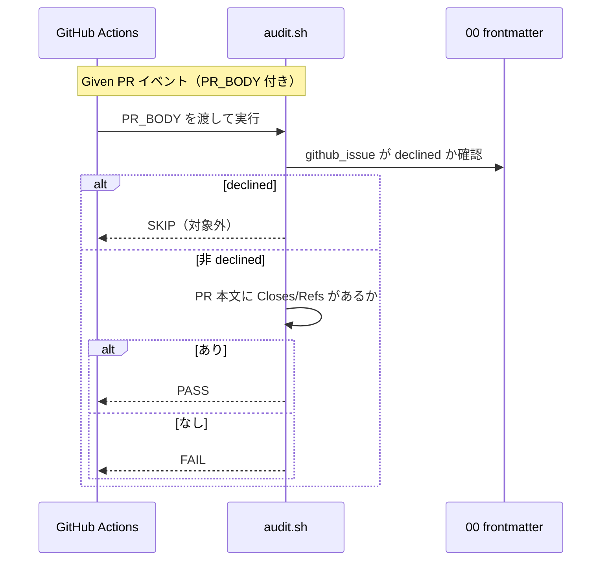

# 要件定義書: issue 紐づけ（ブランチ・GitHub Issue・PR）の機械強制

**プロジェクト名**: issue 紐づけ（ブランチ・GitHub Issue・PR）の機械強制
**作成日**: 2026 年 07 月 13 日
**最終更新**: 2026 年 07 月 13 日

> **重要**: **このドキュメントは常に更新**: 要件の変更や追加があった場合は、即座にこのドキュメントを更新してください。ドキュメントは「生きているドキュメント」として扱い、実装内容と常に同期させます。
>
> **用語**: [.agent-skill-chain/source/CONCEPTS.md §用語規約](../../../../.agent-skill-chain/source/CONCEPTS.md#用語規約) を参照。

---

## 1. 概要

### 1.1 システム概要

ローカル issue（`docs/maintainer/workflow/{issue}/00_要求定義.md` の frontmatter）を中心に、**ブランチ・PR・GitHub Issue の 4 点紐づけ**を機械監査（audit.sh の連番チェック・CI FAIL）で強制する。対象は次の 3 辺:

1. **ブランチ紐づけ**: 00 frontmatter の `branch` キー ⇔ 実装 feature ブランチ。implement-feature 着手前に `branch` が記録されていることを機械監査で強制。
2. **GitHub Issue 紐づけの実効性確認**: 既存の github_issue ゲート監査（`github_issue` が空でないことの implement 前チェック）で十分か、起票直後の書き戻しタイミングまで強制するかを両論併記（design-feature への申し送り）。
3. **PR 紐づけ**: PR 本文の `Closes #<番号>`／`Refs #<番号>` ⇔ 対応 GitHub Issue。CI（GitHub Actions）で `PR_BODY` を受け取り検証。ローカル・push では SKIP。`github_issue` が `declined:` の issue は対象外。

本 issue は 00〜03（要求・要件・設計・実装計画）を扱う。implement-feature（実装）着手前に review-docs（実装前ドキュメントレビュー）と GitHub Issue 起票判断ゲートを経る。

### 1.2 用語集

| 用語 | 説明 |
| ---- | ---- |
| ローカル issue | `docs/maintainer/workflow/{issue}/` 配下の 00〜04 ドキュメント一式（本リポの自己拡張 issue） |
| github_issue ゲート監査 | 別 issue「GitHubIssue 起票ゲート追加」で導入する、`github_issue` frontmatter が空でないことを implement 前に強制する監査。本 issue のブランチ紐づけ監査の同型テンプレート |
| ブランチ紐づけ監査 | 00 frontmatter の `branch` が implement 着手時に記録されていることを強制する新規監査 |
| PR 紐づけ監査 | PR 本文に `Closes #N`／`Refs #N` が含まれることを CI で検証する新規監査 |
| PR_BODY | CI が `github.event.pull_request.body` を渡す環境変数。既存 #6・audit.yml の前例に従う |
| grandfather | 発効日（issue ディレクトリ名の `YYYYMMDD_HHMMSS_` プレフィックス）より前の既存 issue に遡及適用しないこと |
| declined | `github_issue: "declined: <理由>"`。GitHub Issue を起票しないと判断した状態。PR 紐づけ監査の対象外 |

---

## 2. 機能要件

### 2.1 ユーザーストーリー

#### ストーリー 1: ブランチ紐づけの機械強制

- **As a** 本フレームワークの進行役（orchestrator）
- **I want to** implement-feature 着手前に、対応する feature ブランチ名が 00 frontmatter の `branch` に記録されていることを機械監査で強制されたい
- **So that** ブランチと issue の対応が場当たりにならず、どのブランチがどの issue の作業かを常に追跡できる

**受け入れ基準**:

- 00_要求定義.md のテンプレート（`.agent-skill-chain/runtime/templates/00_要求定義.md`）に `branch` frontmatter キーが追加されている。
- implement-feature ログが記録されている issue で `branch` が空（未記録・`null`・空文字）の場合、機械監査が FAIL を返す。
- `branch` が非空（例: `branch: "docs/readme-audience-split"`）なら PASS する。
- 監査は github_issue ゲート監査と同型（implement 前チェック・issue_path スコープ前方一致・basename 末尾一致・grandfather・close/templates 除外）である。
- 発効日より前の既存 issue（`branch` キーを持たない）は grandfather として SKIP され、誤 FAIL しない。

#### ストーリー 2: GitHub Issue 紐づけの実効性確認（両論併記）

- **As a** 本フレームワークの保守者
- **I want to** 既存の github_issue ゲート監査で「書き戻し失念事故」を防げるか、起票直後の書き戻しタイミングまで強制すべきかを判断できる材料が整理されていてほしい
- **So that** design-feature で過不足のない強制設計を選択できる

**受け入れ基準**:

- 次の両案が、判定手段・トレードオフとともに §2.3 ビジネスルールまたは本節に記載されている。
  - **案 A（現状維持で十分）**: github_issue ゲート監査（implement 前に `github_issue` が非空）で足りるとする。書き戻しは「implement 着手前」という遅延許容点まで猶予され、その時点で機械監査が捕捉する。
  - **案 B（タイミング強制の追加）**: `gh issue create` 実行直後の書き戻しまで強制する。ただし「起票直後」という時点は git 差分・DB・frontmatter のいずれにも痕跡を残しにくく機械検知が困難であるため、CLOSEOUT §委譲ツール発行の malformed 自己検証と同型の「即時自己検証（起票 → 即書き戻しの手順を規約化）」＋人手監査に委ねる部分が残る。
- 本 issue（要求・要件）では**いずれか一方に確定せず**、両案を残して design-feature へ申し送ることが明記されている。

#### ストーリー 3: PR 紐づけの CI 検証

- **As a** 本フレームワークの進行役
- **I want to** PR 本文に対応 GitHub Issue への `Closes #<番号>` または `Refs #<番号>` が含まれることを CI で検証されたい
- **So that** PR とローカル issue・GitHub Issue の紐づけが漏れず、マージ時の自動クローズ／参照が機能する

**受け入れ基準**:

- CI（GitHub Actions）で `PR_BODY` が渡されたとき、PR 本文に `Closes #<番号>` または `Refs #<番号>`（大小文字・GitHub が認める同義キーワードを含む。厳密なパターンは 02 で確定）が 1 件以上含まれていなければ FAIL する。
- `PR_BODY` が未設定の実行（ローカル audit.sh・push イベント）では当該検証は SKIP する（既存 #6 と同型）。
- 対応するローカル issue の `github_issue` が `declined:` で始まる場合、当該 issue は PR 紐づけ検証の対象外とする。
- 既存 #6 の `PR_BODY` 受け渡しパターン（audit.yml / subagent-guard.yml の `github.event.pull_request.body`）を用い、新たな受け渡し機構を発明しない。

#### ストーリー 4: 論点への回答・方針の確定

- **As a** 本フレームワークの保守者
- **I want to** 監査番号体系・PR 検証の CI 限定性・1PR 複数 issue・grandfather の各論点への回答が要件に明記されていてほしい
- **So that** design-feature がぶれずに設計を進められる

**受け入れ基準**:

- §2.3 ビジネスルールに 4 論点への回答／方針が記載されている（下記）。

### 2.2 BDD ユースケース

#### ユースケース 1: ブランチ紐づけ監査

**シナリオ 1: branch 未記録での implement は FAIL**

```gherkin
Feature: ブランチ紐づけの機械強制
  Scenario: implement-feature ログがあるのに branch が未記録
    Given 発効日以降の issue に implement-feature ログが workflow.db に 1 件以上ある
    And その issue の 00_要求定義.md frontmatter の branch が空（null / 空文字 / キー無し）
    When audit.sh を実行する
    Then ブランチ紐づけ監査が FAIL を返す
    And 差し戻しメッセージが 00_要求定義.md の branch への記録を促す
```

**シナリオ 2: branch 記録済みなら PASS**

```gherkin
Feature: ブランチ紐づけの機械強制
  Scenario: branch が記録済み
    Given 発効日以降の issue に implement-feature ログがある
    And その issue の 00_要求定義.md frontmatter の branch が非空である
    When audit.sh を実行する
    Then ブランチ紐づけ監査は PASS する
```

**シナリオ 3: 発効日前の既存 issue は grandfather で SKIP**

```gherkin
Feature: ブランチ紐づけの機械強制
  Scenario: 発効日前の既存 issue には遡及適用しない
    Given issue ディレクトリ名の YYYYMMDD_HHMMSS_ プレフィックスが発効日より前である
    And その issue の 00_要求定義.md に branch キーが無い
    When audit.sh を実行する
    Then ブランチ紐づけ監査は当該 issue を SKIP し FAIL しない
```

#### ユースケース 2: PR 紐づけ監査（CI 限定）

**シナリオ 1: PR 本文に Closes/Refs が無ければ FAIL**

```gherkin
Feature: PR 紐づけの CI 検証
  Scenario: PR イベントで PR 本文に紐づけキーワードが無い
    Given CI が PR イベントで audit.sh を実行し PR_BODY が渡されている
    And 対応ローカル issue の github_issue が declined: で始まらない
    And PR 本文に Closes #<番号> も Refs #<番号> も含まれない
    When audit.sh を実行する
    Then PR 紐づけ監査が FAIL を返す
```

**シナリオ 2: PR 本文に Closes があれば PASS**

```gherkin
Feature: PR 紐づけの CI 検証
  Scenario: PR 本文に Closes が含まれる
    Given CI が PR イベントで audit.sh を実行し PR_BODY が渡されている
    And PR 本文に Closes #123 が含まれる
    When audit.sh を実行する
    Then PR 紐づけ監査は PASS する
```

**シナリオ 3: ローカル・push では SKIP（挙動差）**

```gherkin
Feature: PR 紐づけの CI 検証
  Scenario: PR_BODY が未設定の実行では検証しない
    Given ローカル実行または push イベントで PR_BODY が未設定である
    When audit.sh を実行する
    Then PR 紐づけ監査は SKIP し FAIL しない
```

**シナリオ 4: declined の issue は対象外**

```gherkin
Feature: PR 紐づけの CI 検証
  Scenario: github_issue が declined の issue は検証対象外
    Given CI が PR イベントで PR_BODY 付きで audit.sh を実行する
    And 対応ローカル issue の github_issue が "declined: <理由>" である
    And PR 本文に Closes/Refs が含まれない
    When audit.sh を実行する
    Then PR 紐づけ監査は当該 issue を対象外とし FAIL しない
```

**処理フロー**:



#### ユースケース 3: GitHub Issue 紐づけ実効性（両論併記の意思決定）

**シナリオ 1: 両案の申し送り**

```gherkin
Feature: GitHub Issue 紐づけの実効性確認
  Scenario: design-feature への両論併記
    Given github_issue ゲート監査が implement 前に github_issue 非空を強制する
    When 本 issue の要件を確定する
    Then 案 A（現状維持で十分）と案 B（起票直後の書き戻しまで強制）が判定手段・トレードオフとともに記載される
    And いずれか一方に確定せず両案が design-feature へ申し送られる
```

### 2.3 ビジネスルール（論点への回答・方針）

本 issue タスクが挙げた 4 論点への回答／方針。

- **論点 1（監査番号体系: 統合 or 独立）** → **独立した番号**で定義する。根拠: 既存の監査は「1 チェック=1 番号」で運用され（#6・#29・#32 等）、3 辺は実行コンテキストが異なる（ブランチ／GitHub Issue 紐づけ＝ローカル audit.sh でも実行可・frontmatter 情報源／PR 紐づけ＝CI 側 `PR_BODY` 限定）。統合すると SKIP ガード・grandfather・強制レベルが辺ごとに異なるため 1 チェックに詰め込むと可読性・非交差性が損なわれる。既存 #29/#32 の「非交差」設計と一貫させ、各辺を独立番号・非交差で定義する。具体番号は 02/03 で、既存採番（github_issue ゲート監査に予約される番号を含む）との衝突を確認して確定する。
- **論点 2（PR 紐づけの CI 限定性）** → PR 本文は GitHub 上にしか存在せず、ローカル audit.sh（コミット前）では原理的に検証不可能である。したがって PR 紐づけ監査は `PR_BODY` が渡る CI（PR イベント）でのみ FAIL 判定し、`PR_BODY` 未設定のローカル・push では SKIP する。**ローカル実行時と CI 実行時で挙動が異なる**設計であることを仕様として明記する（既存 #6 と同型）。加えて、本リポ CI（self-enforce.yml）は現在 audit.sh を非ブロッキングで呼び `PR_BODY` を渡していないため、本リポの PR で実効化するには self-enforce.yml への `PR_BODY` 配線とブロッキング化の検討が必要（design-feature への申し送り）。
- **論点 3（1PR=1issue か複数 issue まとめか）** → **1PR=1issue を原則**とする（CLOSEOUT §commit ステップ「1 サブ issue=1 論理コミット」・github_issue ゲート監査のトップレベル issue 単位の思想と整合）。ただし複数 issue をまとめた PR もありうる前提を残し、PR 紐づけ監査の照合粒度は「PR 本文に**少なくとも 1 件**の有効な `Closes/Refs` があること」を要求する案を軸とする（issue ごとの厳密な 1:1 照合は、PR とローカル issue の対応を機械的に特定する情報源が乏しいため過剰強制になりやすい）。最終粒度は 02 で一意に確定する。
- **論点 4（grandfather: 既存 issue への遡及適用）** → 既存 issue（①〜⑨、`docs/maintainer/workflow/` 配下）には**遡及適用しない**。issue ディレクトリ名の `YYYYMMDD_HHMMSS_` プレフィックスが発効日（既存 #32 の `REVIEWDOCS_GATE_EFFECTIVE_FROM` と同型の env 変数・具体値は 02/03 で確定）より前なら SKIP する。PR 紐づけ監査は PR 単位で issue ディレクトリ名に直接紐づかないため、grandfather の判定キー（対応 issue の発効日で判定するか、PR 作成日で判定するか）を 02 で確定する。

---

## 3. 非機能要件

### 3.1 パフォーマンス要件

- 各監査は frontmatter 読み取り・文字列照合・軽量 SQL に限られ、audit.sh 全体・CI 実行時間への有意な増加を生じさせない。

### 3.2 セキュリティ要件

- PR 本文検証は `github.event.pull_request.body`（GitHub 提供）のみを用い、認証トークン等の秘匿値を成果物・ログに残さない（既存 #6 と同一）。

### 3.3 ユーザビリティ要件

- FAIL 時は既存監査と同一様式の差し戻しメッセージ（`ROLLBACK_MSG` 相当）を出力し、どのファイル（00 frontmatter）・どの記録（`branch`／`Closes` 等）を補うべきかを示す。

### 3.4 可用性要件

- 非対象環境（GitHub 非採用・`PR_BODY` 未取得・push・非 git・DB 不採用・grandfather）では該当監査を必ず SKIP し、ワークフロー／CI をロックアウトしない。過去の enforce on ロックアウト事例と同種の硬直を避ける。

---

## 4. 外部インターフェース要件

### 4.1 API 要件

- **GitHub Actions**: PR イベントで `PR_BODY: ${{ github.event.pull_request.body }}` を audit.sh に渡す（audit.yml / subagent-guard.yml の既存前例に従う）。本リポの self-enforce.yml へ同配線を追加するかは design-feature で判断。
- **audit.sh**: ブランチ紐づけ監査は 00 frontmatter を情報源とし、既存の frontmatter パース関数（`get_document_id_from_file` と同型の yq→python3→awk フォールバック）で `branch`／`github_issue` を読む。PR 紐づけ監査は `${PR_BODY:-}` を情報源とする。

### 4.2 データ形式要件

- `branch`: 文字列（feature ブランチ名。例 `docs/readme-audience-split`）。空／`null`／未記録は「未紐づけ」扱い。
- `github_issue`: 既存方式に従う（`"#<番号>"`／URL／`"declined: <理由>"`／`null`）。`declined:` 始まりは PR 紐づけ監査の対象外の判定キー。
- PR 本文の紐づけキーワード: `Closes #<番号>`／`Refs #<番号>`（GitHub が認める同義語・大小文字許容。厳密パターンは 02 で確定）。

---

## 5. 制約事項

- **本 issue は 02_設計.md・03_実装計画.md まで作成する**。implement-feature（実装）着手前に review-docs と GitHub Issue 起票判断ゲートを経る。
- **PR 紐づけ監査はローカルでは原理的に検証不可**であり、CI（`PR_BODY` 付き）でのみ FAIL 判定する（ローカル・push は SKIP）。
- 既存 issue への遡及適用はしない（grandfather）。
- 抽象原則＝コア（`.agent-skill-chain/source/`）／具体値＝`.agent-skill-chain/project/`・テンプレートの配置境界を越えない。
- 別ブランチ（`docs/github-issue-gate` 等）の実物ファイルは読み取りのみ・編集しない。
- 既存監査・`workflow.db` スキーマ・`PR_BODY` 受け渡しテンプレートと非交差・整合を保つ。

---

## 6. 参考資料

### プロジェクトドキュメント

- [`00_要求定義.md`](./00_要求定義.md) - 要求定義
- [`.agent-skill-chain/source/enforcement/ci/audit.sh`](../../../../.agent-skill-chain/source/enforcement/ci/audit.sh) - 既存監査群（#6・#29・#32・`get_document_id_from_file`）。
- [`.agent-skill-chain/runtime/templates/github/workflows/audit.yml`](../../../../.agent-skill-chain/runtime/templates/github/workflows/audit.yml) - `PR_BODY` 受け渡し配線。
- [`.github/workflows/self-enforce.yml`](../../../../.github/workflows/self-enforce.yml) - 本リポ CI（audit 非ブロッキング・`PR_BODY` 未配線）。
- [`.agent-skill-chain/runtime/templates/00_要求定義.md`](../../../../.agent-skill-chain/runtime/templates/00_要求定義.md) - `branch` キー追加対象。
- [`.agent-skill-chain/source/CLOSEOUT.md`](../../../../.agent-skill-chain/source/CLOSEOUT.md) - §commit ステップ（1 サブ issue=1 論理コミット）。
- [`.agent-skill-chain/source/enforcement/README.md`](../../../../.agent-skill-chain/source/enforcement/README.md) - 失敗条件・番号割当・強制レベルの正本。

### その他の参考資料

- GitHub PR 本文キーワード（`Closes #N` / `Refs #N`）仕様（GitHub 公式）。

---

## 7. 前のステップ

この要件定義書は、以下のドキュメントを基に作成されています：

- **前**: [`00_要求定義.md`](./00_要求定義.md) - 要求定義フェーズ

---

## 8. 次のステップ

この要件定義書の承認後、以下のドキュメントを作成します：

- **次**: [`02_設計.md`](./02_設計.md)・[`03_実装計画.md`](./03_実装計画.md)（作成済み）→ review-docs（実装前ドキュメントレビュー）→ implement-feature（GitHub Issue 起票判断ゲート通過後）
