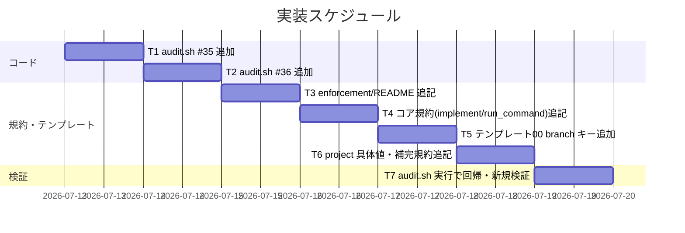

# 実装計画書: issue 紐づけ（ブランチ・GitHub Issue・PR）の機械強制

**プロジェクト名**: issue 紐づけ（ブランチ・GitHub Issue・PR）の機械強制
**作成日**: 2026 年 07 月 13 日
**最終更新**: 2026 年 07 月 13 日

> **重要**: **このドキュメントは常に更新**: 実装計画の変更、進捗状況の更新、バグの記録などがあった場合は、即座にこのドキュメントを更新してください。ドキュメントは「生きているドキュメント」として扱い、実装内容と常に同期させます。
> **必須項目**: 「必須」と明記した欄は空欄・抽象語のみで提出しないこと。テスト観点・BDD 仕様は具体ケースを 1 件以上記載すること。
>
> **用語**: [.agent-skill-chain/source/CONCEPTS.md §用語規約](../../../../.agent-skill-chain/source/CONCEPTS.md#用語規約) を参照。

---

## 1. 実装概要

### 1.1 実装方針（必須）

02_設計に従い、既存監査（#6・#32・#34）の写像として `audit.sh` に **#35（ブランチ紐づけ）**・**#36（PR 紐づけ）** の 2 チェックを追加し、規約ドキュメント（コア）・具体値（project）・テンプレート（frontmatter）を整合させる。GitHub Issue 紐づけの実効性は ADR-3 のとおり新規監査を作らず補完規約のみ追加する。本リポ CI（self-enforce.yml）の PR_BODY 配線は ADR-8 のとおり申し送りとし本 issue では編集しない。

### 1.2 実装順序（必須: 1 件以上）



実装順序: T1（#35）→ T2（#36）→ T3（README 失敗条件）→ T4（コア規約）→ T5（テンプレート branch キー）→ T6（project 具体値・GitHub Issue 補完規約）→ T7（検証）。

---

## 2. タスク分解

**必須**: 各タスクには「テスト観点」（2.x.3）と「単体テスト仕様（BDD）」（2.x.4）を必ず記載する。観点の定義は 02_設計 §6 および [TEST_BDD_FORMAT.md](../../../../.agent-skill-chain/source/TEST_BDD_FORMAT.md) を参照。

### 2.1 タスク 1: `audit.sh` に #35 `check_branch_linkage_before_implement` を追加

#### 2.1.1 概要（必須）

implement-feature ログを持つ issue で 00 frontmatter の `branch` が非空であることを検証する近似検知を、既存 #34 の写像として追加する（02 §3.1・ADR-2）。

#### 2.1.2 実装内容（必須: 1 件以上）

- `enforcement/ci/audit.sh` に `check_branch_linkage_before_implement()` を新設する。骨格は既存 `check_reviewdocs_before_implement`（#32）／`check_github_issue_before_implement`（#34）を写像:
  - 冒頭で無効化トグル `BRANCH_LINK_GATE_ENABLED`（既定 true、false/0/no/off で `return 0`）を最優先評価。
  - sqlite3/`WF_DB`/`workflow_log` 不在で `return 0`（SKIP）。
  - `WORKFLOW_SCAN_DIRS` を走査し `00_要求定義.md` を目印に処理。`templates/`・`close/`・`90_issues/` 配下は除外。
  - 非 git ツリー（`git -C "$PROJECT_ROOT" rev-parse --is-inside-work-tree` 偽）は `return 0`。**github.com remote は要求しない**（#34 との差分・ADR-7）。
  - grandfather: issue basename の `YYYYMMDD_HHMMSS_` プレフィックスが `BRANCH_LINK_GATE_EFFECTIVE_FROM`（既定 `20260713_000000`）未満なら `continue`。
  - implement-feature ログを前方一致＋basename 末尾一致で判定。0 件なら `continue`。
  - frontmatter を awk ブロック抽出→`grep -m1 -E '^branch:'`→クォート除去で `branch` 値を取得。空/`null`/`~`/キー無しなら `EXIT_CODE=1` と `ROLLBACK_MSG`。
- 末尾のチェック呼び出し列に `check_branch_linkage_before_implement` を追加する。

#### 2.1.3 テスト観点（必須）

**参照**: 観点の定義は [02\_設計 §6](./02_設計.md) および [RULES のテスト戦略・TEST_BDD_FORMAT](../../../../.agent-skill-chain/source/RULES.md#テスト戦略必須要件)。以下は本タスクの具体ケース。

##### 単体（本タスクの具体ケース・必須 1 件以上）

- 正常系: 発効日以降・implement ログあり・`branch` 非空 → PASS（audit がこの issue で FAIL を出さない）。
- 異常系: 発効日以降・implement ログあり・`branch` 空/null/キー無し → FAIL。
- 境界値: 発効日プレフィックス < 発効日 → SKIP（誤 FAIL しない）。implement ログ 0 件 → SKIP。

##### 結合/API（本タスクの具体ケース・該当時は必須 1 件以上）

- `audit.sh .` を実データ（workflow.db・issue ディレクトリ）で実行し、#35 が期待どおり FAIL/PASS/SKIP すること。既存 #6/#32/#34 が回帰しないこと。

##### E2E/受け入れ（本タスクの具体ケース・未達時は理由記載）

- 該当なし（CI/CLI 監査のため E2E は結合の audit.sh 実行で代替）。

##### バリデーション（該当する場合の具体ケース）

- `branch:` の値が空文字・`null`・`~`・キー無しの 4 パターンを全て「未記録」と判定する。

#### 2.1.4 単体テスト仕様（BDD）（必須）

```gherkin
Feature: ブランチ紐づけの機械強制（#35）
  Scenario: branch 未記録での implement は FAIL
    Given 発効日以降の issue に implement-feature ログが workflow.db に 1 件以上ある
    And その issue の 00_要求定義.md frontmatter の branch が空（null / 空文字 / キー無し）
    When audit.sh を実行する
    Then #35 が FAIL を返し 00 の branch 記録を促す差し戻しメッセージを出す

  Scenario: branch 記録済みなら PASS
    Given 発効日以降の issue に implement-feature ログがある
    And その issue の branch が非空である
    When audit.sh を実行する
    Then #35 は PASS する

  Scenario: 発効日前の既存 issue は grandfather で SKIP
    Given issue ディレクトリ名の日時プレフィックスが発効日より前である
    And その issue に branch キーが無い
    When audit.sh を実行する
    Then #35 は当該 issue を SKIP し FAIL しない
```

```bash
# Given: 発効日以降・implement ログあり・branch 空 の issue を用意
# When: BRANCH_LINK_GATE_EFFECTIVE_FROM=20260713_000000 で audit.sh を実行
# Then: exit code 非 0（#35 FAIL）となり branch 記録の差し戻しが出力される
```

#### 2.1.5 依存関係

- 先行: なし（既存 #32/#34 の骨格を参照）。

#### 2.1.6 見積もり

- **工数**: 3–4h
- **優先度**: 高

### 2.2 タスク 2: `audit.sh` に #36 `check_pr_issue_linkage` を追加

#### 2.2.1 概要（必須）

CI で `PR_BODY` が渡されたとき PR 本文に有効な `Closes/Refs #<番号>` が 1 件以上あることを検証する近似検知を、既存 #6 の PR_BODY 検証写像として追加する（02 §3.3・ADR-4/5/6）。

#### 2.2.2 実装内容（必須: 1 件以上）

- `enforcement/ci/audit.sh` に `check_pr_issue_linkage()` を新設する:
  - 冒頭で `PR_LINK_GATE_ENABLED`（既定 true）を評価し無効なら `return 0`。
  - `[[ -z "${PR_BODY:-}" ]]` で `return 0`（ローカル/push SKIP・ADR-4）。
  - PR 本文に ADR-5 のパターン `grep -qiE '(clos(e|es|ed)|fix(es|ed)?|resolv(e|es|ed)|refs?|references?)[[:space:]]+([[:alnum:]._-]+/[[:alnum:]._-]+)?#[0-9]+'` が 1 件以上一致すれば `return 0`（PASS）。`fix` の任意語尾は空選択肢を避け `fix(es|ed)?` とする（ugrep 可搬性対応）。
  - 不一致時: 差分範囲（`${AUDIT_GIT_RANGE:-${2:-HEAD~1..HEAD}}`、既存 #18/#19 と同一解決）から変更ファイルを取得し、`WORKFLOW_SCAN_DIRS` 配下の issue ディレクトリを抽出。各 issue の 00 frontmatter `github_issue` を読み、(i) 発効日プレフィックス < `PR_LINK_GATE_EFFECTIVE_FROM`（既定 `20260713_000000`）、(ii) `github_issue` が `declined:` 始まり、(iii) `github_issue` が空/`null`/`~`/キー無し（#34 の責務・非交差）を除外。
  - 除外後に残る対象 issue（実 Issue 参照を持つもの）が 1 件以上あれば `EXIT_CODE=1`＋`ROLLBACK_MSG`。残らない（全除外／workflow issue 無し）なら SKIP。
- 末尾のチェック呼び出し列に `check_pr_issue_linkage` を追加する。

#### 2.2.3 テスト観点（必須）

**参照**: 観点の定義は [02\_設計 §6](./02_設計.md) および RULES/TEST_BDD_FORMAT。以下は本タスクの具体ケース。

##### 単体（本タスクの具体ケース・必須 1 件以上）

- 正常系: `PR_BODY` に `Closes #123` → PASS。
- 異常系: `PR_BODY` 設定あり・`Closes/Refs` 無し・差分に非 declined の対象 issue あり → FAIL。
- 境界値: `PR_BODY` 未設定 → SKIP。差分内 issue が全て declined／null／grandfather → SKIP。差分に workflow issue 無し → SKIP。

##### 結合/API（本タスクの具体ケース・該当時は必須 1 件以上）

- `PR_BODY="..." AUDIT_GIT_RANGE="base..head" audit.sh .` を実行し、PASS/FAIL/SKIP が期待どおりであること。

##### E2E/受け入れ（本タスクの具体ケース・未達時は理由記載）

- 該当なし（結合の audit.sh 実行で代替）。

##### バリデーション（該当する場合の具体ケース）

- キーワードの大小文字（`closes`/`Closes`/`CLOSES`）・同義語（`fixes`/`resolves`/`refs`/`references`）・`owner/repo#N` 形式を全て有効と判定する。

#### 2.2.4 単体テスト仕様（BDD）（必須）

```gherkin
Feature: PR 紐づけの CI 検証（#36）
  Scenario: PR 本文に Closes/Refs が無ければ FAIL
    Given CI が PR イベントで audit.sh を実行し PR_BODY が渡されている
    And 差分内の対応ローカル issue の github_issue が declined でも grandfather でもない
    And PR 本文に Closes #N も Refs #N も含まれない
    When audit.sh を実行する
    Then #36 が FAIL を返す

  Scenario: PR 本文に Closes があれば PASS
    Given PR_BODY に Closes #123 が含まれる
    When audit.sh を実行する
    Then #36 は PASS する

  Scenario: PR_BODY 未設定（ローカル・push）は SKIP
    Given PR_BODY が未設定である
    When audit.sh を実行する
    Then #36 は SKIP し FAIL しない

  Scenario: declined の issue のみの PR は対象外
    Given PR_BODY 付きで audit.sh を実行する
    And 差分内の対応 issue の github_issue が全て "declined: <理由>" である
    And PR 本文に Closes/Refs が含まれない
    When audit.sh を実行する
    Then #36 は SKIP し FAIL しない
```

```bash
# Given: PR_BODY に Closes/Refs 無し・差分に非 declined issue を含む状態
# When: PR_BODY="実装しました" AUDIT_GIT_RANGE="base..head" audit.sh . を実行
# Then: exit code 非 0（#36 FAIL）となり PR 本文への Closes/Refs 追記の差し戻しが出力される
```

#### 2.2.5 依存関係

- 先行: タスク 1（同一ファイル `audit.sh` を編集するため順序化）。

#### 2.2.6 見積もり

- **工数**: 4–5h
- **優先度**: 高

### 2.3 タスク 3: `enforcement/README.md` に失敗条件 #35・#36 を追記

#### 2.3.1 概要（必須）

新規失敗条件 #35・#36 を、既存 #32/#34/#6 と非交差の独立番号で対応表・失敗条件一覧・差し戻し先に追記する（02 §2.1.1・ADR-1）。

#### 2.3.2 実装内容（必須: 1 件以上）

- 「失敗条件 → 実装の所在 → 強制レベル 対応表」に #35（`check_branch_linkage_before_implement`）・#36（`check_pr_issue_linkage`）を追加。
- 「失敗とみなす条件（判定ルール）一覧」表に #35・#36 の説明・差し戻し先を追加。
- 「差し戻し先の固定」表に #35（00 の branch 記録）・#36（PR 本文への Closes/Refs 追記）を追加。
- 「audit.sh が実施する必須チェック」の説明文に #35・#36 を追記。

#### 2.3.3 テスト観点（必須）

##### 単体（本タスクの具体ケース・必須 1 件以上）

- README に #35・#36 の行が追加され、実装の所在・強制レベル・差し戻し先が記載されていること（目視/grep 確認）。

##### 結合/API（該当時は必須 1 件以上）

- 該当なし（ドキュメント）。

##### E2E/受け入れ（未達時は理由記載）

- 該当なし。

##### バリデーション（該当する場合の具体ケース）

- 番号が既存 #6/#32/#33/#34 と重複しないこと。

#### 2.3.4 単体テスト仕様（BDD）（必須）

```gherkin
Feature: 失敗条件の文書化
  Scenario: #35・#36 が対応表に記載される
    Given enforcement/README.md を更新する
    When 対応表と失敗条件一覧を確認する
    Then #35（ブランチ未紐づけ）と #36（PR 未紐づけ）の行が存在し所在・強制レベル・差し戻し先が記載されている
```

```bash
# Given: 更新後の enforcement/README.md
# When: grep で #35 / #36 を検索
# Then: 両番号の行がヒットし、既存 #6/#32/#33/#34 と重複しない
```

#### 2.3.5 依存関係

- 先行: タスク 1・2（実装の所在（関数名）を確定してから記載）。

#### 2.3.6 見積もり

- **工数**: 2h ／ **優先度**: 高

### 2.4 タスク 4: コア規約（`implement-feature.md` / `run_command.md`）にブランチ記録の委譲義務・着手前提を追記

#### 2.4.1 概要（必須）

implement 着手の前提に「対応 feature ブランチ名の 00 frontmatter 記録」を、既存 #32/#34 の記述位置を写像して追記する（02 §2.1.1）。

#### 2.4.2 実装内容（必須: 1 件以上）

- `implement-feature.md §実行時の注意` に「implement 着手前に 00 frontmatter の `branch` が記録されていること（#35 で機械検知）」を 1 項追記。
- `run_command.md §Constraints` に、既存の review-docs/github_issue ゲート委譲義務の並びとしてブランチ記録の前提を 1 項追記（抽象原則のみ・具体手順は project 参照）。

#### 2.4.3 テスト観点（必須）

##### 単体（本タスクの具体ケース・必須 1 件以上）

- 両ファイルに branch 記録の前提が追記され、コアには抽象原則のみで具体手順は project 参照になっていること（目視確認）。

##### 結合/API（該当時は必須 1 件以上）

- 該当なし（ドキュメント）。

##### E2E/受け入れ（未達時は理由記載）

- 該当なし。

##### バリデーション（該当する場合の具体ケース）

- コアに `gh` コマンド等の具体値を書かない（配置境界を越えない）。

#### 2.4.4 単体テスト仕様（BDD）（必須）

```gherkin
Feature: ブランチ記録の規約化
  Scenario: implement 着手前提に branch 記録が加わる
    Given implement-feature.md と run_command.md を更新する
    When 実行時の注意・Constraints を確認する
    Then branch 記録の前提が抽象原則として記載され、具体手順は project を参照している
```

```bash
# Given: 更新後の implement-feature.md / run_command.md
# When: branch 記録に関する記述を確認
# Then: 抽象原則のみ記載され gh 等の具体値は含まれない
```

#### 2.4.5 依存関係

- 先行: タスク 3（#35 の失敗条件確定後）。

#### 2.4.6 見積もり

- **工数**: 1–2h ／ **優先度**: 中

### 2.5 タスク 5: テンプレート `00_要求定義.md` に `branch` frontmatter キーを追加

#### 2.5.1 概要（必須）

新規 issue の 00 frontmatter に `branch` キーを追加し、#35 の記録面を用意する（02 §2.1.1・§4）。

#### 2.5.2 実装内容（必須: 1 件以上）

- `.agent-skill-chain/runtime/templates/00_要求定義.md` の frontmatter に `branch` キー（説明コメント付き・既定値の例）を追加する。既存の `document_id`・`issue_id`・`github_issue` の並びに揃える。

#### 2.5.3 テスト観点（必須）

##### 単体（本タスクの具体ケース・必須 1 件以上）

- テンプレートから生成した新規 00 に `branch` キーが存在すること。

##### 結合/API（該当時は必須 1 件以上）

- 該当なし。

##### E2E/受け入れ（未達時は理由記載）

- 該当なし。

##### バリデーション（該当する場合の具体ケース）

- frontmatter が YAML として妥当（既存パーサで読める）であること。

#### 2.5.4 単体テスト仕様（BDD）（必須）

```gherkin
Feature: テンプレートへの branch キー追加
  Scenario: 新規 00 に branch キーがある
    Given branch キーを追加したテンプレート
    When 新規 issue の 00 を生成する
    Then frontmatter に branch キーが含まれる
```

```bash
# Given: 更新後の templates/00_要求定義.md
# When: frontmatter を確認
# Then: branch キーが存在し YAML として妥当
```

#### 2.5.5 依存関係

- 先行: なし（並行可）。

#### 2.5.6 見積もり

- **工数**: 0.5h ／ **優先度**: 中

### 2.6 タスク 6: `.agent-skill-chain/project/自己拡張ワークフロー.md` に具体値・GitHub Issue 補完規約を追記

#### 2.6.1 概要（必須）

具体値（branch 記録手順・PR 本文キーワード運用・発効日の具体運用・本リポ CI 配線の申し送り）と、GitHub Issue 起票直後の即時自己検証規約（ADR-3）を project に追記する。

#### 2.6.2 実装内容（必須: 1 件以上）

- `branch` の具体記録手順（どのタイミングで実ブランチ名を 00 に書くか）。
- PR 本文の具体キーワード運用（`Closes #N`/`Refs #N` の記載例・1PR=1issue 原則）。
- GitHub Issue 起票直後に `github_issue` へ書き戻す即時自己検証規約（ADR-3・案 B）。
- 発効日（`BRANCH_LINK_GATE_EFFECTIVE_FROM`/`PR_LINK_GATE_EFFECTIVE_FROM=20260713_000000`）の運用と、本リポ CI（self-enforce.yml）への PR_BODY 配線・ブロッキング化が申し送り（ADR-8・本 issue 実装対象外）である旨。

#### 2.6.3 テスト観点（必須）

##### 単体（本タスクの具体ケース・必須 1 件以上）

- project に上記 4 項目が記載され、コア側には具体値が重複していないこと（目視/grep 確認）。

##### 結合/API（該当時は必須 1 件以上）

- 該当なし。

##### E2E/受け入れ（未達時は理由記載）

- 該当なし。

##### バリデーション（該当する場合の具体ケース）

- 抽象原則（コア）と具体値（project）の重複が無いこと。

#### 2.6.4 単体テスト仕様（BDD）（必須）

```gherkin
Feature: 具体値と補完規約の project 配置
  Scenario: 起票直後の書き戻し規約が project に記載される
    Given 自己拡張ワークフロー.md を更新する
    When 具体値・補完規約を確認する
    Then branch 記録手順・PR キーワード運用・起票直後の書き戻し規約・発効日運用・CI 配線申し送りが記載され、コアに具体値が重複しない
```

```bash
# Given: 更新後の自己拡張ワークフロー.md
# When: 4 項目の記載を確認
# Then: 具体値は project のみに存在し、コア（audit.sh/README 等）には抽象原則のみ
```

#### 2.6.5 依存関係

- 先行: タスク 1–4（コア側の抽象原則確定後に具体値を配置）。

#### 2.6.6 見積もり

- **工数**: 2h ／ **優先度**: 中

### 2.7 タスク 7: audit.sh 実行による回帰・新規検証

#### 2.7.1 概要（必須）

`audit.sh` を実データで実行し、#35/#36 が期待どおり動作し、既存 #6/#32/#33/#34 が回帰しないことを確認する。

#### 2.7.2 実装内容（必須: 1 件以上）

- 本 issue（`20260713_050350_...`・branch 記録済み）で #35 が PASS することを確認。
- branch を空にした一時ケースで #35 が FAIL することを確認。
- `PR_BODY` 未設定で #36 が SKIP、`Closes #N` ありで PASS、無し＋非 declined 対象で FAIL することを確認。
- `bash -n audit.sh` 構文チェック。

#### 2.7.3 テスト観点（必須）

##### 単体（本タスクの具体ケース・必須 1 件以上）

- `bash -n` が構文エラーを出さない。

##### 結合/API（該当時は必須 1 件以上）

- audit.sh の全チェック実行で新規 2 項が期待挙動、既存が回帰なし。

##### E2E/受け入れ（未達時は理由記載）

- 該当なし。

##### バリデーション（該当する場合の具体ケース）

- 誤 FAIL（既存 issue・並行 issue への遡及）が発生しないこと。

#### 2.7.4 単体テスト仕様（BDD）（必須）

```gherkin
Feature: 監査全体の回帰確認
  Scenario: 新規 2 項追加後も既存監査が回帰しない
    Given #35・#36 を追加した audit.sh
    When audit.sh . を実行する
    Then 既存 #6/#32/#33/#34 の判定は変わらず、#35/#36 が期待どおり PASS/FAIL/SKIP する
```

```bash
# Given: #35/#36 追加後の audit.sh
# When: bash -n audit.sh && audit.sh . を実行
# Then: 構文エラーなし・既存監査回帰なし・新規 2 項が期待挙動
```

#### 2.7.5 依存関係

- 先行: タスク 1–6 全て。

#### 2.7.6 見積もり

- **工数**: 2h ／ **優先度**: 高

---

## テスト観点

- #35: branch 空/非空/grandfather/DB 不採用/非 git/close・templates・90_issues 除外/implement ログ 0 件 の各分岐（02 §6.1）。
- #36: Closes/Refs 有無・PR_BODY 有無・declined 除外・grandfather 除外・差分内 issue 有無・キーワード大小文字/同義語/owner/repo#N（02 §6.1）。
- 回帰: 既存 #6/#32/#33/#34 が非交差で不変であること。
- 各タスクの §2.x.3 に具体ケースを記載済み。

## 単体テスト

- audit.sh の各新規関数を、issue ディレクトリ・workflow.db・`PR_BODY`・`AUDIT_GIT_RANGE`・env トグルを与えて分岐網羅する。方針は 02 §6.1 の割当表に従う。BDD は各タスク §2.x.4。

## BDD

- 各タスク §2.x.4 の Gherkin を参照。01_要件定義 §2.2 のユースケース 1（#35 の 3 シナリオ）・ユースケース 2（#36 の 4 シナリオ）・ユースケース 3（GitHub Issue 実効性の両論 → ADR-3 で決着）に対応する。

### 01 BDD と 03 テスト観点の対応

| 01 のユースケース/シナリオ | 03 の対応タスク・BDD |
| -------------------------- | -------------------- |
| UC1-S1 branch 未記録 FAIL | 2.1.4 Scenario 1 |
| UC1-S2 branch 記録済み PASS | 2.1.4 Scenario 2 |
| UC1-S3 grandfather SKIP | 2.1.4 Scenario 3 |
| UC2-S1 Closes/Refs 無し FAIL | 2.2.4 Scenario 1 |
| UC2-S2 Closes あり PASS | 2.2.4 Scenario 2 |
| UC2-S3 PR_BODY 未設定 SKIP | 2.2.4 Scenario 3 |
| UC2-S4 declined 対象外 | 2.2.4 Scenario 4 |
| UC3-S1 両論併記の申し送り | 02 §2.5 ADR-3（design で決着・機械監査なし） |

---

## 3. 実装スケジュール

### 3.1 マイルストーン

| マイルストーン | 期日 | 成果物 |
| -------------- | ---- | ------ |
| コード完了 | T2 後 | audit.sh #35・#36 |
| 規約・テンプレート完了 | T6 後 | README・コア規約・テンプレート・project |
| 検証完了 | T7 後 | audit.sh 回帰・新規動作確認 |

### 3.2 実装フェーズ

#### フェーズ 1: コード（audit.sh）

- **タスク**: T1・T2

#### フェーズ 2: 規約・テンプレート・具体値

- **タスク**: T3・T4・T5・T6

#### フェーズ 3: 検証

- **タスク**: T7

---

## 4. テスト計画

テスト観点・レベル・BDD 形式の定義は 02_設計 §6 および RULES/TEST_BDD_FORMAT を参照。各タスク §2.x.3 に具体ケース、§2.x.4 に BDD を記載済み。

### 4.1 テストの優先順位

- クリティカル（#35/#36 の FAIL/SKIP 分岐）は厚くテスト。
- 影響範囲が広い audit.sh 全体は回帰テスト（既存 #6/#32/#33/#34 の非交差）に必ず含める。

---

## 5. リスク管理

### 5.1 実装リスク

- **リスク**: 非対象環境（DB 不採用・非 git・GitHub 非採用・PR_BODY 未設定）や既存/並行 issue で誤 FAIL・ロックアウト（00 §7.1）。
  - **対策**: ADR-7 の多段 SKIP ガード（トグル・DB 不採用・非 git・grandfather・除外パス・PR_BODY 未設定）を既存 #32/#34 と同型に実装し、fail-open を貫く。T7 で並行 issue への遡及誤 FAIL が無いことを確認する。
- **リスク**: #36 の照合粒度誤りで正当な PR を FAIL（過剰強制）または取りこぼし（過小強制）。
  - **対策**: ADR-5「1 件以上」・ADR-6「差分内 issue 起点の declined/grandfather 除外・残存で FAIL・判定不能で SKIP」で一意化。曖昧な自動推測に依存しない。
- **リスク**: 監査番号の並行 issue（#33/#34）との衝突。
  - **対策**: ADR-1 で #35/#36 を採番済み。マージ時に #33/#34 の採番と再確認する。

---

## 6. 参考資料

### プロジェクトドキュメント

- [`02_設計.md`](./02_設計.md) - 設計
- [`01_要件定義.md`](./01_要件定義.md) - 要件定義
- [`.agent-skill-chain/source/enforcement/ci/audit.sh`](../../../../.agent-skill-chain/source/enforcement/ci/audit.sh) - 監査本体（#35/#36 追加先）
- [`.agent-skill-chain/source/enforcement/README.md`](../../../../.agent-skill-chain/source/enforcement/README.md) - 失敗条件（#35/#36 追記先）

### その他の参考資料

- GitHub 公式のクローズ/参照キーワード仕様。

---

## 7. 前のステップ

この実装計画書は、以下のドキュメントを基に作成されています：

- **前**: [`02_設計.md`](./02_設計.md) - 設計フェーズ

---

## 8. 次のステップ

この実装計画書の承認後、以下のいずれかのステップに進みます：

- **本プロジェクトは 1 つの issue（サブ issue 分割なし）である**: 実装着手前の **review-docs（実装前ドキュメントレビュー）** を必須ゲートとして経てから、実装フェーズ（implement-feature）に進む。

**用語**: [.agent-skill-chain/source/CONCEPTS.md §用語規約](../../../../.agent-skill-chain/source/CONCEPTS.md#用語規約) を参照。
