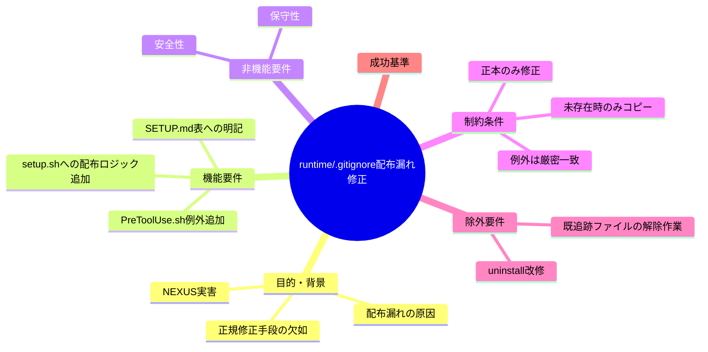
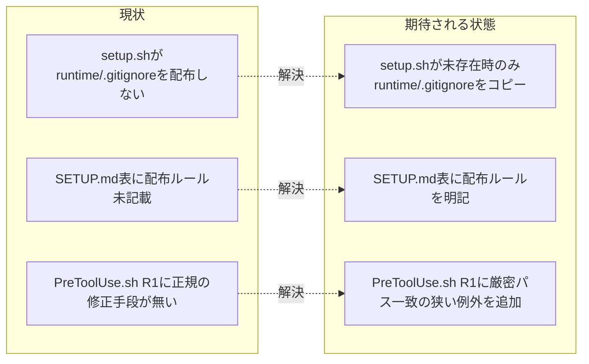

# 要求定義書: runtime/.gitignore 配布漏れバグの恒久修正

**プロジェクト名**: runtime/.gitignore 配布漏れバグの恒久修正
**作成日**: 2026 年 07 月 13 日
**最終更新**: 2026 年 07 月 13 日

> **重要**:
>
> - 本 issue は既存 issue #30 / PR #31（システム仕様書の作業用 issue フォルダ参照禁止、`docs/system-spec-transient-ref-ban`、マージ済み・クローズ済み）とはテーマ不一致のため対象外。新規・独立 issue として起票する。
> - 本 issue は **requirement-discovery（要求定義〜要件定義）** の範囲。設計（02）・実装計画（03）・実装（implement-feature）は後続 command で進める。
>
> **用語**: [.agent-skill-chain/source/CONCEPTS.md §用語規約](../../../../.agent-skill-chain/source/CONCEPTS.md#用語規約) を参照。

---

## 要求定義の全体像

**注意**:

- マインドマップは全体像を把握するためのものです。主要なセクション名程度に留め、詳細は記載しないでください。

---

## 1. 目的・背景

### 1.1 目的（必須）

`.agent-skill-chain/runtime/.gitignore` の配布漏れを恒久修正する。

### 1.2 背景

- **現状の課題**:
  - **課題 1（実害発生）**: 導入先プロジェクト（株式会社 NEXUS、本パッケージの消費者）で `.agent-skill-chain/runtime/workflow.db-wal`/`-shm` が git 追跡され、作業がブロックされる実害が発生した。原因は `.agent-skill-chain` パッケージ側（本リポジトリ）の配布漏れバグであり、Claude Code Auto Mode の誤動作ではない（evidence_source: ユーザー報告＋一次情報確認済み）。
  - **課題 2（配布ロジック欠落）**: `.agent-skill-chain/runtime/.gitignore`（`workflow.db*` 1 行）はパッケージ内（本リポジトリ）に実在し内容も正しいが、`.agent-skill-chain/source/scripts/setup.sh` の `runtime/templates/` コピー処理（113〜125 行目付近）にはこのファイルの配布ロジックが含まれていない（evidence_source: `existing_code`。`.agent-skill-chain/source/scripts/setup.sh` L113-125 を実読し、`WF_TEMPLATES`/`WF_SOURCE` の `runtime/templates` コピー処理のみが存在し `runtime/.gitignore` への言及が無いことを確認）。そのため消費者プロジェクトに配布されず、`workflow.db-wal`/`-shm` が誤追跡される。
  - **課題 3（ドキュメント未記載）**: `.agent-skill-chain/source/SETUP.md` の所有区分表（§所有区分、149〜158 行目付近）・初回コピー時の挙動補足表（202〜209 行目付近）のいずれにも `runtime/.gitignore` の配布ルールが記載されていない（evidence_source: `existing_code`。両表を grep し `runtime/.gitignore` の行が存在しないことを確認）。
  - **課題 4（正規の修正手段の欠如）**: `.claude/hooks/PreToolUse.sh` の R1（`.agent-skill-chain/runtime/` へのすべての Edit/Write を全 ROLE で禁止、正本は `.agent-skill-chain/source/enforcement/claude/PreToolUse.sh` の 167〜172 行目付近）により、配布漏れに後から気づいた消費者側 AI にも正規の修正手段が無く、Claude Code 側の安全機構（Bash heredoc 書き込み拒否・`settings.json` 権限拡張拒否の二重ブロック）にも阻まれ完全に手詰まりになった実例がある（evidence_source: ユーザー報告＋ `existing_code`。R1 のパスマッチ条件が `.agent-skill-chain/runtime/` 配下を無条件に禁止しており、`.gitignore` 単体を除外する例外が存在しないことを確認）。

- **必要性**:
  - **必要性 1**: 応急処置（手動コピー・個別プロジェクトでの手動修正）ではなく、パッケージ配布経路そのものを修正し、以後配布される全消費者プロジェクトで再発しないようにする。
  - **必要性 2**: 配布漏れに気づいた際に、消費者側 AI が正規の手段（enforcement のブロックに阻まれない狭い例外）で自己修復できる経路を用意する。

### 1.3 期待される効果（必須: 1 件以上）

- **効果 1**: 新規に `setup.sh` を実行した消費者プロジェクトで `.agent-skill-chain/runtime/.gitignore` が自動配布される（ファイルの存在確認で○/×判定可能）。
- **効果 2**: `SETUP.md` のコピー対象表（所有区分表・初回コピー時の挙動補足表）を参照すれば、`runtime/.gitignore` の配布ルール（未存在時のみコピー）が分かる（記載の有無で判定可能）。
- **効果 3**: `.agent-skill-chain/runtime/.gitignore` に限定した狭い例外により、消費者側 AI が正規の手段（Edit/Write）で当該ファイルのみを作成・修正できる（他の runtime/ ファイルへの直接 Edit/Write 禁止は維持されたまま、パス完全一致時のみ許可されることで判定可能）。

**現状と期待される状態の比較**:

---

## 2. 機能要件

### 2.1 既存機能の維持（該当する場合）

- `setup.sh` の `runtime/templates/` 配布ロジック（プロジェクトの有無にかかわらず常にパッケージ内容で最新化する挙動）は変更しない。
- `PreToolUse.sh` R1 の「`.agent-skill-chain/runtime/` 配下への直接 Edit/Write を全 ROLE で禁止」という原則、および `.gitignore` 以外のすべての runtime/ ファイルへの直接 Edit/Write 禁止は維持する。

### 2.2 新規機能要件

- **機能 A（配布ロジック追加）**: `setup.sh` に `runtime/.gitignore` の配布ロジックを追加する。**未存在時のみコピー**し、既に存在する場合は上書きしない（`runtime/templates/` とは異なり、消費者側のローカル変更を尊重するため）。
- **機能 B（ドキュメント明記）**: `SETUP.md` のコピー対象表（所有区分表・初回コピー時の挙動補足表）に `runtime/.gitignore` の配布ルール（未存在時のみコピーする所有区分）を明記する。
- **機能 C（狭い例外の追加）**: `.agent-skill-chain/source/enforcement/claude/PreToolUse.sh`（正本）の R1 に、対象パスが厳密に `.agent-skill-chain/runtime/.gitignore` と一致する場合のみ Edit/Write を許可する狭い例外を追加する。配備先の生成物 `.claude/hooks/PreToolUse.sh` は直接修正せず、`setup.sh` の `copy_owned_files` によって正本から再配備させる。

---

## 3. 非機能要件

### 3.1 パフォーマンス

- 該当なし（配布ファイル 1 件・判定条件 1 件の追加のみで実行時性能に影響しない）。

### 3.2 セキュリティ

- R1 の例外はパス完全一致に限定し、ワイルドカードや前方一致等で許可範囲を広げない。既存の runtime/ 保護（timestamp memo・書記専用 workflow.db 書き込み等）を弱めないこと。

### 3.3 互換性

- 既に `.agent-skill-chain/runtime/.gitignore` を持つ既存消費者プロジェクトに対して `setup.sh` を再実行しても、当該ファイルを上書き・変更しないこと（ローカル変更の尊重）。

### 3.4 保守性

- 配布ロジック・ドキュメント記載・enforcement 例外の 3 点を1つのADRとして一貫させ、今後同種の配布漏れ（新規ファイル追加時の配布ロジック追記漏れ）を防ぐための注意点を設計フェーズで明記する。

---

## 4. 制約条件

### 4.1 技術的制約

- `runtime/.gitignore` の配布は**未存在時のみコピー**（`runtime/templates` ブロックのような毎回上書きにはしない）。
- `PreToolUse.sh` の修正は**正本**（`.agent-skill-chain/source/enforcement/claude/PreToolUse.sh`）に対して行う。配備先の生成物（`.claude/hooks/PreToolUse.sh`。ルートの `.gitignore` で `/.claude/` を除外しており git 追跡対象外）を直接修正してはならない。

### 4.2 既存システムとの互換性

- `setup.sh` の他の配布ロジック（`source/` 全体コピー、`runtime/templates/` 更新、`copy_owned_files` によるスキル・フック配備）の既存挙動には影響を与えないこと。

### 4.3 移行期間・スケジュール

- 本修正後、既存消費者プロジェクトへは次回の `setup.sh` 再実行（アップグレード）時に `.agent-skill-chain/runtime/.gitignore` が自動配布される。即時の一括配布・移行手順は本 issue のスコープ外。

---

## 5. 除外要件

- 既存消費者プロジェクトで既に git 追跡されてしまった `workflow.db-wal`/`-shm` の追跡解除（`git rm --cached` 等）作業そのもの（消費者側の個別対応。パッケージ側の恒久修正とは別の作業）。
- `src/agents-md.ts`（ビルド後の実行物は `bin/agents-md.js`。同ファイルは `.gitignore` 対象の `tsc` ビルド生成物でありリポジトリに実在しないため、evidence_source の引用は正本である `src/agents-md.ts` に対して行う）の `runUninstall`/`finalizeAscRoot` の改修（詳細は §6 リスクと対策・01_要件定義.md §5 制約事項を参照。実コード確認の結果、本 issue が対象とする実害シナリオ（`workflow.db` 生成済み状態）では既存ロジックで `runtime/.gitignore` を含む `.agent-skill-chain/` 全体が保持されるため、本 issue のスコープには含めない）。

---

## 6. 成功基準（必須: 1 件以上）

- 新規プロジェクトに対して `setup.sh` を実行した際、`.agent-skill-chain/runtime/.gitignore` が配布されることを確認できる（○/×）。
- 既に `.agent-skill-chain/runtime/.gitignore` を持つプロジェクトに対して `setup.sh` を再実行しても、当該ファイルの内容が変更されないことを確認できる（○/×）。
- `SETUP.md` の所有区分表・初回コピー時の挙動補足表に `runtime/.gitignore` の配布ルールの行が追加されている（○/×）。
- `.agent-skill-chain/source/enforcement/claude/PreToolUse.sh` に、パスが厳密に `.agent-skill-chain/runtime/.gitignore` と一致する場合のみの Edit/Write 許可例外が追加されている（○/×）。
- 上記例外追加後も、`.gitignore` 以外の `runtime/` 配下ファイルへの直接 Edit/Write が全 ROLE で block されることが維持されている（○/×）。

---

## 7. リスクと対策

### 7.1 技術的リスク

- **リスク**: `PreToolUse.sh` R1 の例外条件を緩く書くと、`runtime/` 配下への直接 Edit/Write 禁止全体の抜け道になりうる。
  - **対策**: パス完全一致（`.agent-skill-chain/runtime/.gitignore` と厳密一致）のみを許可条件とし、正規表現の前方一致・部分一致を用いない。設計フェーズで具体的な判定式を確定する。
- **リスク**: `src/agents-md.ts` の `finalizeAscRoot`（uninstall 既定時の後片付け。ビルド後の実行物は `bin/agents-md.js` だが同ファイルは `.gitignore` 対象の `tsc` ビルド生成物でありリポジトリに実在しないため、正本 `src/agents-md.ts` を引用する）は、`runtime/` 配下に `.gitignore` 以外のユーザー資産（issue 履歴・`workflow.db*`）が無い場合、`.agent-skill-chain/` ルートごと削除し `runtime/.gitignore` も消える（`readdirSync` の `userAsset` 判定で `.gitignore` を除外しているため、存在だけでは保持理由にならない）。実コード確認（`src/agents-md.ts` L817-846 の `finalizeAscRoot`、L850-971 の `runUninstall`）の結果、本 issue が対象とする実害シナリオ（NEXUS の事例のように `workflow.db*` が既に生成されている状態）では `runtimeAssets.length > 0` となり `.agent-skill-chain/` ルート全体（`runtime/.gitignore` を含む）が保持されるため、既定挙動と矛盾しないと判断した。`workflow.db` 未生成のまま即座に uninstall する極めて限定的なエッジケースでのみ `.gitignore` も削除されるが、この場合 git 追跡対象になり得る `workflow.db-wal`/`-shm` 自体も未生成であり実害は生じない（次回 `setup.sh` 実行時に本修正により再配布される）。
  - **対策**: 上記の判断根拠を 01_要件定義.md に明記し、uninstall 改修は本 issue のスコープに含めない（§5 除外要件・evidence_source: `existing_code`）。

### 7.2 スケジュールリスク

- 該当なし（3 点（`setup.sh`・`SETUP.md`・`PreToolUse.sh` 正本）の小規模修正であり、単発 issue として完結する）。

---

## 8. 参考資料

### プロジェクトドキュメント

- [`01_要件定義.md`](./01_要件定義.md) - 要件定義

### その他の参考資料

- `.agent-skill-chain/source/scripts/setup.sh`（L113-125 付近: `runtime/templates` 配布ロジック。`runtime/.gitignore` への言及なし）
- `.agent-skill-chain/source/SETUP.md`（§所有区分 L149-158 付近・§初回コピー時の挙動補足 L202-209 付近: `runtime/.gitignore` 未記載）
- `.agent-skill-chain/source/enforcement/claude/PreToolUse.sh`（R1: L167-172 付近。`.agent-skill-chain/runtime/` 配下への Edit/Write を全 ROLE 一律禁止）
- `.agent-skill-chain/runtime/.gitignore`（`workflow.db*` 1 行。内容は正しいが配布されていない）
- `src/agents-md.ts`（`PURGE_ARTIFACTS` L806-809、`finalizeAscRoot` L817-846、`runUninstall` L850-971。ビルド後の実行物 `bin/agents-md.js` は `.gitignore` 対象の `tsc` ビルド生成物でありリポジトリに実在しないため、正本である本ファイルを引用する）
- 本リポジトリ既存 issue #30 / PR #31（`docs/system-spec-transient-ref-ban`、マージ済み・クローズ済み）はテーマ不一致のため対象外（本 issue は新規・独立）

---

## 9. 次のステップ

この要求定義書の承認後、以下のドキュメントを作成します：

- **次**: [`01_要件定義.md`](./01_要件定義.md) - 要件定義フェーズ
