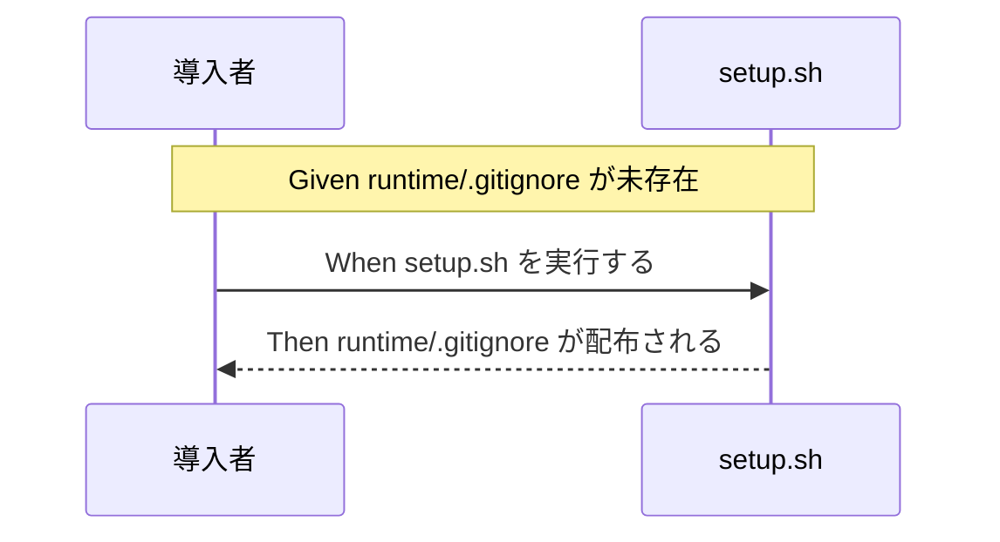

# 要件定義書: runtime/.gitignore 配布漏れバグの恒久修正

**プロジェクト名**: runtime/.gitignore 配布漏れバグの恒久修正
**作成日**: 2026 年 07 月 13 日
**最終更新**: 2026 年 07 月 13 日

> **重要**: **このドキュメントは常に更新**: 要件の変更や追加があった場合は、即座にこのドキュメントを更新してください。ドキュメントは「生きているドキュメント」として扱い、実装内容と常に同期させます。
>
> **用語**: [.agent-skill-chain/source/CONCEPTS.md §用語規約](../../../../.agent-skill-chain/source/CONCEPTS.md#用語規約) を参照。

---

## 1. 概要

### 1.1 システム概要

`.agent-skill-chain` パッケージは `setup.sh` によって消費者プロジェクトへ `source/`・`runtime/templates/`・スキル・フック等を配布する。`.agent-skill-chain/runtime/.gitignore`（`workflow.db*` 1 行）はパッケージ内に実在し内容も正しいが、`setup.sh` の配布ロジックにこのファイルへの言及が無いため消費者プロジェクトへ配布されず、`workflow.db-wal`/`-shm` が誤って git 追跡される（詳細な evidence_source は [00_要求定義.md §1.2](./00_要求定義.md) を正とする）。本 issue は、(1) `setup.sh` への配布ロジック追加、(2) `SETUP.md` のコピー対象表への明記、(3) `PreToolUse.sh`（正本）R1 への厳密パス一致の狭い例外追加、の 3 点を扱う。

### 1.2 用語集

| 用語 | 説明 |
| -------- | ------ |
| 配布漏れ | パッケージ側の配布ロジック（`setup.sh`）に対象ファイルのコピー処理が含まれておらず、消費者プロジェクトへ届かない状態 |
| 正本（PreToolUse.sh） | `.agent-skill-chain/source/enforcement/claude/PreToolUse.sh`。配備先 `.claude/hooks/PreToolUse.sh` はここから `setup.sh` の `copy_owned_files` が配備する生成物 |
| R1 | `PreToolUse.sh` の判定ルールの 1 つ。`.agent-skill-chain/runtime/` 配下への直接 Edit/Write を全 ROLE で禁止する |
| 未存在時のみコピー | 消費者プロジェクトに対象ファイルが存在しない場合のみコピーし、既存の場合は上書きしない配布方式（`runtime/templates/` の毎回上書きとは異なる） |
| finalizeAscRoot | `src/agents-md.ts` の関数（ビルド後の実行物 `bin/agents-md.js` は `.gitignore` 対象の `tsc` ビルド生成物でありリポジトリに実在しないため、正本 `src/agents-md.ts` を指す）。uninstall 時に `.agent-skill-chain/` ルートの後片付け（保持/完全削除の判定）を行う |

---

## 2. 機能要件

### 2.1 ユーザーストーリー

#### ストーリー 1: setup.sh による runtime/.gitignore の自動配布

- **As a** 消費者プロジェクトの導入者（AI エージェント・人間の保守者）
- **I want to** `setup.sh` 実行時に `.agent-skill-chain/runtime/.gitignore` が未存在時のみ自動配布される
- **So that** `workflow.db-wal`/`-shm` 等の証跡 DB 生成物が誤って git 追跡されることを未然に防げる

**受け入れ基準**:

- `.agent-skill-chain/runtime/.gitignore` が存在しない消費者プロジェクトに対して `setup.sh` を実行すると、当該ファイルが配布され、内容が `workflow.db*` を含むこと。
- 既に `.agent-skill-chain/runtime/.gitignore` が存在する消費者プロジェクトに対して `setup.sh` を再実行しても、当該ファイルの内容は変更されない（ローカル変更の尊重）。
- `runtime/templates/` の既存配布ロジック（プロジェクトの有無にかかわらず毎回パッケージ内容で最新化）には影響を与えない。

#### ストーリー 2: SETUP.md による配布ルールの明記

- **As a** 本パッケージの保守者・利用者
- **I want to** `SETUP.md` の所有区分表・初回コピー時の挙動補足表に `runtime/.gitignore` の配布ルールが明記されている
- **So that** 消費者・保守者が「どのファイルが・いつ・どう配布されるか」を表を見るだけで正しく理解できる

**受け入れ基準**:

- `SETUP.md` の所有区分表（§所有区分）に `.agent-skill-chain/runtime/.gitignore` の行が追加され、「未存在時のみコピー（毎回上書きしない）」という挙動が明記される。
- `SETUP.md` の初回コピー時の挙動補足表にも同様の行が追加される。
- 既存の表記スタイル・粒度（`runtime/templates/` の行等）と一貫性が保たれ、重複記載にならない。

#### ストーリー 3: PreToolUse.sh R1 における正規の自己修復手段の確保

- **As a** 消費者プロジェクトで配布漏れ（`runtime/.gitignore` 未配置）に気づいた AI エージェント
- **I want to** `.agent-skill-chain/runtime/.gitignore` に限り、enforcement のブロックに阻まれず正規の Edit/Write 手段で作成・修正できる
- **So that** 今回の実例（正規の修正手段が無く、Bash heredoc 拒否・`settings.json` 権限拡張拒否の二重ブロックで手詰まりになった）を再発させない

**受け入れ基準**:

- 対象パスが厳密に `.agent-skill-chain/runtime/.gitignore` と一致する場合のみ、R1 の Edit/Write 禁止の例外として allow される。
- 上記以外の `runtime/` 配下ファイル（`workflow.db*`・issue フォルダ内ドキュメント等）への直接 Edit/Write 禁止は維持される（例外を広げない）。
- 例外は正本 `.agent-skill-chain/source/enforcement/claude/PreToolUse.sh` にのみ実装し、配備先の生成物 `.claude/hooks/PreToolUse.sh` は `setup.sh` の `copy_owned_files` によって正本から再配備される（直接修正しない）。

### 2.2 BDD ユースケース

#### ユースケース 1: setup.sh による runtime/.gitignore の配布

**シナリオ 1: 未存在時に配布される**

```gherkin
Feature: setup.sh は runtime/.gitignore を未存在時のみ配布する
  Scenario: 消費者プロジェクトに runtime/.gitignore が存在しない
    Given 消費者プロジェクトの .agent-skill-chain/runtime/ 配下に .gitignore が存在しない
    When setup.sh を実行する
    Then .agent-skill-chain/runtime/.gitignore がパッケージから配布され、内容に workflow.db* を含む
```

**処理フロー**（必要に応じて）:



**シナリオ 2: 既存時は上書きされない**

```gherkin
Feature: setup.sh は既存の runtime/.gitignore を上書きしない
  Scenario: 消費者プロジェクトに runtime/.gitignore が既に存在し、ローカルで内容が変更されている
    Given .agent-skill-chain/runtime/.gitignore が既に存在し、パッケージ既定と異なる内容にローカル変更されている
    When setup.sh を再実行する
    Then 当該ファイルの内容は変更されない
```

#### ユースケース 2: PreToolUse.sh R1 の厳密パス一致例外

**シナリオ 1: runtime/.gitignore への直接 Edit が許可される**

```gherkin
Feature: R1 は runtime/.gitignore のみ厳密パス一致で例外的に許可する
  Scenario: エージェントが runtime/.gitignore を直接 Edit しようとする
    Given tool_name が "Edit" で file_path が ".agent-skill-chain/runtime/.gitignore"
    When PreToolUse.sh が R1 を評価する
    Then allow される（従来は全 ROLE で block されていた）
```

**シナリオ 2: 他の runtime/ 配下ファイルへの直接 Edit/Write は引き続き block される**

```gherkin
Feature: R1 の既存禁止は runtime/.gitignore 以外で維持される
  Scenario: エージェントが runtime/workflow.db を直接 Write しようとする
    Given tool_name が "Write" で file_path が ".agent-skill-chain/runtime/workflow.db"
    When PreToolUse.sh が R1 を評価する
    Then block（exit 2）される（現状維持）
```

**シナリオ 3: パスが厳密一致でない場合は例外の対象外（過剰マッチ防止）**

```gherkin
Feature: R1 の例外はパス完全一致のみに限定する
  Scenario: エージェントが runtime/ 配下の別ディレクトリの .gitignore を Write しようとする
    Given tool_name が "Write" で file_path が ".agent-skill-chain/runtime/<issue>/.gitignore"（厳密パスと不一致）
    When PreToolUse.sh が R1 を評価する
    Then block（exit 2）される（例外はパス完全一致のみに限定し、抜け道を作らない）
```

#### ユースケース 3: SETUP.md のコピー対象表の整合性

**シナリオ 1: 所有区分表に runtime/.gitignore の配布ルールが記載されている**

```gherkin
Feature: SETUP.md の所有区分表に runtime/.gitignore の配布ルールが明記される
  Scenario: 保守者が SETUP.md の所有区分表を確認する
    Given SETUP.md の所有区分表（§所有区分）
    When runtime/.gitignore の配布ルールを探す
    Then 「未存在時のみコピー（毎回上書きしない）」という記載が見つかる
```

### 2.3 ビジネスルール

- `runtime/.gitignore` は「未存在時のみコピー」とし、`runtime/templates/` の「毎回上書き」方式とは区別する。
- `PreToolUse.sh` R1 の例外はパス完全一致にのみ適用し、前方一致・部分一致・正規表現の緩いマッチを用いない。
- 正本の修正は `.agent-skill-chain/source/enforcement/claude/PreToolUse.sh` のみに対して行い、配備先生成物（`.claude/hooks/PreToolUse.sh`）は直接編集しない。

---

## 3. 非機能要件

### 3.1 パフォーマンス要件

- 該当なし（配布ファイル 1 件・判定条件 1 件の追加のみで、`setup.sh`・`PreToolUse.sh` の実行時間に有意な影響を与えない）。

### 3.2 セキュリティ要件

- R1 の例外はパス完全一致に限定し、`runtime/` 配下への直接 Edit/Write 禁止という既存の安全機構（timestamp memo 保護・書記専用 `workflow.db` 書き込み保護）を弱めないこと。

### 3.3 ユーザビリティ要件

- 消費者・保守者が `SETUP.md` の表を一読するだけで `runtime/.gitignore` の配布方針（未存在時のみコピー）を理解できること。

### 3.4 可用性要件

- 既存の `setup.sh` の他の配布処理（`source/` コピー、`runtime/templates/` 更新、`copy_owned_files` によるスキル・フック配備）が本修正によって失敗・停止しないこと。

---

## 4. 外部インターフェース要件

### 4.1 API 要件

- 該当なし（`setup.sh`・`PreToolUse.sh` はいずれもローカルスクリプトであり外部 API を持たない）。

### 4.2 データ形式要件

- `.agent-skill-chain/runtime/.gitignore` の内容形式は既存のまま（`workflow.db*` を含む 1 行以上のプレーンテキスト）とし、本 issue では内容自体を変更しない。

---

## 5. 制約事項

- `runtime/.gitignore` の配布は未存在時のみ（`runtime/templates` のような毎回上書きにしない）。
- `PreToolUse.sh` の修正対象は正本（`.agent-skill-chain/source/enforcement/claude/PreToolUse.sh`）のみ。配備先の生成物（`.claude/hooks/PreToolUse.sh`。ルート `.gitignore` で `/.claude/` を除外しており git 追跡対象外）を直接修正してはならない。
- R1 の例外はパス完全一致のみとし、具体的な判定式・実装箇所は design-feature（02_設計.md）で確定する。

### 検討済み・対象外とした論点（uninstall との整合）

`src/agents-md.ts` の `runUninstall`/`finalizeAscRoot`（L850-971, L817-846。ビルド後の実行物 `bin/agents-md.js` は `.gitignore` 対象の `tsc` ビルド生成物でありリポジトリに実在しないため、正本である本ファイルを引用する）を実読して検証した（evidence_source: `existing_code`）。

- 既定（非 `--purge`）の uninstall では、`finalizeAscRoot` が `runtime/` 配下を `readdirSync` で走査し `.gitignore` を除外して `userAsset` 判定する（`src/agents-md.ts` L829 のコメント「`.gitignore` はパッケージ生成物のためユーザー資産に数えない」）。`runtime/` 配下に `.gitignore` 以外のユーザー資産（issue 履歴・`workflow.db*`）が**無い**場合のみ `.agent-skill-chain/` ルートごと削除され、その際 `runtime/.gitignore` も一緒に消える。
- しかし、本 issue が対象とする実害シナリオ（NEXUS の事例のように `workflow.db-wal`/`-shm` 等が既に生成され git 追跡されてしまう状況）では、必然的に `workflow.db*` が `runtime/` 配下に存在するため `runtimeAssets.length > 0` となり、`.agent-skill-chain/` ルート全体（`runtime/.gitignore` を含む）が保持される。つまり、実際に問題が起きうる状態では既定の uninstall 挙動は既に `runtime/.gitignore` を保護している。
- `.gitignore` が uninstall で失われるのは「`setup.sh` 実行直後、一度も workflow を実行せず（`workflow.db` 未生成）、`project/` も未設定のまま既定 uninstall する」という極めて限定的なエッジケースのみであり、この場合 `workflow.db-wal`/`-shm` 自体も存在しないため git 誤追跡のリスクは生じない。また本修正後の `setup.sh` を再実行すれば未存在時コピーにより自動的に復元される。
- `--purge` 指定時は `PURGE_ARTIFACTS` に `.agent-skill-chain/runtime` 自体が含まれ、ユーザーが明示的に完全削除を選択した結果として `.gitignore` を含め削除される。これは意図された挙動であり本 issue の対象外。
- **判断**: 上記により、`runUninstall`/`finalizeAscRoot` の改修は本 issue の受け入れ基準に**含めない**（実害シナリオでは既に整合しており、追加改修の投資対効果が低いため）。将来的にこのエッジケースを厳密に解消したい場合は、別 issue として起票する。

---

## 6. 参考資料

### プロジェクトドキュメント

- [`00_要求定義.md`](./00_要求定義.md) - 要求定義（evidence_source・行番号引用の正）

### その他の参考資料

- `.agent-skill-chain/source/scripts/setup.sh`（L113-125 付近: `runtime/templates` 配布ロジック）
- `.agent-skill-chain/source/SETUP.md`（§所有区分 L149-158 付近・§初回コピー時の挙動補足 L202-209 付近）
- `.agent-skill-chain/source/enforcement/claude/PreToolUse.sh`（R1: L167-172 付近）
- `.agent-skill-chain/runtime/.gitignore`（`workflow.db*`）
- `src/agents-md.ts`（`PURGE_ARTIFACTS` L806-809、`finalizeAscRoot` L817-846、`runUninstall` L850-971。ビルド後の実行物 `bin/agents-md.js` は `.gitignore` 対象の `tsc` ビルド生成物でありリポジトリに実在しないため、正本である本ファイルを引用する）

---

## 7. 前のステップ

この要件定義書は、以下のドキュメントを基に作成されています：

- **前**: [`00_要求定義.md`](./00_要求定義.md) - 要求定義フェーズ

---

## 8. 次のステップ

この要件定義書の承認後、以下のドキュメントを作成します：

- **次**: [`02_設計.md`](./02_設計.md) - 設計フェーズ
