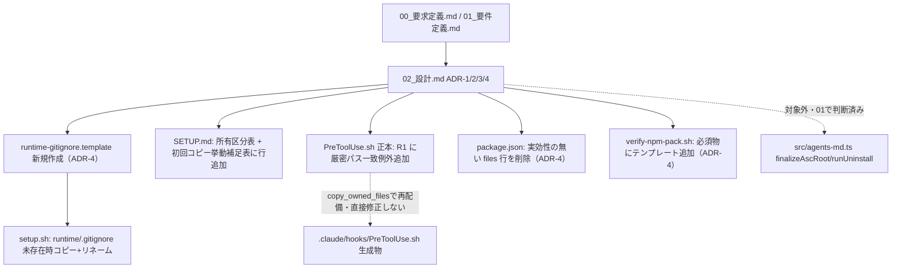

# 設計書: runtime/.gitignore 配布漏れバグの恒久修正

**プロジェクト名**: runtime/.gitignore 配布漏れバグの恒久修正
**作成日**: 2026 年 07 月 13 日
**最終更新**: 2026 年 07 月 13 日

> **重要**: **このドキュメントは常に更新**: 設計の変更や追加があった場合は、即座にこのドキュメントを更新してください。ドキュメントは「生きているドキュメント」として扱い、実装内容と常に同期させます。
>
> **用語**: [.agent-skill-chain/source/CONCEPTS.md §用語規約](../../../../.agent-skill-chain/source/CONCEPTS.md#用語規約) を参照。
>
> **範囲**: 本ドキュメントは 02_設計のみを扱う。03_実装計画.md は後続の別 command 実行で作成する（[00_要求定義.md](./00_要求定義.md) 冒頭の注記どおり）。

---

## 1. 設計概要

**必須**: 設計方針・原則は [.agent-skill-chain/source/spec/01_設計原則.md](../../../../.agent-skill-chain/source/spec/01_設計原則.md) を先に参照した。

### 1.1 設計方針

本 issue はパッケージ配布ロジック（`setup.sh`）・ドキュメント（`SETUP.md`）・enforcement 正本（`PreToolUse.sh`）の 3 ファイルへの**局所的な追記**であり、新規コンポーネントの導入や既存アーキテクチャの変更は伴わない。既存の「未存在時のみコピー」パターン（`init_workflow_db` 等）と「毎回上書き」パターン（`runtime/templates`）が併存する `setup.sh` の設計に、`runtime/.gitignore` 用の**未存在時のみコピー**ブロックを 1 つ追加する。`PreToolUse.sh` R1 には、既存の「全 ROLE 一律禁止」の構造を壊さない**狭い例外**を 1 条件だけ追加する。

### 1.2 設計原則（本プロジェクトで適用するもの）

- **単一責務**: 適用する。`setup.sh`＝配布ロジック、`SETUP.md`＝配布契約の文書化、`PreToolUse.sh`＝実行時強制、という既存の責務分担を維持したまま、各ファイルに 1 責務分のみ追記する（§2.5 ADR-2）。
- **明確な境界**: 適用する。「パッケージ所有・毎回上書き」（`runtime/templates`）と「初回のみパッケージ所有・以後ユーザー資産」（`runtime/.gitignore`）という 2 つの配布方式の境界を明確に区別し、混同しない（§2.5 ADR-1）。
- **明確な境界（enforcement）**: 適用する。R1 の例外はパスの厳密一致 1 条件のみとし、「`.gitignore` 以外の `runtime/` 配下ファイルは引き続き全 ROLE 禁止」という既存境界を一切広げない（§2.5 ADR-3）。
- 他の原則（CQRS・イベント駆動・AI フレンドリー設計の詳細観点・UNIX 哲学の分割志向）は、本 issue が既存 3 ファイルへの小規模追記でありコンポーネント分割・イベント発行・状態変更/取得の分離を伴わないため**該当なし**。

---

## 2. アーキテクチャ設計

### 2.1 責務・境界・参照関係

[01_設計原則 §明確な境界・§単一責務](../../../../.agent-skill-chain/source/spec/01_設計原則.md) に従う。

#### 2.1.1 責務一覧

| コンポーネント | 責務（1 文） |
| --- | --- |
| `.agent-skill-chain/source/scripts/setup.sh` | パッケージから消費者プロジェクトへの配布ロジックの正本。今回は `runtime/.gitignore` の「未存在時のみコピー」ブロックを追加する対象。 |
| `.agent-skill-chain/source/SETUP.md` | 配布契約（何が・いつ・どう配布されるか）の文書化の正本。今回は所有区分表・初回コピー時の挙動補足表に `runtime/.gitignore` の行を追加する対象。 |
| `.agent-skill-chain/source/enforcement/claude/PreToolUse.sh` | 実行時強制（Layer 2 hook）の正本。R1 に `runtime/.gitignore` 限定の厳密パス一致例外を追加する対象。 |
| `.agent-skill-chain/source/runtime-gitignore.template`（ADR-4・新規ファイル） | `runtime/.gitignore` 配布の**コピー元**実体（内容は `workflow.db*` 1 行で従来の `.agent-skill-chain/runtime/.gitignore` と同一）。npm-packlist の `.gitignore` 強制除外制約（ADR-4）により、`.agent-skill-chain/source/` 配下に非 `.gitignore` 名で保持し、`setup.sh` がコピー時に `.gitignore` へリネームする。 |
| `.agent-skill-chain/runtime/.gitignore` | 本リポジトリ自身の自己適用先（消費者プロジェクトと同じ配布結果）。内容は変更しない。ADR-4 以降はパッケージの配布物としては直接参照されず、上記テンプレートがコピー元になる。 |
| `package.json`（`files` 配列。ADR-4・新規変更対象） | npm 配布物の allowlist 正本。`.agent-skill-chain/runtime/.gitignore` を直接列挙する行は実効性が無い（ADR-4）ため削除し、テンプレートは既存の `.agent-skill-chain/source/` ディレクトリ丸ごとエントリで配布されるため新規エントリは不要。 |
| `.agent-skill-chain/source/scripts/verify-npm-pack.sh`（ADR-4・関連変更） | npm 配布物の必須物・禁止物検査。新規テンプレートファイルを必須物リストに追加し回帰を検知する。 |
| `.claude/hooks/PreToolUse.sh`（生成物） | `setup.sh` の `copy_owned_files` が正本から再配備する生成物。**本 issue では直接修正しない**（01 §5 制約事項）。 |
| `src/agents-md.ts`（`finalizeAscRoot`/`runUninstall`。ビルド後の実行物 `bin/agents-md.js` は `.gitignore` 対象の `tsc` ビルド生成物でありリポジトリに実在しないため、正本である本ファイルを指す） | uninstall 時の後片付け。**本 issue の変更対象外**（01 §5 §検討済み・対象外とした論点を参照。矛盾なく踏襲する）。 |

#### 2.1.2 境界

- **入力**: `.agent-skill-chain/source/runtime-gitignore.template`（パッケージ内の実体・内容不変・ADR-4）、既存の `setup.sh`・`SETUP.md`・`PreToolUse.sh`（正本）、`package.json`（`files` 配列）。
- **出力**: (1) `setup.sh` に配布ブロック追加（コピー元は上記テンプレート、コピー先は `.gitignore` にリネーム）、(2) `SETUP.md` の 2 表に行追加、(3) `PreToolUse.sh` R1 に例外条件追加、(4) `package.json` の実効性が無い行の削除、(5) `verify-npm-pack.sh` に必須物追加。
- **他責務との境界**:
  - `runtime/templates/` の「毎回上書き」配布ロジックには一切手を加えない（01 §2.1 既存機能の維持）。
  - `PreToolUse.sh` の R1 以外のルール（R2〜R6・ROLE 分岐・nonce 検証等）には手を加えない。
  - `.claude/hooks/PreToolUse.sh`（生成物）・`src/agents-md.ts` の uninstall 系関数は本 issue の変更範囲外（01 §5 で検証済み・既存挙動と矛盾しないと判断済み。判断の再掲はしない）。

#### 2.1.3 参照関係

```
runtime-gitignore.template --(コピー+.gitignoreへリネーム・ADR-4)--> <消費者プロジェクト>/.agent-skill-chain/runtime/.gitignore
setup.sh  --(未存在時コピー)-->  <消費者プロジェクト>/.agent-skill-chain/runtime/.gitignore
SETUP.md  --(文書化のみ・実行時参照なし)-->  setup.sh の配布ルールを人間/AIに説明
PreToolUse.sh（正本） --(setup.shのcopy_owned_filesが配備)--> .claude/hooks/PreToolUse.sh（生成物）
```

- 3 ファイルは互いに直接呼び出し合わない（`setup.sh` はスクリプト、`SETUP.md` は文書、`PreToolUse.sh` は hook）。依存の向きは「`setup.sh`/`PreToolUse.sh` の実際の挙動」→「`SETUP.md` がそれを説明する」の一方向であり、循環参照は発生しない。

### 2.2 システムアーキテクチャ

- 本 issue は新規アーキテクチャパターンの採用を伴わない（既存のシェルスクリプト配布 + hook 強制の構成を維持）ため、パターン選定は**該当なし**。

#### 2.2.1 CQRS（Command/Query 分離）

- 該当なし（配布スクリプト・hook はいずれも状態変更/取得の分離を要する読み書き分離設計を持たない）。

#### 2.2.2 変更対象ファイルの関係図



### 2.3 コンポーネント構成

- `runtime-gitignore.template`: `.agent-skill-chain/source/` 直下に新規作成する、内容不変（`workflow.db*`）のコピー元テンプレート（ADR-4）。
- `setup.sh`: 既存の `runtime/templates` ブロック（L113-125）と同じ「パッケージソースパスと配備先パスを比較してからコピーする」構造パターンを流用しつつ、条件式だけを「未存在時」に変え、かつコピー元を上記テンプレート・コピー先ファイル名を `.gitignore` にする新規ブロックを追加する（§3.1）。
- `SETUP.md`: 既存の「所有区分」表（消費者ランタイム生成物の行）と「初回コピー時の挙動補足」表に、それぞれ 1 行追加する（新規セクションは作らない）（§3.2）。
- `PreToolUse.sh`: R1 の `if` ブロック内に、既存の block 条件より**前**に厳密パス一致の allow 分岐を追加する（§3.3）。
- `package.json`・`verify-npm-pack.sh`: ADR-4 の帰結として、実効性の無い `files` エントリを削除し、新規テンプレートを必須物検査に加える（§3.4）。

### 2.4 データフロー

- 該当なし（本 issue はユースケース実行後のイベント発行を伴わない。`setup.sh` はコマンド実行時の一度きりのファイルコピー、`PreToolUse.sh` は hook 呼び出し時の同期判定であり、いずれも既存のシーケンスパターンのままで新規イベント種別を導入しない）。

### 2.5 横断設計判断（ADR）

本プロジェクトの重要判断は [EVIDENCE_POLICY.md](../../../../.agent-skill-chain/source/EVIDENCE_POLICY.md) の ADR 形式で記録する。

#### ADR-1: `runtime/.gitignore` の配布方式（未存在時のみコピー vs 毎回上書き）

- **コンテキスト**: `runtime/templates/` は毎回パッケージ内容で最新化される（L116-125: パスが異なれば `rm -rf` → `cp -R`）。`runtime/.gitignore` も同じパターンを使うべきか、別方式にすべきかを決める必要がある。
- **検討した選択肢**:
  1. `runtime/templates/` と同じ「毎回上書き」方式にする。
  2. 「未存在時のみコピー」方式にする（既存があれば touch しない）。
- **決定**: **選択肢 2（未存在時のみコピー）を採用する。**
- **根拠（evidence_source: existing_code + 01_要件定義.md）**: `.gitignore` は消費者プロジェクトがローカルで追記・変更しうる汎用的な設定ファイルであり、`runtime/templates/`（パッケージが完全所有し内容の同一性を保証すべきテンプレート集）とは性質が異なる。01_要件定義.md §2.3 ビジネスルールおよび §3.3 互換性要件が「既存 `.agent-skill-chain/runtime/.gitignore` を持つプロジェクトへの再実行で内容を変更しないこと」を明記しており、毎回上書き方式はこの受け入れ基準と直接矛盾する。`setup.sh` 内には既に `init_workflow_db`（L199-209: `[[ -f "$db" ]]` なら早期 return）という「未存在時のみ」パターンの前例があり、同じ関数内パターンを流用することでコードの一貫性も保てる。
- **帰結**: `setup.sh` に追加するブロックは `[[ -f ... ]]` を否定条件に使う「未存在時のみ実行」の分岐になる（§3.1）。`runtime/templates/` 側の既存ロジックには一切変更を加えない。

#### ADR-2: `setup.sh` における追加ブロックの配置位置

- **コンテキスト**: `runtime/.gitignore` 配布ブロックをどこに置くかにより、可読性・保守性（同種ロジックの近接性）が変わる。
- **検討した選択肢**:
  1. `runtime/templates` ブロック（L113-125）の直後に追加する。
  2. `init_workflow_db`（L199 付近）の直前・直後に追加する。
  3. ファイル末尾に独立ブロックとして追加する。
- **決定**: **選択肢 1（`runtime/templates` ブロック直後、L125 の `fi` の直後・L127 のスキル同期コメントの前）を採用する。**
- **根拠（evidence_source: existing_code）**: `runtime/templates` ブロックと `runtime/.gitignore` ブロックはいずれも「`.agent-skill-chain/runtime/` 配下への配布」という同一責務範囲に属し、変数命名も `WF_TEMPLATES`/`WF_SOURCE` の慣例（`WF_GITIGNORE`/`WF_GITIGNORE_SOURCE`）を踏襲できる。両ブロックを隣接させることで、「`runtime/` 配下に配布するものはここにまとまっている」という可読性（設計判断の優先順位 §1 可読性）が得られる。選択肢 2（`init_workflow_db` 近傍）は責務混在（DB 初期化と `.gitignore` 配布は無関係）を招くため不採用、選択肢 3（末尾）は既存の「`.agent-skill-chain/runtime/` 配布ロジック群」という凝集を壊すため不採用。
- **帰結**: 実装は L125 `fi` の直後・L127 のコメント行の前に新規ブロックを挿入する（§3.1 に具体コード）。既存行番号がずれる（後続処理はすべて数行下にシフトする）ことを実装計画（03）で明記する。

#### ADR-3: `PreToolUse.sh` R1 例外の判定方式（厳密パス一致 vs 前方一致・正規表現）

- **コンテキスト**: R1（L167-172）は現在 `[[ "$PATH_TARGET" =~ \.agent-skill-chain/runtime/ ]] || [[ "$PATH_TARGET" =~ /\.agent-skill-chain/runtime/ ]]` という正規表現マッチで「`runtime/` を含むパスすべて」を block する。ここに `runtime/.gitignore` だけを通す例外をどう実装するかを決める必要がある。
- **検討した選択肢**:
  1. `[[ "$PATH_TARGET" == *.gitignore ]]` のような拡張子ベースの緩い前方/部分一致にする。
  2. `[[ "$PATH_TARGET" == ".agent-skill-chain/runtime/.gitignore" ]] || [[ "$PATH_TARGET" == */.agent-skill-chain/runtime/.gitignore ]]` という、相対パス完全一致 + 絶対パス時のディレクトリ完全一致（末尾セグメント厳密一致）にする。
  3. 例外を作らず、`.claude/hooks` 側で別途 allowlist する。
- **決定**: **選択肢 2 を採用する。**
- **根拠（evidence_source: existing_code + 01_要件定義.md §2.1/§3.2）**: 01_要件定義.md はユースケース 2 のシナリオ 3（「`.agent-skill-chain/runtime/<issue>/.gitignore` のような不一致パスは対象外」）を明示しており、選択肢 1（`*.gitignore` の部分一致）はこのシナリオに反し `runtime/` 配下の**あらゆる** `.gitignore` を許可してしまう過剰マッチになる。選択肢 2 は、相対パス表記（`.agent-skill-chain/runtime/.gitignore` と完全一致）と絶対パス表記（既存 R1 の 2 つ目の regex 分岐 `/\.agent-skill-chain/runtime/` と同様に、先頭に任意のプレフィックスが付く絶対パスも許容する必要がある）の双方に対応しつつ、末尾セグメントが厳密に `.gitignore` というファイル名であることを要求するため、サブディレクトリの `.gitignore`（`runtime/<issue>/.gitignore` 等）にはマッチしない。選択肢 3（`.claude/hooks` 側での allowlist）は 01 §4.1 の制約（正本のみ修正・生成物は直接修正しない）に反するため不採用。
- **帰結**: R1 の `if` ブロック内、既存の block 条件（L169-170）より**前**に allow 分岐を追加する（§3.3 に具体コード）。他の runtime/ 配下ファイルへの block 条件（L169-170 相当）はそのまま維持する。

#### ADR-4: npm 配布制約への対応（`.gitignore` という名前のファイルは `files` allowlist を経ても配布不可）

- **コンテキスト**: ADR-1〜3 実装後、`package.json` の `files` 配列に `.agent-skill-chain/runtime/.gitignore` を追加しても、実際の npm 配布（`npm pack`）では当該ファイルが tarball に含まれないことが判明した（実装完了後の verify-and-close フェーズで発覚）。これは 00/01 の想定（コピー元＝`$PACKAGE_ROOT/.agent-skill-chain/runtime/.gitignore` がそのまま配布される）が npm の実仕様と矛盾することを意味し、ADR-1/ADR-2 の前提（コピー元パス）を修正する必要がある。
- **根拠となる実機検証（evidence_source: existing_code + 実行確認）**:
  - npm の依存パッケージ `npm-packlist`（`npm-packlist/lib/index.js` の `defaults` 配列）は、`.gitignore` という名前のファイルを **`package.json` の `files` 配列指定に関わらず常に除外するデフォルトルール**をハードコードしている。
  - `files` 配列に個別ファイルを明示した場合の「strict override（明示ファイルの強制包含）」機構も存在するが、隔離環境での再現実験の結果、**パッケージルートから 1 階層目にあるファイルにしか効かない**ことを確認した（`sub/.gitignore` は 1 階層で成功、`a/b/.gitignore`・`.agent-skill-chain/runtime/.gitignore`（2 階層）は失敗。ディレクトリ丸ごと指定配下に置いても同様に失敗）。`.agent-skill-chain/runtime/.gitignore` はルートから 2 階層のため、この失敗ケースに該当する。
  - 実際に `npm pack`（dry-run ではなく実 tarball）を生成し `tar -tzf` で内容物を直接確認した結果、`.gitignore` は一切含まれていないことを確認した（`npm pack --dry-run` の notice 表示だけでは検知しづらいため、実 tarball 展開による確認を必須の検証手順とする）。
- **検討した選択肢**:
  1. **案 A**: パッケージ内では `.gitignore` という名前を使わず、`.agent-skill-chain/source/` 配下に別名（`runtime-gitignore.template`）で配置し、`setup.sh` のコピー元をそちらに変更、コピー先でのみ `.gitignore` にリネームする。
  2. **案 B**: `.agent-skill-chain/.gitignore`（ルートから 1 階層のみ）に配置し直し、`setup.sh` のコピー元パスをそちらに変更する（コピー先は従来どおり `runtime/.gitignore`）。
  3. 案 A/B のいずれも取らず、本 issue のスコープをドキュメント上の配布ルール明記のみに縮小し、npm 実配布の是正は別 issue とする。
- **決定**: **案 A を採用する。**
- **根拠**: 案 A は npm-packlist の「同名以外なら 2 階層以上でも `files` allowlist で確実に配布される」という検証結果（`.mydotfile`・`notgitignore.txt` 等での再現実験）に基づく頑健な解決策であり、npm のバージョン・内部実装差異に依存しない。これは npm 自身の `npm init` 系テンプレート機構が `gitignore` → `.gitignore` にリネームする際に採用しているのと同じ、広く使われる回避策である。案 B は「1 階層限定」という npm-packlist の内部挙動（今回の実機検証でしか確認していない、将来のバージョンで変わりうる副作用的な挙動）に依存し続けるため脆弱と判断し不採用。案 3 は本 issue の目的（NEXUS 実害の恒久修正）を達成できないため不採用。
- **帰結**:
  - 新規ファイル `.agent-skill-chain/source/runtime-gitignore.template`（内容は従来の `.agent-skill-chain/runtime/.gitignore` と同一の `workflow.db*` 1 行）を追加する。
  - `setup.sh` の `WF_GITIGNORE_SOURCE` を `$PACKAGE_ROOT/.agent-skill-chain/source/runtime-gitignore.template` に変更する（コピー先 `$WF_GITIGNORE` は従来どおり `$PROJECT_ROOT/.agent-skill-chain/runtime/.gitignore` で変更なし。§3.1 に具体コード）。
  - `package.json` の `files` 配列から実効性の無い `.agent-skill-chain/runtime/.gitignore` 行を削除する（新テンプレートは既存の `.agent-skill-chain/source/` ディレクトリ丸ごとエントリで配布されるため新規エントリは不要）。
  - `.agent-skill-chain/source/scripts/verify-npm-pack.sh` の必須物リストに新規テンプレートを追加し、将来の回帰（除外・削除）を検知できるようにする。
  - 本リポジトリ自身の `.agent-skill-chain/runtime/.gitignore`（自己適用先）は変更しない。

---

## 3. 機能設計

### 3.1 機能 1: `setup.sh` への `runtime/.gitignore` 配布ロジック追加

#### 3.1.1 概要

`.agent-skill-chain/source/scripts/setup.sh` の `runtime/templates` コピーブロック（現状 L113-125）の直後に、`runtime/.gitignore` を**未存在時のみ**コピーする新規ブロックを追加する。

#### 3.1.2 現状（evidence_source: existing_code、実読済み）

```bash
113: # runtime/templates は常にパッケージのテンプレート内容で最新化する（ソースと同一パスの場合はスキップ）
114: WF_TEMPLATES="$PROJECT_ROOT/.agent-skill-chain/runtime/templates"
115: WF_SOURCE="$PACKAGE_ROOT/.agent-skill-chain/runtime/templates"
116: if [[ -d "$WF_SOURCE" ]]; then
117:   if [[ "$(cd "$WF_SOURCE" 2>/dev/null && pwd)" != "$(cd "$WF_TEMPLATES" 2>/dev/null && pwd)" ]]; then
118:     rm -rf "$WF_TEMPLATES"
119:     mkdir -p "$PROJECT_ROOT/.agent-skill-chain/runtime"
120:     cp -R "$WF_SOURCE" "$PROJECT_ROOT/.agent-skill-chain/runtime/"
121:     echo "runtime/templates をコピーしました（常に最新化）。"
122:   else
123:     echo "runtime/templates は既にプロジェクトにあります。スキップします。"
124:   fi
125: fi
126:
127: # スキルをプラットフォーム別パスに同期する（.claude/skills, .cursor/skills）
```

#### 3.1.3 追加ブロック（L125 の `fi` の直後・L127 コメントの前に挿入。ADR-4 反映済み・最終実装）

```bash
# runtime/.gitignore は未存在時のみ配布する（workflow.db* 誤追跡防止の恒久修正・ADR-1）。
# runtime/templates と異なり、消費者側のローカル変更を尊重するため既存ファイルは上書きしない。
# コピー元は「.gitignore」という名前そのものではなく専用テンプレート名にしている（ADR-4）:
#   npm-packlist は「.gitignore」という名前のファイルを、package.json の files 配列指定に
#   関わらず、パッケージルートから 2 階層以上ネストした位置では強制的に配布物から除外する
#   （実機検証済み。evidence_source: existing_code + 実行確認。npm init 系テンプレート機構が
#   gitignore→.gitignore にリネームするのと同じ回避策）。そのため配布経路上は非 .gitignore 名の
#   テンプレート（.agent-skill-chain/source/runtime-gitignore.template）として保持し、
#   コピー時にのみ .gitignore へリネームする。
WF_GITIGNORE="$PROJECT_ROOT/.agent-skill-chain/runtime/.gitignore"
WF_GITIGNORE_SOURCE="$PACKAGE_ROOT/.agent-skill-chain/source/runtime-gitignore.template"
if [[ -f "$WF_GITIGNORE_SOURCE" && ! -f "$WF_GITIGNORE" ]]; then
  mkdir -p "$PROJECT_ROOT/.agent-skill-chain/runtime"
  cp "$WF_GITIGNORE_SOURCE" "$WF_GITIGNORE"
  echo "runtime/.gitignore を配布しました（未存在時のみ）。"
fi
```

- 変数命名は既存の `WF_TEMPLATES`/`WF_SOURCE` の慣例を踏襲（`WF_GITIGNORE`/`WF_GITIGNORE_SOURCE`）。コピー先変数名・パスは ADR-4 適用前後で変更なし（`$PROJECT_ROOT/.agent-skill-chain/runtime/.gitignore`）。変更があるのはコピー元変数の値のみ（ADR-4）。
- `PACKAGE_ROOT`/`PROJECT_ROOT` は既存スクリプト内で既に定義済みの変数をそのまま使う（新規変数の追加なし・既存契約に影響しない）。
- 自己適用（`PACKAGE_ROOT` と `PROJECT_ROOT` が同一パス）の場合でも、既に `runtime/.gitignore` が存在するため `! -f "$WF_GITIGNORE"` が偽となり分岐に入らない（既存ファイルへの無意味な自己コピーは発生しない）。

#### 3.1.4 入力・出力

- **入力**: `$PACKAGE_ROOT/.agent-skill-chain/source/runtime-gitignore.template`（パッケージ内の実体・ADR-4）、消費者プロジェクトの `$PROJECT_ROOT/.agent-skill-chain/runtime/.gitignore` の有無。
- **出力**: 未存在時は配布された `.gitignore`（内容 `workflow.db*`。コピー元テンプレートからリネームされる）、既存時は何も変更しない。

#### 3.1.5 エラーハンドリング

- `cp` 失敗時は `setup.sh` 全体が `set -e`（既存スクリプトの前提。実装計画で `set` オプションを確認する）等の既存エラーハンドリング方針に従う。本ブロック単体で新規のエラーハンドリング機構は導入しない。
- `$WF_GITIGNORE_SOURCE` が存在しない異常系（パッケージ自体が壊れている等）は `[[ -f "$WF_GITIGNORE_SOURCE" ... ]]` の条件で自然にスキップされ、既存の `runtime/templates` ブロックの `if [[ -d "$WF_SOURCE" ]]; then` と同じガード方針を踏襲する。

### 3.2 機能 2: `SETUP.md` への配布ルール明記

#### 3.2.1 概要

`SETUP.md` の「所有区分」表（L149-158 付近）と「初回コピー時の挙動補足」表（L202-209 付近）に、それぞれ `runtime/.gitignore` の行を追加する。

#### 3.2.2 所有区分表への追加行（L157 の「消費者ランタイム生成物」行の直下に追加）

現状の当該行（L153-158、evidence_source: existing_code）:

```
| 区分 | パス | 所有 | setup の扱い |
|------|------|------|-------------|
...
| 消費者ランタイム生成物 | **`.agent-skill-chain/runtime/`** | 混在 | `runtime/templates/` のみパッケージ所有（毎回置換）。`runtime/<issue>/`・`runtime/workflow.db*` はユーザー資産・保持 |
```

追加行案:

```
| 消費者ランタイム生成物（配布ルール定義） | **`.agent-skill-chain/runtime/.gitignore`** | 初回配布のみパッケージ所有（配布後はユーザー資産） | 未存在時のみコピー（毎回上書きしない）。既存があれば touch しない |
```

#### 3.2.3 初回コピー時の挙動補足表への追加行（L209 の「workflow.db」行の直下に追加）

現状の当該行（L204-209、evidence_source: existing_code）:

```
| 対象 | 初回挙動 |
|------|----------|
| **AGENTS.md, CLAUDE.md** | 既存が無い場合にコピー。ソースと採用先が同一パスのときはスキップ。 |
| **.agent-skill-chain/source/** | 既存 .agent-skill-chain/source がソースと別パスなら削除して再コピー（最新化）。 |
| **.agent-skill-chain/runtime/templates/** | 未存在時にパッケージから最新化。 |
| **workflow.db** | setup の init_workflow_db で無い場合のみ作成。既存 DB は上書きしない。 |
```

追加行案:

```
| **.agent-skill-chain/runtime/.gitignore** | 未存在時にパッケージから配布。既存の場合は上書きしない（ローカル変更を尊重）。 |
```

#### 3.2.4 入力・出力

- **入力**: 02 §2.5 ADR-1 の決定（未存在時のみコピー方式）。
- **出力**: 2 表に行が追加された `SETUP.md`（既存の表記スタイル・粒度と一貫性を保つ）。

#### 3.2.5 エラーハンドリング

- ドキュメント追記のため実行時エラーハンドリングは該当なし。誤字・表記スタイルの不一致は review-docs（実装前ドキュメントレビュー）で検知・修正する。

### 3.3 機能 3: `PreToolUse.sh`（正本）R1 への厳密パス一致例外追加

#### 3.3.1 概要

`.agent-skill-chain/source/enforcement/claude/PreToolUse.sh` の R1（現状 L167-172）に、`PATH_TARGET` が厳密に `.agent-skill-chain/runtime/.gitignore` と一致する場合のみ Edit/Write を許可する例外を追加する。配備先の生成物 `.claude/hooks/PreToolUse.sh` は直接修正しない（`setup.sh` の `copy_owned_files` が正本から再配備する。01 §4.1 制約）。

#### 3.3.2 現状（evidence_source: existing_code、実読済み）

```bash
167:  # R1. .workflow 配下への直接 Write/Edit 禁止（全 ROLE）
168:  if [[ "$TOOL" == "Edit" || "$TOOL" == "Write" ]]; then
169:    if [[ "$PATH_TARGET" =~ \.agent-skill-chain/runtime/ ]] || [[ "$PATH_TARGET" =~ /\.agent-skill-chain/runtime/ ]]; then
170:      block "direct edit of .agent-skill-chain/runtime/ is forbidden"
171:    fi
172:  fi
```

#### 3.3.3 変更後（L168-172 相当を置き換え）

```bash
  # R1. .workflow 配下への直接 Write/Edit 禁止（全 ROLE）
  #   例外（ADR-3）: 対象パスが厳密に .agent-skill-chain/runtime/.gitignore と一致する場合のみ許可する。
  #   配布漏れの自己修復用の正規手段。前方一致・正規表現の緩いマッチではなくファイル名までの完全一致で
  #   判定し、他の runtime/ 配下ファイル（workflow.db*・issue ドキュメント等）への禁止は一切広げない。
  if [[ "$TOOL" == "Edit" || "$TOOL" == "Write" ]]; then
    if [[ "$PATH_TARGET" == ".agent-skill-chain/runtime/.gitignore" ]] || [[ "$PATH_TARGET" == */.agent-skill-chain/runtime/.gitignore ]]; then
      : # allow（厳密パス一致の狭い例外。R1 の他条件には進まない）
    elif [[ "$PATH_TARGET" =~ \.agent-skill-chain/runtime/ ]] || [[ "$PATH_TARGET" =~ /\.agent-skill-chain/runtime/ ]]; then
      block "direct edit of .agent-skill-chain/runtime/ is forbidden"
    fi
  fi
```

- 1 つ目の `[[ ... ]]` 条件（`== ".agent-skill-chain/runtime/.gitignore"`）は相対パス表記の完全一致。
- 2 つ目の `[[ ... ]]` 条件（`== */.agent-skill-chain/runtime/.gitignore`）は、既存 R1 の 2 番目の regex 分岐（`/\.agent-skill-chain/runtime/` で絶対パス等の任意プレフィックスを許容する構造）に合わせ、末尾セグメントが厳密に `.agent-skill-chain/runtime/.gitignore` であるパスのみを許可する（bash の `*` は `/` も含めてマッチするため、絶対パス・相対プレフィックス双方に対応するが、`.agent-skill-chain/runtime/<issue>/.gitignore` のようなサブディレクトリの `.gitignore` にはマッチしない＝ 01 §2.2 ユースケース 2 シナリオ 3 の要件を満たす）。
- allow 分岐は空文の `:`（no-op）とし、`elif` 側の既存 block 条件には進まない。R1 以外のルール（R2〜R6）はこの変更の影響を受けない。

#### 3.3.4 入力・出力

- **入力**: `TOOL`（Edit/Write）、`PATH_TARGET`（stdin JSON の `tool_input.file_path` から抽出済みの確定変数）。
- **出力**: `PATH_TARGET` が厳密一致する場合は exit 0（allow）、それ以外の `runtime/` 配下パスは従来どおり exit 2（block）。

#### 3.3.5 エラーハンドリング

- 既存の `block`/`allow` 薄関数（L24-32）をそのまま使う。新規のエラーハンドリング機構は導入しない。`set +e`（L19）による fail-safe 方針も変更しない。

#### 3.3.6 ADR-4 との関係（影響なしの確認）

- 本例外は消費者プロジェクトにおける**最終配置先**パス `.agent-skill-chain/runtime/.gitignore` に対する判定であり、パッケージ内部のコピー元がどのファイル名（`.gitignore` 直接か `runtime-gitignore.template` か）であるかとは無関係。ADR-4 によるコピー元の変更は本機能（機能 3）のコード・テストに影響を与えない。

### 3.4 機能 4（ADR-4）: npm 配布制約への対応（`package.json`・`verify-npm-pack.sh`）

#### 3.4.1 概要

ADR-4 の決定に基づき、(1) 新規テンプレートファイル `.agent-skill-chain/source/runtime-gitignore.template` を追加し、(2) `package.json` の `files` 配列から実効性の無い `.agent-skill-chain/runtime/.gitignore` 行を削除し、(3) `.agent-skill-chain/source/scripts/verify-npm-pack.sh` の必須物リストに新規テンプレートを追加する。

#### 3.4.2 新規テンプレートファイル

`.agent-skill-chain/source/runtime-gitignore.template`（内容は従来の `.agent-skill-chain/runtime/.gitignore` と同一）:

```
# workflow evidence database（-wal/-shm/.lock/journal も拾う）
workflow.db*
```

このファイルは既存の `package.json` の `files` エントリ `.agent-skill-chain/source/`（ディレクトリ丸ごと）に包含されるため、`files` 配列への新規エントリ追加は不要（ディレクトリ丸ごと指定は、既存の `runtime/templates/` 配下の深い階層のファイル群が問題なく配布されていることからも実証済みのパターンであり、`.gitignore` という特殊名でない限り階層に依存しない）。

#### 3.4.3 `package.json` の変更

`files` 配列から `.agent-skill-chain/runtime/.gitignore` の行を削除する（ADR-4 により実効性が無いことが判明したため）。

#### 3.4.4 `verify-npm-pack.sh` の変更

必須パターン配列 `required` に以下を追加する:

```js
{ label: ".agent-skill-chain/source/runtime-gitignore.template", test: (p) => p === ".agent-skill-chain/source/runtime-gitignore.template" },
```

#### 3.4.5 テスト観点

- **必須（実機検証。dry-run notice 表示のみでは不十分）**: 実際に `npm pack` でtarballを生成し `tar -tzf` で内容物を直接確認し、`.agent-skill-chain/source/runtime-gitignore.template` が含まれることを確認する。
- 実際に packed tarball を展開し、`setup.sh` を新規ディレクトリに対して実行し、`.agent-skill-chain/runtime/.gitignore` が正しい内容（`workflow.db*`）で生成されることを確認する（真の npm 配布物のみを使った end-to-end 検証）。
- `bash .agent-skill-chain/source/scripts/verify-npm-pack.sh` を実行し、新規必須物チェックを含め合格することを確認する（`test/e2e-install-uninstall.sh` の `test_no_dist_leak` 経由でも回帰確認される）。

---

## 4. データ設計

- 該当なし（データモデル・テーブルを伴わない）。

---

## 5. API 設計

- 該当なし（`setup.sh`・`PreToolUse.sh` はいずれもローカルスクリプトであり外部 API を持たない。01 §4.1 と同様）。

---

## 6. テスト戦略

テスト戦略の観点の定義は [RULES.md のテスト戦略必須要件](../../../../.agent-skill-chain/source/RULES.md#テスト戦略必須要件) を、BDD 形式の定義は [TEST_BDD_FORMAT.md](../../../../.agent-skill-chain/source/TEST_BDD_FORMAT.md) を参照。

### 6.1 既存テスト資産の確認（evidence_source: existing_code、実読済み）

- `test/e2e-install-uninstall.sh`（969 行）: `setup.sh` の E2E テスト。`runtime/templates/` の新規配布（N1: L725）・再配備前バックアップ（N2: L766-768）・最新化（N4b: L852）、および R1（再インストール保持）・R2（upgrade 保持）・R3（uninstall 保持）のシナリオが既存する。`runtime/.gitignore` に関するアサーションは**現状存在しない**（配布漏れの直接証跡）。
- `test/test-pretooluse-hook.sh`（537 行）: `PreToolUse.sh`/`PostToolUse.sh` の単体テスト。UC1〜UC8（stdin JSON 契約・ROLE 別分岐・subagent 昇格等）を、`git archive` によるクリーン clone 隔離環境（本リポの `.agent-skill-chain/`・`.claude/`・`workflow.db` を一切書き換えない方式）で検証する。UC3（`uc3_workflow_edit_exit2`, L218-227）が既存の R1 block を検証しているが、`runtime/.gitignore` の例外シナリオは**現状存在しない**。

### 6.2 対象ごとのテスト割り当て

| 対象 | 単体 | 結合/E2E | クリティカル観点 | バリデーション観点 | 未達理由/補足 |
| --- | --- | --- | --- | --- | --- |
| `setup.sh`: `runtime/.gitignore` 未存在時コピー | 該当なし（シェルスクリプトのため単体テストは E2E に統合） | ○（`test/e2e-install-uninstall.sh` に新規シナリオ追加） | 未存在時に配布される／既存時は上書きしない | `runtime/templates/` の既存挙動に影響しないこと（既存 N1〜N7・R1〜R3 アサーションの回帰） | 03_実装計画で具体テスト関数名を確定する |
| `SETUP.md` 表追加 | ○（grep による記載存在確認） | ○（review-docs でスタイル一貫性確認） | 2 表それぞれに行が存在するか | 既存の表記粒度・スタイルとの整合 | ドキュメントのためコードテスト対象外。grep + review-docs で担保 |
| `PreToolUse.sh` R1 例外 | ○（`test/test-pretooluse-hook.sh` に新規 UC 追加） | ○（既存 UC3・UC6・UC8 の回帰確認） | 厳密一致パスのみ allow・他 runtime/ ファイルは従来どおり block | 前方一致・部分一致で過剰許可していないか（`runtime/<issue>/.gitignore` 等の不一致パスが block されるか） | 03_実装計画で具体シナリオ名を確定する |

### 6.3 回帰テスト方針

- **`test/e2e-install-uninstall.sh`**: 既存の N1（新規プロジェクト配備）シナリオに `assert_exists "$dest/.agent-skill-chain/runtime/.gitignore"` 相当のアサーションを追加し、加えて「既に `.gitignore` が存在し内容がローカル変更されている状態で `setup.sh` を再実行しても内容が変わらないこと」を検証する新規シナリオ（R1/R2 と同様の保持系シナリオ群に相当する位置）を追加する。既存の R1・R2・R3（再インストール・upgrade・uninstall 保持）シナリオ自体は変更しない（回帰確認のみ）。
- **`test/test-pretooluse-hook.sh`**: 既存の UC 群（UC1〜UC8）は変更せず非破壊のまま維持し、新規 UC（例: UC9）として以下 3 ケースを追加する。
  1. `file_path` が厳密に `.agent-skill-chain/runtime/.gitignore` の Edit/Write → exit 0（01 §2.2 ユースケース 2 シナリオ 1 に対応）。
  2. `file_path` が `.agent-skill-chain/runtime/workflow.db` の Write → 従来どおり exit 2（01 §2.2 ユースケース 2 シナリオ 2 に対応。UC3 の既存確認と重複しない別ファイル名での回帰確認）。
  3. `file_path` が `.agent-skill-chain/runtime/<issue>/.gitignore`（サブディレクトリ）の Write → exit 2（01 §2.2 ユースケース 2 シナリオ 3・過剰マッチ防止の確認）。
- いずれも既存テストファイルの隔離環境方式（`mktemp -d` + `git archive` によるクリーン clone、本リポの実体を書き換えない）を踏襲し、新規テストファイルは作らない（既存資産への追記のみ）。

### 6.4 監査・レビューでの確認（証跡）

review-docs（design-feature 完了後・implement-feature 着手前の必須ゲート）で、本 §6 の割当表と 03_実装計画のタスク別テスト観点・BDD が対応していることを確認する。実装完了後は `test/e2e-install-uninstall.sh`・`test/test-pretooluse-hook.sh` を再実行し、結果を 04_review.md に記載する（PHASES.md §監査観点）。

---

## 7. UI 設計

- 該当なし（UI を伴わない）。

---

## 8. セキュリティ設計

### 8.1 認証・認可

- 該当なし。ただし `PreToolUse.sh` R1 例外の**安全性**が本 issue の中心的なセキュリティ観点である。ADR-3 のとおり厳密パス一致のみを許可条件とし、`runtime/` 配下への直接 Edit/Write 禁止という既存の安全機構（01 §3.2 セキュリティ要件）を弱めない設計とした。

### 8.2 データ保護

- `runtime/.gitignore` 配布は既存ファイルを上書きしないため、消費者側のローカル変更（意図的なカスタマイズ）を破壊しない（ADR-1）。

---

## 9. 非機能要件への対応

### 9.1 パフォーマンス

- 該当なし（配布ファイル 1 件・判定条件 1 件の追加のみ。01 §3.1 と同様）。

### 9.2 可用性

- `setup.sh` の他の配布処理（`source/` コピー、`runtime/templates/` 更新、`copy_owned_files` によるスキル・フック配備）は本設計の追加ブロックと独立しており、失敗・停止しない（§2.1.2 境界）。

---

## 10. 参考資料

### プロジェクトドキュメント

- [`01_要件定義.md`](./01_要件定義.md) - 要件定義
- [`00_要求定義.md`](./00_要求定義.md) - 要求定義（evidence_source・行番号引用の正）

### その他の参考資料

- `.agent-skill-chain/source/scripts/setup.sh`（L113-125: `runtime/templates` 既存ロジック。L199-209: `init_workflow_db` の「未存在時のみ」前例）
- `.agent-skill-chain/source/SETUP.md`（§所有区分 L149-158 付近・§初回コピー時の挙動補足 L202-209 付近）
- `.agent-skill-chain/source/enforcement/claude/PreToolUse.sh`（R1: L167-172、`block`/`allow` 薄関数 L24-32、`PATH_TARGET` 確定ロジック L76-140）
- `test/e2e-install-uninstall.sh`（969 行。N1/N2/N4b・R1/R2/R3 の既存シナリオ）
- `test/test-pretooluse-hook.sh`（537 行。UC1〜UC8 の既存シナリオ）
- `package.json`（`files` 配列。ADR-4）
- `.agent-skill-chain/source/scripts/verify-npm-pack.sh`（ADR-4 の必須物検査。`test/e2e-install-uninstall.sh` の `test_no_dist_leak` から呼ばれる）
- npm-packlist（`npm-packlist/lib/index.js` の `defaults` 配列。ADR-4 の根拠。実機検証: `npm pack` 実 tarball 生成 + `tar -tzf` による内容物確認、および隔離環境での再現実験）

---

## 11. 前のステップ

この設計書は、以下のドキュメントを基に作成されています：

- **前**: [`01_要件定義.md`](./01_要件定義.md) - 要件定義フェーズ

---

## 12. 次のステップ

この設計書の承認後、以下のドキュメントを作成します：

- **次**: [`03_実装計画.md`](./03_実装計画.md) - 実装計画フェーズ（別 command 実行で作成する）
