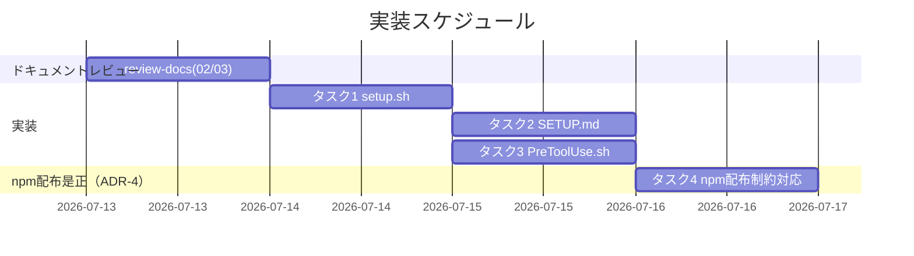
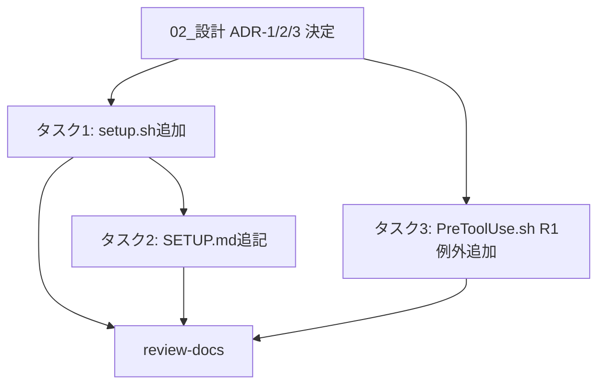

# 実装計画書: runtime/.gitignore 配布漏れバグの恒久修正

**プロジェクト名**: runtime/.gitignore 配布漏れバグの恒久修正
**作成日**: 2026 年 07 月 13 日
**最終更新**: 2026 年 07 月 13 日

> **重要**: **このドキュメントは常に更新**: 実装計画の変更、進捗状況の更新、バグの記録などがあった場合は、即座にこのドキュメントを更新してください。
>
> **用語**: [.agent-skill-chain/source/CONCEPTS.md §用語規約](../../../../.agent-skill-chain/source/CONCEPTS.md#用語規約) を参照。

---

## 1. 実装概要

### 1.1 実装方針（必須）

[02_設計.md](./02_設計.md) の ADR-1/2/3 に基づき、`setup.sh`（タスク 1）・`SETUP.md`（タスク 2）・`PreToolUse.sh` 正本（タスク 3）へ局所追記を行う。3 タスクは互いに独立ファイルへの変更であり並行実施可能だが、タスク 1 の変数命名（`WF_GITIGNORE`/`WF_GITIGNORE_SOURCE`）確定後にタスク 2 の文言を最終化するため、実施順はタスク 1 → タスク 2 → タスク 3 とする。実装後、review-docs（02/03 対象・design-feature 完了後の必須ゲート）を経てから implement-feature に進む。

**追記（ADR-4・実装完了後の verify-and-close フェーズで発覚した齟齬への対応）**: タスク 1〜3 実装・全テスト PASS 確認後、実際に `npm pack` して tarball を検証したところ、`package.json` の `files` 配列に `.agent-skill-chain/runtime/.gitignore` を追加しても npm-packlist の仕様上配布されないことが判明した（詳細根拠は 02_設計.md ADR-4 参照）。これにより **タスク 4** を追加し、コピー元をパッケージ内の別名テンプレートファイルに変更する。タスク 1 の実装（未存在時のみコピーというロジック自体）はそのまま維持し、コピー元パスの変数値のみをタスク 4 で修正する。

### 1.2 実装順序（必須: 1 件以上）

1. タスク 1: `setup.sh` に `runtime/.gitignore` の未存在時コピーブロックを追加
2. タスク 2: `SETUP.md` の所有区分表・初回コピー時の挙動補足表に行を追加
3. タスク 3: `PreToolUse.sh`（正本）R1 に厳密パス一致例外を追加
4. review-docs（02/03 対象・必須ゲート）
5. implement-feature（タスク 1〜3 の実施）
6. **タスク 4（ADR-4・追加）**: npm 配布制約への対応（テンプレートファイル新設・`setup.sh` コピー元変更・`package.json`/`verify-npm-pack.sh` 修正）



---

## 2. タスク分解

**用語**: [.agent-skill-chain/source/CONCEPTS.md §用語規約](../../../../.agent-skill-chain/source/CONCEPTS.md#用語規約) を参照。

**BDD 対応表**（01_要件定義.md §2.2 の 6 シナリオ ⇔ 本 03 のタスク・テスト観点）:

| 01 のユースケース・シナリオ | 対応タスク | 本 03 のテスト観点節 |
| --- | --- | --- |
| UC1 シナリオ1: 未存在時に配布される | タスク 1 | §2.1.3・§2.1.4 |
| UC1 シナリオ2: 既存時は上書きされない | タスク 1 | §2.1.3・§2.1.4 |
| UC2 シナリオ1: runtime/.gitignore への直接 Edit が許可される | タスク 3 | §2.3.3・§2.3.4 |
| UC2 シナリオ2: 他の runtime/ 配下ファイルへの直接 Edit/Write は引き続き block される | タスク 3 | §2.3.3・§2.3.4 |
| UC2 シナリオ3: パスが厳密一致でない場合は例外の対象外 | タスク 3 | §2.3.3・§2.3.4 |
| UC3 シナリオ1: 所有区分表に runtime/.gitignore の配布ルールが記載されている | タスク 2 | §2.2.3・§2.2.4 |
| （ADR-4 追加）npm 実配布で `.gitignore` が実際に届く | タスク 4 | §2.4.3 |

### 2.1 タスク 1: `setup.sh` に `runtime/.gitignore` の未存在時コピーブロックを追加

#### 2.1.1 概要（必須）

`.agent-skill-chain/source/scripts/setup.sh` の `runtime/templates` コピーブロック（L113-125）の直後に、`runtime/.gitignore` を未存在時のみコピーする新規ブロックを追加する（02_設計.md ADR-1/2、§3.1）。

#### 2.1.2 実装内容（必須: 1 件以上）

- L125（`runtime/templates` ブロックの `fi`）の直後・L127（スキル同期コメント）の前に、以下を追加する。

  ```bash
  # runtime/.gitignore は未存在時のみ配布する（workflow.db* 誤追跡防止の恒久修正・ADR-1）。
  # runtime/templates と異なり、消費者側のローカル変更を尊重するため既存ファイルは上書きしない。
  WF_GITIGNORE="$PROJECT_ROOT/.agent-skill-chain/runtime/.gitignore"
  WF_GITIGNORE_SOURCE="$PACKAGE_ROOT/.agent-skill-chain/runtime/.gitignore"
  if [[ -f "$WF_GITIGNORE_SOURCE" && ! -f "$WF_GITIGNORE" ]]; then
    mkdir -p "$PROJECT_ROOT/.agent-skill-chain/runtime"
    cp "$WF_GITIGNORE_SOURCE" "$WF_GITIGNORE"
    echo "runtime/.gitignore を配布しました（未存在時のみ）。"
  fi
  ```

- 変数名は既存の `WF_TEMPLATES`/`WF_SOURCE` の命名慣例を踏襲する（`WF_GITIGNORE`/`WF_GITIGNORE_SOURCE`）。
- `PACKAGE_ROOT`/`PROJECT_ROOT` は既存スクリプト内の定義済み変数をそのまま使い、新規のグローバル変数契約は追加しない。
- 挿入により L127 以降の行番号がすべて後方へシフトする点を implement-feature 実施時に申し送る（差分は `diff`/PR で確認できるため、行番号のハードコード依存箇所が他に無いことを実装時に grep で確認する）。

#### 2.1.3 テスト観点（必須）

**参照**: 観点の定義は [02_設計 §6](./02_設計.md#6-テスト戦略) および [RULES のテスト戦略・TEST_BDD_FORMAT](../../../../.agent-skill-chain/source/RULES.md#テスト戦略必須要件) を参照。以下は本タスクの具体ケース。

##### 単体（本タスクの具体ケース・必須 1 件以上）

- 正常系（01 UC1 シナリオ1 対応）: `.agent-skill-chain/runtime/.gitignore` が存在しない新規プロジェクトに対して `setup.sh` を実行すると、当該ファイルが配布され、内容に `workflow.db*` を含む。
- 正常系（01 UC1 シナリオ2 対応）: 既に `.agent-skill-chain/runtime/.gitignore` が存在し、パッケージ既定と異なる内容にローカル変更されているプロジェクトに対して `setup.sh` を再実行しても、当該ファイルの内容が変更されない。
- 境界値: `$WF_GITIGNORE_SOURCE`（パッケージ側）が存在しない場合（パッケージが壊れている等の異常系）は、`cp` を実行せずスキップする（既存の `runtime/templates` ブロックの `[[ -d "$WF_SOURCE" ]]` ガードと同じ方針）。

##### 結合/API（該当なし）

- 該当なし（`setup.sh` は外部 API を持たないローカルスクリプト）。

##### E2E/受け入れ（本タスクの具体ケース）

- `test/e2e-install-uninstall.sh` の N1（新規プロジェクト配備シナリオ、既存 L723-725 付近）に `assert_exists "$dest/.agent-skill-chain/runtime/.gitignore" "N1: runtime/.gitignore が新規配備される"` を追加する。
- `test/e2e-install-uninstall.sh` に新規シナリオ関数 `test_gitignore_not_overwritten_on_reinstall`（既存 R1「再インストール保持」シナリオ群の並びに追加）を新設し、「`.gitignore` を手動で別内容に書き換えた状態で `setup.sh` を再実行しても内容が変わらないこと」を検証する。

##### バリデーション（該当する場合の具体ケース）

- `runtime/templates/` の既存配布ロジック（毎回上書き・N1/N2/N4b・R1/R2/R3 の既存アサーション）が新規ブロック追加により回帰しないこと（既存テストをそのまま再実行して確認）。

#### 2.1.4 単体テスト仕様（BDD）（必須）

**BDD 形式のテストケース（高レベル仕様・01 UC1 シナリオ1/2 に対応）**:

```gherkin
Feature: setup.sh は runtime/.gitignore を未存在時のみ配布する
  Scenario: 消費者プロジェクトに runtime/.gitignore が存在しない
    Given 消費者プロジェクトの .agent-skill-chain/runtime/ 配下に .gitignore が存在しない
    When setup.sh を実行する
    Then .agent-skill-chain/runtime/.gitignore がパッケージから配布され、内容に workflow.db* を含む

  Scenario: 消費者プロジェクトに runtime/.gitignore が既に存在し、ローカルで内容が変更されている
    Given .agent-skill-chain/runtime/.gitignore が既に存在し、パッケージ既定と異なる内容にローカル変更されている
    When setup.sh を再実行する
    Then 当該ファイルの内容は変更されない
```

**テストコード例（`test/e2e-install-uninstall.sh` への追加。既存の `assert_exists`/`assert_eq` ヘルパーを使用。Given/When/Then インラインコメント必須）**:

```bash
# シナリオ: 既存 runtime/.gitignore はローカル変更を尊重し setup.sh 再実行で上書きされない（01 UC1 シナリオ2）
test_gitignore_not_overwritten_on_reinstall() {
  local dest
  dest="$(mktemp -d)"
  echo "[e2e] シナリオ: runtime/.gitignore はローカル変更を尊重し再実行で上書きされない"

  # Given: 初回 setup 実行で runtime/.gitignore が配布済みの状態を作り、その後ローカルで内容を書き換える
  run_setup "$dest" >/dev/null 2>&1
  echo "# local override" > "$dest/.agent-skill-chain/runtime/.gitignore"

  # When: setup.sh を再実行する（アップグレード相当）
  run_setup "$dest" >/dev/null 2>&1

  # Then: ローカル変更した内容が保持され、パッケージ既定（workflow.db*）に巻き戻らない
  assert_eq "$(cat "$dest/.agent-skill-chain/runtime/.gitignore")" "# local override" \
    "タスク1: runtime/.gitignore の再実行で内容が上書きされない"

  rm -rf "$dest"
}
test_gitignore_not_overwritten_on_reinstall
```

> 実装時の注記: `run_setup` は既存ファイル内で定義済みのヘルパー関数名を実装計画確定時に既存コードから確認し、無ければ既存の setup 呼び出しパターン（N1 等のシナリオ関数内の呼び出し）に合わせて置き換える。

#### 2.1.5 依存関係

- 02_設計.md §2.5 ADR-1・ADR-2 の決定に依存（配布方式・配置位置の確定）。
- タスク 2（SETUP.md）は本タスクで確定した変数名・挙動の説明文言を参照するため、本タスク完了後に着手する。



#### 2.1.6 見積もり

- **工数**: 0.5h
- **優先度**: 高

### 2.2 タスク 2: `SETUP.md` の所有区分表・初回コピー時の挙動補足表に行を追加

#### 2.2.1 概要（必須）

`.agent-skill-chain/source/SETUP.md` の所有区分表（L149-158 付近）・初回コピー時の挙動補足表（L202-209 付近）に、`runtime/.gitignore` の配布ルール（未存在時のみコピー）を明記する行を追加する（02_設計.md §3.2）。

#### 2.2.2 実装内容（必須: 1 件以上）

- 所有区分表（L157「消費者ランタイム生成物」行の直下）に次の行を追加する。

  ```
  | 消費者ランタイム生成物（配布ルール定義） | **`.agent-skill-chain/runtime/.gitignore`** | 初回配布のみパッケージ所有（配布後はユーザー資産） | 未存在時のみコピー（毎回上書きしない）。既存があれば touch しない |
  ```

- 初回コピー時の挙動補足表（L209「workflow.db」行の直下）に次の行を追加する。

  ```
  | **.agent-skill-chain/runtime/.gitignore** | 未存在時にパッケージから配布。既存の場合は上書きしない（ローカル変更を尊重）。 |
  ```

- 既存の表記スタイル（列区切り・太字強調の使い方）・粒度（`runtime/templates/` 行との対比）を踏襲し、重複記載にしない。

#### 2.2.3 テスト観点（必須）

##### 単体（本タスクの具体ケース・必須 1 件以上）

- 正常系（01 UC3 シナリオ1 対応）: `grep -n "runtime/.gitignore" .agent-skill-chain/source/SETUP.md` を実行した際、所有区分表・初回コピー時の挙動補足表の双方に該当行がヒットする（2 件以上）。
- 正常系: 追加行に「未存在時のみコピー」または「上書きしない」の趣旨の文言が含まれる（`grep -n "未存在時のみコピー" .agent-skill-chain/source/SETUP.md` が 1 件以上ヒット）。

##### 結合/API（該当なし）

- 該当なし。

##### E2E/受け入れ（本タスクの具体ケース）

- review-docs で、追記内容が「未存在時のみコピー」という挙動を過不足なく説明していること、既存の表記スタイルと一貫していることが確認され、指摘 0 件で完了する。

##### バリデーション（該当する場合の具体ケース）

- 追加行が `runtime/templates/`（毎回上書き）の既存行と混同されない文言になっていること（「未存在時のみ」と「毎回」が両行で明確に区別されているかをレビューで目視確認）。

#### 2.2.4 単体テスト仕様（BDD）（必須）

**BDD 形式のテストケース（01 UC3 シナリオ1 に対応）**:

```gherkin
Feature: SETUP.md の所有区分表に runtime/.gitignore の配布ルールが明記される
  Scenario: 保守者が SETUP.md の所有区分表を確認する
    Given SETUP.md の所有区分表（§所有区分）
    When runtime/.gitignore の配布ルールを探す
    Then 「未存在時のみコピー（毎回上書きしない）」という記載が見つかる
```

**確認スクリプト例（grep ベース・Given/When/Then インラインコメント付き）**:

```bash
# シナリオ: SETUP.md の 2 表に runtime/.gitignore の配布ルールが記載されている（01 UC3 シナリオ1）
SETUP_MD=".agent-skill-chain/source/SETUP.md"

# Given: SETUP.md に追記が反映された状態
# When: runtime/.gitignore への言及と「未存在時のみコピー」の文言を grep で確認する
hits_path=$(grep -c "runtime/\.gitignore" "$SETUP_MD")
hits_rule=$(grep -c "未存在時のみコピー" "$SETUP_MD")

# Then: いずれも1件以上（所有区分表・初回コピー時の挙動補足表の計2件以上）ヒットすること
[[ "$hits_path" -ge 2 && "$hits_rule" -ge 1 ]] && echo "PASS" || echo "FAIL"
```

#### 2.2.5 依存関係

- タスク 1（`setup.sh`）で確定した挙動（未存在時のみコピー・変数名）に依存。タスク 1 完了後に着手する。

#### 2.2.6 見積もり

- **工数**: 0.25h
- **優先度**: 中

### 2.3 タスク 3: `PreToolUse.sh`（正本）R1 に厳密パス一致例外を追加

#### 2.3.1 概要（必須）

`.agent-skill-chain/source/enforcement/claude/PreToolUse.sh` の R1（L167-172）に、`PATH_TARGET` が厳密に `.agent-skill-chain/runtime/.gitignore` と一致する場合のみ Edit/Write を許可する例外を追加する（02_設計.md ADR-3、§3.3）。配備先の生成物 `.claude/hooks/PreToolUse.sh` は直接修正せず、実装完了後に `setup.sh` の `copy_owned_files` で再配備させる。

#### 2.3.2 実装内容（必須: 1 件以上）

- L167-172 の既存 R1 ブロックを、以下に置き換える。

  ```bash
    # R1. .workflow 配下への直接 Write/Edit 禁止（全 ROLE）
    #   例外（ADR-3）: 対象パスが厳密に .agent-skill-chain/runtime/.gitignore と一致する場合のみ許可する。
    #   配布漏れの自己修復用の正規手段。前方一致・正規表現の緩いマッチではなくファイル名までの完全一致で
    #   判定し、他の runtime/ 配下ファイル（workflow.db*・issue ドキュメント等）への禁止は一切広げない。
    if [[ "$TOOL" == "Edit" || "$TOOL" == "Write" ]]; then
      if [[ "$PATH_TARGET" == ".agent-skill-chain/runtime/.gitignore" ]] || [[ "$PATH_TARGET" == */.agent-skill-chain/runtime/.gitignore ]]; then
        : # allow（厳密パス一致の狭い例外。R1 の他条件には進まない）
      elif [[ "$PATH_TARGET" =~ \.agent-skill-chain/runtime/ ]] || [[ "$PATH_TARGET" =~ /\.agent-skill-chain/runtime/ ]]; then
        block "direct edit of .agent-skill-chain/runtime/ is forbidden"
      fi
    fi
  ```

- `.claude/hooks/PreToolUse.sh`（生成物）は本タスクでは直接編集しない。実装完了後、`setup.sh` を実行して正本から再配備することで反映を確認する（01 §4.1 制約）。
- R1 以外のルール（R2〜R6）・`block`/`allow` 薄関数（L24-32）・`PATH_TARGET` 確定ロジック（L76-140）には手を加えない。

#### 2.3.3 テスト観点（必須）

##### 単体（本タスクの具体ケース・必須 1 件以上）

- 正常系（01 UC2 シナリオ1 対応）: `tool_name` が `Edit`、`file_path` が `.agent-skill-chain/runtime/.gitignore` の stdin JSON を渡すと、`PreToolUse.sh` が exit 0（allow）を返す。
- 正常系（01 UC2 シナリオ2 対応）: `tool_name` が `Write`、`file_path` が `.agent-skill-chain/runtime/workflow.db` の stdin JSON を渡すと、`PreToolUse.sh` が exit 2（block）を返し、従来どおり `direct edit of .agent-skill-chain/runtime/ is forbidden` メッセージが出る。
- 境界値（01 UC2 シナリオ3 対応・過剰マッチ防止）: `tool_name` が `Write`、`file_path` が `.agent-skill-chain/runtime/<issue>/.gitignore`（サブディレクトリ）の stdin JSON を渡すと、exit 2（block）を返す（厳密一致でないため例外の対象外）。

##### 結合/API（該当なし）

- 該当なし（hook はローカルスクリプトであり外部 API を持たない）。

##### E2E/受け入れ（本タスクの具体ケース）

- `test/test-pretooluse-hook.sh` の既存 UC3（`uc3_workflow_edit_exit2` 等、L218-238）・UC6（setup/plugin 両経路、L349-378）・UC8（subagent 昇格、L409-484）を再実行し、本変更が回帰していないことを確認する（他ロール・他経路での R1 block 挙動が維持されていること）。
- `test/test-pretooluse-hook.sh` に新規 UC9（`.gitignore` 厳密パス一致例外）を追加し、jq 有/無双方の経路（既存 `JQ_PATH`/`NOJQ_PATH` を再利用）で同一合否になることを確認する。

##### バリデーション（該当する場合の具体ケース）

- 例外条件がワイルドカード・前方一致になっていないこと（`.agent-skill-chain/runtime/.gitignore.bak` や `.agent-skill-chain/runtime/.gitignoreX` のような紛らわしいパスが誤って allow されないことをテストケースとして追加する）。

#### 2.3.4 単体テスト仕様（BDD）（必須）

**BDD 形式のテストケース（01 UC2 シナリオ1〜3 に対応）**:

```gherkin
Feature: R1 は runtime/.gitignore のみ厳密パス一致で例外的に許可する
  Scenario: エージェントが runtime/.gitignore を直接 Edit しようとする
    Given tool_name が "Edit" で file_path が ".agent-skill-chain/runtime/.gitignore"
    When PreToolUse.sh が R1 を評価する
    Then allow される（従来は全 ROLE で block されていた）

  Scenario: 他の runtime/ 配下ファイルへの直接 Edit/Write は引き続き block される
    Given tool_name が "Write" で file_path が ".agent-skill-chain/runtime/workflow.db"
    When PreToolUse.sh が R1 を評価する
    Then block（exit 2）される（現状維持）

  Scenario: パスが厳密一致でない場合は例外の対象外（過剰マッチ防止）
    Given tool_name が "Write" で file_path が ".agent-skill-chain/runtime/<issue>/.gitignore"（厳密パスと不一致）
    When PreToolUse.sh が R1 を評価する
    Then block（exit 2）される（例外はパス完全一致のみに限定し、抜け道を作らない）
```

**テストコード例（`test/test-pretooluse-hook.sh` への追加。既存の `run_pre`/`assert_eq`/`assert_grep` ヘルパーを使用。Given/When/Then インラインコメント必須。既存ファイルの `# シナリオ:` doc コメント規約に従う）**:

```bash
# =====================================================================================
# UC9: runtime/.gitignore の厳密パス一致例外（ADR-3・01 UC2 シナリオ1〜3）
# =====================================================================================
echo "== UC9: runtime/.gitignore 厳密パス一致例外 =="
uc9_gitignore_exact_match_allowed() {
  # シナリオ: runtime/.gitignore への直接 Edit は厳密パス一致で allow される（01 UC2 シナリオ1）
  # Given: AGENT_ROLE=worker、file_path が厳密に .agent-skill-chain/runtime/.gitignore
  local json='{"tool_name":"Edit","tool_input":{"file_path":".agent-skill-chain/runtime/.gitignore"}}'
  # When: 正当 JSON を stdin で渡す
  run_pre "$PATH" worker "$json"
  # Then: 終了コードは 0（allow）
  assert_eq 0 "$RC" "UC9: runtime/.gitignore の厳密一致 Edit は exit 0"
}
uc9_other_runtime_file_still_blocked() {
  # シナリオ: 他の runtime/ 配下ファイルへの Write は引き続き block される（01 UC2 シナリオ2）
  # Given: AGENT_ROLE=worker、file_path が .agent-skill-chain/runtime/workflow.db
  local json='{"tool_name":"Write","tool_input":{"file_path":".agent-skill-chain/runtime/workflow.db"}}'
  # When: 違反 JSON を stdin で渡す
  run_pre "$PATH" worker "$json"
  # Then: 終了コードは 2（block・現状維持）
  assert_eq 2 "$RC" "UC9: runtime/workflow.db の Write は exit 2（現状維持）"
  assert_grep "direct edit of .agent-skill-chain/runtime/ is forbidden" "$ERR" "UC9: 従来どおりの禁止メッセージ"
}
uc9_subdir_gitignore_not_exact_blocked() {
  # シナリオ: サブディレクトリの .gitignore は厳密一致でないため例外対象外（01 UC2 シナリオ3・過剰マッチ防止）
  # Given: AGENT_ROLE=worker、file_path が .agent-skill-chain/runtime/<issue>/.gitignore（厳密パスと不一致）
  local json='{"tool_name":"Write","tool_input":{"file_path":".agent-skill-chain/runtime/x/.gitignore"}}'
  # When: 違反 JSON を stdin で渡す
  run_pre "$PATH" worker "$json"
  # Then: 終了コードは 2（block・例外は完全一致のみ）
  assert_eq 2 "$RC" "UC9: サブディレクトリの .gitignore は exit 2（過剰マッチ防止）"
}
uc9_gitignore_exact_match_allowed
uc9_other_runtime_file_still_blocked
uc9_subdir_gitignore_not_exact_blocked
```

#### 2.3.5 依存関係

- 02_設計.md §2.5 ADR-3 の決定に依存（判定方式の確定）。タスク 1・タスク 2 とはファイルが独立するため並行実施可能。

#### 2.3.6 見積もり

- **工数**: 0.5h
- **優先度**: 高

### 2.4 タスク 4（ADR-4・追加）: npm 配布制約への対応

#### 2.4.1 概要（必須）

タスク 1〜3 実装・全テスト PASS 確認後の verify-and-close フェーズで、実際に `npm pack` して tarball を検証した結果、`package.json` の `files` 配列に `.agent-skill-chain/runtime/.gitignore` を追加しても npm-packlist の仕様上配布されないことが判明した（02_設計.md ADR-4）。本タスクはその是正。

#### 2.4.2 実装内容（必須: 1 件以上）

- 新規ファイル `.agent-skill-chain/source/runtime-gitignore.template` を追加する（内容は従来の `.agent-skill-chain/runtime/.gitignore` と同一の `workflow.db*` 1 行）。
- `setup.sh` の `WF_GITIGNORE_SOURCE` の値を `$PACKAGE_ROOT/.agent-skill-chain/runtime/.gitignore` から `$PACKAGE_ROOT/.agent-skill-chain/source/runtime-gitignore.template` に変更する（02_設計.md §3.1.3 最終実装コード参照）。コピー先（`$WF_GITIGNORE`）・「未存在時のみコピー」というロジック自体は変更しない。
- `package.json` の `files` 配列から実効性の無い `.agent-skill-chain/runtime/.gitignore` 行を削除する（新テンプレートは既存の `.agent-skill-chain/source/` ディレクトリ丸ごとエントリで配布されるため新規エントリは不要）。
- `.agent-skill-chain/source/scripts/verify-npm-pack.sh` の必須物リスト（`required` 配列）に `.agent-skill-chain/source/runtime-gitignore.template` を追加する（回帰検知）。
- 本リポジトリ自身の `.agent-skill-chain/runtime/.gitignore`（自己適用先・既存の git 追跡ファイル）は変更しない。

#### 2.4.3 テスト観点（必須）

##### 単体（本タスクの具体ケース・必須 1 件以上）

- 正常系: 実際に `npm pack` でtarballを生成し、`tar -tzf` で内容物を直接確認し、`.agent-skill-chain/source/runtime-gitignore.template` が含まれること（`npm pack --dry-run` の notice 表示だけに頼らない）。
- 正常系: `bash .agent-skill-chain/source/scripts/verify-npm-pack.sh` が新規必須物チェックを含めて合格すること。

##### 結合/E2E/受け入れ（本タスクの具体ケース）

- 実際に packed tarball を展開した「真の npm 配布物のみ」のディレクトリに対して `setup.sh` を実行し、`.agent-skill-chain/runtime/.gitignore` が正しい内容（`workflow.db*` を含む）で生成されることを end-to-end で確認する（開発リポの完全なソースツリーではなく、packed tarball のサブセットのみを使う点が重要）。
- `test/e2e-install-uninstall.sh` の N1 に、コピー元テンプレートの配備確認・配布された `.gitignore` の内容確認のアサーションを追加する。
- `test/e2e-install-uninstall.sh` の `test_no_dist_leak`（`verify-npm-pack.sh` を呼ぶ既存シナリオ）が新規必須物チェックを含めて回帰無く PASS すること。

##### バリデーション

- `test/test-pretooluse-hook.sh` の UC9 は変更不要であることを確認する（対象は消費者プロジェクトの最終配置先パス `.agent-skill-chain/runtime/.gitignore` であり、パッケージ内部のコピー元ファイル名とは無関係。02_設計.md §3.3.6 参照）。

#### 2.4.4 依存関係

- 02_設計.md §2.5 ADR-4 の決定に依存。タスク 1（`setup.sh`）のコピー元変数値を上書きするため、タスク 1 完了後に実施する。

#### 2.4.5 見積もり

- **工数**: 0.5h
- **優先度**: 高（npm 実配布での実効性に直結するため）

---

## テスト観点

本実装計画全体のテスト観点は、(1) `setup.sh`・`PreToolUse.sh` の E2E/単体テスト（`test/e2e-install-uninstall.sh`・`test/test-pretooluse-hook.sh` への追記・既存シナリオの回帰確認）、(2) `SETUP.md` の grep 存在確認＋review-docs、の 2 層。各タスクの §2.x.3 に具体ケースを記載済み。01_要件定義.md §2.2 の BDD シナリオ 6 件すべてに対応するテスト観点を上記「BDD 対応表」（§2 冒頭）のとおり割り当てた。

---

## 単体テスト

- `test/e2e-install-uninstall.sh`: 既存 N1 シナリオへのアサーション追加＋新規シナリオ `test_gitignore_not_overwritten_on_reinstall`（§2.1.4）。既存 N1〜N7・R1〜R3 の回帰確認を implement-feature 実施直後に実行する。ADR-4 適用後は N1 にコピー元テンプレート配備・配布内容の確認を追加（§2.4.3）。
- `test/test-pretooluse-hook.sh`: 新規 UC9（§2.3.4）＋既存 UC1〜UC8 の回帰確認を implement-feature 実施直後に実行する。ADR-4 の影響なし（§2.4.3 バリデーション観点）。
- `.agent-skill-chain/source/scripts/verify-npm-pack.sh`（ADR-4）: 必須物リストに新規テンプレートを追加。実際の `npm pack` tarball 内容物確認（`tar -tzf`）を必須の検証手順とする。

---

## BDD

§2.1.4・§2.3.4 の Gherkin シナリオ（01_要件定義.md §2.2 の 6 シナリオそのまま踏襲）、および §2.2.4 の grep ベース確認シナリオを参照。

---

## 3. 実装スケジュール

### 3.1 マイルストーン

| マイルストーン | 期日 | 成果物 |
| --- | --- | --- |
| review-docs（02/03 対象）完了 | 実装着手前 | 02/03 の指摘 0 件・memo・書記ログ |
| タスク 1〜3 実装完了 | review-docs 完了後 | `setup.sh`・`SETUP.md`・`PreToolUse.sh` 正本の変更反映、既存テスト＋新規テストが全 PASS |

### 3.2 実装フェーズ

#### フェーズ 1: review-docs（02/03 対象）

- **期間**: 実装着手前（design-feature 完了直後・必須ゲート）
- **タスク**: 02_設計.md・03_実装計画.md のレビューと修正の反復（指摘 0 件まで）

#### フェーズ 2: 実装（implement-feature）

- **期間**: review-docs 完了後
- **タスク**: タスク 1（`setup.sh`）→ タスク 2（`SETUP.md`）→ タスク 3（`PreToolUse.sh`）の順、または 1・3 を並行し 2 を最後に実施

---

## 4. テスト計画

テスト観点・レベル・BDD 形式の定義は **02_設計 §6** および **RULES のテスト戦略・TEST_BDD_FORMAT** を参照。本実装計画では各タスクの §2.x.3（テスト観点）にタスクごとの具体ケースを記載し、§2.x.4 に BDD 仕様を記載した。

### 4.1 テストの優先順位

- タスク 3（`PreToolUse.sh` R1 例外）はセキュリティ上のクリティカル観点（過剰マッチ防止）を含むため最も厚くテストする（§2.3.3 の境界値・バリデーション観点）。
- タスク 1（`setup.sh`）は影響範囲が既存の `runtime/templates` ロジックに隣接するため、既存 N1〜N7・R1〜R3 の回帰テストを必ず含める。
- タスク 2（`SETUP.md`）はドキュメントのため grep 確認と review-docs に留める。

---

## 5. リスク管理

### 5.1 実装リスク

- **リスク**: `PreToolUse.sh` R1 の例外条件の実装ミスにより、意図せず `runtime/` 配下の他ファイルも allow してしまう（過剰マッチ）。
  - **対策**: §2.3.3 の境界値テスト（サブディレクトリの `.gitignore`・紛らわしいファイル名）を実装直後に必ず実行し、既存 UC3・UC6・UC8 の回帰結果と併せて確認する。
- **リスク**: `setup.sh` への追加ブロックの挿入位置ミスにより、`runtime/templates` の既存ロジック（L113-125）を誤って変更してしまう。
  - **対策**: 実装時は `git diff` で `runtime/templates` ブロック（既存行）に差分が無いことを確認してからコミットする。
- **リスク**: 既存消費者プロジェクトへの展開が次回 `setup.sh` 実行まで反映されない（01 §4.3 移行期間・スケジュールの制約どおり）。
  - **対策**: 本 issue のスコープ外として許容する（01 で明記済み。即時一括配布は対象外）。
- **リスク（ADR-4）**: `package.json` の `files` 配列にファイルを追加しただけで「配布される」と誤認し、実際の npm 配布（`npm pack`）での検証を怠ると、本issueのような机上の修正で完了とみなしてしまう。
  - **対策**: `npm pack --dry-run` の notice 表示だけでなく、実際に `npm pack` して tarball を生成し `tar -tzf` で内容物を直接確認することを検証手順として必須化する（§2.4.3）。加えて packed tarball を展開した「真の配布物のみ」の環境で `setup.sh` を実行する end-to-end 検証も行う。

---

## 6. 参考資料

### プロジェクトドキュメント

- [`02_設計.md`](./02_設計.md) - 設計（ADR-1/2/3/4 の詳細・具体コード）
- [`01_要件定義.md`](./01_要件定義.md) - 要件定義（BDD シナリオ 6 件の正）

### その他の参考資料

- `.agent-skill-chain/source/scripts/setup.sh`（L113-125: 挿入先直前の既存ブロック）
- `.agent-skill-chain/source/SETUP.md`（§所有区分 L149-158 付近・§初回コピー時の挙動補足 L202-209 付近）
- `.agent-skill-chain/source/enforcement/claude/PreToolUse.sh`（R1: L167-172）
- `test/e2e-install-uninstall.sh`・`test/test-pretooluse-hook.sh`
- `package.json`（`files` 配列）・`.agent-skill-chain/source/scripts/verify-npm-pack.sh`（ADR-4）
- npm-packlist（`npm-packlist/lib/index.js` の `defaults` 配列。ADR-4 の実機検証根拠）

---

## 7. 前のステップ

この実装計画書は、以下のドキュメントを基に作成されています：

- **前**: [`02_設計.md`](./02_設計.md) - 設計フェーズ

---

## 8. 次のステップ

この実装計画書の承認後、以下のステップに進みます：

- **プロジェクトが 1 つの issue（本 issue）である場合**: review-docs（02/03 対象・必須ゲート）→ 実装フェーズ（implement-feature）に直接進む。

**用語**: [.agent-skill-chain/source/CONCEPTS.md §用語規約](../../../../.agent-skill-chain/source/CONCEPTS.md#用語規約) を参照。
