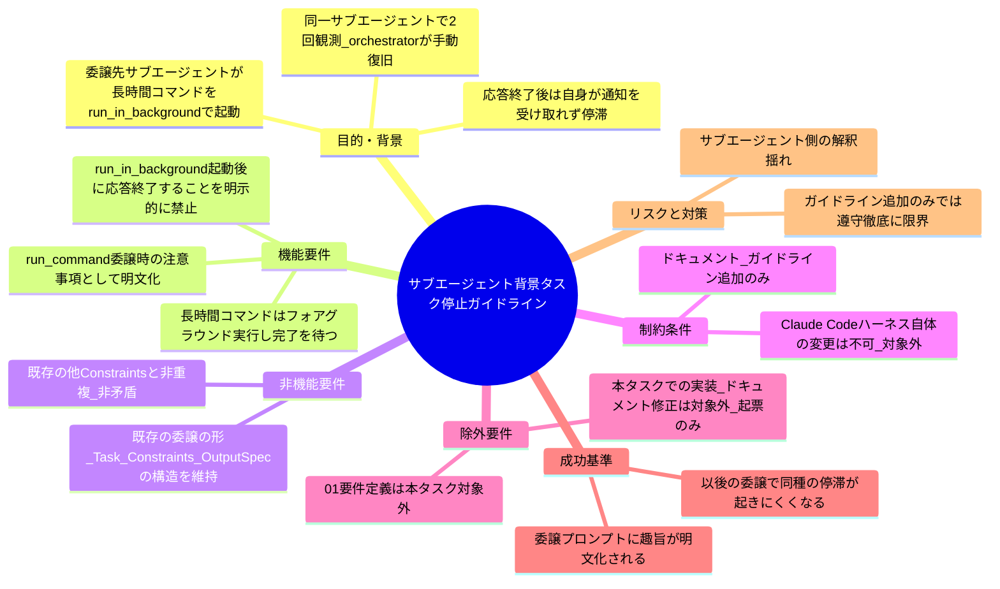
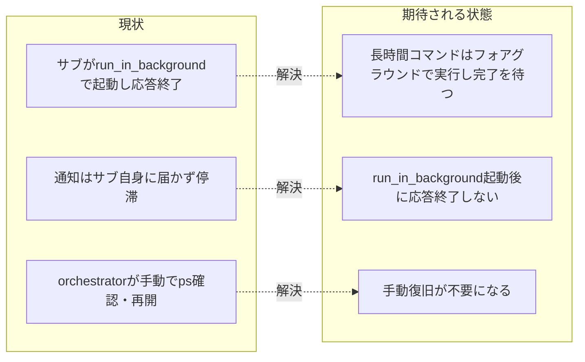

# 要求定義書: サブエージェント委譲時の長時間コマンド・バックグラウンド化による停滞再発防止ガイドライン

**プロジェクト名**: サブエージェント委譲時の長時間コマンド・バックグラウンド化による停滞再発防止ガイドライン
**作成日**: 2026 年 07 月 13 日
**最終更新**: 2026 年 07 月 13 日

> **重要**:
>
> - 要求定義書は、プロジェクトの全体像を把握するためのものです。詳細な技術仕様や実装方法は要件定義書以降で記載します。必要最低限の情報に収めることを心掛けてください。
> - **このドキュメントは常に更新**: 要求の変更や追加があった場合は、即座にこのドキュメントを更新してください。ドキュメントは「生きているドキュメント」として扱い、実装内容と常に同期させます。
> - **必須項目**: 以下の「必須」と明記した項目は空欄・抽象語のみ（例: 「{説明}」のまま）で提出しないこと。判定可能な形（目的は1文・成功基準は○/×で判定できる記載等）で記入すること。
>
> **用語**: [.agent-skill-chain/source/CONCEPTS.md §用語規約](../../../../.agent-skill-chain/source/CONCEPTS.md#用語規約) を参照。

---

## 要求定義の全体像

**注意**:

- マインドマップは全体像を把握するためのものです。主要なセクション名程度に留め、詳細は記載しないでください。

---

## 1. 目的・背景

### 1.1 目的（必須）

サブエージェントへの委譲時、長時間コマンドの扱いに関するガイドラインを明文化し停滞を防ぐ。

### 1.2 背景

- **現状の課題**:
  - 本リポジトリの `.agent-skill-chain` ワークフロー（[run_command.md](../../../../.agent-skill-chain/source/skills/agent/run_command.md)）は、進行役（オーケストレーター）が Agent ツールでサブエージェントに command（requirement-discovery/design-feature/implement-feature/verify-and-close 等）を委譲する構造を取る。この委譲先サブエージェントが、委譲されたタスク内で長時間コマンド（例: `bash test/run-all.sh` 等、数分単位の全テストスイート実行）を実行する際、Bash ツールの `run_in_background: true` で起動し、「バックグラウンドタスクの完了通知を待つ」という趣旨の発言とともに自身の応答を終了するケースが**実際に複数回観測された（同一サブエージェントで 2 回発生）**（evidence_source: orchestrator_report。本セッションでオーケストレーターが実体験として観測・報告した実害事例）。
  - **問題点**: Claude Code のハーネスにおいて、`run_in_background` で起動したタスクの完了通知（task-notification）は、**そのBashツールを呼び出した会話コンテキスト自身**に届く。オーケストレーター（メインループ）が Agent ツールでサブエージェントを 1 回呼び出す形態では、サブエージェントの応答終了時点でその Agent 呼び出し自体が完了として扱われ、サブエージェントは以後「眠って待つ」ことができない。一方、起動された OS プロセス自体はサブエージェントの応答終了後もバックグラウンドで実行が継続する。
  - 結果として次の停滞パターンが生じる。
    1. サブエージェントは「完了通知を待つ」と言い残したまま応答を終了する。
    2. 実際にはそのサブエージェント自身が通知を受け取ることはなく、処理は止まったまま停滞する。
    3. オーケストレーター側が異常に気づき（プロセスを `ps` 等で直接確認し）、プロセス終了を手動で待った上で、サブエージェントに SendMessage で再開を促す、という手動対応が毎回必要になっている。
  - この問題は**コードのバグではなく、委譲する側（オーケストレーター）のプロンプト設計・委譲の作法の問題**であり、`.agent-skill-chain` のワークフロー規約（run_command.md 等）にガイドラインとして明記することで再発防止できる可能性がある。

- **必要性**:
  - 現状の [run_command.md §委譲の形](../../../../.agent-skill-chain/source/skills/agent/run_command.md) の Constraints には、長時間コマンド実行時の `run_in_background` の扱いに関する明示的な注意事項が存在しない。委譲プロンプトにこの注意が無いため、サブエージェントが自身の判断で `run_in_background` を選択し、前述の停滞を招くリスクが常に残る。
  - 同一パターンの停滞が同一サブエージェントで 2 回発生していることから、単発の偶発事象ではなく**再発性のあるプロンプト設計上の欠落**であると判断できる（evidence_source: orchestrator_report）。

### 1.3 期待される効果（必須: 1 件以上）

- **効果 1**: 委譲プロンプト（run_command.md の Constraints、または該当する参照先）に「長時間コマンドはフォアグラウンド実行し完了を待て、`run_in_background` で起動して応答を終了するな」という趣旨のガイドラインが明文化される（○/×判定: 該当ファイルに具体的な禁止事項・推奨手順の記載があることを確認できる）。
- **効果 2**: 以後の委譲で、サブエージェントが長時間コマンドを `run_in_background` で起動したまま応答を終了する停滞が発生しにくくなる（○/×判定は本 issue のスコープでは直接検証できないため、01 以降でガイドラインの実効性確認方法を検討する）。

**現状と期待される状態の比較**:

---

## 2. 機能要件

### 2.1 既存機能の維持（該当する場合）

- 既存の [run_command.md §委譲の形](../../../../.agent-skill-chain/source/skills/agent/run_command.md)（Task/Constraints/OutputSpec の構造）・既存の各 Constraints 項目（review-docs 必須ゲート・GitHub Issue 起票ゲート・ブランチ紐づけゲート・書記依頼の強制等）は変更しない。本 issue は既存 Constraints に**新規項目を追加**するものであり、既存を置換・弱化しない。

### 2.2 新規機能要件

- **長時間コマンド実行時の委譲ガイドライン追加**: [run_command.md](../../../../.agent-skill-chain/source/skills/agent/run_command.md) の「委譲の形」節または新規セクションに、以下の趣旨を明文化する。
  - サブエージェントが委譲タスク内で長時間コマンド（テスト全件実行等）を実行する必要がある場合、**Bash ツールの `run_in_background: true` は使わず、フォアグラウンドで直接実行し完了を待つこと**。
  - **フォアグラウンド待機の対象は限定する**: 上記の「フォアグラウンドで待つ」対象は、**完了が見込める非対話型コマンド**（テスト全件実行・ビルド・一括処理など、有限時間で終了し入力を要さないもの）に限定する。`watch` 系・サーバー起動・対話入力を伴うコマンドなど、**無期限に走り続けるものや対話を要するものは対象外**であり、これらをフォアグラウンドで待つと逆に停滞する。これらを実行する必要がある場合は、バックグラウンド実行等の代替手段を検討するか、**明示的なタイムアウト（許容待機時間の上限）を設けて到達時にはキャンセルする手順**に従い、サブエージェントが無期限に停滞しないようにする。タイムアウト到達・キャンセル時の扱い（再試行するか、失敗として報告して次へ進むか等）も委譲時に明示する。
  - 理由: 入れ子のサブエージェント自身がバックグラウンドタスクを起動して応答を終了すると、そのタスクの完了通知は起動元（＝コマンドを起動したサブエージェント自身の会話コンテキスト）宛だが、応答を終了したサブエージェント自身は再開されず受け取れない（§1.2 の実害事例に同じ）。
  - このガイドラインの適用対象・具体的な記載箇所（run_command.md 本体か、AGENT_CONDUCT.md 第 3 部の凝縮版転記に含めるか等）は 01 以降で確定する。

---

## 3. 非機能要件

### 3.1 パフォーマンス

- 本件の成果物自体はドキュメント記述の追加が中心だが、**ガイドラインに従って長時間コマンドをフォアグラウンドで待つ運用は、実行時間の面で実際の影響を持つ**。具体的には、コマンド完了までサブエージェント（Agent 呼び出し）が応答を返さず待機するため、**Agent 呼び出し時間の延長・ハーネス側タイムアウト到達のリスク・その間の実行リソース占有**が生じる。したがって「性能に影響を与えない」とは扱わない。
- 対策方針: フォアグラウンド待機の対象は §2.2 のとおり**完了が見込める非対話型コマンドに限定**し、**許容待機時間の上限（タイムアウト）**を設ける方針とする。上限に達した場合はキャンセルし、バックグラウンド化などの代替手段を検討する。許容待機時間・タイムアウトの具体的な数値・判断基準は 01（要件定義）以降で確定する。

### 3.2 セキュリティ

- 該当なし（外部サービスへの書き込み・認証情報の扱いを伴わない）。

### 3.3 互換性

- 既存の run_command.md・commands/{name}.md・skills/{domain}/{capability}/ の構造・既存 Constraints 項目と非矛盾・非重複であること。
- Claude Code 以外のランタイム（プラットフォーム差分）でこのガイドラインが不要・無関係になる場合の扱いは 01 以降で検討する（既存の「効果解決不能環境ではフォールバック」というパターンを踏襲できるか確認する）。

### 3.4 保守性

- ガイドラインは 1 箇所（run_command.md または明確な参照先 1 か所）に記載し、重複記載しない（既存の「1 ファイル 1 責務」原則に従う）。

---

## 4. 制約条件

### 4.1 技術的制約

- **本件はドキュメント・ガイドラインの追加のみを対象とし、Claude Code ハーネス自体の変更は対象外（変更不可能）**。`run_in_background` の通知配送先がサブエージェント自身に届かないという挙動そのものはハーネス仕様であり、これを変更する手段は無い。したがって解決策は「委譲する側の作法・ガイドライン」に限定される。
- 既存の `run_command.md` の「委譲の形」節、または新規セクションへの追記を想定する（具体的な追記位置・文言は 01/02 で確定する）。

### 4.2 既存システムとの互換性

- 既存の Constraints 項目（review-docs 必須ゲート・GitHub Issue 起票ゲート・ブランチ紐づけゲート・PR 紐づけゲート・書記依頼の強制等）と非交差・非矛盾になるよう、新規ガイドラインは独立した項目として追加する。

### 4.3 移行期間・スケジュール

- 特になし。次回以降の委譲から適用される運用上のガイドラインであり、既存 issue への遡及適用（grandfather）の概念は本件には該当しない。

---

## 5. 除外要件

- **本件の実装（実際の `run_command.md` 等のドキュメント修正）は本タスクでは行わない**。要求定義（00）の起票のみを本タスクの対象とする。
- **01_要件定義.md の作成は本タスクでは行わない**（依頼者の明示指示により「起票」＝ 00 作成までとする）。
- Claude Code ハーネス自体の変更・`run_in_background` の通知配送先の変更提案は対象外。
- 本件停滞の再現実験（意図的にサブエージェントへ `run_in_background` を使わせて停滞を再現させること）は対象外（実害はすでに本セッションで観測済みであり、再現の必要性は無い）。

---

## 6. 成功基準（必須: 1 件以上）

- 委譲プロンプト（run_command.md の Constraints、または適切な参照先）に「長時間コマンドはフォアグラウンド実行し完了を待て、`run_in_background` で起動して応答を終了するな」という趣旨のガイドラインが明文化されることが、01 以降の受け入れ基準として定義されている。
- 本 00 に、実害観測（同一サブエージェントで 2 回発生）が evidence_source 付きで記載されている。
- スコープ（ドキュメント追加のみ・実装は対象外・ハーネス変更は対象外）が明記されている。

---

## 7. リスクと対策

### 7.1 技術的リスク

- **リスク**: ガイドラインを追加しても、サブエージェントが読み飛ばす・解釈を誤ることで同種の停滞が完全には無くならない可能性がある。
  - **対策**: 既存の Constraints 転記の仕組み（AGENT_CONDUCT.md 第 3 部凝縮版転記等）に準じ、委譲パケットに毎回明示することで想起されやすくする。機械的な強制（enforcement）による完全防止までは本件のスコープでは扱わない旨を 01 以降に明記する。
- **リスク**: 「長時間」の基準が曖昧で、どこからフォアグラウンド必須とするかの線引きが不明確になる。
  - **対策**: 具体的な閾値・判断基準は 01（要件定義）以降で検討課題として明記する。

### 7.2 スケジュールリスク

- **リスク**: 特になし。
  - **対策**: 該当なし。

---

## 8. 参考資料

### プロジェクトドキュメント

- [`.agent-skill-chain/source/skills/agent/run_command.md`](../../../../.agent-skill-chain/source/skills/agent/run_command.md) — 委譲の実行手段・Constraints の正本。本件の追記対象候補。
- [`.agent-skill-chain/source/boot/CORE.md`](../../../../.agent-skill-chain/source/boot/CORE.md) — 実行契約の正本。委譲フローの原則。
- [`.agent-skill-chain/source/boot/LOAD_POLICY.md`](../../../../.agent-skill-chain/source/boot/LOAD_POLICY.md) — トリガー→読むファイルの正本。
- [`.agent-skill-chain/source/workflow/PHASES.md`](../../../../.agent-skill-chain/source/workflow/PHASES.md) — フェーズ順・成果物・DoD。
- [`.agent-skill-chain/source/commands/requirement-discovery.md`](../../../../.agent-skill-chain/source/commands/requirement-discovery.md) — 本 00 作成の command 定義。
- [`.agent-skill-chain/source/spec/00_spec概要.md`](../../../../.agent-skill-chain/source/spec/00_spec概要.md)・[`01_設計原則.md`](../../../../.agent-skill-chain/source/spec/01_設計原則.md) — 設計原則（1 ファイル 1 責務・UNIX 哲学等、追記位置検討の参考）。
- [`.agent-skill-chain/project/自己拡張ワークフロー.md`](../../../../.agent-skill-chain/project/自己拡張ワークフロー.md) — 本リポジトリの issue 作成場所の上書き定義。

### その他の参考資料

- 本セッションでオーケストレーターが実際に観測した停滞事例（同一サブエージェントで 2 回、`run_in_background` 起動後に応答終了し、手動で `ps` 確認・再開対応を行った実体験）。evidence_source: orchestrator_report。

---

## 9. 次のステップ

この要求定義書の承認後、以下のドキュメントを作成します（本タスクのスコープ外）：

- **次**: [`01_要件定義.md`](./01_要件定義.md) - 要件定義フェーズ（本タスクでは未作成。別タスクでの起票を想定）
