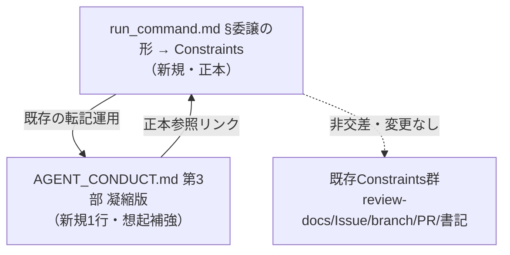

# 設計書: サブエージェント委譲時の長時間コマンド・バックグラウンド化による停滞再発防止ガイドライン

**プロジェクト名**: サブエージェント委譲時の長時間コマンド・バックグラウンド化による停滞再発防止ガイドライン
**作成日**: 2026 年 07 月 14 日
**最終更新**: 2026 年 07 月 14 日

> **重要**: **このドキュメントは常に更新**: 設計の変更や追加があった場合は、即座にこのドキュメントを更新してください。ドキュメントは「生きているドキュメント」として扱い、実装内容と常に同期させます。
>
> **用語**: [.agent-skill-chain/source/CONCEPTS.md §用語規約](../../../../.agent-skill-chain/source/CONCEPTS.md#用語規約) を参照。
>
> **参照元**: 本設計は [`00_要求定義.md`](./00_要求定義.md)・[`01_要件定義.md`](./01_要件定義.md) を基に作成する。目的・背景・スコープ・受け入れ基準の正本は 00/01 とし、本 02 では重複記述を避け、責務・境界・具体的な追記文言（API 契約）・依存関係・テスト観点への具体化を担う。

---

## 1. 設計概要

**必須**: 設計方針・原則は [.agent-skill-chain/source/spec/01\_設計原則.md](../../../../.agent-skill-chain/source/spec/01_設計原則.md) を先に参照した上で、本プロジェクトに適用するものを選び記載する。

### 1.1 設計方針

本件は `.agent-skill-chain` ワークフロー規約への**ドキュメント追記のみ**を対象とする。委譲を受けたサブエージェントが委譲タスク内で長時間コマンドを `run_in_background: true` で起動したまま応答を終了して停滞する再発を防ぐため、委譲作法のガイドラインを**正本 1 箇所（run_command.md §委譲の形 → Constraints）**に追加し、想起補強として凝縮版（AGENT_CONDUCT.md 第 3 部）へ要点 1 行を転記する。Claude Code ハーネス自体（`run_in_background` の通知配送先）は変更しない（00 §4.1・01 §5）。

### 1.2 設計原則（本プロジェクトで適用するもの）

- **単一責務**: ガイドラインの正本は 1 ファイル（run_command.md）に置く。凝縮版は正本の重複ではなく「要点＋正本参照」として書き、二重定義を避ける（[01\_設計原則 §単一責務](../../../../.agent-skill-chain/source/spec/01_設計原則.md#単一責務)、BR-2）。
- **明確な境界**: 新規ガイドラインは既存 Constraints 項目群（review-docs 必須ゲート・GitHub Issue 起票ゲート・ブランチ紐づけゲート・PR 紐づけゲート・書記依頼の強制等）と非交差・非矛盾な**独立項目**として追加する（[01\_設計原則 §明確な境界](../../../../.agent-skill-chain/source/spec/01_設計原則.md#明確な境界)、BR-3）。
- **AIフレンドリー設計**: 委譲を受けたサブエージェントが**想起しやすい**位置・粒度で記載する。既存 Constraints の記法（箇条書き・**強調**・相互参照リンク）に揃え、意図が一読で分かる文言にする（[01\_設計原則 §AIフレンドリー設計](../../../../.agent-skill-chain/source/spec/01_設計原則.md#aiフレンドリー設計)）。

> **設計判断の優先順位**（[spec/06](../../../../.agent-skill-chain/source/spec/06_設計判断の優先順位.md)）: 本件では「可読性 > 単一責務 > 仕様との整合性」を優先。閾値（秒数）を設けず判断基準を単純化する方針は「テクニックより構造の一貫性」「docs と実装の不整合を放置しない」に整合する。

---

## 2. アーキテクチャ設計

### 2.1 責務・境界・参照関係（define-boundaries）

本件の「コンポーネント」は実行時モジュールではなく**規約ドキュメントの記述単位**である。

#### 2.1.1 責務一覧

| コンポーネント | 責務（1 文） |
| -------------- | ------------ |
| `run_command.md` §委譲の形 → Constraints（**正本**） | 委譲タスク内の長時間コマンドを `run_in_background` で起動せずフォアグラウンド実行し完了を待つ、というガイドラインの**唯一の正本**を保持する。 |
| `AGENT_CONDUCT.md` 第 3 部 サブエージェント向け凝縮版（**想起補強**） | 委譲パケットの Constraints 末尾へ毎回転記される凝縮版に、上記正本の**要点 1 行＋正本参照**を載せ、委譲先での想起性を高める。 |
| 既存 Constraints 項目群（変更なし） | review-docs／GitHub Issue 起票／ブランチ紐づけ／PR 紐づけ／書記依頼等の既存ゲート。本件は一切変更せず、隣に独立項目を追加するのみ。 |

#### 2.1.2 境界

- **入力**: 委譲を受けたサブエージェントが、委譲タスク内で完了までに時間のかかるコマンド（テスト全件実行・ビルド等）を実行する必要がある場面。
- **出力**: サブエージェントが `run_in_background: true` を選択せずフォアグラウンドで完了を待つ、という行動の指示（規約テキスト）。
- **他責務との境界**:
  - **ハーネス挙動は範囲外**: `run_in_background` の通知配送先がサブエージェント自身に届かない挙動は Claude Code ハーネス仕様であり、本件では変更しない（00 §4.1）。
  - **既存ゲートとは非交差**: 本ガイドラインは「委譲後にサブエージェントが従う実行作法」であり、既存 Constraints（実装着手前ゲート群・書記依頼強制）とはトピックが重ならない。既存項目の置換・弱化は行わない（BR-3）。
  - **enforcement 機構は範囲外**: 機械的強制（hooks/CI）は導入しない。本ガイドラインは advisory（勧告）であり、既存の AGENT_CONDUCT §機構的強制の非対象と同型に位置づける（00 §7.1・01 §3.3）。

#### 2.1.3 参照関係

- `AGENT_CONDUCT.md` 第 3 部凝縮版（要点 1 行）→ `run_command.md` §委譲の形（正本）を**参照**する（重複定義せず、正本へ 1 方向で向ける）。
- `run_command.md` §委譲の形（正本）→ 既存記載「委譲時の行動規範凝縮版転記」（:69）が既に `AGENT_CONDUCT.md` 第 3 部を参照している。本件はこの既存の参照構造に**寄生**し、新規の相互参照リンクを 1 本追加するのみ（正本→凝縮版の逆参照は張らない＝循環参照を持たない）。



### 2.2 システムアーキテクチャ

- **採用パターン**: 「正本 1 箇所＋凝縮版参照」パターン（既存の `run_command.md :69`「委譲時の行動規範凝縮版転記」と同型）。
- **根拠**: 委譲実行の正本が `run_command.md` である（[run_command.md :3-5](../../../../.agent-skill-chain/source/skills/agent/run_command.md)）ため正本の置き場所として最も整合し（BR-2）、凝縮版は委譲パケットへ毎回転記される仕組み（[run_command.md :69](../../../../.agent-skill-chain/source/skills/agent/run_command.md)）であるため想起補強に最適（01 §3.3）。evidence_source: existing_code（run_command.md §Constraints・AGENT_CONDUCT.md 第 3 部の現行構造を確認）。

### 2.5 横断設計判断（ADR）

#### ADR-1: 記載箇所は「案 A（正本）＋案 B（凝縮版参照）」の両方を採用する

- **コンテキスト**: 01 §5 は記載箇所を 2 案に絞り、最終決定を 02 に委ねている。案 A＝`run_command.md` 本体への独立 Constraints 項目追加（推奨・正本）、案 B＝`AGENT_CONDUCT.md` 第 3 部凝縮版への要点転記（補強・任意）。本ガイドラインの目的は再発防止であり、失敗モードは「サブエージェントが委譲パケットを読み飛ばす／解釈を誤る」ことである（00 §7.1）。
- **検討した選択肢**:
  - **(a) 案 A のみ**: 正本 1 箇所に集約。BR-2 に最も素直。ただし `run_command.md` の Constraints は「orchestrator が委譲パケットを組み立てる際に従う規約」であり、委譲を受けたサブエージェントの手元に**必ず現れるとは限らない**。想起性が案 B より弱い。
  - **(b) 案 B のみ**: 凝縮版は委譲パケットへ毎回転記されるため想起性は最強。ただし正本が凝縮版側になると BR-2（正本は委譲実行の正本＝run_command.md に置く）と整合せず、凝縮版が肥大化する。
  - **(c) 案 A＋案 B（両方）**: 正本を `run_command.md` に置き（BR-2 充足）、凝縮版へは要点 1 行＋正本参照を載せて委譲パケットでの想起性を確保する。既存の「委譲時の行動規範凝縮版転記」（run_command.md :69）と同一の二層構造。
- **決定**: **(c) 案 A＋案 B の両方を採用**する。
- **根拠**: 目的（再発防止）の達成には正本の置き場所（BR-2）と想起性（01 §3.3）の両立が必要であり、両者を同時に満たすのは (c) のみ。(c) は既存の凝縮版転記運用と同型のため新規の構造的負債を生まず、凝縮版を「要点＋正本参照」に限定すれば BR-2（重複記述の禁止）にも反しない。evidence_source: existing_code（run_command.md :69 の既存二層構造）＋ orchestrator_report（読み飛ばしが失敗モードである実害観測。00 §1.2）。inference_only を含む（想起性向上の定量効果は本 issue のスコープでは検証不能。01 §2.1 効果 2 と同旨）＝要人間確認。
- **帰結**: 実装対象ファイルは 2 つ（`run_command.md`＝正本追記、`AGENT_CONDUCT.md`＝凝縮版 1 行追記）。凝縮版側は正本の**要点のみ**とし、詳細・理由は正本に置く（重複禁止）。案 B は BR-2 を破らない範囲でのみ許容されるため、凝縮版の文言は正本参照を必ず含める。

#### ADR-2: 「長時間」の判断基準に数値閾値を設けない（BR-1 の文言確定）

- **コンテキスト**: 01 BR-1 は、フォアグラウンド実行を要する条件を秒数などの数値閾値で定義せず、判断の分かれ目を「`run_in_background` を使う可能性があるか」に置くと定めた。最終文言・例外の有無は 02 で確定する（要人間確認）。
- **検討した選択肢**:
  - **(a) 数値閾値方式**: 「N 秒以上のコマンドはフォアグラウンド」。線引きが明確に見えるが、本停滞の失敗モードは実行時間の長さではなく**通知配送の仕組み**に起因するため、短時間の `run_in_background` でも同じ停滞を招く。誤った線引きを生む。
  - **(b) 閾値なし・行為基準方式**: 「委譲タスク内では `run_in_background: true` を原則使わずフォアグラウンドで完了を待つ」。判断基準を「行為（background 起動の有無）」に統一し、時間見積りの主観を排除する。
- **決定**: **(b) 閾値なし・行為基準方式**を採用する。文言は「原則フォアグラウンド。`run_in_background: true` で起動して自身の応答を終了する行為を禁止」とする。
- **根拠**: 失敗モードが通知配送に起因する以上、時間閾値は誤検知・見逃しの双方を生む（BR-1 と同旨）。行為基準なら短時間 background 起動も一律に抑止でき、判断が単純化される（spec/06「テクニックより構造の一貫性」）。evidence_source: orchestrator_report（停滞メカニズムの観測。00 §1.2）。
- **帰結**: 例外は設けない（「原則」の語で運用上の余地は残すが、閾値・秒数・例外リストは書かない）。凝縮版・正本ともにこの行為基準で統一する。

#### ADR-3: 適用対象外ランタイムではフォールバックし無害化する（ロックアウトしない）

- **コンテキスト**: 入れ子委譲＋バックグラウンド完了通知が起動元にしか届かないという前提が成立しないランタイムがありうる（01 §3.4・ユースケース 2 シナリオ 2）。既存規約は「前提が成立しない環境ではフォールバックし規約をロックアウトさせない」パターンを持つ（run_command.md の各ゲートの「対象外環境では発火しない」記述）。
- **検討した選択肢**: (a) 無条件適用（前提不成立環境でも従わせる）／(b) 前提明示＋フォールバック（前提が成立しない環境では自然に無害化される旨を明記）。
- **決定**: **(b)** を採用。ガイドライン文言に「この前提（入れ子委譲＋バックグラウンド完了通知が起動元にしか届かない）が成立しないランタイムでは本項は自然に無害化される（フォールバック。ロックアウトしない）」を含める。
- **根拠**: 既存ゲート群と同一のフォールバック思想に揃える（[feedback_enforce-on-lockout-incident] と同型のロックアウト回避）。本項は advisory であり機械強制しないため、前提不成立環境でも実害を生まない。evidence_source: existing_code（run_command.md 各ゲートの対象外環境フォールバック記述）。
- **帰結**: 文言に前提とフォールバックを 1 文で併記する。enforcement（hooks/CI）は追加しない。

---

## 3. 機能設計（追記する具体文言＝API 契約）（design-api-contract）

本節が本設計の中核であり、**実装フェーズでそのまま挿入する確定文言**を定義する。ドキュメント成果物のため「API 契約」＝「追記する Markdown テキストの確定版」と読み替える。

### 3.1 機能 1: run_command.md §委譲の形 → Constraints への正本追記（案 A）

#### 3.1.1 概要

`run_command.md` の `### Constraints` リスト内に、独立した箇条書き項目を 1 件新規追加する。

#### 3.1.2 挿入位置

`### Constraints`（[run_command.md :43-70](../../../../.agent-skill-chain/source/skills/agent/run_command.md)）内、**「委譲時の行動規範凝縮版転記」項目（:69）の直前**に新規項目を挿入する。理由: 両者はともに「委譲を受けたサブエージェントの行動作法」に関する項目であり、トピック的に隣接させると可読性が高い（spec/06「可読性」）。既存項目の順序・文言は一切変更しない（BR-3）。

#### 3.1.3 追記する確定文言（この文字列をそのまま挿入する）

```markdown
- **委譲タスク内の長時間コマンドはフォアグラウンド実行（`run_in_background` 抑止）**: 委譲を受けたサブエージェントは、委譲タスク内で完了までに時間のかかるコマンド（テスト全件実行・ビルド等）を実行する場合でも、**Bash ツールの `run_in_background: true` を使わず、原則フォアグラウンドで実行して完了を待つこと**。判断の分かれ目は実行時間の長短（秒数などの閾値）ではなく「`run_in_background` を使う可能性があるか」に置く。**理由**: 入れ子で委譲されたサブエージェント自身が起動したバックグラウンドタスクの完了通知（task-notification）は、**その起動元＝コマンドを起動したサブエージェント自身の会話コンテキストに届く仕組みだが、サブエージェントが応答を終了すると Agent 呼び出しが完了扱いとなり再開されないため、その通知を受け取れない**。そのため「完了通知を待つ」と言い残して応答を終了すると、処理が停滞する（同一サブエージェントで 2 回観測済み。オーケストレーター側にもこの完了は自動通知されず、手動での確認・再開が必要になる）。**`run_in_background: true` で長時間コマンドを起動して自身の応答を終了する行為は禁止**する。なお、この前提（入れ子委譲では、起動したバックグラウンドタスクの完了通知を、応答を終了したサブエージェント自身が受け取って再開することはできない）が成立しないランタイムでは本項は自然に無害化される（フォールバック。ロックアウトしない）。本項は既存の各ゲート・書記依頼の強制とは非交差の独立項目であり、既存項目を置換・弱化しない。
```

#### 3.1.4 受け入れ確認（○/×判定可能）

- `run_command.md` に「`run_in_background`」を含む独立 Constraints 項目が 1 件存在する（`grep` で確認可）。
- 文言に (1) フォアグラウンド原則、(2) 閾値を置かない旨、(3) 停滞メカニズム（応答終了後はサブエージェント自身が完了通知を受け取れず停滞する）、(4) background 起動後の応答終了禁止、(5) フォールバック、の 5 要素がすべて含まれる。
- 既存の 5 ゲート項目・書記依頼強制項目の文言が差分で変更されていない（既存項目非改変）。

### 3.2 機能 2: AGENT_CONDUCT.md 第 3 部凝縮版への要点 1 行追記（案 B）

#### 3.2.1 概要

`AGENT_CONDUCT.md` 第 3 部の凝縮版コードブロック（[AGENT_CONDUCT.md :80-90](../../../../.agent-skill-chain/source/AGENT_CONDUCT.md) の ` ```markdown ` ブロック内）に、要点 1 行を追加する。

#### 3.2.2 挿入位置

凝縮版コードブロック内の最後の箇条書き項目「**境界**: …」（:89）の**直後**に 1 行追加する。委譲パケットへ毎回転記される凝縮版なので、想起性が最大化される。

#### 3.2.3 追記する確定文言（この 1 行をコードブロック内に挿入する）

```markdown
- **背景タスク抑止**: 委譲タスク内の長時間コマンドは `run_in_background` を使わずフォアグラウンド実行し完了を待つ。background 起動して自身の応答を終了しない（応答終了後はサブエージェント自身が完了通知を受け取れず停滞する）。正本は run_command.md §委譲の形
```

#### 3.2.4 受け入れ確認（○/×判定可能）

- `AGENT_CONDUCT.md` 第 3 部の凝縮版コードブロック内に「背景タスク抑止」で始まる 1 行が存在する。
- その行に「正本は run_command.md §委譲の形」の**正本参照**が含まれる（BR-2: 重複ではなく要点参照）。
- 凝縮版の他の既存 7 項目が改変されていない。

#### 3.2.5 エラーハンドリング／整合

- 凝縮版が正本（run_command.md）と矛盾した場合は規約側が優先される（既存 AGENT_CONDUCT §0 読み替え規則。本追記もこの規則の適用下に入る）。凝縮版は要点のみのため矛盾は生じない設計。

---

## 4. データ設計

該当なし（データモデル・テーブル・永続化を伴わない。ドキュメント追記のみ）。

---

## 5. API 設計

プログラム API の追加・変更は無し（01 §4.1）。本設計における「契約」は §3 の追記文言そのものであり、§3 に集約する。

---

## 6. テスト戦略

テスト戦略の観点定義は [RULES.md のテスト戦略必須要件](../../../../.agent-skill-chain/source/RULES.md#テスト戦略必須要件) を参照。本成果物は**実行コードではなくドキュメント**のため、「テスト」＝**追記文言の受け入れ確認（存在検査・整合検査）**と読み替える。具体的な確認手順は 03 §2 の各タスクに記載する。

### 6.1 対象ごとのテスト割り当て

| 対象 | 単体 | 結合/API | E2E | クリティカル観点 | バリデーション観点 | 未達理由/補足 |
| ---- | ---- | -------- | --- | ---------------- | ------------------ | ------------- |
| run_command.md 正本追記（案 A） | ○ | × | × | 追記文言に 5 要素（§3.1.4）が全て含まれ、既存 Constraints 項目・5 ゲートが非改変であること | Markdown 構文・相互参照リンク・markdownlint 準拠 | 実行コードなし＝結合/E2E は N/A |
| AGENT_CONDUCT.md 凝縮版追記（案 B） | ○ | × | × | 凝縮版に「背景タスク抑止」1 行＋正本参照が存在し、既存 7 項目が非改変であること | コードブロック内の記法一貫性・markdownlint 準拠 | 同上 |
| BR-2 整合（重複禁止） | ○ | × | × | 正本と凝縮版が二重定義になっていない（凝縮版は要点＋参照のみ） | — | — |

### 6.2 監査・レビューでの確認（証跡）

本設計 §6.1 の割当表と 03 のタスク別確認観点が対応していることを確認する。ドキュメント成果物のため、受け入れ確認は「差分レビュー＋ `grep` による文言存在確認＋ markdownlint」で行う（03 §2 に手順化）。**本 command 完了後・implement-feature 着手前に review-docs（実装前ドキュメントレビュー）が必須**（design-feature.md DoD・run_command.md §Constraints）。

---

## 7. 非機能要件への対応

- **保守性/単一責務**: 正本 1 箇所（BR-2）。凝縮版は要点＋参照のみで重複を作らない（§3.2）。
- **互換性**: 既存 Constraints・凝縮版の既存項目を非改変で追加のみ（BR-3）。既存の相互参照・enforcement 番号（#32/#34/#35/#36 等）に影響しない。
- **可用性/フォールバック**: 前提不成立ランタイムで無害化（ADR-3）。ロックアウトしない。
- **パフォーマンス/セキュリティ**: 影響なし（00 §3.1-3.2）。

---

## 8. 参考資料

### プロジェクトドキュメント

- [`00_要求定義.md`](./00_要求定義.md) - 目的・背景・スコープ・実害事例の正本
- [`01_要件定義.md`](./01_要件定義.md) - ユーザーストーリー・BDD・ビジネスルール（BR-1〜3）・記載箇所 2 案
- [`.agent-skill-chain/source/skills/agent/run_command.md`](../../../../.agent-skill-chain/source/skills/agent/run_command.md) - 委譲の形・Constraints の正本（案 A の追記対象）
- [`.agent-skill-chain/source/AGENT_CONDUCT.md`](../../../../.agent-skill-chain/source/AGENT_CONDUCT.md) - 第 3 部 サブエージェント向け凝縮版（案 B の追記対象）
- [`.agent-skill-chain/source/spec/01_設計原則.md`](../../../../.agent-skill-chain/source/spec/01_設計原則.md) / [`06_設計判断の優先順位.md`](../../../../.agent-skill-chain/source/spec/06_設計判断の優先順位.md) - 単一責務・明確な境界・可読性優先の根拠
- [`.agent-skill-chain/source/EVIDENCE_POLICY.md`](../../../../.agent-skill-chain/source/EVIDENCE_POLICY.md) - ADR 形式・evidence_source の根拠

### その他の参考資料

- 本セッションで進行役が観測した停滞事例（同一サブエージェントで 2 回、`run_in_background` 起動後に応答終了し手動で `ps` 確認・SendMessage 再開）。evidence_source: orchestrator_report。

---

## 11. 前のステップ

- **前**: [`01_要件定義.md`](./01_要件定義.md) - 要件定義フェーズ

---

## 12. 次のステップ

- **次**: [`03_実装計画.md`](./03_実装計画.md) - 実装計画フェーズ
