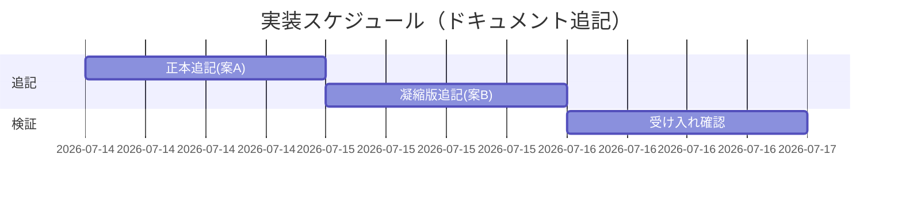

# 実装計画書: サブエージェント委譲時の長時間コマンド・バックグラウンド化による停滞再発防止ガイドライン

**プロジェクト名**: サブエージェント委譲時の長時間コマンド・バックグラウンド化による停滞再発防止ガイドライン
**作成日**: 2026 年 07 月 14 日
**最終更新**: 2026 年 07 月 14 日

> **重要**: **このドキュメントは常に更新**: 実装計画の変更、進捗状況の更新、バグの記録などがあった場合は、即座にこのドキュメントを更新してください。
> **必須項目**: 「必須」と明記した欄は空欄・抽象語のみで提出しないこと。
>
> **用語**: [.agent-skill-chain/source/CONCEPTS.md §用語規約](../../../../.agent-skill-chain/source/CONCEPTS.md#用語規約) を参照。
>
> **参照元**: 追記する確定文言は [`02_設計.md`](./02_設計.md) §3 を正とする。本 03 ではタスク分解・BDD 対応・受け入れ確認手順に具体化する。

---

## 1. 実装概要

### 1.1 実装方針（必須）

[02_設計.md](./02_設計.md) §3 で確定した文言を、対象 2 ファイルへ**追加のみ**（既存項目は非改変）で挿入する。正本は `run_command.md`（案 A）、想起補強は `AGENT_CONDUCT.md` 第 3 部凝縮版（案 B）。ハーネス変更・enforcement 追加は行わない（02 ADR-1〜3）。

### 1.2 実装順序（必須: 1 件以上）

1. **タスク 1**: `run_command.md` §委譲の形 → Constraints へ正本項目を追記（案 A・02 §3.1）。
2. **タスク 2**: `AGENT_CONDUCT.md` 第 3 部凝縮版へ要点 1 行を追記（案 B・02 §3.2）。
3. **タスク 3**: 受け入れ確認（`grep` による文言存在検査＋既存項目非改変の差分確認＋ markdownlint）。

> 依存: タスク 1 →タスク 2（凝縮版は正本を参照するため正本を先に確定）→タスク 3（両者確定後に一括検証）。



---

## 2. タスク分解

**必須**: 各タスクに「テスト観点」（2.x.3）と「BDD 仕様」（2.x.4）を記載する。本成果物はドキュメントのため「テスト」＝**追記文言の受け入れ確認（存在検査・整合検査・非改変検査）**と読み替える（02 §6）。

### 2.1 タスク 1: run_command.md 正本追記（案 A）

#### 2.1.1 概要（必須）

`run_command.md` の `### Constraints` へ、long-running コマンドの `run_in_background` 抑止ガイドラインの**正本**を独立項目として追加する。

#### 2.1.2 実装内容（必須: 1 件以上）

- `### Constraints` 内、「委譲時の行動規範凝縮版転記」項目（現行 :69）の**直前**に、[02 §3.1.3](./02_設計.md) の確定文言をそのまま 1 項目挿入する。
- `.agent-skill-chain/runtime/` 配下ではないため通常の編集手段（Edit 等）で編集する（enforcement PreToolUse R1 の対象は runtime 配下のみ）。※本 issue の追記対象は `.agent-skill-chain/source/` 配下。
- 既存項目の順序・文言は変更しない。

#### 2.1.3 テスト観点（必須）

**参照**: 観点定義は [02 §6](./02_設計.md) を参照。以下は本タスクの具体ケース。

##### 単体（本タスクの具体ケース・必須 1 件以上）

- 正常系: `run_command.md` に「`run_in_background`」を含む新規 Constraints 項目が 1 件存在する（`grep -n 'run_in_background' run_command.md` で該当行が増える）。
- 正常系: 当該項目に 02 §3.1.4 の 5 要素（フォアグラウンド原則／閾値なし／停滞メカニズム／background 起動後の応答終了禁止／フォールバック）が全て含まれる。
- 異常系（非改変検査）: 既存の 5 ゲート（review-docs #32／Issue 起票 #34／branch #35／PR #36／verify-and-close）と書記依頼強制の各行が差分で変更されていない。

##### 結合/API（該当時は必須 1 件以上）

- 該当なし（実行コード・エンドポイントなし）。

##### E2E/受け入れ（未達時は理由記載）

- 該当なし（実行フローなし）。受け入れは §2.3 の存在検査で代替。

##### バリデーション（該当する場合の具体ケース）

- markdownlint が追記後の `run_command.md` で新規エラーを出さない（既存の warn 水準を悪化させない）。相互参照リンク（もしあれば）が有効パスを指す。

#### 2.1.4 単体テスト仕様（BDD）（必須）

```gherkin
Feature: run_command.md への正本追記
  Scenario: 長時間コマンドのバックグラウンド抑止ガイドラインが正本に存在する
    Given run_command.md の Constraints に既存項目群（5ゲート・書記依頼強制）が存在する
    When 02 §3.1.3 の確定文言を「委譲時の行動規範凝縮版転記」項目の直前に1項目追加する
    Then run_command.md に run_in_background を抑止する独立項目が1件存在する
    And その項目にフォアグラウンド原則・閾値なし・停滞メカニズム・応答終了禁止・フォールバックの5要素が含まれる
    And 既存の5ゲート項目と書記依頼強制項目は文言が変更されていない
```

**検証コマンド例（bash・Given/When/Then をインラインコメントで明記）**

```bash
# Given: 追記前の run_command.md（既存 Constraints）
F=.agent-skill-chain/source/skills/agent/run_command.md
# When: タスク1で確定文言を追記した後に検証する
# Then: run_in_background 抑止項目が存在し、5要素キーワードを含む
grep -q 'run_in_background' "$F"                 # 抑止項目の存在
grep -q '起動元' "$F"                             # 停滞メカニズム（起動元＝サブエージェント自身が応答終了後に受け取れない）
grep -q 'フォアグラウンド' "$F"                    # フォアグラウンド原則
grep -q 'フォールバック' "$F"                      # 対象外環境フォールバック
# Then: 既存ゲートの enforcement 番号行が非改変（例: #32/#34/#35/#36 が残存）
grep -q 'enforcement #32\|enforcement/README' "$F"
```

#### 2.1.5 依存関係

- なし（先行タスク）。タスク 2 が本タスクの正本を参照するため、本タスクを先に完了する。

#### 2.1.6 見積もり

- **工数**: 約 0.5 時間 / **優先度**: 高

### 2.2 タスク 2: AGENT_CONDUCT.md 凝縮版追記（案 B）

#### 2.2.1 概要（必須）

`AGENT_CONDUCT.md` 第 3 部の凝縮版コードブロックへ、正本を参照する要点 1 行を追加する。

#### 2.2.2 実装内容（必須: 1 件以上）

- 凝縮版コードブロック内、最後の「**境界**: …」項目（現行 :89）の**直後**に、[02 §3.2.3](./02_設計.md) の 1 行を挿入する。
- 1 行には「正本は run_command.md §委譲の形」の参照を必ず含める（BR-2: 重複ではなく要点参照）。
- 凝縮版の既存 7 項目は非改変。

#### 2.2.3 テスト観点（必須）

##### 単体（本タスクの具体ケース・必須 1 件以上）

- 正常系: 凝縮版コードブロック内に「背景タスク抑止」で始まる 1 行が存在する。
- 正常系: その行に「正本は run_command.md §委譲の形」の正本参照が含まれる。
- 異常系（非改変検査）: 凝縮版の既存 7 項目（規約優先・結論先行・即行動・進捗の実証・スコープ規律・ターン終了規律・境界）が差分で変更されていない。

##### 結合/API（該当時は必須 1 件以上）

- 該当なし。

##### E2E/受け入れ（未達時は理由記載）

- 該当なし（実行フローなし）。存在検査で代替。

##### バリデーション（該当する場合の具体ケース）

- 追記行が凝縮版コードブロック（` ```markdown ` フェンス）**内側**に入り、フェンスを破壊しない。markdownlint 新規エラーなし。

#### 2.2.4 単体テスト仕様（BDD）（必須）

```gherkin
Feature: AGENT_CONDUCT.md 凝縮版への要点転記
  Scenario: 委譲パケットに転記される凝縮版へ背景タスク抑止の要点が加わる
    Given AGENT_CONDUCT.md 第3部の凝縮版コードブロックに既存7項目が存在する
    When 02 §3.2.3 の1行を「境界」項目の直後に追加する
    Then 凝縮版に「背景タスク抑止」で始まる1行が存在する
    And その行は正本（run_command.md §委譲の形）への参照を含む
    And 既存7項目は変更されていない
```

**検証コマンド例（bash・Given/When/Then をインラインコメントで明記）**

```bash
# Given: 追記前の AGENT_CONDUCT.md 凝縮版
F=.agent-skill-chain/source/AGENT_CONDUCT.md
# When: タスク2で1行を追記した後に検証する
# Then: 背景タスク抑止の1行が存在し、正本参照を含む
grep -q '背景タスク抑止' "$F"
grep -q '正本は run_command.md' "$F"
# Then: 既存7項目の見出し語が残存（非改変の代理検査）
for k in 規約優先 結論先行 即行動 進捗の実証 スコープ規律 ターン終了規律 境界; do grep -q "$k" "$F"; done
```

#### 2.2.5 依存関係

- タスク 1（正本確定）に依存。正本の見出し（§委譲の形）を参照するため。

#### 2.2.6 見積もり

- **工数**: 約 0.25 時間 / **優先度**: 中

### 2.3 タスク 3: 受け入れ確認（存在検査・非改変・lint）

#### 2.3.1 概要（必須）

タスク 1・2 の追記が 02 §3 の確定文言・受け入れ基準を満たすことを一括検証する。

#### 2.3.2 実装内容（必須: 1 件以上）

- タスク 1・2 の各 BDD 検証コマンドを実行し全て成功することを確認する。
- `git diff` で追加行のみ（既存項目非改変）であることを確認する。
- markdownlint を対象 2 ファイルに実行し新規エラーが無いことを確認する。

#### 2.3.3 テスト観点（必須）

##### 単体（本タスクの具体ケース・必須 1 件以上）

- 差分検査: `git diff --stat` の変更が `run_command.md`・`AGENT_CONDUCT.md` の 2 ファイルのみ、かつ削除行が既存項目に及ばない（追加中心）。
- BR-2 検査: 正本（run_command.md）と凝縮版（AGENT_CONDUCT.md）が二重定義でない（凝縮版は要点＋参照のみで、メカニズム詳細・5 要素は正本のみに存在）。

##### 結合/API・E2E・バリデーション

- 結合/E2E: 該当なし。バリデーション: markdownlint 新規エラーなし。

#### 2.3.4 単体テスト仕様（BDD）（必須）

```gherkin
Feature: 追記全体の受け入れ確認
  Scenario: 2ファイルへの追加のみで既存規約が壊れていない
    Given タスク1・2で run_command.md と AGENT_CONDUCT.md に追記した
    When git diff と grep と markdownlint を実行する
    Then 変更は2ファイルのみで既存項目は非改変
    And 正本と凝縮版が二重定義になっていない（凝縮版は要点＋正本参照のみ）
    And markdownlint に新規エラーがない
```

```bash
# Given: タスク1・2の追記済みツリー
# When: 差分と lint を確認
git diff --stat -- .agent-skill-chain/source/skills/agent/run_command.md .agent-skill-chain/source/AGENT_CONDUCT.md
# Then: 対象2ファイルのみ変更。既存項目非改変は git diff 本文をレビューで確認する
npx markdownlint-cli2 .agent-skill-chain/source/skills/agent/run_command.md .agent-skill-chain/source/AGENT_CONDUCT.md 2>&1 | tail -n 5
```

#### 2.3.5 依存関係

- タスク 1・2 に依存（両追記完了後に実行）。

#### 2.3.6 見積もり

- **工数**: 約 0.25 時間 / **優先度**: 高

---

## テスト観点

本実装計画全体のテスト観点は「追記文言の存在検査・整合検査・既存項目の非改変検査・markdownlint」に集約される。実行コード・データ・API を持たないため、単体以外のレベル（結合/API・E2E）は該当なし。各タスクの §2.x.3 に具体ケースを記載済み。

---

## 単体テスト

ドキュメント成果物のため、単体テスト＝ `grep` による確定文言（5 要素・正本参照）の存在確認と `git diff` による既存項目非改変確認。各タスク §2.x.4 の bash 検証コマンドを単体確認手段とする。

---

## BDD

上記 §2.1.4／§2.2.4／§2.3.4 の 3 シナリオが、01 §2.2 の BDD と以下のとおり対応する。

### 01 BDD ↔ 03 タスク／受け入れ 対応表

| 01 の BDD（ユースケース/シナリオ） | 検証する内容 | 03 の対応タスク・受け入れ |
| ---------------------------------- | ------------ | ------------------------- |
| UC1 シナリオ 1: フォアグラウンド実行で完了を待つ | 正本にフォアグラウンド原則の記述が存在 | タスク 1（02 §3.1.4 要素 1）／§2.1.4 |
| UC1 シナリオ 2: background 起動後の応答終了禁止＋理由（メカニズム） | 正本に「応答終了禁止」＋「応答終了後は自身が完了通知を受け取れない」理由の記述が存在 | タスク 1（02 §3.1.4 要素 3・4）／§2.1.4 |
| UC2 シナリオ 1: 既存 Constraints と非重複・非矛盾・正本 1 箇所 | 独立項目追加・既存非改変・凝縮版は要点＋参照のみ | タスク 1・3（非改変検査）＋タスク 2（BR-2）／§2.3.4 |
| UC2 シナリオ 2: 適用対象外環境でのフォールバック | 正本にフォールバック（無害化・ロックアウトしない）の記述が存在 | タスク 1（02 §3.1.4 要素 5・ADR-3）／§2.1.4 |
| ストーリー 2 受け入れ: 判断基準を秒数でなく run_in_background 使用有無に置く | 正本に「閾値を置かない」旨の記述が存在 | タスク 1（02 §3.1.4 要素 2・ADR-2）／§2.1.4 |
| ストーリー 3 受け入れ: 正本 1 箇所・他所は参照 | 凝縮版に正本参照が含まれ二重定義でない | タスク 2・3（BR-2 検査）／§2.2.4・§2.3.4 |

---

## 3. 実装スケジュール

### 3.1 マイルストーン

| マイルストーン | 期日 | 成果物 |
| -------------- | ---- | ------ |
| 正本＋凝縮版追記完了 | 実装フェーズ内 | 追記済み run_command.md・AGENT_CONDUCT.md |
| 受け入れ確認完了 | 追記直後 | 存在検査・差分・lint 結果（memo に証跡） |

### 3.2 実装フェーズ

#### フェーズ 1: 追記と検証

- **タスク**: タスク 1 → タスク 2 → タスク 3

---

## 4. テスト計画

### 4.1 テストの優先順位

- クリティカル: 停滞メカニズム記述（UC1 シナリオ 2）とフォールバック（ADR-3）の存在。ここが欠けると再発防止の目的・ロックアウト回避を満たさない。
- 回帰: 既存 5 ゲート・凝縮版 7 項目の非改変（BR-3）。

---

## 5. リスク管理

### 5.1 実装リスク

- **リスク**: 凝縮版へメカニズム詳細まで書いて BR-2（重複）に反する。
  - **対策**: 凝縮版は「背景タスク抑止＋正本参照」1 行に限定（02 §3.2.3）。タスク 3 の BR-2 検査で担保。
- **リスク**: 案 B の 1 行がコードブロック（` ```markdown ` フェンス）外に漏れフェンスを破壊。
  - **対策**: 挿入位置を「境界」項目直後（フェンス内）に限定し、追記後に markdownlint とプレビューで確認（§2.2.3 バリデーション）。
- **リスク**: ガイドライン追加でも読み飛ばしにより停滞が完全には無くならない（00 §7.1）。
  - **対策**: 機械強制は本 issue のスコープ外と明記（advisory）。案 B で委譲パケットへの毎回転記により想起性を最大化（ADR-1）。

---

## 6. 参考資料

### プロジェクトドキュメント

- [`02_設計.md`](./02_設計.md) - 設計（追記文言の確定版・ADR-1〜3）
- [`01_要件定義.md`](./01_要件定義.md) - BDD・BR-1〜3
- [`.agent-skill-chain/source/skills/agent/run_command.md`](../../../../.agent-skill-chain/source/skills/agent/run_command.md) - 案 A 追記対象
- [`.agent-skill-chain/source/AGENT_CONDUCT.md`](../../../../.agent-skill-chain/source/AGENT_CONDUCT.md) - 案 B 追記対象

---

## 7. 前のステップ

- **前**: [`02_設計.md`](./02_設計.md) - 設計フェーズ

---

## 8. 次のステップ

- 本プロジェクトは 1 つの issue で完結（サブ issue 分割なし＝ 90_issues.md 不要）。
- **次（本 command の範囲外）**: implement-feature 着手前に [review-docs](../../../../.agent-skill-chain/source/commands/review-docs.md)（実装前ドキュメントレビュー）が**必須ゲート**（design-feature.md DoD・run_command.md §Constraints #32）。その後 implement-feature で 02 §3 の確定文言を追記する。
