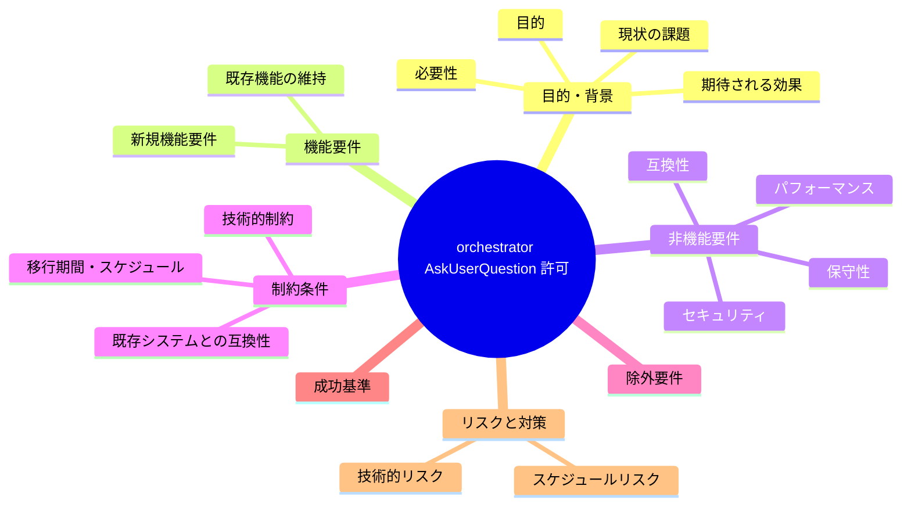
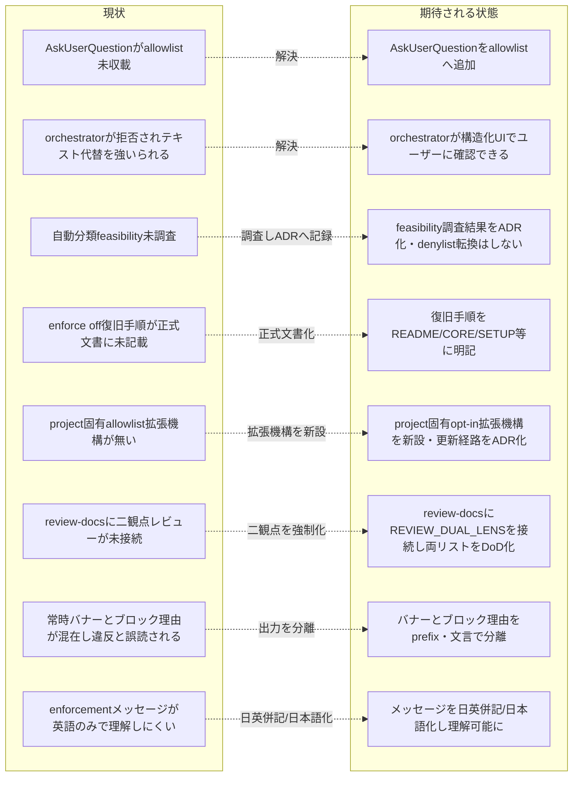

# 要求定義書: orchestrator AskUserQuestion 許可

**プロジェクト名**: orchestrator AskUserQuestion 許可
**作成日**: 2026 年 07 月 13 日
**最終更新**: 2026 年 07 月 14 日

> **重要**:
>
> - 要求定義書は、プロジェクトの全体像を把握するためのものです。詳細な技術仕様や実装方法は要件定義書以降で記載します。必要最低限の情報に収めることを心掛けてください。
> - **このドキュメントは常に更新**: 要求の変更や追加があった場合は、即座にこのドキュメントを更新してください。ドキュメントは「生きているドキュメント」として扱い、実装内容と常に同期させます。
> - **必須項目**: 以下の「必須」と明記した項目は空欄・抽象語のみ（例: 「{説明}」のまま）で提出しないこと。判定可能な形（目的は1文・成功基準は○/×で判定できる記載等）で記入すること。
>
> **用語**: [.agent-skill-chain/source/CONCEPTS.md §用語規約](../../../../.agent-skill-chain/source/CONCEPTS.md#用語規約) を参照。

---

## 要求定義の全体像

**注意**:

- 上記の「プロジェクト名」は例です。実際のプロジェクト名に置き換えてください。
- マインドマップは全体像を把握するためのものです。主要なセクション名程度に留め、詳細は記載しないでください。

---

## 1. 目的・背景

### 1.1 目的（必須）

orchestrator が `AskUserQuestion` を allowlist 経由で安全に使えるようにした上で、allowlist 方式そのものの保守性・拡張性を高める（denylist 方式への全面転換はしない）。加えて、実装前ドキュメントレビュー（`review-docs`）にも敵対的＋肯定的の二観点レビューを強制化する。さらに、enforcement フックが出力するメッセージの**可読性**（常時表示の案内と実際の違反理由の混同解消・日本語での理解可能性）を改善する。具体的には次の 7 点を達成する。

1. `AskUserQuestion` を PreToolUse フックの orchestrator allowlist に追加する（即時修正）。
2. allowlist 方式を維持したまま、ツールの性質（読み取り専用・非破壊か）に基づく自動分類が feasible かを設計フェーズで調査し、結論を ADR として記録する。
3. `enforce off` によるロックアウト復旧手順を正式ドキュメントに明記する。
4. `.agent-skill-chain/project/` 層に、orchestrator allowlist へのプロジェクト固有 opt-in 追加を可能にする拡張機構を新設し、その更新経路（人間の関与点）を設計判断として ADR 化する。
5. `commands/review-docs.md`（実装前の 00-03 ドキュメントレビュー）に `REVIEW_DUAL_LENS.md`（敵対的観点＋肯定的 must-preserve 観点の両立必須化）を接続し、二観点の両リスト記載をレビュー完了条件（DoD）として強制化する。
6. `PreToolUse.sh` が**毎回**出力する常時バナー（案内）と、実際の許可/拒否判定の**ブロック理由**を、出力上で明確に区別できるようにする（バナーが「4 つの規則を破った」と誤読される問題の解消）。挙動（exit code 等）は変更しない。
7. enforcement のフック/CI が出力するユーザー向けメッセージを、英語だけでなく日本語でも理解できるようにする（日英併記/日本語化の方式は 02_設計で ADR 化）。`PreToolUse.sh` を確実に本 issue の範囲に含め、他ファイルの範囲は 02_設計の規模判断で線引きする。

### 1.2 背景

- **現状の課題**:
  - 消費者プロジェクト（NEXUS 案件）で orchestrator が `AskUserQuestion` を呼び出した際、PreToolUse フックの orchestrator allowlist に該当ツール名が無く `exit 2` で拒否され、orchestrator がユーザーへの確認をテキスト代替せざるを得なかった（evidence_source: repo_file, `.agent-skill-chain/source/enforcement/claude/PreToolUse.sh:189` の case 文に `AskUserQuestion` が未収載であることを実読で確認）。
  - 同種の allowlist 未追従による自己ロックアウトは過去にも `Agent` ツール名で発生済みで、`Task` 名のみ許可していたため実ハーネスの委譲ツール実名 `Agent` が拒否され、orchestrator が委譲手段ごとロックアウトされた（evidence_source: repo_file, コミット `4358a0f`「enforcement: orchestrator allowlist に委譲ツール実名 Agent を追加（自己ロックアウト事故の恒久修正）」および `PreToolUse.sh:181-183` の恒久注記を実読で確認）。この事故の復旧手段は `!` 付き `enforce off` のみであった（evidence_source: memory_note, ユーザー・進行役からの過去インシデント報告）。
  - allowlist（許可リスト）方式は、Claude Code 等ハーネス側の組み込みツール追加（`Agent`、`AskUserQuestion` 等）に対して構造的に追従が遅れ、同種のロックアウトが繰り返し再発するリスクを内包している（evidence_source: repo_file, `PreToolUse.sh:179` コメント「許可ツールのみ（allowlist）。それ以外は拒否」および `:199` 「未知のツールは orchestrator には許可しない（許可リスト方式）」を実読で確認）。
  - `enforce off` によるロックアウト復旧手順は、`.agent-skill-chain/source/README.md`・`boot/CORE.md`・`SETUP.md` のいずれにも明文化されておらず、既存の本ドキュメント（1.2 の上記記述）でも「evidence_source: memory_note（記憶ベース）」としてのみ記録されていることが調査で判明した（evidence_source: repo_file, `README.md`/`boot/CORE.md`/`SETUP.md` を `enforce off`・ロックアウト・復旧関連キーワードで実読横断検索した結果、`SETUP.md:103-122` に `enforce on/off` コマンド自体の説明はあるが、**ロックアウト時の復旧手順**（`!` プレフィックス付き raw bash 経由での迂回）についての記述は 3 ファイルいずれにも存在しないことを確認）。この復旧手順が正式仕様書のどこにも記録されていない状態は、同種事故発生時に再発見コストを毎回払うリスクを生む。
  - `.agent-skill-chain/project/` 層は、本リポジトリでは既に issue 作成場所の上書き（`自己拡張ワークフロー.md`）等でプロジェクト固有ルールの opt-in 上書き機構として利用されている先例がある（evidence_source: repo_file, `.agent-skill-chain/project/README.md` §優先順位「`.agent-skill-chain/project/` 配下のルールが `.agent-skill-chain/source/` のルールより優先される」および `自己拡張ワークフロー.md` §issue の作成場所（標準フローの上書き）を実読で確認）。この既存パターンを orchestrator allowlist の拡張にも適用できる可能性がある。
  - `.agent-skill-chain/source/REVIEW_DUAL_LENS.md` は「すべてのレビューに敵対的観点（反証・破壊）と肯定的観点（must-preserve=不変条件の同定）の両立を必須化し、両リストを記載しないレビューを未完了と定義する」と定めている（evidence_source: repo_file, `REVIEW_DUAL_LENS.md:7`・`:29-31` を実読で確認）。しかし本ルールは実装完了後の `skills/review/review-code`・`skills/review/review-architecture`（`verify-and-close` 経由・04_review への出力）にのみ接続されており、実装前の 00-03 レビューを担う `commands/review-docs.md` には接続されていない（evidence_source: repo_file, `review-code/SKILL.md:29,34`・`review-architecture/SKILL.md:27,32` は `REVIEW_DUAL_LENS.md` を参照するが、`commands/review-docs.md` は `RULES.md`・`PHASES.md` の監査観点への準拠としか記載されず `REVIEW_DUAL_LENS.md` への参照が全く無いことを実読で確認）。その結果 `review-docs` の DoD は「既知の指摘が 0 件」であることのみを求め（evidence_source: repo_file, `review-docs.md:49` を実読で確認）、敵対的に反証を試みたか・壊してはならない不変条件（must-preserve）を同定したかが証跡上担保されない。
  - 機械強制の面でも、04_review に対する両リスト構造チェック（`enforcement/ci/audit.sh` の check #27＝「敵対的観点」「must-preserve/不変条件」の両方が無ければ FAIL）は存在するが、`review-docs` の成果物に対する同等チェックは無い（evidence_source: repo_file, `audit.sh:58,772-` の #27 が対象とするのは Git 差分で変更された `04_review.md` のみであることを実読で確認）。
  - `PreToolUse.sh` は、`AGENTS_ROOT/boot/CORE.md` が存在すれば**ツール呼び出しの種類やブロック有無に関わらず毎回**、3 行の固定バナー（「Ensure you have read...」「Main (orchestrator) must NOT do real work...」「Evidence: workflow.db via write-workflow-log.sh only...」）を stderr に出す（evidence_source: repo_file, `PreToolUse.sh:156-160` を実読で確認）。一方、実際の許可/拒否判定の理由は `block()` 関数が出す `[enforcement] ERROR: <理由>` の 1 行のみである（evidence_source: repo_file, `PreToolUse.sh:24-28` を実読で確認）。この 2 つが同じ stderr ストリームに、いずれも `[PreToolUse]`/`[enforcement]` という似た体裁の prefix で混在出力されるため、ユーザー・orchestrator から見て「（常時案内である）バナーの規則を破った」ように誤読される（evidence_source: human_decision, 本セッションでユーザーが実際に「4 つの規則を破った」と混乱した実例あり）。
  - enforcement のフック/CI が出力するユーザー向けメッセージは英語が主である（evidence_source: repo_file, `PreToolUse.sh` の `block()` 各理由＝`orchestrator cannot run Bash`・`orchestrator must never modify files...`・`sqlite3 direct execution forbidden` 等、`PostToolUse.sh:18` の `workflow.db is canonical...` バナー、`audit.sh` の `echo "FAIL: ..."` 26 箇所を実読で確認）。日本語話者の利用者にとって、エラー時に英語のみだと違反内容が直感的に読み取りにくい（evidence_source: human_decision, ユーザーが「エラー時に英語だとよくわからない」「できることなら日本語でメッセージを記載してほしい」と明示要望）。

- **必要性**:
  - orchestrator が実作業（コード/00-04 直接編集）をせずにユーザーへ確認したい場面（起票要否・仕様の曖昧点の確認等）で、テキスト代替ではなく `AskUserQuestion` の構造化された選択肢 UI を使えることが望ましい。
  - CORE.md §メインエージェントがやってはいけないこと（`.agent-skill-chain/source/boot/CORE.md:61-74`）が禁止するのは「ファイル作成・編集・コード実装・設計本文記述・レビュー本文記述・テスト作成・コマンド実行」であり、読み取り専用・非破壊のユーザー対話ツールはこの列挙に含まれない（evidence_source: repo_file, 実読で確認）。
  - allowlist への個別追加という対症療法を繰り返すだけでなく、ツールの性質（読み取り専用・非破壊か）に基づく自動分類が feasible であれば、将来の同種ハーネス組み込みツール追加時に個別追加を要さず安全側に倒れる設計にできる可能性がある。ただし denylist（変更系ツールのみを拒否する）方式への全面転換は、ユーザーとの往復で明示的に却下されており、本 issue では採用しない（evidence_source: human_decision, ユーザーとのやり取りで「基本は allowlist のままでよい」と明示的に確定）。
  - 実装前の 00-03 ドキュメントレビューは、実装完了後の 04_review レビューと同様に「壊してはならない不変条件（must-preserve）の見落としによる churn/退行」と「反証不足による欠陥見逃し」の両リスクを負う。したがって `REVIEW_DUAL_LENS.md` の二観点必須化を、実装後レビュー（review-code/review-architecture）だけでなく実装前レビュー（review-docs）にも適用し、レビュー品質のばらつきを構造的に無くすことが望ましい（evidence_source: human_decision, ユーザーが「敵対的＋肯定的の両視点レビューを review-docs に対しても必須化・強制化してほしい」と明示指示）。
  - enforcement フックの出力が「常時案内」と「実際の違反理由」を区別できず、かつ英語のみだと、orchestrator・ユーザーが違反有無を誤判断し、不要な混乱・往復コストが生じる。フックの**挙動を変えずに出力の可読性のみ**を改善すれば、既存の強制ロジック・テストを壊さずに運用体験を改善できる（evidence_source: human_decision, ユーザー実体験の混乱＋日本語化要望）。

### 1.3 期待される効果（必須: 1 件以上）

- **効果 1**: orchestrator が `AskUserQuestion` を呼び出しても PreToolUse フックに拒否されなくなる（`.claude/hooks/PreToolUse.sh` 生成後の隔離環境検証で `AskUserQuestion` 呼び出しが `exit 0` になることで判定可能）。
- **効果 2**: 既存の禁止（Bash・Edit・Write 等の変更系ツールの拒否）が引き続き維持される（隔離環境検証で `Bash`/`Edit`/`Write` が引き続き `exit 2` になることで判定可能）。
- **効果 3**: メタデータベース自動分類の feasibility が調査され、結論（採用/見送り）が evidence_source 付きの ADR として 02_設計に記録される（denylist 全面転換は採用しない前提の下での限定調査）。
- **効果 4**: `enforce off` によるロックアウト復旧手順が、README.md・CORE.md・SETUP.md 等の正式仕様書のいずれかに明文化され、以後 memory_note のみに依存しなくなる。
- **効果 5**: `.agent-skill-chain/project/` 層に orchestrator allowlist へのプロジェクト固有 opt-in 拡張機構が新設され、その存在と使い方が README 等に記載される。
- **効果 6**: 上記拡張機構の更新経路（誰が・どうやって・どの人間関与点を経て allowlist に項目を追加できるか）が、orchestrator 自身による無制限な自己拡張（権限昇格）を防ぐ設計として ADR 化される。
- **効果 7**: `commands/review-docs.md` が `REVIEW_DUAL_LENS.md` を参照し、実装前ドキュメントレビューでも「敵対的観点リスト」と「must-preserve リスト」の両方を成果物（memo または 00-03 自体）へ記載することが DoD として強制される（review-docs.md の Process・Outputs・Done に両リスト記載が明記され、`review-code`/`review-architecture` と同じ二観点必須化ルールと整合していることで判定可能）。
- **効果 8**: `PreToolUse.sh` の常時バナー（案内）と実際のブロック理由が、出力 prefix・文言で明確に区別され、ユーザー・orchestrator がバナーを「違反」と誤読しなくなる（バナーには「常時表示の案内であり違反ではない」ことが分かる prefix/文言が付き、ブロック理由には違反であることが分かる prefix が付いていることで判定可能。exit code は不変）。
- **効果 9**: enforcement の対象範囲（少なくとも `PreToolUse.sh`。他ファイルは 02_設計の線引きに従う）のユーザー向けメッセージが日本語でも理解できるようになり、日本語話者の利用者がエラー時の違反内容を直感的に読み取れる（対象メッセージに日本語が併記/日本語化されていることで判定可能）。

**現状と期待される状態の比較**:

---

## 2. 機能要件

### 2.1 既存機能の維持（該当する場合）

- PreToolUse フックの orchestrator allowlist が持つ既存の拒否機能（Bash 実行禁止、Edit/Write/Delete 等の変更系ツール禁止）は維持する。
- allowlist に既に含まれる `Read, Grep, Glob, LS, list_dir, Task, Agent, mcp_task, ReadLints, fetch_mcp_resource, list_mcp_resources` の許可状態は維持する（evidence_source: repo_file, `PreToolUse.sh:189` 実読）。

### 2.2 新規機能要件

- **FR-1（AskUserQuestion 追加・即時修正）**: `.agent-skill-chain/source/enforcement/claude/PreToolUse.sh` の R2 orchestrator allowlist（`case "$TOOL" in ... )` 分岐）に `AskUserQuestion` を許可ツールとして追加する（配布物側の定義修正。消費先プロジェクトへは `upgrade` 等で反映される想定）。
  - 追加にあたり、`AskUserQuestion` が「読み取り専用・非破壊のユーザー対話ツールであり、orchestrator の『実作業をしない』原則に抵触しない」旨の判断根拠をコメントとして残す（`Agent` 追加時の先例＝`PreToolUse.sh:181-183` の注記パターンに倣う）。

- **FR-2（メタデータベース自動分類の feasibility 検討・限定調査）**: allowlist 方式は維持したまま、「ツール名の固定リスト一致」ではなく「ツールの性質（読み取り専用・非破壊か）」に基づく自動分類が feasible かを 02_設計で検討する。
  - Claude Code の PreToolUse フックに渡る stdin JSON ペイロード（`tool_name`/`tool_input` 等）に、読み取り専用等を示すメタデータ（annotation、例えば MCP ツール仕様の `readOnlyHint` 相当）が含まれているかを調査する。
  - 含まれていれば、「新しい読み取り専用ツールは名前を個別追加しなくても自動的に安全側に倒れる」設計を検討する。
  - 含まれていなければ、「feasibility 不可」と ADR に明記し、この案は見送る。
  - いずれの結論であっても、denylist（変更系ツールのみを拒否する方式）への全面転換は行わず、fail-closed（未知ツールはデフォルト拒否）のデフォルトを維持する。

- **FR-3（enforce off ロックアウト復旧手順の正式文書化）**: `enforce off` によるロックアウト復旧手順（PreToolUse フックに orchestrator がロックアウトされた場合、`!` プレフィックス付きの raw bash 経由で `enforce off` 相当のコマンドを実行し、ツール呼び出しループと hooks を迂回して解除する手順、およびその機構的な理由）を、README.md・CORE.md・SETUP.md 等の適切な正式ドキュメントに明記する。

- **FR-4（project 固有 allowlist 拡張機構の新設）**: `.agent-skill-chain/project/` 層に、orchestrator の許可ツールリスト（allowlist）へプロジェクト固有の追加項目を明示的に opt-in で定義できる拡張機構を新設する。
  - fail-closed のデフォルト（コア側 `.agent-skill-chain/source/` の allowlist）は変更しない。何も設定しなければ従来通り厳格なまま。
  - 拡張機構の存在・使い方を README 等に記載する。
  - この拡張機構は Claude Code 経由（通常の command chain・setup/upgrade 等の仕組み）で更新できるようにする。ただし orchestrator 自身が自分の許可リストを無制限に自己拡張できてしまうと権限昇格になるため、更新経路（人間の関与点をどこに置くか）は 02_設計フェーズで ADR 化し、既存の orchestrator 委譲原則（サブエージェント委譲＋人間レビュー可能な形＝PR 等）と整合する設計とする。

- **FR-5（review-docs への二観点レビュー強制化）**: `.agent-skill-chain/source/commands/review-docs.md`（実装前の 00-03 ドキュメントレビュー）を改修し、`skills/review/review-code`・`skills/review/review-architecture` と同様に `REVIEW_DUAL_LENS.md` への参照を明記し、レビュー＋修正ループの中で「敵対的観点リスト」（反証・破壊を試みた観点と結論）と「肯定的（must-preserve=不変条件）リスト」の**両方**を成果物（review-docs の memo、または 00-03 ドキュメント自体）に記載することを DoD に追加する。
  - 現状の「既知の指摘が 0 件」という DoD だけでは、敵対的に反証を試みたか・壊してはならない不変条件を同定したかが担保されないため、二観点の両リスト記載を追加要件とする。
  - 影響範囲は `commands/review-docs.md` の Process・Outputs・Done（DoD）各セクション。`REVIEW_DUAL_LENS.md` の形式（敵対的観点リスト・must-preserve リストの両方が無いレビューは未完了、というルール）と整合させる。
  - 機械強制（`enforcement/ci/audit.sh` 等）の要否は 02_設計で ADR 化する（実装可能な範囲で。無理に大きくしない）。
  - `REVIEW_DUAL_LENS.md` は既存レビュー骨格へ直交追加する正本であり、本 FR-5 はその正本の定義自体を変えず、`review-docs` を新たな適用先として接続するのみとする（正本の二重定義はしない）。

- **FR-6（PreToolUse の常時バナーとブロック理由の出力分離）**: `.agent-skill-chain/source/enforcement/claude/PreToolUse.sh` の `:156-160` が出す**常時バナー**（案内・毎回表示）と、`block()`（`:24-28`）が出す**実際のブロック理由**を、出力上で明確に区別できるようにする。
  - バナーには「常に表示される案内であり違反ではない」ことが分かる prefix・文言を付ける（例: `[PreToolUse:info]` 等）。ブロック理由には「これが実際の違反である」ことが分かる prefix を付ける（例: `[enforcement:block]` 等）。
  - 目的は、バナー（常時案内）が「規則を破った」と誤読される問題（本セッションで実際にユーザーが混乱した実例あり）の解消。
  - **挙動（exit code・許可/拒否判定・強制ロジック）は一切変更しない**。変更は stderr 出力の prefix・文言（可読性）に限定する。

- **FR-7（enforcement メッセージの日本語化/日英併記）**: enforcement のフック/CI が出力するユーザー向けメッセージを、日本語話者が理解できる形にする。
  - 完全日本語化か日英併記（バイリンガル）かは 02_設計で ADR 化する。判断に際しては、消費者プロジェクトが日本語話者とは限らないため後方互換性・国際化の観点を考慮し、evidence_source を付ける。
  - **対象範囲の線引き**: `PreToolUse.sh`（FR-6 のバナー・block 理由を含む）は確実に本 issue の範囲に含める。`.agent-skill-chain/source/enforcement/` 配下の他の hook スクリプト・CI 用 `audit.sh`（`enforcement/ci/audit.sh`）等の範囲は、規模・feasibility を 02_設計で判断し「本 issue で実施する範囲」と「後続 issue に送る範囲」を明確に線引きしてよい。
  - まず対象ファイル一覧（ユーザー向けメッセージ文字列を出力している箇所）を洗い出したうえで、02_設計で範囲を確定する。

---

## 3. 非機能要件

### 3.1 パフォーマンス

- 該当なし（allowlist への 1 ツール名追加であり、PreToolUse フックの実行性能に有意な影響を与えない）。

### 3.2 セキュリティ

- `AskUserQuestion` を許可しても、変更系ツール（Edit/Write/Bash 等）の拒否は緩めない。allowlist 方式の「明示的に許可したツールのみ通す」という安全側の設計は維持する。
- メタデータベース自動分類（FR-2）を採用する場合でも、fail-closed（メタデータが無い・不明なツールはデフォルト拒否）の原則は崩さない。
- project 固有 allowlist 拡張機構（FR-4）は、orchestrator が自身の許可リストを無制限に自己拡張できる経路にしてはならない。更新経路には人間の関与点（レビュー可能な形＝PR 等）を設計上必ず置く。

### 3.3 互換性

- 既存の消費先プロジェクト（NEXUS 案件等）に対しては `upgrade` 等の配布更新を通じて反映される。本 issue 単体で消費先へ即時反映するものではない。

### 3.4 保守性

- allowlist 未追従によるロックアウトの再発を減らす観点から、本対応のコメントに「ハーネス組み込みツールの追加時は同種の allowlist 追従漏れが起こりうる」旨を明記し、将来の同種対応の判断材料とする。
- `enforce off` によるロックアウト復旧手順を正式ドキュメント化することで、同種事故発生時に memory_note のみに依存した再発見コストを不要にする。
- project 固有 allowlist 拡張機構を新設することで、消費先プロジェクトごとの個別事情（社内ツール等）への追従を、コア側（`.agent-skill-chain/source/`）の変更なしに行えるようにする。

---

## 4. 制約条件

### 4.1 技術的制約

- 修正対象は `.agent-skill-chain/source/enforcement/claude/PreToolUse.sh`（配布物・正本）であり、`.claude/hooks/PreToolUse.sh`（本リポジトリのローカル生成物、`.gitignore` 対象）への直接編集はスコープ外とする（正本を直さないと再生成・配布の度に消えるため）。
- FR-2（メタデータベース自動分類）は feasibility 検討にとどめ、02_設計での調査結果次第では設計・実装を見送る（採否は調査結果に従う。denylist 全面転換の代替として無理に採用しない）。
- FR-4（project 固有 allowlist 拡張機構）のコア側デフォルト（`.agent-skill-chain/source/` の fail-closed allowlist）は変更しない。拡張は `.agent-skill-chain/project/` 層への opt-in 追加としてのみ成立させる。
- FR-5（review-docs への二観点強制化）は `REVIEW_DUAL_LENS.md` 正本の定義を変更せず、`commands/review-docs.md` 側への参照追記・DoD 追加を主とする。`REVIEW_DUAL_LENS.md` 側の変更は必要最小（review-docs を適用先として明示する軽微な参照追記）にとどめる。機械強制の追加（audit.sh 等）は feasibility を 02_設計で判断し、無理に大きくしない。

### 4.2 既存システムとの互換性

- 既存の禁止分岐（`Bash` 明示拒否、`Edit|Write|Delete|StrReplace|Shell|TodoWrite|EditNotebook|call_mcp_tool|GenerateImage` 拒否、`*)` のデフォルト拒否）の構造は変更しない。`AskUserQuestion` を許可 case の列挙に 1 件追加するのみとする（FR-1）。
- FR-4 の拡張機構は、既存の `.agent-skill-chain/project/` 優先順位パターン（`.agent-skill-chain/project/README.md` §優先順位）と整合させ、新たな優先順位ルールを別途持ち込まない。

### 4.3 移行期間・スケジュール

- FR-1 は即時反映可能な小規模修正。FR-2〜FR-4 は 02_設計での ADR 記録・設計判断を経てから実装着手する。

---

## 5. 除外要件

- **allowlist 方式から denylist 方式（変更系ツールのみを拒否する方式）への全面転換は行わない**（ユーザー明示却下。evidence_source: human_decision）。FR-2 のメタデータベース自動分類は、allowlist 方式を維持したままの限定的な自動化検討であり、denylist への転換とは異なる。
- `.claude/hooks/PreToolUse.sh`（配布後のローカル生成物）自体の直接書き換えは対象外（正本修正 → 配布/upgrade で反映される経路に従う）。
- Cursor 向け enforcement 定義（`.agent-skill-chain/source/enforcement/cursor/agents-core.mdc`）への同等追従要否は、本 issue の一次スコープ外とし、必要なら別途確認する。
- FR-2 の feasibility 調査で「不可」と判明した場合、メタデータベース自動分類の実装そのものも本 issue のスコープ外とする（ADR に見送りとして明記するのみ）。
- FR-6 は**出力（stderr の prefix・文言）の可読性改善のみ**を対象とし、フックの挙動（exit code・許可/拒否判定・強制ロジック）の変更はスコープ外とする。
- FR-7 の日本語化/日英併記は、02_設計で「後続 issue に送る」と線引きした対象ファイル（例: `audit.sh` 等の大規模箇所）については本 issue のスコープ外とする（`PreToolUse.sh` は必ず本 issue の範囲に含める）。enforcement メッセージ以外（コード内部コメント・ドキュメント本文等）の日本語化は対象外。

---

## 6. 成功基準（必須: 1 件以上）

- **FR-1**: `.agent-skill-chain/source/enforcement/claude/PreToolUse.sh` の R2 orchestrator allowlist の case 列挙に `AskUserQuestion` が追加されている。隔離環境（本リポ本体には `enforce on` しない）での検証で、orchestrator ロールから `AskUserQuestion` 呼び出しが `exit 0`（許可）になり、`Bash`/`Edit`/`Write` は引き続き `exit 2`（拒否）になる。既存のテスト（`test/test-pretooluse-hook.sh` 等）に `AskUserQuestion` 許可のケースが追加され、既存ケースを含めてすべて PASS する。
- **FR-2**: メタデータベース自動分類のフィジビリティ調査結果と結論（採用/見送り）が、evidence_source 付きの ADR として 02_設計に記録されている。denylist 全面転換は採用されていないことが成果物から確認できる。
- **FR-3**: `enforce off` によるロックアウト復旧手順（`!` プレフィックス経由での迂回手順とその機構的理由）が README.md・CORE.md・SETUP.md のいずれか適切な箇所に明記されている。
- **FR-4**: `.agent-skill-chain/project/` 層に orchestrator allowlist へのプロジェクト固有 opt-in 拡張機構が存在し、README 等に記載されている。当該拡張機構の更新経路（人間の関与点の設計）が evidence_source 付きの ADR として記録されている。
- **FR-5**: `.agent-skill-chain/source/commands/review-docs.md` の Process・Outputs・Done に `REVIEW_DUAL_LENS.md` への参照と「敵対的観点リスト」「must-preserve リスト」の両方の記載義務が明記されている。両リストのいずれかが欠落したレビューは未完了とする旨（`REVIEW_DUAL_LENS.md` §3 と整合）が DoD に含まれている。機械強制の要否と結論（採用/見送り）が evidence_source 付きの ADR として 02_設計に記録されている。
- **FR-6**: `PreToolUse.sh` の常時バナー（`:156-160`）とブロック理由（`block()`・`:24-28`）が、出力 prefix・文言で区別される（バナーは「常時案内・非違反」が分かる prefix/文言、ブロック理由は「違反」が分かる prefix）。exit code・許可/拒否判定は変更前と同一である（`test/test-pretooluse-hook.sh` の既存 exit code アサーションが全て PASS のまま）。
- **FR-7**: 少なくとも `PreToolUse.sh`（バナー・block 理由）の enforcement メッセージが日本語でも理解できる（日英併記または日本語化）。日英併記/日本語化のいずれを採るかと、対象ファイルの本 issue 範囲/後続送りの線引きが、evidence_source 付きの ADR として 02_設計に記録されている。既存の `test/test-pretooluse-hook.sh` の文字列アサーション（`assert_grep`）が壊れない方式であること（壊れる場合はテストの更新も本 issue の成果物に含む）。
- denylist 化などの大きい方式転換は、本 issue の成果物のどこにも「採用した」と記載されていない（除外要件の確認基準）。

---

## 7. リスクと対策

### 7.1 技術的リスク

- **リスク 1**: allowlist への個別追加を繰り返す対症療法だけでは、今後も新しいハーネス組み込みツール（`AskUserQuestion` 以外にも将来追加されうるもの）が登場するたびに同種のロックアウトが再発しうる（evidence_source: repo_file, `Agent` 追加時のインシデント＝コミット `4358a0f` が同型の事故として実在することを実読で確認）。
  - **対策**: FR-1 で allowlist への個別追加により早期是正しつつ、FR-2 でメタデータベース自動分類の feasibility を調査し、feasible であれば恒久対応の選択肢として設計する（denylist 全面転換はしない）。
- **リスク 2**: メタデータベース自動分類（FR-2）の feasibility 調査が「不可」という結論になった場合、恒久対応が得られず allowlist への個別追加という対症療法に依存し続けることになる。
  - **対策**: その場合でも FR-3（復旧手順の文書化）と FR-4（project 固有拡張機構）により、ロックアウト時の回復可能性とプロジェクト側での即応性を確保し、リスクを軽減する。
- **リスク 3**: FR-4 の project 固有 allowlist 拡張機構が、orchestrator 自身による無制限な自己拡張（権限昇格）の抜け穴になりうる。
  - **対策**: 更新経路に人間の関与点（PR 等のレビュー可能な形）を必須とする設計を 02_設計で ADR 化し、orchestrator 単独では拡張を完結できないようにする。
- **リスク 4（FR-6/FR-7）**: `PreToolUse.sh`・`PostToolUse.sh` のメッセージ文字列を変更すると、`test/test-pretooluse-hook.sh` が `assert_grep` で依存している英語部分文字列（`orchestrator must never modify files`・`sqlite3 direct execution forbidden`・`orchestrator cannot run Bash`・`only scribe may run Bash`・`compound shell command forbidden`・`direct edit of .agent-skill-chain/runtime/ is forbidden`・`workflow.db is canonical` 等）が壊れ、既存テストが FAIL しうる（evidence_source: repo_file, `test/test-pretooluse-hook.sh:154,200,226,290,300,321,331,394,511,561` を実読で確認）。
  - **対策**: 日英併記（英語部分文字列を先頭に維持し日本語を併記）を採ることで既存の英語アサーションを保全する方針を 02_設計 ADR で第一候補とする。完全日本語化を採る場合は該当アサーションの更新を本 issue の成果物に必ず含める。FR-6 の prefix 変更（`[PreToolUse]`→`[PreToolUse:info]` 等）については、テストが prefix を assert していないことを実装前に確認する（現状 prefix を assert する箇所は無いことを確認済み）。

### 7.2 スケジュールリスク

- **リスク**: FR-2 の feasibility 調査（外部ハーネス仕様の確認を伴う）に時間を要し、FR-1（即時修正）の反映が遅れる可能性がある。
  - **対策**: FR-1 は FR-2〜FR-4 の調査・設計と独立して先行実装可能なため、実装計画（03）では FR-1 を優先度最高で先行させる。

---

## 8. 参考資料

### プロジェクトドキュメント

- [`.agent-skill-chain/source/enforcement/claude/PreToolUse.sh`](../../../../.agent-skill-chain/source/enforcement/claude/PreToolUse.sh) — 修正対象の orchestrator allowlist 実装（`:179-203`）。
- [`.agent-skill-chain/source/enforcement/README.md`](../../../../.agent-skill-chain/source/enforcement/README.md) — enforcement 4層構成の正本。
- [`.agent-skill-chain/source/boot/CORE.md`](../../../../.agent-skill-chain/source/boot/CORE.md) — orchestrator の禁止事項一覧（§メインエージェントがやってはいけないこと）。
- [`.agent-skill-chain/source/SETUP.md`](../../../../.agent-skill-chain/source/SETUP.md) — `enforce on/off` コマンドの説明（`:103-122`）。ロックアウト復旧手順は本 issue 時点で未記載（FR-3 の対象）。
- [`.agent-skill-chain/project/README.md`](../../../../.agent-skill-chain/project/README.md) — `.agent-skill-chain/project/` 層の優先順位・opt-in 上書きパターンの先例（FR-4 が踏襲する既存パターン）。
- [`.agent-skill-chain/source/REVIEW_DUAL_LENS.md`](../../../../.agent-skill-chain/source/REVIEW_DUAL_LENS.md) — 二観点（敵対的＋肯定的 must-preserve）レビューの必須化の正本（`:7`・`:29-31`）。FR-5 が review-docs へ接続する対象ルール。
- [`.agent-skill-chain/source/commands/review-docs.md`](../../../../.agent-skill-chain/source/commands/review-docs.md) — 実装前ドキュメントレビュー command（FR-5 の改修対象。現状 DoD は「指摘 0 件」のみ＝`:49`）。
- [`.agent-skill-chain/source/skills/review/review-code/SKILL.md`](../../../../.agent-skill-chain/source/skills/review/review-code/SKILL.md)（`:29,34`）・[`review-architecture/SKILL.md`](../../../../.agent-skill-chain/source/skills/review/review-architecture/SKILL.md)（`:27,32`） — 二観点必須化の既存接続例（FR-5 が review-docs で踏襲する参照パターン）。
- [`.agent-skill-chain/source/enforcement/ci/audit.sh`](../../../../.agent-skill-chain/source/enforcement/ci/audit.sh)（check #27・`:58,772-`） — 04_review 両リスト構造チェックの既存機械強制（FR-5 の機械強制 feasibility 検討の参照点）。
- 過去の同型インシデントの恒久修正コミット: `4358a0f`「enforcement: orchestrator allowlist に委譲ツール実名 Agent を追加（自己ロックアウト事故の恒久修正）」。
- [`.agent-skill-chain/source/enforcement/claude/PreToolUse.sh`](../../../../.agent-skill-chain/source/enforcement/claude/PreToolUse.sh)（常時バナー `:156-160`・`block()` `:24-28`）— FR-6/FR-7 の主対象。
- [`.agent-skill-chain/source/enforcement/claude/PostToolUse.sh`](../../../../.agent-skill-chain/source/enforcement/claude/PostToolUse.sh)（バナー `:18` `workflow.db is canonical...`）— FR-7 の対象（範囲は 02_設計で線引き）。
- [`.agent-skill-chain/source/enforcement/ci/audit.sh`](../../../../.agent-skill-chain/source/enforcement/ci/audit.sh)（`echo "FAIL: ..."` 26 箇所ほか）— FR-7 の対象候補（規模大・CI 経路。範囲は 02_設計で線引き）。
- `test/test-pretooluse-hook.sh`（`assert_grep` が英語部分文字列に依存）— FR-6/FR-7 のテスト影響確認対象。

### その他の参考資料

- ユーザー報告（本 issue 起票の契機）: 別プロジェクト（NEXUS 案件）で orchestrator が `AskUserQuestion` 呼び出し時に PreToolUse フックに拒否された実事象。
- ユーザーとの往復での最終スコープ確定（evidence_source: human_decision）: 「基本は allowlist のままでよい」（denylist 全面転換の却下）／enforce off 復旧手順の正式文書化指示／project 固有 allowlist 拡張機構の Claude Code 経由更新指示。

---

## 9. 次のステップ

この要求定義書の承認後、以下のドキュメントを作成します：

- **次**: [`01_要件定義.md`](./01_要件定義.md) - 要件定義フェーズ
