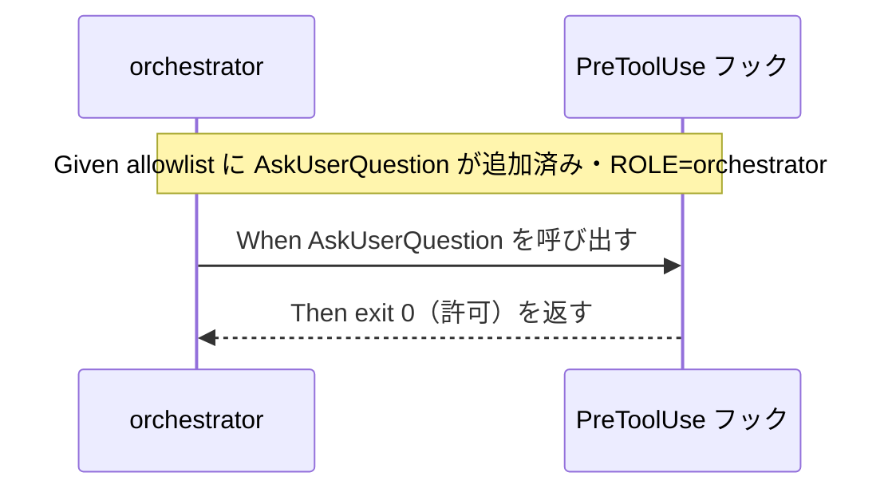

# 要件定義書: orchestrator AskUserQuestion 許可

**プロジェクト名**: orchestrator AskUserQuestion 許可
**作成日**: 2026 年 07 月 13 日
**最終更新**: 2026 年 07 月 14 日

> **重要**: **このドキュメントは常に更新**: 要件の変更や追加があった場合は、即座にこのドキュメントを更新してください。ドキュメントは「生きているドキュメント」として扱い、実装内容と常に同期させます。
>
> **用語**: [.agent-skill-chain/source/CONCEPTS.md §用語規約](../../../../.agent-skill-chain/source/CONCEPTS.md#用語規約) を参照。

---

## 1. 概要

### 1.1 システム概要

`.agent-skill-chain` フレームワークの PreToolUse フック（`.agent-skill-chain/source/enforcement/claude/PreToolUse.sh`）は、orchestrator ロールに対して「読む・検索・委譲」に限定した許可ツールリスト（allowlist）方式でツール使用を制御している。本要件は、次の 5 点を対象とする。

1. この allowlist に `AskUserQuestion`（読み取り専用・非破壊のユーザー対話ツール）を追加し、orchestrator が実作業（コード/00-04 直接編集）を行わずにユーザーへ構造化された確認を行えるようにする。
2. allowlist 方式を維持したまま、ツールの性質（読み取り専用・非破壊か）に基づく自動分類が feasible かを検討し、結論を ADR として記録する（denylist 方式への全面転換はしない）。
3. `enforce off` によるロックアウト復旧手順を正式ドキュメントに明記する。
4. `.agent-skill-chain/project/` 層に、orchestrator allowlist へのプロジェクト固有 opt-in 追加を可能にする拡張機構を新設し、その更新経路を ADR 化する。
5. 実装前ドキュメントレビュー command（`commands/review-docs.md`）に `REVIEW_DUAL_LENS.md`（敵対的＋肯定的の二観点必須化）を接続し、二観点の両リスト記載をレビュー完了条件として強制化する。
6. `PreToolUse.sh` の常時バナー（案内・毎回表示）と実際のブロック理由（`block()`）を、出力 prefix・文言で明確に区別し、バナーが「違反」と誤読される問題を解消する（挙動・exit code は不変）。
7. enforcement のフック/CI が出力するユーザー向けメッセージを日本語でも理解できる形（日英併記/日本語化。方式は 02_設計で ADR 化）にする。`PreToolUse.sh` を確実に本 issue 範囲に含め、他ファイルの範囲は 02_設計で線引きする。

### 1.2 用語集

| 用語 | 説明 |
| --- | --- |
| orchestrator（進行役） | メインエージェント。phase 判定・command 選択・サブエージェントへの委譲のみを行い、実作業は行わない役割（`.agent-skill-chain/source/boot/CORE.md`）。 |
| allowlist（許可リスト）方式 | 明示的に許可したツール名のみ通過させ、それ以外（未知のツール含む）を一律拒否する制御方式（fail-closed）。現行の PreToolUse.sh の R2 分岐が採用し、本 issue でも維持する。 |
| denylist（拒否リスト）方式 | 変更系ツール（Edit/Write/NotebookEdit 等）のみを明示的に拒否し、それ以外を通過させる制御方式。本 issue では**採用しない**（ユーザー明示却下）。 |
| PreToolUse フック | Claude Code 等のハーネスがツール呼び出し前に実行するフック。`.agent-skill-chain/source/enforcement/claude/PreToolUse.sh` が正本、消費先では `.claude/hooks/PreToolUse.sh` として配布される。 |
| AskUserQuestion | Claude Code 等ハーネス組み込みの、ユーザーへ選択肢形式で確認するツール。ファイル変更・コード実行を伴わない。 |
| readOnlyHint 相当のメタデータ | MCP ツール仕様等に見られる、ツールが読み取り専用・非破壊であることを示す annotation。PreToolUse フックの stdin JSON ペイロードに同種のメタデータが含まれるかは 02_設計での調査対象（FR-2）。 |
| enforce off ロックアウト復旧手順 | PreToolUse フックにより orchestrator が全ツールをブロックされた場合に、`!` プレフィックス付きの raw bash 経由で `enforce off` 相当のコマンドを実行し、ツール呼び出しループと hooks を迂回して解除する手順（FR-3 で正式文書化）。 |
| project 固有 allowlist 拡張機構 | `.agent-skill-chain/project/` 層で、コア側 `.agent-skill-chain/source/` の fail-closed デフォルトを変更せずに、orchestrator allowlist へプロジェクト固有の項目を opt-in で追加できる機構（FR-4 で新設）。 |
| 二観点レビュー（REVIEW_DUAL_LENS） | すべてのレビューに敵対的観点（反証・破壊を試み、不確実なら要修正に倒す）と肯定的観点（must-preserve=壊してはならない不変条件の同定）の両立を必須化し、両リストを記載しないレビューを未完了と定義するルール（`REVIEW_DUAL_LENS.md`）。FR-5 で `review-docs` を新たな適用先として接続する。 |
| review-docs | 実装前の 00-03（要求定義・要件定義・設計・実装計画）に対するドキュメントレビュー command（`commands/review-docs.md`）。実装完了後の verify-and-close（04_review）とは別フロー。 |
| 常時バナー（案内） | `PreToolUse.sh:156-160` が `AGENTS_ROOT/boot/CORE.md` 存在時に、ツール呼び出しの種類・ブロック有無に関わらず**毎回** stderr に出す 3 行の固定案内。違反の有無とは無関係に表示される（FR-6 で prefix・文言を「非違反の案内」と分かる形へ変更する対象）。 |
| ブロック理由 | `PreToolUse.sh` の `block()`（`:24-28`）が、実際に契約違反を検出して `exit 2` する際に stderr へ出す `[enforcement] ERROR: <理由>` の 1 行。これが「実際の違反」を示す唯一の出力（FR-6 で常時バナーと区別する対象）。 |
| 日英併記（バイリンガル） | 英語メッセージを残したまま日本語を併記する方式（例: 英語の後に日本語を付す）。完全日本語化との対比で FR-7 の設計選択肢の一つ。既存テストの英語部分文字列アサーションを保全でき、非日本語話者の消費者にも英語が届く。 |

---

## 2. 機能要件

### 2.1 ユーザーストーリー

#### ストーリー 1: orchestrator が AskUserQuestion で確認できる

- **As a** orchestrator（進行役）
- **I want to** `AskUserQuestion` ツールをブロックされずに呼び出したい
- **So that** ユーザーへの確認をテキスト代替せず、構造化された選択肢 UI で行える

**受け入れ基準**:

- orchestrator ロール（`ROLE=orchestrator`、`IS_SUBAGENT!=1`）から `AskUserQuestion` を呼び出したとき、PreToolUse フックが `exit 0`（許可）を返す。
- 上記は `.agent-skill-chain/source/enforcement/claude/PreToolUse.sh` の R2 case 列挙（`:189` 相当行）に `AskUserQuestion` を追加することで実現する。

#### ストーリー 2: 既存の禁止は維持される

- **As a** フレームワーク保守者
- **I want to** `AskUserQuestion` を許可しても orchestrator の実作業禁止原則（Bash/Edit/Write 等の変更系ツール拒否）が緩まないようにしたい
- **So that** 「進行役は実作業をしない」という既存の絶対制約（CORE.md）が損なわれない

**受け入れ基準**:

- `AskUserQuestion` 追加後も、orchestrator ロールからの `Bash` 呼び出しは `exit 2`（`orchestrator cannot run Bash`）で拒否される。
- `AskUserQuestion` 追加後も、orchestrator ロールからの `Edit`/`Write`/`Delete`/`StrReplace`/`Shell`/`TodoWrite`/`EditNotebook`/`call_mcp_tool`/`GenerateImage` の呼び出しは `exit 2`（`orchestrator must never modify files or run write/edit/shell...`）で拒否される。
- `AskUserQuestion` 以外の未知ツールは引き続き `exit 2`（デフォルト拒否 `*)`）で拒否される。

#### ストーリー 3: メタデータベース自動分類の feasibility が調査・記録される

- **As a** フレームワーク保守者
- **I want to** allowlist 方式を維持したまま、ツールの性質（読み取り専用・非破壊か）に基づく自動分類が feasible かを調査したい
- **So that** 将来の同種ハーネス組み込みツール追加時に、個別追加なしで安全側に倒れる設計を検討できる（feasible でなければ見送りを明確にできる）

**受け入れ基準**:

- Claude Code の PreToolUse フックに渡る stdin JSON ペイロード（`tool_name`/`tool_input` 等）に、`readOnlyHint` 相当のメタデータが含まれるかどうかの調査結果が 02_設計に記録されている。
- 含まれる場合は自動分類設計の検討結果、含まれない場合は「feasibility 不可」の結論が、いずれも evidence_source 付きの ADR として記録されている。
- 調査結果によらず、denylist 方式（変更系ツールのみを拒否する方式）への全面転換は採用されない。

#### ストーリー 4: enforce off ロックアウト復旧手順が正式文書化される

- **As a** フレームワーク保守者・利用者
- **I want to** PreToolUse フックによる orchestrator ロックアウト発生時の復旧手順（`!` プレフィックス経由の迂回）を正式ドキュメントで確認したい
- **So that** memory_note のみに依存せず、誰でも復旧手順を参照できる

**受け入れ基準**:

- README.md・CORE.md・SETUP.md のいずれか適切な箇所に、ロックアウト発生時の復旧手順（手順そのものと、`!` プレフィックス付き raw bash がツール呼び出しループと hooks を迂回できる機構的な理由）が明記されている。
- 記載内容は、`.agent-skill-chain/source/enforcement/claude/PreToolUse.sh` の実装（stdin/hooks 経路を通らない raw bash 実行がフックの対象外になること）と整合している。

#### ストーリー 5: project 固有 allowlist 拡張機構が新設される

- **As a** 消費先プロジェクトの保守者
- **I want to** コア側のデフォルトを変更せずに、プロジェクト固有の許可ツールを orchestrator allowlist に opt-in で追加したい
- **So that** プロジェクト固有の安全なツール追加のたびにコア側 `.agent-skill-chain/source/` を直接改変しなくて済む

**受け入れ基準**:

- `.agent-skill-chain/project/` 層に、orchestrator allowlist へのプロジェクト固有追加項目を定義できる機構が存在する。
- 何も設定しない場合、コア側の fail-closed デフォルトが従来通り維持される。
- 拡張機構の存在・使い方が README 等に記載されている。

#### ストーリー 6: project 固有拡張機構の更新経路に人間の関与点がある

- **As a** フレームワーク保守者
- **I want to** project 固有 allowlist 拡張機構が Claude Code 経由（command chain・setup/upgrade 等）で更新できるが、orchestrator が自分自身の許可リストを無制限に自己拡張できないようにしたい
- **So that** 権限昇格（orchestrator が自己の制約を自己判断で緩める）を防ぎつつ、拡張機構の利便性を確保できる

**受け入れ基準**:

- 拡張機構の更新経路（誰が・どの手順で・どの人間関与点を経て allowlist に項目を追加できるか）が、evidence_source 付きの ADR として 02_設計に記録されている。
- ADR は、既存の orchestrator 委譲原則（サブエージェント委譲＋人間レビュー可能な形＝PR 等）と整合する設計になっている。
- orchestrator 単独の判断のみで自己の allowlist を拡張できる設計にはなっていない。

#### ストーリー 7: denylist 方式への全面転換をしないことが確認できる

- **As a** フレームワーク保守者
- **I want to** 本 issue のいずれの成果物からも、allowlist 方式から denylist 方式への全面転換が採用されていないことを確認したい
- **So that** ユーザーが明示的に却下したスコープ外の方式転換が誤って実施されないことを保証できる

**受け入れ基準**:

- 00_要求定義.md・本ドキュメント・02_設計のいずれにも、「denylist 方式への全面転換を採用する」という記述が存在しない。
- 00_要求定義.md の除外要件に、denylist 方式への全面転換を行わない旨（ユーザー明示却下）が明記されている。
- FR-2（メタデータベース自動分類）が feasible と判明した場合でも、その設計は allowlist 方式を維持した上での自動化であり、denylist 方式ではないことが 02_設計で明示される。

#### ストーリー 8: review-docs でも二観点レビューが強制される

- **As a** フレームワーク保守者
- **I want to** 実装前ドキュメントレビュー（`review-docs`）にも、実装後レビュー（review-code/review-architecture）と同じ二観点必須化（`REVIEW_DUAL_LENS.md`）を適用したい
- **So that** 00-03 レビューでも「敵対的に反証を試みたか」「壊してはならない不変条件（must-preserve）を同定したか」が証跡上担保され、churn/退行と欠陥見逃しを同時に防げる

**受け入れ基準**:

- `commands/review-docs.md` の Process・Outputs・Done に `REVIEW_DUAL_LENS.md` への参照が明記されている。
- review-docs のレビュー＋修正ループの成果物（memo、または 00-03 ドキュメント自体）に「敵対的観点リスト」と「must-preserve リスト」の**両方**を記載することが DoD に含まれ、いずれか欠落は未完了とする旨（`REVIEW_DUAL_LENS.md` §3 と整合）が記載されている。
- `review-code`/`review-architecture` の SKILL.md（`REVIEW_DUAL_LENS.md` 参照）と同型の接続になっており、二観点必須化ルールの正本（`REVIEW_DUAL_LENS.md`）を二重定義していない。
- 機械強制（audit.sh 等）の要否と結論（採用/見送り）が evidence_source 付きの ADR として 02_設計に記録されている。

#### ストーリー 9: 常時バナーとブロック理由が区別できる（FR-6）

- **As a** orchestrator・利用者
- **I want to** `PreToolUse.sh` が毎回出す常時バナー（案内）と、実際にツール呼び出しがブロックされた理由とを、出力上で明確に区別したい
- **So that** 常時案内であるバナーを「規則を破った（違反した）」と誤読せず、実際に何がブロックされたのか（あるいは何もブロックされていないのか）を正しく判断できる

**受け入れ基準**:

- `PreToolUse.sh:156-160` の常時バナーには、「常に表示される案内であり違反ではない」ことが分かる prefix・文言が付く（例: `[PreToolUse:info]` 等）。
- `block()`（`:24-28`）が出す実際のブロック理由には、「これが実際の違反である」ことが分かる prefix が付く（例: `[enforcement:block]` 等）。バナーの prefix とは視覚的に区別できる。
- フックの**挙動（exit code・許可/拒否判定・強制ロジック）は変更されない**。`test/test-pretooluse-hook.sh` の既存 exit code アサーションが全て PASS のまま。

#### ストーリー 10: enforcement メッセージが日本語でも理解できる（FR-7）

- **As a** 日本語話者の利用者
- **I want to** enforcement のフック/CI が出すエラー・案内メッセージを日本語でも理解したい
- **So that** エラー時に英語のみで違反内容が読み取りにくい状態を解消できる

**受け入れ基準**:

- 少なくとも `PreToolUse.sh`（常時バナー・block 理由）のユーザー向けメッセージが、日本語でも理解できる（日英併記または日本語化）。
- 日英併記/完全日本語化のいずれを採るか、および対象ファイルの「本 issue 範囲」「後続 issue 送り」の線引きが、evidence_source 付きの ADR として 02_設計に記録されている（後方互換性・国際化を考慮した判断であること）。
- 採用方式が既存 `test/test-pretooluse-hook.sh` の文字列アサーション（`assert_grep`）を壊さない（壊れる場合はテスト更新も本 issue の成果物に含む）。

### 2.2 BDD ユースケース

#### ユースケース 1: orchestrator による AskUserQuestion 呼び出し

orchestrator がユーザーへ確認したい場面（起票要否・仕様の曖昧点等）で `AskUserQuestion` を呼び出す。PreToolUse フックが allowlist 判定を行い、許可/拒否を決定する。

**シナリオ 1: AskUserQuestion は許可される**

```gherkin
Feature: orchestrator の AskUserQuestion 許可
  Scenario: orchestrator ロールが AskUserQuestion を呼び出す
    Given PreToolUse.sh の orchestrator allowlist（R2 case 列挙）に AskUserQuestion が追加されている
    And 呼び出し元のロールが orchestrator（ROLE=orchestrator, IS_SUBAGENT!=1）である
    When orchestrator が AskUserQuestion ツールを呼び出す
    Then PreToolUse フックは exit 0（許可）を返す
```

**処理フロー**（必要に応じて）:



**シナリオ 2: 変更系ツールは引き続き拒否される**

```gherkin
Feature: orchestrator の AskUserQuestion 許可
  Scenario: orchestrator ロールが変更系ツールを呼び出す（回帰確認）
    Given PreToolUse.sh の orchestrator allowlist に AskUserQuestion が追加されている
    And 呼び出し元のロールが orchestrator（ROLE=orchestrator, IS_SUBAGENT!=1）である
    When orchestrator が Edit または Write または Bash ツールを呼び出す
    Then PreToolUse フックは exit 2（拒否）を返す
```

**シナリオ 3: 未知の未許可ツールはデフォルト拒否のままである**

```gherkin
Feature: orchestrator の AskUserQuestion 許可
  Scenario: orchestrator ロールが allowlist 未収載の未知ツールを呼び出す（回帰確認）
    Given PreToolUse.sh の orchestrator allowlist に AskUserQuestion のみが追加されている
    And 呼び出し元のロールが orchestrator（ROLE=orchestrator, IS_SUBAGENT!=1）である
    When orchestrator が allowlist に無い未知のツール名を呼び出す
    Then PreToolUse フックは exit 2（デフォルト拒否 "orchestrator may only use allowed tools..."）を返す
```

#### ユースケース 2: サブエージェント（worker）は本変更の影響を受けない

`AskUserQuestion` の許可は orchestrator ロール（`IS_SUBAGENT!=1`）限定の R2 分岐にのみ追加され、委譲先サブエージェント（`agent_id` あり）の worker 判定（R2 対象外、Edit/Write 等が許可される既存経路）には影響しない。

**シナリオ 1: サブエージェントの既存許可範囲は変わらない**

```gherkin
Feature: サブエージェントへの非影響確認
  Scenario: 委譲先サブエージェント（worker）が Edit/Write を呼び出す
    Given 呼び出し元が委譲先サブエージェント（agent_id あり、IS_SUBAGENT=1）である
    And PreToolUse.sh の orchestrator allowlist（R2）に AskUserQuestion が追加されている
    When サブエージェントが Edit または Write ツールを呼び出す
    Then PreToolUse フックは R2 の対象外として判定し、既存のサブエージェント向け判定ロジックに従う（本変更による拒否の追加は発生しない）
```

#### ユースケース 3: メタデータベース自動分類の feasibility 調査（02_設計）

**シナリオ 1: readOnlyHint 相当メタデータが確認できた場合**

```gherkin
Feature: メタデータベース自動分類の feasibility 調査
  Scenario: PreToolUse フックの stdin JSON に読み取り専用メタデータが含まれる
    Given 02_設計で Claude Code の PreToolUse フック stdin JSON ペイロード仕様を調査した
    And 調査の結果、tool_input 等に readOnlyHint 相当のメタデータが含まれることが external_spec で確認できた
    When 自動分類設計の feasibility を判定する
    Then 「新しい読み取り専用ツールは名前を個別追加しなくても自動的に安全側に倒れる」設計案が ADR として記録される
    And denylist 方式への全面転換は採用されないことが ADR に明記される
```

**シナリオ 2: readOnlyHint 相当メタデータが確認できなかった場合**

```gherkin
Feature: メタデータベース自動分類の feasibility 調査
  Scenario: PreToolUse フックの stdin JSON に読み取り専用メタデータが含まれない
    Given 02_設計で Claude Code の PreToolUse フック stdin JSON ペイロード仕様を調査した
    And 調査の結果、tool_input 等に読み取り専用等を示すメタデータが含まれないことが確認できた（または一次情報に到達できず inference_only にとどまった）
    When 自動分類設計の feasibility を判定する
    Then 「feasibility 不可」の結論が evidence_source 付きの ADR に明記される
    And メタデータベース自動分類の設計・実装は本 issue のスコープから見送られる
    And allowlist への個別追加（FR-1 方式）が引き続き主対応として維持される
```

#### ユースケース 4: enforce off ロックアウト復旧手順の文書化

```gherkin
Feature: enforce off ロックアウト復旧手順の正式文書化
  Scenario: ロックアウト発生時に正式ドキュメントで復旧手順を参照できる
    Given orchestrator が PreToolUse フックにより全ツール呼び出しをブロックされている（ロックアウト状態）
    And README.md・CORE.md・SETUP.md のいずれかに復旧手順が明記されている
    When 利用者が正式ドキュメントを参照する
    Then "!" プレフィックス付き raw bash 経由で enforce off 相当のコマンドを実行することで、ツール呼び出しループと hooks を迂回して解除できる手順が読み取れる
    And その手順がなぜ機構的に有効か（raw bash 実行が PreToolUse フックの対象外経路であること）の説明も読み取れる
```

#### ユースケース 5: project 固有 allowlist 拡張機構の新設と更新経路

**シナリオ 1: 未設定時はコア側デフォルトが維持される**

```gherkin
Feature: project 固有 allowlist 拡張機構
  Scenario: プロジェクト固有拡張が未設定の消費先
    Given `.agent-skill-chain/project/` 層にプロジェクト固有 allowlist 拡張の設定が存在しない
    When orchestrator が allowlist 未収載のツールを呼び出す
    Then PreToolUse フックはコア側 `.agent-skill-chain/source/` の fail-closed デフォルトに従い exit 2（拒否）を返す
```

**シナリオ 2: プロジェクト固有拡張を設定した消費先**

```gherkin
Feature: project 固有 allowlist 拡張機構
  Scenario: プロジェクト固有拡張でツールを opt-in 許可する
    Given `.agent-skill-chain/project/` 層にプロジェクト固有の allowlist 追加項目が定義されている
    When orchestrator がその追加項目に含まれるツールを呼び出す
    Then PreToolUse フックはコア側デフォルトを変更せずに当該ツールを許可する
```

**シナリオ 3: 更新経路に人間の関与点がある**

```gherkin
Feature: project 固有 allowlist 拡張機構の更新経路
  Scenario: orchestrator は自分自身の allowlist を単独では拡張できない
    Given project 固有 allowlist 拡張機構が Claude Code 経由（command chain・setup/upgrade 等）で更新可能である
    When orchestrator が自身の allowlist 拡張を試みる
    Then 更新経路には人間の関与点（レビュー可能な形＝PR 等）が設計上必須として組み込まれている
    And orchestrator 単独の判断のみで更新が完結することはない
```

#### ユースケース 6: review-docs での二観点レビュー強制化（FR-5）

**シナリオ 1: 両リストを記載したレビューは完了できる**

```gherkin
Feature: review-docs への二観点レビュー強制化
  Scenario: review-docs が両リストを成果物に記載する
    Given commands/review-docs.md の Process・Outputs・Done に REVIEW_DUAL_LENS.md 参照が明記されている
    And レビュー＋修正ループで対象 00-03 をレビューした
    When レビュー成果物（memo または 00-03 自体）を作成する
    Then 「敵対的観点リスト」と「must-preserve リスト」の両方が記載されている
    And write-workflow-log が実行され DoD を満たす
```

**シナリオ 2: 片方の観点リストが欠落したレビューは未完了とする**

```gherkin
Feature: review-docs への二観点レビュー強制化
  Scenario: 敵対的観点リストまたは must-preserve リストが欠落している
    Given review-docs のレビュー成果物に「敵対的観点リスト」か「must-preserve リスト」のいずれかが記載されていない
    When レビュー完了を判定する
    Then REVIEW_DUAL_LENS.md §3 と整合し「未完了」とみなす
    And 「指摘 0 件」だけでは完了条件を満たさない
```

**シナリオ 3: 機械強制の要否が ADR 化されている**

```gherkin
Feature: review-docs 二観点強制化の機械強制検討
  Scenario: 機械強制（audit.sh 等）の feasibility を判断する
    Given 04_review 向けには両リスト構造チェック（audit.sh #27）が既に存在する
    When review-docs 成果物への同等の機械強制の要否を検討する
    Then 採用/見送りの結論が evidence_source 付きの ADR として 02_設計に記録される
    And review-docs の成果物が memo（過渡的・git 非追跡になりうる）か 00-03（git 追跡）かに応じた強制可能性が考慮される
```

#### ユースケース 7: 常時バナーとブロック理由の出力分離（FR-6）

**シナリオ 1: 何もブロックされない呼び出しでもバナーは案内として表示される**

```gherkin
Feature: 常時バナーとブロック理由の出力分離
  Scenario: 許可ツール呼び出し時に常時バナーが「案内」として出力される
    Given PreToolUse.sh が AGENTS_ROOT/boot/CORE.md 存在下で常時バナーを出す
    And orchestrator が許可ツール（Read 等）を呼び出しブロックされない
    When フックが stderr へ出力する
    Then 常時バナー各行に「非違反の案内」と分かる prefix（例 [PreToolUse:info]）が付いている
    And 「違反」を示す prefix（例 [enforcement:block]）を持つ行は出力されない
    And exit code は 0（許可）で変わらない
```

**シナリオ 2: 実際にブロックされた場合、ブロック理由がバナーと区別できる**

```gherkin
Feature: 常時バナーとブロック理由の出力分離
  Scenario: orchestrator が変更系ツールを呼び違反でブロックされる
    Given PreToolUse.sh が常時バナーを出したうえで違反を検出する
    When orchestrator が Edit を呼び出す
    Then 常時バナー行（非違反 prefix）と、block() の実違反行（違反 prefix）が視覚的に区別できる
    And ブロック理由の英語部分文字列（orchestrator must never modify files ...）は保持される
    And exit code は 2（拒否）で変わらない
```

#### ユースケース 8: enforcement メッセージの日本語化/日英併記（FR-7）

**シナリオ 1: PreToolUse のブロック理由が日本語でも理解できる**

```gherkin
Feature: enforcement メッセージの日本語化/日英併記
  Scenario: ブロック理由が日英併記で出力される
    Given 02_設計 ADR で日英併記（英語を残し日本語を併記）が採用されている
    When orchestrator が Bash を呼び出しブロックされる
    Then ブロック理由に日本語の説明が含まれる
    And 英語部分文字列（orchestrator cannot run Bash）が保持され既存 assert_grep が PASS する
    And exit code は 2 で変わらない
```

**シナリオ 2: 対象範囲の線引きが記録されている**

```gherkin
Feature: enforcement メッセージの日本語化/日英併記
  Scenario: 本 issue 範囲と後続送りの線引きが ADR 化されている
    Given enforcement 配下のユーザー向けメッセージ出力箇所を洗い出した
    When 02_設計で日本語化/日英併記の対象範囲を確定する
    Then PreToolUse.sh は本 issue 範囲に含まれる
    And 規模の大きい対象（audit.sh 等）の本 issue 範囲/後続送りの別が evidence_source 付き ADR に記録される
```

### 2.3 ビジネスルール

- allowlist への追加は `.agent-skill-chain/source/enforcement/claude/PreToolUse.sh`（配布物・正本）に対して行う。ローカル生成物 `.claude/hooks/PreToolUse.sh` への直接編集は正本修正の代替にしない。
- allowlist 追加時は、`Agent` 追加時（コミット `4358a0f`）の先例に倣い、追加理由（「読み取り専用・非破壊のユーザー対話ツールであり、実作業禁止原則に抵触しない」）をコード直近のコメントに残す。
- **denylist 方式（allowlist からの全面転換）は本 issue のビジネスルールの対象外とする（ユーザー明示却下）。** メタデータベース自動分類（FR-2）は allowlist 方式を維持したままの限定的な自動化検討であり、denylist への転換とは区別する。
- project 固有 allowlist 拡張機構（FR-4）は、コア側 `.agent-skill-chain/source/` の fail-closed デフォルトを変更しない opt-in 追加としてのみ成立させる。更新経路には人間の関与点（PR 等）を必須とし、orchestrator 単独の自己拡張を許さない。
- **二観点必須化の正本は `REVIEW_DUAL_LENS.md` のみとする（FR-5）。** review-docs は当該正本を参照する適用先として接続し、二観点のルール本体を review-docs.md 内で再定義しない（既存の review-code/review-architecture と同型）。review-docs の DoD は「指摘 0 件」に加えて「敵対的観点リスト＋must-preserve リストの両方の記載」を必須とし、いずれか欠落は未完了とする。
- **FR-6/FR-7 は enforcement フックの「挙動」を変更しない。** 変更対象は stderr 出力の prefix・文言（可読性）に限定し、exit code・許可/拒否判定・強制ロジックには一切手を入れない。
- **FR-7 は既存テストの英語部分文字列アサーションを壊さない方式を第一候補とする。** `test/test-pretooluse-hook.sh` が `assert_grep` で英語部分文字列に依存しているため、日英併記（英語を残す）を優先検討し、完全日本語化を採る場合は該当アサーションの更新を本 issue の成果物に含める（02_設計 ADR で確定）。

---

## 3. 非機能要件

### 3.1 パフォーマンス要件

- 該当なし。allowlist の case 列挙に 1 エントリを追加するのみで、PreToolUse フックの実行時間に有意な影響はない。メタデータベース自動分類（FR-2）を採用する場合の性能影響は 02_設計で個別に評価する。

### 3.2 セキュリティ要件

- `AskUserQuestion` 追加後も、変更系ツール（Bash/Edit/Write/Delete/StrReplace/Shell/TodoWrite/EditNotebook/call_mcp_tool/GenerateImage）に対する orchestrator の拒否は一切緩めない。
- allowlist 方式（未知のツールはデフォルト拒否＝fail-closed）という安全側設計自体は本 issue では変更しない。**denylist 方式への全面転換はしない（ユーザー明示却下）。**
- メタデータベース自動分類（FR-2）を採用する場合も、メタデータが無い・不明なツールはデフォルト拒否とする（fail-closed の原則を崩さない）。
- project 固有 allowlist 拡張機構（FR-4）は、更新経路に人間の関与点（PR 等）を必須とし、orchestrator が自身の許可リストを無制限に自己拡張できる経路にしない。

### 3.3 ユーザビリティ要件

- orchestrator がユーザーへ確認する際、テキストによる代替表現ではなく `AskUserQuestion` の構造化された選択肢 UI を利用できる。
- ロックアウト発生時、利用者は正式ドキュメント（README/CORE/SETUP）から復旧手順を参照でき、memory_note に依存しない。

### 3.4 可用性要件

- ロックアウト復旧手順の正式文書化（FR-3）により、orchestrator が全ツールをブロックされた場合でも、正式ドキュメントを参照して復旧できる状態を確保する。

---

## 4. 外部インターフェース要件

### 4.1 API 要件

- 該当なし（本 issue はハーネス提供の `AskUserQuestion` ツール自体の追加・変更を行うものではなく、既存ツールに対する PreToolUse フックの許可判定のみを変更する）。

### 4.2 データ形式要件

- 該当なし。

---

## 5. 制約事項

- 本修正は `.agent-skill-chain/source/`（配布物・正本）側の定義修正であり、消費先プロジェクト（NEXUS 案件等）は `upgrade` 等の配布更新を経て反映を受ける想定である。本 issue 単体では消費先へ即時反映しない。
- **denylist 方式（allowlist からの全面転換）への転換は行わない（ユーザー明示却下）。** メタデータベース自動分類（FR-2）は feasibility 検討にとどめ、「不可」の結論であれば設計・実装を見送る。
- FR-1（AskUserQuestion 追加）は即時反映可能な小規模修正として先行実装できる。FR-2〜FR-4 は 02_設計での ADR 記録・調査を経てから実装着手する。
- FR-4（project 固有 allowlist 拡張機構）はコア側 `.agent-skill-chain/source/` の fail-closed デフォルトを変更しない。更新経路は Claude Code 経由（command chain・setup/upgrade 等）で行えるが、人間の関与点（PR 等のレビュー可能な形）を必須とし、orchestrator 単独の自己拡張を許さない設計とする。
- Cursor 向け enforcement 定義（`.agent-skill-chain/source/enforcement/cursor/agents-core.mdc`）への同等追従要否は、本 issue の一次スコープ外とする。

---

## 6. 参考資料

### プロジェクトドキュメント

- [`00_要求定義.md`](./00_要求定義.md) - 要求定義

### その他の参考資料

- [`.agent-skill-chain/source/enforcement/claude/PreToolUse.sh`](../../../../.agent-skill-chain/source/enforcement/claude/PreToolUse.sh) — 修正対象実装（R2 orchestrator allowlist、`:179-203`）。
- [`.agent-skill-chain/source/boot/CORE.md`](../../../../.agent-skill-chain/source/boot/CORE.md) §メインエージェントがやってはいけないこと — orchestrator の実作業禁止範囲の定義（`AskUserQuestion` はこの禁止列挙に含まれない）。
- [`.agent-skill-chain/source/SETUP.md`](../../../../.agent-skill-chain/source/SETUP.md) §`enforce on/off`（`:103-122`） — ロックアウト復旧手順は本 issue 時点で未記載（FR-3 の対象）。
- [`.agent-skill-chain/project/README.md`](../../../../.agent-skill-chain/project/README.md) §優先順位 — `.agent-skill-chain/project/` 層の opt-in 上書きパターンの先例（FR-4 が踏襲する既存パターン）。
- コミット `4358a0f`「enforcement: orchestrator allowlist に委譲ツール実名 Agent を追加（自己ロックアウト事故の恒久修正）」— 同型インシデントの先例・修正パターン。
- `test/test-pretooluse-hook.sh` — allowlist の許可/拒否ケースを検証する既存テスト（`AskUserQuestion` 許可ケースの追加対象）。
- [`.agent-skill-chain/source/REVIEW_DUAL_LENS.md`](../../../../.agent-skill-chain/source/REVIEW_DUAL_LENS.md) — 二観点必須化の正本（FR-5 が review-docs へ接続する対象）。
- [`.agent-skill-chain/source/commands/review-docs.md`](../../../../.agent-skill-chain/source/commands/review-docs.md) — FR-5 の改修対象 command（現状 DoD は「指摘 0 件」のみ）。
- `.agent-skill-chain/source/skills/review/review-code/SKILL.md` / `review-architecture/SKILL.md` — 二観点必須化の既存接続例（FR-5 が踏襲する参照パターン）。
- `.agent-skill-chain/source/enforcement/ci/audit.sh`（check #27） — 04_review 両リスト構造チェックの既存機械強制（FR-5 の機械強制 feasibility の参照点）。`echo "FAIL: ..."` 群は FR-7 の対象候補（範囲は 02_設計で線引き）。
- `.agent-skill-chain/source/enforcement/claude/PreToolUse.sh`（常時バナー `:156-160`・`block()` `:24-28`）— FR-6/FR-7 の主対象。
- `.agent-skill-chain/source/enforcement/claude/PostToolUse.sh`（バナー `:18`）— FR-7 の対象（範囲は 02_設計で線引き）。
- `test/test-pretooluse-hook.sh`（`assert_grep` の英語部分文字列依存＝`:154,200,226,290,300,321,331,394,511,561`）— FR-6/FR-7 のテスト影響確認対象。

---

## 7. 前のステップ

この要件定義書は、以下のドキュメントを基に作成されています：

- **前**: [`00_要求定義.md`](./00_要求定義.md) - 要求定義フェーズ

---

## 8. 次のステップ

この要件定義書の承認後、以下のドキュメントを作成します：

- **次**: [`02_設計.md`](./02_設計.md) - 設計フェーズ
