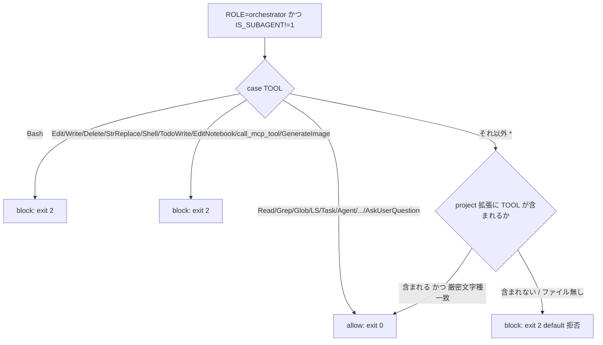
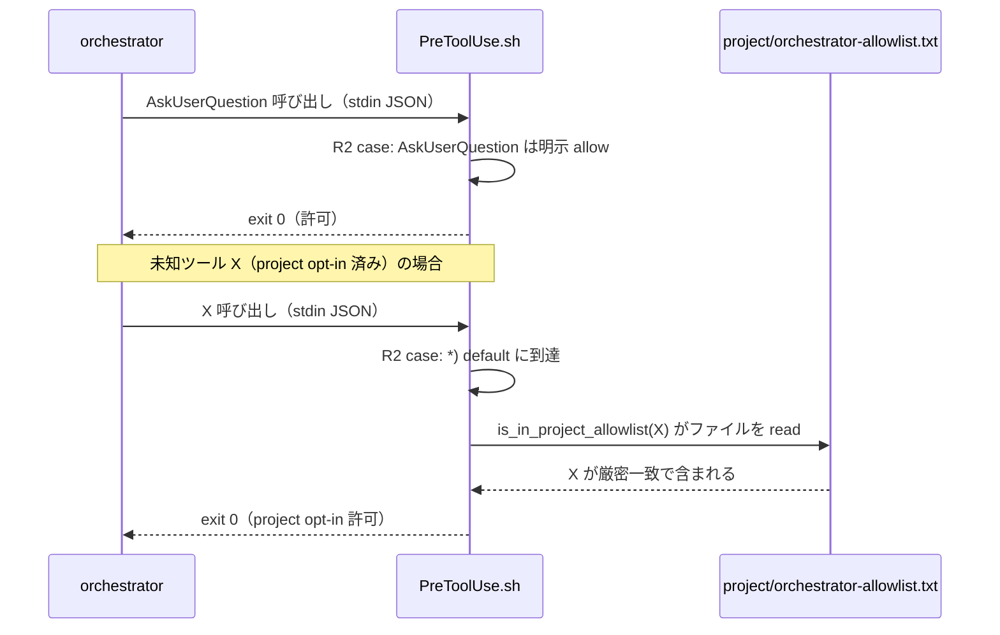

# 設計書: orchestrator AskUserQuestion 許可

**プロジェクト名**: orchestrator AskUserQuestion 許可
**作成日**: 2026 年 07 月 14 日
**最終更新**: 2026 年 07 月 14 日

> **重要**: **このドキュメントは常に更新**: 設計の変更や追加があった場合は、即座にこのドキュメントを更新してください。ドキュメントは「生きているドキュメント」として扱い、実装内容と常に同期させます。
>
> **用語**: [.agent-skill-chain/source/CONCEPTS.md §用語規約](../../../../.agent-skill-chain/source/CONCEPTS.md#用語規約) を参照。

---

## 1. 設計概要

### 1.1 設計方針

`.agent-skill-chain/source/enforcement/claude/PreToolUse.sh` の R2 orchestrator allowlist（fail-closed）を**維持したまま**、(1) `AskUserQuestion` を 1 件追加し、(2) コア default を一切変更しない opt-in の project 固有 allowlist 拡張機構を新設し、(3) ロックアウト復旧手順を正式ドキュメント化する。既存の判定構造・拒否分岐は変えず、追加は「許可リストの末端（`*)` default 手前）を狭く広げる」形に限定する。denylist 方式への全面転換は行わない（ユーザー明示却下）。さらに (4) 実装前ドキュメントレビュー command（`commands/review-docs.md`）へ `REVIEW_DUAL_LENS.md`（二観点必須化の正本）を接続し、既存の review-code/review-architecture と同型の参照追加＋ DoD 追加のみで二観点の両リスト記載を強制化する（正本の二重定義はしない）。加えて (5) `PreToolUse.sh` の常時バナー（案内）と `block()` のブロック理由を出力 prefix・文言で分離し（FR-6）、(6) enforcement メッセージを**日英併記**で日本語化する（FR-7）。(5)(6) はいずれも**フックの挙動（exit code・許可/拒否判定・強制ロジック）を一切変えず、stderr 出力の prefix・文言のみを変更**する。既存 `test/test-pretooluse-hook.sh` が英語部分文字列に `assert_grep` 依存しているため、英語を先頭に残す日英併記でテスト非破壊を保つ（ADR-7・ADR-8）。

### 1.2 設計原則（本プロジェクトで適用するもの）

- **UNIX哲学**: hook は bash 1 本で完結させ、外部依存（jq 等）を増やさない。project 拡張は「1 行 1 ツール名の素データファイル」という最小形式にし、hook はそれを**データとして読む**（source して実行しない）。
- **単一責務**: allowlist 判定は PreToolUse.sh の R2 分岐のみが担う。project 拡張ファイルは「追加許可ツール名の列挙」だけを責務とし、ロジックを持たない。
- **明確な境界**: コア default（`.agent-skill-chain/source/`・不可侵の fail-closed）と project opt-in（`.agent-skill-chain/project/`・ユーザー資産）の境界を、既存の `.agent-skill-chain/project/` 優先順位パターンにそのまま合わせる。
- **AIフレンドリー設計**: 追加はコメント付きの小さな差分。将来の同種ツール追加時に判断材料が読み取れるよう、`Agent` 追加時（コミット `4358a0f`）の注記パターンに倣う。

---

## 2. アーキテクチャ設計

### 2.1 責務・境界・参照関係

#### 2.1.1 責務一覧

| コンポーネント | 責務（1 文） |
| --- | --- |
| `PreToolUse.sh` R2 分岐 | orchestrator（ROLE=orchestrator, IS_SUBAGENT!=1）のツール呼び出しを allowlist で判定し、許可外は `exit 2` で拒否する。 |
| `AskUserQuestion` 許可 case | 読み取り専用・非破壊のユーザー対話ツールを allowlist に 1 件追加する（FR-1）。 |
| project 拡張ファイル `.agent-skill-chain/project/orchestrator-allowlist.txt` | コア default を変更せず、プロジェクト固有の追加許可ツール名を opt-in で宣言する（FR-4・ユーザー資産）。 |
| `PreToolUse.sh` の `is_in_project_allowlist()` | 拡張ファイルを**データとして**読み、`*)` default に落ちたツール名が拡張に含まれるかだけを判定する（FR-4）。 |
| SETUP.md / CORE.md / README.md / project/README.md | ロックアウト復旧手順（FR-3）と project 拡張機構の存在・使い方・更新経路（FR-4）を文書化する。 |
| `commands/review-docs.md` の Process/Outputs/Done | 実装前 00-03 レビューで `REVIEW_DUAL_LENS.md` を参照し、二観点の両リスト（敵対的観点・must-preserve）を成果物へ記載することを DoD として強制する（FR-5）。二観点ルールの本体は `REVIEW_DUAL_LENS.md` 正本に委譲し再定義しない。 |
| `PreToolUse.sh` の常時バナー（`:156-160`） | `AGENTS_ROOT/boot/CORE.md` 存在時に毎回出す案内。FR-6 で「非違反の案内」と分かる prefix・文言（`[PreToolUse:info]`）へ変更し、FR-7 で日本語を併記する。exit には影響しない。 |
| `PreToolUse.sh` の `block()`（`:24-28`） | 実際の違反検出時に理由を stderr へ出し `exit 2` する薄関数。FR-6 で「違反」と分かる prefix（`[enforcement:block]`）へ変更し、FR-7 で block 各理由に日本語を併記する。英語部分文字列は先頭に保持する。 |
| `PostToolUse.sh` のバナー（`:18`）／`audit.sh` 等の CI メッセージ | FR-7 の日本語化対象候補。本 issue 範囲/後続送りの線引きは ADR-8 で確定する。 |

#### 2.1.2 境界

- **入力**: PreToolUse フックが受け取る stdin JSON（`tool_name`・`tool_input` 等）と env（`AGENT_ROLE`・`AGENTS_ROOT`）。project 拡張は `.agent-skill-chain/project/orchestrator-allowlist.txt`（存在すれば）。
- **出力**: `exit 0`（allow）/ `exit 2`（block）。
- **他責務との境界**: サブエージェント（`agent_id` あり＝IS_SUBAGENT=1）の worker 判定は R2 の対象外であり、本 issue では変更しない。scribe 経路（R3〜R6・Bash/write-workflow-log.sh/sqlite3 判定）も変更しない。Cursor 向け enforcement（`agents-core.mdc`）は一次スコープ外。

#### 2.1.3 参照関係

- Claude Code ハーネス →（stdin JSON）→ `PreToolUse.sh`（`parse_input` → R1 → R2 → R3〜R6 → `allow`）。
- `PreToolUse.sh` R2 の `*)` default →（読取）→ `is_in_project_allowlist()` →（ファイル read）→ `.agent-skill-chain/project/orchestrator-allowlist.txt`。
- 循環参照なし。拡張ファイルは hook から**片方向に読まれるだけ**で、拡張ファイル側は hook を参照しない。

### 2.2 システムアーキテクチャ

- **採用パターン**: 既存の「単一 bash フックによる allowlist（fail-closed）判定」を維持し、末端に opt-in 拡張点を 1 つ追加する（拡張点付き allowlist）。
- **根拠**: spec/06 の優先順位「仕様との整合性 > 変更容易性 > 保守性」に従い、既存構造を壊さず最小差分で要求を満たす。新方式（denylist・メタデータ分類）は §2.5 ADR-2 のとおり不採用/見送り。

#### 2.2.1 判定順序（本 issue で確定する R2 の内部フロー）

`AskUserQuestion` は明示 case として追加し、project 拡張は `*)` default の**中だけ**で効かせる。これにより、`Bash` 明示拒否・`Edit|Write|...` 明示拒否は project 拡張より**手前**で評価され、拡張がこれらを覆すことは構造上できない（fail-closed 保全）。



### 2.3 コンポーネント構成

- **コア（不可侵・毎回置換）**: `.agent-skill-chain/source/enforcement/claude/PreToolUse.sh`。allowlist 本体・`is_in_project_allowlist()` の実装を持つ。project 拡張ファイルが**無ければ**従来と完全に同一挙動（fail-closed）。
- **project（ユーザー資産・setup が touch しない）**: `.agent-skill-chain/project/orchestrator-allowlist.txt`。存在すれば opt-in で追加許可される。
- **配備物**: `.claude/hooks/PreToolUse.sh`（コア正本のコピー）。設定は `settings.enforce.json` 経由で `AGENTS_ROOT=${CLAUDE_PROJECT_DIR}/.agent-skill-chain/source` を渡す。project ディレクトリは `$(dirname "$AGENTS_ROOT")/project` で導出する（§3.2.2 の実装と一致）。

### 2.4 データフロー

`AskUserQuestion` 呼び出し（orchestrator）→ PreToolUse フック発火 → stdin JSON から `tool_name=AskUserQuestion` 抽出 → R2 case で allow case に一致 → `exit 0`。イベント相当の「起きた事実」は本 issue では発行しない（判定のみ・副作用なし＝Query 側）。



### 2.5 横断設計判断（ADR）

> evidence_source の分類定義は [CONCEPTS.md §外部根拠の必須化](../../../../.agent-skill-chain/source/CONCEPTS.md#外部根拠の必須化external-anchor)（EVIDENCE_POLICY.md 経由）を参照。

#### ADR-1: `AskUserQuestion` を R2 allowlist に明示 case 追加する（FR-1）

- **コンテキスト**: orchestrator が `AskUserQuestion` を呼ぶと、R2 case の allow 列挙に無いため `*)` default で `exit 2` 拒否され、確認をテキスト代替せざるを得ない。
- **検討した選択肢**:
  1. R2 の allow case 列挙に `AskUserQuestion` を 1 件追加する（明示 allowlist）。
  2. project 拡張機構（ADR-3）にだけ入れてコアには入れない。
  3. denylist へ転換して非破壊ツールを一括許可する。
- **決定**: 選択肢 1。allow case 列挙（`Read|Grep|...|list_mcp_resources`）に `AskUserQuestion` を追加し、`Agent` 追加時（コミット `4358a0f`・`PreToolUse.sh:181-183` の注記）と同じ形式で「読み取り専用・非破壊のユーザー対話ツールであり実作業禁止原則に抵触しない」旨のコメントを残す。
- **根拠**: `AskUserQuestion` はファイル変更・コード実行を伴わず、CORE.md §メインエージェントがやってはいけないこと（`boot/CORE.md:61-74` の列挙＝ファイル作成/編集/コード実装/設計本文/レビュー本文/テスト作成/コマンド実行）に含まれない（evidence_source: existing_code, `boot/CORE.md` 実読）。ハーネス組み込みツールであり全消費先で共通に必要になるため、project 拡張（選択肢 2）ではなくコア default に入れるのが適切。選択肢 3 はユーザー明示却下（evidence_source: existing_code, 01_要件定義.md §2.3・00_要求定義.md §5）。
- **帰結**: 全消費先が upgrade で `AskUserQuestion` 許可を受け取る。既存の Bash/Edit/Write 拒否は不変。回帰テスト（03 §2.1）で allow=exit0・変更系=exit2 を固定する。

#### ADR-2: メタデータベース自動分類は feasibility 不可として見送る（FR-2）

- **コンテキスト**: allowlist 追加の対症療法を繰り返すと、将来のハーネス組み込みツール追加のたびに同種ロックアウトが再発しうる。ツールの性質（読み取り専用・非破壊）に基づく自動分類が feasible なら、名前の個別追加なしに安全側へ倒せる可能性がある。
- **検討した選択肢**:
  1. PreToolUse フックの stdin JSON に含まれる `readOnlyHint` 相当メタデータ（annotation）で自動分類する。
  2. メタデータが無ければ feasibility 不可として見送り、allowlist 個別追加（ADR-1）＋ project 拡張（ADR-3）＋復旧手順文書化（ADR-5）で対応する。
- **決定**: 選択肢 2（**見送り**）。自動分類は本 issue では設計・実装しない。
- **根拠**: Claude Code 公式ドキュメントの PreToolUse 入力スキーマを一次調査した結果、stdin JSON は `session_id`・`prompt_id`・`transcript_path`・`cwd`・`permission_mode`・`hook_event_name`・`tool_name`・`tool_input` のみを含み、**ツールが読み取り専用・非破壊かを示す `readOnlyHint`・annotation・ツール説明・スキーマは一切含まれない**（evidence_source: external_spec, https://code.claude.com/docs/en/hooks の PreToolUse 入力例および明示記述「To determine if a tool is destructive, your hook must parse and analyze the `tool_name` and `tool_input` directly」を WebFetch で確認、2026-07-14）。この事実は既存実装とも整合する（`PreToolUse.sh` の `json_get` が抽出可能なのは `tool_name`/`command`/`file_path`/`agent_id` のみ＝evidence_source: existing_code）。したがって hook 側で非破壊性を機構的に判定する根拠が無く、自動分類は feasible でない。MCP ツールの `readOnlyHint` はツール**定義側**の annotation であり、PreToolUse に渡るのは呼び出し**引数**（`tool_input`）だけでツール定義は渡らない。
- **帰結**: allowlist 方式（fail-closed）を維持する。denylist 全面転換は不採用（成果物のどこにも「採用」と記載しない）。将来ハーネスが PreToolUse ペイロードに annotation を含めるよう仕様変更した場合は本 ADR を再評価する（現時点では要件外）。個別ツール追従の運用負荷は ADR-3（project opt-in）と ADR-5（復旧手順）で緩和する。

#### ADR-3: project 固有 allowlist 拡張は「hook がデータとして読む素テキストファイル」形式にする（FR-4・形式）

- **コンテキスト**: `.agent-skill-chain/project/` に orchestrator allowlist の opt-in 追加を置きたいが、hook は bash であり、既存の `.agent-skill-chain/project/自己拡張ワークフロー.md` は Markdown で hook から機械的に読めない。hook が確実かつ安全に読める形式を選ぶ必要がある。
- **検討した選択肢**:
  1. 1 行 1 ツール名の素テキスト `.agent-skill-chain/project/orchestrator-allowlist.txt`（`#` コメント可）。hook は**データとして** read し、厳密文字種（`^[A-Za-z][A-Za-z0-9_-]*$`。`-` は末尾 literal でハイフン付き MCP 名 `mcp__brave-search__search` 等を許容）に一致する行のみ採用する。
  2. bash スクリプト `.sh` を hook が `source` して配列変数を得る。
  3. JSON ファイルを `jq` で読む。
- **決定**: 選択肢 1（素テキスト・read-as-data）。
- **根拠**:
  - 選択肢 2 は却下。`source` は拡張ファイルの内容を**シェルコードとして実行**するため、拡張ファイルを編集できる主体（worker サブエージェント）に任意コード実行を許すことになり、allowlist 緩和の範囲を超えた権限昇格ベクタになる（evidence_source: existing_code, PreToolUse.sh は現状いかなる project ファイルも source していない＝攻撃面を増やさない設計）。
  - 選択肢 3 は却下。`jq` は本 hook では**任意依存**（`test-pretooluse-hook.sh` が jq 有/無の両系統を検証、SETUP.md §前提依存マトリクスで jq は optional）であり、必須化すると jq 不在環境で拡張が読めず挙動が分岐する。
  - 選択肢 1 を採用。`while read` の逐行読取＋`#` コメント除去＋**先頭末尾 trim（内部空白は collapse しない）**＋厳密文字種検証で、注入（改行・メタ文字・内部空白・CR・BOM を含む不正行）を無視し、正規なツール名のみを許可に加える。**空白を collapse せず trim のみにする理由**: `tr -d '[:space:]'` で全空白を除去すると `Foo bar`→`Foobar`、`mcp __ shell`→`mcp__shell` のように内部空白を含む行が正規名に化けて regex を通過し、(a) 「厳密文字種不一致で無視」という説明と実挙動が食い違い、(b) 危険ツール名を内部空白で難読化して PR レビューの目視をすり抜けさせる余地を残す。trim のみなら内部空白を含む行は regex 不一致で確実に無視され、悪意ある行は clean な素名で書かざるを得ず PR diff で可視になる（ADR-4 が依拠する「PR レビュー可視性」を強化）。**許可の実ゲートは `[[ "$line" == "$want" ]]` の厳密一致（RHS を quote した文字列比較・glob 無効）**であり、regex は衛生フィルタに過ぎない（regex が多少緩くても、実行ツール名と完全一致する行以外は許可されない）。ファイル不在・空・全行不正・読取不可（権限）・非正規ファイル（`-f` 偽＝デバイス/FIFO への symlink を含む。`/dev/random` 等での hang を回避）時は関数が偽を返し `*)` default 拒否に落ちる＝**fail-closed を保全**（evidence_source: existing_code, R2 default 拒否ロジックに合流）。
  - project ディレクトリの導出は `$(dirname "$AGENTS_ROOT")/project`（`AGENTS_ROOT=.../.agent-skill-chain/source` → `.../.agent-skill-chain/project`）。固定文字列をハードコードせず消費先配備先で誤判定しない（evidence_source: existing_code, 既存 R5 と同じ「実行時算出・固定文字列禁止」方針）。**ただし R5（write-workflow-log.sh 判定）は `realpath`/`readlink -f` で symlink まで完全解決するのに対し、本関数の `dirname` は純粋に字句上の親を返す（symlink 解決なし）**。標準配置（`.agent-skill-chain/` 直下に `source` と `project` が兄弟）では字句 dirname で正しく `project` を指すため realpath は不要。非標準配置（`source` を別実体へ symlink し project を実体側に置く等）では字句 dirname が別ディレクトリを指しうるが、その場合はファイル不在で fail-closed に落ちるだけで許可が漏れることはない。ゆえに R5 の完全解決までは要さない（fail-closed 側で安全側に倒れる）。
- **帰結**: 拡張は `Bash`・`Edit`・`Write` 等コア default が**明示拒否している名前**を覆せない（それらは case のより手前で block されるため／§2.2.1）。拡張が効くのは `*)` default に落ちる未知ツール名に限られる。何も置かなければ従来どおり厳格（fail-closed）。format・パス・検証仕様は 03 のタスクで固定する。
  - **残余リスク（能力ベースの正直化・重要）**: 「明示拒否名を覆せない」のは**名前の一致**に対する保証であって、**能力（capability）**に対する保証ではない。`*)` に落ちる未知ツールには、Claude Code の MCP ツール（実名は `mcp__<server>__<tool>` 形式で、明示拒否列の `call_mcp_tool` とは名前が異なるため `*)` に落ちる）を含む、**ファイル書込・シェル実行と等価な副作用を持つツール**が存在しうる。したがって拡張ファイルにそのような MCP 書込/実行ツール名を opt-in すれば、orchestrator は `Edit`/`Write` を介さずに**書込・実行の等価権限を獲得できる**。「未知ツール＝安全」ではない。本機構の安全性は「機構が破壊的ツールの付与を阻止する」ことではなく、**opt-in 内容が人間の PR レビューで妥当と判断されること**に全面的に依存する（§8.1・ADR-4 と一体で読むこと）。この帰結は 04_review・PR 説明で明示する。

#### ADR-4: project 拡張の更新経路は「orchestrator の書込禁止（機構）＋ PR レビュー（プロセス）」の二層で人間関与を担保する（FR-4・ガバナンス）

- **コンテキスト**: 拡張を Claude Code 経由（通常の command chain）で更新できるようにしたい一方、orchestrator が自分の許可リストを無制限に自己拡張できると権限昇格になる。更新経路に人間関与点を必ず置く必要がある。
- **検討した選択肢**:
  1. orchestrator が拡張ファイルを直接編集して即時反映（人間関与なし）。→ 権限昇格のため却下。
  2. 拡張ファイルの編集を通常の 00-04 ドキュメント編集と同様に**サブエージェント委譲**で行い、既存の orchestrator 書込禁止（機構）＋ **PR レビュー → 人間による main マージ**（プロセス）を人間関与点とする。
  3. hook が「拡張ファイルが git 追跡済み かつ 未コミット差分なし のときだけ有効化」する機構的ゲートを追加する。
- **決定**: 選択肢 2 を主とする。選択肢 3 は**採用しない**（理由は根拠に記載）。
- **根拠**:
  - **機構的な第一防壁は既存 enforcement が既に提供している**: orchestrator（IS_SUBAGENT!=1）の `Edit`/`Write` は R2 で無条件 `exit 2`（evidence_source: existing_code, `PreToolUse.sh:195-196`）。したがって orchestrator は**自分の allowlist 拡張ファイルを自分では書けない**。拡張には必ず worker サブエージェントへの委譲（＝別ロール・別コンテキスト）が要る。これは「orchestrator 単独で自己拡張を完結できない」という要件（01 ストーリー 6）を機構で満たす。
  - **プロセス的な第二防壁は既存の委譲原則と整合する**: `.agent-skill-chain/project/` は setup が touch しないユーザー資産（evidence_source: existing_code, SETUP.md §所有区分「setup は touch しない」）。拡張ファイルは 00-04 ドキュメントと同じく worker が編集し、verify-and-close・PR レビューを経て**人間が main にマージして初めて**リポジトリの正となる。これは既存の「サブエージェント委譲＋人間レビュー可能な形＝PR」原則にそのまま乗る。
  - 選択肢 3（git 追跡＋差分なしを hook が検査）を採用しない理由: hook 内で `git` を呼ぶと fail-safe 方針（内部エラーは allow に倒す）と衝突し、git 非管理の消費先やサブモジュール構成で誤判定する。複雑性が UNIX 哲学（小さく保つ）に反する。二層（機構＋プロセス）で要件は満たされるため過剰。
- **帰結（残余リスクの正直化）**: 同一セッション内で、委譲された worker が拡張ファイルを編集すると、その変更は**ディスク上で即時に**有効化される（hook は毎回ライブでファイルを読むため、PR マージを待たない）。したがって「PR マージで初めて有効化」は**プロセス上の規律**であって機構的強制ではない。以下の残余リスクを正直に列挙する（いずれも 04_review・PR 説明で明示する）:
  - **(残余1) 委譲は orchestrator 起点であり人間起点ではない**: orchestrator は command chain の一環として**自律的に** worker へ委譲でき、委譲の起動自体は人間ゲートを経ない。人間の関与点は**PR マージ（事後）**にのみあり、セッション内では存在しない。ゆえに「orchestrator は自分では書けない」が保証するのは *直接の* Edit/Write 不能だけであり、orchestrator が委譲経由で自分の allowlist を拡張し**同一セッション内で即座に使う**ことは機構的には妨げられない。したがって旧記述の「必ず人間が起点の委譲が要る」は不正確であり撤回する。担保されるのは「変更が git diff / PR で**事後に可視**」という一点である（リアルタイムの阻止ではない）。
  - **(残余2) allowlist 自身が書込プリミティブを付与しうる自己増幅**: ADR-3 帰結の能力ベース残余リスクと連結する。拡張ファイルに MCP 書込/実行ツール（`mcp__*` 系。`*)` に落ちる）を opt-in 済みの消費先では、orchestrator は `Edit`/`Write` を介さず**その MCP ツールで任意ファイル（拡張ファイル自身を含む）を書き換えられる**。この場合、ADR-4 の第一防壁「orchestrator は自分では書けない（機構）」は**無効化**され、残るのは第二防壁（PR レビュー・事後可視）のみになる。したがって本 ADR の機構的第一防壁は「拡張 allowlist に書込/実行等価ツールが含まれていない」ことを暗黙の前提とする。含まれる場合の安全性は人間レビューに全面依存する。
  - これは任意のファイル編集と同じ信頼モデル（worker の実作業は人間レビュー前提）であり、本設計はそれ以上の機構的隔離を課さない。

#### ADR-5: ロックアウト復旧手順は SETUP.md を正本に、CORE.md・README.md・project/README.md から参照する（FR-3）

- **コンテキスト**: PreToolUse フックで orchestrator が全ツールをブロックされた場合の復旧手順（`!` プレフィックス経由での迂回）が正式ドキュメントに無く、memory_note のみに依存している。
- **検討した選択肢**:
  1. SETUP.md §enforcement の opt-in に「ロックアウトからの復旧」小節を新設し正本とし、CORE.md・README.md・project/README.md から参照する。
  2. CORE.md を正本にする。
- **決定**: 選択肢 1。SETUP.md を正本、他は短い参照。
- **根拠**:
  - **機構の正しさ**: Claude Code のシェルモード（`!` プレフィックス）は「Run shell commands directly without going through Claude」「Doesn't require Claude to interpret or approve the command」と公式に定義され、モデルのツール呼び出しループを介さず**ユーザーが直接**実行する（evidence_source: external_spec, https://code.claude.com/docs/en/interactive-mode §"Shell mode with `!` prefix" を WebFetch で確認、2026-07-14）。PreToolUse フックはモデルのツール呼び出し（`tool_name`/`tool_input` を伴う）に対してのみ発火する（evidence_source: external_spec, 同 hooks ドキュメント）。よって `!` 実行はフック判定の**対象外経路**であり、ロックアウト中でも `!npx github:techbeansjp-free/AGENTS.md enforce off`（消費先）で enforcement 配線を外して復旧できる。設定反映には Claude セッションの再起動が要る（evidence_source: existing_code, README.md:211「設定変更をライブの Claude セッションに反映するには再起動が必要」）。
  - **配布到達性**: SETUP.md は消費先へ配布され既に `enforce on/off` を説明している（evidence_source: existing_code, SETUP.md §enforcement の opt-in・§前提依存）。ルート README.md は配布されない（evidence_source: existing_code, SETUP.md「README.md は配布されない」）。したがって消費先に届く復旧手順は SETUP.md に置くのが正しい。CORE.md は全ロール必読の実行契約であり、ロックアウト時に最初に参照されうるため短い参照を置く。README.md（リポジトリ向け）・project/README.md（project 層の入口）にも発見性のため 1〜2 行の参照を置く。
- **帰結**: 復旧手順が memory_note 依存でなくなる。記載は実装（`!` 迂回がフック対象外である機構）と整合。記載先・文面は 03 のタスクで固定する。

#### ADR-6: review-docs へ REVIEW_DUAL_LENS を参照追加し二観点の両リストを DoD 化する。機械強制は既存 audit.sh を最小拡張し、成果物到達性の限界は正直化する（FR-5）

- **コンテキスト**: `REVIEW_DUAL_LENS.md`（二観点必須化の正本）は、実装完了後レビュー（`review-code`/`review-architecture`＝04_review 出力）にのみ接続されており（evidence_source: existing_code, `review-code/SKILL.md:29,34`・`review-architecture/SKILL.md:27,32` が `REVIEW_DUAL_LENS.md` を参照）、実装前 00-03 レビューを担う `commands/review-docs.md` には接続されていない（evidence_source: existing_code, `review-docs.md` の Process は `RULES.md`・`PHASES.md` の監査観点への準拠のみを指示し `REVIEW_DUAL_LENS.md` 参照が無い＝`:26`。DoD は「既知の指摘が 0 件」のみ＝`:49`）。「指摘 0 件」だけでは、敵対的に反証を試みたか・must-preserve（不変条件）を同定したかが証跡上担保されない。
- **検討した選択肢**:
  1. **参照追加＋ DoD 追加のみ**（review-code/review-architecture と同型）: `review-docs.md` の Process/Outputs/Done に `REVIEW_DUAL_LENS.md` 参照と両リスト記載義務を追記する。二観点ルール本体は正本に委譲。
  2. 二観点ルールの詳細を `review-docs.md` 内にも書き込む（正本の二重定義）。
  3. `REVIEW_DUAL_LENS.md` 側を大改修し review-docs 専用の新セクション・新深さ概念を導入する。
- **決定**: 選択肢 1。`review-docs.md` は正本 `REVIEW_DUAL_LENS.md` を**参照**し、レビュー＋修正ループの成果物（memo または 00-03 自体）に「敵対的観点リスト」「must-preserve リスト」の両方を記載することを DoD に追加する。いずれか欠落は未完了（`REVIEW_DUAL_LENS.md` §3 と整合）。`REVIEW_DUAL_LENS.md` 側は「適用先に review-docs（実装前レビュー）も含む」旨の軽微な参照追記のみ（必要な場合）にとどめる。
- **機械強制（audit.sh）の feasibility と決定**:
  - 04_review 向けには既に check #27（Git 差分で変更された `04_review.md` に「敵対的観点」「must-preserve/不変条件」の両方が無ければ FAIL）が存在する（evidence_source: existing_code, `audit.sh:58,772-` を実読）。これは 04_review が **git 追跡対象**であることに依存する（`git diff --name-only` で変更ファイルを拾う）。
  - 一方 review-docs の一次成果物は `.agent-skill-chain/runtime/{issue}/memo/` の memo であり、memo は**過渡的スクラッチで正本ではなく、git 追跡対象は 00-04 のみ**という本プロジェクトの方針上、memo が git 追跡されない構成では git 差分ベースの内容検査（#27 と同型）が確実には効かない（evidence_source: existing_code, `audit.sh` #27 の git 差分依存構造＋本リポの証跡方針）。したがって「memo 内の両リスト有無」を audit.sh で内容検査する強制は**成果物到達性の点で不確実**であり、単独では信頼できる機械ゲートにならない。
  - review-docs の**実行有無**は既に check #32（DB 採用時・issue_path スコープで implement ログありかつ review-docs ログ 0 件なら FAIL）で機械強制されている（evidence_source: existing_code, `audit.sh:34`＝#32 サマリコメント・`:920-961`＝`check_reviewdocs_before_implement` 本体を実読）。すなわち「review-docs を回したか」は既にゲートされているが、「二観点の両リストを残したか」まではゲートされていない。
  - **決定**: 機械強制は**既存の到達可能面に限定した最小拡張のみ**とし、内容の主強制は **command DoD（プロセス）**に置く。具体的には (a) `review-docs.md` の DoD に両リスト記載を必須として明記（プロセス強制。review-code/review-architecture と同じ強制水準）、(b) 両リストを git 追跡される 00-03 ドキュメント自体に残す運用を**推奨経路**とし、その場合に限り将来 #27 と同型の git 差分内容チェックを review-docs 対象へ拡張できる余地を残す（本 issue では新規 audit チェックの実装は**必須としない**＝無理に大きくしない）。memo にのみ残す構成では機械内容強制が不確実である旨を正直化して記録する。
- **根拠**: 選択肢 2/3 は `REVIEW_DUAL_LENS.md` §7「正本は本ファイル 1 か所」「レビュー骨格には直交追加し既存骨格を改変しない」に反する（evidence_source: existing_code, `REVIEW_DUAL_LENS.md:7`）。選択肢 1 は既存 review-code/review-architecture の接続と完全同型で、正本の二重定義を避けつつ最小差分で二観点を review-docs に適用できる。機械強制を memo 内容検査へ無理に広げないのは、memo の非追跡性という到達性限界と「無理に大きくしない」という明示制約に従うため。
- **帰結**: review-docs の完了条件が「指摘 0 件」から「指摘 0 件 ＋ 敵対的観点リスト・must-preserve リストの両方の記載」へ強化される。実装後レビュー（04_review）と実装前レビュー（00-03）で二観点必須化の水準が揃う。両リストを 00-03 に残せば git 追跡され将来の機械内容チェック拡張が可能、memo にのみ残す場合はプロセス（DoD・レビュー）依存になる点を 04_review・PR 説明で明示する。denylist 転換等の方式変更は本 ADR に含めない。

#### ADR-7: 常時バナーとブロック理由を出力 prefix・文言で分離する（FR-6）

- **コンテキスト**: `PreToolUse.sh` は `AGENTS_ROOT/boot/CORE.md` があると、ツール呼び出しの種類・ブロック有無に関わらず**毎回** 3 行の固定バナー（案内）を stderr に出す（evidence_source: existing_code, `PreToolUse.sh:156-160` を実読）。一方、実際の許可/拒否判定の理由は `block()` が出す `[enforcement] ERROR: <理由>` の 1 行のみ（evidence_source: existing_code, `:24-28`）。この 2 つが同じ stderr に、いずれも `[PreToolUse]`／`[enforcement]` という似た体裁で混在するため、ユーザーがバナー（常時案内）を「規則を破った」と誤読する（evidence_source: human_decision, 本セッションでユーザーが「4 つの規則を破った」と実際に混乱）。
- **検討した選択肢**:
  1. **prefix と文言の変更のみ**: 常時バナー各行を `[PreToolUse:info]` prefix ＋ 先頭に「以下は常時表示の案内であり違反ではありません」旨の 1 文へ、`block()` を `[enforcement:block]` prefix ＋「違反」と分かる文言へ変更する（挙動は不変）。
  2. バナーを別ストリーム（別ファイル記述子）へ分離する／条件付きで抑制する。
  3. 何もしない（現状維持）。
- **決定**: 選択肢 1。出力の**体裁（prefix・文言）だけ**を変え、挙動（exit code・判定・ストリーム）は一切変えない。
  - 常時バナー（`:156-160`）: 各行の prefix を `[PreToolUse]` → `[PreToolUse:info]` に変更。バナーの先頭（または各行）に「常時表示の案内であり、ツール呼び出しのブロック（違反）ではありません／This is always-shown guidance, not a block.」を含める。`.agents not found`（`:151`）等の他の案内 exit0 行も `[PreToolUse:info]` に体裁を揃える。
  - `block()`（`:24-28`）: prefix を `[enforcement] ERROR:` → `[enforcement:block] 違反(BLOCK):` に変更（違反であることが一目で分かる形）。**英語の理由本文（`$1`）は先頭で保持**する（ADR-8 の日英併記と一体運用）。
- **根拠**: 選択肢 2 は Claude Code が hook stderr をどう合成表示するかに依存し、実機での見え方を制御しきれない＋実装が挙動変更（ストリーム分離）に踏み込むため、FR-6 の「挙動は変えない」制約に反する。選択肢 1 は最小差分で誤読を解消でき、既存テストが prefix を assert していない（evidence_source: existing_code, `test/test-pretooluse-hook.sh` の `assert_grep` は全て**理由本文の英語部分文字列**を対象とし、`[PreToolUse]`／`[enforcement]` prefix・バナー文言を assert する箇所は無いことを実読で確認＝`:154,200,226,290,300,321,331,394,511,561`）ため、prefix 変更でテストは壊れない。
- **帰結**: バナーは「案内（info）」、実違反は「block」と体裁上区別され、誤読が解消する。exit code・判定ロジックは不変で、既存 exit code アサーションは全て PASS のまま。prefix 文字列に依存するテスト・下流ツールは存在しないことを実装前に再確認する（03 T7）。

#### ADR-8: enforcement メッセージは「日英併記（英語を先頭に残し日本語を併記）」とし、本 issue の対象は PreToolUse.sh＋PostToolUse.sh に限定、audit.sh 等は後続 issue に送る（FR-7）

- **コンテキスト**: enforcement のフック/CI メッセージは英語が主で、日本語話者が違反内容を直感的に読み取りにくい（evidence_source: human_decision, ユーザーが「エラー時に英語だとよくわからない」「できることなら日本語で」と要望）。対象の全量を洗い出した（evidence_source: existing_code, `.agent-skill-chain/source/enforcement/` 配下を実読）:
  - `claude/PreToolUse.sh`: 常時バナー 3 行（`:157-159`）＋ `.agents not found`（`:151`）＋ `block()` の理由 8 種前後（`orchestrator cannot run Bash`・`orchestrator must never modify files...`・`sqlite3 direct execution forbidden`・`compound shell command forbidden`・`direct edit of .agent-skill-chain/runtime/ is forbidden`・`only scribe may run Bash...`・`only the canonical write-workflow-log.sh...`・`orchestrator may only use allowed tools...`）。
  - `claude/PostToolUse.sh`: バナー 1 行（`:18` `workflow.db is canonical...`）。
  - `ci/audit.sh`: `echo "FAIL: ..."` 26 箇所ほか、WARN/PASS を含む多数（全 echo/printf ≈ 141 箇所。ただしコメント・一部メッセージは既に日本語）。
  - `ci/check-comment-refs.sh`: `usage:`（英語）・`WARN: パスが...`（既に日本語）等少数。
- **検討した選択肢（方式）**:
  1. **日英併記（バイリンガル）**: 英語メッセージを先頭に残し、日本語を併記する（例: `orchestrator cannot run Bash / orchestrator は Bash を実行できません`）。
  2. **完全日本語化**: 英語を日本語で置換する。
- **決定（方式）**: 選択肢 1（**日英併記**・英語を先頭に維持）。
- **根拠（方式）**:
  - **テスト非破壊（decisive）**: `test/test-pretooluse-hook.sh` は `assert_grep` で英語部分文字列に依存する（`orchestrator must never modify files`・`sqlite3 direct execution forbidden`・`orchestrator cannot run Bash`・`only scribe may run Bash`・`compound shell command forbidden`・`direct edit of .agent-skill-chain/runtime/ is forbidden`・**`workflow.db is canonical`**＝PostToolUse バナー）（evidence_source: existing_code, `:154,200,226,290,300,321,331,394,511,561` を実読）。英語を先頭に残す日英併記なら全アサーションが保全され、テスト書換の回帰面積をゼロにできる。完全日本語化は 7〜8 アサーションの全書換を要し回帰リスクが大きい。
  - **国際化・後方互換（decisive）**: 本パッケージは `npx github:techbeansjp-free/AGENTS.md` で任意の消費者へ配布される（evidence_source: existing_code, SETUP.md の配布モデル・ADR-5 で確認した配布経路）。消費者が日本語話者とは限らないため、英語を残すことで非日本語話者にも違反内容が届き、日本語併記で日本語話者の要望も満たす（両立）。完全日本語化は非日本語話者の可読性を落とす。
  - **ユーザー要望との整合**: ユーザーの要望は「日本語で理解できるようにする」ことであり、英語の除去ではない。日英併記で要望を満たせる。
- **決定（対象範囲の線引き）**: 本 issue の FR-7 実施範囲は **`claude/PreToolUse.sh` と `claude/PostToolUse.sh`** に限定する。**`ci/audit.sh`・`ci/check-comment-refs.sh` 等の CI スクリプトの残余英語メッセージは後続 issue に送る**。
- **根拠（範囲）**:
  - **PreToolUse.sh は必須（ユーザー明示指示）**。PostToolUse.sh はバナー 1 行のみで PreToolUse と同じ「セッション実行中に orchestrator・ユーザーが直接目にするランタイム経路」であり、混乱の実発生源に隣接するため一体で対応するのが自然（かつ小規模）。
  - **audit.sh は後続送り**: (a) 規模が大きい（`echo`/`printf` ≈ 141 箇所・`FAIL:` だけで 26 箇所）。(b) 表示経路が異なる（audit.sh は **CI 実行時**のみ出力され、ユーザーが報告した「セッション中のリアルタイム混乱」とは別経路）。(c) `test-audit.sh` が audit の英語 FAIL メッセージを assert しているかの影響調査が別途必要（evidence_source: existing_code, 今回 `test-audit.sh` に該当英語文字列の assert は検出されなかったが、全 141 箇所の網羅確認は別作業）。(d) 「無理に大きくしない」という本プロジェクトの明示制約。以上より本 issue で全量を扱うと過大になるため、ランタイム hook（PreToolUse/PostToolUse）に限定し、CI メッセージは後続 issue へ分離する。
- **帰結**: 本 issue で `PreToolUse.sh`（バナー・block 理由）と `PostToolUse.sh`（バナー）のユーザー向けメッセージが日英併記になり、日本語話者の可読性が上がる。英語先頭維持により既存 `test-pretooluse-hook.sh` は非破壊。audit.sh 等 CI メッセージの日本語化は後続 issue（本 issue の 04_review・PR 説明・後続起票メモに範囲を明記）。denylist 転換等の方式変更は本 ADR に含めない。

---

## 3. 機能設計

### 3.1 機能 1: AskUserQuestion allowlist 追加（FR-1）

#### 3.1.1 概要
R2 case の allow 列挙に `AskUserQuestion` を追加する。

#### 3.1.2 処理フロー
orchestrator の `AskUserQuestion` → R2 case allow 一致 → exit 0。変更系・未知ツールの分岐は不変。

#### 3.1.3 入力・出力
- 入力: stdin JSON `{"tool_name":"AskUserQuestion", ...}`、`AGENT_ROLE=orchestrator`。
- 出力: exit 0。

#### 3.1.4 エラーハンドリング
入力が取れない（stdin 空・非 JSON）場合は既存どおり保守的に allow（過剰ブロックしない）。

### 3.2 機能 2: project 固有 allowlist 拡張（FR-4）

#### 3.2.1 概要
`*)` default に落ちたツール名を `.agent-skill-chain/project/orchestrator-allowlist.txt` と照合し、含まれれば allow、なければ従来どおり block。

#### 3.2.2 処理フロー（擬似コード・実装は 03 で確定）

```bash
# R2 の *) default 内
*)
  if is_in_project_allowlist "$TOOL"; then
    :   # project opt-in で許可
  else
    block "orchestrator may only use allowed tools (Read, Grep, Glob, LS, Task, etc.): $TOOL"
  fi
  ;;

# 関数（read-as-data・厳密文字種・fail-closed）
is_in_project_allowlist() {
  local want="$1" line proj_file
  [[ -z "$want" ]] && return 1
  proj_file="$(dirname "$AGENTS_ROOT")/project/orchestrator-allowlist.txt"
  [[ -f "$proj_file" ]] || return 1        # 不在は fail-closed（default block へ）
  while IFS= read -r line || [[ -n "$line" ]]; do
    line="${line%%#*}"                          # # 以降はコメント除去
    line="${line#"${line%%[![:space:]]*}"}"     # 先頭空白の trim
    line="${line%"${line##*[![:space:]]}"}"     # 末尾空白の trim（CRLF の \r を含む）
    [[ -z "$line" ]] && continue
    # 厳密文字種検証。内部空白・メタ文字・CR・BOM 等を含む行はここで不一致となり無視する
    # （注入対策＋難読化対策）。**空白は collapse せず trim のみ**にすることで、
    # `mcp __ shell` のような内部空白での難読化を弾き、PR レビューでの可視性を保つ。
    [[ "$line" =~ ^[A-Za-z][A-Za-z0-9_-]*$ ]] || continue
    [[ "$line" == "$want" ]] && return 0        # 厳密一致（RHS を quote＝リテラル比較・glob 無効）
  done < "$proj_file"
  return 1
}
```

#### 3.2.3 入力・出力
- 入力: `TOOL`（`*)` に落ちたツール名）、`.agent-skill-chain/project/orchestrator-allowlist.txt`（任意）。
- 出力: 関数の真偽 → allow / block。

#### 3.2.4 エラーハンドリング
ファイル不在・空・全行不正 → 偽 → default block（fail-closed）。`Bash`・`Edit|Write|...` は case のより手前で block されるため拡張では覆せない。

### 3.3 機能 3: ロックアウト復旧手順の文書化（FR-3）

SETUP.md §enforcement の opt-in に「ロックアウトからの復旧」小節を新設（正本）。CORE.md §禁止事項付近・README.md §配備後の管理 enforcement・project/README.md に参照を置く。文面は「`!enforce off` 相当を raw shell で実行 → 再起動」＋「なぜ効くか（`!` はモデルのツール呼び出しループを介さずフック対象外）」を含む。

### 3.4 機能 4: review-docs への二観点レビュー接続（FR-5）

#### 3.4.1 概要
`commands/review-docs.md` を、既存の `review-code`/`review-architecture` と同型で `REVIEW_DUAL_LENS.md` に接続する。ルール本体は正本へ委譲し、review-docs.md には**参照＋ DoD 追加**のみを行う。

#### 3.4.2 改修箇所（03 で確定）
- **Process（§レビュー＋修正ループ）**: レビュー観点に「`RULES.md`・`PHASES.md` の監査観点」に加えて「`REVIEW_DUAL_LENS.md` の二観点（敵対的観点＝反証・破壊を試み不確実なら要修正に倒す／肯定的観点＝must-preserve=不変条件の同定）」を明記する。各ラウンドで must-preserve リストを次ラウンドへ継承する（`REVIEW_DUAL_LENS.md` §6 と整合）。
- **Outputs**: 成果物として「敵対的観点リスト」「must-preserve リスト」の両方を、memo（`YYYYMMDD_HHMMSS_` プレフィックス）または 00-03 ドキュメント自体に出力する旨を追加。git 追跡される 00-03 への記載を推奨経路とする（ADR-6 の機械強制拡張余地のため）。
- **Done（DoD）**: 既存の「既知の指摘が 0 件」に加えて、「敵対的観点リスト」「must-preserve リスト」の**両方**が成果物に記載されていること（いずれか欠落は未完了、`REVIEW_DUAL_LENS.md` §3）を DoD に追加する。加えて、**①サイクルごとの `runtime/{issue}/memo/` への日時プレフィックス付き memo 作成 → ②指摘ゼロまでの反復 → ③完了後の `write-workflow-log` 委譲**の必須 chain（既存 review-docs.md DoD）は選択制にせず順序固定で維持する（二観点リストの記載先が memo/00-03 のいずれでもよいことと、この必須 chain の省略不可性は別問題として扱う）。
- **REVIEW_DUAL_LENS.md 側**: 「本ルールの適用先には review-docs（実装前 00-03 レビュー）も含む」旨の軽微な参照追記のみ（正本の定義本体は変更しない）。

#### 3.4.3 入力・出力
- 入力: review-docs の対象 00-03、`REVIEW_DUAL_LENS.md`（二観点の正本）。
- 出力: 二観点の両リストを含む memo または更新済み 00-03、write-workflow-log 証跡。

#### 3.4.4 エラーハンドリング／境界
`REVIEW_DUAL_LENS.md` の正本定義は変更しない（二重定義禁止）。review-docs.md は参照のみ。機械強制は ADR-6 の決定に従い、本 issue では新規 audit チェックの実装を必須とせず、DoD（プロセス）を主強制とする。

### 3.5 機能 5: 常時バナーとブロック理由の出力分離（FR-6・ADR-7）

#### 3.5.1 概要
`PreToolUse.sh` の常時バナー（`:156-160`）と `block()`（`:24-28`）の出力 prefix・文言を、非違反の案内（info）と実違反（block）で区別できる形に変更する。挙動は不変。

#### 3.5.2 改修箇所（03 で確定）
- **`block()`（`:24-28`）**: `echo "[enforcement] ERROR: $1" >&2` → `echo "[enforcement:block] 違反(BLOCK): $1" >&2` 相当。英語理由 `$1` は先頭側に保持（ADR-8 の日英併記により `$1` 自体が「英語 / 日本語」形式になる場合も、英語部分文字列は保持される）。
- **常時バナー（`:156-160`）**: 各 `echo "[PreToolUse] ..." >&2` の prefix を `[PreToolUse:info]` に変更。バナー先頭に「常時表示の案内であり違反ではありません（This is always-shown guidance, not a block.）」の 1 行を追加（または各行にその趣旨を含める）。`.agents not found`（`:151`）も `[PreToolUse:info]` に体裁を揃える。

#### 3.5.3 入力・出力
- 入力: 変更なし（stdin JSON・env）。
- 出力: stderr の prefix・文言のみ変更。exit code は不変（allow=0／block=2）。

#### 3.5.4 エラーハンドリング／境界
判定ロジック・exit code・ストリーム（stderr）は変更しない。prefix を assert するテスト・下流ツールが無いことを 03 T7 で実装前に再確認する。

### 3.6 機能 6: enforcement メッセージの日英併記（FR-7・ADR-8）

#### 3.6.1 概要
`PreToolUse.sh`（常時バナー・block 各理由）と `PostToolUse.sh`（`:18` バナー）のユーザー向けメッセージを、英語を先頭に残したまま日本語を併記する。audit.sh 等 CI メッセージは後続 issue（ADR-8 の範囲決定）。

#### 3.6.2 改修箇所（03 で確定）
- **`PreToolUse.sh` の `block()` 呼び出し理由（`$1`）**: 各 `block "<英語>"` を `block "<英語> / <日本語>"` 形式にする（例: `orchestrator cannot run Bash / orchestrator は Bash を実行できません`）。英語部分文字列は先頭で不変に保つ（assert_grep 保全）。対象は `:175,193,196,200,221,227,252,261,264,271` 等の全 block 理由。
- **常時バナー（`:157-159`）**: 各行に日本語を併記（FR-6 の prefix 変更と同一編集内で実施）。
- **`PostToolUse.sh`（`:18`）**: `workflow.db is canonical...` に日本語を併記（英語 `workflow.db is canonical` を保持＝`test-pretooluse-hook.sh:394` の assert 保全）。
- **後続 issue（本 issue 範囲外）**: `ci/audit.sh`・`ci/check-comment-refs.sh` 等の残余英語メッセージ。

#### 3.6.3 入力・出力
- 入力: 変更なし。
- 出力: メッセージ文言に日本語併記が加わる。exit code・判定は不変。

#### 3.6.4 エラーハンドリング／境界
英語部分文字列を先頭に必ず保持し、既存 `test/test-pretooluse-hook.sh` の `assert_grep`（英語依存）を壊さない。日本語併記により該当英語文字列が分断されないよう、区切りは ` / ` 等で英語トークンの連続性を保つ。

---

## 4. データ設計

該当なし（DB・テーブルの新設・変更なし）。project 拡張ファイルは 1 行 1 ツール名の素テキストで、スキーマ管理対象外のユーザー資産。

---

## 5. API 設計

該当なし（ハーネス提供の `AskUserQuestion` ツール自体の追加・変更は行わない）。本 issue が定義する「契約」は下記のみ。

| 契約 | 内容 |
| --- | --- |
| R2 allowlist | orchestrator は allow case 列挙（＋ `AskUserQuestion`）＋ project 拡張のみ許可。それ以外は exit 2。 |
| project 拡張ファイル | パス `.agent-skill-chain/project/orchestrator-allowlist.txt`。1 行 1 ツール名（`^[A-Za-z][A-Za-z0-9_-]*$`・ハイフン付き MCP 名可）、`#` コメント可、空行可。不在時は無効（従来どおり）。 |
| 復旧手順 | `!`（shell mode）で `enforce off` 相当を実行 → 再起動。フック対象外経路であること。 |

---

## 6. テスト戦略

テスト観点の定義は [RULES.md のテスト戦略必須要件](../../../../.agent-skill-chain/source/RULES.md#テスト戦略必須要件)、BDD 形式は [TEST_BDD_FORMAT.md](../../../../.agent-skill-chain/source/TEST_BDD_FORMAT.md) を参照。既存テスト `test/test-pretooluse-hook.sh` に追加する（tmp 隔離・jq 有無両系統の既存方針を踏襲）。

### 6.1 対象ごとのテスト割り当て

| 対象 | 単体 | 結合/API | E2E | クリティカル観点 | バリデーション観点 | 未達理由/補足 |
| --- | --- | --- | --- | --- | --- | --- |
| FR-1 AskUserQuestion 許可 | ○ | × | × | orchestrator×AskUserQuestion=exit0 | 変更系(Bash/Edit/Write)=exit2 維持 | 既存テストにケース追加 |
| FR-1 回帰（未知ツール default 拒否） | ○ | × | × | 未知ツール=exit2 維持 | - | 既存挙動の非劣化確認 |
| FR-4 project 拡張（opt-in 許可） | ○ | × | × | 拡張に列挙した未知ツール=exit0 | 不在/空/不正行=exit2（fail-closed） | jq 有無両系統 |
| FR-4 拡張は変更系を覆せない | ○ | × | × | 拡張に Bash/Edit を書いても=exit2 | 注入行（`X; rm -rf /` 等）を無視 | セキュリティ境界 |
| FR-4 サブエージェント非影響 | ○ | × | × | agent_id ありは R2 対象外で不変 | - | 既存 UC8 に整合 |
| FR-2 feasibility 記録 | - | - | - | 本 02 に ADR 記録済み（実装なし） | denylist 不採用の確認 | ドキュメント成果物 |
| FR-3 復旧手順文書 | - | - | - | SETUP/CORE/README/project に記載 | 機構説明の整合 | ドキュメント成果物 |
| FR-5 review-docs 二観点接続 | - | - | - | review-docs.md に REVIEW_DUAL_LENS 参照＋両リスト DoD 追加 | 正本の二重定義なし・review-code/architecture と同型 | ドキュメント成果物・レビューで確認 |
| FR-6 バナー/block 出力分離 | ○ | × | × | block 時に違反 prefix 行が出る／許可時は info バナーのみ | 既存 exit code アサーションが全 PASS（挙動不変） | 既存テストに prefix/文言の確認を追加 |
| FR-7 日英併記（PreToolUse/PostToolUse） | ○ | × | × | block 理由・バナーに日本語が併記される | 英語部分文字列保持で既存 assert_grep が全 PASS | audit.sh 等は後続 issue（範囲外） |

### 6.2 監査・レビューでの確認（証跡）
本 §6.1 の割当と 03 のタスク別 BDD が対応することをレビューで確認する。denylist 全面転換が成果物のどこにも「採用」と記載されないことを確認する（除外要件）。

---

## 7. UI 設計

該当なし。本 issue は独自 UI を持たない。orchestrator がユーザーへ確認する際の選択肢 UI はハーネス提供の `AskUserQuestion` ツールが描画するものであり、本 issue はその許可判定（PreToolUse フック）のみを扱う。

---

## 8. セキュリティ設計

### 8.1 認証・認可
- fail-closed の allowlist を維持。project 拡張は `*)` default の内側でのみ効き、`Bash`・`Edit|Write|Delete|StrReplace|Shell|TodoWrite|EditNotebook|call_mcp_tool|GenerateImage` の**明示拒否名**を覆せない（§2.2.1）。
- **名前ベースの保証と能力ベースのリスクを区別する**: 上記は「明示拒否**名**を覆せない」ことの保証であり、`*)` に落ちる未知ツール（MCP 書込/実行ツール `mcp__*` 系を含む＝`call_mcp_tool` 明示拒否とは別名）を opt-in すれば、orchestrator が Edit/Write を介さず書込/実行の等価権限を得る余地は残る（ADR-3 帰結・ADR-4 残余2）。この能力ベースのリスクは機構では塞がれず、opt-in 内容の**人間 PR レビュー**が唯一の防壁となる。
- 拡張ファイルは `source` せず**データとして**読み、先頭末尾 trim（内部空白は collapse しない）＋厳密文字種検証で注入・難読化を無視する。許可の実ゲートは厳密一致（`== "$want"`・RHS quote）であり、読取専用データ比較のため注入行（`Foo; rm -rf /` 等）は不活性（ADR-3）。
- 更新経路は orchestrator 直接書込禁止（機構・ただし ADR-4 残余2 の前提付き）＋ PR レビュー（プロセス）で人間関与を担保（ADR-4）。残余リスク（同一セッション内 worker 編集の即時反映・委譲は orchestrator 起点で人間起点ではない・allowlist 経由の書込プリミティブ自己増幅）は正直化して記録。

### 8.2 データ保護
project 拡張ファイルはユーザー資産で setup が touch しない。upgrade/uninstall（既定）で保持され、コア更新に上書きされない。

---

## 9. 非機能要件への対応

### 9.1 パフォーマンス
拡張判定は `*)` default に落ちた場合のみのファイル逐行読取。許可 case・変更系拒否は従来どおりファイル I/O なし。有意な性能影響なし。

### 9.2 可用性
ロックアウト時も `!` shell mode でフックを迂回して復旧できる経路を文書化（FR-3）。hook 自体は `set +e`・内部エラー allow で全ツール停止を避ける既存 fail-safe を維持。

---

## 10. 参考資料

### プロジェクトドキュメント
- [`01_要件定義.md`](./01_要件定義.md) - 要件定義
- [`00_要求定義.md`](./00_要求定義.md) - 要求定義

### その他の参考資料
- `.agent-skill-chain/source/enforcement/claude/PreToolUse.sh`（R2・`:179-203`）— 修正対象。
- `.agent-skill-chain/source/boot/CORE.md`（`:61-74`）— orchestrator 実作業禁止列挙（AskUserQuestion 非該当）。
- `.agent-skill-chain/source/SETUP.md` §enforcement の opt-in — enforce on/off・FR-3 記載先。
- `.agent-skill-chain/project/README.md` §優先順位 — FR-4 が踏襲する opt-in パターン。
- `test/test-pretooluse-hook.sh` — 追加対象の既存テスト。
- external_spec: https://code.claude.com/docs/en/hooks（PreToolUse 入力スキーマ・FR-2）、https://code.claude.com/docs/en/interactive-mode §Shell mode with `!` prefix（FR-3 機構）。いずれも 2026-07-14 WebFetch 確認。
- コミット `4358a0f`（Agent 追加）— allowlist 追加時のコメント注記パターン。
- `.agent-skill-chain/source/REVIEW_DUAL_LENS.md`（`:7`・`:29-31` §3 証跡要求・`:51-57` §6 ラウンド継承）— FR-5 が review-docs へ接続する二観点必須化の正本。
- `.agent-skill-chain/source/commands/review-docs.md`（Process `:26`・DoD `:49`）— FR-5 の改修対象。
- `.agent-skill-chain/source/skills/review/review-code/SKILL.md`（`:29,34`）・`review-architecture/SKILL.md`（`:27,32`）— FR-5 が踏襲する REVIEW_DUAL_LENS 接続の既存パターン。
- `.agent-skill-chain/source/enforcement/ci/audit.sh`（#27＝`:58,772-` 04_review 両リスト検査／#32＝`:34`＋`:920-961` review-docs 実行有無検査）— FR-5 の機械強制 feasibility の参照点。`echo "FAIL: ..."` 26 箇所ほか — FR-7 の後続 issue 対象（ADR-8）。
- `.agent-skill-chain/source/enforcement/claude/PreToolUse.sh`（常時バナー `:156-160`・`block()` `:24-28`・`.agents not found` `:151`）— FR-6/FR-7 の主対象（ADR-7・ADR-8）。
- `.agent-skill-chain/source/enforcement/claude/PostToolUse.sh`（`:18` `workflow.db is canonical...`）— FR-7 の本 issue 範囲（ADR-8）。
- `test/test-pretooluse-hook.sh`（`assert_grep` 英語部分文字列依存＝`:154,200,226,290,300,321,331,394,511,561`）— FR-6 の prefix 非依存確認・FR-7 の日英併記による非破壊確認の根拠。

---

## 11. 前のステップ
- **前**: [`01_要件定義.md`](./01_要件定義.md) - 要件定義フェーズ

## 12. 次のステップ
- **次**: [`03_実装計画.md`](./03_実装計画.md) - 実装計画フェーズ
