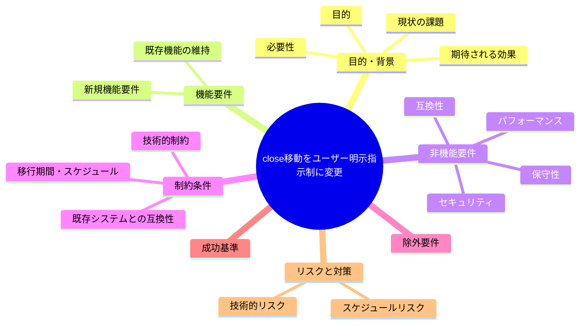

# 要求定義書: close 移動をユーザー明示指示制に変更

**プロジェクト名**: close 移動をユーザー明示指示制に変更
**作成日**: 2026 年 07 月 14 日
**最終更新**: 2026 年 07 月 14 日
**親 issue**: [`../../00_要求定義.md`](../../00_要求定義.md)（orchestrator AskUserQuestion 許可、issue_id: `62b7c166-baa6-4d40-9f6b-f79ffe83a11d`）のサブ issue

> **重要**:
>
> - 要求定義書は、プロジェクトの全体像を把握するためのものです。詳細な技術仕様や実装方法は要件定義書以降で記載します。必要最低限の情報に収めることを心掛けてください。
> - **このドキュメントは常に更新**: 要求の変更や追加があった場合は、即座にこのドキュメントを更新してください。ドキュメントは「生きているドキュメント」として扱い、実装内容と常に同期させます。
> - **必須項目**: 以下の「必須」と明記した項目は空欄・抽象語のみ（例: 「{説明}」のまま）で提出しないこと。判定可能な形（目的は1文・成功基準は○/×で判定できる記載等）で記入すること。
>
> **用語**: [.agent-skill-chain/source/CONCEPTS.md §用語規約](../../../../../../.agent-skill-chain/source/CONCEPTS.md#用語規約) を参照。

---

## 要求定義の全体像

**注意**:

- 上記の「プロジェクト名」は例です。実際のプロジェクト名に置き換えてください。
- マインドマップは全体像を把握するためのものです。主要なセクション名程度に留め、詳細は記載しないでください。

---

## 1. 目的・背景

### 1.1 目的（必須）

完了 issue を `close/` へ移動する実行経路を、現行の「進行役（orchestrator）がトップレベル issue の完了を自己判定し次第、direct push で自動的に `git mv` する」単一方式から、**GitHub 連携の有無で分岐する 2 方式**に変更する。完了検知自体（verify-and-close 完了判定・CI 督促）はいずれの分岐でも維持し、変更するのは**実際に `close/` への移動（構造変更）を確定させる経路**である。

- **分岐 A（GitHub 連携時）**: `close/` への移動は **PR 経由に統一**する（feature branch → PR 作成 → レビュー → マージ）。完了検知→移動着手の自動性（進行役が完了を検知したら移動作業に着手すること）は維持しつつ、確定手段を「direct push」から「PR マージ」に変更する。GitHub 連携の判定は、既存の GitHub Issue 起票ゲート（`.agent-skill-chain/project/自己拡張ワークフロー.md` §3「対応判定・到達性」）と同一のシグナル（`git remote -v` に `github.com` を含むか）を用いる（evidence_source: repo_file, `.agent-skill-chain/project/自己拡張ワークフロー.md:73-78`、特に `:77`「`git remote`: `git remote -v` に `github.com` を含むかで GitHub 採用を判定する（コア audit.sh #34 の SKIP 判定と同一シグナル・ADR-4）」を実読で確認）。
- **分岐 B（GitHub 非連携時）**: PR という仕組み自体が存在しないため、完了検知だけでは `close/` へ移動せず、**ユーザーの明示的な指示があるまで移動を保留**する（当初のサブ issue 要求＝「ユーザーが指示したら close に移動する」をそのまま適用）。

### 1.2 背景

- **現状の課題（現行トリガーの定義）**:
  - 現行ルールでは、移動は「トップレベル issue が完了したときのみ」行われ、「サブ issue がすべて完了し、かつ親も完了と判断できたとき」に**進行役が**当該トップレベル issue を `close/` へ移動する、と定められている（evidence_source: repo_file, `.agent-skill-chain/source/workflow/PHASES.md:70-84` §完了 issue の close 移動 を実読で確認。特に `:74`「サブ issue がすべて完了し、かつ親も完了と判断できたときに、当該トップレベル issue（配下のサブ issue 含む）を close へ移動する」、`:76`「verify-and-close 完了後にトップレベル完了が確認できたら、当該トップレベル issue ディレクトリ（配下のサブ issue を含む）をワークフローの close/ ディレクトリ配下へ移動する」）。この文言には「ユーザーの明示指示」を移動実行の必須条件とする記載が無く、**完了判定＝移動実行**が現行仕様である。
  - 本リポジトリ向けの上書き定義（`.agent-skill-chain/project/自己拡張ワークフロー.md`）も同様に「移動は**トップレベル issue が完了したときのみ**」とのみ記載し、配置先（`docs/maintainer/workflow/close/<issue>/`）を上書きするのみで、実行者・実行トリガーの人間関与点については上位（PHASES.md）の定義をそのまま踏襲している（evidence_source: repo_file, `.agent-skill-chain/project/自己拡張ワークフロー.md:189-198` §完了 issue の close 移動（上書き）を実読で確認）。
  - CI（`enforcement/ci/audit.sh` の `check_close_move_pending`、失敗条件 #33）は、verify-and-close 完了（04_review.md 存在＋書記ログの ts_utc）から `CLOSE_MOVE_GRACE_DAYS`（既定 3 日）を超えて未移動の場合に FAIL を出す、**移動を督促する**仕組みとして存在する（evidence_source: repo_file, `.agent-skill-chain/source/enforcement/README.md:299` 失敗条件 #33 の記載「workflow.db 採用かつ...verify-and-close ログの最新 ts_utc が存在する（＝レビューフェーズ完了済み）にもかかわらず、close/ へ未移動...猶予日数以下の場合も SKIP」を実読で確認）。この CI は「未移動を検知する」だけであり（`:299`「close 移動という状態変更自体（git mv）は本項の対象外（検知のみ・Query に徹する）」）、移動の実行トリガー自体を規定するものではない。
  - **過去に、この移動作業が feature branch / PR を経ずに main へ直接 push された実履歴がある**。コミット `41d2722`「chore: close済み11issueをclose/へ移動」（2026-07-13 21:54:03 +0900）は、親コミットが `e4a6d20`（`chore(release): v0.1.12 [skip ci]`）の 1 本のみであり、マージコミットではない（`git log -1 --format=%P 41d2722` の出力が単一ハッシュ）。また `gh pr list --state all` の結果にも `41d2722` を含む PR は存在しない（`docs/close-move-enforcement`（PR #24）・`docs/close-link-depth-fix`（PR #34）等の周辺 PR はいずれも別コミット群であり、`41d2722` 単体を包む PR は無い）ことを実読・実行で確認した（evidence_source: repo_file, `git show --stat 41d2722` および `git log -1 --format=%P 41d2722` の実行結果、`gh pr list --state all --search close` の実行結果）。これは「進行役が完了と自己判定し、レビュー（人間の目・PR）を経ずに `close/` への構造変更（ディレクトリ移動・相対リンク書き換え）を直接 main に反映した」事例である。この事例を受け、「今後 PR 経由に統一すべきか」という論点があったが、後述のユーザー決定（1.1 分岐 A）により **GitHub 連携時は PR 経由に統一する**ことで決着した（evidence_source: repo_file, 親issue `docs/maintainer/workflow/20260713_224235_orchestratorAskUserQuestion許可/` の作業経緯・本セッションの調査結果）。
  - 上記の一次情報として、**ユーザー自身が本セッションで**「今って自動で close へ移動することになっているの？ユーザーが指示したら close に移動させるほうがいいと思うのだけど？」と発言し、進行役が完了と自己判定して自動的に `close/` へ移動する現行設計に懸念を示した（evidence_source: human_decision, 本セッションのユーザー発言）。さらに、この懸念に対する具体方針として、**ユーザーが本セッションで**「デフォルトでは PR 経由に統一すべきです。ただし、github 連携しているときはの話です。連携していない場合は明示的に close をしないといけないこととします。」と発言し、GitHub 連携有無で分岐する 2 方式を決定事項として明示した（evidence_source: human_decision, 本セッションのユーザー発言）。

- **必要性**:
  - `close/` への移動は、issue ディレクトリの構造変更（`git mv`）・相対リンクの深度補正・複数ファイルにまたがる編集を伴う操作であり、誤り（リンク切れ・誤った issue の移動・移動先の取り違え）が起きた場合の訂正コストが小さくない。現行方式では、この操作の実行判断がすべて進行役の自己判定に委ねられており、ユーザーが移動タイミングを制御する手段が仕様上存在しない。
  - 過去に direct push 事例（`41d2722`）が実在することから、「進行役の自己判定のみで mainへの構造変更が実行される」経路自体にプロセス上のリスクがあることが実証されている。ユーザーの明示指示をトリガーに加えることで、移動という不可逆性の高くない操作であっても、実行前にユーザーが介在する機会を持てる。
  - CI 督促（失敗条件 #33）は「完了しているのに放置されている」ことを検知する仕組みであり、「ユーザーの指示を待つ」運用に変更しても、督促自体の意味（完了 issue の整理漏れ防止）は損なわれない。ただし猶予期間の解釈（「進行役が自発的に移動するまでの猶予」から「ユーザーが指示するまでの猶予」への意味変化）は論点として整理が必要である。

### 1.3 期待される効果（必須: 1 件以上）

- **効果 1**: GitHub 連携時、トップレベル issue が完了しても、進行役は `close/` への `git mv` を direct push で確定させなくなり、feature branch → PR → マージの経路に統一される（PHASES.md の記載を実読し、「トリガー」節に GitHub 連携時は PR 経由が必須条件として明記されていることで判定可能）。
- **効果 2**: GitHub 非連携時、完了検知だけでは `close/` への移動が実行されず、ユーザーの明示指示を待って初めて移動が実行される（PHASES.md の記載を実読し、「トリガー」節に GitHub 非連携時はユーザー明示指示が移動実行の必須条件として明記されていることで判定可能）。
- **効果 3**: 完了検知（verify-and-close 完了判定・CI 督促 #33）自体はいずれの分岐でもこれまで通り機能し続ける（完了判定のロジック・CI チェック #33 のいずれも変更されていないか、変更する場合はその意図が ADR として記録されていることで判定可能）。
- **効果 4**: GitHub 連携有無の判定シグナル（`git remote -v` に `github.com` を含むか）が、既存の GitHub Issue 起票ゲート（自己拡張ワークフロー.md §3）と同一のものとして明記され、判定ロジックの重複実装を避ける（PHASES.md または自己拡張ワークフロー.md に、判定シグナルの参照先が明記されていることで判定可能）。
- **効果 5**: CI 督促（失敗条件 #33・猶予期間の意味）の扱いについて、維持するか・猶予期間の意味合いを見直すかの結論が ADR として 02_設計に記録される。

---

## 2. 機能要件

### 2.1 既存機能の維持（該当する場合）

- 完了 issue の完了判定ロジック（verify-and-close 完了＝04_review.md 作成＋write-workflow-log 記録、かつトップレベルとして残タスク・未完了サブ issue が無い状態）は変更しない（evidence_source: repo_file, `PHASES.md:75` の完了の定義）。
- `close/` への移動先パス（本リポジトリでは `docs/maintainer/workflow/close/<issue>/`）・移動時の相対リンク深度補正手順（`.agent-skill-chain/project/自己拡張ワークフロー.md` §close 移動時の相対リンク補正）は変更しない。
- close 後も証跡（04_review.md・workflow.db ログ）をそのまま残す運用は変更しない（`PHASES.md:80`）。

### 2.2 新規機能要件（詳細設計は 02_設計 に委ねる。方向性のみ記載）

- **FR-1（移動実行トリガーの GitHub 連携有無分岐）**: `close/` への移動確定手段を、GitHub 連携有無で以下のとおり分岐させる。GitHub 連携有無の判定は、既存の GitHub Issue 起票ゲート（自己拡張ワークフロー.md §3「対応判定・到達性」）と同一のシグナル（`git remote -v` に `github.com` を含むか）を再利用する（evidence_source: repo_file, `.agent-skill-chain/project/自己拡張ワークフロー.md:73-78` §3「対応判定・到達性」を実読で確認。判定ロジックの新規実装は行わず、既存シグナルを参照のみとする）。
  - **分岐 A（GitHub 連携時）**: `close/` への移動は feature branch を切り、PR を作成し、レビュー・マージを経て確定させる（direct push での確定は禁止）。完了検知後、進行役が移動作業（feature branch 作成・`git mv`・相対リンク補正・PR 作成）に着手する自動性は維持する。
  - **分岐 B（GitHub 非連携時）**: PR という確定手段が存在しないため、完了検知だけでは移動を実行せず、**ユーザーの明示的な承認・指示**を経てからのみ `git mv` を実行する。承認の具体形（例: 進行役が完了検知後にユーザーへ `AskUserQuestion` 等で確認する、または「close へ移動して」等の明示コマンドをユーザーが発するまで待機する）は 02_設計 で決定する。
- **FR-2（完了検知・CI 督促の扱いの明確化）**: 完了検知（verify-and-close 完了判定）自体はいずれの分岐でも維持する前提で、CI 督促（失敗条件 #33・`CLOSE_MOVE_GRACE_DAYS`）を次のいずれの方針にするかを 02_設計 で ADR 化する。
  - (a) 現状維持: 猶予期間内に移動（分岐 A: PR マージ／分岐 B: ユーザー指示）が無くても、完了後 `CLOSE_MOVE_GRACE_DAYS` を超えたら引き続き FAIL とし、ユーザー・進行役へ移動の要否確認を促す督促として機能させる。
  - (b) 猶予期間の意味変更: 「進行役が自発的に移動するまでの猶予」から「分岐 A では PR マージが完了するまでの猶予、分岐 B ではユーザーへ移動要否を確認してから実際に移動が実行されるまでの猶予」に解釈を変更し、必要なら閾値・メッセージ文言を分岐別に見直す。
  - いずれの場合も、「CI が close 移動未実施を検知する」機能自体（Query に徹し `git mv` を強制実行しない設計）は維持する（`enforcement/README.md:299` の既存設計方針と整合させる）。
- **FR-3（PR 経由統一の適用範囲）**: 「`close/` への移動を PR 経由に統一するか」は、**GitHub 連携時のみ適用する**とユーザーが決定した（1.1 分岐 A）。GitHub 非連携時は PR という仕組みが存在しないため、代わりにユーザーの明示指示（FR-1 分岐 B）を移動実行の必須条件とする。この 2 分岐それぞれの具体手順・ADR の記録は 02_設計 に委ねる。いずれの分岐でも、direct push 事例（`41d2722`）のような「進行役の自己判定のみで実行される」経路は塞がれる。

---

## 3. 非機能要件

### 3.1 パフォーマンス

- 該当なし。移動実行のトリガー条件変更であり、パフォーマンスに影響しない。

### 3.2 セキュリティ

- 該当なし（構造変更操作の実行条件を厳格化する方向の変更であり、セキュリティ上の後退は生じない）。

### 3.3 互換性

- 本変更は本リポジトリ（自己拡張ワークフロー）の運用ルールの変更であり、既存の完了済み issue（`close/` 配下・未移動分双方）の状態を破壊的に変更するものではない。汎用パッケージ標準（消費者ランタイムの `.agent-skill-chain/runtime/close/`）側への同等反映の要否は 02_設計 で判断する。

### 3.4 保守性

- ルールの正本（`PHASES.md` §完了 issue の close 移動、`enforcement/README.md` 失敗条件 #33）と本リポジトリ向け上書き（`自己拡張ワークフロー.md`）の記載粒度分担（汎用原則 vs 具体値）を維持したまま、トリガー条件の変更箇所を最小限に留める。

---

## 4. 制約条件

### 4.1 技術的制約

- 修正対象の候補は `.agent-skill-chain/source/workflow/PHASES.md` §完了 issue の close 移動（トリガー節）、`.agent-skill-chain/project/自己拡張ワークフロー.md` §完了 issue の close 移動（上書き）、および CI 実装 `.agent-skill-chain/source/enforcement/ci/audit.sh` の `check_close_move_pending`（FR-2 の結論次第）。具体的な修正範囲は 02_設計 で確定する。
- 本 issue はトリガー条件（誰が・いつ実行するか）の変更に限定し、移動先パス・相対リンク補正手順・完了判定ロジック自体の変更は対象外とする。

### 4.2 既存システムとの互換性

- 完了判定（verify-and-close の DoD）・CI の検知ロジック（#33 の判定条件そのもの＝grandfather・猶予日数の判定式）は、FR-2 で猶予期間の意味変更を採用しない限り変更しない。

### 4.3 移行期間・スケジュール

- 本 issue の適用後、既存の「進行役が自己判定で移動する」運用は直ちに終了し、以後の完了 issue はすべて新トリガー（ユーザー明示指示）に従う。過去に自動移動された既存の `close/` 配下 issue（本 00 執筆時点で 13 件以上）を遡って是正する必要はない（除外要件で明記）。

---

## 5. 除外要件

- 過去に自動移動された既存の `close/` 配下 issue を遡って「ユーザー承認を経ていない」として差し戻す対応は行わない（本 issue は今後の運用ルール変更のみを対象とする）。
- 完了判定ロジック自体（verify-and-close の DoD・04_review.md 必須化等）の変更は対象外。
- 移動先パス・相対リンク深度補正手順の変更は対象外。
- 消費者ランタイム（汎用パッケージ標準）側の `close/` 運用への反映要否は、02_設計 で ADR 化するに留め、本 issue のスコープでは実装を確約しない。

---

## 6. 成功基準（必須: 1 件以上）

- **FR-1**: `.agent-skill-chain/source/workflow/PHASES.md` §完了 issue の close 移動 のトリガー節に、「ユーザーの明示指示」が `git mv` 実行の必須条件として明記されている（進行役の自己判定のみでの実行を禁止する文言が含まれる）。
- **FR-2**: CI 督促（失敗条件 #33）の扱い（現状維持 or 猶予期間の意味変更）について、結論と理由が evidence_source 付きの ADR として 02_設計 に記録されている。
- **FR-3**: PR 経由統一の要否について、採否と理由が 02_設計 の ADR に記録されている（採用する場合は 03_実装計画 に反映、見送る場合はその理由が明記されている）。
- 変更後、`docs/maintainer/workflow/PHASES.md`（または本リポジトリ向け上書き）を実読した第三者が「進行役は完了検知後、ユーザーの指示を待ってから `close/` へ移動する」という運用を一意に読み取れる。

---

## 7. リスクと対策

### 7.1 技術的リスク

- **リスク 1**: 「ユーザーの明示指示」の判定条件が曖昧だと、進行役が「指示があった」と誤認して従来通り自動移動してしまう可能性がある。
  - **対策**: 02_設計 で、明示指示とみなす具体的な発話・コマンド形式（例: 「close へ移動して」「close 済みにして」等）を列挙するか、`AskUserQuestion` 等の構造化確認を必須にする設計とする。
- **リスク 2**: CI 督促（#33）の猶予期間がユーザー指示待ちの実態と噛み合わず、ユーザーが確認する前に FAIL が頻発する可能性がある。
  - **対策**: FR-2 で猶予期間の意味を見直すか、FAIL 時のメッセージを「ユーザーへ移動要否を確認してください」という文言に変更することを 02_設計 で検討する。

### 7.2 スケジュールリスク

- 該当なし（本 issue は運用ルールの文書変更が中心であり、大規模な実装工数を要しない）。

---

## 8. 参考資料

### プロジェクトドキュメント

- [`.agent-skill-chain/source/workflow/PHASES.md`](../../../../../../.agent-skill-chain/source/workflow/PHASES.md) §完了 issue の close 移動（`:70-84`） — 現行トリガー定義の正本。修正対象候補。
- [`.agent-skill-chain/project/自己拡張ワークフロー.md`](../../../../../../.agent-skill-chain/project/自己拡張ワークフロー.md) §完了 issue の close 移動（上書き）（`:189-227`） — 本リポジトリ向け配置先上書き・移動前検証手順。
- [`.agent-skill-chain/source/enforcement/README.md`](../../../../../../.agent-skill-chain/source/enforcement/README.md) 失敗条件 #33（`:299`）・差し戻し（`:338`） — CI 督促（`check_close_move_pending`）の仕様。
- [`.agent-skill-chain/source/boot/CORE.md`](../../../../../../.agent-skill-chain/source/boot/CORE.md) §完了 issue の close 分離 — トリガー・完了判定の宣言（正本）。
- 親 issue: [`../../00_要求定義.md`](../../00_要求定義.md)（orchestrator AskUserQuestion 許可）。

### その他の参考資料

- コミット `41d2722`「chore: close済み11issueをclose/へ移動」（2026-07-13 21:54:03 +0900、親コミット `e4a6d20` 単一＝マージコミットでない＝PR を経ない直接 push）。evidence_source: repo_file, `git show --stat 41d2722`・`git log -1 --format=%P 41d2722` の実行結果。
- `gh pr list --state all --search close` 実行結果 — `41d2722` を包む PR が存在しないことの確認。
- ユーザー発言（本 issue 起票の契機、evidence_source: human_decision）: 「あと、今って自動でcloseへ移動することになっているの？ユーザーが指示したらcloseに移動させるほうがいいと思うのだけど？」

---

## 9. 次のステップ

この要求定義書の承認後、以下のドキュメントを作成します：

- **次**: 01_要件定義.md（必要に応じて）、その後 02_設計.md でトリガー変更の具体設計・ADR（FR-2・FR-3 の結論）を記載します。
