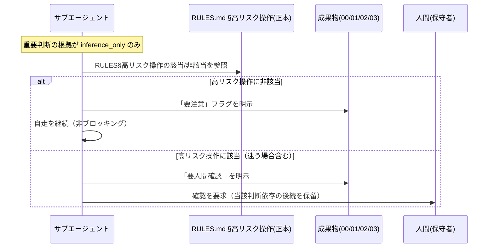

# 要件定義書: EVIDENCE_POLICY 節4 の二段階化（要注意／要人間確認の分岐）

**プロジェクト名**: EVIDENCE_POLICY 節4 の二段階化（要注意／要人間確認の分岐）
**作成日**: 2026 年 07 月 14 日
**最終更新**: 2026 年 07 月 14 日

> **重要**: **このドキュメントは常に更新**: 要件の変更や追加があった場合は、即座にこのドキュメントを更新してください。ドキュメントは「生きているドキュメント」として扱い、実装内容と常に同期させます。
>
> **用語**: [.agent-skill-chain/source/CONCEPTS.md §用語規約](../../../../.agent-skill-chain/source/CONCEPTS.md#用語規約) を参照。

---

## 1. 概要

### 1.1 システム概要

`.agent-skill-chain/source/EVIDENCE_POLICY.md` 節4 は、上流フェーズ（requirement-discovery / design-feature）を実行するサブエージェントが、根拠 `inference_only` のみの**重要判断**を成果物中で顕在化させる process 規約である。現状は一律「要人間確認」であり事実上ブロッキングとして働く。本 issue は、上位概念の正本 `CONCEPTS.md` L75 が既に許容している **二段階（承認不可＝要人間確認／要注意）** を節4 に実装する。ただし**危険性の判定基準は独自に作らず、既存の `RULES.md` L31 §高リスク操作（「不可逆または広範囲な影響を持つ操作」）を正本として参照**し、その該当／非該当で分岐する。高リスクに非該当（可逆・影響範囲が小さい）の判断では「要注意」フラグ明示のみで自走継続を許し、高リスクに該当する判断では「要人間確認」でブロックを維持する。

### 1.2 用語集

| 用語 | 説明 |
| -------- | ------ |
| 重要判断 | 採否が issue 成果物の構造・実現可能性・後続フェーズを左右する判断（EVIDENCE_POLICY 節3 定義）。 |
| inference_only | 外部観測なしの推論のみを根拠とする evidence_source（CONCEPTS.md が正本）。 |
| 高リスク操作 | 外部サービス・インフラへの書き込み、リポジトリやファイル群の大量削除・履歴改変など、**不可逆または広範囲な影響を持つ操作**（RULES.md L31 が正本。本 issue で再定義しない）。 |
| 要注意（軽・非ブロッキング） | 高リスク操作に**非該当**の inference_only 重要判断。成果物にフラグを明示すればサブエージェントは自走を継続してよい。 |
| 要人間確認（重・ブロッキング） | 高リスク操作に**該当**する inference_only 重要判断。人間の確認を得るまで自走を止める。 |
| ADR | Architecture Decision Records。EVIDENCE_POLICY 節2 が定める最小集合（コンテキスト・検討した選択肢・決定・根拠・帰結）。 |

---

## 2. 機能要件

### 2.1 ユーザーストーリー

#### ストーリー 1: 高リスク非該当・軽微判断での自走継続

- **As a** requirement-discovery / design-feature を実行するサブエージェント
- **I want to** 根拠が inference_only のみだが RULES.md §高リスク操作に該当しない（可逆かつ影響範囲の小さい）重要判断について「要注意」フラグを成果物に明示するだけで作業を続けたい
- **So that** 軽微な設計内選択のたびに人間応答待ちで停止せず、自走を継続できる

**受け入れ基準**:

- 改訂後 節4 に「RULES.md §高リスク操作に非該当 → 要注意（非ブロッキング）で自走継続してよい」分岐が明記されている（SC1, SC2）。
- 「要注意」時に成果物へ明示する内容（evidence_source=inference_only である旨・後続で再検討し得る旨）が定義されている。
- 危険性の判定基準を節4 で独自定義せず RULES.md §高リスク操作を参照する旨が明記されている（SC1）。

#### ストーリー 2: 高リスク該当判断でのブロック維持

- **As a** 上流フェーズを監督する人間（保守者）
- **I want to** RULES.md §高リスク操作に該当する判断（外部サービス・インフラへの書き込み・大量削除・履歴改変など不可逆または広範囲な影響）は従来どおり「要人間確認」で止めたい
- **So that** 二段階化によって高リスク判断が自走通過してしまう安全性劣化を防げる

**受け入れ基準**:

- 改訂後 節4 に「RULES.md §高リスク操作に該当 → 要人間確認（ブロッキング）」分岐が明記されている（SC3）。
- 適用条件は RULES.md §高リスク操作の定義を参照する形であり、節4 で独自の代表例を再発明していない（SC1, SC3）。
- 節1 の高リスク操作事前確認ルールを緩和しないことが担保されている。
- 分岐（該当／非該当）に迷う場合は重い側（要人間確認）に倒すデフォルトが明記されている。

#### ストーリー 3: 本改訂自体の ADR 記録

- **As a** 本 issue を実装するサブエージェント
- **I want to** この二段階化判断自体を EVIDENCE_POLICY 節2 の ADR 形式で 02_設計 に記録したい
- **So that** ポリシーの土台決定が根拠（evidence_source）付きで追跡可能になり、EVIDENCE_POLICY 自身のルールに自己適用できる

**受け入れ基準**:

- 02_設計 に、本二段階化を対象とした ADR（コンテキスト・検討した選択肢・決定・根拠（evidence_source 付き）・帰結）を記録する方針が 00／01 に明記されている（SC4）。
- ADR の「決定」に「危険性判定は RULES.md §高リスク操作を参照し、節4 で独自定義しない」ことが含まれる。

#### ストーリー 4: 参照元整合の確認

- **As a** 本 issue を設計・実装するサブエージェント
- **I want to** EVIDENCE_POLICY.md を参照する他ファイルへの影響を洗い出し、二段階の呼称・ブロッキング性の不整合を是正したい
- **So that** 正本間（CONCEPTS L75／verify-and-close L82／節4）で二段階の意味が揃い、誤運用を防げる

**受け入れ基準**:

- 参照元一覧が洗い出され（§2.3 ビジネスルール BR4 の grep 結果）、文言同期が必要な箇所と不要な箇所が 01 に整理されている（SC5）。
- CONCEPTS.md L75 は「承認不可または要注意」のまま変更不要である想定が検証され、結論が記録されている。
- verify-and-close.md L82 の「承認不可または要人間確認」（軽い側の呼称が潰れている不整合）を二段階化と整合するよう見直す方針が記録されている。

### 2.2 BDD ユースケース

#### ユースケース 1: inference_only のみの重要判断の顕在化分岐

サブエージェントが上流フェーズで重要判断を書く際、その根拠が inference_only のみだった場合の分岐挙動。分岐の軸は **RULES.md §高リスク操作の該当／非該当**である。

**シナリオ 1: 高リスク非該当 → 要注意で自走継続**

```gherkin
Feature: 節4 二段階化
  Scenario: RULES高リスク操作に該当しない inference_only 重要判断
    Given サブエージェントが design-feature を実行している
      And ある重要判断の根拠が inference_only のみである
      And その判断は RULES.md §高リスク操作に該当しない（可逆・影響範囲が小さい）
    When サブエージェントが改訂後の節4 に従って顕在化を判定する
    Then 成果物に「要注意（inference_only・後続で再検討し得る）」フラグを明示する
      And サブエージェントは人間の応答を待たずに自走を継続する
```

**シナリオ 2: 高リスク該当 → 要人間確認でブロック**

```gherkin
Feature: 節4 二段階化
  Scenario: RULES高リスク操作に該当する inference_only 重要判断
    Given サブエージェントが上流フェーズを実行している
      And ある重要判断の根拠が inference_only のみである
      And その判断は RULES.md §高リスク操作に該当する（外部サービス・インフラへの書き込み・大量削除・履歴改変など不可逆または広範囲な影響）
    When サブエージェントが改訂後の節4 に従って顕在化を判定する
    Then 成果物に「要人間確認」を明示する
      And サブエージェントは人間の確認を得るまで当該判断に依存する後続を進めない
```

**シナリオ 3: 該当／非該当が曖昧な場合の既定**

```gherkin
Feature: 節4 二段階化
  Scenario: RULES高リスク操作の該当判定に迷う
    Given ある inference_only 重要判断が RULES.md §高リスク操作に該当するか明確に判定できない
    When サブエージェントが節4 に従って分岐を選ぶ
    Then 重い側（要人間確認）に倒す
```

**処理フロー**:



#### ユースケース 2: 本改訂自体の ADR 記録

**シナリオ 1: 二段階化判断の ADR 化**

```gherkin
Feature: 改訂判断のADR記録
  Scenario: ポリシー土台決定を自己適用でADR化する
    Given 本 issue の改訂が EVIDENCE_POLICY 節3 の重要判断に該当する
    When design-feature で 02_設計 を執筆する
    Then 節2 の ADR 形式（コンテキスト・検討した選択肢・決定・根拠(evidence_source)・帰結）で二段階化判断を記録する
      And 「決定」に「危険性判定は RULES.md §高リスク操作を参照し節4 で独自定義しない」が含まれる
```

### 2.3 ビジネスルール

- **BR1（正本一元性・DRY）**: 危険性の判定基準の正本は **RULES.md L31 §高リスク操作**、二段階の**原則**の正本は **CONCEPTS.md L75**。節4 はそれらを上流 process へ接続する具体（顕在化と自走可否）を定義するのみで、危険性判定基準も二段階原則も**再定義しない**（単一責任）。本 issue の核心は、節4 が独自に「inference_only → 一律要人間確認」という危険性判定を再発明していた状態の是正である。
- **BR2（安全側デフォルト）**: RULES.md §高リスク操作の該当判定に迷う場合は「要人間確認（重）」に倒す。
- **BR3（高リスク非緩和）**: 「重（要人間確認）」の適用条件は RULES.md §高リスク操作の定義をそのまま参照するため、外部サービスへの破壊的操作・大量削除・履歴改変等は常に含まれる。二段階化は節1 の高リスク操作事前確認ルールを緩和しない。
- **BR4（参照元整合）**: EVIDENCE_POLICY.md 参照元（grep 実測）は下記。二段階の呼称・ブロッキング性に直接言及する箇所のみ同期是正の候補とし、ADR 形式・evidence_source 定義・RULES.md §高リスク操作本文など無関係な参照は変更しない。
  - `commands/design-feature.md` L72 — ADR 形式・evidence_source 付記の総論参照。節4 のブロッキング性を再記述していない → **変更不要想定**（design-feature で確認）。
  - `commands/requirement-discovery.md` L75 — evidence_source 付記の総論参照。→ **変更不要想定**。
  - `commands/verify-and-close.md` L82 — 「inference_only のみに依存する重要判断は**承認不可または要人間確認**とする」と記述。CONCEPTS L75 の「承認不可または**要注意**」と軽い側の呼称が不整合（軽い側＝要注意が潰れている） → **同期是正の主要候補**。事後検証（event）側の表現が上流 EVIDENCE_POLICY 節4 の二段階化と矛盾しないよう、「高リスク該当＝要人間確認／非該当＝要注意」と整合させる方針を design-feature の ADR で確定する。
  - `boot/LOAD_POLICY.md` L31 — 表の括弧書き「inference_only 顕在化」→ 二段階化を反映した表現に更新するか検討（軽微）。
  - `DOCS_RULES.md` L50 — 節5（greenfield ADR）参照。節4 と無関係 → **変更不要**。
  - `runtime/templates/02_設計.md` — 節2 ADR 参照。節4 と無関係 → **変更不要**。
  - `runtime/templates/docs/01_システム概要/05_規約/README.md`・`docs/01_システム概要/05_規約/README.md` — ADR/evidence_source の総論参照。節4 と無関係 → **変更不要想定**。
- **BR5（CONCEPTS・RULES 不変前提）**: CONCEPTS.md L75「承認不可または要注意」・RULES.md L31 §高リスク操作は、いずれも本 issue では変更せず参照するのみとする前提。変更が必要と判明した場合のみ design-feature で ADR として別途判断する。
- **BR6（自己拡張 §5 除外）**: `.agent-skill-chain/project/自己拡張ワークフロー.md:104`（§5 API 一時障害・認証失効時の運用）は本 issue の見直し対象から除外する（00 §5 に理由記載）。project ローカルのドラフト運用であり、その「要人間確認」は運用イベント起点で節4 の inference_only 顕在化とは別軸のため。

---

## 3. 非機能要件

### 3.1 パフォーマンス要件

- 該当なし（ポリシー文書改訂）。

### 3.2 セキュリティ要件

- 「重（要人間確認）」の適用条件は RULES.md §高リスク操作を参照するため高リスク操作（外部破壊的操作・大量削除・履歴改変等）を必ず含み、二段階化で高リスク判断の人間確認がバイパスされないこと（BR3）。

### 3.3 ユーザビリティ要件

- 分岐軸（RULES.md §高リスク操作の該当／非該当）を、サブエージェントが RULES.md を参照して一意に判定できる粒度で節4 に記述する（節4 では判定基準を再掲・再定義せず参照に留める）。迷う場合の既定（重い側）を明記する（BR2）。

### 3.4 可用性要件

- 該当なし。

---

## 4. 外部インターフェース要件

### 4.1 API 要件

- 該当なし（コード API を持たないポリシー文書改訂）。

### 4.2 データ形式要件

- evidence_source の 6 分類・ADR 最小集合の形式は既存定義（CONCEPTS.md／節2）を再利用し、本 issue で再定義しない。

---

## 5. 制約事項

- 既存版 EVIDENCE_POLICY.md・run_command.md の Constraints に従って本成果物（00/01）を執筆する（重要判断への evidence_source 付記）。本 issue の 00/01 中の重要判断の根拠は主に **existing_code**（EVIDENCE_POLICY.md 節4・RULES.md:31 §高リスク操作・CONCEPTS.md L75・verify-and-close.md L82・自己拡張ワークフロー §5 の実読）と **human_decision**（危険性判定は RULES.md §高リスク操作を参照せよというユーザー指摘）であり、inference_only のみではないため、00/01 自体は「要人間確認」ブロックの対象にならない。
- 危険性の判定基準は RULES.md §高リスク操作を正本として参照し、節4 内で独自に作らない（BR1）。
- 成果物は `docs/maintainer/workflow/20260714_065605_evidence_policy_二段階化/` 配下に置く（`.agent-skill-chain/project/自己拡張ワークフロー.md` の上書き定義）。
- audit.sh 機械チェック新設・自己拡張ワークフロー §5 はスコープ外（00 §5）。二段階化は process 規約（人手監査＋自己検証）として実装する。

---

## 6. 参考資料

### プロジェクトドキュメント

- [`00_要求定義.md`](./00_要求定義.md) - 要求定義
- [.agent-skill-chain/source/EVIDENCE_POLICY.md](../../../../.agent-skill-chain/source/EVIDENCE_POLICY.md) - 改訂対象（節2/節3/節4）
- [.agent-skill-chain/source/RULES.md](../../../../.agent-skill-chain/source/RULES.md) - 危険性判定の正本（L31 §高リスク操作）
- [.agent-skill-chain/source/CONCEPTS.md §外部根拠の必須化](../../../../.agent-skill-chain/source/CONCEPTS.md#外部根拠の必須化external-anchor) - 二段階原則の正本（L75）

### その他の参考資料

- 参照元 grep 実測結果（BR4 に列挙）。
- [.agent-skill-chain/source/spec/00_spec概要.md](../../../../.agent-skill-chain/source/spec/00_spec概要.md)・[01_設計原則.md](../../../../.agent-skill-chain/source/spec/01_設計原則.md)・[06_設計判断の優先順位.md](../../../../.agent-skill-chain/source/spec/06_設計判断の優先順位.md) - 設計原則・優先順位。

---

## 7. 前のステップ

この要件定義書は、以下のドキュメントを基に作成されています：

- **前**: [`00_要求定義.md`](./00_要求定義.md) - 要求定義フェーズ

---

## 8. 次のステップ

この要件定義書の承認後、以下のドキュメントを作成します：

- **次**: [`02_設計.md`](./02_設計.md) - 設計フェーズ
