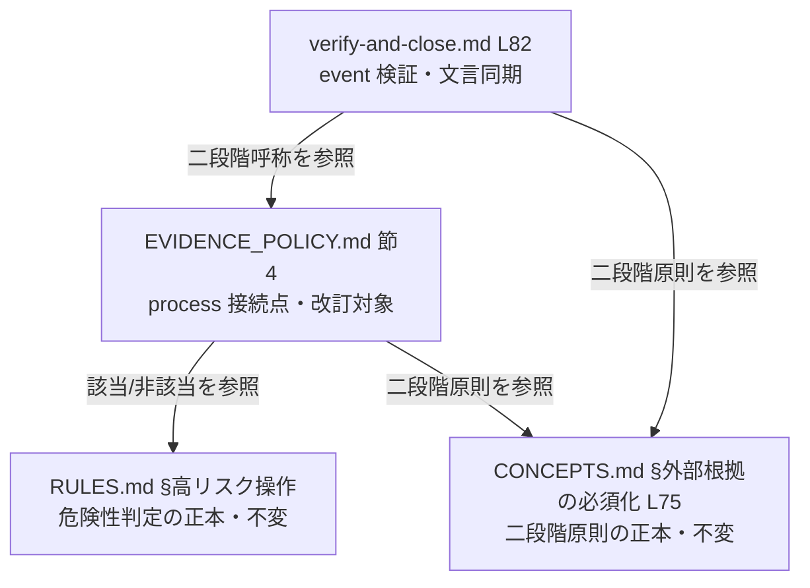
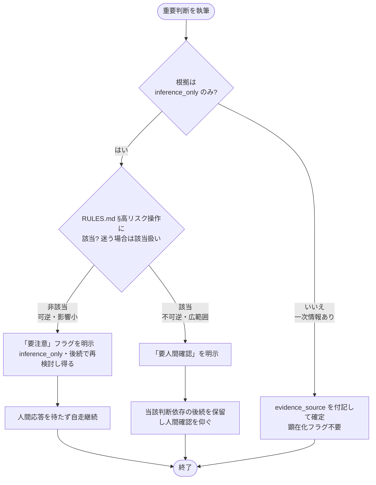

# 設計書: EVIDENCE_POLICY 節4 の二段階化（要注意／要人間確認の分岐）

**プロジェクト名**: EVIDENCE_POLICY 節4 の二段階化（要注意／要人間確認の分岐）
**作成日**: 2026 年 07 月 14 日
**最終更新**: 2026 年 07 月 14 日

> **重要**: **このドキュメントは常に更新**: 設計の変更や追加があった場合は、即座にこのドキュメントを更新してください。ドキュメントは「生きているドキュメント」として扱い、実装内容と常に同期させます。
>
> **用語**: [.agent-skill-chain/source/CONCEPTS.md §用語規約](../../../../.agent-skill-chain/source/CONCEPTS.md#用語規約) を参照。

---

## 1. 設計概要

本 issue は実行時コードを持たない **ポリシー文書（Markdown）の改訂**である。対象は `.agent-skill-chain/source/EVIDENCE_POLICY.md` 節4 の書き換えと、二段階の呼称に直接言及する参照元（`commands/verify-and-close.md` L82）の同期是正。ドメインモデル・DB・API・UI は存在しないため、それらの節は「該当なし」とする。

### 1.1 設計方針

危険性の判定基準・二段階の原則は既存の正本（RULES.md §高リスク操作／CONCEPTS.md §外部根拠の必須化 L75）に一元化し、EVIDENCE_POLICY 節4 は「上流 process へ接続する具体（顕在化と自走可否の分岐）」のみを担う。判定基準を節4 で再定義しない（DRY・正本一元化の回復）ことを最優先の設計方針とする。

### 1.2 設計原則（本プロジェクトで適用するもの）

- **単一責務**: 節4 は「inference_only 重要判断の顕在化と自走可否」の 1 責務のみ。危険性判定は RULES.md、二段階原則は CONCEPTS.md に委ね、節4 で再定義しない（[spec/01_設計原則 §単一責務](../../../../.agent-skill-chain/source/spec/01_設計原則.md)）。
- **明確な境界**: 「危険性判定の正本（RULES.md）」「二段階原則の正本（CONCEPTS.md L75）」「process 接続点（EVIDENCE_POLICY 節4）」「event 検証（verify-and-close）」の役割境界を崩さない。
- **UNIX 哲学（シンプルに保つ・1 つのことをうまくやる）**: 節4 の改訂は「一律要人間確認 → RULES.md 参照による二段階分岐」への最小差分に限定し、無関係な参照元へ波及させない。
- **AI フレンドリー設計**: 分岐軸を「RULES.md §高リスク操作の該当／非該当」の一意な参照に固定し、迷う場合の既定（重い側）を明示することで、サブエージェントが機械的に判定できる粒度にする。

---

## 2. アーキテクチャ設計

### 2.1 責務・境界・参照関係

#### 2.1.1 責務一覧

| コンポーネント（ファイル/節） | 責務（1 文） | 本 issue での扱い |
| ------ | ------ | ------ |
| `RULES.md` L31 §高リスク操作 | 危険性判定（不可逆／広範囲な影響か）の正本を定義する | **不変・参照のみ** |
| `CONCEPTS.md` §外部根拠の必須化 L75 | 二段階原則「承認不可または要注意」と evidence_source 6 分類の正本を定義する | **不変・参照のみ** |
| `EVIDENCE_POLICY.md` 節4 | inference_only のみの重要判断を、上記 2 正本を参照して二段階（要注意／要人間確認）に顕在化する process を接続する | **改訂（本 issue の主対象）** |
| `commands/verify-and-close.md` L82 | 事後（event）検証時に、inference_only 重要判断が二段階で正しく顕在化されているかを確認する | **文言同期是正** |
| `.agent-skill-chain/project/自己拡張ワークフロー.md` §5 (:104) | API 障害・認証失効という運用イベント起点のエスカレーション（別軸） | **対象外（§2.5 ADR-3 で妥当性再確認）** |

#### 2.1.2 境界

- **入力**: 上流フェーズ（requirement-discovery / design-feature）を実行するサブエージェントが書こうとしている「重要判断」と、その evidence_source。
- **出力**: 成果物（00/01/02/03）中の当該判断に付す顕在化フラグ（「要注意」または「要人間確認」）と、それに伴う自走継続／ブロックの挙動。
- **他責務との境界**: 危険性の判定基準そのもの（RULES.md）・二段階原則そのもの（CONCEPTS.md L75）・evidence_source の分類定義（CONCEPTS.md）は本 issue の**範囲外**（参照のみ）。CI/audit.sh による機械チェック新設も範囲外（00 §5）。verify-and-close の**検証ロジック・挙動**の変更も範囲外（L82 の文言同期のみ扱う）。

#### 2.1.3 参照関係

- `EVIDENCE_POLICY.md 節4` → `RULES.md §高リスク操作`（危険性判定を参照）
- `EVIDENCE_POLICY.md 節4` → `CONCEPTS.md §外部根拠の必須化 L75`（二段階原則を参照）
- `commands/verify-and-close.md L82` → `EVIDENCE_POLICY.md 節4` / `CONCEPTS.md §外部根拠の必須化`（二段階の呼称を参照）
- 参照方向は「具体（process/event）→ 正本（RULES / CONCEPTS）」の一方向。循環参照はない。

### 2.2 システムアーキテクチャ

- **採用パターン**: 「正本一元化＋参照」ドキュメントアーキテクチャ（1 ファイル 1 責務・正本 1 か所・参照 1 行。RULES.md §ドキュメント）。
- **根拠**: [spec/06_設計判断の優先順位](../../../../.agent-skill-chain/source/spec/06_設計判断の優先順位.md) の「単一責務 > 再利用」「docs と実装の不整合を放置しない」に従い、危険性判定・二段階原則を重複定義しない構造を選ぶ（[spec/01_設計原則 §単一責務・§明確な境界](../../../../.agent-skill-chain/source/spec/01_設計原則.md)）。

#### 2.2.1 CQRS

該当なし（状態変更を伴わないドキュメント改訂）。

#### 2.2.2 参照関係図（本プロジェクトの構成）

### 2.3 コンポーネント構成

改訂は 2 ファイルに閉じる。(1) `EVIDENCE_POLICY.md` 節4 の本文書き換え（分岐追加・正本参照の明示・stale 記述の除去）、(2) `verify-and-close.md` L82 の呼称是正。両者は独立して適用可能だが、二段階の呼称整合のため同一 issue で反映する。

### 2.4 データフロー

イベント駆動は該当なし。判定フロー（process）は §3.1 の処理フロー図を参照。

### 2.5 横断設計判断（ADR）

本改訂は EVIDENCE_POLICY 自身の節3 が定める **重要判断（ポリシーの土台決定）** に該当するため、節2 の ADR 形式で自己適用して記録する。

#### ADR-1: 節4 の危険性判定を RULES.md §高リスク操作の参照による二段階に是正する

- **コンテキスト**: 現行の EVIDENCE_POLICY 節4（L32）は inference_only のみの重要判断を**一律「要人間確認」**としており、事実上ブロッキングで上流フェーズのサブエージェントが自走を継続できない。一方、上位正本 CONCEPTS.md L75 は「承認不可または**要注意**」の二段階を許容し、危険性の判定基準は RULES.md L31 §高リスク操作に既に定義済みである。節4 はこれらを参照せず独自に「inference_only → 一律要人間確認」という粗いブロッキングを**再発明**していた（DRY 違反・過剰ブロック）。
- **検討した選択肢**:
  - **案 A（現状維持）**: 一律「要人間確認」を継続する。→ 自走停止問題が解消せず、CONCEPTS.md L75 の二段階と乖離したまま。
  - **案 B（節4 で独自二段階基準を新設）**: 節4 に「軽微／重大」の代表例・判定基準を独自に列挙して分岐する。→ 危険性判定が RULES.md と二重定義になり、両者が将来乖離するリスク・正本一元化違反。
  - **案 C（採用: RULES.md 参照による二段階）**: 危険性判定は RULES.md §高リスク操作の該当／非該当に委ね、節4 は「該当＝要人間確認（ブロッキング）／非該当＝要注意（非ブロッキング）／迷えば重い側」の接続だけを定義する。
- **決定**: 案 C を採用する。**危険性の判定基準は節4 で再定義せず RULES.md §高リスク操作（不可逆または広範囲な影響を持つ操作）を正本として参照**し、その該当／非該当で二段階に分岐する。判定に迷う場合は重い側（要人間確認）に倒す。二段階の原則の正本は CONCEPTS.md L75 とする。
- **根拠**:
  - evidence_source=**existing_code**: EVIDENCE_POLICY.md 節4 L32-34 の実読（現状が一律「要人間確認」であり、原則の正本を CONCEPTS.md に委譲済みだが判定基準の参照が欠落）。RULES.md L31 の実読（「不可逆または広範囲な影響を持つ操作」＝高リスク操作、非該当の日常作業は自立進行、が既に正本として定義済み）。CONCEPTS.md L75 の実読（「承認不可または要注意」の二段階を許容）。
  - evidence_source=**human_decision**: 「危険性判定を独自に作らず既存の RULES.md §高リスク操作を参照して二段階化せよ」というユーザー指摘（00 §1.2・タスク指示）。
  - 根拠は existing_code＋human_decision であり inference_only のみではないため、本 ADR 自体は要人間確認ブロックの対象ではない（節4 二段階基準を自己適用しても「要注意」相当ですらなく確定してよい）。
- **帰結**: 高リスク非該当の inference_only 重要判断はフラグ明示のみで自走継続可能になり過剰ブロックが解消する。高リスク該当判断は従来どおりブロックが維持され安全性は劣化しない。節4 は判定基準・二段階原則を保持しなくなり、RULES.md／CONCEPTS.md の更新に追随する（保守性向上）。verify-and-close L82 の呼称是正が必要になる（ADR-2）。

#### ADR-2: verify-and-close.md L82 の呼称を二段階と整合させる

- **コンテキスト**: verify-and-close.md L82 は「inference_only のみに依存する重要判断は**承認不可または要人間確認**とする」と記述し、CONCEPTS.md L75 の「承認不可または**要注意**」と比べ**軽い側の呼称が「要注意」→「要人間確認」に潰れている**。節4 を二段階化すると、event（事後検証）側の表現が process（節4）と矛盾する。
- **検討した選択肢**:
  - **案 A（据え置き）**: L82 を変えない。→ 三者（CONCEPTS L75／節4／L82）で二段階の軽い側の意味が不整合のまま残り、誤運用（本来「要注意」で通せる判断を event 側が「要人間確認」扱いする）を招く。
  - **案 B（採用: 二段階へ同期是正）**: L82 を「RULES.md §高リスク操作に該当＝要人間確認（ブロッキング）／非該当＝要注意（非ブロッキング）」の二段階表現に是正する。
- **決定**: 案 B。verify-and-close の**検証ロジック・挙動は変更せず**、L82 の文言のみを二段階と整合させる（event 側は「二段階で正しく顕在化されているか」を確認する役割に留める）。
- **根拠**: evidence_source=**existing_code**（verify-and-close.md L82・CONCEPTS.md L75 の実読による不整合確認）。BR4（参照元整合）で L82 を同期是正の主要候補と特定済み。
- **帰結**: CONCEPTS L75／節4／verify-and-close L82 の三者で二段階の呼称・意味が整合する。検証の仕組み自体は不変のため回帰リスクは文言に限定される。

#### ADR-3: 参照元の不変・除外を確定する（CONCEPTS L75／RULES §高リスク操作／LOAD_POLICY L31／自己拡張 §5）

- **コンテキスト**: EVIDENCE_POLICY.md 参照元を grep 実測済み（01 BR4）。どこまでを本 issue で触るかを確定する必要がある。
- **検討した選択肢**: (A) 参照元を広く同期改訂する / (B) 二段階の呼称・ブロッキング性に直接言及する箇所のみ是正し、他は不変とする。
- **決定**: 案 B。以下を確定する。
  - `CONCEPTS.md` L75「承認不可または要注意」= **変更不要**（二段階原則の正本であり既に二段階。節4 はこれを参照する側）。
  - `RULES.md` L31 §高リスク操作 = **変更不要**（危険性判定の正本。参照するのみ）。
  - `commands/design-feature.md` L72・`commands/requirement-discovery.md` L75 = **変更不要**（ADR 形式・evidence_source 付記の総論参照のみで、ブロッキング性を再記述していない。実読確認済み）。
  - `boot/LOAD_POLICY.md` L31 = **変更不要**（表の括弧書き「inference_only 顕在化」はブロッキング性・軽重の呼称に言及しておらず、二段階も「顕在化」に包含される。BR4 の限定原則に従い触らない）。
  - `DOCS_RULES.md` L50・`runtime/templates/02_設計.md`・各 `05_規約/README.md` = **変更不要**（節5 greenfield ADR／ADR 総論参照で節4 と無関係）。
  - `.agent-skill-chain/project/自己拡張ワークフロー.md` §5 (:104) = **対象外（除外妥当）**。同節の「要人間確認」は API 障害・認証失効という**運用イベント起点**のエスカレーションであり、inference_only 重要判断の顕在化とは別軸。加えて project ローカルのドラフト運用であり source 正本ではない（:104 付近を実読し、「実運用前に必ずユーザー明示確認」「ドラフト」明記を再確認済み）。
- **根拠**: evidence_source=**existing_code**（上記各ファイル・行の実読／grep 実測）。
- **帰結**: 改訂は `EVIDENCE_POLICY.md` 節4 と `verify-and-close.md` L82 の 2 ファイルに限定され、無関係な波及がない（KISS・単一責任）。

---

## 3. 機能設計

### 3.1 機能 1: 節4 二段階顕在化フロー（新文言＝実質的な契約）

#### 3.1.1 概要

サブエージェントが上流フェーズで重要判断を書く際、根拠が inference_only のみだった場合に、RULES.md §高リスク操作の該当／非該当で「要注意（非ブロッキング）」または「要人間確認（ブロッキング）」を選ぶ判定フロー。改訂後 節4 の本文がこの契約を定義する。

#### 3.1.2 処理フロー

#### 3.1.3 入力・出力

- **入力**: 重要判断・その evidence_source・RULES.md §高リスク操作の該当判定。
- **出力（改訂後 節4 の本文＝契約）**: 下記「新 節4 文言（案）」。実装（implement-feature）はこの文言を EVIDENCE_POLICY.md に反映する。

**新 節4 文言（案・実装時にこの主旨で反映する）**:

> ## 節4: inference_only のみの重要判断の執筆時顕在化（二段階）
>
> - 重要判断の根拠が **inference_only のみ**（一次情報に当たれなかった推論のみ）である場合、その判断が **RULES.md §高リスク操作**（不可逆または広範囲な影響を持つ操作）に該当するか否かを判定し、次の二段階で顕在化する。**危険性の判定基準は本節で再定義せず、RULES.md §高リスク操作を正本として参照する。**
>   - **要注意（非ブロッキング）**: RULES.md §高リスク操作に**該当しない**（可逆かつ影響範囲が小さい）場合。成果物中の当該判断に「要注意」フラグ（evidence_source=inference_only である旨・後続フェーズで再検討し得る旨）を明示する。明示のうえでサブエージェントは人間の応答を待たず**自走を継続してよい**。
>   - **要人間確認（ブロッキング）**: RULES.md §高リスク操作に**該当する**（不可逆または広範囲な影響）場合。成果物中の当該判断に「要人間確認」を明示し、**人間の確認を得るまで当該判断に依存する後続を進めない**。
>   - **迷う場合の既定**: 該当／非該当を明確に判定できない場合は、重い側（要人間確認）に倒す。
> - この二段階の**原則**の正本は [CONCEPTS.md §外部根拠の必須化](CONCEPTS.md#外部根拠の必須化external-anchor)（「inference_only のみの重要判断は承認不可または要注意」）、**危険性の判定基準**の正本は [RULES.md §高リスク操作](RULES.md) である。本節はこれらを上流の執筆プロセス（process）に接続するのみで、いずれも再定義しない。
> - 一次情報調査で高リスク操作を行う場合の事前確認は節1・既存ルール（CORE / RULES / enforcement）に従い、二段階化はこれを緩和しない。
> - **process と event の役割分担**: 本ファイル（EVIDENCE_POLICY.md）は執筆時点（process）の義務を、[commands/verify-and-close.md](commands/verify-and-close.md) は事後（event）の検証を担う。二段階の呼称（要注意／要人間確認）は両者で整合させる。

> **注**: 現行 L34 の「verify-and-close 側は本 issue で変更しない」という文言は、本改訂で L82 を同期是正するため**事実に反する歴史的記述**となる。上記のとおり役割分担の記述に置き換え、当該一文は除去する（DOCS_NOISE_RULES の「歴史的経緯を残さない」に整合）。

#### 3.1.4 エラーハンドリング

判定の曖昧さ（該当／非該当が不明）は「重い側（要人間確認）に倒す」既定で吸収する（安全側フォールバック）。

### 3.2 機能 2: verify-and-close.md L82 呼称是正（event 側同期）

- **概要**: L82 の「承認不可または要人間確認」を二段階と整合する表現に是正する。挙動・検証ロジックは変更しない。
- **新文言（案）**:

> - **重要判断・レビュー結論には根拠の種別（evidence_source）を記載する。inference_only のみに依存する重要判断は、RULES.md §高リスク操作に該当する場合は「要人間確認」（ブロッキング）、非該当の場合は「要注意」（非ブロッキング）とする（二段階）。** .agents の「外部根拠の必須化」（CONCEPTS.md §外部根拠の必須化）および EVIDENCE_POLICY.md 節4 を参照。

---

## 4. データ設計

該当なし（DB・データモデルを持たないポリシー文書改訂）。evidence_source 6 分類・ADR 最小集合の形式は既存定義（CONCEPTS.md／節2）を再利用し、本 issue で再定義しない。

---

## 5. API 設計

該当なし（コード API を持たない）。本設計における「契約」は §3.1.3 の**改訂後 節4 の本文**および §3.2 の**verify-and-close L82 の本文**であり、これらの文言が下流（サブエージェントの挙動・event 検証）に対するインターフェースに相当する。

---

## 6. テスト戦略

本成果物はドキュメント（ポリシー文書）であり、実行可能な単体／結合／E2E テストは持たない。したがって受け入れは **ドキュメント検証（人手監査＋自己検証）** で行う。観点定義は [RULES.md §テスト戦略必須要件](../../../../.agent-skill-chain/source/RULES.md#テスト戦略必須要件)、審査は review-docs（実装前）・verify-and-close（実装後）で担保する。

### 6.1 対象ごとのテスト割り当て

| 対象 | 単体 | 結合/API | E2E | クリティカル観点 | 受け入れ確認方法（ドキュメント） |
| ------ | ------ | ------ | ------ | ------ | ------ |
| 節4 二段階文言 | × | × | × | 二段階分岐・RULES.md 参照・迷えば重い側が明文化 | 改訂後 節4 を精読し SC1/SC2/SC3 の各条項の存在を目視確認 |
| 節4 正本一元化 | × | × | × | 危険性判定・二段階原則を再定義せず参照に留めている | 節4 本文に判定基準の独自定義・代表例列挙が無いことを目視確認（grep 「不可逆」「大量削除」等が節4 本文に無い） |
| ADR（本改訂の自己記録） | × | × | × | 節2 の 5 要素充足・evidence_source 付き | 02 §2.5 の ADR-1〜3 に コンテキスト/選択肢/決定/根拠(evidence_source)/帰結 が揃うことを確認（SC4） |
| verify-and-close L82 | × | × | × | 二段階呼称整合・挙動不変 | L82 新文言に「要注意（非ブロッキング）／要人間確認（ブロッキング）」二段階が入り、検証ロジック記述が変わっていないことを確認（SC5） |
| 参照元不変の確定 | × | × | × | 触るのは節4／L82 の 2 ファイルのみ | `git diff --name-only` が該当 2 ファイル（＋docs）に限定されることを確認（SC5・BR4） |

> **単体テスト（コード）が × である理由**: 対象が Markdown ポリシー文書であり実行コードを含まないため。RULES §テスト戦略の「未達時は理由を記載」に従い理由を明記する。機械チェック（audit.sh）による検証新設は 00 §5 でスコープ外と確定済み。

### 6.2 監査・レビューでの確認（証跡）

- **review-docs（実装前・必須ゲート）**: 本 02/03 完了後・implement-feature 着手前に、01 の BDD（§2.2 ユースケース 1・2）と 03 のタスク別テスト観点の対応、SC1〜SC6 の網羅を確認する。
- **verify-and-close（実装後）**: 04_review に、上表の各受け入れ確認方法の結果（○/×・確認箇所）を記載する。

---

## 7. UI 設計

該当なし。

---

## 8. セキュリティ設計

- **高リスク非緩和（BR3）**: 「要人間確認（ブロッキング）」側の適用条件は RULES.md §高リスク操作を参照するため、外部サービス・インフラへの書き込み・大量削除・履歴改変等の高リスク操作は必ず含まれる。二段階化により高リスク判断の人間確認がバイパスされないこと（節1 の高リスク操作事前確認ルールを緩和しない）を、SC3・§6.1 で担保する。

---

## 9. 非機能要件への対応

### 9.1 保守性

正本一元化（危険性判定＝RULES.md／二段階原則＝CONCEPTS.md L75／process 接続＝節4／event 検証＝verify-and-close）を回復・維持する。節4 が判定基準を保持しなくなるため、RULES.md の更新に自動追随する。

### 9.2 互換性

evidence_source 6 分類・ADR 最小集合は不変。二段階化は節4 内部の分岐追加であり、他節（節1/2/3/5）の責務境界を変えない。CONCEPTS.md L75・RULES.md §高リスク操作は変更しない。

---

## 10. 参考資料

### プロジェクトドキュメント

- [`00_要求定義.md`](./00_要求定義.md) - 要求定義
- [`01_要件定義.md`](./01_要件定義.md) - 要件定義
- [`03_実装計画.md`](./03_実装計画.md) - 実装計画
- [.agent-skill-chain/source/EVIDENCE_POLICY.md](../../../../.agent-skill-chain/source/EVIDENCE_POLICY.md) - 改訂対象（節2/節3/節4）
- [.agent-skill-chain/source/RULES.md](../../../../.agent-skill-chain/source/RULES.md) - 危険性判定の正本（L31 §高リスク操作）
- [.agent-skill-chain/source/CONCEPTS.md §外部根拠の必須化](../../../../.agent-skill-chain/source/CONCEPTS.md#外部根拠の必須化external-anchor) - 二段階原則の正本（L75）
- [.agent-skill-chain/source/commands/verify-and-close.md](../../../../.agent-skill-chain/source/commands/verify-and-close.md) - event 側（L82 同期是正）

### その他の参考資料

- [.agent-skill-chain/source/spec/01_設計原則.md](../../../../.agent-skill-chain/source/spec/01_設計原則.md)・[06_設計判断の優先順位.md](../../../../.agent-skill-chain/source/spec/06_設計判断の優先順位.md) - 設計原則・優先順位。

---

## 11. 前のステップ

この設計書は、以下のドキュメントを基に作成されています：

- **前**: [`01_要件定義.md`](./01_要件定義.md) - 要件定義フェーズ

---

## 12. 次のステップ

この設計書の承認後、以下のドキュメントを作成します：

- **次**: [`03_実装計画.md`](./03_実装計画.md) - 実装計画フェーズ
