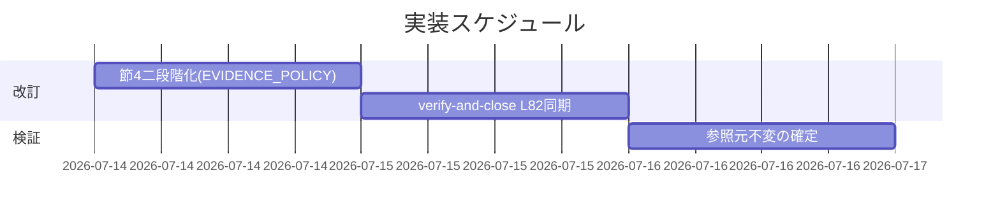

# 実装計画書: EVIDENCE_POLICY 節4 の二段階化（要注意／要人間確認の分岐）

**プロジェクト名**: EVIDENCE_POLICY 節4 の二段階化（要注意／要人間確認の分岐）
**作成日**: 2026 年 07 月 14 日
**最終更新**: 2026 年 07 月 14 日

> **重要**: **このドキュメントは常に更新**: 実装計画の変更、進捗状況の更新、バグの記録などがあった場合は、即座にこのドキュメントを更新してください。ドキュメントは「生きているドキュメント」として扱い、実装内容と常に同期させます。
> **必須項目**: 「必須」と明記した欄は空欄・抽象語のみで提出しないこと。
>
> **用語**: [.agent-skill-chain/source/CONCEPTS.md §用語規約](../../../../.agent-skill-chain/source/CONCEPTS.md#用語規約) を参照。

---

## 1. 実装概要

### 1.1 実装方針（必須）

02_設計 §3 の新文言（案）に従い、`EVIDENCE_POLICY.md` 節4 を「一律要人間確認」から「RULES.md §高リスク操作の該当／非該当による二段階（要注意／要人間確認）」へ書き換え、`verify-and-close.md` L82 の呼称を二段階と整合させる。改訂は 2 ファイルに限定し、危険性判定基準・二段階原則・evidence_source 定義は再定義せず参照に留める（DRY）。

### 1.2 実装順序（必須: 1 件以上）

1. **タスク 1**: `EVIDENCE_POLICY.md` 節4 本文の二段階化書き換え（stale 記述除去含む）。
2. **タスク 2**: `verify-and-close.md` L82 の呼称同期是正。
3. **タスク 3**: 参照元不変の確定検証（差分が 2 ファイル＋docs に限定されることの確認）。



---

## 2. タスク分解

**必須**: 各タスクには「テスト観点」（2.x.3）と「単体テスト仕様（BDD）」（2.x.4）を記載する。本 issue はドキュメント改訂であり実行コードの単体テストを持たないため、2.x.4 は BDD（受け入れシナリオ）の記述と、コードテストが × である理由を記載する（RULES §テスト戦略「未達時は理由を記載」）。

### 2.1 タスク 1: EVIDENCE_POLICY.md 節4 の二段階化書き換え

#### 2.1.1 概要（必須）

節4 を、RULES.md §高リスク操作の該当／非該当で「要注意（非ブロッキング）／要人間確認（ブロッキング）」に分岐する二段階文言へ書き換える。

#### 2.1.2 実装内容（必須: 1 件以上）

- 節4 見出しを「inference_only のみの重要判断の執筆時顕在化（二段階）」に更新する。
- 現行 L32 の「一律『要人間確認』」を、二段階分岐（要注意／要人間確認／迷えば重い側）に置き換える（02 §3.1.3 の新文言案）。
- 「危険性の判定基準は本節で再定義せず RULES.md §高リスク操作を正本として参照する」旨、および二段階原則の正本が CONCEPTS.md L75 である旨を明記する。
- 現行 L34 の「verify-and-close 側は本 issue で変更しない」という歴史的記述を除去し、二段階の呼称を両者で整合させる旨の役割分担記述に置き換える。
- 節1 の高リスク操作事前確認を緩和しない旨を維持する。

#### 2.1.3 テスト観点（必須）

**参照**: 観点定義は [02_設計 §6](./02_設計.md)・[RULES テスト戦略](../../../../.agent-skill-chain/source/RULES.md#テスト戦略必須要件)。以下は本タスクの具体ケース。

##### 単体（本タスクの具体ケース）

- 該当なし（実行コードを含まない Markdown 改訂のため。受け入れは §2.1.4 のドキュメント確認で行う）。

##### 結合/API（本タスクの具体ケース）

- 該当なし。

##### E2E/受け入れ（ドキュメント受け入れ確認・必須）

- 改訂後 節4 に「RULES.md §高リスク操作に非該当 → 要注意（非ブロッキング）で自走継続」分岐が存在する（SC1・SC2／ストーリー 1）。
- 改訂後 節4 に「該当 → 要人間確認（ブロッキング）」分岐と「迷う場合は重い側」既定が存在する（SC3／ストーリー 2）。
- 節4 本文に危険性判定基準の独自定義・代表例列挙が**無い**（`grep -n "大量削除\|履歴改変\|不可逆" EVIDENCE_POLICY.md` の一致が**節4 本文に出ないこと**。列挙は RULES.md 側のみ）（SC1・BR1）。**注**: 現行 節1 L11 は一次情報調査の文脈で「大量削除等」に既存言及しており、これは正当な既存記述のため grep は節4 本文範囲に限定して評価する（節1 L11 のヒットは対象外）。
- 「verify-and-close 側は本 issue で変更しない」の一文が節4 から除去されている。

##### バリデーション

- 該当なし。

#### 2.1.4 単体テスト仕様（BDD）（必須）

**BDD 受け入れシナリオ（01 §2.2 ユースケース 1 に対応）**:

```gherkin
Feature: 節4 二段階化
  Scenario: 高リスク非該当 → 要注意で自走継続
    Given 改訂後の EVIDENCE_POLICY.md 節4
    When 節4 本文を精読する
    Then 「RULES.md §高リスク操作に非該当 → 要注意（非ブロッキング）で自走継続してよい」分岐が明記されている

  Scenario: 高リスク該当 → 要人間確認でブロック
    Given 改訂後の EVIDENCE_POLICY.md 節4
    When 節4 本文を精読する
    Then 「RULES.md §高リスク操作に該当 → 要人間確認（ブロッキング）」分岐と「迷えば重い側」既定が明記されている

  Scenario: 正本一元化（判定基準の非再定義）
    Given 改訂後の EVIDENCE_POLICY.md 節4
    When 節4 本文で危険性判定の代表例（大量削除・履歴改変・不可逆 等）を grep する
    Then 節4 本文に独自の代表例列挙が無く、RULES.md §高リスク操作への参照のみが存在する
```

> **コードテストが該当なしの理由**: 対象が Markdown ポリシー文書で実行コードを含まないため（RULES §テスト戦略「未達時は理由を記載」）。受け入れは上記シナリオの目視／grep 確認（review-docs・verify-and-close）で担保する。

#### 2.1.5 依存関係

- なし（先頭タスク）。

#### 2.1.6 見積もり

- **工数**: 約 0.5h
- **優先度**: 高

### 2.2 タスク 2: verify-and-close.md L82 の呼称同期是正

#### 2.2.1 概要（必須）

L82 の「承認不可または要人間確認」を、二段階（要人間確認＝ブロッキング／要注意＝非ブロッキング）と整合する表現に是正する。検証ロジック・挙動は変更しない。

#### 2.2.2 実装内容（必須: 1 件以上）

- L82 を 02 §3.2 の新文言案に置き換える（RULES.md §高リスク操作の該当／非該当による二段階を明示し、EVIDENCE_POLICY.md 節4・CONCEPTS.md §外部根拠の必須化を参照）。
- 当該行以外の verify-and-close の記述（検証ロジック・skill chain・書記手順）は変更しない。

#### 2.2.3 テスト観点（必須）

##### 単体 / 結合/API

- 該当なし（Markdown 改訂）。

##### E2E/受け入れ（ドキュメント受け入れ確認・必須）

- L82 新文言に「要人間確認（ブロッキング）」と「要注意（非ブロッキング）」の二段階が含まれる（SC5／ストーリー 4）。
- L82 が RULES.md §高リスク操作の該当／非該当を分岐軸として参照している。
- verify-and-close の他行（検証ロジック・step 5 書記）に差分が無い（挙動不変。02 ADR-2）。

##### バリデーション

- 該当なし。

#### 2.2.4 単体テスト仕様（BDD）（必須）

**BDD 受け入れシナリオ（01 §2.2 ストーリー 4 に対応）**:

```gherkin
Feature: verify-and-close 呼称同期
  Scenario: L82 の二段階整合
    Given 改訂後の commands/verify-and-close.md
    When L82 の重要判断・evidence_source 記述を精読する
    Then 「該当=要人間確認(ブロッキング)/非該当=要注意(非ブロッキング)」の二段階呼称になっている
      And 「承認不可または要人間確認」という軽い側が潰れた旧表現が残っていない

  Scenario: 挙動不変
    Given 改訂後の commands/verify-and-close.md
    When L82 以外の行を diff で確認する
    Then 検証ロジック・skill chain・書記手順に変更が無い
```

> **コードテストが該当なしの理由**: タスク 1 と同じくポリシー/コマンド文書改訂のため。

#### 2.2.5 依存関係

- タスク 1（節4 の二段階呼称の確定）に整合させるため、タスク 1 の後に行う。

#### 2.2.6 見積もり

- **工数**: 約 0.2h
- **優先度**: 高

### 2.3 タスク 3: 参照元不変の確定検証

#### 2.3.1 概要（必須）

02 ADR-3 で「変更不要／対象外」と確定した参照元（CONCEPTS L75・RULES §高リスク操作・LOAD_POLICY L31・design-feature/requirement-discovery・DOCS_RULES・templates・自己拡張 §5）に差分が生じていないことを確認する。

#### 2.3.2 実装内容（必須: 1 件以上）

- 改訂後、`git diff --name-only` を実行し、変更ファイルが `EVIDENCE_POLICY.md`・`commands/verify-and-close.md`（＋本 issue の docs）に限定されることを確認する。
- CONCEPTS.md L75・RULES.md L31・自己拡張ワークフロー §5 に差分が無いことを確認する。

#### 2.3.3 テスト観点（必須）

##### E2E/受け入れ（ドキュメント受け入れ確認・必須）

- `git diff --name-only` の source 側変更が 2 ファイルのみ（SC5・BR4・BR5）。
- ADR-3 で不変と決めた各ファイルが diff に現れない。

##### 単体 / 結合/API / バリデーション

- 該当なし。

#### 2.3.4 単体テスト仕様（BDD）（必須）

```gherkin
Feature: 参照元不変の確定
  Scenario: 改訂範囲が 2 ファイルに限定される
    Given 節4・L82 の改訂を適用した作業ツリー
    When git diff --name-only を実行する
    Then source 配下の変更は EVIDENCE_POLICY.md と commands/verify-and-close.md のみである
      And CONCEPTS.md・RULES.md・自己拡張ワークフロー.md に差分が無い
```

> **コードテストが該当なしの理由**: git 差分の目視確認による受け入れであり、実行コードの単体テスト対象を持たないため。

#### 2.3.5 依存関係

- タスク 1・2 の完了後。

#### 2.3.6 見積もり

- **工数**: 約 0.1h
- **優先度**: 中

---

## テスト観点

本 issue は実行コードを持たないポリシー文書改訂のため、コードの単体／結合／E2E テストは全タスクで「該当なし（理由記載）」。受け入れは **ドキュメント検証**（節4／L82 の新文言に必須条項が存在するかの目視＋grep、および git diff による改訂範囲限定の確認）で行い、review-docs（実装前）・verify-and-close（実装後）で証跡化する。SC1〜SC6 と 01 の BDD ユースケース 1・2 を各タスクの受け入れシナリオでカバーする。

---

## 単体テスト

コードの単体テストは対象外（Markdown ポリシー文書改訂）。代替として各タスク §2.x.4 の BDD 受け入れシナリオ（目視／grep／git diff による検証）を単体相当の受け入れ手段とする。

---

## BDD

各タスク §2.x.4 に Gherkin シナリオを記載。01 §2.2 との対応は下表（4. テスト計画）を参照。

---

## 3. 実装スケジュール

### 3.1 マイルストーン

| マイルストーン | 期日 | 成果物 |
| ------ | ------ | ------ |
| 節4 二段階化反映 | 2026-07-14 | 改訂後 EVIDENCE_POLICY.md |
| L82 同期・範囲確定 | 2026-07-14 | 改訂後 verify-and-close.md・git diff 確認結果 |

### 3.2 実装フェーズ

#### フェーズ 1: 改訂

- **タスク**: タスク 1・タスク 2

#### フェーズ 2: 検証

- **タスク**: タスク 3（＋ review-docs・verify-and-close）

---

## 4. テスト計画

本実装計画では各タスクの §2.x.3・§2.x.4 に受け入れ観点／BDD を記載する。01 の BDD・成功基準との対応は下表。

### 4.0 01 の BDD／SC とタスク・受け入れシナリオの対応表

| 01 ユースケース / ストーリー | 成功基準 | 対応タスク | 受け入れシナリオ |
| ------ | ------ | ------ | ------ |
| UC1 シナリオ1（非該当→要注意で自走） / ストーリー1 | SC1・SC2 | タスク 1 | 2.1.4「高リスク非該当 → 要注意で自走継続」 |
| UC1 シナリオ2（該当→要人間確認） / ストーリー2 | SC3 | タスク 1 | 2.1.4「高リスク該当 → 要人間確認でブロック」 |
| UC1 シナリオ3（迷えば重い側） | SC3 | タスク 1 | 2.1.4 内「迷えば重い側」条項確認 |
| 正本一元化（BR1・判定基準の非再定義） | SC1 | タスク 1 | 2.1.4「正本一元化（判定基準の非再定義）」 |
| UC2（本改訂の ADR 記録） / ストーリー3 | SC4 | 02 §2.5（ADR-1〜3） | 02 §6.1「ADR」行の目視確認 |
| ストーリー4（参照元整合） | SC5 | タスク 2・タスク 3 | 2.2.4・2.3.4 |
| 除外要件（audit.sh／自己拡張§5） | SC6 | — | 00 §5・02 ADR-3 で確定済み |

### 4.1 テストの優先順位

- クリティカル: 節4 の二段階分岐（SC1〜SC3）と高リスク非緩和（BR3・SC3）を最優先で確認する。
- 回帰: verify-and-close の検証ロジック不変（02 ADR-2）を必ず diff で確認する。

---

## 5. リスク管理

### 5.1 実装リスク

- **リスク**: 節4 書き換え時に危険性判定の代表例を節4 本文へ書き込み、RULES.md と二重定義してしまう（DRY 違反の再発）。
  - **対策**: 節4 には「RULES.md §高リスク操作を参照する」旨のみを書き、代表例列挙は行わない。2.1.3 の grep 受け入れで検出する。
- **リスク**: L82 の是正が検証ロジックまで波及して verify-and-close の挙動を変える。
  - **対策**: L82 の 1 行のみを対象とし、他行の diff が無いことを 2.2.3・タスク 3 で確認する。
- **リスク**: 「要注意」で自走許容する範囲が広がり、本来止めるべき判断が通過する。
  - **対策**: 迷う場合は重い側（要人間確認）に倒す既定を節4 に明記（02 ADR-1・BR2）。適用条件は RULES.md §高リスク操作をそのまま参照（BR3）。

---

## 6. 参考資料

### プロジェクトドキュメント

- [`02_設計.md`](./02_設計.md) - 設計
- [`01_要件定義.md`](./01_要件定義.md) - 要件定義
- [`00_要求定義.md`](./00_要求定義.md) - 要求定義

### その他の参考資料

- [.agent-skill-chain/source/EVIDENCE_POLICY.md](../../../../.agent-skill-chain/source/EVIDENCE_POLICY.md)・[RULES.md](../../../../.agent-skill-chain/source/RULES.md)・[CONCEPTS.md](../../../../.agent-skill-chain/source/CONCEPTS.md)・[commands/verify-and-close.md](../../../../.agent-skill-chain/source/commands/verify-and-close.md)

---

## 7. 前のステップ

この実装計画書は、以下のドキュメントを基に作成されています：

- **前**: [`02_設計.md`](./02_設計.md) - 設計フェーズ

---

## 8. 次のステップ

この実装計画書の承認後、以下のステップに進みます：

- 本 issue は 1 issue で完結する（サブ issue 分割なし）。**implement-feature 着手前に review-docs（実装前ドキュメントレビュー）を必須で経る**。
