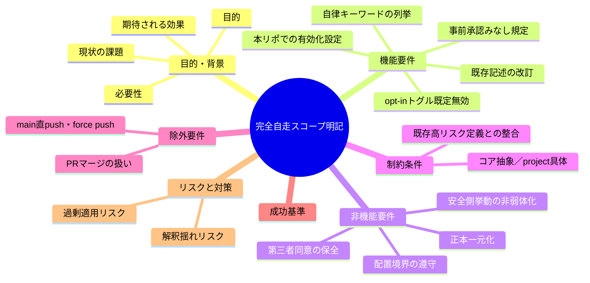
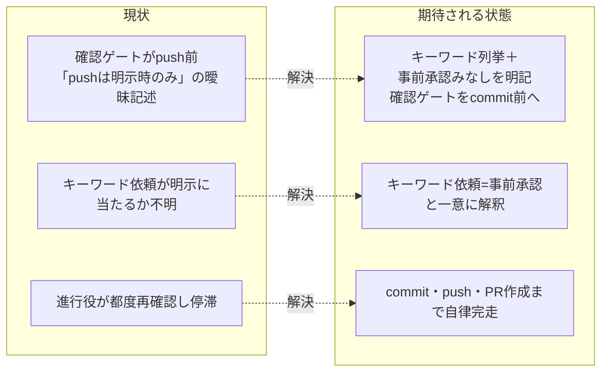

# 要求定義書: 完全自走スコープへの push・PR 作成明記

**プロジェクト名**: 完全自走スコープへの push・PR 作成明記
**作成日**: 2026 年 07 月 14 日
**最終更新**: 2026 年 07 月 14 日

> **重要**:
>
> - 要求定義書は、プロジェクトの全体像を把握するためのものです。詳細な技術仕様や実装方法は要件定義書以降で記載します。必要最低限の情報に収めることを心掛けてください。
> - **このドキュメントは常に更新**: 要求の変更や追加があった場合は、即座にこのドキュメントを更新してください。
>
> **用語**: [.agent-skill-chain/source/CONCEPTS.md §用語規約](../../../../.agent-skill-chain/source/CONCEPTS.md#用語規約) を参照。

---

## 要求定義の全体像

**注意**:

- マインドマップは全体像を把握するためのものです。主要なセクション名程度に留めます。

---

## 1. 目的・背景

### 1.1 目的（必須）

自律実行キーワードを含む依頼では commit・push・PR 作成までを事前承認みなしのスコープと明記する。あわせて、キーワードを含まない通常依頼における確認のゲートを **push 前から commit 前**へ移す（commit を作る前に確認し、承認後は commit・push・PR 作成まで一連で進めてよい）。

**ただし、この事前承認みなし・確認ゲート前倒し・承認カスケードの一式は、配布物本体（`.agent-skill-chain/source/`）へ無条件の恒常ルールとして組み込むのではなく、既定無効の opt-in トグル（env `AUTONOMOUS_SCOPE_COMMIT_PUSH_PR_ENABLED`・既定 `false`）の背後に置く。** 明示的に opt-in（`true`／`1`／`yes`／`on`）した消費先プロジェクトでのみ発動し、未設定・無効のプロジェクトではフレームワーク既定の安全側挙動（commit・push・PR 作成をユーザーの明示なしに自律実行せず確認する）が完全に維持される。本リポジトリ（AGENTS.md パッケージの正本・自己拡張元）では、この機能を明示的に有効化する。

### 1.2 背景

- **現状の課題**:
  - `.agent-skill-chain/source/CLOSEOUT.md` §commit ステップ（L15）に「**push はユーザーが明示したときのみ**行う（高リスク操作。RULES.md §高リスク操作 参照）」とあり、`.agent-skill-chain/source/RULES.md` §高リスク操作（L31）は「外部サービス・インフラへの書き込み…を高リスク操作と定義し、これらを含む command / capability を実行する場合、メインエージェントは実行前にユーザーの**明示的な確認**を必須とする」と定める（evidence_source: existing_code — 両ファイルを実読）。
  - この既存記述は、ユーザーが「完全自走で完遂して」等の明確なキーワードで依頼した場合に、push（および後続の PR 作成）が既に「ユーザー明示」に該当するのか、別途都度確認が必要なのかが**曖昧**なまま残っている。
  - 本セッションで進行役が 3 件の issue を実装・レビュー・ローカルコミットまで完了させた後、push・PR 作成の可否を 2 回ユーザーへ再確認し、ユーザーから「完全自走といったはずです。PR 作成までがあなたの責務のはずです。完走・自走と言ったら基本的に PR 作成までを指します」という趣旨のフィードバックを受けた（evidence_source: human_decision — ユーザー発話原文）。
  - さらに、確認のゲート位置そのものについて、ユーザーは「push 前確認ではなく、commit 前確認にするべきです」と指摘した。すなわち、既存 CLOSEOUT.md L15 の「**push はユーザーが明示したときのみ**行う」という**確認ゲートの位置**を、push 時点から **commit 時点**へ改めるべき、という指摘である（evidence_source: human_decision — ユーザー発話原文）。
  - **第三者同意問題（opt-in 化の直接原因）**: 本規定を配布物本体（`.agent-skill-chain/source/`）へ無条件の恒常ルールとして追加しようとしたところ、Claude Code の auto mode 分類器が当該変更を 3 回連続でブロックした。最終的な指摘理由は、「配布物本体への恒常ルール追加は、このリポジトリの所有者がいくら明示承認しても、まだこのフレームワークを導入・合意していない第三者（消費先プロジェクトの利用者）にも自律的な commit・push・PR 作成を既定で適用することになり、第三者の同意を代弁してしまう。これは『誰が依頼しても関係なくブロックされ続ける』種類の指摘（Instruction Poisoning）である」というものであった（evidence_source: human_decision — 実装フェーズでの auto mode 分類器の指摘内容と、それを受けたユーザーの解決方針決定）。
  - この指摘を受け、ユーザーは「opt-in 化して source/ に組み込む」＝**配布はするが既定は無効、消費先プロジェクトが明示的に opt-in した場合のみ有効**、という設計方針を決定した（evidence_source: human_decision — ユーザー発話原文）。本リポジトリの `.agent-skill-chain/project/自己拡張ワークフロー.md` に既に先例がある `GITHUB_ISSUE_GATE_ENABLED`（既定 `true`・env で無効化可能）と同型のトグルだが、**既定値の向きが逆（既定 `false`・env で明示有効化しないと発動しない）**である点が異なる（evidence_source: existing_code — 自己拡張ワークフロー.md §8・§ブランチ紐づけ／PR 紐づけの無効化トグルを実読）。

- **必要性**:
  - 曖昧さを解消し、自律実行キーワードを含む依頼＝commit・push・PR 作成の事前承認とみなす旨を規約本文に明記して、進行役が過剰確認で停滞・往復するのを防ぐ必要がある。
  - あわせて、確認が必要な通常依頼では、確認のゲートを **push 前ではなく commit 前**に置く。ユーザーの意図は「commit を作る前に承認を得る（承認後は commit・push・PR 作成まで一連で進めてよい）」である。
  - **同時に、上記挙動を配布物本体へ無条件に組み込むと第三者の同意を代弁してしまう（前述の第三者同意問題）ため、既定無効の opt-in トグルの背後に置く必要がある。** これにより、opt-in した消費先（および本リポジトリ）でのみ発動し、それ以外のプロジェクトの挙動は一切変えない。

### 1.3 期待される効果（必須: 1 件以上）

- **効果 1**: opt-in を有効化した消費先（本リポジトリを含む）で、自律実行キーワードを含む依頼を受けた進行役が、実装後に commit・push・PR 作成の可否を再確認せず、依頼スコープの一部として自律的に完走できる（規約本文でキーワードと事前承認みなしが判定可能な形で明記されているか○/×で判定できる）。
- **効果 2**: opt-in を有効化した消費先で、キーワードを含まない通常依頼では commit を作成する前にユーザー確認が行われ（確認ゲートを commit 時点に置く）、安全側挙動が保たれる（改訂後も無キーワード時の確認要件が残存し、かつゲートが commit 前であるか○/×で判定できる）。
- **効果 3（第三者同意の保全・opt-in の主眼）**: opt-in を有効化していない消費先プロジェクトの挙動は一切変わらず、フレームワーク既定の安全側挙動（自律 push・PR 作成を行わず確認する）が完全に維持される（トグル未設定・無効時に事前承認みなし・承認カスケードが発動しないことが規約本文で判定可能か○/×で判定できる）。

**現状と期待される状態の比較**:

---

## 2. 機能要件

### 2.1 既存機能の維持（該当する場合）

- `.agent-skill-chain/source/RULES.md` §高リスク操作の「高リスク操作の定義」および「通常の日常作業は逐一許可確認しない」という既存の枠組みは維持する。
- キーワードを含まない通常の作業依頼における確認要件そのものは維持する。ただし確認の**タイミング**は push 前から **commit 前**へ移す（安全側挙動を弱めず、ゲート位置のみを前倒しする）。

### 2.2 新規機能要件

- `.agent-skill-chain/source/RULES.md` §高リスク操作（および `.agent-skill-chain/source/CLOSEOUT.md` §commit ステップ）を改訂し、次を明記する:
  - **opt-in トグル（既定無効）**: 下記の事前承認みなし・確認ゲート前倒し・承認カスケードの一式は、env `AUTONOMOUS_SCOPE_COMMIT_PUSH_PR_ENABLED`（既定 `false`）を明示的に有効（`true`。`1`／`yes`／`on` も同義・大小文字不問）にした消費先プロジェクトでのみ発動する。未設定・無効（`false`／`0`／`no`／`off`）の場合は発動せず、フレームワーク既定の安全側挙動が維持される旨を明記する。既存 `GITHUB_ISSUE_GATE_ENABLED`・`BRANCH_LINK_GATE_ENABLED`・`PR_LINK_GATE_ENABLED` の命名・真偽値解釈パターンを踏襲しつつ、**既定値の向きが逆（既定 `false`）**である点を明記する。
  - **自律実行キーワードの列挙**: 「完走・完遂・自走・完全自走・auto mode」および類する表現（洗い出しは 01 で確定）を、ユーザーが明示的に自律実行を依頼したと解釈できる表現として列挙する。
  - **事前承認みなし規定**: opt-in 有効時、これらのキーワードを含む依頼を受けた場合、commit・push・PR 作成（GitHub Issue との紐づけを含む一連の完了までの作業）は、その依頼自体がユーザー明示の事前承認とみなされ、都度の追加確認は不要である旨。
  - **適用範囲**: 事前承認とみなされる対象は commit・push・PR 作成（および PR 本文への `Closes #<番号>` 埋め込み等、既存ゲートで規定された PR 作成に付随する作業）までであることを明示する。
  - **確認ゲートの位置**: opt-in 有効かつキーワードを含まない通常依頼では、確認のゲートを **commit 前**に置く（push 前ではなく commit を作る前に確認する）。承認が得られた場合は、その承認をもって commit・push・PR 作成まで一連で進めてよい旨も明記する。
  - **本リポジトリでの有効化設定**: 本リポジトリでは、この機能を明示的に有効化する（`AUTONOMOUS_SCOPE_COMMIT_PUSH_PR_ENABLED=true` 相当を `.agent-skill-chain/project/自己拡張ワークフロー.md` にプロジェクト固有の設定として明記する）。他の同種トグル（`GITHUB_ISSUE_GATE_ENABLED` 等）が「本リポジトリでは設定せず既定のままにする」であるのに対し、本トグルは既定が無効のため「本リポジトリでは明示的に有効化する」という逆向きの記述になる。

---

## 3. 非機能要件

### 3.1 パフォーマンス

- 特段の性能要件はない（ドキュメント規約の改訂）。

### 3.2 セキュリティ

- 事前承認みなしの拡張は commit・push・PR 作成に限定し、より高リスクな操作（main 直 push・force push 等）へは波及させない。安全境界を後退させないこと。
- **第三者同意の保全**: 事前承認みなしを配布物本体へ無条件に組み込まず、既定無効の opt-in トグルの背後に置くことで、opt-in していない消費先プロジェクトへ自律的な commit・push・PR 作成を既定適用しない（第三者の同意を代弁しない）。

### 3.3 互換性

- 既存の enforcement（#34 GitHub Issue 起票ゲート・#35 ブランチ紐づけ・#36 PR 紐づけ）と矛盾しない。本 issue は「確認要否の解釈」を明確化するものであり、これらゲートの記録義務・CI 検証は変更しない。

### 3.4 保守性

- 正本は 1 か所（1 ファイル 1 責務・重複記載禁止）。RULES.md と CLOSEOUT.md で同一規定を二重定義せず、片方を正本、他方を参照とする配置を守る。

---

## 4. 制約条件

### 4.1 技術的制約

- コア（`.agent-skill-chain/source/`）は抽象原則の正本を持ち、具体値・具体運用は `.agent-skill-chain/project/` に委ねる「配置境界」を守る。キーワードの一般的定義・事前承認みなしの原則はコア側に置く。
- 本リポジトリ固有の運用（本リポでの適用可否等）が必要な場合のみ `.agent-skill-chain/project/自己拡張ワークフロー.md` 側で具体化する。

### 4.2 既存システムとの互換性

- `.agent-skill-chain/source/RULES.md` §高リスク操作の既存定義（外部書き込み・大量削除・履歴改変は要事前確認）と矛盾しないこと。本改訂は「commit・push・PR 作成」がキーワード依頼下では既に事前承認済みとみなせることを明確化するにとどめ、高リスク操作の一般定義を緩めない。

### 4.3 移行期間・スケジュール

- 単発のドキュメント改訂。段階移行は不要。

---

## 5. 除外要件

本 issue の対象外（別軸として維持・または論点として別途決定）:

- **main ブランチへの直接 push・force push 等のより高リスクな操作**: 引き続き別途の慎重な扱いとし、本 issue では変更しない。事前承認みなしの対象に含めない。
- **PR の「マージ」（レビュー・承認を経ての取り込み）**: commit・push・PR 作成とは別の行為である。本 issue のスコープに**含めない**（下記「本 issue の論点整理」で決定）。

### 本 issue の論点整理（PR マージをスコープに含めるか）— 決定

- **コンテキスト**: ユーザーフィードバック原文は「完走・自走と言ったら基本的に**PR 作成まで**を指す」であり、マージには言及していない。一方で「一連の完了までの作業」という表現もあり、マージまで含むと読む余地が論点となる。
- **検討した選択肢**:
  1. 事前承認みなしの範囲を commit・push・PR 作成までとし、PR マージは含めない。
  2. 事前承認みなしの範囲を PR マージまで含める。
- **決定**: **選択肢 1（PR マージは含めない）** を採用する。
- **根拠**: ユーザー原文が明示的に「PR 作成まで」と述べている（evidence_source: human_decision）。PR マージは自身の PR を自己承認して main へ取り込む行為であり、レビュー・承認プロセスを経る前提の別軸の判断（main への反映＝より高リスク寄り）である。既存規約でも main への直接反映系はより慎重な扱いとされており（evidence_source: existing_code — RULES.md §高リスク操作）、マージを一律に事前承認みなしへ含めるのは安全境界の後退リスクがある。
- **帰結**: 本 issue の事前承認みなしの適用範囲は「commit・push・PR 作成（PR 本文の Issue 紐づけを含む）」まで。PR マージの自律化は本 issue のスコープ外とし、必要なら別 issue／ユーザー判断に委ねる。

---

## 6. 成功基準（必須: 1 件以上）

- **SC-1**: `.agent-skill-chain/source/RULES.md` §高リスク操作（および CLOSEOUT.md §commit ステップ）に、自律実行キーワード（完走・完遂・自走・完全自走・auto mode 等）の列挙が記載されている（○/×判定可能）。
- **SC-2**: 同箇所に「opt-in 有効時、これらキーワードを含む依頼は commit・push・PR 作成の事前承認とみなし、都度の追加確認を不要とする」旨が明記されている（○/×判定可能）。
- **SC-3**: 事前承認みなしの適用範囲が commit・push・PR 作成（PR 本文の Issue 紐づけ含む）までに限定され、main 直 push・force push・PR マージは対象外である旨が明記されている（○/×判定可能）。
- **SC-4**: opt-in 有効かつキーワードを含まない通常依頼では**確認のゲートが commit 前**（push 前ではない）に置かれる旨が明記され、確認要件が残存して安全側挙動が弱まっていない（○/×判定可能）。
- **SC-5**: 正本の一元化（RULES.md と CLOSEOUT.md の重複定義なし・一方が他方を参照）と配置境界（コア抽象／project 具体）が守られている（○/×判定可能）。
- **SC-6（opt-in トグル・既定無効）**: RULES.md §高リスク操作に、env `AUTONOMOUS_SCOPE_COMMIT_PUSH_PR_ENABLED`（既定 `false`）が明示有効（`true`/`1`/`yes`/`on`）のときのみ本規定が発動し、未設定・無効時はフレームワーク既定の安全側挙動が完全に維持され消費先の挙動が一切変わらない旨が明記されている（○/×判定可能）。トグルの真偽値解釈は既存トグル（`GITHUB_ISSUE_GATE_ENABLED` 等）を踏襲するが既定値の向きが逆である。
- **SC-7（本リポジトリでの有効化設定）**: `.agent-skill-chain/project/自己拡張ワークフロー.md` に、本リポジトリでは `AUTONOMOUS_SCOPE_COMMIT_PUSH_PR_ENABLED` を明示的に有効化する旨・env 変数名・既定値・具体運用が記載されている（○/×判定可能。※実装は本 issue の実装フェーズ）。

---

## 7. リスクと対策

### 7.1 技術的リスク

- **リスク**: キーワードの列挙が過度に広く、意図しない依頼まで commit・push・PR 作成が事前承認とみなされる（過剰適用）。
  - **対策**: 列挙を「明示的に自律実行を依頼したと解釈できる表現」に限定し、境界例（含む語／含まない語）を 01 で明確化する。判断がつかない場合は安全側（確認する）に倒す既定を残す。
- **リスク**: 事前承認みなしが main 直 push・force push・PR マージへ波及すると読まれ、安全境界が後退する。
  - **対策**: 適用範囲を commit・push・PR 作成までに明示限定し、除外操作を明記する（SC-3）。
- **リスク（第三者同意問題）**: 配布物本体への恒常ルール追加が、未合意の第三者（消費先プロジェクト利用者）へ自律 push・PR 作成を既定適用し、第三者の同意を代弁してしまう（Instruction Poisoning。実装フェーズで auto mode 分類器が 3 回連続ブロックした事象の原因）。
  - **対策**: 既定無効の opt-in トグル（`AUTONOMOUS_SCOPE_COMMIT_PUSH_PR_ENABLED`・既定 `false`）を導入し、明示 opt-in した消費先でのみ発動させる。未 opt-in の消費先は挙動不変（SC-6）。

### 7.2 スケジュールリスク

- **リスク**: RULES.md と CLOSEOUT.md の二重定義により将来の不整合が生じる。
  - **対策**: 一方を正本、他方を参照とする配置を設計フェーズ（02）で確定する。

---

## 8. 参考資料

### プロジェクトドキュメント

- [`01_要件定義.md`](./01_要件定義.md) - 要件定義
- 改訂対象: `.agent-skill-chain/source/RULES.md` §高リスク操作（L31、opt-in トグル背後の新規セクション追加）
- 改訂対象: `.agent-skill-chain/source/CLOSEOUT.md` §commit ステップ（L15、opt-in 有効時に commit ゲートへ前倒しする条項を追記。既定の push 明示ゲートは維持）
- 追記対象: `.agent-skill-chain/project/自己拡張ワークフロー.md`（本リポジトリでの `AUTONOMOUS_SCOPE_COMMIT_PUSH_PR_ENABLED=true` opt-in 宣言・具体運用。※本 issue の実装フェーズで実施）
- 先例参照: `.agent-skill-chain/project/自己拡張ワークフロー.md` §8（`GITHUB_ISSUE_GATE_ENABLED`・既定 true）ほか無効化トグル群（命名・真偽値解釈の踏襲元。本トグルは既定値が逆）
- 整合対象: [.agent-skill-chain/source/boot/CORE.md](../../../../.agent-skill-chain/source/boot/CORE.md) §依頼タイプ別振る舞い、AGENTS.md §自立進行ルール／委譲時のユーザー確認ルール

### その他の参考資料

- ユーザーフィードバック原文（本セッション）: 「完全自走といったはずです。PR 作成までがあなたの責務のはずです。新しく issue 立てましょう。完走・自走と言ったら基本的に PR 作成までを指します。」「完走や完遂・自走・auto mode など。」
- ユーザーフィードバック原文（確認ゲート位置の修正）: 「push 前確認ではなく、commit 前確認にするべきです。」

---

## 9. 次のステップ

この要求定義書の承認後、以下のドキュメントを作成します：

- **次**: [`01_要件定義.md`](./01_要件定義.md) - 要件定義フェーズ
