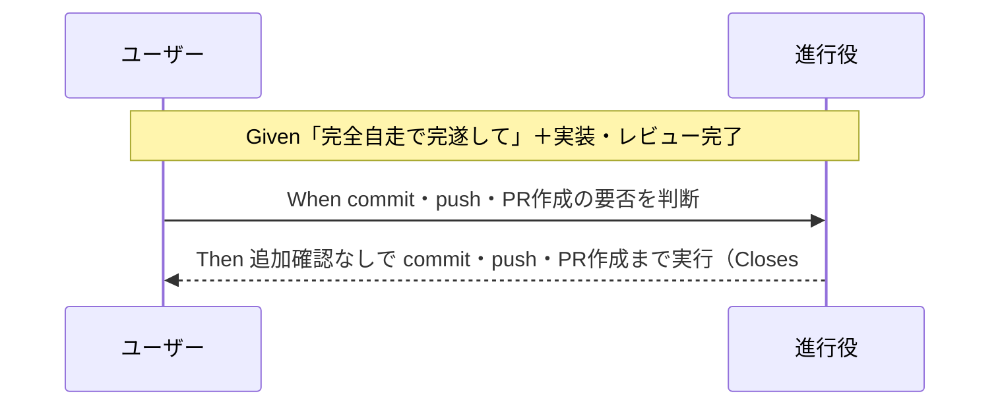

# 要件定義書: 完全自走スコープへの push・PR 作成明記

**プロジェクト名**: 完全自走スコープへの push・PR 作成明記
**作成日**: 2026 年 07 月 14 日
**最終更新**: 2026 年 07 月 14 日

> **重要**: **このドキュメントは常に更新**: 要件の変更や追加があった場合は、即座にこのドキュメントを更新してください。
>
> **用語**: [.agent-skill-chain/source/CONCEPTS.md §用語規約](../../../../.agent-skill-chain/source/CONCEPTS.md#用語規約) を参照。

---

## 1. 概要

### 1.1 システム概要

`.agent-skill-chain` フレームワークの実行規約（`.agent-skill-chain/source/RULES.md` §高リスク操作、`.agent-skill-chain/source/CLOSEOUT.md` §commit ステップ）を改訂し、**既定無効の opt-in トグル `AUTONOMOUS_SCOPE_COMMIT_PUSH_PR_ENABLED`（既定 `false`）を有効化した消費先プロジェクトでのみ**、ユーザーが自律実行キーワード（完走・完遂・自走・完全自走・auto mode 等）を含めて作業を依頼した場合、その依頼自体を commit・push・PR 作成に対するユーザー明示の事前承認とみなし、進行役が都度の追加確認を挟まず一連の完了（PR 作成まで）を自律的に遂行できるようにする。opt-in 有効かつキーワードを含まない通常依頼では、確認のゲートを **commit 前**に置く（push 前ではなく commit を作る前に確認し、承認後は commit・push・PR 作成まで一連で進めてよい）。main 直 push・force push・PR マージは事前承認みなしの対象外とする。**opt-in を有効化していない消費先プロジェクトでは本規定は一切発動せず、フレームワーク既定の安全側挙動（自律 push・PR 作成を行わず確認する）が完全に維持される**（配布物本体への恒常ルール追加が未合意の第三者へ既定適用されるのを防ぐ第三者同意保全のため）。本リポジトリ（AGENTS.md パッケージの正本）では本トグルを明示的に有効化する。

### 1.2 用語集

| 用語 | 説明 |
| -------- | ------ |
| opt-in トグル | env `AUTONOMOUS_SCOPE_COMMIT_PUSH_PR_ENABLED`（既定 `false`）。`true`／`1`／`yes`／`on`（大小文字不問）で有効。有効化した消費先プロジェクトでのみ本規定（事前承認みなし・確認ゲート前倒し・承認カスケード）が発動する。既存 `GITHUB_ISSUE_GATE_ENABLED` 等の命名・真偽値解釈を踏襲するが既定値の向きが逆（既定無効）。 |
| 第三者同意問題 | 配布物本体（`.agent-skill-chain/source/`）へ自律 push・PR 作成の恒常ルールを無条件追加すると、まだ導入・合意していない第三者（消費先プロジェクト利用者）へ既定適用され、第三者の同意を代弁してしまう問題（Instruction Poisoning）。opt-in 化で回避する。 |
| 自律実行キーワード | ユーザーが明示的に自律実行を依頼したと解釈できる語。完走・完遂・自走・完全自走・auto mode 等（§2.3 で確定列挙）。 |
| 事前承認みなし | 依頼にキーワードが含まれることをもって、commit・push・PR 作成への「ユーザー明示の事前承認」が既に与えられたと解釈する扱い。 |
| 適用範囲 | 事前承認みなしが及ぶ操作の範囲。本要件では commit・push・PR 作成（PR 本文への Issue 紐づけ含む）まで。 |
| 確認ゲート | 確認が必要な場合にユーザーへ可否を問うタイミング。本要件では **commit 前**（commit を作成する前）に置く。承認後は commit・push・PR 作成まで一連で進めてよい。 |
| 高リスク操作 | RULES.md §高リスク操作が定義する、不可逆または広範囲な影響を持つ操作。実行前にユーザーの明示確認を要する。 |

---

## 2. 機能要件

### 2.1 ユーザーストーリー

#### ストーリー 1: 自律実行キーワード依頼での自律完走（opt-in 有効時）

- **As a** opt-in を有効化した消費先プロジェクトで自律実行キーワードで作業を依頼したユーザー
- **I want to** 「完全自走で完遂して」等と一度依頼したら、実装後に commit・push・PR 作成の可否を再確認されず PR 作成まで到達したい
- **So that** 過剰な確認の往復なく、依頼したスコープが一連で完走される

**受け入れ基準**:

- RULES.md §高リスク操作（正本）に、opt-in 有効時にキーワード依頼を commit・push・PR 作成の事前承認とみなす旨が明記されている。
- opt-in 有効かつ進行役がキーワードを認識した場合、commit・push・PR 作成前に追加の可否確認を挟まないことが規約上判定できる。
- 適用範囲が commit・push・PR 作成（PR 本文の `Closes #<番号>` 等の紐づけを含む）までであることが明記されている。

#### ストーリー 2: 通常依頼での安全側挙動の維持（opt-in 有効時）

- **As a** opt-in を有効化した消費先で、キーワードを含めずに作業を依頼したユーザー
- **I want to** commit を作る前に確認を挟んでほしい
- **So that** 意図しない commit・push が自律的に行われない（安全側挙動が保たれる）

**受け入れ基準**:

- opt-in 有効かつキーワードを含まない依頼では **commit 前**の確認を行う旨が規約に明記されている（確認ゲートを push 前から commit 前へ移す）。
- 承認が得られた後は、その承認をもって commit・push・PR 作成まで一連で進めてよい旨が明記されている。
- 改訂によって無キーワード時の確認要件が削除・弱体化されていない。

#### ストーリー 5: 未 opt-in 消費先での挙動不変（第三者同意の保全）

- **As a** 本フレームワークを導入したが本トグルを opt-in していない消費先プロジェクトの利用者
- **I want to** 自分が明示合意していない自律 commit・push・PR 作成が既定で発動しないでほしい
- **So that** 配布物本体の更新によって、未合意のまま自律実行が既定適用される（第三者同意を代弁される）ことがない

**受け入れ基準**:

- RULES.md §高リスク操作に、env `AUTONOMOUS_SCOPE_COMMIT_PUSH_PR_ENABLED`（既定 `false`）が未設定・無効の場合、本規定（事前承認みなし・確認ゲート前倒し・承認カスケード）が発動しない旨が明記されている。
- 未 opt-in 時はフレームワーク既定の安全側挙動が完全に維持され、消費先の挙動が一切変わらない旨が判定できる。
- トグルの真偽値解釈（`true`/`1`/`yes`/`on` で有効・既定 `false`）が既存トグルを踏襲しつつ既定値の向きが逆であることが明記されている。

#### ストーリー 3: 高リスク境界の非後退

- **As a** リポジトリの安全性を重視する保守者
- **I want to** 事前承認みなしが commit・push・PR 作成に限定され、main 直 push・force push・PR マージには波及しないことを保証してほしい
- **So that** 便利さのために不可逆・広範囲な操作の安全境界が後退しない

**受け入れ基準**:

- 事前承認みなしの対象外として main 直 push・force push・PR マージが明記されている。
- RULES.md §高リスク操作の一般定義（外部書き込み・大量削除・履歴改変は要事前確認）が維持されている。

#### ストーリー 4: キーワードの一意な解釈と境界

- **As a** 進行役（オーケストレーター）
- **I want to** どの表現が「自律実行キーワード」に該当するかを列挙・境界で判別したい
- **So that** 過剰適用（意図しない依頼まで自律 push）や解釈揺れを防げる

**受け入れ基準**:

- 該当キーワードが列挙されている（完走・完遂・自走・完全自走・auto mode、および類する表現）。
- 判断がつかない場合は安全側（確認する）に倒す既定が明記されている。

### 2.2 BDD ユースケース

#### ユースケース 1: 自律実行キーワード依頼下の commit・push・PR 作成

進行役がユーザー依頼文に自律実行キーワードを検出した場合、実装完了後に追加確認なしで commit・push・PR 作成へ進む。

**シナリオ 1: 完全自走依頼で PR 作成まで自律遂行**

```gherkin
Feature: 自律実行キーワード依頼下の完走（opt-in 有効時）
  Scenario: opt-in 有効で完全自走キーワードを含む依頼で commit・push・PR作成まで自律遂行
    Given AUTONOMOUS_SCOPE_COMMIT_PUSH_PR_ENABLED が有効（true）である
    And ユーザーが「完全自走で完遂して」と作業を依頼した
    And 進行役が実装・レビューまで完了させた
    When 進行役が commit・push・PR作成の要否を判断する
    Then 依頼自体を事前承認とみなし、追加の可否確認を挟まずに commit・push・PR作成まで実行する
    And PR本文に対応GitHub Issueの Closes #<番号> を含める
```

**処理フロー**:



**シナリオ 2: キーワードを含まない通常依頼では commit 前に確認**

```gherkin
Feature: 通常依頼での安全側挙動（opt-in 有効時）
  Scenario: opt-in 有効でキーワードなし依頼では commit前に確認する
    Given AUTONOMOUS_SCOPE_COMMIT_PUSH_PR_ENABLED が有効（true）である
    And ユーザーが自律実行キーワードを含めずに作業を依頼した
    And 進行役が実装・レビューまで完了させた（未 commit）
    When 進行役が commit の要否を判断する
    Then commit を作成する前にユーザーへ可否を確認する（確認ゲートを commit 前に置く）
    And 承認が得られた場合は、その承認をもって commit・push・PR作成まで一連で進めてよい
```

**シナリオ 3: opt-in 無効（既定）の消費先では本規定が発動しない**

```gherkin
Feature: 未 opt-in 消費先での挙動不変（第三者同意の保全）
  Scenario: opt-in 無効なら自律実行キーワードがあっても事前承認みなしは発動しない
    Given AUTONOMOUS_SCOPE_COMMIT_PUSH_PR_ENABLED が未設定または無効（false/0/no/off）である
    And ユーザーが「完全自走で完遂して」と作業を依頼した
    And 進行役が実装・レビューまで完了させた
    When 進行役が commit・push・PR作成の要否を判断する
    Then 事前承認みなし・確認ゲート前倒し・承認カスケードは発動せず、フレームワーク既定の安全側挙動（ユーザーの明示なしに自律 push・PR作成を行わず確認する）が維持される
```

#### ユースケース 2: 事前承認みなしの範囲外操作の扱い

事前承認みなしは commit・push・PR 作成に限定され、より高リスクな操作へは波及しない。

**シナリオ 1: PR マージ・main 直 push は事前承認みなしの対象外**

```gherkin
Feature: 高リスク境界の非後退
  Scenario: opt-in 有効・キーワード依頼でも PRマージ・main直pushは対象外
    Given AUTONOMOUS_SCOPE_COMMIT_PUSH_PR_ENABLED が有効（true）である
    And ユーザーが「auto modeで進めて」と依頼した
    And 進行役が commit・push・PR作成まで完了させた
    When 進行役が PRマージまたは main への直接push・force push を検討する
    Then これらは事前承認みなしの対象外であり、別途ユーザーの明示確認を要する
```

**シナリオ 2: キーワード境界（判断がつかない表現は安全側）**

```gherkin
Feature: キーワードの一意な解釈
  Scenario: 自律実行キーワードか判断がつかない依頼は安全側に倒す
    Given ユーザーの依頼文に自律実行キーワードに該当するか曖昧な表現しかない
    When 進行役がキーワード該当性を判定する
    Then 事前承認みなしを適用せず、commit を作成する前に確認する（確認ゲート＝commit 前・安全側の既定）
```

### 2.3 ビジネスルール

- **BR-0（opt-in トグル・既定無効）**: 本規定（BR-1〜BR-5）は、env `AUTONOMOUS_SCOPE_COMMIT_PUSH_PR_ENABLED` が明示的に有効（`true`／`1`／`yes`／`on`・大小文字不問）な消費先プロジェクトでのみ発動する。既定値は `false`（無効）であり、未設定・無効（`false`／`0`／`no`／`off`）の場合は BR-1〜BR-5 は一切発動せず、フレームワーク既定の安全側挙動（自律 push・PR 作成を行わず確認する）が完全に維持される。命名・真偽値解釈は既存 `GITHUB_ISSUE_GATE_ENABLED`・`BRANCH_LINK_GATE_ENABLED`・`PR_LINK_GATE_ENABLED` を踏襲するが、**既定値の向きが逆（既定無効）**である。理由は第三者同意問題（配布物本体への恒常ルール追加が未合意の第三者へ既定適用されるのを防ぐ）。本リポジトリでは本トグルを明示的に有効化する（具体は 02・自己拡張ワークフロー.md）。
- **BR-1（キーワード列挙）**: 自律実行キーワードは最低限、次を含む: 「完走」「完遂」「自走」「完全自走」「auto mode」。「完全自動」「自律実行（で）」「最後までやって（完遂の意）」等の類似表現も、明示的に自律実行を求めていると解釈できる限り該当に含めてよい。確定列挙・境界例の最終形は設計（02）で正本化する。
- **BR-2（事前承認みなし）**: opt-in 有効時、キーワードを含む依頼は、commit・push・PR 作成に対するユーザー明示の事前承認とみなし、進行役は都度の追加確認を行わない。
- **BR-3（適用範囲の限定）**: 事前承認みなしの範囲は commit・push・PR 作成（PR 本文への `Closes #<番号>`／`Refs #<番号>` 埋め込み等、既存ゲートで規定された PR 作成付随作業を含む）まで。
- **BR-4（対象外）**: main ブランチへの直接 push・force push、および PR の**マージ**は事前承認みなしの対象外。これらは引き続き別途の明示確認を要する。
- **BR-5（確認ゲート＝commit 前・安全側の既定）**: opt-in 有効な消費先で、キーワードを含まない依頼、またはキーワード該当性が曖昧な依頼では、**commit を作成する前**にユーザーへ可否を確認する（確認ゲートを push 前から commit 前へ移す。安全側に倒す）。承認が得られた場合は、その承認をもって commit・push・PR 作成まで一連で進めてよい。
- **BR-6（正本一元化）**: 本規定の正本は 1 か所（RULES.md §高リスク操作を第一候補）に置き、CLOSEOUT.md §commit ステップ側は重複定義せず正本を参照する形にする。配置の最終決定は設計（02）で行う。
- **BR-7（既存 enforcement 非変更）**: 本要件は確認要否の解釈を明確化するものであり、GitHub Issue 起票ゲート（#34）・ブランチ紐づけ（#35）・PR 紐づけ（#36）の記録義務・CI 検証は変更しない。

---

## 3. 非機能要件

### 3.1 パフォーマンス要件

- 特段の性能要件はない（規約ドキュメントの改訂）。

### 3.2 セキュリティ要件

- 事前承認みなしの拡張により、high-risk 操作（main 直 push・force push・PR マージ）の安全境界が後退しないこと。

### 3.3 ユーザビリティ要件

- 進行役が規約本文を読むだけでキーワード該当性と事前承認みなしの範囲を一意に判定できる、判定可能な記述であること。

### 3.4 可用性要件

- 該当なし。

---

## 4. 外部インターフェース要件

### 4.1 API 要件

- 該当なし（外部 API を持たない）。

### 4.2 データ形式要件

- 改訂対象は Markdown 規約ドキュメント。既存の見出し構造・1 ファイル 1 責務・参照は 1 行という規約に従う。

---

## 5. 制約事項

- コア（`.agent-skill-chain/source/`）は抽象原則の正本を持ち、本リポジトリ固有の具体運用が必要な場合のみ `.agent-skill-chain/project/自己拡張ワークフロー.md` で具体化する（配置境界）。opt-in トグルの抽象定義（env 名・既定値・真偽値解釈・発動条件）はコア（RULES.md）に、本リポジトリでの有効化宣言・具体運用は project 側に置く。
- opt-in トグルは既定無効（既定 `false`）であり、配布物本体（source/）へ自律 push・PR 作成の恒常ルールを無条件追加しない（第三者同意の保全）。本トグルは進行役の振る舞いを規定する行動トグルであり、CI（audit.sh）による機械強制は新設しない（許可確認の有無は git 差分・ツールメタデータに痕跡を残さず機械検出不能。既存 #22–#24 と同様に AI 自律判断＋人手監査に委ねる）。既存の CI 強制トグル（`GITHUB_ISSUE_GATE_ENABLED` 等）とは適用面が異なる点に留意する。
- RULES.md と CLOSEOUT.md で同一規定を二重定義しない（1 ファイル 1 責務・重複記載禁止）。
- 既存の RULES.md §高リスク操作の高リスク操作定義・通常作業の自立進行枠組みと矛盾しないこと。
- 本 issue はドキュメント規約の改訂であり、enforcement（audit.sh）の新規チェック追加はスコープ外。

---

## 6. 参考資料

### プロジェクトドキュメント

- [`00_要求定義.md`](./00_要求定義.md) - 要求定義

### その他の参考資料

- `.agent-skill-chain/source/RULES.md` §高リスク操作（L31）／`.agent-skill-chain/source/CLOSEOUT.md` §commit ステップ（L15）
- [.agent-skill-chain/source/boot/CORE.md](../../../../.agent-skill-chain/source/boot/CORE.md) §依頼タイプ別振る舞い、AGENTS.md §自立進行ルール

---

## 7. 前のステップ

この要件定義書は、以下のドキュメントを基に作成されています：

- **前**: [`00_要求定義.md`](./00_要求定義.md) - 要求定義フェーズ

---

## 8. 次のステップ

この要件定義書の承認後、以下のドキュメントを作成します：

- **次**: [`02_設計.md`](./02_設計.md) - 設計フェーズ
