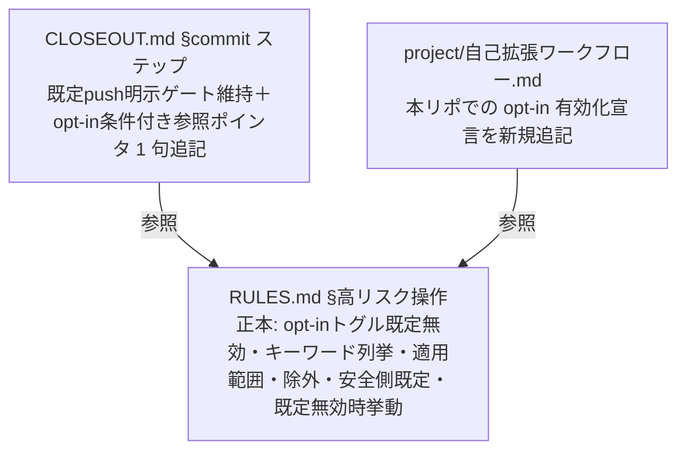
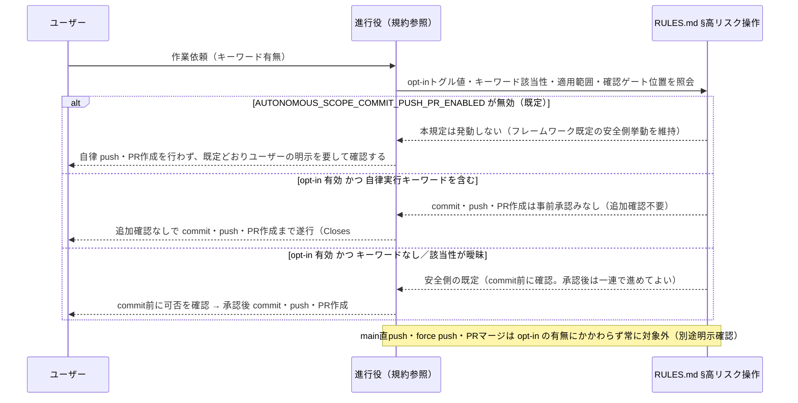
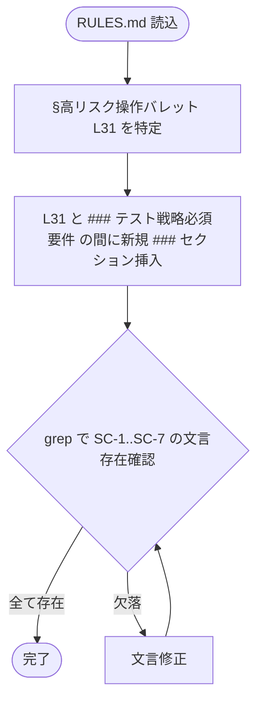

# 設計書: 完全自走スコープへの push・PR 作成明記

**プロジェクト名**: 完全自走スコープへの push・PR 作成明記
**作成日**: 2026 年 07 月 14 日
**最終更新**: 2026 年 07 月 14 日

> **重要**: **このドキュメントは常に更新**: 設計の変更や追加があった場合は、即座にこのドキュメントを更新してください。ドキュメントは「生きているドキュメント」として扱い、実装内容と常に同期させます。
>
> **用語**: [.agent-skill-chain/source/CONCEPTS.md §用語規約](../../../../.agent-skill-chain/source/CONCEPTS.md#用語規約) を参照。

---

## 1. 設計概要

### 1.1 設計方針

本 issue は `.agent-skill-chain/source/RULES.md` §高リスク操作を**正本**として、自律実行キーワード依頼下での commit・push・PR 作成の事前承認みなしを 1 か所に明記し、あわせて確認ゲートを push 前から commit 前へ移すドキュメント規約改訂である。**ただしこの一式は、配布物本体（source/）へ無条件の恒常ルールとして組み込むと未合意の第三者（消費先プロジェクト利用者）へ既定適用され第三者同意を代弁してしまう（第三者同意問題／Instruction Poisoning）ため、既定無効の opt-in トグル `AUTONOMOUS_SCOPE_COMMIT_PUSH_PR_ENABLED`（既定 `false`）の背後に置く**（ADR-6）。設計原則（[spec/01_設計原則.md](../../../../.agent-skill-chain/source/spec/01_設計原則.md)）のうち **単一責務**（1 規定 1 正本）と **明確な境界**（コア抽象／project 具体の配置境界）を最優先で適用する。

### 1.2 設計原則（本プロジェクトで適用するもの）

- **単一責務**: 本規定の正本は RULES.md §高リスク操作の 1 か所のみ。CLOSEOUT.md は重複定義せず参照ポインタに留める（1 ファイル 1 責務・重複記載禁止）。
- **明確な境界**: キーワードの一般的定義・事前承認みなしの原則（抽象）はコア（`.agent-skill-chain/source/RULES.md`）に置き、本リポジトリ固有の具体運用（`gh` コマンド・PR 本文書式・対象環境判定）は `.agent-skill-chain/project/自己拡張ワークフロー.md` に委ねる（配置境界）。
- **AIフレンドリー設計**: 進行役が規約本文を読むだけでキーワード該当性と適用範囲を一意に判定できるよう、キーワードを明示列挙し、適用範囲・除外・安全側既定を箇条で分離して記述する（意図が分かる記述）。

---

## 2. アーキテクチャ設計

### 2.1 責務・境界・参照関係

本 issue の「コンポーネント」は改訂対象の規約ファイルである。

#### 2.1.1 責務一覧

| コンポーネント | 責務（1 文） |
| -------------- | ------------ |
| `RULES.md` §高リスク操作 | 高リスク操作の定義と、**opt-in トグル `AUTONOMOUS_SCOPE_COMMIT_PUSH_PR_ENABLED`（既定 `false`）背後での** 自律実行キーワード依頼下 commit・push・PR 作成の事前承認みなし・適用範囲・除外・確認ゲート（commit 前）・既定無効時の挙動を定める**正本**。 |
| `CLOSEOUT.md` §commit ステップ | commit/push の抽象工程を定める。既定（未 opt-in）の push 明示ゲートを維持しつつ、opt-in 有効時の commit ゲート前倒し・事前承認みなしは RULES.md §高リスク操作を**参照**する（重複定義しない）。 |
| `.agent-skill-chain/project/自己拡張ワークフロー.md` | 本リポジトリ固有の PR 作成具体手順（`gh`・PR 本文・Closes 埋め込み・対象環境判定）を定める既存の具体正本。**本 issue では、本リポジトリでの opt-in 宣言（`AUTONOMOUS_SCOPE_COMMIT_PUSH_PR_ENABLED=true`）と具体運用を新規追記する**（実装フェーズで実施）。 |

#### 2.1.2 境界

- **入力**: opt-in トグル `AUTONOMOUS_SCOPE_COMMIT_PUSH_PR_ENABLED` の値（消費先環境の env・既定 `false`）、ユーザーの作業依頼文（自律実行キーワードの有無）、進行役による実装・レビュー完了（未 commit）という状態。
- **出力**: commit・push・PR 作成を追加確認なしで遂行してよいか／commit 前に確認すべきか／既定の安全側挙動（未 opt-in）を維持するかの判定基準（規約本文として明文化）。
- **他責務との境界（本 issue の範囲外）**:
  - PR の**マージ**、main ブランチへの直接 push・force push は事前承認みなしの対象外（除外要件。00 §5）。
  - 既存 enforcement（#34 GitHub Issue 起票・#35 ブランチ紐づけ・#36 PR 紐づけ）の記録義務・CI 検証・audit.sh への新規チェック追加はスコープ外（01 §5）。
  - PR 作成の具体手順（`gh` コマンド・PR 本文書式）は project 側の既存正本の責務であり、本 issue で再定義しない。

#### 2.1.3 参照関係

- `CLOSEOUT.md` §commit ステップ → `RULES.md` §高リスク操作（commit 可否解釈・確認ゲート位置の参照。既定の push 明示ゲートを維持しつつ、opt-in 有効時のゲート前倒し・事前承認みなしの条件付き参照ポインタを追記）。
- `.agent-skill-chain/project/自己拡張ワークフロー.md` → `RULES.md` §高リスク操作（抽象原則の参照。本 issue では本リポジトリでの opt-in 有効化宣言を project 側へ新規追記する＝機能 3・§3.3）。
- 循環参照なし（RULES.md は他 2 ファイルを参照しない片方向）。

### 2.2 システムアーキテクチャ

- **採用パターン**: 単一正本＋参照ポインタ（Single Source of Truth）。1 規定を 1 ファイルに集約し、他ファイルは 1 行参照に限定する。
- **根拠**: [spec/06_設計判断の優先順位.md](../../../../.agent-skill-chain/source/spec/06_設計判断の優先順位.md) および RULES §ドキュメント（正本は 1 か所・参照は 1 行）に従う（evidence_source: existing_code — RULES.md L24 を実読）。

#### 2.2.1 CQRS

- 該当なし（状態変更を伴わないドキュメント規約であり Command/Query 分離は適用しない）。

#### 2.2.2 配置図（本プロジェクトの構成）

### 2.3 コンポーネント構成

RULES.md §高リスク操作の直後（既存の「高リスク操作」定義バレット L31 と `### テスト戦略必須要件` 見出し L33 の間）に、opt-in トグル背後の事前承認みなしを定める新規 `###` セクションを 1 つ追加する。CLOSEOUT.md §commit ステップの L15 バレットは、**既定（未 opt-in）の「push はユーザーが明示したときのみ行う」を基底として維持**しつつ、opt-in 有効時に確認ゲートを commit 時点へ前倒しし・自律実行キーワードを事前承認みなしとする旨の**参照ポインタ（条件付き 1 句）**を追記する（列挙・適用範囲の本文は複製しない）。3 つ目の改訂対象として、`.agent-skill-chain/project/自己拡張ワークフロー.md` に本リポジトリでの opt-in 宣言（`AUTONOMOUS_SCOPE_COMMIT_PUSH_PR_ENABLED=true`）と具体運用の新規セクションを追記する（§3.3・実装フェーズで実施）。

### 2.4 データフロー

進行役の判定フロー（規約本文が規定する判断経路）:

### 2.5 横断設計判断（ADR）

本節は [EVIDENCE_POLICY.md](../../../../.agent-skill-chain/source/EVIDENCE_POLICY.md) の ADR 形式（コンテキスト・検討した選択肢・決定・根拠[evidence_source 付き]・帰結）で記録する。evidence_source の分類定義は [CONCEPTS.md §外部根拠の必須化](../../../../.agent-skill-chain/source/CONCEPTS.md#外部根拠の必須化external-anchor) を参照。

#### ADR-1: 正本の配置（RULES.md §高リスク操作を単一正本とする）

- **コンテキスト**: 事前承認みなし規定を RULES.md と CLOSEOUT.md のどちらに置くか。両方に本文を置くと二重定義で将来不整合が生じる（00 §7.2）。
- **検討した選択肢**:
  1. RULES.md §高リスク操作を正本とし、CLOSEOUT.md は参照のみ。
  2. CLOSEOUT.md §commit ステップを正本とし、RULES.md から参照。
  3. 両方に本文を記載。
- **決定**: **選択肢 1**（RULES.md §高リスク操作を単一正本）。
- **根拠**: 「高リスク操作」の定義自体が RULES.md §高リスク操作にあり、事前承認みなしはその定義への例外・限定として同居させるのが単一責務に合致する。CLOSEOUT.md L15 は既に RULES.md §高リスク操作を参照する構造（evidence_source: existing_code — CLOSEOUT.md L15・RULES.md L31 を実読）。選択肢 3 は RULES §ドキュメント「正本は 1 か所・重複記載禁止」に反する（evidence_source: existing_code — RULES.md L24）。
- **帰結**: 列挙・適用範囲・除外・安全側既定の本文は RULES.md にのみ置く。SC-5（正本一元化）を満たす。

#### ADR-2: CLOSEOUT.md L15 の改訂（既定 push ゲートを維持し、opt-in 有効時の commit ゲート前倒しを条件付き参照ポインタで追記）

- **コンテキスト**: CLOSEOUT.md L15「push はユーザーが明示したときのみ行う」は、(a) キーワード依頼が「ユーザー明示」に当たるか曖昧なまま残り（本 issue が解消したい曖昧さの発生源）、かつ (b) 確認ゲートを push 時点に固定している。ユーザー指摘（ADR-5）によりゲートは commit 時点へ移すべきだが、この前倒し・承認カスケードは第三者同意問題（ADR-6）により opt-in 有効時に限定される。したがって既定（未 opt-in）では L15 の基底文言をそのまま維持しなければならない（未 opt-in 消費先の挙動を変えないため）。
- **検討した選択肢**:
  1. CLOSEOUT.md は無改訂（既に RULES.md を参照しているため）。
  2. L15 の基底文言「push はユーザーが明示したときのみ行う」を**無条件に**「commit はユーザーが明示（承認）したときのみ行う」へ改める。
  3. **L15 の基底文言（既定＝未 opt-in の push 明示ゲート）を維持しつつ、opt-in 有効時に限り確認ゲートを commit 時点へ前倒しし・自律実行キーワードを commit・push・PR 作成の事前承認とみなす旨の条件付き参照ポインタ 1 句を追記する**（列挙・適用範囲は複製しない）。
- **決定**: **選択肢 3**。
- **根拠**: 選択肢 2 は未 opt-in の消費先まで commit ゲートへ変えてしまい、承認カスケードにより「commit 承認が push・PR 作成へ波及する」挙動を第三者へ既定適用する＝第三者同意問題を再発させる（ADR-6 に反する）。選択肢 3 なら既定挙動を維持したまま、opt-in 有効時のみ commit ゲート前倒しを効かせられる。L15 は commit/push の局所文脈を持つため条件付き参照ポインタの反映点として最適で、列挙・適用範囲の本文は複製しないため SC-5 を維持する（evidence_source: existing_code — CLOSEOUT.md L15、human_decision — ユーザー発話「push 前確認ではなく、commit 前確認にするべきです」／opt-in 化の解決方針）。
- **帰結**: CLOSEOUT.md は L15 の基底文言（既定 push 明示ゲート）を維持したまま、opt-in 条件付きの参照ポインタ 1 句を追記する最小改訂に留める。二重定義は発生しない。確定文言は §3.2.2。

#### ADR-3: キーワード列挙の確定と過剰適用の抑止（安全側既定を明記）

- **コンテキスト**: 列挙が過度に広いと意図しない依頼まで自律 push が事前承認とみなされる過剰適用リスク（00 §7.1）。逆に狭すぎるとユーザー意図を汲めない。
- **検討した選択肢**:
  1. 明示列挙のみ（列挙外は一切みなさない）。
  2. 明示列挙＋「明示的に自律実行を求めていると解釈できる同義表現」を許容し、判断がつかない場合は安全側（確認する）に倒す既定を併記。
- **決定**: **選択肢 2**。
- **根拠**: ユーザーフィードバック原文が「完走や完遂・自走・auto mode など」と例示的に列挙しており（evidence_source: human_decision — 00 §8・01 §2.3 BR-1）、閉じた列挙では同義表現を取りこぼす。過剰適用は「該当性が曖昧なら安全側で確認する」既定（BR-5）で抑止する。
- **帰結**: 確定列挙は「完走・完遂・自走・完全自走・auto mode」を最小集合とし、同義表現を許容しつつ曖昧時は安全側。SC-1・SC-4 を満たす。

#### ADR-4: 適用範囲の限定（commit・push・PR 作成まで、マージ等は対象外）

- **コンテキスト**: 事前承認みなしが main 直 push・force push・PR マージへ波及すると安全境界が後退する（00 §5・01 ストーリー 3）。
- **検討した選択肢**:
  1. 適用範囲を commit・push・PR 作成（PR 本文 Issue 紐づけ含む）までに限定し、除外操作を明記。
  2. 範囲を明示せず「一連の完了まで」とだけ記載。
- **決定**: **選択肢 1**。
- **根拠**: 00 §5・§本 issue の論点整理でユーザー原文「PR 作成まで」に基づき PR マージをスコープ外と決定済み（evidence_source: human_decision）。既存規約でも main への直接反映系はより慎重な扱い（evidence_source: existing_code — RULES.md §高リスク操作）。選択肢 2 は波及解釈を許し SC-3 を満たせない。
- **帰結**: 適用範囲＝commit・push・PR 作成（PR 本文 `Closes #<番号>`/`Refs #<番号>` を含む）。対象外＝main 直 push・force push・PR マージ。SC-3 を満たす。

#### ADR-5: 確認ゲートの位置（push 前ではなく commit 前に置く）

- **コンテキスト**: 当初設計は、キーワードを含まない通常依頼の確認ゲートを push 時点に置いていた（既存 CLOSEOUT.md L15「push はユーザーが明示したときのみ行う」を踏襲）。しかしユーザーは「push 前確認ではなく、commit 前確認にするべきです」と指摘した。すなわち、確認を求めるタイミングは commit を作成する前であるべきで、既存 L15 のゲート位置（push 時点）そのものを改めるべき、という指摘である。
- **検討した選択肢**:
  1. 確認ゲートを push 前に置いたまま（当初設計・既存 L15 踏襲）とし、事前承認みなしのみ追加する。
  2. 確認ゲートを **commit 前**へ移す。キーワードなし／曖昧な依頼では commit を作成する前に確認し、承認が得られた場合はその承認をもって commit・push・PR 作成まで一連で進めてよいと整理する。あわせて事前承認みなしの対象範囲も push・PR 作成だけでなく **commit を含む**ように広げる。
- **決定**: **選択肢 2**（確認ゲートを commit 前へ移す）。
- **根拠**: ユーザーが明示的に「push 前確認ではなく、commit 前確認にするべきです」と指摘しており、commit をゲートにする方がユーザーの意図に合致する（evidence_source: human_decision — ユーザー発話原文）。push 時点にゲートを置くと、ローカルコミットは自由に作られた後に push だけを都度確認することになり、実装が確定した後の往復確認が発生する（本セッションで実際に 2 回の再確認が発生した経緯と同型の摩擦）。commit を作る前に一度承認を得れば、そこから push・PR 作成まで一連で進められ、確認回数を最小化できる。
- **帰結**: 確認ゲート＝commit 前（push 時点ではない）。承認は commit・push・PR 作成の一連を含む。事前承認みなしの対象範囲も commit・push・PR 作成へ拡張する（ADR-4 と整合）。ただしこのゲート前倒し・承認カスケードは opt-in 有効時に限る（ADR-6）。既定（未 opt-in）では CLOSEOUT.md L15 の基底文言「push はユーザーが明示したときのみ行う」を維持する（ADR-2 改）。SC-4 を満たす。

#### ADR-6: opt-in トグルによる第三者同意問題の回避（既定無効・env で明示有効化）

- **コンテキスト**: 実装フェーズで、本規定（自律実行キーワード＝commit・push・PR 作成の事前承認みなし）を配布物本体（`.agent-skill-chain/source/RULES.md`）へ無条件の恒常ルールとして追加しようとしたところ、Claude Code の auto mode 分類器が当該変更を **3 回連続でブロック**した。最終的な指摘は「配布物本体への恒常ルール追加は、このリポジトリの所有者がいくら明示承認しても、まだこのフレームワークを導入・合意していない第三者（消費先プロジェクト利用者）にも自律的な commit・push・PR 作成を既定適用することになり、第三者の同意を代弁してしまう。これは『誰が依頼しても関係なくブロックされ続ける』種類の指摘（Instruction Poisoning）である」というものであった。
- **検討した選択肢**:
  1. 無条件の恒常ルールとして source/ に組み込む（当初案）。
  2. 配布物本体への組み込み自体を断念する（機能を提供しない）。
  3. **opt-in 化して source/ に組み込む**＝配布はするが既定は無効、消費先プロジェクトが明示的に opt-in（env `AUTONOMOUS_SCOPE_COMMIT_PUSH_PR_ENABLED=true`）した場合のみ有効。
- **決定**: **選択肢 3（既定無効の opt-in 化）**。env `AUTONOMOUS_SCOPE_COMMIT_PUSH_PR_ENABLED`（既定 `false`）を導入し、`true`／`1`／`yes`／`on`（大小文字不問）で有効化した消費先でのみ本規定（ADR-3〜ADR-5 の事前承認みなし・確認ゲート前倒し・承認カスケード）を発動させる。
- **根拠**: 選択肢 1 は分類器のブロック理由（第三者同意の代弁）を解消できない（evidence_source: human_decision — 実装フェーズの auto mode 分類器の指摘内容とユーザーの解決方針決定）。選択肢 2 は本リポジトリで必要な自律完走機能まで失う。選択肢 3 は「配布はするが既定は無効」により、opt-in していない消費先へ自律実行を既定適用せず第三者同意を保全しつつ、本リポジトリ（および望む消費先）は明示 opt-in で機能を得られる。本リポジトリには既に `GITHUB_ISSUE_GATE_ENABLED`（既定 `true`・env で無効化可能）という同型のトグル先例があり（evidence_source: existing_code — 自己拡張ワークフロー.md §8 を実読）、命名・真偽値解釈を踏襲できる。**ただし本トグルは既定値の向きが逆（既定 `false`・env で明示有効化しないと発動しない）**である点が異なる。
- **帰結**: RULES.md 新規セクションは冒頭で「本節は既定無効。opt-in 時のみ発動」を明記し、未 opt-in 時の既定挙動（フレームワーク既定の安全側挙動の完全維持・消費先の挙動不変）を併記する。CLOSEOUT.md は既定 push 明示ゲートを維持しつつ opt-in 有効時の条項を条件付きで追記する（ADR-2 改）。本リポジトリでの有効化宣言は project 側に置く（ADR-7）。SC-6 を満たす。**なお本トグルは進行役の振る舞いを規定する行動トグルであり、CI（audit.sh）による機械強制は新設しない**（許可確認の有無は git 差分・ツールメタデータに痕跡を残さず機械検出不能。既存 enforcement #22–#24 と同様に AI 自律判断＋人手監査に委ねる。evidence_source: existing_code — enforcement/README.md #22–#24 を実読）。この点が、audit.sh が env を直接読む CI 強制トグル（`GITHUB_ISSUE_GATE_ENABLED` 等）との適用面の差である。

#### ADR-7: env 変数名の確定と本リポジトリでの有効化配置

- **コンテキスト**: opt-in トグルの env 変数名・既定値・真偽値解釈と、本リポジトリでの有効化設定の記載場所を確定する必要がある。
- **検討した選択肢**:
  1. env 名 `AUTONOMOUS_SCOPE_COMMIT_PUSH_PR_ENABLED`（既存トグルの `<対象>_ENABLED` 命名を踏襲）。
  2. 別名（例: `AUTO_PUSH_PR_ENABLED` 等）。
- **決定**: **選択肢 1**。env 名は **`AUTONOMOUS_SCOPE_COMMIT_PUSH_PR_ENABLED`**、**既定値 `false`（無効）**、有効判定は `true`／`1`／`yes`／`on`（大小文字不問）、無効判定は未設定・`false`／`0`／`no`／`off`。本リポジトリでの有効化は `.agent-skill-chain/project/自己拡張ワークフロー.md` に新規セクションとして「本リポジトリでは `AUTONOMOUS_SCOPE_COMMIT_PUSH_PR_ENABLED` を明示的に有効化する」旨・env 名・既定値・設定方法・本トグルが既定無効である理由（第三者同意）を明記する。
- **根拠**: 既存 `GITHUB_ISSUE_GATE_ENABLED`・`BRANCH_LINK_GATE_ENABLED`・`PR_LINK_GATE_ENABLED` が `<対象>_ENABLED` 命名・`false`/`0`/`no`/`off` 同義の真偽値解釈で統一されており（evidence_source: existing_code — 自己拡張ワークフロー.md §8・§ブランチ紐づけ／PR 紐づけ、audit.sh L1040/L1116/L1178 の `case` 分岐を実読）、命名の一貫性・可読性のため踏襲する。適用対象（自律実行スコープ＝commit・push・PR 作成）を名前に含めることで意図が自明になる。既存トグルが「本リポジトリでは設定せず既定のまま」であるのに対し、本トグルは既定が無効のため「本リポジトリでは明示的に有効化する」という**逆向きの記述**になる。
- **帰結**: env 名・既定値・有効化配置が確定。SC-6・SC-7 を満たす。project 側追記は §3.3・03_実装計画 タスク 3 で実施する。

---

## 3. 機能設計

### 3.1 機能 1: RULES.md §高リスク操作への事前承認みなし規定の追記

#### 3.1.1 概要

RULES.md §高リスク操作の直後に、**opt-in トグル（既定無効）**・自律実行キーワード列挙・事前承認みなし（commit・push・PR 作成）・適用範囲・除外・確認ゲート（commit 前の安全側既定）・既定無効時の挙動・具体運用の project 委譲を明記した新規 `###` セクションを追加する。

#### 3.1.2 処理フロー

#### 3.1.3 入力・出力

- **入力**: 既存 RULES.md、opt-in トグル定義（ADR-6/ADR-7）、確定キーワード列挙（ADR-3）、適用範囲・除外（ADR-4）。
- **出力**: opt-in トグル背後の事前承認みなし規定を含む新規 `###` セクションが追加された RULES.md。

#### 3.1.4 追記文言（確定案）

RULES.md §高リスク操作バレット（L31）と `### テスト戦略必須要件`（L33）の間に、次の新規セクションを挿入する。

> ### 自律実行キーワード依頼下の commit・push・PR 作成（opt-in・既定無効の事前承認みなし）
>
> **本節の挙動は既定で無効である。** env `AUTONOMOUS_SCOPE_COMMIT_PUSH_PR_ENABLED` を明示的に有効（`true`。`1`／`yes`／`on` も同義・大小文字不問）にした消費先プロジェクトでのみ発動する。未設定または無効（`false`／`0`／`no`／`off`）の場合、本節の事前承認みなし・確認ゲートの前倒し・承認カスケードはいずれも適用されず、フレームワーク既定の安全側挙動（commit・push・PR 作成をユーザーの明示なしに自律実行せず、都度確認する）が完全に維持される。**opt-in しない限り、消費先プロジェクトの挙動は一切変わらない。**
>
> **なぜ opt-in か（第三者同意の保全）**: 配布物本体（`.agent-skill-chain/source/`）へ「自律実行キーワード＝commit・push・PR 作成の事前承認」を無条件の恒常ルールとして組み込むと、本フレームワークをまだ導入・合意していない第三者（消費先プロジェクトの利用者）にも自律的な push・PR 作成が既定適用され、第三者の同意を代弁してしまう。これを避けるため、配布はするが既定は無効とし、各消費先が明示的に opt-in したときのみ発動する設計とする（既存の `GITHUB_ISSUE_GATE_ENABLED` 等と同型のトグルだが、**既定値の向きが逆＝既定 `false`**）。本トグルは進行役の振る舞いを規定する行動トグルであり、CI（audit.sh）による機械強制は新設しない（許可確認の有無は機械検出不能なため、AI の自律判断＋人手監査に委ねる）。
>
> **有効（opt-in 済み）時の挙動**: ユーザーの作業依頼文に**自律実行キーワード**が含まれる場合、その依頼自体を commit・push・PR 作成に対するユーザー明示の事前承認とみなす。進行役は実装・レビュー完了後、commit・push・PR 作成の可否を**都度追加確認せず**、一連の完了（PR 作成まで）を自律的に遂行してよい。
>
> - **自律実行キーワード（列挙）**: 「完走」「完遂」「自走」「完全自走」「auto mode」、およびこれらと同義で**明示的に自律実行を求めていると解釈できる表現**（例:「完全自動」「最後までやって（完遂の意）」「自律実行で」）。
> - **適用範囲（事前承認みなしが及ぶ操作）**: commit、push、および PR 作成（PR 本文への `Closes #<番号>` / `Refs #<番号>` 埋め込み等、既存ゲートで規定された PR 作成付随作業を含む）まで。
> - **対象外（事前承認みなしに含めない）**: main ブランチへの直接 push・force push、および PR の**マージ**。これらは opt-in の有無にかかわらず引き続き別途ユーザーの明示的な確認を要する。既存 enforcement（GitHub Issue 起票・ブランチ紐づけ・PR 紐づけ）の記録義務・CI 検証は本規定で変更しない。
> - **確認のゲート＝commit 前（有効時の安全側の既定）**: opt-in 済みプロジェクトでも、依頼にキーワードを含まない場合、またはキーワード該当性が曖昧な場合は、本みなしを**適用せず**、**commit を作成する前に**ユーザーへ可否を確認する（確認のゲートは push 時点ではなく commit 時点に置く）。確認が得られた後は、その承認をもって commit・push・PR 作成まで一連で進めてよい。
> - **無効（既定）時の挙動**: `AUTONOMOUS_SCOPE_COMMIT_PUSH_PR_ENABLED` が未設定・無効のプロジェクトでは、キーワードの有無にかかわらず本みなし・確認ゲートの前倒し・承認カスケードは発動しない。commit・push・PR 作成はフレームワーク既定どおりユーザーの明示的な指示を要し、進行役が自律的に push・PR 作成を行うことはない。
>
> 具体運用（本リポジトリでの opt-in 宣言、`gh` コマンド・PR 本文書式・対象環境判定等）は [.agent-skill-chain/project/自己拡張ワークフロー.md](../.agent-skill-chain/project/自己拡張ワークフロー.md) に委ねる（配置境界＝コア抽象／project 具体。相対リンク記法は既存 RULES.md L46 の現行慣習に一致させる＝review-docs A10 準拠）。

#### 3.1.5 エラーハンドリング

- 該当なし（静的ドキュメント）。文言欠落は §3.1.2 の grep 検証で検出し修正する。

### 3.2 機能 2: CLOSEOUT.md §commit ステップへの参照ポインタ追記

#### 3.2.1 概要

CLOSEOUT.md §commit ステップの L15 バレットは、**既定（未 opt-in）の「push はユーザーが明示したときのみ行う」を基底として維持**しつつ、opt-in トグル `AUTONOMOUS_SCOPE_COMMIT_PUSH_PR_ENABLED` が有効な消費先でのみ確認ゲートを commit 前へ前倒しし・自律実行キーワード依頼を事前承認とみなす旨の**条件付き参照ポインタ 1 句**を追記する（列挙・適用範囲の本文は複製しない）。

#### 3.2.2 追記文言（確定案）

既存 L15:

> - **push はユーザーが明示したときのみ**行う（高リスク操作。[RULES.md](RULES.md) §高リスク操作 参照）。

改訂後（既定の push 明示ゲートを維持し、opt-in 有効時の commit ゲート前倒しを条件付き参照ポインタで追記）:

> - **push はユーザーが明示したときのみ**行う（高リスク操作。[RULES.md](RULES.md) §高リスク操作 参照）。**ただし opt-in トグル `AUTONOMOUS_SCOPE_COMMIT_PUSH_PR_ENABLED` を有効化した消費先プロジェクトでは**、確認のゲートを **commit 時点**へ前倒しし（commit を作成する前に確認し、承認後はその承認をもって commit・push・PR 作成までを一連で遂行してよい）、かつ**自律実行キーワードを含む依頼を commit・push・PR 作成の事前承認とみなす**（列挙・適用範囲・opt-in 条件の正本は同 §を参照）。トグルが未設定・無効の場合は本行冒頭の push 明示ゲートがそのまま維持される。

#### 3.2.3 入力・出力

- **入力**: 既存 CLOSEOUT.md L15。
- **出力**: 既定の push 明示ゲートを維持したまま、opt-in 条件付きの参照ポインタ 1 句が追記された CLOSEOUT.md（列挙・適用範囲本文の複製なし）。

### 3.3 機能 3: 自己拡張ワークフロー.md への本リポジトリ向け opt-in 有効化設定の追記

#### 3.3.1 概要

`.agent-skill-chain/project/自己拡張ワークフロー.md` に、本リポジトリでは opt-in トグルを明示的に有効化する旨を定める新規セクションを追記する。既存の §8（`GITHUB_ISSUE_GATE_ENABLED`）等の無効化トグル記述と同じ体裁に揃えるが、本トグルは既定無効のため「本リポジトリでは明示的に**有効化**する」という逆向きの記述になる（ADR-7）。

#### 3.3.2 追記文言（確定案）

自己拡張ワークフロー.md に次のセクションを追記する（配置は §8 の直後、または無効化トグル群と並ぶ位置を推奨。実装フェーズで既存見出し様式に合わせる）:

> ### 自律実行スコープの opt-in 有効化（`AUTONOMOUS_SCOPE_COMMIT_PUSH_PR_ENABLED`）
>
> 自律実行キーワード（完走・完遂・自走・完全自走・auto mode 等）を含む依頼を commit・push・PR 作成の事前承認とみなし、進行役が都度確認なしに PR 作成まで自律完走する機能（抽象原則の正本は [RULES.md](../source/RULES.md) §自律実行キーワード依頼下の commit・push・PR 作成）は、**配布物本体では既定無効**であり、env `AUTONOMOUS_SCOPE_COMMIT_PUSH_PR_ENABLED` を有効化した消費先でのみ発動する。
>
> - **既定値**: `false`（無効）。配布物本体を導入しただけでは発動しない。理由は第三者同意の保全（未合意の消費先へ自律 push・PR 作成を既定適用しないため）。
> - **有効化**: `AUTONOMOUS_SCOPE_COMMIT_PUSH_PR_ENABLED=true`（`1`／`yes`／`on` も同義・大小文字不問）を設定すると、opt-in 有効時の挙動（事前承認みなし・確認ゲートの commit 前への前倒し・承認カスケード）が発動する。
> - **他トグルとの違い（既定値の向きが逆）**: `GITHUB_ISSUE_GATE_ENABLED`・`BRANCH_LINK_GATE_ENABLED`・`PR_LINK_GATE_ENABLED` はいずれも既定 `true`（有効）で env により**無効化**するトグルであり「本リポジトリでは設定せず既定のままにする」。本トグルは既定 `false`（無効）で env により**有効化**するトグルであり、下記のとおり「本リポジトリでは明示的に有効化する」という逆向きの扱いになる。
> - **本リポジトリでの扱い**: 本リポジトリ（AGENTS.md パッケージの正本・自己拡張元）は自律完走運用を採用するため、**`AUTONOMOUS_SCOPE_COMMIT_PUSH_PR_ENABLED=true` を明示的に有効化する**。設定手段（CI 環境変数・シェル環境変数等）は本リポジトリの実行環境に委ねる。
> - **CI 強制の非対象**: 本トグルは進行役の振る舞いを規定する行動トグルであり、audit.sh による機械検証は新設しない（許可確認の有無は git 差分・ツールメタデータに痕跡を残さず機械検出不能。enforcement #22–#24 と同様に AI 自律判断＋人手監査に委ねる）。既存の CI 強制トグル（`GITHUB_ISSUE_GATE_ENABLED` 等）とは適用面が異なる。

#### 3.3.3 入力・出力

- **入力**: 既存 自己拡張ワークフロー.md、確定した env 名・既定値（ADR-7）。
- **出力**: 本リポジトリでの opt-in 有効化宣言・具体運用セクションが追記された 自己拡張ワークフロー.md。

> **注**: 本機能（機能 3）の実際の編集は本 issue の実装フェーズ（implement-feature）で行う。00–03 の設計フェーズでは確定文言案の提示に留める。

---

## 4. データ設計

- 該当なし（データモデル・テーブルを持たないドキュメント規約改訂）。

---

## 5. API 設計

- 該当なし（外部 API を持たない）。

---

## 6. テスト戦略

テスト観点の定義は [RULES.md のテスト戦略必須要件](../../../../.agent-skill-chain/source/RULES.md#テスト戦略必須要件) を、BDD 形式は [TEST_BDD_FORMAT.md](../../../../.agent-skill-chain/source/TEST_BDD_FORMAT.md) を参照。本 issue は**ドキュメント規約の改訂**であり実行コードを含まないため、自動テストではなく**文言存在の機械検証（grep）と目視レビュー**で受け入れを担保する（未達理由: テスト対象となる実行経路が存在しない）。

### 6.1 対象ごとのテスト割り当て

| 対象 | 単体 | 結合/API | E2E | クリティカル観点 | バリデーション観点 | 未達理由/補足 |
| ---- | ---- | -------- | --- | ---------------- | ------------------ | ------------- |
| RULES.md §新規セクション | × | × | × | opt-in トグル（既定無効）・キーワード列挙・適用範囲・除外・確認ゲート（commit 前）・既定無効時挙動が全て記載され SC-1〜SC-4・SC-6 を満たす | `AUTONOMOUS_SCOPE_COMMIT_PUSH_PR_ENABLED`・列挙語・除外語・「commit を作成する前に確認」文言の存在を grep で検証 | 実行コードなし。grep＋目視で代替 |
| CLOSEOUT.md 参照ポインタ | × | × | × | 既定 push 明示ゲートを維持しつつ opt-in 条件付き参照ポインタが 1 句で、列挙本文を複製していない（SC-5 重複なし） | 追記句・トグル名の存在と本文非複製を grep/目視で検証 | 同上 |
| 自己拡張ワークフロー.md opt-in 宣言 | × | × | × | 本リポジトリで `AUTONOMOUS_SCOPE_COMMIT_PUSH_PR_ENABLED=true` を有効化する旨・env 名・既定値が記載され SC-7 を満たす（実装フェーズで追記） | トグル名・「有効化」「既定 false」文言の存在を grep で検証 | 同上 |

### 6.2 監査・レビューでの確認（証跡）

03_実装計画 §2 の各タスクの受け入れ確認（grep パターン・目視観点）と本 §6.1 の割当が対応していることを確認する。実装後は review-docs（実装前ドキュメントレビューは本 command 完了後の必須ゲート）ではなく、実装成果物に対する 04_review（verify-and-close）で SC-1〜SC-7 の充足を確認する。

---

## 7. UI 設計

- 該当なし。

---

## 8. セキュリティ設計

### 8.1 認証・認可

- 該当なし。

### 8.2 安全境界（本 issue の主眼）

事前承認みなしの拡張を commit・push・PR 作成に厳密限定し、main 直 push・force push・PR マージへ波及させない（ADR-4）。RULES.md §高リスク操作の一般定義（外部書き込み・大量削除・履歴改変は要事前確認）は維持し、安全境界を後退させない（SC-3・01 ストーリー 3）。**さらに、事前承認みなし自体を既定無効の opt-in トグルの背後に置くことで、opt-in していない消費先プロジェクトへ自律 push・PR 作成を既定適用せず、未合意の第三者の同意を代弁しない（ADR-6・SC-6・01 ストーリー 5）。** これにより配布物本体（source/）の更新が第三者へ自律実行を強制することを防ぐ。

---

## 9. 非機能要件への対応

### 9.1 保守性

正本を RULES.md §高リスク操作に一元化し、CLOSEOUT.md は参照ポインタに留めることで二重定義由来の不整合を防ぐ（ADR-1・ADR-2）。

### 9.2 互換性

既存 enforcement（#34/#35/#36）の記録義務・CI 検証・audit.sh は変更しない（01 §5・BR-7）。本 issue の opt-in トグルは行動トグルであり audit.sh へのチェック追加も行わない（ADR-6）。既定無効のため、未 opt-in の消費先は既存挙動と完全互換（挙動不変・SC-6）。

---

## 10. 参考資料

### プロジェクトドキュメント

- [`01_要件定義.md`](./01_要件定義.md) - 要件定義
- [`00_要求定義.md`](./00_要求定義.md) - 要求定義

### その他の参考資料

- 改訂対象: `.agent-skill-chain/source/RULES.md` §高リスク操作（L31）／`.agent-skill-chain/source/CLOSEOUT.md` §commit ステップ（L15）／`.agent-skill-chain/project/自己拡張ワークフロー.md`（opt-in 有効化宣言の新規追記）
- 先例参照（トグル命名・真偽値解釈）: `.agent-skill-chain/project/自己拡張ワークフロー.md` §8（`GITHUB_ISSUE_GATE_ENABLED`）・§ブランチ紐づけ／PR 紐づけ、`.agent-skill-chain/source/enforcement/ci/audit.sh`（`case` 分岐 L1040/L1116/L1178）
- 参照: [EVIDENCE_POLICY.md](../../../../.agent-skill-chain/source/EVIDENCE_POLICY.md)（ADR 形式）、[spec/06_設計判断の優先順位.md](../../../../.agent-skill-chain/source/spec/06_設計判断の優先順位.md)

---

## 11. 前のステップ

この設計書は、以下のドキュメントを基に作成されています：

- **前**: [`01_要件定義.md`](./01_要件定義.md) - 要件定義フェーズ

---

## 12. 次のステップ

この設計書の承認後、以下のドキュメントを作成します：

- **次**: [`03_実装計画.md`](./03_実装計画.md) - 実装計画フェーズ
