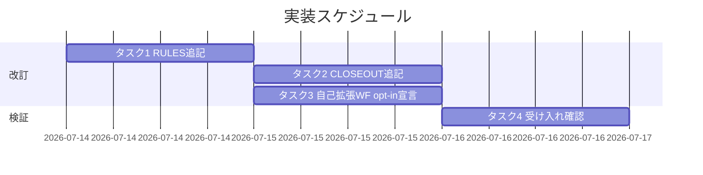

# 実装計画書: 完全自走スコープへの push・PR 作成明記

**プロジェクト名**: 完全自走スコープへの push・PR 作成明記
**作成日**: 2026 年 07 月 14 日
**最終更新**: 2026 年 07 月 14 日

> **重要**: **このドキュメントは常に更新**: 実装計画の変更、進捗状況の更新、バグの記録などがあった場合は、即座にこのドキュメントを更新してください。
> **必須項目**: 「必須」と明記した欄は空欄・抽象語のみで提出しないこと。
>
> **用語**: [.agent-skill-chain/source/CONCEPTS.md §用語規約](../../../../.agent-skill-chain/source/CONCEPTS.md#用語規約) を参照。

---

## 1. 実装概要

### 1.1 実装方針（必須）

02_設計 ADR-1/ADR-2/ADR-5/ADR-6/ADR-7 に従い、`RULES.md` §高リスク操作を単一正本として **opt-in トグル `AUTONOMOUS_SCOPE_COMMIT_PUSH_PR_ENABLED`（既定 `false`）背後の**事前承認みなし規定（commit・push・PR 作成、確認ゲート＝commit 前、既定無効時の挙動）を新規 `###` セクションとして追加する。`CLOSEOUT.md` §commit ステップの L15 は既定の「push はユーザーが明示したときのみ行う」を維持しつつ opt-in 有効時の commit ゲート前倒し・事前承認みなしを条件付き参照ポインタ 1 句で追記する。さらに `.agent-skill-chain/project/自己拡張ワークフロー.md` に本リポジトリでの opt-in 有効化宣言（`AUTONOMOUS_SCOPE_COMMIT_PUSH_PR_ENABLED=true`）を新規追記する。列挙・適用範囲の本文は RULES.md にのみ置き、二重定義を作らない。

### 1.2 実装順序（必須: 1 件以上）

1. タスク 1: RULES.md §高リスク操作へ opt-in トグル背後の新規セクションを追記（正本）。
2. タスク 2: CLOSEOUT.md §commit ステップへ opt-in 条件付き参照ポインタ 1 句を追記（既定 push 明示ゲートは維持）。
3. タスク 3: 自己拡張ワークフロー.md へ本リポジトリ向け opt-in 有効化設定を追記。
4. タスク 4: 受け入れ確認（grep による SC-1〜SC-7 の文言存在・非重複検証、目視）。



---

## 2. タスク分解

**必須**: 各タスクにテスト観点（2.x.3）と単体テスト仕様（BDD）（2.x.4）を記載する。本 issue は実行コードを持たないドキュメント改訂のため、単体テストは「grep による文言存在・非重複の機械検証」を BDD 形式で定義する。

### 2.1 タスク 1: RULES.md §高リスク操作への事前承認みなし規定の追記

#### 2.1.1 概要（必須）

`.agent-skill-chain/source/RULES.md` の §高リスク操作バレット（L31）と `### テスト戦略必須要件`（L33）の間に、02_設計 §3.1.4 の確定文言で新規 `###` セクションを挿入する。

#### 2.1.2 実装内容（必須: 1 件以上）

- `### 自律実行キーワード依頼下の commit・push・PR 作成（opt-in・既定無効の事前承認みなし）` セクションを新規追加する（02_設計 §3.1.4 の確定文言）。
- 本文に (a) **opt-in トグル（既定無効）**: env `AUTONOMOUS_SCOPE_COMMIT_PUSH_PR_ENABLED`（既定 `false`）を明示有効（`true`/`1`/`yes`/`on`）にした消費先でのみ発動し、未設定・無効時は既定の安全側挙動を完全維持する旨、(b) opt-in 化の理由（第三者同意の保全・既定値の向きが逆）、(c) 事前承認みなしの原則（有効時）、(d) 自律実行キーワード列挙（完走・完遂・自走・完全自走・auto mode ＋同義表現）、(e) 適用範囲（commit・push・PR 作成、PR 本文 `Closes #<番号>`/`Refs #<番号>` を含む）、(f) 対象外（main 直 push・force push・PR マージ／既存 enforcement 非変更）、(g) 確認のゲート＝commit 前（有効時・キーワードなし・曖昧時は commit を作成する前に確認。承認後は一連で進めてよい）、(h) 無効（既定）時の挙動、(i) 具体運用の project 委譲（相対リンク記法は既存 RULES.md L46 の現行慣習 `../.agent-skill-chain/project/自己拡張ワークフロー.md` に一致させる＝review-docs A10 準拠）、を箇条で記載する。

#### 2.1.3 テスト観点（必須）

**参照**: 観点の定義は [02_設計 §6](./02_設計.md) および [RULES のテスト戦略](../../../../.agent-skill-chain/source/RULES.md#テスト戦略必須要件) を参照。

##### 単体（本タスクの具体ケース・必須 1 件以上）

- 正常系: RULES.md に `AUTONOMOUS_SCOPE_COMMIT_PUSH_PR_ENABLED`・「opt-in」・「既定」（無効）の文言が新規セクション内に存在する（SC-6）。
- 正常系: RULES.md に「完走」「完遂」「自走」「完全自走」「auto mode」の全キーワードが新規セクション内に存在する（SC-1）。
- 正常系: 「事前承認とみなす」および「都度追加確認せず」に相当する文言が存在し、対象が「commit・push・PR 作成」である（SC-2）。
- 正常系: 「main」「force push」「マージ」が対象外として記載されている（SC-3）。
- 正常系: 「commit を作成する前」に「確認」する安全側既定（確認ゲート＝commit 前）が記載されている（SC-4）。
- 異常系・境界値: 該当なし（静的ドキュメント。分岐・境界値を持たない）。

##### 結合/API（該当時は必須 1 件以上）

- 該当なし（API・エンドポイントを持たない）。

##### E2E/受け入れ（未達時は理由記載）

- 主要シナリオ（キーワード依頼で自律 push、無キーワードで確認）は規約本文の判定基準として grep で確認する。実行系の E2E は対象なし（未達理由: 実行経路を持たないドキュメント改訂）。

##### バリデーション（該当する場合の具体ケース）

- 該当なし。

#### 2.1.4 単体テスト仕様（BDD）（必須）

**BDD 形式のテストケース（高レベル仕様）**:

```gherkin
Feature: RULES.md への opt-in 事前承認みなし規定の追記
  Scenario: opt-in トグル（既定無効）が正本に存在する
    Given RULES.md に §高リスク操作がある
    When 新規セクションを追記した後に文言を検証する
    Then env `AUTONOMOUS_SCOPE_COMMIT_PUSH_PR_ENABLED`・opt-in・既定無効・既定無効時の挙動が新規セクション内に存在する

  Scenario: 自律実行キーワード列挙が正本に存在する
    Given RULES.md に §高リスク操作がある
    When 新規セクションを追記した後に文言を検証する
    Then 「完走」「完遂」「自走」「完全自走」「auto mode」が全て新規セクション内に存在する

  Scenario: 適用範囲と対象外が明記されている
    Given 追記済み RULES.md
    When 文言を検証する
    Then commit・push・PR 作成が適用範囲、main 直 push・force push・PR マージが対象外として存在する

  Scenario: 確認ゲートが commit 前である
    Given 追記済み RULES.md
    When 安全側既定の文言を検証する
    Then opt-in 有効・キーワードなし／曖昧時は「commit を作成する前に」確認する旨が存在する
```

**テストコード例（インラインコメントで Given/When/Then を明記）**

言語非依存の grep で検証する（実行コードを持たないため）。

```bash
# Given: 追記済みの RULES.md（source が正本、消費者ランタイムへは配布時に反映）
FILE=.agent-skill-chain/source/RULES.md
# When: opt-inトグル・各キーワード・適用範囲・対象外・安全側既定の文言を grep で照合する
grep -q "AUTONOMOUS_SCOPE_COMMIT_PUSH_PR_ENABLED" "$FILE" \
  && grep -q "opt-in" "$FILE" && grep -q "既定" "$FILE"          # SC-6（opt-inトグル・既定無効）
grep -q "完走" "$FILE" && grep -q "完遂" "$FILE" && grep -q "自走" "$FILE" \
  && grep -q "完全自走" "$FILE" && grep -q "auto mode" "$FILE"   # SC-1
grep -q "事前承認" "$FILE" && grep -q "追加確認" "$FILE"          # SC-2
grep -q "force push" "$FILE" && grep -q "マージ" "$FILE"          # SC-3
grep -Eq "commit を作成する前.*確認|commit 前.*確認" "$FILE"     # SC-4（確認ゲート＝commit 前）
# Then: 全パターンがマッチすれば SC-1〜SC-4・SC-6 の文言存在を満たす（exit 0）
```

#### 2.1.5 依存関係

- なし（先行タスクなし）。

#### 2.1.6 見積もり

- **工数**: 0.5h
- **優先度**: 高

### 2.2 タスク 2: CLOSEOUT.md §commit ステップへの参照ポインタ追記

#### 2.2.1 概要（必須）

`.agent-skill-chain/source/CLOSEOUT.md` §commit ステップの L15 バレットを、02_設計 §3.2.2 の確定文言へ改訂する。**基底文言「push はユーザーが明示したときのみ行う」（既定＝未 opt-in の挙動）は維持**し、opt-in トグル `AUTONOMOUS_SCOPE_COMMIT_PUSH_PR_ENABLED` を有効化した消費先でのみ確認ゲートを commit 前へ前倒しし・自律実行キーワード依頼を事前承認とみなす旨の**条件付き参照ポインタ 1 句**を追記する（列挙・適用範囲の本文は複製しない）。

#### 2.2.2 実装内容（必須: 1 件以上）

- L15 の基底文言「**push はユーザーが明示したときのみ**行う（高リスク操作。[RULES.md](RULES.md) §高リスク操作 参照）」を**維持**する（既定＝未 opt-in の挙動）。
- 続けて「ただし opt-in トグル `AUTONOMOUS_SCOPE_COMMIT_PUSH_PR_ENABLED` を有効化した消費先プロジェクトでは、確認のゲートを commit 時点へ前倒しし（承認後は commit・push・PR 作成までを一連で遂行してよい）、かつ自律実行キーワードを含む依頼を commit・push・PR 作成の事前承認とみなす（列挙・適用範囲・opt-in 条件の正本は同 § を参照）。トグルが未設定・無効の場合は本行冒頭の push 明示ゲートがそのまま維持される」旨を条件付きで追記する。
- キーワード列挙・適用範囲・除外の本文は CLOSEOUT.md に**複製しない**（SC-5 の重複禁止）。

#### 2.2.3 テスト観点（必須）

**参照**: [02_設計 §6](./02_設計.md)。

##### 単体（本タスクの具体ケース・必須 1 件以上）

- 正常系: CLOSEOUT.md L15 に既定の基底文言「push はユーザーが明示したときのみ」が維持され、かつ opt-in トグル名 `AUTONOMOUS_SCOPE_COMMIT_PUSH_PR_ENABLED` と「事前承認とみなす」旨の条件付き参照句が存在する。
- 正常系（非重複）: CLOSEOUT.md にキーワード列挙（例:「auto mode」の 5 語すべて）が**複製されていない**（重複定義なし＝SC-5）。

##### 結合/API（該当時は必須 1 件以上）

- 該当なし。

##### E2E/受け入れ（未達時は理由記載）

- 該当なし（未達理由: 実行経路を持たないドキュメント改訂）。

##### バリデーション（該当する場合の具体ケース）

- 該当なし。

#### 2.2.4 単体テスト仕様（BDD）（必須）

```gherkin
Feature: CLOSEOUT.md の opt-in 条件付き参照ポインタ追記
  Scenario: 既定 push ゲートを維持し opt-in 条件付き参照ポインタが存在し本文が複製されていない
    Given CLOSEOUT.md §commit ステップ
    When L15 を改訂した後に文言を検証する
    Then 「push はユーザーが明示したときのみ」（既定）と opt-in トグル名・「事前承認とみなす」旨の条件付き句が存在し、かつキーワード列挙本文は複製されていない
```

**テストコード例（インラインコメントで Given/When/Then を明記）**

```bash
# Given: 改訂済みの CLOSEOUT.md
FILE=.agent-skill-chain/source/CLOSEOUT.md
# When: 既定ゲート維持・opt-in 条件付き参照句の存在と、列挙本文の非複製を検証する
grep -q "push はユーザーが明示" "$FILE"                        # 既定の push 明示ゲート維持
grep -q "AUTONOMOUS_SCOPE_COMMIT_PUSH_PR_ENABLED" "$FILE"      # opt-in トグルへの条件付き言及
grep -q "事前承認" "$FILE"                                    # 参照ポインタ存在
# Then: 列挙（完走/完遂/自走/完全自走/auto mode を並記する本文）が複製されていない
!  grep -q "auto mode" "$FILE"   # 列挙本文の非複製（正本は RULES.md のみ）＝SC-5
```

#### 2.2.5 依存関係

- タスク 1（正本の文言確定後に参照ポインタを整合させる）。

#### 2.2.6 見積もり

- **工数**: 0.2h
- **優先度**: 高

### 2.3 タスク 3: 自己拡張ワークフロー.md への本リポジトリ向け opt-in 有効化設定の追記

#### 2.3.1 概要（必須）

`.agent-skill-chain/project/自己拡張ワークフロー.md` に、本リポジトリでは opt-in トグル `AUTONOMOUS_SCOPE_COMMIT_PUSH_PR_ENABLED` を明示的に有効化する旨・env 名・既定値・設定方法・既定値が逆向きである理由（第三者同意）を定める新規セクションを追記する（02_設計 §3.3.2 の確定文言・ADR-7）。

#### 2.3.2 実装内容（必須: 1 件以上）

- `### 自律実行スコープの opt-in 有効化（AUTONOMOUS_SCOPE_COMMIT_PUSH_PR_ENABLED）` セクションを、既存の §8（`GITHUB_ISSUE_GATE_ENABLED`）等の無効化トグル記述と同じ体裁で追記する（配置は §8 直後、または無効化トグル群と並ぶ位置を推奨）。
- 本文に (a) 既定値 `false`（無効）・その理由（第三者同意の保全）、(b) 有効化方法（`AUTONOMOUS_SCOPE_COMMIT_PUSH_PR_ENABLED=true`。`1`/`yes`/`on` 同義）、(c) 他トグル（既定 `true`・無効化型）との違い＝既定値の向きが逆、(d) 本リポジトリでは明示的に有効化する旨、(e) CI 強制の非対象（行動トグル）、を箇条で記載する。
- 抽象原則の正本は RULES.md §自律実行キーワード依頼下の commit・push・PR 作成であり、本節は具体運用のみを定義する（配置境界・重複記載禁止。相対パスは `../source/RULES.md`）。

#### 2.3.3 テスト観点（必須）

##### 単体（本タスクの具体ケース・必須 1 件以上）

- 正常系: 自己拡張ワークフロー.md に `AUTONOMOUS_SCOPE_COMMIT_PUSH_PR_ENABLED`・「有効化」・「既定」（`false`/無効）の文言が存在する（SC-7）。
- 正常系: 本リポジトリで有効化する旨が既存トグルと逆向き（設定して有効化）で記載されている（目視）。

##### 結合/API・E2E・バリデーション

- 該当なし。

#### 2.3.4 単体テスト仕様（BDD）（必須）

```gherkin
Feature: 自己拡張ワークフロー.md への opt-in 有効化設定の追記
  Scenario: 本リポジトリでの opt-in 有効化宣言・env 名・既定値が存在する
    Given 自己拡張ワークフロー.md
    When opt-in 有効化セクションを追記した後に文言を検証する
    Then AUTONOMOUS_SCOPE_COMMIT_PUSH_PR_ENABLED・有効化・既定 false の旨が存在する
```

```bash
# Given: 追記済みの 自己拡張ワークフロー.md
FILE=.agent-skill-chain/project/自己拡張ワークフロー.md
# When: トグル名・有効化・既定値の文言を grep で照合する
grep -q "AUTONOMOUS_SCOPE_COMMIT_PUSH_PR_ENABLED" "$FILE"      # SC-7（トグル名）
grep -q "有効化" "$FILE" && grep -q "既定" "$FILE"            # SC-7（本リポで有効化・既定 false）
# Then: 全パターンがマッチすれば SC-7 の文言存在を満たす（exit 0）
```

#### 2.3.5 依存関係

- タスク 1（RULES.md 正本の env 名・既定値確定後に project 側の具体運用を整合させる）。

#### 2.3.6 見積もり

- **工数**: 0.3h
- **優先度**: 高

### 2.4 タスク 4: 受け入れ確認（grep・目視）

#### 2.4.1 概要（必須）

SC-1〜SC-7 の全成功基準を grep と目視で確認し、二重定義がないこと・安全側既定が残存していること・opt-in 既定無効（未 opt-in で挙動不変）が明記されていることを検証する。

#### 2.4.2 実装内容（必須: 1 件以上）

- タスク 1/2/3 の BDD テストコード例の grep を実行し全て成功することを確認する。
- 目視で、新規セクションが §高リスク操作の直後に配置され、既存の高リスク定義・通常作業の自立進行枠組みを弱めていないこと（SC-4 の非弱体化）、および opt-in 既定無効により未 opt-in 消費先の挙動が変わらないこと（SC-6）を確認する。

#### 2.4.3 テスト観点（必須）

##### 単体（本タスクの具体ケース・必須 1 件以上）

- SC-1〜SC-7 に対応する grep が全て期待どおり（存在すべき文言は存在、複製すべきでない本文は不在）。

##### 結合/API・E2E・バリデーション

- 該当なし。

#### 2.4.4 単体テスト仕様（BDD）（必須）

```gherkin
Feature: 受け入れ確認
  Scenario: SC-1〜SC-7 が全て満たされる
    Given タスク1・2・3 の改訂が完了している
    When SC-1〜SC-7 に対応する grep を実行する
    Then 全ての成功基準の文言条件が満たされる（存在／非複製）
```

```bash
# Given: タスク1・2・3 完了後の source／project ツリー
# When: SC 別 grep を順に実行（タスク1・2・3 のコード例を集約）
# Then: 全 grep が期待結果（存在/不在）を返せば受け入れ合格
```

#### 2.4.5 依存関係

- タスク 1、タスク 2、タスク 3。

#### 2.4.6 見積もり

- **工数**: 0.3h
- **優先度**: 高

---

## 2.9 要件（01）との対応表

| 成功基準 / BR | 対応タスク | 受け入れ確認方法 |
| ------------- | ---------- | ---------------- |
| SC-1（キーワード列挙） | タスク 1 | grep で 5 語（完走/完遂/自走/完全自走/auto mode）の存在確認 |
| SC-2（事前承認みなし・追加確認不要／対象＝commit・push・PR 作成／opt-in 有効時） | タスク 1 | grep「事前承認」「追加確認」「commit・push・PR 作成」 |
| SC-3（適用範囲限定・除外明記） | タスク 1 | grep「force push」「マージ」「main」＋目視 |
| SC-4（確認ゲート＝commit 前の残存・非弱体化／opt-in 有効時） | タスク 1・タスク 2・タスク 4 | grep「commit を作成する前」「確認」／CLOSEOUT の opt-in 条件付き句＋目視で既存枠組み維持 |
| SC-5（正本一元化・非重複） | タスク 1・タスク 2 | RULES に本文存在／CLOSEOUT に列挙本文不在を grep |
| SC-6（opt-in トグル・既定無効・未 opt-in で挙動不変） | タスク 1・タスク 4 | grep「AUTONOMOUS_SCOPE_COMMIT_PUSH_PR_ENABLED」「opt-in」「既定」（無効）＋目視で既定無効時挙動の記載 |
| SC-7（本リポジトリでの有効化設定） | タスク 3・タスク 4 | grep で 自己拡張ワークフロー.md にトグル名・「有効化」「既定 false」の存在確認 |
| BR-0（opt-in トグル・既定無効） | タスク 1・タスク 3 | SC-6・SC-7 と同じ |
| BR-1（キーワード列挙） | タスク 1 | SC-1 と同じ |
| BR-2（事前承認みなし＝commit・push・PR 作成／opt-in 有効時） | タスク 1 | SC-2 と同じ |
| BR-3（適用範囲＝commit・push・PR 作成） | タスク 1 | grep「Closes」「Refs」または PR 本文紐づけ文言 |
| BR-4（対象外＝main 直 push・force push・マージ） | タスク 1 | SC-3 と同じ |
| BR-5（確認ゲート＝commit 前・安全側の既定／opt-in 有効時） | タスク 1・タスク 2 | SC-4 と同じ |
| BR-6（正本一元化） | タスク 1・タスク 2 | SC-5 と同じ |
| BR-7（既存 enforcement 非変更） | タスク 1 | 目視で「記録義務・CI 検証は変更しない」旨を確認、audit.sh 無改訂 |

---

## テスト観点

本実装計画のテストは、実行コードを持たないドキュメント改訂であるため、grep による文言存在・非複製の機械検証と目視レビューで構成する。各タスク §2.x.3 に SC 対応の具体ケースを記載済み。

---

## 単体テスト

grep ベースの文言検証を単体テスト相当とする。各タスク §2.x.4 に BDD 仕様と bash grep コード例を記載済み。

---

## BDD

各タスクの §2.x.4 の Gherkin シナリオ一覧を正とする。Given/When/Then はドキュメント文言の存在・非複製に対応させている。

---

## 3. 実装スケジュール

### 3.1 マイルストーン

| マイルストーン | 期日 | 成果物 |
| -------------- | ---- | ------ |
| RULES.md 正本追記完了 | 2026-07-14 | 改訂 RULES.md（opt-in トグル背後の新規セクション） |
| CLOSEOUT.md 条件付き参照追記完了 | 2026-07-14 | 改訂 CLOSEOUT.md（既定 push ゲート維持＋opt-in 条件付き句） |
| 自己拡張ワークフロー.md opt-in 宣言・受け入れ確認完了 | 2026-07-14 | 改訂 自己拡張ワークフロー.md・grep 検証結果 |

### 3.2 実装フェーズ

#### フェーズ 1: 規約改訂

- **期間**: 即日
- **タスク**: タスク 1・タスク 2・タスク 3

#### フェーズ 2: 受け入れ確認

- **期間**: 即日
- **タスク**: タスク 4

---

## 4. テスト計画

テスト観点・BDD 形式の定義は 02_設計 §6 および RULES のテスト戦略を参照。本計画では各タスク §2.x.3/§2.x.4 に grep ベースの具体ケースを記載した。

### 4.1 テストの優先順位

- SC-6（opt-in 既定無効・未 opt-in で挙動不変＝第三者同意の保全）と SC-3（安全境界の非後退）、SC-5（非重複）を最優先で確認する（第三者への既定適用・波及・二重定義が最も影響が大きいため）。

---

## 5. リスク管理

### 5.1 実装リスク

- **リスク**: 新規セクションの見出しレベル（`###`）や配置位置を誤り、§高リスク操作から切り離される。
  - **対策**: §高リスク操作バレット（L31）直後・`### テスト戦略必須要件`（L33）直前に配置し、目視で確認する。
- **リスク**: CLOSEOUT.md に列挙本文を書きすぎて二重定義になる（SC-5 違反）。
  - **対策**: 追記はゲート改訂（commit 前）＋参照ポインタ 1 句に限定し、grep で「auto mode」等の列挙本文が CLOSEOUT.md に不在であることを確認する。
- **リスク**: opt-in トグルの既定値を誤って有効（`true`）と記載し、未 opt-in 消費先へ自律実行を既定適用してしまう（第三者同意問題の再発）。
  - **対策**: RULES.md 新規セクション冒頭で「既定無効（既定 `false`）」を明記し、grep（SC-6）で「既定」（無効）文言の存在を確認する。既存の無効化型トグル（既定 `true`）と混同しないよう、既定値の向きが逆である旨を本文に明記する。
- **リスク**: CLOSEOUT.md L15 の基底文言（既定 push 明示ゲート）を誤って無条件に commit ゲートへ書き換え、未 opt-in 消費先の挙動を変えてしまう。
  - **対策**: 基底文言「push はユーザーが明示したときのみ」を維持し、opt-in 有効時のみの条件付き句として追記する（grep で「push はユーザーが明示」の残存を確認）。
- **リスク**: Markdownlint 違反（見出し前後の空行等）。
  - **対策**: 既存 RULES.md/CLOSEOUT.md/自己拡張ワークフロー.md の見出し様式に合わせ、実装時に lint を確認する。

---

## 6. 参考資料

### プロジェクトドキュメント

- [`02_設計.md`](./02_設計.md) - 設計
- [`01_要件定義.md`](./01_要件定義.md) - 要件定義

### その他の参考資料

- 改訂対象: `.agent-skill-chain/source/RULES.md` §高リスク操作／`.agent-skill-chain/source/CLOSEOUT.md` §commit ステップ／`.agent-skill-chain/project/自己拡張ワークフロー.md`（本リポジトリでの opt-in 有効化宣言）

---

## 7. 前のステップ

この実装計画書は、以下のドキュメントを基に作成されています：

- **前**: [`02_設計.md`](./02_設計.md) - 設計フェーズ

---

## 8. 次のステップ

この実装計画書の承認後、以下のいずれかのステップに進みます：

- **本 issue は 1 つの改訂タスク群であり、サブ issue 分割は不要**（90_issues.md は作成しない）。
- **次**: 実装着手前の **review-docs（実装前ドキュメントレビュー）** を必須ゲートとして経る（本 command のスコープ外）。その後 implement-feature（execution）へ進む。

**用語**: [.agent-skill-chain/source/CONCEPTS.md §用語規約](../../../../.agent-skill-chain/source/CONCEPTS.md#用語規約) を参照。
