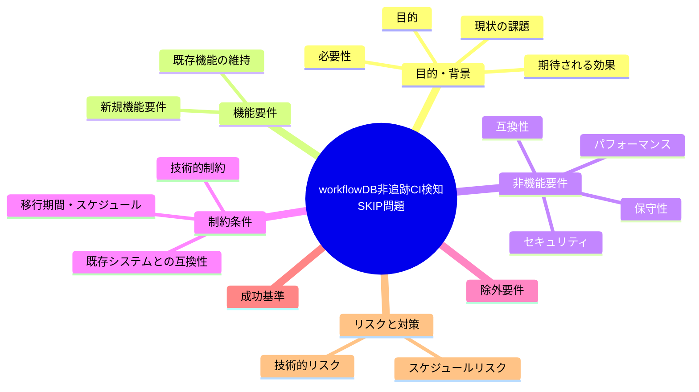

# 要求定義書: workflow.db 非追跡による CI 側 DB 系チェックの構造的全 SKIP

**プロジェクト名**: workflow.db 非追跡による CI 側 DB 系チェックの構造的全 SKIP
**作成日**: 2026年07月14日
**最終更新**: 2026年07月14日

---

## 要求定義の全体像

---

## 1. 目的・背景

### 1.1 目的（必須）

DB系チェックがCIで恒常的にSKIPされる構造を解消するか判断する

### 1.2 背景

出典: 2026-07-14 fableによる本システムの自己調査で検出。

- **現状の課題**:
  - 証跡DB（workflow.db）は Git 管理対象に含めない必須ルールになっている。
  - audit.sh の DB 系チェック（#3, #8〜#25, #29, #31〜#35 相当）は「DB 不在なら SKIP（fail-open）」という設計になっている。
  - CI はクリーンな checkout で走るため workflow.db が存在せず、証跡監査・因果監査・順序監査・実装前ゲート検知等が CI では絶対に発火しない。
  - 実質的な強制点はローカル pre-push（任意導入・`--no-verify` で回避可能）のみとなっている。

- **必要性**:
  - CI が「最後の砦」を自称する一方で、多数のチェックが CI では構造的に無効という状態は、A-1（CI audit 非ブロッキング化問題）と合わせて enforcement 機構全体の実効性を大きく損なう。
  - DB 系チェックを CI で有効化する手段（DB のアーティファクト化・CI 内再生成等）の要否検討が必要。

### 1.3 期待される効果（必須: 1 件以上）

- **効果 1**: DB 系チェック（#3, #8〜#25, #29, #31〜#35）が CI 上でも発火する、または「CI では DB 系チェックが構造的に SKIP される」旨が正本ドキュメントに明記され、実効的な検知経路（ローカル pre-push 等）が明示された状態になる（○/×で判定可能）。

---

## 2. 機能要件

### 2.1 既存機能の維持（該当する場合）

- workflow.db を Git 非追跡とする既存ルール自体は維持する（機微情報混入防止等の理由がある可能性があるため、対応方針は要検討）。

### 2.2 新規機能要件

- （対応する場合の選択肢）CI ワークフロー内で workflow.db を CI 実行時に再構築・アーティファクトとして受け渡す仕組みの検討。または、DB 系チェックが CI では発火しない旨と、その代替担保手段（ローカル pre-push の必須化等）を正本ドキュメントに明記する。

---

## 3. 非機能要件

### 3.1 パフォーマンス

- 特になし。

### 3.2 セキュリティ

- workflow.db に機微情報が含まれる可能性がある場合、CI へのアーティファクト受け渡しには注意が必要。

### 3.3 互換性

- 既存の「workflow.db は非追跡」という設計思想との整合を保つ必要がある。

### 3.4 保守性

- ドキュメント（enforcement/README.md）の記載と実際の CI 動作の一致を保つ。

---

## 4. 制約条件

### 4.1 技術的制約

- workflow.db は消費者ランタイム生成物であり `.gitignore` 対象（本リポジトリの設計方針）。

### 4.2 既存システムとの互換性

- A-1（CI audit 非ブロッキング化問題）と密接に関連するため、対応順序の検討が必要。

### 4.3 移行期間・スケジュール

- 未定（対応要否は本 issue 起票後に判断）。

---

## 5. 除外要件

- pre-push フックの必須化・強制導入自体は対象外（別課題として扱う）。

---

## 6. 成功基準（必須: 1 件以上）

- DB 系チェックが CI で発火するようになる、または「CI では発火しない」旨と代替担保手段が正本ドキュメントに明記されている。

---

## 7. リスクと対策

### 7.1 技術的リスク

- **リスク**: DB を CI 側で再構築する場合、ローカルとの状態不整合や機微情報の意図しない露出が起きうる。
  - **対策**: アーティファクト化する場合は内容を精査し、必要に応じてサニタイズする。

### 7.2 スケジュールリスク

- **リスク**: 対応要否がユーザー判断待ちのため着手時期未定。
  - **対策**: 本 issue を起票済みとして保持し、優先度判断を待つ。

---

## 8. 参考資料

### プロジェクトドキュメント

- なし

### その他の参考資料

- `.agent-skill-chain/source/enforcement/README.md:161`（workflow.db 非追跡）
- `.agent-skill-chain/source/enforcement/ci/audit.sh`（各 check の DB 不在時 early return）
- `.agent-skill-chain/source/enforcement/README.md:237-249`

---

## 9. 次のステップ

この要求定義書の承認後、対応要否をユーザーが判断し、対応する場合は以下のドキュメントを作成します：

- **次**: `01_要件定義.md` - 要件定義フェーズ
