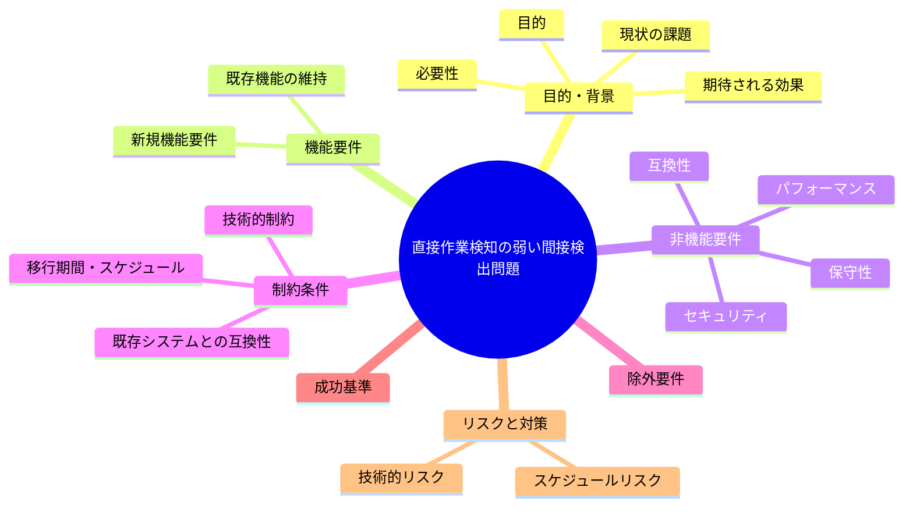

# 要求定義書: #25（メイン直接作業検知）の「1件でも記録があれば永久PASS」問題

**プロジェクト名**: #25（メイン直接作業検知）の「1件でも記録があれば永久PASS」問題
**作成日**: 2026年07月14日
**最終更新**: 2026年07月14日

---

## 要求定義の全体像

---

## 1. 目的・背景

### 1.1 目的（必須）

check_25の永久PASS問題を解消するか判断する

### 1.2 背景

出典: 2026-07-14 fableによる本システムの自己調査で検出。

- **現状の課題**:
  - `check_25_main_did_real_work()`（失敗条件#25「メイン直接作業・絶対強制」の検出）は、「差分に成果物変更があり、かつ workflow_log の対象 command 行数が 0 件」の場合のみ FAIL する設計になっている。
  - workflow.db は累積型のため、過去に対象 command のログが 1 件でも存在すれば、それ以降のどんな直接編集も検出されなくなる（時系列・対象差分との対応関係を見ていない）。
  - さらに A-2 の問題により CI では workflow.db 自体が不在で常に SKIP されるため、実運用ではこの検知はほぼ機能していない。

- **必要性**:
  - 「絶対強制」と位置付けられる失敗条件が、実質的にほぼ常に PASS する弱い検知になっている状態は、A-1・A-2 と合わせて enforcement 機構の実効性を損なう主要因の一つである。

### 1.3 期待される効果（必須: 1 件以上）

- **効果 1**: check_25 が対象差分と時系列的に対応する workflow_log の有無を検証する、より厳密な検知に改善される、または現状の検知強度が意図的な設計判断である旨が正本ドキュメントに明記される（○/×で判定可能）。

---

## 2. 機能要件

### 2.1 既存機能の維持（該当する場合）

- check_25 のチェック自体（差分 × workflow_log の突合）という基本方針は維持する。

### 2.2 新規機能要件

- （対応する場合）差分対象コミット・時間帯と対応する workflow_log エントリの存在を突合するロジックへの改善検討。

---

## 3. 非機能要件

### 3.1 パフォーマンス

- 特になし。

### 3.2 セキュリティ

- 特になし。

### 3.3 互換性

- 既存の workflow_log スキーマとの整合が必要。

### 3.4 保守性

- 検知ロジックの複雑化に伴うメンテナンス性への影響を考慮する。

---

## 4. 制約条件

### 4.1 技術的制約

- A-2（workflow.db 非追跡による CI 側 SKIP）が解消されない限り、check_25 の改善自体も CI では発火しない。

### 4.2 既存システムとの互換性

- 既存の workflow_log フォーマットとの整合が必要。

### 4.3 移行期間・スケジュール

- 未定（対応要否は本 issue 起票後に判断）。

---

## 5. 除外要件

- workflow.db の CI 非追跡問題自体への対応は対象外（A-2 で扱う）。

---

## 6. 成功基準（必須: 1 件以上）

- check_25 が対象差分と時系列的に対応する記録の有無を検証するよう改善される、または現状仕様が意図的である旨が文書化される。

---

## 7. リスクと対策

### 7.1 技術的リスク

- **リスク**: 検知ロジックを厳密化すると誤検知（false positive）が増える可能性がある。
  - **対策**: 対応する場合は既存の正常フローでの回帰確認を行う。

### 7.2 スケジュールリスク

- **リスク**: 対応要否がユーザー判断待ちのため着手時期未定。
  - **対策**: 本 issue を起票済みとして保持し、優先度判断を待つ。

---

## 8. 参考資料

### プロジェクトドキュメント

- なし

### その他の参考資料

- `.agent-skill-chain/source/enforcement/ci/audit.sh`（`check_25_main_did_real_work()`）
- `.agent-skill-chain/source/enforcement/README.md:14, 240, 293`

---

## 9. 次のステップ

この要求定義書の承認後、対応要否をユーザーが判断し、対応する場合は以下のドキュメントを作成します：

- **次**: `01_要件定義.md` - 要件定義フェーズ
