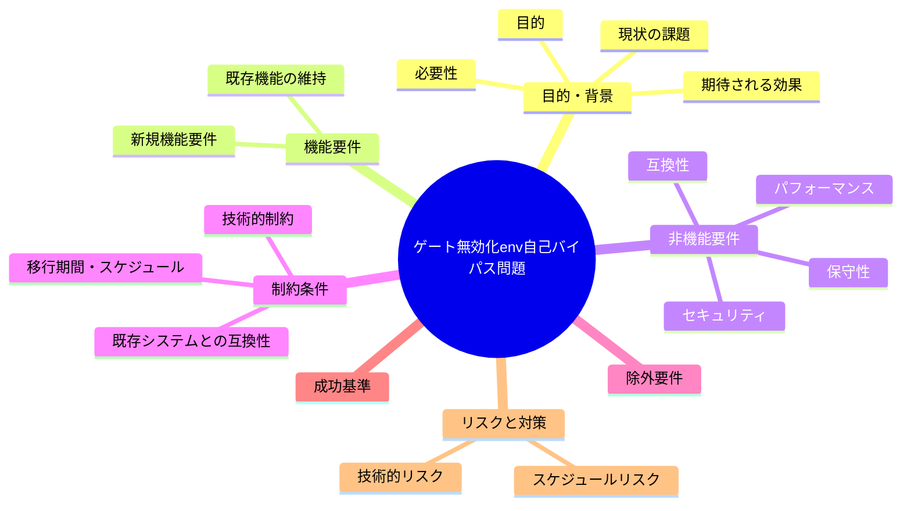

# 要求定義書: ゲート無効化 env・grandfather env による自己バイパスの容易さ

**プロジェクト名**: ゲート無効化 env・grandfather env による自己バイパスの容易さ
**作成日**: 2026年07月14日
**最終更新**: 2026年07月14日

---

## 要求定義の全体像

---

## 1. 目的・背景

### 1.1 目的（必須）

ゲート無効化envの自己バイパスリスクを低減するか判断する

### 1.2 背景

出典: 2026-07-14 fableによる本システムの自己調査で検出。

- **現状の課題**:
  - #32/#33/#34/#35/#36 の各ゲートは、発効日・無効化トグルをすべて env 上書き可能としている。
  - ゲートの無効化がenv変数による自己申告ベースの制御に依存しており、audit をローカル・pre-push で実行する実行主体（AI エージェント自身）がそのenv変数の値を設定できてしまう構造になっているため、該当チェックを自ら SKIP させることが可能である。
  - トグル設定の統制（誰が・いつ・どういう手続きで設定してよいか）が未定義であり、AI エージェント自身が自己判断でゲートを無効化する余地が残っている。

- **必要性**:
  - トグル自体は正当な運用ニーズ（GitHub 非採用環境等）のために必要だが、設定権限・変更履歴の統制が無いと、意図しない自己バイパスの温床になる。

### 1.3 期待される効果（必須: 1 件以上）

- **効果 1**: ゲート無効化 env の設定を誰が・どのタイミングで行ってよいかの運用ルール（例: 人間の明示的指示のみで設定可能、AI エージョンが自律的に設定することを禁止する等）が明文化される（○/×で判定可能）。

---

## 2. 機能要件

### 2.1 既存機能の維持（該当する場合）

- GitHub 非採用環境等での正当なトグル運用（env によるゲート無効化）自体は維持する。

### 2.2 新規機能要件

- （対応する場合）AI エージェントが自律的にゲート無効化 env を設定・変更することを禁止する運用ルールの明文化、および可能であれば設定変更の監査ログ化の検討。

---

## 3. 非機能要件

### 3.1 パフォーマンス

- 特になし。

### 3.2 セキュリティ

- 自己バイパスによる enforcement 機構の無力化リスクを低減する。

### 3.3 互換性

- 既存の正当なトグル運用（GitHub 非採用環境でのゲート無効化等）との整合を保つ。

### 3.4 保守性

- ルールの明文化により運用の一貫性を確保する。

---

## 4. 制約条件

### 4.1 技術的制約

- env 変数はシェル環境で自由に設定可能であり、技術的な強制（AI エージェントが設定できないようにする）は困難な場合がある。運用ルール・行動規範レベルでの対応が中心となる可能性が高い。

### 4.2 既存システムとの互換性

- 既存の `AGENT_CONDUCT.md` 等の行動規範との整合が必要。

### 4.3 移行期間・スケジュール

- 未定（対応要否は本 issue 起票後に判断）。

---

## 5. 除外要件

- トグル機構自体の廃止は対象外（正当な運用ニーズがあるため）。

---

## 6. 成功基準（必須: 1 件以上）

- ゲート無効化 env の設定権限・手続きに関する運用ルールが正本ドキュメントに明記される。

---

## 7. リスクと対策

### 7.1 技術的リスク

- **リスク**: 技術的強制が困難なため、ルール明文化のみでは実効性が限定的な可能性がある。
  - **対策**: 対応する場合は、可能な範囲での監査ログ化・レビュー時のトグル差分チェック等の補完策を検討する。

### 7.2 スケジュールリスク

- **リスク**: 対応要否がユーザー判断待ちのため着手時期未定。
  - **対策**: 本 issue を起票済みとして保持し、優先度判断を待つ。

---

## 8. 参考資料

### プロジェクトドキュメント

- なし

### その他の参考資料

- `.agent-skill-chain/source/enforcement/ci/audit.sh:64-92`
- `.agent-skill-chain/project/自己拡張ワークフロー.md:129-137`

---

## 9. 次のステップ

この要求定義書の承認後、対応要否をユーザーが判断し、対応する場合は以下のドキュメントを作成します：

- **次**: `01_要件定義.md` - 要件定義フェーズ
