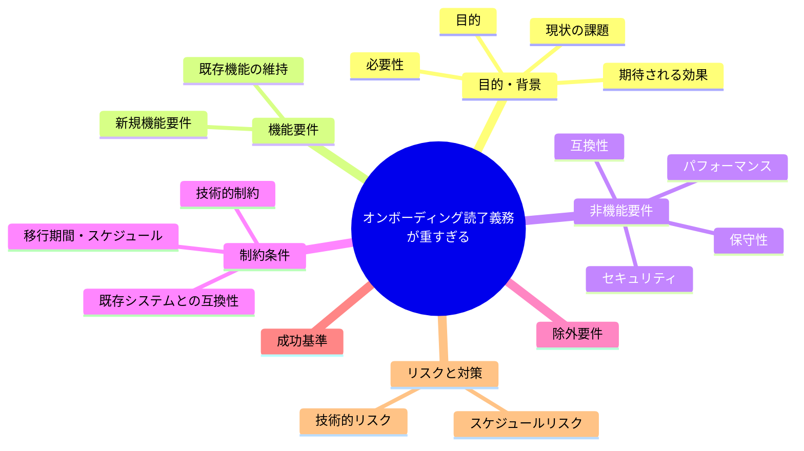
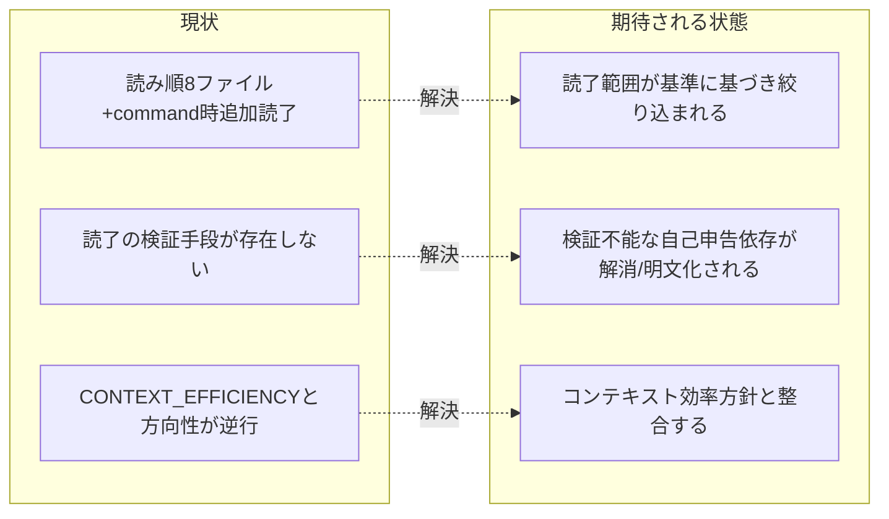

# 要求定義書: オンボーディング読了義務が重すぎる

**プロジェクト名**: オンボーディング読了義務が重すぎる
**作成日**: 2026 年 07 月 14 日
**最終更新**: 2026 年 07 月 14 日

> **重要**:
>
> - 要求定義書は、プロジェクトの全体像を把握するためのものです。詳細な技術仕様や実装方法は要件定義書以降で記載します。必要最低限の情報に収めることを心掛けてください。
> - **このドキュメントは常に更新**: 要求の変更や追加があった場合は、即座にこのドキュメントを更新してください。ドキュメントは「生きているドキュメント」として扱い、実装内容と常に同期させます。
> - **必須項目**: 以下の「必須」と明記した項目は空欄・抽象語のみ（例: 「{説明}」のまま）で提出しないこと。判定可能な形（目的は1文・成功基準は○/×で判定できる記載等）で記入すること。
>
> **用語**: [.agent-skill-chain/source/CONCEPTS.md §用語規約](../../../../.agent-skill-chain/source/CONCEPTS.md#用語規約) を参照。

---

## 要求定義の全体像

**注意**:

- 上記の「プロジェクト名」は例です。実際のプロジェクト名に置き換えてください。
- マインドマップは全体像を把握するためのものです。主要なセクション名程度に留め、詳細は記載しないでください。

---

## 1. 目的・背景

### 1.1 目的（必須）

オンボーディング読了義務の分量と検証手段の不在を見直す。

### 1.2 背景

2026-07-14 fable による本システムの自己調査で検出。

- **現状の課題**:
  - AGENTS.md の読み順表だけで8ファイル、command 実行時はさらに run_command＋command＋各 skill＋テンプレート＋project/ の読了が義務付けられている。
  - CORE は「読了するまでワークフロー開始禁止」と定めるが、読了自体の証跡・検証手段が存在しない。
  - source 配下は102ファイル・約23,411語にのぼり、コンテキストウィンドウ節約を説く CONTEXT_EFFICIENCY の方向性と逆行している。

- **必要性**:
  - 読了義務の実効性（本当に読まれているか検証不能な自己申告依存）と、量の妥当性を見直す必要がある。

### 1.3 期待される効果（必須: 1 件以上）

- **効果 1**: オンボーディング読了義務の対象範囲・分量が明文化された基準に基づいて絞り込まれる、または現状維持の場合はその根拠が明文化される。
- **効果 2**: 読了義務とコンテキスト効率方針（CONTEXT_EFFICIENCY）の間の矛盾が解消される。

**現状と期待される状態の比較**（必要に応じて）:

---

## 2. 機能要件

### 2.1 既存機能の維持（該当する場合）

読了義務が担保する品質（規約遵守）自体は維持する。

### 2.2 新規機能要件

{対応方針は 01 要件定義以降で検討。本書では課題の提起に留める}

---

## 3. 非機能要件

### 3.1 パフォーマンス

- 委譲パケット・コンテキスト消費量の削減を検討対象に含める。

### 3.2 セキュリティ

- {該当なし}

### 3.3 互換性

- 既存の規約遵守レベルを大きく低下させないこと。

### 3.4 保守性

- {01 要件定義以降で検討}

---

## 4. 制約条件

### 4.1 技術的制約

- {01 要件定義以降で検討}

### 4.2 既存システムとの互換性

- 既存の LOAD_POLICY・CORE の読み順定義との整合を保つこと。

### 4.3 移行期間・スケジュール

- {未定}

---

## 5. 除外要件

対応方針の具体設計・実装（本 issue は課題の起票のみ）。

---

## 6. 成功基準（必須: 1 件以上）

- オンボーディング読了義務の対象範囲・分量について、現状維持または縮小のいずれかの方針が明文化された基準とともに確定していること。

---

## 7. リスクと対策

### 7.1 技術的リスク

- **リスク**: 読了義務を緩めることで規約違反・品質低下が増える可能性がある。
  - **対策**: 読了範囲の絞り込みと、重要ルールの機械的強制（enforcement）への置き換えを併用する等、01 以降で検討する。

### 7.2 スケジュールリスク

- **リスク**: {特になし}
  - **対策**: {特になし}

---

## 8. 参考資料

### プロジェクトドキュメント

- 既存プロジェクトの場合は、[`00_システム理解.md`](./00_システム理解.md) - システム理解を参照

### その他の参考資料

- `AGENTS.md:76-91`
- `.agent-skill-chain/source/boot/CORE.md:121`
- `.agent-skill-chain/source/boot/LOAD_POLICY.md`
- `.agent-skill-chain/source/enforcement/README.md:233`

---

## 9. 次のステップ

この要求定義書の承認後、以下のドキュメントを作成します：

- **次**: [`01_要件定義.md`](./01_要件定義.md) - 要件定義フェーズ
