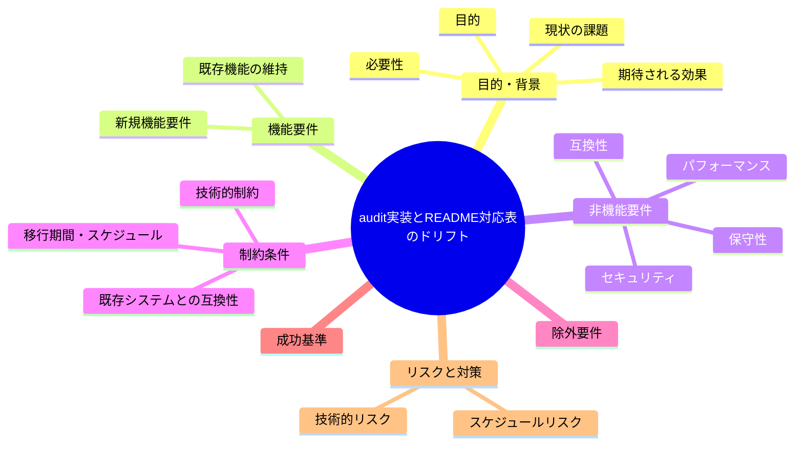

# 要求定義書: audit.sh #37 等が enforcement/README の失敗条件対応表に未掲載（ルール正本と実装のドリフト）

**プロジェクト名**: audit.sh #37 等が enforcement/README の失敗条件対応表に未掲載（ルール正本と実装のドリフト）
**作成日**: 2026年07月14日
**最終更新**: 2026年07月14日

---

## 要求定義の全体像

---

## 1. 目的・背景

### 1.1 目的（必須）

正本ドキュメントと実装のチェック項目一覧を一致させるか判断する

### 1.2 背景

出典: 2026-07-14 fableによる本システムの自己調査で検出。

- **現状の課題**:
  - `audit.sh` は #37（docs 配下の作業用 issue フォルダ参照禁止）を実装済みだが、`enforcement/README.md` の各種対応表はいずれも #36 で終わっており #37 の行が無い。
  - `enforcement/README.md` 自身が「audit.sh および subagent-guard が同一のルールを参照する」と宣言しているにもかかわらず、README（正本）が実装（audit.sh）に追随していない。
  - 対応表には #2・#4・#7・#21 の行も欠けている。

- **必要性**:
  - 正本ドキュメントと実装のチェック項目リストが乖離していると、利用者・保守者がチェック内容を正確に把握できず、追加・変更時の見落としリスクが高まる。

### 1.3 期待される効果（必須: 1 件以上）

- **効果 1**: `enforcement/README.md` の失敗条件対応表に #2・#4・#7・#21・#37 を含む audit.sh 実装済みの全チェック項目が漏れなく記載される（○/×で判定可能）。

---

## 2. 機能要件

### 2.1 既存機能の維持（該当する場合）

- 既存の対応表フォーマット・記載項目は維持する。

### 2.2 新規機能要件

- （対応する場合）audit.sh 実装済みチェック項目と enforcement/README.md 対応表の突合・不足行の追記。

---

## 3. 非機能要件

### 3.1 パフォーマンス

- 特になし。

### 3.2 セキュリティ

- 特になし。

### 3.3 互換性

- 既存の対応表フォーマットとの整合が必要。

### 3.4 保守性

- 今後、audit.sh にチェックを追加する際に README 対応表への追記を同時に行う運用ルール（レビューチェックリスト等）の要否検討。

---

## 4. 制約条件

### 4.1 技術的制約

- 特になし。

### 4.2 既存システムとの互換性

- 既存の対応表番号体系との整合が必要。

### 4.3 移行期間・スケジュール

- 未定（対応要否は本 issue 起票後に判断）。

---

## 5. 除外要件

- audit.sh のチェックロジック自体の変更は対象外（ドキュメント記載の整合のみが対象）。

---

## 6. 成功基準（必須: 1 件以上）

- audit.sh に実装済みの全チェック項目（#2・#4・#7・#21・#37 を含む）が enforcement/README.md の対応表に漏れなく記載される。

---

## 7. リスクと対策

### 7.1 技術的リスク

- **リスク**: 突合作業の過程で他の未記載項目が追加で発見される可能性がある。
  - **対策**: 対応する場合は audit.sh 全関数と README 対応表の網羅的な突合を行う。

### 7.2 スケジュールリスク

- **リスク**: 対応要否がユーザー判断待ちのため着手時期未定。
  - **対策**: 本 issue を起票済みとして保持し、優先度判断を待つ。

---

## 8. 参考資料

### プロジェクトドキュメント

- なし

### その他の参考資料

- `.agent-skill-chain/source/enforcement/ci/audit.sh:39, 93-98, 1265`
- `.agent-skill-chain/source/enforcement/README.md:227-304`（#37 の行が無い）

---

## 9. 次のステップ

この要求定義書の承認後、対応要否をユーザーが判断し、対応する場合は以下のドキュメントを作成します：

- **次**: `01_要件定義.md` - 要件定義フェーズ
