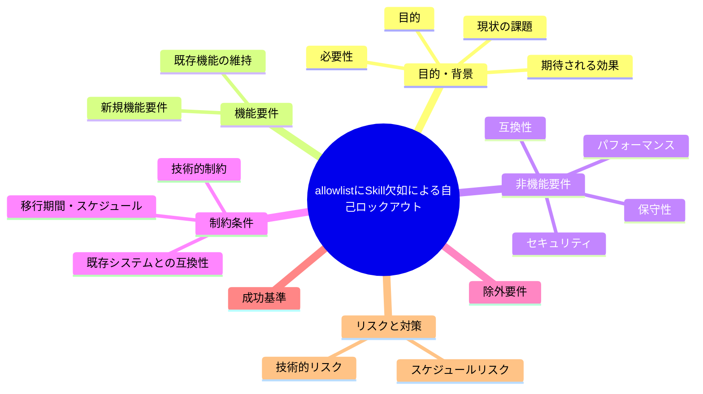

# 要求定義書: orchestrator 許可ツール allowlist に Skill が無く委譲経路と矛盾（自己ロックアウトリスク）

**プロジェクト名**: orchestrator 許可ツール allowlist に Skill が無く委譲経路と矛盾（自己ロックアウトリスク）
**作成日**: 2026年07月14日
**最終更新**: 2026年07月14日

---

## 要求定義の全体像

---

## 1. 目的・背景

### 1.1 目的（必須）

orchestrator allowlistへSkillツールを追加するか判断する

### 1.2 背景

出典: 2026-07-14 fableによる本システムの自己調査で検出。

- **現状の課題**:
  - R2 の許可ツール allowlist は `Read|Grep|Glob|LS|list_dir|Task|Agent|mcp_task|ReadLints|fetch_mcp_resource|list_mcp_resources|AskUserQuestion` のみであり、`Skill` が含まれていない。
  - 本フレームワークの Claude Code 配備では command 実行の入口が Skill ツール（`.claude/skills/agent`）であり、CLAUDE.md も「command 実行時は run_command と commands/{name}.md を読むこと」としている。
  - `enforce on` 環境では orchestrator の Skill 呼び出しが `*)` （デフォルト分岐）に落ち、fail-closed でブロックされる可能性があり、過去に発生した Agent ツール未追従ロックアウト（`feedback_enforce-on-lockout-incident` メモリ参照）と同型の自己ロックアウトが再発しうる。

- **必要性**:
  - フレームワーク自身が要求する正規の委譲経路（Skill 経由の command 実行）が enforce 機構によってブロックされる状態は、機構自体の自己矛盾であり早期の是正検討が必要。

### 1.3 期待される効果（必須: 1 件以上）

- **効果 1**: `enforce on` 環境下で orchestrator が `Skill` ツールを用いて command（agent skill chain）を正常に呼び出せる状態になる（○/×で判定可能）。

---

## 2. 機能要件

### 2.1 既存機能の維持（該当する場合）

- 既存の R2 allowlist に含まれる他ツール（Read/Grep/Glob/Task/Agent 等）の許可は維持する。

### 2.2 新規機能要件

- （対応する場合）R2 allowlist へ `Skill` を追加する、または `Skill` 呼び出し専用の許可分岐を PreToolUse.sh に追加する。

---

## 3. 非機能要件

### 3.1 パフォーマンス

- 特になし。

### 3.2 セキュリティ

- `Skill` を無条件許可すると想定外の skill 実行を許してしまうリスクがあるため、許可範囲（agent skill のみ等）の検討が必要。

### 3.3 互換性

- 既存の R2 allowlist・fail-closed 設計思想との整合を保つ必要がある。

### 3.4 保守性

- 新規ツール追加時に allowlist への追従漏れが起きないよう、チェックリスト化等の運用改善の要否検討。

---

## 4. 制約条件

### 4.1 技術的制約

- `PreToolUse.sh:237-266` 付近の分岐ロジックの変更が必要になる可能性がある。

### 4.2 既存システムとの互換性

- 既存の fail-closed 設計（未知ツールはブロック）との整合を保ちつつ、正規の委譲経路のみを許可する必要がある。

### 4.3 移行期間・スケジュール

- 未定（対応要否は本 issue 起票後に判断）。

---

## 5. 除外要件

- Skill ツール自体の権限モデルの再設計は対象外（allowlist への追加が対象）。

---

## 6. 成功基準（必須: 1 件以上）

- `enforce on` 環境で orchestrator の `Skill(agent)` 呼び出しがブロックされずに実行できる。

---

## 7. リスクと対策

### 7.1 技術的リスク

- **リスク**: `Skill` を allowlist に追加する際、意図しない skill まで許可してしまう可能性がある。
  - **対策**: 対応する場合は許可範囲を `agent` skill 等の必要最小限に限定する設計を検討する。

### 7.2 スケジュールリスク

- **リスク**: 対応要否がユーザー判断待ちのため着手時期未定。
  - **対策**: 本 issue を起票済みとして保持し、優先度判断を待つ。

---

## 8. 参考資料

### プロジェクトドキュメント

- なし

### その他の参考資料

- `.agent-skill-chain/source/enforcement/claude/PreToolUse.sh:237-266`
- `.claude/skills/agent/SKILL.md`
- `.agent-skill-chain/source/enforcement/claude/PreToolUse.sh:244-245`（自己注意書き）

---

## 9. 次のステップ

この要求定義書の承認後、対応要否をユーザーが判断し、対応する場合は以下のドキュメントを作成します：

- **次**: `01_要件定義.md` - 要件定義フェーズ
